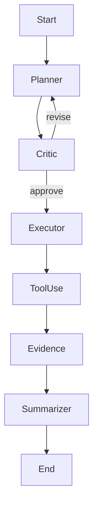

# Maestro Orchestrator — World‑Class Epics & Thin Design Docs (v1)

**Date:** 2025‑09‑01  
**Owner:** Brian Long (PM/Chief Ethical Technology Strategist)  
**Engineering Leads:** Platform: ☐, Runtime: ☐, UI: ☐, DevEx: ☐  
**Repo:** `intelgraph/` mono (Maestro packages + deploy)  
**Context:** This pack operationalizes six priority upgrades to push Maestro to world‑class orchestration of heterogeneous models/agents with policy, provenance, and efficiency at scale.

---

## Table of Contents

1. Epic A — Portfolio Model Router (LiteLLM‑backed)
2. Epic B — Agent Graph Templates (Planner/Executor, Debate, Critique‑Improve, Toolformer)
3. Epic C — vLLM + Ray Serve Inference Lane (High‑Utilization Serving)
4. Epic D — EvalOps (Golden Tasks, Scorecards, Autonomy Gating)
5. Epic E — OpenTelemetry Normalization (Traces, Metrics, Logs)
6. Epic F — Progressive Delivery for Agents & Prompts (Canary + Auto‑Rollback)
7. Optional Epic G — Asset Graph for Everything (Dagster‑style)
8. Release & Rollout Plan
9. Issue Templates, Labels, and Project Board Columns
10. RACI, Risks, and Guardrails
11. Glossary & Conventions

---

## Epic A — Portfolio Model Router (LiteLLM‑backed)

**Problem**  
We need multi‑objective routing across providers/models to optimize quality, latency, cost, reliability, and sovereignty—per step.

**Goals**

- Per‑step dynamic routing with fallback and content‑based model selection.
- Central cost/latency/quality objectives; respect policy tags (PII, jurisdiction, export controls).
- Global + project‑scoped routing policies; hot‑reload without redeploy.

**Non‑Goals**

- Building a bespoke gateway from scratch; we will integrate **LiteLLM Router** and extend with Maestro policies.

**Architecture Overview**

```mermaid
flowchart LR
  UI -->|task| Orchestrator
  Orchestrator -->|policy check| PolicyOPA[(OPA/ABAC)]
  Orchestrator -->|route request| Router[LiteLLM Router]
  Router -->|provider A| OpenAI
  Router -->|provider B| Anthropic
  Router -->|on‑prem| vLLM
  Router -->|NIM| NVIDIA NIM
  Router -->|fallback| Backup[*]
  Router --> Telemetry((OTEL))
  PolicyOPA --> Telemetry
```

**Config Spec (example)**

```yaml
# deploy/router/litellm.yaml
model_list:
  - model_name: gpt-4o
    litellm_params: { model: openai/gpt-4o }
  - model_name: sonnet-3.7
    litellm_params: { model: anthropic/claude-3.7-sonnet }
  - model_name: ig-local-70b
    litellm_params: { model: vllm/Meta-Llama-3.1-70B-Instruct }
router:
  strategy: multi_objective
  objectives:
    [quality, p95_latency_ms, cost_per_1k_tokens, reliability, sovereignty]
  fallbacks:
    - primary: gpt-4o
      on_error: [sonnet-3.7, ig-local-70b]
policies:
  content_tags:
    pii: [ig-local-70b] # keep in‑house
    export_ctrl: [sonnet-3.7] # example; customize per legal
telemetry:
  otel_exporter: http://otel-collector:4317
```

**Policy Enforcement (OPA/Rego snippet)**

```rego
package maestro.routing

default allow = false

allow {
  input.step_tags[_] == "pii"
  input.selected_model == "ig-local-70b"
}

allow {
  not input.step_tags[_] == "pii"
}
```

**API Additions**

- `POST /route/choose` — returns `{model, provider, rationale, costs, SLO_forecast}`
- `X-Maestro-Objectives: quality,latency,cost` header to bias per request.

**Stories**

- A1. Integrate LiteLLM Router as a sidecar/service; env/Helm values.
- A2. Policy gate: step tags → OPA; disallow non‑compliant routes.
- A3. Fallback chains + circuit breakers per provider.
- A4. Per‑step routing hints (draft/finalization) + automatic content tagging.
- A5. Telemetry: emit spans (`maestro.route.choose`) + counters for route decisions.
- A6. UI: Route Decision Panel (model chosen, reasons, cost/latency projection).
- A7. Docs & runbooks; chaos tests for provider brownouts.

**Acceptance Criteria**

- 99% of calls receive a decision < 50ms p95 in‑cluster.
- Auto‑fallback success rate > 98% during injected brownouts.
- Cost per 1k tokens reduced ≥ 15% vs baseline with equal/better eval score.
- All PII‑tagged steps keep data in approved jurisdictions.

**Definition of Done**

- Helm chart, envs (dev/stage/prod), SLOs, dashboards, runbooks, unit+e2e tests, security review.

---

## Epic B — Agent Graph Templates (Planner/Executor, Debate, Critique‑Improve, Toolformer)

**Problem**  
Teams repeatedly implement the same multi‑agent patterns without standard state, recovery, or HITL.

**Goals**

- First‑class **Agent Graph** with persistent state; resumable threads.
- Built‑in patterns with **HITL gates** for autonomy L2–L4.
- Cost preview & risk budgets at every node.

**Architecture**



**State & Storage**

- `agent_runs` (Postgres) with JSONB state + provenance IDs.
- Blob store for artifacts; link to Evidence Register.

**Stories**

- B1. Agent Graph SDK (`@maestro/agents`): node contracts, retries, budgets.
- B2. Built‑in patterns + YAML recipes with tool declarations.
- B3. HITL widget in UI (Approve / Edit / Block).
- B4. Cost preview; SLO burn forecast pre‑execute.
- B5. Persist/restore; crash‑safe checkpoints.
- B6. Policy hooks on transitions (OPA on `before_execute`).

**Acceptance Criteria**

- Resume from failure point with ≤ 1 step replay.
- HITL decision latency < 250ms p95.
- Recipes definable in YAML + visualized in UI.

---

## Epic C — vLLM + Ray Serve Inference Lane (High‑Utilization Serving)

**Problem**  
We need a high‑throughput, low‑latency serving plane for self‑hosted models with continuous batching and autoscaling.

**Goals**

- **vLLM** for paged attention + continuous batching; **Ray Serve** for autoscale/composition.
- Expose utilization metrics (batch size, queue depth, KV hit ratio) to Maestro.

**K8s Deploy Sketch**

```yaml
# deploy/serving/vllm-rayserve.yaml (excerpt)
apiVersion: ray.io/v1
kind: RayService
spec:
  serveConfig:
    applications:
      - name: llama-3.1-70b
        routePrefix: /v1/chat/completions
        importPath: serving.app:deployment
        runtimeEnv: { pip: [vllm, fastapi, pydantic] }
        deployments:
          - name: vllm_gateway
            rayActorOptions: { num_gpus: 1, num_cpus: 4 }
            autoscalingConfig:
              {
                minReplicas: 1,
                maxReplicas: 8,
                targetNumOngoingRequestsPerReplica: 8,
              }
```

**Stories**

- C1. Ray cluster Helm chart + GPU node selectors/taints.
- C2. vLLM images with quantization presets (AWQ/GPTQ/FP8) per model.
- C3. Batching knobs exposed to Maestro; hot reload without downtime.
- C4. Telemetry export: queue depth, batch size, p50/p95 latencies.
- C5. Health checks + request shedding; spillover to Router.

**Acceptance Criteria**

- Throughput ≥ 2.5× baseline; cost/req ↓ ≥ 20%.
- SLO p95 ≤ baseline + 10% while 2× load.
- Zero‑downtime model update via rolling RayServe.

---

## Epic D — EvalOps (Golden Tasks, Scorecards, Autonomy Gating)

**Problem**  
No change to agents/prompts/models should land without measurable quality, safety, and cost impact tracking.

**Goals**

- Golden task sets + regression suites; **A/B/C** prompt tests; scorecards (accuracy, hallucination, tool success, cost).
- Gate autonomy increases on eval deltas and SLO burn forecast.

**Spec**

```yaml
# evals/prompt_eval.yaml
suite: intelgraph_core_v1
datasets: [tasks/golden.jsonl, tasks/critical_paths.jsonl]
metrics: [exact_match, semantic_sim, tool_success, cost_per_task]
thresholds:
  regressions_max: 0.5%
  hallucination_rate_max: 1.0%
  cost_per_task_delta_max: 10%
```

**CI Integration**

- `./.github/workflows/evals.yml` runs nightly + on PR; publishes Scorecards → GH Checks + Grafana.

**Stories**

- D1. Eval runner lib; adapters for OpenAI/Anthropic/vLLM.
- D2. Datasets versioning with manifest + provenance IDs.
- D3. Scorecard UI with trendlines; link to builds.
- D4. Autonomy gate (L2→L3) requires scorecard pass + SLO forecast.

**Acceptance Criteria**

- PRs blocked on failing thresholds.
- Nightly variance < 2% on stable seeds.
- Scorecards render in UI with diff vs baseline.

---

## Epic E — OpenTelemetry Normalization (Traces, Metrics, Logs)

**Problem**  
Heterogeneous components emit inconsistent telemetry; troubleshooting and SLOs suffer.

**Goals**

- Adopt OTEL semantic conventions across UI→API→Agents→Serving.
- Provide default Grafana dashboards + Prometheus rules.

**Trace/Metric Conventions**

- Traces: `maestro.route.choose`, `agent.node.run`, `tool.call`, `serve.vllm.request`
- Resource attrs: `service.name`, `service.version`, `maestro.project`, `jurisdiction`

**Dashboards (pack)**

- Router (route decisions, fallback rate, provider saturation)
- AgentOps (node runtimes, retries, HITL latency)
- Serving (batch efficiency, KV cache, queue depth)
- Cost (per‑project $/day, $/task)

**Stories**

- E1. OTEL SDK wrappers in Maestro packages.
- E2. Collector helm values; exporters (OTLP→Prometheus, Loki).
- E3. Grafana JSONs committed under `deploy/observability/grafana/`
- E4. Alert rules for error budget burn & backpressure → Slack.

**Acceptance Criteria**

- 95%+ of requests linked across services via trace IDs.
- Out‑of‑the‑box dashboards render with no manual edits.
- Runbooks linked from each alert.

---

## Epic F — Progressive Delivery for Agents & Prompts (Canary + Auto‑Rollback)

**Problem**  
Agent/prompt changes can regress quality or blow budgets; need safe rollout and instant rollback.

**Goals**

- Treat agent/prompt versions like code: canary, experiment analysis, rollback on SLO or eval miss.

**Argo Rollouts Sketch**

```yaml
apiVersion: argoproj.io/v1alpha1
kind: Rollout
metadata:
  name: maestro-agent-exec
spec:
  strategy:
    canary:
      steps:
        - setWeight: 10
        - pause: { duration: 10m }
        - analysis:
            templates:
              - templateName: eval-score-ok
              - templateName: error-budget-ok
        - setWeight: 50
        - pause: { duration: 30m }
      rollbackWindow: { revisions: 2 }
```

**Stories**

- F1. Package agent/prompt versions as OCI artifacts with provenance.
- F2. Canary analysis templates → query Scorecards + SLO burn.
- F3. UI “Version Switcher” & audit log.
- F4. Auto‑rollback on analysis fail; Slack + ticket updates.

**Acceptance Criteria**

- Canary completes within policy windows; rollback < 2 min.
- Audit trail links version→eval→SLO.

---

## Optional Epic G — Asset Graph for Everything (Dagster‑style)

**Goal**  
Promote models, prompts, datasets, eval sets, policies, and runbooks to first‑class assets with lineage and reconciliation.

**Stories**

- G1. Asset registry schema; lineage edges; UI asset graph.
- G2. Drift detection (hash/metrics); reconcile jobs.

---

## Release & Rollout Plan

- **Milestone M1 (Weeks 1–2):** Router (A1–A4), OTEL wrappers (E1), eval runner (D1).
- **Milestone M2 (Weeks 3–4):** vLLM lane (C1–C3), Scorecards UI (D3), Router UI (A6).
- **Milestone M3 (Weeks 5–6):** Canary (F1–F3), Serving telemetry (C4), Alerts (E4).
- **Milestone M4 (Weeks 7–8):** HITL + Agent Graphs (B1–B4), Autonomy gating (D4), Chaos tests (A7).

**Cutover:** start with Router+vLLM shadow mode; canary 10%→50% governed by EvalOps analysis; full cut after 7 days stable.

---

## Issue Templates, Labels, and Project Board Columns

**GitHub Labels**: `epic`, `router`, `agent-graph`, `serving`, `evalops`, `otel`, `canary`, `security`, `docs`, `ui`, `good-first`, `needs-design`, `blocked`.

**Project Columns**: `Backlog → Ready → In Progress → In Review → Staging → Prod → Done`.

**Issue Template — Feature**

```markdown
### Summary

<One-liner>

### Why

<User benefit, risk, compliance>

### Scope

- [ ]
- [ ]

### Acceptance Criteria

- [ ] Metric target …
- [ ]

### Observability

Dashboards/alerts updated? ☐ Yes ☐ N/A

### Security & Policy

OPA policies updated? ☐ Yes ☐ N/A

### Links

Design: # | Runbook: | Dash:
```

**Issue Template — Task**

```markdown
### Task

### Definition of Done

- [ ] Tests
- [ ] Docs
- [ ] Dashboards/Alerts
- [ ] Runbook
```

---

## RACI, Risks, and Guardrails

**RACI**

- **Responsible:** Feature leads per epic
- **Accountable:** Platform Eng Director
- **Consulted:** Security, SRE, Legal
- **Informed:** Stakeholders via weekly release note

**Top Risks & Mitigations**

- Provider Brownouts → Router fallback tests; chaos drills.
- Cost Spikes → step‑level caps + auto‑downgrade.
- Quality Drift → EvalOps regression gates.
- Data Sovereignty → policy tags + jurisdiction routing.

**Guardrails**

- Dual‑control for autonomy > L3; freeze windows; emergency kill‑switch.

---

## Glossary & Conventions

- **HITL:** Human‑in‑the‑loop.
- **SLO Burn:** Forecasted error‑budget consumption trend.
- **Objectives:** {quality, latency, cost, reliability, sovereignty}.
- **Trace Names:** `maestro.route.choose`, `agent.node.run`, `serve.vllm.request`.

---

# Appendices (Copy‑Paste‑Ready)

### A. Helm Values: Router

```yaml
router:
  enabled: true
  image: ghcr.io/litellm/router:latest
  service: { type: ClusterIP, port: 4000 }
  env:
    - name: OTEL_EXPORTER_OTLP_ENDPOINT
      value: http://otel-collector:4317
    - name: LITELLM_CONFIG
      valueFrom: { secretKeyRef: { name: litellm-config, key: config.yaml } }
```

### B. OTEL Collector (excerpt)

```yaml
receivers: { otlp: { protocols: { grpc: {}, http: {} } } }
exporters:
  prometheus: { endpoint: ':8889' }
  loki: { endpoint: http://loki:3100/loki/api/v1/push }
  otlphttp/grafana: { endpoint: http://grafana-agent:4318 }
service:
  pipelines:
    traces:
      { receivers: [otlp], processors: [batch], exporters: [otlphttp/grafana] }
    metrics: { receivers: [otlp], processors: [batch], exporters: [prometheus] }
    logs: { receivers: [otlp], processors: [batch], exporters: [loki] }
```

### C. Eval Runner CLI

```bash
pnpm -w run eval --suite intelgraph_core_v1 --provider router --report out/scorecard.json
```

### D. Rego: Cost Guard (step‑level)

```rego
package maestro.cost

violation[reason] {
  input.estimated_cost > input.step_budget
  reason := sprintf("Step cost %.4f exceeds budget %.4f", [input.estimated_cost, input.step_budget])
}
```

### E. UI Components to Add

- **Route Decision Panel**: chosen model, fallback candidates, rationale, projected $/latency; override dropdown (dual‑control).
- **Agent Graph View**: nodes with state, costs, retries; HITL action buttons.
- **Scorecards**: trend charts; failure diffs; links to PR/build.

---

**Next Actions (Day 0 Setup)**

- [ ] Create `epic/*` issues with this content pasted.
- [ ] Add `deploy/router`, `deploy/observability`, `evals/` directories.
- [ ] Wire Router behind the abstraction; start with shadow mode.
- [ ] Stand up OTEL collector + default dashboards.

> This pack is intentionally thin where appropriate—just enough shape to cut tickets and move. Expand design details inline as we implement.
