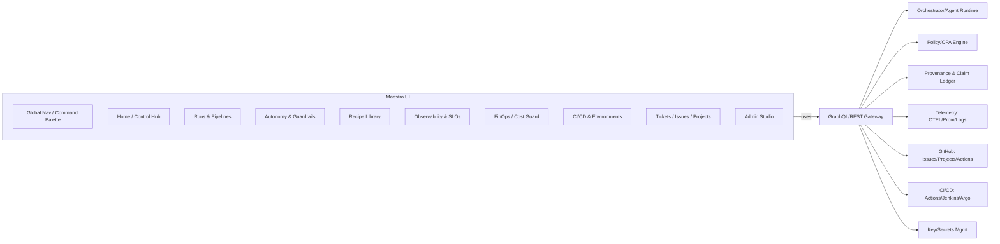
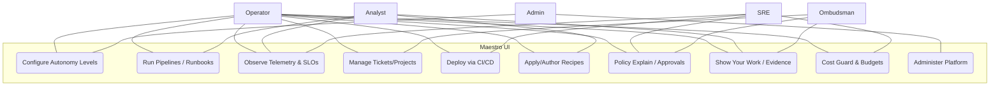
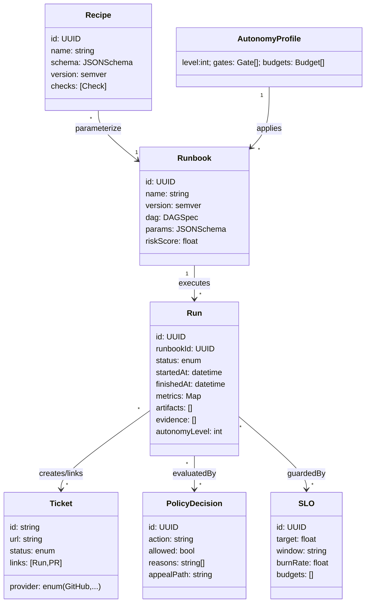
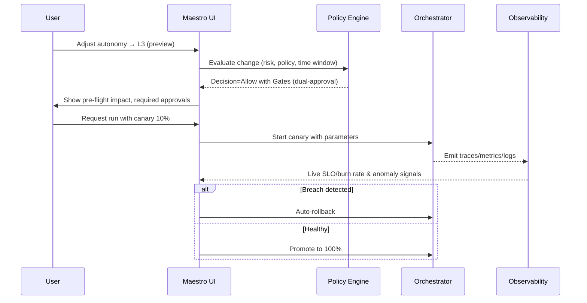
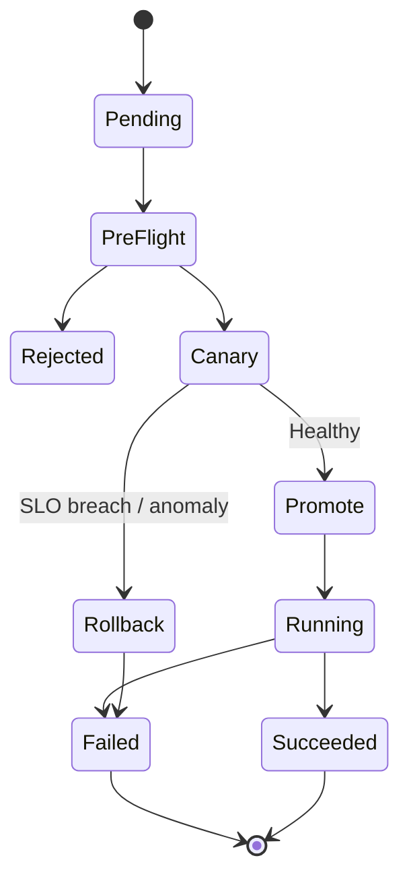
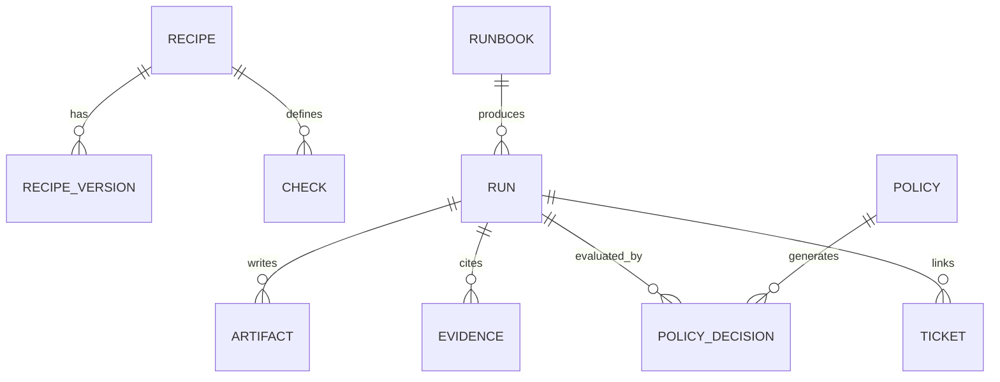
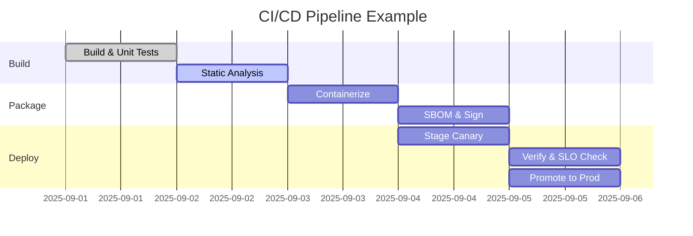

# Maestro UI — World‑Class Control Plane (UML, Mermaid, Wireframes, PRD)

**Date:** 2025‑09‑01  
**Owner:** Maestro Product & Design  
**Scope:** Full UI/UX, architecture, diagrams (UML/Mermaid), wireframes, flows, and requirements for a control plane that provides **granular control** over every tunable setting and **graduated autonomy** (manual → fully autonomous), with **observability**, **CI/CD**, **integrated ticketing (GitHub)**, and **"show your work"** evidence.

---

## 0) Design Principles & North Stars

- **Evidence‑first & Explainable:** Every action shows inputs, parameters, constraints, and rationale. Inline provenance and diffs throughout.
- **Gradated Autonomy:** L0 (manual) → L5 (fully autonomous) with guardrails, preview/simulate, approvals, rollbacks, and replay logs.
- **Operator Quality of Life:** Command palette, keyboard‑first, tri‑pane workboards (timeline/map/graph optional), and A11y AAA.
- **Observability by Default:** First‑class metrics, logs, traces, SLOs, cost guards, and live backpressure indicators.
- **Composable, Recipe‑Driven:** Save any configuration as a reusable, versioned recipe with parameter schemas and pre‑flight checks.
- **Policy‑Aware:** Actions are evaluated by policy; denials include human‑readable reasons and appeal paths.

---

## 1) Information Architecture (IA)



---

## 2) Autonomy Model (L0–L5)

| Level | Name               | Who Triggers                   | Safety Gates                                 | Typical Use                                        |
| ----- | ------------------ | ------------------------------ | -------------------------------------------- | -------------------------------------------------- |
| L0    | Manual             | Human                          | N/A                                          | One‑off runs, ad‑hoc drill                         |
| L1    | Assisted           | Human + Suggest                | Pre‑flight checks                            | Guided runs with suggested params                  |
| L2    | Semi‑Auto          | Scheduler                      | Pre‑flight + soft approval                   | Off‑hours maintenance, low‑risk playbooks          |
| L3    | Auto w/ Approvals  | System -> Human approval gates | Policy checks + dual‑control                 | Higher‑impact changes requiring human consent      |
| L4    | Auto with Rollback | System                         | Canary + automatic rollback + SLO guardrails | Continuous corrections with guardrails             |
| L5    | Fully Autonomous   | System                         | Risk budget, SLO/SLA contracts, audit        | Mature, well‑tested scenarios under strict budgets |

**Controls**: risk budget sliders, blast radius caps, time windows, cost ceilings, approval rules, change freeze windows, canary ratio, rollback thresholds, and **Explain** panel for rationale.

---

## 3) Core Screens — Low‑Fi Wireframes

> Wireframes are intentionally spartan. Visual design will adopt a modern UI kit with dense data tables, cards, code panels, and charts.

### 3.1 Home / Control Hub

```
+----------------------------------------------------------------------------------+
| Header: Search ⌘K | Env: prod ▼ | Alerts ●3 | User ▼                            |
+----------------------------------------------------------------------------------+
| [Autonomy Dial L0..L5] [Risk Budget ▣▣▢▢] [Freeze: OFF] [Canary 10%] [Rollback ON]|
+----------------------------------------------------------------------------------+
| Quick Actions:  Run Recipe  |  New Runbook  |  Open Dashboard  |  Open Tickets   |
+----------------------------------------------------------------------------------+
| Cards:                                                                           |
|  - Live Runs (sparkline, status)    - SLO Heatmap          - Cost Guard          |
|  - Recent Changes (diff)            - Pending Approvals    - Incidents           |
+----------------------------------------------------------------------------------+
```

### 3.2 Runs & Pipelines (DAG View)

```
+----------------------------------- Runs & Pipelines ----------------------------------+
| Filters: Status ▾  Owner ▾  Tag ▾  Time ▾  Search                                    |
|---------------------------------------------------------------------------------------|
| DAG: [source▣]-->[validate▣]-->[enrich▣]-->[plan▣]-->|if ok|-->[execute▣]--->[report] |
|       \----------------------->[fallback▣]--------------------------------------------|
| Side Panel: Node Details | Params | Logs | Metrics | Artifacts | Evidence | Policies  |
+---------------------------------------------------------------------------------------+
```

### 3.3 Autonomy & Guardrails

```
+------------------------------- Autonomy & Guardrails ---------------------------------+
| Dial: L0 L1 L2 L3 L4 L5  | Window: 09:00-17:00 MDT | Blast Radius: <= 10%            |
|---------------------------------------------------------------------------------------|
| Policies (ordered):                                                              [i]  |
| 1) Change freeze on Fridays after 12:00                                            ON |
| 2) Auto-rollback if error budget burn > 2%/h                                      ON |
| 3) Require dual-approval for risk score >= 7/10                                   ON |
| 4) Cost ceiling $200/run                                                           ON |
|---------------------------------------------------------------------------------------|
| Simulation:  Preview impact → show affected resources, risk bands, SLO deltas         |
+---------------------------------------------------------------------------------------+
```

### 3.4 Recipes Library

```
+------------------------------------- Recipes ----------------------------------------+
| Filters: Domain ▾  Verified ▾  Owner ▾  Risk ▾  Last Used ▾  Search                   |
|---------------------------------------------------------------------------------------|
| ▣ Rapid Attribution     ▣ SLO Guard Enforce   ▣ Lateral Movement Map  ▣ Cost Clamp    |
|---------------------------------------------------------------------------------------|
| Right Panel: YAML/JSON schema | Param form | Pre-flight checks | Version history      |
| Actions: Save as new | Dry-run | Schedule | Share | Export | Pin to Hub              |
+---------------------------------------------------------------------------------------+
```

### 3.5 Observability & SLOs

```
+--------------------------------- Observability --------------------------------------+
| Tabs: Dashboards | Traces | Logs | Alerts | SLOs | Incidents | UIs (Airflow/Argo)     |
|---------------------------------------------------------------------------------------|
| Top: Env ▾  Service ▾  Time ▾  Variables ▾  Compare ▾                                 |
| Panels: Latency p95 | Error rate | Throughput | Queue depth | Cost per run | Heatmaps |
| SLOs: Target 99.5% | Burn rate | Error budget left | Breach predictions              |
+---------------------------------------------------------------------------------------+
```

### 3.6 CI/CD & Environments

```
+----------------------------------- CI/CD --------------------------------------------+
| Environments: dev | stage | prod | Preview (per PR)                                  |
| Pipeline Graph: build → test → package → deploy → verify → release                   |
| Controls: Pause | Retry | Promote | Rollback | Pin | Compare Run vs Commit           |
| GitHub: Workflows | Runs | Logs | Artifacts | Annotations                            |
+---------------------------------------------------------------------------------------+
```

### 3.7 Tickets / Issues / Projects (GitHub‑native)

```
+------------------------------ Tickets & Projects -------------------------------------+
| Views: Table | Board | Roadmap | Timeline | Saved filters                            |
| Filters: Repo ▾  Labels ▾  Assignees ▾  Milestone ▾  Health ▾  Linked Runs ▾         |
| Table: Issue ▾ | Status | Priority | Linked Run | CI Build | Owner | Age | Actions    |
| Detail: Markdown | Tasks | PRs | Deploys | Linked DAG nodes | Audit | Discussions     |
+---------------------------------------------------------------------------------------+
```

### 3.8 Admin Studio

```
+----------------------------------- Admin Studio -------------------------------------+
| Schema Registry | Connectors | Feature Flags | Access (RBAC/ABAC) | Audit | Jobs      |
| Health: Connectors up/down | Backfills | Retries | Policy Simulation | License Rules  |
+---------------------------------------------------------------------------------------+
```

---

## 4) UML / Mermaid Diagrams

### 4.1 Use‑Case (Actors & Goals)



### 4.2 Component Diagram (Logical)

```mermaid
flowchart LR
  UI[Maestro Web UI (React/TS)] --> GQL[API Gateway (GraphQL/REST)]
  GQL --> ORCH[Agent Runtime / Orchestrator]
  GQL --> POL[Policy Engine (OPA/ABAC)]
  GQL --> PROV[Provenance & Evidence Ledger]
  GQL --> OBSV[Observability Stack (OTEL/Prom/Logs)]
  GQL --> GH[GitHub Adapter (Issues/Projects/Actions)]
  GQL --> CICD[CI/CD Adapter (Actions/Jenkins/Argo)]
  GQL --> SECR[Secrets/Key Mgmt]
  GQL --> STORE[Recipe/Config Store]
  ORCH --> RUNT[Run Logs & Artifacts]
  OBSV --> SLO[SLO Engine/Budgets]
```

### 4.3 Class Diagram (Core UI Domain)



### 4.4 Sequence — Live Tweak & Safe Apply



### 4.5 Sequence — Failure → Ticket & Rollback

```mermaid
sequenceDiagram
  participant ORC as Orchestrator
  participant UI as Maestro UI
  participant GH as GitHub Adapter
  participant USER as On‑call

  ORC-->>UI: Run failed (node=validate)
  UI->>GH: Create Issue with logs, artifacts, linked commit
  GH-->>UI: Issue#1234 URL
  UI->>USER: Notify with deep link; rollback executed
```

### 4.6 State — Run Lifecycle



### 4.7 ER (Recipes & Policies)



### 4.8 Gantt — CI/CD Path



---

## 5) Interaction Patterns & Micro‑copy

- **Explain buttons** on all policy denials; include reason, impacted scope, and appeal path.
- **Inline diffs** for params, environment variables, and recipe versions.
- **Hover tooltips**: show confidence, source, and last change actor.
- **Keyboard palette**: `⌘K` to jump; `/` to search; `g r` to go Runs; `g o` Observability; `g t` Tickets.

---

## 6) Telemetry & Observability Spec

- **Golden Signals**: latency p50/p95/p99, error rate, throughput, saturation, backlog.
- **Run KPIs**: success %, mean time to recover (MTTR), canary promotion time, rollback count.
- **SLOs**: define per service and per runbook; show burn rate; predict time‑to‑violate.
- **Tracing**: per node spans; link to evidence/artifacts; correlation IDs from UI → ORC → CI/CD.
- **Dashboards**: Environment switch, template variables, compare modes, cost overlay.
- **Alerts**: SLO breach, anomaly in telemetry sanity, policy abuse attempt, cost cap cross.

---

## 7) CI/CD Integration

- **Workflows**: Discover GitHub Actions/Argo/Jenkins pipelines; render dependency graphs.
- **Controls**: pause/resume, retry, promote/rollback; pinned versions; release notes.
- **Preview Environments**: per PR with auto‑teardown; status badges; policy gates.
- **Artifact Surfacing**: link test reports, coverage, SBOM, signatures.

---

## 8) Tickets & Projects Integration (GitHub)

- **Unified List** (table/board/roadmap/timeline).
- **Deep Links**: runs ↔ issues ↔ PRs ↔ commits ↔ deployments.
- **Triage**: templates, labels, owners, severity, SLA clocks.
- **Automation**: auto‑create on failure; close on success; sync comments; cross‑link with run nodes.

---

## 9) Safety, Governance & Audit

- **RBAC/ABAC** with step‑up auth for risky actions.
- **Policy Simulation** before rollout; **What‑if mode** on historical data.
- **Audit Everywhere**: who/what/why/when; reason‑for‑access prompts.
- **Data Minimization**: redaction presets; license enforcement at query time.

---

## 10) Non‑Functional Requirements (NFRs)

- **Performance**: interactive actions < 200ms P95; heavy batch queued with progress.
- **Availability**: 99.9% UI; 99.95% API; graceful degradation when obs stack lags.
- **Scale**: 10k concurrent sessions; 1k runs/hr; traces 100k spans/min sustained.
- **Security**: WebAuthn, CSRF, CSP, signed webhooks, least privilege by default.
- **Privacy/Compliance**: consent flags, purpose limitation tags; export manifests.

---

## 11) Acceptance Criteria (Samples)

- **Autonomy Dial**: each level gates UI affordances, pre‑flight checks render within 500ms; denials explain with actionable guidance.
- **Run DAG**: node click shows logs (<2s first byte), metrics, artifacts, evidence, and policy decisions; “Show Work” tab always populated.
- **SLO Panel**: burn rate and forecast visible; breach triggers rollback per policy; alert routed to on‑call with deep links.
- **Tickets Sync**: issue created with templated body, linked run and artifacts; status mirrored within 10s.
- **Recipes**: schema‑driven forms, parameter validation; dry‑run renders impact set and risk bands.

---

## 12) Example Copy & UI Strings

- **Denial**: “Action blocked by policy _Change Freeze Friday_ (12:00–23:59). Request an exception or schedule for Monday.”
- **Risk Budget Low**: “Only 8% budget left for this window. Suggest L2 or reduce blast radius to ≤5%.”
- **SLO Burn**: “Projected breach in 34m (burn 3.2×). Auto‑rollback engaged at 4× or by operator.”

---

## 13) API Facade Sketches (UI Contracts)

```yaml
PATCH /autonomy
body: { level: 3, canary: 0.1, window: "09:00-17:00", caps:{blastRadius:0.1,cost:200}}
resp: { decision: {allowed:true, gates:["dualApproval"], reasons:[]}, preview:{riskBands:...} }
---
POST /runs
body: { runbookId, params, autonomy:{ level: 2, canary:0.1 }, recipeId? }
resp: { runId, links:{logs, traces, tickets:[]} }
---
POST /tickets
body: { provider:"github", repo, title, body, labels, links:{ runId, commit, pr }}
```

---

## 14) Content Model (for CMS/docs within UI)

- **Runbook Docs**: description, inputs/outputs, KPIs, failure modes, rollback plan.
- **Recipe Docs**: purpose, param schema, pre‑flight checks, last audit.
- **Policy Docs**: rationale, expected behaviors, examples of allowed/denied actions.

---

## 15) UX Research & Usability Plan

- Task time studies for “find failing node,” “approve safe rollout,” “trace to issue,” “rollback.”
- A11y audits (screen reader labels, color contrast, motion reduction options).
- Dogfooding with synthetic data & replayable exercises.

---

## 16) PRD (Condensed Inside This Doc)

### Executive Summary

- **Vision:** Maestro is the unified control plane to run, observe, and govern automated runbooks with explainable autonomy.
- **Target Users:** Operators, Analysts, SREs, Admins, Ombuds.
- **Differentiators:** Evidence‑first UX; gradated autonomy with policy‑aware pre‑flights; deep GitHub+CI/CD+Obs fusion.
- **KPIs:** Time‑to‑rollback, time‑to‑promote, SLO adherence, incident MTTR, recipe reuse rate.

### Problem & Opportunity

- Fragmented tools (orchestrators, CI/CD, tickets, observability) slow response and obscure causality. Maestro unifies these into one explainable pane.

### User Stories (selected)

- _As an operator, I can safely raise autonomy from L2→L3 with a preview of risk impact so I can move faster without violating SLOs._
- _As an analyst, I can open any failed run and see linked evidence, logs, and tickets in one place so I can act immediately._
- _As an SRE, I can set budgets and rollback rules so autonomous actions cannot overrun error budgets or cost caps._

### Must‑Have Features

- Autonomy Dial, DAG runs, Observability/SLOs, Tickets & Projects integration, CI/CD controls, Recipes/Pre‑flight, Policy explain.

### Technical Requirements

- GraphQL/REST gateway; adapters for GitHub/CI/CD; OTEL/Prom/logs; signed webhooks; RBAC/ABAC.

### Success Metrics

- 50% reduction in MTTR; 30% faster safe promotions; 90%+ tasks completed in usability tests; <2s logs first‑byte.

---

## 17) Open Questions (tracked in backlog)

- Multi‑tenant secrets scoping UX across envs.
- Fine‑grained diff views for param overrides vs recipe defaults.
- Cross‑org ticket linking patterns.

---

## 18) Appendix — Example Recipes (YAML)

```yaml
name: SLO Guard Enforcement
params:
  slo_target: 99.5
  max_burn_rate: 2.0
  rollback_at_burn: 3.5
preflight:
  - check: has_active_slo
  - check: budget_remaining > 0
  - check: window_allows_change
```

```yaml
name: Cost Clamp
params:
  max_cost_per_run: 200
  max_daily_spend: 1500
preflight:
  - check: cost_headroom >= max_cost_per_run
  - check: no_conflicting_policy
```

---

**End of Document**
