# GREEN TRAIN Merge Readiness Guide

> **Status**: ✅ Fully Implemented | **Framework Version**: 1.0 | **Last Updated**: $(date +%Y-%m-%d)

## Overview

The GREEN TRAIN framework implements trunk-based development with automated quality gates, comprehensive security scanning, and SLO-driven merge decisions. This guide covers the complete merge readiness workflow for the IntelGraph platform.

## Architecture

```mermaid
graph TD
    A[Developer Branch] --> B[Create PR]
    B --> C[CODEOWNERS Review]
    C --> D[CI Gates Pipeline]
    D --> E[Merge Queue]
    E --> F[Main Branch]
    F --> G[Automated Release]

    D --> D1[Lint & TypeCheck]
    D --> D2[Tests & Coverage ≥80%]
    D --> D3[Security Scan]
    D --> D4[Migration Safety]
    D --> D5[SLO Validation]
    D --> D6[Build & Attestation]
```



## Required Gates

### 1. Code Quality Gates

- **ESLint & Prettier**: Code style and quality enforcement
- **TypeScript**: Type safety and compilation validation
- **Dead Code Detection**: Unused code identification

### 2. Testing Gates

- **Unit Tests**: Component and function-level validation
- **Integration Tests**: API and database interaction testing
- **Coverage Enforcement**: Minimum 80% test coverage required
- **Test Performance**: Tests must complete within SLO limits

### 3. Security Gates

- **SBOM Generation**: Software Bill of Materials (SPDX format)
- **Vulnerability Scanning**: Trivy-based security assessment
- **Secret Detection**: Gitleaks scanning for exposed credentials
- **License Compliance**: Dependency license validation

### 4. Data Safety Gates

- **Migration Dry-Run**: Database migration validation
- **Destructive Operation Detection**: SQL safety analysis with waiver system
- **Schema Compatibility**: GraphQL schema evolution validation

### 5. Performance Gates

- **SLO Validation**: k6-based performance testing
  - p95 latency < 200ms
  - Error rate < 1%
  - Success rate > 95%
- **Build Performance**: Compilation time monitoring
- **Bundle Size**: Asset size regression detection

## Workflow Process

### Developer Workflow

1. **Branch Creation**

   ```bash
   git checkout main
   git pull origin main
   git checkout -b feature/your-feature-name
   ```

2. **Development & Testing**

   ```bash
   # Run local checks before committing
   pnpm run lint
   pnpm run typecheck
   pnpm run test
   pnpm run test:coverage
   ```

3. **Commit Convention**

   ```bash
   # Use conventional commits
   git commit -m "feat(component): add new functionality

   - Implement feature X with Y capability
   - Add comprehensive test coverage
   - Update documentation

   Closes #123"
   ```

4. **PR Creation**
   ```bash
   git push -u origin feature/your-feature-name
   gh pr create --title "feat: descriptive title" --body "PR description"
   ```

### Review Process

1. **Automated Checks**: All CI gates must pass
2. **CODEOWNERS Review**: Required approvals based on changed files
3. **Security Review**: For security-sensitive changes
4. **Architecture Review**: For significant structural changes

### Merge Queue Process

1. **Queue Entry**: PR enters merge queue after all gates pass
2. **Final Validation**: Queue runs final checks against latest main
3. **Automatic Merge**: Successful validation triggers merge
4. **Deployment**: Automated release process begins

## CODEOWNERS Matrix

| Path Pattern                 | Required Reviewers            | Approval Count |
| ---------------------------- | ----------------------------- | -------------- |
| `server/src/migrations/**/*` | @db-lead @security-lead       | 2+             |
| `.github/workflows/**/*`     | @platform-lead @security-lead | 2+             |
| `server/src/graphql/**/*`    | @backend-lead @security-lead  | 2+             |
| `deploy/helm/**/*`           | @platform-lead                | 2+             |
| `security/**/*`              | @security-lead                | 2+             |
| `*`                          | @BrianCLong                   | 1+             |

## SLO Targets

### Merge Queue Performance

- **Queue Wait Time**: p95 < 15 minutes, p99 < 30 minutes
- **CI Execution**: p95 < 8 minutes, p99 < 12 minutes
- **Throughput**: Target 20 PRs/hour, minimum 10 PRs/hour

### Application Performance

- **API Response Time**: p95 < 200ms
- **Error Rate**: < 1%
- **Success Rate**: > 95%
- **Test Coverage**: ≥ 80%

## Emergency Procedures

### Hotfix Process

1. Create hotfix branch from main
2. Implement minimal fix with tests
3. Add `hotfix` label for priority processing
4. Get expedited review from platform team
5. Merge via queue or emergency bypass if critical

### Emergency Bypass

```bash
# Only for critical production issues
# Requires platform-admin approval
gh api repos/:owner/:repo/branches/main/protection \
  --method PUT \
  --field enforce_admins=false
```

### Rollback Procedures

```bash
# Disable merge queue temporarily
gh api repos/:owner/:repo/merge-queue \
  --method PATCH \
  --field enabled=false

# Revert problematic merge
git revert <commit-hash>
git push origin main
```

## Troubleshooting

### Common Issues

**CI Gates Failing**

```bash
# Check specific gate logs
gh run view --log

# Local reproduction
pnpm run ci:local
```

**Merge Queue Backup**

```bash
# Check queue status
gh api repos/:owner/:repo/merge-queue

# Clear queue if needed (admin only)
gh api repos/:owner/:repo/merge-queue \
  --method DELETE \
  --field reason="Queue backup resolution"
```

**Migration Safety Failures**

```bash
# Review destructive operations
node scripts/check-destructive-sql.js server/src/migrations/

# Create waiver if approved
echo '{"migration_file.sql": {"reason": "Approved reason", "approvedBy": "dba-team"}}' > security/migration-waivers.json
```

### Performance Issues

**Slow CI Execution**

- Check for test parallelization opportunities
- Review Docker layer caching
- Consider splitting large test suites

**Queue Throughput Degradation**

- Monitor for flaky tests causing retries
- Check for resource contention
- Review merge conflict patterns

## Monitoring & Metrics

### Key Metrics

- Gate success rates by type
- Average queue wait times
- Merge throughput trends
- Security gate findings
- Coverage trends

### Dashboards

- **Queue Health**: Real-time status and wait times
- **Gate Performance**: Success rates and execution times
- **Security Posture**: Vulnerability trends and SBOM compliance
- **Code Quality**: Coverage, complexity, and technical debt

### Alerts

- Queue backup (>5 PRs waiting >30 min)
- Gate failure rate (>20% in 1 hour)
- SLO violations (response time, error rate)
- Security findings (critical vulnerabilities)

## Configuration Files

### Core Framework Files

```
.github/
├── CODEOWNERS                    # Code ownership rules
├── workflows/
│   └── ci-comprehensive.yml      # Main CI pipeline
├── protection-rules.yml          # Branch protection config
└── merge-queue-config.json       # Queue configuration

scripts/
├── configure-branch-protection.sh # Setup script
├── check-destructive-sql.js      # Migration safety
└── verify-coverage.js            # Coverage enforcement

k6/
└── slo-probe.js                  # Performance validation
```

### Setup Commands

```bash
# Configure protection rules
./scripts/configure-branch-protection.sh

# Test migration safety
node scripts/check-destructive-sql.js server/src/migrations/

# Validate SLO compliance
k6 run k6/slo-probe.js

# Check coverage
node scripts/verify-coverage.js 80
```

## Team Training

### Required Knowledge

- Conventional commit format
- CODEOWNERS approval process
- CI gate troubleshooting
- Emergency bypass procedures
- SLO monitoring basics

### Resources

- [Conventional Commits](https://conventionalcommits.org/)
- [GitHub Merge Queue](https://docs.github.com/en/repositories/configuring-branches-and-merges-in-your-repository/configuring-pull-request-merges/managing-a-merge-queue)
- [Trunk-based Development](https://trunkbaseddevelopment.com/)
- [k6 Performance Testing](https://k6.io/docs/)

## Success Metrics

### Quality Indicators

- **Defect Escape Rate**: < 2% post-merge issues
- **Security Compliance**: 100% SBOM coverage
- **Test Coverage**: Sustained ≥ 80%
- **Deployment Success**: > 99% successful releases

### Productivity Metrics

- **Merge Frequency**: > 10 merges per day
- **Lead Time**: < 4 hours from PR to production
- **Developer Satisfaction**: > 4.5/5 workflow rating
- **Queue Efficiency**: < 5% time waiting in queue

---

**🚂 GREEN TRAIN Framework** - Delivering quality at velocity with comprehensive automation and governance.
