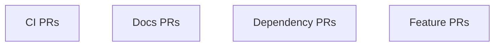

# Merge Train Analysis (Deferred GH CLI)

**Evidence bundle (UEF)**: `pr-open.json` snapshot. GH CLI unavailable; live PR metadata (files, checks, ahead/behind) is deferred pending GH access.

## Command Log (Deferred)

- Attempted: `gh pr list --state open --limit 200 --json number,title,headRefName,baseRefName,isDraft,mergeable,mergeStateStatus,author,labels,updatedAt,additions,deletions,files,reviewDecision,statusCheckRollup,url`
- Result: Deferred pending GH CLI availability in this environment.


## Step 1: PR Inventory (Snapshot)

| PR | Title | Draft | Base | Ahead/Behind | Mergeable | CI | Files | Size | Labels | Updated |
| --- | --- | --- | --- | --- | --- | --- | --- | --- | --- | --- |
| #1766 | feat: add policy impact causal analyzer toolkit | No | Deferred | Deferred | Deferred | Deferred | Deferred | Deferred | codex | 2025-09-27T14:09:27Z |
| #1765 | chore(deps): bump react-map-gl from 7.1.9 to 8.0.4 | No | Deferred | Deferred | Deferred | Deferred | Deferred | Deferred | dependencies, javascript, risk:low, needs-review | 2025-09-27T13:57:52Z |
| #1764 | chore(deps-dev): bump @graphql-codegen/typescript from 4.1.6 to 5.0.0 | No | Deferred | Deferred | Deferred | Deferred | Deferred | Deferred | dependencies, javascript, risk:low, needs-review | 2025-09-27T13:57:52Z |
| #1763 | chore(deps): bump canvas from 2.11.2 to 3.2.0 | No | Deferred | Deferred | Deferred | Deferred | Deferred | Deferred | dependencies, javascript, risk:low, needs-review | 2025-09-27T13:55:54Z |
| #1762 | chore(deps): bump @turf/area from 7.1.0 to 7.2.0 | No | Deferred | Deferred | Deferred | Deferred | Deferred | Deferred | dependencies, javascript, risk:low, needs-review | 2025-09-27T13:55:47Z |
| #1761 | chore(deps): bump sharp from 0.33.5 to 0.34.4 | No | Deferred | Deferred | Deferred | Deferred | Deferred | Deferred | dependencies, javascript, risk:low, needs-review | 2025-09-27T14:06:29Z |
| #1760 | feat: add iftc static analyzer | No | Deferred | Deferred | Deferred | Deferred | Deferred | Deferred | codex, risk:low, needs-review | 2025-09-27T13:47:10Z |
| #1759 | feat: add data mutation chaos lab harness | No | Deferred | Deferred | Deferred | Deferred | Deferred | Deferred | codex, risk:low, needs-review | 2025-09-27T12:59:28Z |
| #1758 | feat: add governance requirement test corpus compiler | No | Deferred | Deferred | Deferred | Deferred | Deferred | Deferred | codex, risk:low, needs-review | 2025-09-27T13:06:15Z |
| #1757 | feat: add prompt context attribution reporting | No | Deferred | Deferred | Deferred | Deferred | Deferred | Deferred | codex, needs-review | 2025-09-27T12:40:07Z |
| #1756 | chore(deps): bump chalk from 4.1.2 to 5.6.2 | No | Deferred | Deferred | Deferred | Deferred | Deferred | Deferred | dependencies, javascript, risk:low, needs-review | 2025-09-27T14:04:55Z |
| #1754 | feat: add QSET quorum-based tool secret escrow service | No | Deferred | Deferred | Deferred | Deferred | Deferred | Deferred | codex, risk:low, needs-review | 2025-09-27T12:24:07Z |
| #1753 | feat: add policy-constrained backfill orchestrator | No | Deferred | Deferred | Deferred | Deferred | Deferred | Deferred | codex, risk:low, needs-review | 2025-09-27T12:24:52Z |
| #1752 | feat: add provenance-preserving etl generator | No | Deferred | Deferred | Deferred | Deferred | Deferred | Deferred | codex, risk:low, needs-review | 2025-09-27T12:18:47Z |
| #1751 | feat: add opld leakage delta harness | No | Deferred | Deferred | Deferred | Deferred | Deferred | Deferred | codex, risk:low, needs-review | 2025-09-27T12:16:38Z |
| #1750 | feat: add canonical semantic schema mapper | No | Deferred | Deferred | Deferred | Deferred | Deferred | Deferred | codex, risk:low, needs-review | 2025-09-27T12:13:32Z |
| #1749 | feat: add model output safety budgets | No | Deferred | Deferred | Deferred | Deferred | Deferred | Deferred | codex, risk:low, needs-review | 2025-09-27T12:20:49Z |
| #1748 | feat: add coec cross-org experiment coordination | No | Deferred | Deferred | Deferred | Deferred | Deferred | Deferred | codex, risk:low, needs-review | 2025-09-27T13:32:50Z |
| #1747 | feat: add context window sanitizer middleware for GraphRAG | No | Deferred | Deferred | Deferred | Deferred | Deferred | Deferred | codex, risk:low, needs-review | 2025-09-27T12:02:26Z |
| #1746 | feat: add RAALO policy aware active learning orchestrator | No | Deferred | Deferred | Deferred | Deferred | Deferred | Deferred | codex, risk:low, needs-review | 2025-09-27T13:46:30Z |
| #1745 | feat: add consent drift forecaster | No | Deferred | Deferred | Deferred | Deferred | Deferred | Deferred | codex, risk:low, needs-review | 2025-09-27T12:12:29Z |
| #1744 | feat: add dataset end-of-life registrar service | No | Deferred | Deferred | Deferred | Deferred | Deferred | Deferred | codex, risk:low, needs-review | 2025-09-27T11:47:05Z |
| #1743 | feat: add streaming join auditor operator | No | Deferred | Deferred | Deferred | Deferred | Deferred | Deferred | codex, risk:low, needs-review | 2025-09-27T11:54:19Z |
| #1742 | feat: add audit log succinctness proofs library | No | Deferred | Deferred | Deferred | Deferred | Deferred | Deferred | codex, risk:low, needs-review | 2025-09-27T11:55:34Z |
| #1741 | feat: add data license derivation planner | No | Deferred | Deferred | Deferred | Deferred | Deferred | Deferred | codex, risk:low, needs-review | 2025-09-27T12:26:48Z |
| #1740 | feat: add cross-modal origin linker core | No | Deferred | Deferred | Deferred | Deferred | Deferred | Deferred | codex, risk:low, needs-review | 2025-09-27T11:22:22Z |
| #1739 | feat: add residency-aware DR planner | No | Deferred | Deferred | Deferred | Deferred | Deferred | Deferred | codex, risk:low, needs-review | 2025-09-27T10:54:54Z |
| #1738 | feat: add query intent policy mapper service | No | Deferred | Deferred | Deferred | Deferred | Deferred | Deferred | codex, risk:low, needs-review | 2025-09-27T10:57:53Z |
| #1737 | feat: add JTDL taxonomy drift linter | No | Deferred | Deferred | Deferred | Deferred | Deferred | Deferred | codex, risk:high, needs-review | 2025-09-27T10:51:53Z |
| #1736 | feat: add csrs retention simulator | No | Deferred | Deferred | Deferred | Deferred | Deferred | Deferred | codex, risk:low, needs-review | 2025-09-27T10:59:22Z |
| #1735 | feat: add multi-stage query explainer middleware | No | Deferred | Deferred | Deferred | Deferred | Deferred | Deferred | codex, risk:low, needs-review | 2025-09-27T10:33:32Z |
| #1734 | feat: add cross-modal origin linker core | No | Deferred | Deferred | Deferred | Deferred | Deferred | Deferred | risk:low, needs-review | 2025-09-27T10:29:17Z |
| #1733 | feat: introduce OHIE opt-out analytics library and UI panel | No | Deferred | Deferred | Deferred | Deferred | Deferred | Deferred | codex, risk:low, needs-review | 2025-09-27T10:20:46Z |
| #1732 | feat: introduce deterministic toolchain hasher CLI | No | Deferred | Deferred | Deferred | Deferred | Deferred | Deferred | codex, risk:low, needs-review | 2025-09-27T10:41:47Z |
| #1731 | feat: add Go mpes runner with sandboxed multi-party evaluations | No | Deferred | Deferred | Deferred | Deferred | Deferred | Deferred | codex, risk:low, needs-review | 2025-09-27T10:45:34Z |
| #1730 | feat: add ACDC consent-aware dataflow compiler | No | Deferred | Deferred | Deferred | Deferred | Deferred | Deferred | codex, risk:low, needs-review | 2025-09-27T10:45:37Z |
| #1729 | feat: add outcome-safe rollout planner and dashboard | No | Deferred | Deferred | Deferred | Deferred | Deferred | Deferred | codex, risk:low, needs-review | 2025-09-27T10:27:37Z |
| #1728 | chore(deps): bump nvidia/cuda from 13.0.0-devel-ubuntu22.04 to 13.0.1-devel-ubuntu22.04 | No | Deferred | Deferred | Deferred | Deferred | Deferred | Deferred | dependencies, docker, risk:low, needs-review | 2025-09-27T09:34:19Z |
| #1727 | chore(deps): bump node from 20-alpine to 24-alpine | No | Deferred | Deferred | Deferred | Deferred | Deferred | Deferred | dependencies, docker, risk:low, needs-review | 2025-09-27T09:45:32Z |
| #1726 | chore(deps): bump scikit-learn from 1.3.0 to 1.5.0 in /server | No | Deferred | Deferred | Deferred | Deferred | Deferred | Deferred | dependencies, python, risk:low, needs-review | 2025-09-27T09:10:54Z |
| #1725 | chore(deps): bump torch from 2.1.0 to 2.8.0 in /server | No | Deferred | Deferred | Deferred | Deferred | Deferred | Deferred | dependencies, python, risk:low, needs-review | 2025-09-27T09:00:48Z |
| #1724 | chore(deps): bump python from 3.12-slim to 3.13-slim | No | Deferred | Deferred | Deferred | Deferred | Deferred | Deferred | dependencies, docker, risk:low, needs-review | 2025-09-27T08:54:39Z |
| #1723 | chore(deps): bump requests from 2.31.0 to 2.32.4 in /server | No | Deferred | Deferred | Deferred | Deferred | Deferred | Deferred | dependencies, python, risk:low, needs-review | 2025-09-27T08:48:21Z |
| #1722 | chore(deps): bump tqdm from 4.66.1 to 4.66.3 in /server | No | Deferred | Deferred | Deferred | Deferred | Deferred | Deferred | dependencies, python, risk:low, needs-review | 2025-09-27T08:42:03Z |
| #1721 | chore(deps): bump nltk from 3.8.1 to 3.9 in /server | No | Deferred | Deferred | Deferred | Deferred | Deferred | Deferred | dependencies, python, risk:low, needs-review | 2025-09-27T08:33:31Z |
| #1720 | chore(deps): bump anchore/syft from v0.105.1 to v1.33.0 | No | Deferred | Deferred | Deferred | Deferred | Deferred | Deferred | dependencies, docker, risk:low, needs-review | 2025-09-27T08:25:22Z |
| #1719 | chore(deps): bump aquasec/trivy from 0.51.1 to 0.66.0 | No | Deferred | Deferred | Deferred | Deferred | Deferred | Deferred | dependencies, docker, risk:low, needs-review | 2025-09-27T08:25:25Z |
| #1718 | chore(deps): bump pandas from 2.0.3 to 2.3.2 | No | Deferred | Deferred | Deferred | Deferred | Deferred | Deferred | dependencies, python, risk:low, needs-review | 2025-09-27T08:25:27Z |
| #1717 | chore(deps): bump redis from 4.3.4 to 6.4.0 | No | Deferred | Deferred | Deferred | Deferred | Deferred | Deferred | dependencies, python, risk:low, needs-review | 2025-09-27T08:25:30Z |
| #1716 | chore(deps): bump pytest from 7.4.3 to 8.4.2 | No | Deferred | Deferred | Deferred | Deferred | Deferred | Deferred | dependencies, python, risk:low, needs-review | 2025-09-27T08:25:33Z |
| #1715 | chore(deps): bump fastapi from 0.78.0 to 0.117.1 | No | Deferred | Deferred | Deferred | Deferred | Deferred | Deferred | dependencies, python, risk:low, needs-review | 2025-09-27T08:25:35Z |
| #1714 | chore(deps): bump pytest-cov from 4.1.0 to 7.0.0 | No | Deferred | Deferred | Deferred | Deferred | Deferred | Deferred | dependencies, python, risk:low, needs-review | 2025-09-27T08:25:37Z |
| #1713 | feat: implement remote forensic capture pipelines | No | Deferred | Deferred | Deferred | Deferred | Deferred | Deferred | codex, risk:low, needs-review | 2025-09-27T08:25:39Z |
| #1712 | Add FHE micro-analytics service and client | No | Deferred | Deferred | Deferred | Deferred | Deferred | Deferred | codex, risk:low, needs-review | 2025-09-27T08:25:41Z |
| #1711 | refactor: streamline clsl stress lab | No | Deferred | Deferred | Deferred | Deferred | Deferred | Deferred | codex, risk:low, needs-review | 2025-09-27T08:25:43Z |
| #1710 | feat: advance companyos patent intelligence | No | Deferred | Deferred | Deferred | Deferred | Deferred | Deferred | codex, risk:low, needs-review | 2025-09-27T08:25:45Z |
| #1709 | feat: add PFPT prompt diffing library | No | Deferred | Deferred | Deferred | Deferred | Deferred | Deferred | codex, risk:low, needs-review | 2025-09-27T08:25:47Z |
| #1708 | feat: add policy-gated vector router core and SDK | No | Deferred | Deferred | Deferred | Deferred | Deferred | Deferred | codex, risk:low, needs-review | 2025-09-27T08:25:49Z |
| #1707 | feat: add attested dataset delivery network | No | Deferred | Deferred | Deferred | Deferred | Deferred | Deferred | codex, risk:low, needs-review | 2025-09-27T08:25:51Z |
| #1706 | feat: add data lease controller service | No | Deferred | Deferred | Deferred | Deferred | Deferred | Deferred | codex, risk:low, needs-review | 2025-09-27T08:25:53Z |
| #1705 | feat: add pacdc policy-aware cdc replicator | No | Deferred | Deferred | Deferred | Deferred | Deferred | Deferred | codex, risk:low, needs-review | 2025-09-27T08:25:55Z |
| #1704 | feat: add djce-pb join risk estimator | No | Deferred | Deferred | Deferred | Deferred | Deferred | Deferred | codex, risk:low, needs-review | 2025-09-27T08:25:57Z |
| #1703 | docs: integrate legal agreements into onboarding | No | Deferred | Deferred | Deferred | Deferred | Deferred | Deferred | codex, risk:low, needs-review | 2025-09-27T08:25:59Z |
| #1702 | feat: launch Topicality Collective marketing microsites | No | Deferred | Deferred | Deferred | Deferred | Deferred | Deferred | codex, risk:low, needs-review | 2025-09-27T08:26:01Z |
| #1701 | feat: add RTGH governance gate fuzzer | No | Deferred | Deferred | Deferred | Deferred | Deferred | Deferred | codex, risk:low, needs-review | 2025-09-27T08:26:03Z |
| #1700 | feat(streaming): add event-time compliance window enforcer | No | Deferred | Deferred | Deferred | Deferred | Deferred | Deferred | codex, risk:low, needs-review | 2025-09-27T08:26:05Z |
| #1699 | feat: add mocc contract validation library | No | Deferred | Deferred | Deferred | Deferred | Deferred | Deferred | codex, risk:low, needs-review | 2025-09-27T08:26:07Z |
| #1698 | feat: add consent state reconciler service | No | Deferred | Deferred | Deferred | Deferred | Deferred | Deferred | codex, risk:low, needs-review | 2025-09-27T08:26:09Z |
| #1697 | feat: add consent state reconciler service | No | Deferred | Deferred | Deferred | Deferred | Deferred | Deferred | codex, risk:low, needs-review | 2025-09-27T08:26:11Z |
| #1696 | feat: add federated attribution evaluator | No | Deferred | Deferred | Deferred | Deferred | Deferred | Deferred | codex, risk:low, needs-review | 2025-09-27T08:26:14Z |
| #1695 | feat: add rare-event synthetic booster toolkit | No | Deferred | Deferred | Deferred | Deferred | Deferred | Deferred | codex, risk:low, needs-review | 2025-09-27T08:26:19Z |
| #1694 | feat: add immutable training run capsule toolkit | No | Deferred | Deferred | Deferred | Deferred | Deferred | Deferred | codex, risk:low, needs-review | 2025-09-27T08:26:22Z |
| #1693 | feat: add semantic PII ontology mapper service | No | Deferred | Deferred | Deferred | Deferred | Deferred | Deferred | codex, risk:low, needs-review | 2025-09-27T08:26:25Z |
| #1692 | feat: introduce policy backtest simulator engine and dashboard | No | Deferred | Deferred | Deferred | Deferred | Deferred | Deferred | codex, risk:low, needs-review | 2025-09-27T08:26:28Z |
| #1691 | feat: add deterministic prompt execution cache package | No | Deferred | Deferred | Deferred | Deferred | Deferred | Deferred | codex, risk:low, needs-review | 2025-09-27T08:26:30Z |
| #1690 | feat: add csdb broker service and client sdk | No | Deferred | Deferred | Deferred | Deferred | Deferred | Deferred | codex, risk:low, needs-review | 2025-09-27T08:26:34Z |
| #1689 | feat: add aql audit query engine | No | Deferred | Deferred | Deferred | Deferred | Deferred | Deferred | codex, risk:low, needs-review | 2025-09-27T08:26:38Z |
| #1688 | feat: add data diff governance mapper tool | No | Deferred | Deferred | Deferred | Deferred | Deferred | Deferred | codex, risk:low, needs-review | 2025-09-27T08:26:41Z |
| #1687 | feat: add adaptive consent experience sdk | No | Deferred | Deferred | Deferred | Deferred | Deferred | Deferred | codex, risk:low, needs-review | 2025-09-27T08:26:44Z |
| #1686 | feat: add HAPL ledger with verification CLI | No | Deferred | Deferred | Deferred | Deferred | Deferred | Deferred | codex, risk:low, needs-review | 2025-09-27T08:26:47Z |
| #1685 | feat: add access path minimizer planner and SDK | No | Deferred | Deferred | Deferred | Deferred | Deferred | Deferred | codex, risk:low, needs-review | 2025-09-27T08:26:50Z |
| #1684 | feat: add legal hold orchestrator and UI | No | Deferred | Deferred | Deferred | Deferred | Deferred | Deferred | codex, risk:low, needs-review | 2025-09-27T08:26:53Z |
| #1683 | feat: add emergency containment controller UI and API | No | Deferred | Deferred | Deferred | Deferred | Deferred | Deferred | codex, risk:low, needs-review | 2025-09-27T08:26:56Z |
| #1682 | feat: introduce KRPCP rotation planner and coverage UI | No | Deferred | Deferred | Deferred | Deferred | Deferred | Deferred | codex, risk:low, needs-review | 2025-09-27T08:26:59Z |
| #1681 | feat: add metric definition registry | No | Deferred | Deferred | Deferred | Deferred | Deferred | Deferred | codex, risk:low, needs-review | 2025-09-27T08:27:02Z |
| #1680 | feat: add AGSM synthetic governance probes | No | Deferred | Deferred | Deferred | Deferred | Deferred | Deferred | codex, needs-review | 2025-09-27T08:27:05Z |
| #1679 | feat: add MTIF STIX/TAXII service | No | Deferred | Deferred | Deferred | Deferred | Deferred | Deferred | codex, needs-review | 2025-09-27T08:27:08Z |
| #1678 | feat: add csiks idempotency service and clients | No | Deferred | Deferred | Deferred | Deferred | Deferred | Deferred | codex, risk:low, needs-review | 2025-09-27T08:27:11Z |
| #1677 | feat: add consent graph explorer service and ui | No | Deferred | Deferred | Deferred | Deferred | Deferred | Deferred | codex, needs-review | 2025-09-27T08:27:14Z |
| #1676 | feat: add adaptive consistency controller sidecar and sdk | No | Deferred | Deferred | Deferred | Deferred | Deferred | Deferred | codex, risk:low, needs-review | 2025-09-27T08:27:17Z |
| #1675 | feat: add adaptive consistency controller sidecar and sdk | No | Deferred | Deferred | Deferred | Deferred | Deferred | Deferred | codex, risk:low, needs-review | 2025-09-27T08:27:19Z |
| #1674 | feat: add mobile ODPS SDKs for Android and iOS | No | Deferred | Deferred | Deferred | Deferred | Deferred | Deferred | codex, risk:low, needs-review | 2025-09-27T08:27:23Z |
| #1673 | feat: add immutable business rules sandbox engine | No | Deferred | Deferred | Deferred | Deferred | Deferred | Deferred | codex, risk:low, needs-review | 2025-09-27T08:27:26Z |
| #1672 | feat: add explainable sampling auditor toolkit | No | Deferred | Deferred | Deferred | Deferred | Deferred | Deferred | codex, risk:low, needs-review | 2025-09-27T08:27:30Z |
| #1671 | feat: add Data Residency Shadow Tester tool | No | Deferred | Deferred | Deferred | Deferred | Deferred | Deferred | codex, risk:low, needs-review | 2025-09-27T08:27:33Z |
| #1670 | feat: add SRPL macros and lint rule for safe retrieval | No | Deferred | Deferred | Deferred | Deferred | Deferred | Deferred | codex, risk:low, needs-review | 2025-09-27T08:27:36Z |
| #1669 | feat: add tenant isolation prover | No | Deferred | Deferred | Deferred | Deferred | Deferred | Deferred | codex, needs-review | 2025-09-27T08:27:39Z |
| #1668 | feat: add knowledge purge orchestrator | No | Deferred | Deferred | Deferred | Deferred | Deferred | Deferred | codex, risk:low, needs-review | 2025-09-27T08:27:42Z |
| #1667 | feat: add redaction consistent search indexer service | No | Deferred | Deferred | Deferred | Deferred | Deferred | Deferred | codex, risk:low, needs-review | 2025-09-27T08:27:46Z |
| #1666 | feat: add governed chargeback metering service | No | Deferred | Deferred | Deferred | Deferred | Deferred | Deferred | codex, risk:low, needs-review | 2025-09-27T08:27:48Z |
| #1665 | feat: add bayesian fusion to early warning ensemble | No | Deferred | Deferred | Deferred | Deferred | Deferred | Deferred | codex, risk:low, needs-review | 2025-09-27T08:27:52Z |
| #1664 | feat: add regulator self-service proof portal | No | Deferred | Deferred | Deferred | Deferred | Deferred | Deferred | codex, risk:low, needs-review | 2025-09-27T08:27:56Z |
| #1663 | feat: add pseudonym linkage risk auditor library | No | Deferred | Deferred | Deferred | Deferred | Deferred | Deferred | codex, risk:low, needs-review | 2025-09-27T08:27:59Z |
| #1662 | feat: add hardware determinism guard toolkit | No | Deferred | Deferred | Deferred | Deferred | Deferred | Deferred | codex, risk:low, needs-review | 2025-09-27T08:28:03Z |
| #1661 | feat: add side-channel budget auditor harness | No | Deferred | Deferred | Deferred | Deferred | Deferred | Deferred | codex, risk:low, needs-review | 2025-09-27T08:28:06Z |
| #1660 | feat: add query-time pseudonymization gateway service | No | Deferred | Deferred | Deferred | Deferred | Deferred | Deferred | codex, risk:low, needs-review | 2025-09-27T08:28:09Z |
| #1659 | feat: introduce data embargo scheduler and CLI | No | Deferred | Deferred | Deferred | Deferred | Deferred | Deferred | codex, risk:low, needs-review | 2025-09-27T08:28:12Z |
| #1658 | feat: add consent-aware feature flag platform | No | Deferred | Deferred | Deferred | Deferred | Deferred | Deferred | codex, risk:low, needs-review | 2025-09-27T08:28:14Z |
| #1657 | feat: add cryptographic cohort sampler | No | Deferred | Deferred | Deferred | Deferred | Deferred | Deferred | codex, risk:low, needs-review | 2025-09-27T08:28:17Z |
| #1656 | feat: add differential lineage replayer planner | No | Deferred | Deferred | Deferred | Deferred | Deferred | Deferred | codex, risk:low, needs-review | 2025-09-27T08:28:21Z |
| #1655 | feat: add spar artifact registry | No | Deferred | Deferred | Deferred | Deferred | Deferred | Deferred | codex, risk:low, needs-review | 2025-09-27T08:28:24Z |
| #1654 | Expand interventional countermeasure briefing with patentable innovations | No | Deferred | Deferred | Deferred | Deferred | Deferred | Deferred | codex, risk:low, needs-review | 2025-09-27T08:28:26Z |
| #1653 | feat: add LTDIM legal diff impact mapper | No | Deferred | Deferred | Deferred | Deferred | Deferred | Deferred | codex, risk:low, needs-review | 2025-09-27T08:28:29Z |
| #1652 | feat: add cdqd service and ui | No | Deferred | Deferred | Deferred | Deferred | Deferred | Deferred | codex, risk:low, needs-review | 2025-09-27T08:28:32Z |
| #1651 | feat: add CRKRE jurisdiction-aware key management service | No | Deferred | Deferred | Deferred | Deferred | Deferred | Deferred | codex, risk:low, needs-review | 2025-09-27T08:28:35Z |
| #1650 | Add DSAR fulfillment engine with proofs and reviewer UI | No | Deferred | Deferred | Deferred | Deferred | Deferred | Deferred | codex, risk:low, needs-review | 2025-09-27T08:28:38Z |
| #1649 | feat: add slice registry service and SDKs | No | Deferred | Deferred | Deferred | Deferred | Deferred | Deferred | codex, risk:low, needs-review | 2025-09-27T08:28:41Z |
| #1648 | feat: add multi-tenant fairness scheduler | No | Deferred | Deferred | Deferred | Deferred | Deferred | Deferred | codex, risk:low, needs-review | 2025-09-27T08:28:44Z |
| #1647 | feat: add purpose drift auditor service and UI | No | Deferred | Deferred | Deferred | Deferred | Deferred | Deferred | codex, risk:low, needs-review | 2025-09-27T08:28:47Z |
| #1646 | feat: add consent-compliant messaging orchestrator service | No | Deferred | Deferred | Deferred | Deferred | Deferred | Deferred | codex, risk:low, needs-review | 2025-09-27T08:28:50Z |
| #1645 | feat: add SCPE supply chain gate | No | Deferred | Deferred | Deferred | Deferred | Deferred | Deferred | codex, needs-review | 2025-09-27T08:28:54Z |
| #1644 | feat: add policy-constrained distillation framework | No | Deferred | Deferred | Deferred | Deferred | Deferred | Deferred | codex, risk:low, needs-review | 2025-09-27T08:29:00Z |
| #1643 | feat: add deterministic embedding store | No | Deferred | Deferred | Deferred | Deferred | Deferred | Deferred | codex, risk:low, needs-review | 2025-09-27T08:29:05Z |
| #1642 | feat: add privacy incident tabletop drill engine | No | Deferred | Deferred | Deferred | Deferred | Deferred | Deferred | codex, risk:low, needs-review | 2025-09-27T08:29:08Z |
| #1641 | feat: add drift root-cause explorer toolkit | No | Deferred | Deferred | Deferred | Deferred | Deferred | Deferred | codex, risk:low, needs-review | 2025-09-27T08:29:10Z |
| #1640 | feat: add qawe quorum approval engine | No | Deferred | Deferred | Deferred | Deferred | Deferred | Deferred | codex, risk:low, needs-review | 2025-09-27T08:29:14Z |
| #1639 | feat: add robust prompt template compiler | No | Deferred | Deferred | Deferred | Deferred | Deferred | Deferred | codex, needs-review | 2025-09-27T08:29:18Z |
| #1638 | feat: add Feature Lineage Impact Analyzer | No | Deferred | Deferred | Deferred | Deferred | Deferred | Deferred | codex, risk:low, needs-review | 2025-09-27T08:29:20Z |
| #1637 | Refine quality gate evidence packs | No | Deferred | Deferred | Deferred | Deferred | Deferred | Deferred | codex, risk:low, needs-review | 2025-09-27T08:29:24Z |
| #1636 | Add CompanyOS initiative build playbooks | No | Deferred | Deferred | Deferred | Deferred | Deferred | Deferred | codex, risk:low, needs-review | 2025-09-27T08:29:27Z |
| #1635 | feat: add knowledge cutoff router library | No | Deferred | Deferred | Deferred | Deferred | Deferred | Deferred | codex, risk:low, needs-review | 2025-09-27T08:29:30Z |
| #1634 | feat: add mfue unlearning evaluation framework | No | Deferred | Deferred | Deferred | Deferred | Deferred | Deferred | codex, risk:low, needs-review | 2025-09-27T08:29:33Z |
| #1633 | feat: add consent revocation propagator service | No | Deferred | Deferred | Deferred | Deferred | Deferred | Deferred | codex, risk:low, needs-review | 2025-09-27T08:29:36Z |
| #1632 | feat: add jitae dual-control access service | No | Deferred | Deferred | Deferred | Deferred | Deferred | Deferred | codex, risk:low, needs-review | 2025-09-27T08:29:40Z |
| #1631 | feat: add risk-adaptive limiter sidecar and sdk | No | Deferred | Deferred | Deferred | Deferred | Deferred | Deferred | codex, risk:low, needs-review | 2025-09-27T08:29:43Z |
| #1630 | Add inference cost optimizer planner and orchestration toolkit | No | Deferred | Deferred | Deferred | Deferred | Deferred | Deferred | codex, risk:low, needs-review | 2025-09-27T08:29:46Z |
| #1629 | feat: add agql attestation graph workspace | No | Deferred | Deferred | Deferred | Deferred | Deferred | Deferred | codex, risk:low, needs-review | 2025-09-27T08:29:49Z |
| #1628 | feat: add data minimization planner service | No | Deferred | Deferred | Deferred | Deferred | Deferred | Deferred | codex, risk:low, needs-review | 2025-09-27T08:29:53Z |
| #1627 | feat: add federated schema registry with policy tags | No | Deferred | Deferred | Deferred | Deferred | Deferred | Deferred | codex, needs-review | 2025-09-27T08:29:57Z |
| #1626 | feat: introduce categorical privacy validator tooling | No | Deferred | Deferred | Deferred | Deferred | Deferred | Deferred | codex, risk:low, needs-review | 2025-09-27T08:30:00Z |
| #1625 | feat: introduce multicloud egress governor sidecar | No | Deferred | Deferred | Deferred | Deferred | Deferred | Deferred | codex, risk:low, needs-review | 2025-09-27T08:30:03Z |
| #1624 | feat: deliver human feedback arbitration workbench | No | Deferred | Deferred | Deferred | Deferred | Deferred | Deferred | codex, risk:low, needs-review | 2025-09-27T08:30:06Z |
| #1623 | feat: add pipeline flakiness detector toolkit | No | Deferred | Deferred | Deferred | Deferred | Deferred | Deferred | codex, risk:low, needs-review | 2025-09-27T08:30:09Z |
| #1622 | feat: add policy-aware synthetic log generator | No | Deferred | Deferred | Deferred | Deferred | Deferred | Deferred | codex, needs-review | 2025-09-27T08:30:12Z |
| #1621 | feat: add consent-aware experiment allocator | No | Deferred | Deferred | Deferred | Deferred | Deferred | Deferred | codex, risk:low, needs-review | 2025-09-27T08:30:17Z |
| #1620 | feat: define graphql contract scaffolding | No | Deferred | Deferred | Deferred | Deferred | Deferred | Deferred | codex, needs-review | 2025-09-27T08:30:20Z |
| #1619 | feat: add provenance CLI and export manifest spec | No | Deferred | Deferred | Deferred | Deferred | Deferred | Deferred | codex, needs-review | 2025-09-27T08:30:23Z |
| #1618 | feat: add sre guardrails and observability automation | No | Deferred | Deferred | Deferred | Deferred | Deferred | Deferred | codex, needs-review | 2025-09-27T08:30:28Z |
| #1617 | feat: add explainable ranking auditor toolkit | No | Deferred | Deferred | Deferred | Deferred | Deferred | Deferred | codex, risk:low, needs-review | 2025-09-27T08:30:31Z |
| #1616 | feat: add zero trust security controls | No | Deferred | Deferred | Deferred | Deferred | Deferred | Deferred | codex, risk:low, needs-review | 2025-09-27T08:30:34Z |
| #1615 | feat: define graph data model and ingestion policies | No | Deferred | Deferred | Deferred | Deferred | Deferred | Deferred | codex, risk:high, needs-review | 2025-09-27T08:30:37Z |
| #1614 | docs: add Conductor workstream planning artifacts | No | Deferred | Deferred | Deferred | Deferred | Deferred | Deferred | codex, risk:low, needs-review | 2025-09-27T08:30:39Z |
| #1613 | docs: add day-1 architecture and security governance | No | Deferred | Deferred | Deferred | Deferred | Deferred | Deferred | codex, needs-review | 2025-09-27T08:30:43Z |
| #1612 | feat: add bgpr rollout controller and dashboard | No | Deferred | Deferred | Deferred | Deferred | Deferred | Deferred | codex, risk:low, needs-review | 2025-09-27T08:30:46Z |
| #1611 | feat: add secrets spill sentinel service | No | Deferred | Deferred | Deferred | Deferred | Deferred | Deferred | codex, risk:low, needs-review | 2025-09-27T08:30:49Z |
| #1610 | fix: correct intelgraph api package metadata | No | Deferred | Deferred | Deferred | Deferred | Deferred | Deferred | codex, risk:low, needs-review | 2025-09-27T08:30:52Z |
| #1609 | docs: add conductor summary backlog and raci for workstream 1 | No | Deferred | Deferred | Deferred | Deferred | Deferred | Deferred | codex, risk:low, needs-review | 2025-09-27T08:30:55Z |
| #1608 | feat: add temporal access token service | No | Deferred | Deferred | Deferred | Deferred | Deferred | Deferred | codex, risk:low, needs-review | 2025-09-27T08:30:58Z |
| #1607 | feat: add schema evolution simulator tool | No | Deferred | Deferred | Deferred | Deferred | Deferred | Deferred | codex, risk:high, needs-review | 2025-09-27T08:31:00Z |
| #1606 | feat: add q3c resource cost service | No | Deferred | Deferred | Deferred | Deferred | Deferred | Deferred | codex, risk:low, needs-review | 2025-09-27T08:31:02Z |
| #1605 | docs: add influence network detection framework blueprint | No | Deferred | Deferred | Deferred | Deferred | Deferred | Deferred | codex, risk:low, needs-review | 2025-09-27T08:31:04Z |
| #1604 | feat: orchestrate patent-grade prompt innovation suite | No | Deferred | Deferred | Deferred | Deferred | Deferred | Deferred | codex, risk:low, needs-review | 2025-09-27T08:31:06Z |
| #1603 | feat: add otel observability and slo dashboards | No | Deferred | Deferred | Deferred | Deferred | Deferred | Deferred | codex, risk:low, needs-review | 2025-09-27T08:31:08Z |
| #1602 | fix: sync provenance runtime surfaces | No | Deferred | Deferred | Deferred | Deferred | Deferred | Deferred | codex, risk:low, needs-review | 2025-09-27T08:31:10Z |
| #1601 | feat: redesign companyos control surface | No | Deferred | Deferred | Deferred | Deferred | Deferred | Deferred | codex, risk:low, needs-review | 2025-09-27T08:31:12Z |
| #1600 | feat: add fairness constrained trainer toolkit | No | Deferred | Deferred | Deferred | Deferred | Deferred | Deferred | codex, risk:low, needs-review | 2025-09-27T08:31:14Z |
| #1599 | feat: add public GraphQL contracts | No | Deferred | Deferred | Deferred | Deferred | Deferred | Deferred | codex, needs-review | 2025-09-27T08:31:16Z |
| #1598 | feat(security): enforce tenant abac and webauthn controls | No | Deferred | Deferred | Deferred | Deferred | Deferred | Deferred | codex, needs-review | 2025-09-27T08:31:18Z |
| #1597 | Add platform SRE pipeline and observability guardrails | No | Deferred | Deferred | Deferred | Deferred | Deferred | Deferred | codex, needs-review | 2025-09-27T08:31:20Z |
| #1596 | feat: enforce retention tiers and rtbf workflow | No | Deferred | Deferred | Deferred | Deferred | Deferred | Deferred | codex, needs-review | 2025-09-27T08:31:22Z |
| #1595 | feat: harden intelgraph helm runtime configuration | No | Deferred | Deferred | Deferred | Deferred | Deferred | Deferred | codex, risk:low, needs-review | 2025-09-27T08:31:25Z |
| #1594 | test: add automated quality gates evidence | No | Deferred | Deferred | Deferred | Deferred | Deferred | Deferred | codex, risk:low, needs-review | 2025-09-27T08:31:27Z |
| #1593 | feat: add observability pipeline assets | No | Deferred | Deferred | Deferred | Deferred | Deferred | Deferred | codex, needs-review | 2025-09-27T08:31:29Z |
| #1592 | feat: add policy-aware cross-silo query planner | No | Deferred | Deferred | Deferred | Deferred | Deferred | Deferred | codex, risk:low, needs-review | 2025-09-27T08:31:31Z |
| #1591 | Add Conductor release planning summary, backlog, and RACI | No | Deferred | Deferred | Deferred | Deferred | Deferred | Deferred | codex, risk:low, needs-review | 2025-09-27T08:31:33Z |
| #1590 | feat: publish MC evidence from IG-RL releases | No | Deferred | Deferred | Deferred | Deferred | Deferred | Deferred | codex, risk:low, needs-review | 2025-09-27T08:31:35Z |
| #1589 | feat: enforce tenant ABAC with OIDC and SCIM | No | Deferred | Deferred | Deferred | Deferred | Deferred | Deferred | codex, risk:low, needs-review | 2025-09-27T08:31:36Z |
| #1588 | feat: add plan mode to agent orchestrator | No | Deferred | Deferred | Deferred | Deferred | Deferred | Deferred | codex, risk:low, needs-review | 2025-09-27T08:31:38Z |
| #1587 | feat: gate rollout promotion with mission control evidence | No | Deferred | Deferred | Deferred | Deferred | Deferred | Deferred | codex, risk:low, needs-review | 2025-09-27T08:31:40Z |
| #1586 | feat: add integrity guards to compliance exports | No | Deferred | Deferred | Deferred | Deferred | Deferred | Deferred | codex, risk:low, needs-review | 2025-09-27T08:31:42Z |
| #1585 | docs: capture day-1 topology and decision records | No | Deferred | Deferred | Deferred | Deferred | Deferred | Deferred | codex, risk:low, needs-review | 2025-09-27T08:31:45Z |
| #1584 | Add canonical Neo4j ingest schema, mappings, and fixtures | No | Deferred | Deferred | Deferred | Deferred | Deferred | Deferred | codex, needs-review | 2025-09-27T08:31:47Z |
| #1583 | Add canonical Neo4j ingest schema, mappings, and fixtures | No | Deferred | Deferred | Deferred | Deferred | Deferred | Deferred | codex, needs-review | 2025-09-27T08:31:49Z |
| #1582 | feat: add c2pa provenance bridge toolkit | No | Deferred | Deferred | Deferred | Deferred | Deferred | Deferred | codex, risk:low, needs-review | 2025-09-27T08:31:51Z |
| #1581 | feat: add secure udf marketplace service | No | Deferred | Deferred | Deferred | Deferred | Deferred | Deferred | codex, risk:low, needs-review | 2025-09-27T08:31:53Z |
| #1580 | feat: add rollback orchestrator tooling | No | Deferred | Deferred | Deferred | Deferred | Deferred | Deferred | codex, risk:low, needs-review | 2025-09-27T08:31:55Z |
| #1579 | feat: introduce causal feature store validator toolkit | No | Deferred | Deferred | Deferred | Deferred | Deferred | Deferred | codex, risk:low, needs-review | 2025-09-27T08:31:57Z |
| #1578 | feat: add streaming dp window aggregator library | No | Deferred | Deferred | Deferred | Deferred | Deferred | Deferred | codex, risk:low, needs-review | 2025-09-27T08:31:59Z |
| #1577 | feat: add bitemporal knowledge graph library | No | Deferred | Deferred | Deferred | Deferred | Deferred | Deferred | codex, risk:low, needs-review | 2025-09-27T08:32:01Z |
| #1576 | feat: add policy-aware edge cache | No | Deferred | Deferred | Deferred | Deferred | Deferred | Deferred | codex, risk:low, needs-review | 2025-09-27T08:32:03Z |
| #1575 | feat: add obligation tracker service | No | Deferred | Deferred | Deferred | Deferred | Deferred | Deferred | codex, risk:low, needs-review | 2025-09-27T08:32:05Z |
| #1574 | test(kkp): add audience enforcement integration test | No | Deferred | Deferred | Deferred | Deferred | Deferred | Deferred | codex, risk:low, needs-review | 2025-09-27T08:32:07Z |
| #1573 | Expand intention imputation implementation blueprint | No | Deferred | Deferred | Deferred | Deferred | Deferred | Deferred | codex, risk:low, needs-review | 2025-09-27T08:32:10Z |
| #1572 | Add MCC model card compiler tooling | No | Deferred | Deferred | Deferred | Deferred | Deferred | Deferred | codex, risk:low, needs-review | 2025-09-27T08:32:14Z |
| #1571 | feat: mature prompt policy composer guard orchestration | No | Deferred | Deferred | Deferred | Deferred | Deferred | Deferred | codex, risk:low, needs-review | 2025-09-27T08:32:17Z |
| #1570 | feat: add enclave feature store with attestation | No | Deferred | Deferred | Deferred | Deferred | Deferred | Deferred | codex, needs-review | 2025-09-27T08:32:20Z |
| #1569 | feat: add redaction quality benchmark toolkit | No | Deferred | Deferred | Deferred | Deferred | Deferred | Deferred | codex, risk:low, needs-review | 2025-09-27T08:32:24Z |
| #1568 | feat: add responsible evaluation orchestrator framework | No | Deferred | Deferred | Deferred | Deferred | Deferred | Deferred | codex, risk:low, needs-review | 2025-09-27T08:32:27Z |
| #1567 | feat: add CTPT service and SDK clients | No | Deferred | Deferred | Deferred | Deferred | Deferred | Deferred | codex, risk:low, needs-review | 2025-09-27T08:32:30Z |
| #1566 | feat: add dp-sql compiler for privacy-aware queries | No | Deferred | Deferred | Deferred | Deferred | Deferred | Deferred | codex, risk:low, needs-review | 2025-09-27T08:32:33Z |
| #1565 | feat: add prompt policy composer framework | Yes | Deferred | Deferred | Deferred | Deferred | Deferred | Deferred | codex, needs-review | 2025-09-27T08:32:36Z |
| #1564 | feat: add IDTL transparency log service | No | Deferred | Deferred | Deferred | Deferred | Deferred | Deferred | codex, risk:low, needs-review | 2025-09-27T08:32:39Z |
| #1563 | feat: add contextual access broker service | No | Deferred | Deferred | Deferred | Deferred | Deferred | Deferred | codex, risk:low, needs-review | 2025-09-27T08:32:42Z |
| #1562 | feat: add tabular perceptual fingerprinting registry service | No | Deferred | Deferred | Deferred | Deferred | Deferred | Deferred | codex, risk:low, needs-review | 2025-09-27T08:32:46Z |
| #1561 | feat: add verifiable consent receipt toolkit | No | Deferred | Deferred | Deferred | Deferred | Deferred | Deferred | codex, risk:low, needs-review | 2025-09-27T08:32:49Z |
| #1560 | feat: add stochastic actor awareness simulation | No | Deferred | Deferred | Deferred | Deferred | Deferred | Deferred | codex, risk:low, needs-review | 2025-09-27T08:32:53Z |
| #1559 | feat: add reproducible notebook freezer tooling | No | Deferred | Deferred | Deferred | Deferred | Deferred | Deferred | codex, needs-review | 2025-09-27T08:32:55Z |
| #1558 | feat: add transformation canon codegen suite | No | Deferred | Deferred | Deferred | Deferred | Deferred | Deferred | codex, needs-review | 2025-09-27T08:32:58Z |
| #1557 | feat: add data residency optimizer and UI | No | Deferred | Deferred | Deferred | Deferred | Deferred | Deferred | codex, risk:low, needs-review | 2025-09-27T08:33:01Z |
| #1556 | feat: add preregistered experiment registry service | No | Deferred | Deferred | Deferred | Deferred | Deferred | Deferred | codex, risk:low, needs-review | 2025-09-27T08:33:05Z |
| #1555 | feat: add prompt diff impact lab toolkit | No | Deferred | Deferred | Deferred | Deferred | Deferred | Deferred | codex, risk:low, needs-review | 2025-09-27T08:33:08Z |
| #1554 | feat: add differential privacy release scheduler | No | Deferred | Deferred | Deferred | Deferred | Deferred | Deferred | codex, risk:low, needs-review | 2025-09-27T08:33:11Z |
| #1553 | feat: add synthetic entity graph forge generator | No | Deferred | Deferred | Deferred | Deferred | Deferred | Deferred | codex, risk:low, needs-review | 2025-09-27T08:33:16Z |
| #1552 | feat: add ESCP erasure service and verifier | No | Deferred | Deferred | Deferred | Deferred | Deferred | Deferred | codex, risk:low, needs-review | 2025-09-27T08:33:19Z |
| #1551 | feat: add TESQ sandbox package | No | Deferred | Deferred | Deferred | Deferred | Deferred | Deferred | codex, risk:low, needs-review | 2025-09-27T08:33:23Z |
| #1550 | feat: add governance SLO monitoring service | No | Deferred | Deferred | Deferred | Deferred | Deferred | Deferred | codex, risk:low, needs-review | 2025-09-27T08:33:26Z |
| #1549 | Add Leakage Red-Team Tournament harness | No | Deferred | Deferred | Deferred | Deferred | Deferred | Deferred | codex, needs-review | 2025-09-27T08:33:29Z |
| #1548 | feat: introduce jurisdictional policy resolver tooling | No | Deferred | Deferred | Deferred | Deferred | Deferred | Deferred | codex, risk:low, needs-review | 2025-09-27T08:33:32Z |
| #1547 | feat: add model usage ledger SDK and API | No | Deferred | Deferred | Deferred | Deferred | Deferred | Deferred | codex, risk:low, needs-review | 2025-09-27T08:33:35Z |
| #1546 | feat: add hil-review appeals triage workbench | No | Deferred | Deferred | Deferred | Deferred | Deferred | Deferred | codex, risk:low, needs-review | 2025-09-27T08:33:39Z |
| #1545 | feat: add client-side telemetry redaction pipeline | No | Deferred | Deferred | Deferred | Deferred | Deferred | Deferred | codex, risk:low, needs-review | 2025-09-27T08:33:42Z |
| #1544 | feat: introduce retentiond service and dashboard | No | Deferred | Deferred | Deferred | Deferred | Deferred | Deferred | codex, risk:low, needs-review | 2025-09-27T08:33:45Z |
| #1543 | feat: add safejoin psi service and clients | No | Deferred | Deferred | Deferred | Deferred | Deferred | Deferred | codex, risk:low, needs-review | 2025-09-27T08:33:48Z |
| #1542 | feat: add counterfactual evaluation harness | No | Deferred | Deferred | Deferred | Deferred | Deferred | Deferred | codex, risk:low, needs-review | 2025-09-27T08:33:51Z |
| #1541 | feat: add freshness scoring library and reranking middleware | No | Deferred | Deferred | Deferred | Deferred | Deferred | Deferred | codex, risk:low, needs-review | 2025-09-27T08:33:54Z |
| #1540 | feat: add incident attestation bundler CLI | No | Deferred | Deferred | Deferred | Deferred | Deferred | Deferred | codex, risk:low, needs-review | 2025-09-27T08:33:57Z |
| #1539 | feat: add contract gate cli for data contract ci | No | Deferred | Deferred | Deferred | Deferred | Deferred | Deferred | codex, needs-review | 2025-09-27T08:34:00Z |
| #1538 | feat: add federated t-secure metrics aggregator | No | Deferred | Deferred | Deferred | Deferred | Deferred | Deferred | codex, risk:low, needs-review | 2025-09-27T08:34:06Z |
| #1537 | feat: add retrieval safety router library and demo | No | Deferred | Deferred | Deferred | Deferred | Deferred | Deferred | codex, risk:low, needs-review | 2025-09-27T08:34:09Z |
| #1536 | feat: add verifiable synthetic data forge package | No | Deferred | Deferred | Deferred | Deferred | Deferred | Deferred | codex, needs-review | 2025-09-27T08:34:12Z |
| #1535 | feat: introduce drift-sentinel shadow model monitoring daemon | No | Deferred | Deferred | Deferred | Deferred | Deferred | Deferred | codex, risk:low, needs-review | 2025-09-27T08:34:15Z |
| #1534 | feat: add differential privacy budget bank service | No | Deferred | Deferred | Deferred | Deferred | Deferred | Deferred | codex, risk:low, needs-review | 2025-09-27T08:34:19Z |
| #1533 | feat: add consent constraint compiler | No | Deferred | Deferred | Deferred | Deferred | Deferred | Deferred | codex, risk:low, needs-review | 2025-09-27T08:34:21Z |
| #1532 | feat: add explain decision overlay component | No | Deferred | Deferred | Deferred | Deferred | Deferred | Deferred | codex, risk:low, needs-review | 2025-09-27T08:34:24Z |
| #1531 | Add GW-DE dual-entropy watermark suite | No | Deferred | Deferred | Deferred | Deferred | Deferred | Deferred | codex, risk:low, needs-review | 2025-09-27T08:34:27Z |
| #1530 | feat: add policy sealed computation prototype | No | Deferred | Deferred | Deferred | Deferred | Deferred | Deferred | codex, risk:low, needs-review | 2025-09-27T08:34:31Z |
| #1529 | feat: add LAC compiler and enforcement suite | No | Deferred | Deferred | Deferred | Deferred | Deferred | Deferred | codex, risk:low, needs-review | 2025-09-27T08:34:34Z |
| #1528 | feat: add zk selector overlap service | No | Deferred | Deferred | Deferred | Deferred | Deferred | Deferred | codex, risk:low, needs-review | 2025-09-27T08:34:36Z |
| #1527 | feat: add data profiling tool for ingestion | No | Deferred | Deferred | Deferred | Deferred | Deferred | Deferred | codex, needs-review | 2025-09-27T08:34:39Z |
| #1526 | feat: add semantic delta network library | No | Deferred | Deferred | Deferred | Deferred | Deferred | Deferred | codex, risk:low, needs-review | 2025-09-27T08:34:42Z |
| #1525 | Add PNC attestation tooling and reports | No | Deferred | Deferred | Deferred | Deferred | Deferred | Deferred | codex, risk:low, needs-review | 2025-09-27T08:34:45Z |
| #1524 | feat: add proof-carrying analytics verifier CLI | No | Deferred | Deferred | Deferred | Deferred | Deferred | Deferred | codex, risk:low, needs-review | 2025-09-27T08:34:48Z |
| #1523 | feat: add customizable keyboard shortcuts | No | Deferred | Deferred | Deferred | Deferred | Deferred | Deferred | codex, needs-review | 2025-09-27T08:34:51Z |
| #1522 | feat: enforce per-user GraphQL concurrency limits | No | Deferred | Deferred | Deferred | Deferred | Deferred | Deferred | codex, needs-review | 2025-09-27T08:34:54Z |
| #1521 | Add workflow-engine load testing automation assets | No | Deferred | Deferred | Deferred | Deferred | Deferred | Deferred | codex, risk:low, needs-review | 2025-09-27T08:34:57Z |
| #1520 | feat: integrate sentiment analysis pipeline | No | Deferred | Deferred | Deferred | Deferred | Deferred | Deferred | codex, needs-review | 2025-09-27T08:35:00Z |
| #1519 | Add database failover operators and monitoring | No | Deferred | Deferred | Deferred | Deferred | Deferred | Deferred | codex, risk:low, needs-review | 2025-09-27T08:35:03Z |
| #1518 | feat: add custom graph metric execution pipeline | No | Deferred | Deferred | Deferred | Deferred | Deferred | Deferred | codex, needs-review | 2025-09-27T08:35:07Z |
| #1517 | feat: add neo4j graph deduplication workflow | No | Deferred | Deferred | Deferred | Deferred | Deferred | Deferred | codex, needs-review | 2025-09-27T08:35:10Z |
| #1516 | Add Postgres-backed graph annotations | No | Deferred | Deferred | Deferred | Deferred | Deferred | Deferred | codex, needs-review | 2025-09-27T08:35:12Z |
| #1515 | feat: optimize argo workflow resource efficiency | No | Deferred | Deferred | Deferred | Deferred | Deferred | Deferred | codex, risk:low, needs-review | 2025-09-27T08:35:15Z |
| #1514 | feat: add user activity analytics dashboard | No | Deferred | Deferred | Deferred | Deferred | Deferred | Deferred | codex, needs-review | 2025-09-27T08:35:18Z |
| #1513 | chore(deps): bump tar-fs from 2.1.3 to 2.1.4 in /conductor-ui/frontend | No | Deferred | Deferred | Deferred | Deferred | Deferred | Deferred | dependencies, javascript, risk:low, needs-review | 2025-09-27T08:35:21Z |
| #1512 | Add environment-specific synthetic CI checks | No | Deferred | Deferred | Deferred | Deferred | Deferred | Deferred | codex, risk:low, needs-review | 2025-09-27T08:35:25Z |
| #1511 | feat: add schema validation for feed processor ingestion | No | Deferred | Deferred | Deferred | Deferred | Deferred | Deferred | codex, needs-review | 2025-09-27T08:35:28Z |
| #1510 | Add guided tours with persisted onboarding state | No | Deferred | Deferred | Deferred | Deferred | Deferred | Deferred | codex, needs-review | 2025-09-27T08:35:31Z |
| #1509 | feat: add streaming ML inference over GraphQL | No | Deferred | Deferred | Deferred | Deferred | Deferred | Deferred | codex, needs-review | 2025-09-27T08:35:34Z |
| #1508 | feat: add graph snapshot compression utilities | No | Deferred | Deferred | Deferred | Deferred | Deferred | Deferred | codex, needs-review | 2025-09-27T08:35:37Z |
| #1507 | chore: add automated security scans to CI | No | Deferred | Deferred | Deferred | Deferred | Deferred | Deferred | codex, risk:low, needs-review | 2025-09-27T08:35:40Z |
| #1506 | feat: add workflow monitoring dashboard UI | No | Deferred | Deferred | Deferred | Deferred | Deferred | Deferred | codex, risk:low, needs-review | 2025-09-27T08:35:43Z |
| #1505 | feat: add ML observability alerting assets | No | Deferred | Deferred | Deferred | Deferred | Deferred | Deferred | codex, risk:low, needs-review | 2025-09-27T08:35:46Z |
| #1504 | feat: optimize graph metadata search indexing | No | Deferred | Deferred | Deferred | Deferred | Deferred | Deferred | codex, risk:low, needs-review | 2025-09-27T08:35:49Z |
| #1503 | feat: add federated training support | No | Deferred | Deferred | Deferred | Deferred | Deferred | Deferred | codex, needs-review | 2025-09-27T08:35:53Z |
| #1502 | feat: add data preview step to ingest wizard | No | Deferred | Deferred | Deferred | Deferred | Deferred | Deferred | codex, risk:low, needs-review | 2025-09-27T08:35:56Z |
| #1501 | feat: add GraphQL query observability logging | No | Deferred | Deferred | Deferred | Deferred | Deferred | Deferred | codex, risk:low, needs-review | 2025-09-27T08:35:59Z |
| #1500 | feat: add graph migration tooling | No | Deferred | Deferred | Deferred | Deferred | Deferred | Deferred | codex, needs-review | 2025-09-27T08:36:02Z |
| #1499 | chore: establish incremental lint baseline | No | Deferred | Deferred | Deferred | Deferred | Deferred | Deferred | codex, needs-review | 2025-09-27T08:36:05Z |
| #1498 | Switch generated API docs to markdown outputs | No | Deferred | Deferred | Deferred | Deferred | Deferred | Deferred | codex, needs-review | 2025-09-27T08:36:10Z |
| #1497 | feat: add onboarding wizard with persisted progress | No | Deferred | Deferred | Deferred | Deferred | Deferred | Deferred | codex, needs-review | 2025-09-27T08:36:13Z |
| #1496 | feat: add graph anonymization mutation and tooling | No | Deferred | Deferred | Deferred | Deferred | Deferred | Deferred | codex, needs-review | 2025-09-27T08:36:16Z |
| #1495 | feat: add dataloaders for graphql resolvers | No | Deferred | Deferred | Deferred | Deferred | Deferred | Deferred | codex, risk:low, needs-review | 2025-09-27T08:36:19Z |
| #1494 | feat: add customizable email templates for notifications | No | Deferred | Deferred | Deferred | Deferred | Deferred | Deferred | codex, needs-review | 2025-09-27T08:36:23Z |
| #1493 | feat: add distributed tracing for workflows | No | Deferred | Deferred | Deferred | Deferred | Deferred | Deferred | codex, risk:low, needs-review | 2025-09-27T08:36:26Z |
| #1492 | feat: enable bulk graph selection operations | No | Deferred | Deferred | Deferred | Deferred | Deferred | Deferred | codex, risk:low, needs-review | 2025-09-27T08:36:29Z |
| #1491 | feat: automate ml retraining pipeline | No | Deferred | Deferred | Deferred | Deferred | Deferred | Deferred | codex, needs-review | 2025-09-27T08:36:32Z |
| #1490 | feat: add real-time collaboration observability assets | No | Deferred | Deferred | Deferred | Deferred | Deferred | Deferred | codex, risk:low, needs-review | 2025-09-27T08:36:36Z |
| #1489 | feat: add graph version control snapshots | No | Deferred | Deferred | Deferred | Deferred | Deferred | Deferred | codex, needs-review | 2025-09-27T08:36:39Z |
| #1488 | feat: add customizable graph visualization preferences | No | Deferred | Deferred | Deferred | Deferred | Deferred | Deferred | codex, needs-review | 2025-09-27T08:36:42Z |
| #1487 | feat: add mock data generator for testing | No | Deferred | Deferred | Deferred | Deferred | Deferred | Deferred | codex, risk:low, needs-review | 2025-09-27T08:36:45Z |
| #1486 | feat: add GraphQL API key management system | No | Deferred | Deferred | Deferred | Deferred | Deferred | Deferred | codex, needs-review | 2025-09-27T08:36:49Z |
| #1485 | feat: integrate graph anomaly detection into analytics dashboard | No | Deferred | Deferred | Deferred | Deferred | Deferred | Deferred | codex, needs-review | 2025-09-27T08:36:52Z |
| #1484 | feat: automate postgres and neo4j backup verification | No | Deferred | Deferred | Deferred | Deferred | Deferred | Deferred | codex, risk:low, needs-review | 2025-09-27T08:36:55Z |
| #1483 | feat: add realtime graph query preview | No | Deferred | Deferred | Deferred | Deferred | Deferred | Deferred | codex, risk:low, needs-review | 2025-09-27T08:36:59Z |
| #1482 | feat: add realtime graph query preview | No | Deferred | Deferred | Deferred | Deferred | Deferred | Deferred | codex, risk:low, needs-review | 2025-09-27T08:37:02Z |
| #1481 | feat: add rate limited ingestion controls | No | Deferred | Deferred | Deferred | Deferred | Deferred | Deferred | codex, needs-review | 2025-09-27T08:37:05Z |
| #1480 | feat: add image detection pipeline to ingest wizard | No | Deferred | Deferred | Deferred | Deferred | Deferred | Deferred | codex, risk:low, needs-review | 2025-09-27T08:37:08Z |
| #1479 | feat: add custom workflow template support | No | Deferred | Deferred | Deferred | Deferred | Deferred | Deferred | codex, needs-review | 2025-09-27T08:37:11Z |
| #1478 | feat: add Evidently drift monitoring | No | Deferred | Deferred | Deferred | Deferred | Deferred | Deferred | codex, risk:low, needs-review | 2025-09-27T08:37:13Z |
| #1477 | feat: add graph query debugging tooling | No | Deferred | Deferred | Deferred | Deferred | Deferred | Deferred | codex, needs-review | 2025-09-27T08:37:17Z |
| #1476 | feat: add cross-region database replication artifacts | No | Deferred | Deferred | Deferred | Deferred | Deferred | Deferred | codex, risk:low, needs-review | 2025-09-27T08:37:20Z |
| #1475 | Add Neo4j graph ingestion validation framework | No | Deferred | Deferred | Deferred | Deferred | Deferred | Deferred | codex, needs-review | 2025-09-27T08:37:23Z |
| #1474 | feat: add graphql playground to docs site | No | Deferred | Deferred | Deferred | Deferred | Deferred | Deferred | codex, risk:low, needs-review | 2025-09-27T08:37:26Z |
| #1473 | feat: add cross-channel notifications | No | Deferred | Deferred | Deferred | Deferred | Deferred | Deferred | codex, needs-review | 2025-09-27T08:37:29Z |
| #1472 | feat: add dashboard layout experimentation | No | Deferred | Deferred | Deferred | Deferred | Deferred | Deferred | codex, needs-review | 2025-09-27T08:37:32Z |
| #1471 | feat: right-size k8s workloads with vpa | No | Deferred | Deferred | Deferred | Deferred | Deferred | Deferred | codex, risk:low, needs-review | 2025-09-27T08:37:35Z |
| #1470 | Add offline ingestion queue to feed-processor | No | Deferred | Deferred | Deferred | Deferred | Deferred | Deferred | codex, risk:low, needs-review | 2025-09-27T08:37:38Z |
| #1469 | feat(ai): add explainability pipeline for entity recognition | No | Deferred | Deferred | Deferred | Deferred | Deferred | Deferred | codex, needs-review | 2025-09-27T08:37:41Z |
| #1468 | feat: add dynamic rbac management api | No | Deferred | Deferred | Deferred | Deferred | Deferred | Deferred | codex, needs-review | 2025-09-27T08:37:43Z |
| #1467 | feat: add graph snapshotting service and mutations | No | Deferred | Deferred | Deferred | Deferred | Deferred | Deferred | codex, needs-review | 2025-09-27T08:37:47Z |
| #1466 | Add automated security compliance checks to CI | No | Deferred | Deferred | Deferred | Deferred | Deferred | Deferred | codex, risk:low, needs-review | 2025-09-27T08:37:49Z |
| #1465 | feat: add Python batching workers for feed-processor | No | Deferred | Deferred | Deferred | Deferred | Deferred | Deferred | codex, needs-review | 2025-09-27T08:37:51Z |
| #1464 | feat: add GraphQL OpenTelemetry metrics and alerts | No | Deferred | Deferred | Deferred | Deferred | Deferred | Deferred | codex, risk:low, needs-review | 2025-09-27T08:37:53Z |
| #1463 | Add TOTP-based MFA enforcement | No | Deferred | Deferred | Deferred | Deferred | Deferred | Deferred | codex, needs-review | 2025-09-27T08:37:55Z |
| #1462 | feat: improve graph cache invalidation and observability | No | Deferred | Deferred | Deferred | Deferred | Deferred | Deferred | codex, risk:low, needs-review | 2025-09-27T08:37:57Z |
| #1461 | feat: improve dashboard and search accessibility | No | Deferred | Deferred | Deferred | Deferred | Deferred | Deferred | codex, risk:low, needs-review | 2025-09-27T08:37:59Z |
| #1460 | feat: implement data retention automation | No | Deferred | Deferred | Deferred | Deferred | Deferred | Deferred | codex, risk:low, needs-review | 2025-09-27T08:38:01Z |
| #1459 | feat: integrate Argo orchestration for workflow engine | No | Deferred | Deferred | Deferred | Deferred | Deferred | Deferred | codex, risk:low, needs-review | 2025-09-27T08:38:03Z |
| #1458 | feat: enable gpu acceleration for ml engine | No | Deferred | Deferred | Deferred | Deferred | Deferred | Deferred | codex, needs-review | 2025-09-27T08:38:04Z |
| #1457 | feat(search): add advanced graphql filters | No | Deferred | Deferred | Deferred | Deferred | Deferred | Deferred | codex, needs-review | 2025-09-27T08:38:06Z |
| #1456 | feat: add audit log export graphql query | No | Deferred | Deferred | Deferred | Deferred | Deferred | Deferred | codex, needs-review | 2025-09-27T08:38:08Z |
| #1455 | feat: enhance alerting workflow with pagerduty integration | No | Deferred | Deferred | Deferred | Deferred | Deferred | Deferred | codex, risk:low, needs-review | 2025-09-27T08:38:10Z |
| #1454 | test: add k6 rollout canary scenario | No | Deferred | Deferred | Deferred | Deferred | Deferred | Deferred | codex, risk:low, needs-review | 2025-09-27T08:38:12Z |
| #1453 | feat: add Dask preprocessing pipeline for ingest wizard | No | Deferred | Deferred | Deferred | Deferred | Deferred | Deferred | codex, risk:low, needs-review | 2025-09-27T08:38:14Z |
| #1452 | feat: add interactive tutorials for ingest and graph workflows | No | Deferred | Deferred | Deferred | Deferred | Deferred | Deferred | codex, risk:high, needs-review | 2025-09-27T08:38:16Z |
| #1451 | feat: implement session revocation and idle timeouts | No | Deferred | Deferred | Deferred | Deferred | Deferred | Deferred | codex, needs-review | 2025-09-27T08:38:18Z |
| #1450 | feat(graph): add Graph CSV import mutation | No | Deferred | Deferred | Deferred | Deferred | Deferred | Deferred | codex, needs-review | 2025-09-27T08:38:20Z |
| #1449 | feat: enable argocd blue-green deployments | No | Deferred | Deferred | Deferred | Deferred | Deferred | Deferred | codex, needs-review | 2025-09-27T08:38:22Z |
| #1448 | Add MLflow model versioning and deployment APIs | No | Deferred | Deferred | Deferred | Deferred | Deferred | Deferred | codex, needs-review | 2025-09-27T08:38:25Z |
| #1447 | feat: improve graph cache invalidation and observability | No | Deferred | Deferred | Deferred | Deferred | Deferred | Deferred | risk:low, needs-review | 2025-09-27T08:38:27Z |
| #1446 | feat(feedback): add dashboard feedback workflows | No | Deferred | Deferred | Deferred | Deferred | Deferred | Deferred | codex, needs-review | 2025-09-27T08:38:29Z |
| #1445 | Add frontend CI/CD workflows with S3 and ArgoCD integration | No | Deferred | Deferred | Deferred | Deferred | Deferred | Deferred | codex, risk:low, needs-review | 2025-09-27T08:38:31Z |
| #1444 | feat: add predictive analytics forecasting | No | Deferred | Deferred | Deferred | Deferred | Deferred | Deferred | codex, needs-review | 2025-09-27T08:38:33Z |
| #1443 | Add TOTP-based MFA enforcement | No | Deferred | Deferred | Deferred | Deferred | Deferred | Deferred | needs-review | 2025-09-27T08:38:35Z |
| #1442 | feat: configure ml autoscaling metrics and validation assets | No | Deferred | Deferred | Deferred | Deferred | Deferred | Deferred | codex, risk:low, needs-review | 2025-09-27T08:38:37Z |
| #1441 | feat: add streaming graph export mutation | No | Deferred | Deferred | Deferred | Deferred | Deferred | Deferred | codex, needs-review | 2025-09-27T08:38:39Z |
| #1440 | feat: add natural language graph query interface | No | Deferred | Deferred | Deferred | Deferred | Deferred | Deferred | codex, needs-review | 2025-09-27T08:38:41Z |
| #1439 | feat: add role-based dashboards for RBAC personas | No | Deferred | Deferred | Deferred | Deferred | Deferred | Deferred | codex, risk:low, needs-review | 2025-09-27T08:38:43Z |
| #1438 | feat: add Kafka streaming pipeline for feed processor | No | Deferred | Deferred | Deferred | Deferred | Deferred | Deferred | codex, needs-review | 2025-09-27T08:38:48Z |
| #1437 | feat: add compliance reporting dashboard | No | Deferred | Deferred | Deferred | Deferred | Deferred | Deferred | codex, needs-review | 2025-09-27T08:38:52Z |
| #1436 | feat: add automl pipeline and graphql integration | No | Deferred | Deferred | Deferred | Deferred | Deferred | Deferred | codex, needs-review | 2025-09-27T08:38:54Z |
| #1435 | chore: deliver code quality audit assets | No | Deferred | Deferred | Deferred | Deferred | Deferred | Deferred | codex, risk:low, needs-review | 2025-09-27T08:38:59Z |
| #1434 | docs: correct persona onboarding guides | No | Deferred | Deferred | Deferred | Deferred | Deferred | Deferred | risk:low, needs-review | 2025-09-27T08:39:05Z |
| #1433 | docs: correct persona onboarding guides | No | Deferred | Deferred | Deferred | Deferred | Deferred | Deferred | codex, risk:low, needs-review | 2025-09-27T08:39:08Z |
| #1432 | Add edge export pipeline and benchmarking support | No | Deferred | Deferred | Deferred | Deferred | Deferred | Deferred | codex, needs-review | 2025-09-27T08:39:11Z |
| #1431 | feat: implement tenant theming engine | No | Deferred | Deferred | Deferred | Deferred | Deferred | Deferred | codex, needs-review | 2025-09-27T08:39:15Z |
| #1430 | feat: add gds-backed graph analytics queries | No | Deferred | Deferred | Deferred | Deferred | Deferred | Deferred | codex, needs-review | 2025-09-27T08:39:17Z |
| #1429 | feat: add federated learning orchestration | No | Deferred | Deferred | Deferred | Deferred | Deferred | Deferred | codex, needs-review | 2025-09-27T08:39:21Z |
| #1428 | docs: add onboarding tutorial scripts and transcripts | No | Deferred | Deferred | Deferred | Deferred | Deferred | Deferred | codex, risk:low, needs-review | 2025-09-27T08:39:24Z |
| #1427 | Add SAML federated identity support and policy enforcement | No | Deferred | Deferred | Deferred | Deferred | Deferred | Deferred | codex, risk:low, needs-review | 2025-09-27T08:39:27Z |
| #1426 | perf: optimize audit and compensation history lookups | No | Deferred | Deferred | Deferred | Deferred | Deferred | Deferred | codex, needs-review | 2025-09-27T08:39:30Z |
| #1425 | feat: add automl pipeline and graphql integration | No | Deferred | Deferred | Deferred | Deferred | Deferred | Deferred | needs-review | 2025-09-27T08:39:33Z |
| #1424 | feat: add visual graph query builder with validation | No | Deferred | Deferred | Deferred | Deferred | Deferred | Deferred | codex, risk:low, needs-review | 2025-09-27T08:39:36Z |
| #1423 | feat: integrate Vault-driven secrets workflows | No | Deferred | Deferred | Deferred | Deferred | Deferred | Deferred | codex, needs-review | 2025-09-27T08:39:40Z |
| #1422 | feat: integrate Vault-driven secrets workflows | No | Deferred | Deferred | Deferred | Deferred | Deferred | Deferred | needs-review | 2025-09-27T08:39:43Z |
| #1421 | feat: add versioned graphql api endpoints | No | Deferred | Deferred | Deferred | Deferred | Deferred | Deferred | codex, needs-review | 2025-09-27T08:39:46Z |
| #1420 | feat: add customizable dashboards | No | Deferred | Deferred | Deferred | Deferred | Deferred | Deferred | codex, needs-review | 2025-09-27T08:39:49Z |
| #1419 | chore: deliver code quality audit assets | No | Deferred | Deferred | Deferred | Deferred | Deferred | Deferred | risk:low, needs-review | 2025-09-27T08:39:52Z |
| #1418 | Add edge export pipeline and benchmarking support | No | Deferred | Deferred | Deferred | Deferred | Deferred | Deferred | needs-review | 2025-09-27T08:39:55Z |
| #1417 | feat: integrate external identity providers into auth flow | No | Deferred | Deferred | Deferred | Deferred | Deferred | Deferred | codex, risk:low, needs-review | 2025-09-27T08:39:58Z |
| #1416 | Add data lineage tracking and dashboard visualization | No | Deferred | Deferred | Deferred | Deferred | Deferred | Deferred | codex, needs-review | 2025-09-27T08:40:01Z |
| #1415 | Add Swagger-based GraphQL API documentation site | No | Deferred | Deferred | Deferred | Deferred | Deferred | Deferred | codex, needs-review | 2025-09-27T08:40:04Z |
| #1414 | feat: add milvus vector search support | No | Deferred | Deferred | Deferred | Deferred | Deferred | Deferred | codex, needs-review | 2025-09-27T08:40:07Z |
| #1413 | feat(ui): implement dark mode theme support | No | Deferred | Deferred | Deferred | Deferred | Deferred | Deferred | codex, risk:low, needs-review | 2025-09-27T08:40:10Z |
| #1412 | feat: add milvus vector search support | No | Deferred | Deferred | Deferred | Deferred | Deferred | Deferred | codex, needs-review | 2025-09-27T08:40:13Z |
| #1411 | feat: add milvus-backed vector search integration | No | Deferred | Deferred | Deferred | Deferred | Deferred | Deferred | codex, needs-review | 2025-09-27T08:40:16Z |
| #1410 | feat: implement apollo federation gateway | No | Deferred | Deferred | Deferred | Deferred | Deferred | Deferred | codex, needs-review | 2025-09-27T08:40:19Z |
| #1409 | Add chaos resiliency testing assets | No | Deferred | Deferred | Deferred | Deferred | Deferred | Deferred | codex, risk:low, needs-review | 2025-09-27T08:40:22Z |
| #1408 | feat: improve frontend accessibility across dashboard, wizard, and graph | No | Deferred | Deferred | Deferred | Deferred | Deferred | Deferred | codex, risk:low, needs-review | 2025-09-27T08:40:24Z |
| #1407 | feat: improve frontend accessibility across dashboard, wizard, and graph | No | Deferred | Deferred | Deferred | Deferred | Deferred | Deferred | codex, risk:low, needs-review | 2025-09-27T08:40:27Z |
| #1406 | feat: add sandboxed plugin loader for custom integrations | No | Deferred | Deferred | Deferred | Deferred | Deferred | Deferred | codex, risk:low, needs-review | 2025-09-27T08:40:31Z |
| #1405 | Add offline caching for dashboards and ingest wizard | No | Deferred | Deferred | Deferred | Deferred | Deferred | Deferred | codex, risk:low, needs-review | 2025-09-27T08:40:34Z |
| #1404 | chore: shrink service docker images | No | Deferred | Deferred | Deferred | Deferred | Deferred | Deferred | codex, risk:low, needs-review | 2025-09-27T08:40:37Z |
| #1403 | Add GDPR anonymization tooling and mutation | No | Deferred | Deferred | Deferred | Deferred | Deferred | Deferred | codex, needs-review | 2025-09-27T08:40:40Z |
| #1402 | feat: add elasticsearch-backed full text search | No | Deferred | Deferred | Deferred | Deferred | Deferred | Deferred | codex, needs-review | 2025-09-27T08:40:44Z |
| #1401 | feat: enable graphql subscriptions over websockets | No | Deferred | Deferred | Deferred | Deferred | Deferred | Deferred | codex, needs-review | 2025-09-27T08:40:47Z |
| #1400 | feat: automate database backups with CronJobs | No | Deferred | Deferred | Deferred | Deferred | Deferred | Deferred | codex, risk:low, needs-review | 2025-09-27T08:40:50Z |
| #1399 | feat: enhance collaboration heartbeat handling | No | Deferred | Deferred | Deferred | Deferred | Deferred | Deferred | codex, risk:low, needs-review | 2025-09-27T08:40:53Z |
| #1398 | feat: add summit CLI for local development | No | Deferred | Deferred | Deferred | Deferred | Deferred | Deferred | codex, risk:low, needs-review | 2025-09-27T08:40:56Z |
| #1397 | feat: add customizable graph style persistence | No | Deferred | Deferred | Deferred | Deferred | Deferred | Deferred | codex, needs-review | 2025-09-27T08:40:59Z |
| #1396 | feat: add batch Neo4j graph mutation with transaction support | No | Deferred | Deferred | Deferred | Deferred | Deferred | Deferred | codex, needs-review | 2025-09-27T08:41:02Z |
| #1395 | feat: add customizable graph style persistence | No | Deferred | Deferred | Deferred | Deferred | Deferred | Deferred | codex, needs-review | 2025-09-27T08:41:04Z |
| #1394 | feat: add graph export downloads | No | Deferred | Deferred | Deferred | Deferred | Deferred | Deferred | codex, needs-review | 2025-09-27T08:41:08Z |
| #1393 | chore: automate dependency maintenance | No | Deferred | Deferred | Deferred | Deferred | Deferred | Deferred | codex, risk:low, needs-review | 2025-09-27T08:41:11Z |
| #1392 | feat(frontend): add localization support with i18next | No | Deferred | Deferred | Deferred | Deferred | Deferred | Deferred | codex, risk:low, needs-review | 2025-09-27T08:41:14Z |
| #1391 | feat: add GraphQL rate limiting plugin | No | Deferred | Deferred | Deferred | Deferred | Deferred | Deferred | codex, risk:low, needs-review | 2025-09-27T08:41:17Z |
| #1390 | feat: add structured logging and log observability | No | Deferred | Deferred | Deferred | Deferred | Deferred | Deferred | codex, risk:low, needs-review | 2025-09-27T08:41:20Z |
| #1389 | feat: implement backend multi-tenancy support | No | Deferred | Deferred | Deferred | Deferred | Deferred | Deferred | codex, needs-review | 2025-09-27T08:41:23Z |
| #1388 | feat: implement backend multi-tenancy support | No | Deferred | Deferred | Deferred | Deferred | Deferred | Deferred | codex, needs-review | 2025-09-27T08:41:26Z |
| #1387 | Refactor ingest wizard into modular components | No | Deferred | Deferred | Deferred | Deferred | Deferred | Deferred | codex, risk:low, needs-review | 2025-09-27T08:41:29Z |
| #1386 | Add OWASP ZAP and Trivy security regression tests | No | Deferred | Deferred | Deferred | Deferred | Deferred | Deferred | codex, risk:low, needs-review | 2025-09-27T08:41:32Z |
| #1385 | feat: add Grafana observability for ml engine and disclosure packager | No | Deferred | Deferred | Deferred | Deferred | Deferred | Deferred | codex, risk:low, needs-review | 2025-09-27T08:41:37Z |
| #1384 | perf: cache graphql resolvers | No | Deferred | Deferred | Deferred | Deferred | Deferred | Deferred | codex, risk:low, needs-review | 2025-09-27T08:41:40Z |
| #1383 | Add Playwright E2E coverage for critical UI flows | No | Deferred | Deferred | Deferred | Deferred | Deferred | Deferred | codex, risk:low, needs-review | 2025-09-27T08:41:43Z |
| #1382 | Automate staging ArgoCD deployment pipeline | No | Deferred | Deferred | Deferred | Deferred | Deferred | Deferred | codex, needs-review | 2025-09-27T08:41:46Z |
| #1381 | feat: integrate huggingface sentiment service into ML engine | No | Deferred | Deferred | Deferred | Deferred | Deferred | Deferred | codex, needs-review | 2025-09-27T08:41:49Z |
| #1380 | perf: add graph traversal load benchmarks | No | Deferred | Deferred | Deferred | Deferred | Deferred | Deferred | codex, risk:low, needs-review | 2025-09-27T08:41:53Z |
| #1379 | Expand IO resilience predictive intelligence | No | Deferred | Deferred | Deferred | Deferred | Deferred | Deferred | codex, risk:high, needs-review | 2025-09-27T08:41:56Z |
| #1378 | ci: add Deploy Dev (AWS) workflow | No | Deferred | Deferred | Deferred | Deferred | Deferred | Deferred | risk:low, needs-review | 2025-09-27T08:41:59Z |
| #1377 | ci(mc): add staleness check and publish catalog doc | No | Deferred | Deferred | Deferred | Deferred | Deferred | Deferred | risk:low, needs-review | 2025-09-27T08:42:03Z |
| #1376 | docs(mc): bootstrap Model Catalog (schema + validator) | No | Deferred | Deferred | Deferred | Deferred | Deferred | Deferred | risk:high, needs-review | 2025-09-27T08:42:06Z |
| #1375 | docs(mc): add Zhipu GLM-4.5 suite card | No | Deferred | Deferred | Deferred | Deferred | Deferred | Deferred | risk:low, needs-review | 2025-09-27T08:42:09Z |
| #1374 | docs(ci): add merge queue playbook | No | Deferred | Deferred | Deferred | Deferred | Deferred | Deferred | risk:high, risk:low, needs-review | 2025-09-27T08:42:12Z |
| #1373 | ci: add nightly docker-enabled integration workflow | No | Deferred | Deferred | Deferred | Deferred | Deferred | Deferred | risk:low, needs-review | 2025-09-27T08:42:14Z |
| #1372 | ci: pin Node 18.20.4; run Jest in-band | No | Deferred | Deferred | Deferred | Deferred | Deferred | Deferred | risk:low, needs-review | 2025-09-27T08:42:17Z |
| #1368 | feat: extend ingest wizard data quality insights | No | Deferred | Deferred | Deferred | Deferred | Deferred | Deferred | codex, needs-review | 2025-09-27T08:42:21Z |
| #1367 | feat: extend disclosure packager resiliency | No | Deferred | Deferred | Deferred | Deferred | Deferred | Deferred | codex, needs-review | 2025-09-27T08:42:24Z |
| #1366 | fix: re-enable diffs for lockfiles | No | Deferred | Deferred | Deferred | Deferred | Deferred | Deferred | codex, risk:low, needs-review | 2025-09-27T08:42:27Z |
| #1365 | Add coverage tests for prov-ledger service | No | Deferred | Deferred | Deferred | Deferred | Deferred | Deferred | codex, risk:high, risk:low, needs-review | 2025-09-27T08:42:30Z |
| #1364 | feat: broaden connector catalog with wave two metadata | No | Deferred | Deferred | Deferred | Deferred | Deferred | Deferred | codex, needs-review | 2025-09-27T08:42:35Z |
| #1363 | Release 2025.09.23.1710 | No | Deferred | Deferred | Deferred | Deferred | Deferred | Deferred | risk:low, needs-review | 2025-09-27T08:42:38Z |
| #1362 | Add coverage tests for prov-ledger service | No | Deferred | Deferred | Deferred | Deferred | Deferred | Deferred | codex, risk:high, risk:low, Review effort 2/5, needs-review | 2025-09-27T08:42:41Z |
| #1361 | feat: enforce cost guard query budgets | No | Deferred | Deferred | Deferred | Deferred | Deferred | Deferred | codex, Review effort 4/5, risk:low, needs-review | 2025-09-27T08:42:44Z |
| #1360 | feat(er): deliver explainable entity resolution service | No | Deferred | Deferred | Deferred | Deferred | Deferred | Deferred | codex, Review effort 4/5, Possible security concern, risk:low, needs-review | 2025-09-27T08:42:47Z |
| #1359 | feat: add nlq engine with sandbox endpoints | No | Deferred | Deferred | Deferred | Deferred | Deferred | Deferred | codex, Possible security concern, Review effort 3/5, risk:low, needs-review | 2025-09-27T08:42:50Z |
| #1358 | test: expand policy reasoner coverage | No | Deferred | Deferred | Deferred | Deferred | Deferred | Deferred | codex, Review effort 4/5, Possible security concern, risk:low, needs-review | 2025-09-27T08:42:53Z |
| #1330 | feat: enrich counter-response agent orchestration | No | Deferred | Deferred | Deferred | Deferred | Deferred | Deferred | codex, Review effort 3/5, needs-review | 2025-09-27T08:42:56Z |

## Step 2: Dependency & Conflict Analysis (Heuristic)

GH CLI data (files, checks, base, ahead/behind) is deferred. Dependencies inferred only from labels and titles; explicit dependencies require PR descriptions/comments and are deferred.

| PR | Explicit deps | Inferred deps (confidence) | Conflict candidates | Risk flags |
| --- | --- | --- | --- | --- |
| #1766 | Deferred | Deferred pending GH CLI (0.0) | Deferred | unlabeled |
| #1765 | Deferred | Dependency bumps likely independent (0.4) | Deferred | risk:low |
| #1764 | Deferred | Dependency bumps likely independent (0.4) | Deferred | risk:low |
| #1763 | Deferred | Dependency bumps likely independent (0.4) | Deferred | risk:low |
| #1762 | Deferred | Dependency bumps likely independent (0.4) | Deferred | risk:low |
| #1761 | Deferred | Dependency bumps likely independent (0.4) | Deferred | risk:low |
| #1760 | Deferred | Deferred pending GH CLI (0.0) | Deferred | risk:low |
| #1759 | Deferred | Deferred pending GH CLI (0.0) | Deferred | risk:low |
| #1758 | Deferred | Deferred pending GH CLI (0.0) | Deferred | risk:low |
| #1757 | Deferred | Deferred pending GH CLI (0.0) | Deferred | unlabeled |
| #1756 | Deferred | Dependency bumps likely independent (0.4) | Deferred | risk:low |
| #1754 | Deferred | Deferred pending GH CLI (0.0) | Deferred | risk:low |
| #1753 | Deferred | Deferred pending GH CLI (0.0) | Deferred | risk:low |
| #1752 | Deferred | Deferred pending GH CLI (0.0) | Deferred | risk:low |
| #1751 | Deferred | Deferred pending GH CLI (0.0) | Deferred | risk:low |
| #1750 | Deferred | Deferred pending GH CLI (0.0) | Deferred | risk:low |
| #1749 | Deferred | Deferred pending GH CLI (0.0) | Deferred | risk:low |
| #1748 | Deferred | Deferred pending GH CLI (0.0) | Deferred | risk:low |
| #1747 | Deferred | Deferred pending GH CLI (0.0) | Deferred | risk:low |
| #1746 | Deferred | Deferred pending GH CLI (0.0) | Deferred | risk:low |
| #1745 | Deferred | Deferred pending GH CLI (0.0) | Deferred | risk:low |
| #1744 | Deferred | Deferred pending GH CLI (0.0) | Deferred | risk:low |
| #1743 | Deferred | Deferred pending GH CLI (0.0) | Deferred | risk:low |
| #1742 | Deferred | Deferred pending GH CLI (0.0) | Deferred | risk:low |
| #1741 | Deferred | Deferred pending GH CLI (0.0) | Deferred | risk:low |
| #1740 | Deferred | Deferred pending GH CLI (0.0) | Deferred | risk:low |
| #1739 | Deferred | Deferred pending GH CLI (0.0) | Deferred | risk:low |
| #1738 | Deferred | Deferred pending GH CLI (0.0) | Deferred | risk:low |
| #1737 | Deferred | Deferred pending GH CLI (0.0) | Deferred | risk:high |
| #1736 | Deferred | Deferred pending GH CLI (0.0) | Deferred | risk:low |
| #1735 | Deferred | Deferred pending GH CLI (0.0) | Deferred | risk:low |
| #1734 | Deferred | Deferred pending GH CLI (0.0) | Deferred | risk:low |
| #1733 | Deferred | Deferred pending GH CLI (0.0) | Deferred | risk:low |
| #1732 | Deferred | Deferred pending GH CLI (0.0) | Deferred | risk:low |
| #1731 | Deferred | Deferred pending GH CLI (0.0) | Deferred | risk:low |
| #1730 | Deferred | Deferred pending GH CLI (0.0) | Deferred | risk:low |
| #1729 | Deferred | Deferred pending GH CLI (0.0) | Deferred | risk:low |
| #1728 | Deferred | Dependency bumps likely independent (0.4) | Deferred | risk:low |
| #1727 | Deferred | Dependency bumps likely independent (0.4) | Deferred | risk:low |
| #1726 | Deferred | Dependency bumps likely independent (0.4) | Deferred | risk:low |
| #1725 | Deferred | Dependency bumps likely independent (0.4) | Deferred | risk:low |
| #1724 | Deferred | Dependency bumps likely independent (0.4) | Deferred | risk:low |
| #1723 | Deferred | Dependency bumps likely independent (0.4) | Deferred | risk:low |
| #1722 | Deferred | Dependency bumps likely independent (0.4) | Deferred | risk:low |
| #1721 | Deferred | Dependency bumps likely independent (0.4) | Deferred | risk:low |
| #1720 | Deferred | Dependency bumps likely independent (0.4) | Deferred | risk:low |
| #1719 | Deferred | Dependency bumps likely independent (0.4) | Deferred | risk:low |
| #1718 | Deferred | Dependency bumps likely independent (0.4) | Deferred | risk:low |
| #1717 | Deferred | Dependency bumps likely independent (0.4) | Deferred | risk:low |
| #1716 | Deferred | Dependency bumps likely independent (0.4) | Deferred | risk:low |
| #1715 | Deferred | Dependency bumps likely independent (0.4) | Deferred | risk:low |
| #1714 | Deferred | Dependency bumps likely independent (0.4) | Deferred | risk:low |
| #1713 | Deferred | Deferred pending GH CLI (0.0) | Deferred | risk:low |
| #1712 | Deferred | Deferred pending GH CLI (0.0) | Deferred | risk:low |
| #1711 | Deferred | Deferred pending GH CLI (0.0) | Deferred | risk:low |
| #1710 | Deferred | Deferred pending GH CLI (0.0) | Deferred | risk:low |
| #1709 | Deferred | Deferred pending GH CLI (0.0) | Deferred | risk:low |
| #1708 | Deferred | Deferred pending GH CLI (0.0) | Deferred | risk:low |
| #1707 | Deferred | Deferred pending GH CLI (0.0) | Deferred | risk:low |
| #1706 | Deferred | Deferred pending GH CLI (0.0) | Deferred | risk:low |
| #1705 | Deferred | Deferred pending GH CLI (0.0) | Deferred | risk:low |
| #1704 | Deferred | Deferred pending GH CLI (0.0) | Deferred | risk:low |
| #1703 | Deferred | Docs-only PRs likely independent (0.3) | Deferred | risk:low |
| #1702 | Deferred | Deferred pending GH CLI (0.0) | Deferred | risk:low |
| #1701 | Deferred | Deferred pending GH CLI (0.0) | Deferred | risk:low |
| #1700 | Deferred | Deferred pending GH CLI (0.0) | Deferred | risk:low |
| #1699 | Deferred | Deferred pending GH CLI (0.0) | Deferred | risk:low |
| #1698 | Deferred | Deferred pending GH CLI (0.0) | Deferred | risk:low |
| #1697 | Deferred | Deferred pending GH CLI (0.0) | Deferred | risk:low |
| #1696 | Deferred | Deferred pending GH CLI (0.0) | Deferred | risk:low |
| #1695 | Deferred | Deferred pending GH CLI (0.0) | Deferred | risk:low |
| #1694 | Deferred | Deferred pending GH CLI (0.0) | Deferred | risk:low |
| #1693 | Deferred | Deferred pending GH CLI (0.0) | Deferred | risk:low |
| #1692 | Deferred | Deferred pending GH CLI (0.0) | Deferred | risk:low |
| #1691 | Deferred | Deferred pending GH CLI (0.0) | Deferred | risk:low |
| #1690 | Deferred | Deferred pending GH CLI (0.0) | Deferred | risk:low |
| #1689 | Deferred | Deferred pending GH CLI (0.0) | Deferred | risk:low |
| #1688 | Deferred | Deferred pending GH CLI (0.0) | Deferred | risk:low |
| #1687 | Deferred | Deferred pending GH CLI (0.0) | Deferred | risk:low |
| #1686 | Deferred | Deferred pending GH CLI (0.0) | Deferred | risk:low |
| #1685 | Deferred | Deferred pending GH CLI (0.0) | Deferred | risk:low |
| #1684 | Deferred | Deferred pending GH CLI (0.0) | Deferred | risk:low |
| #1683 | Deferred | Deferred pending GH CLI (0.0) | Deferred | risk:low |
| #1682 | Deferred | Deferred pending GH CLI (0.0) | Deferred | risk:low |
| #1681 | Deferred | Deferred pending GH CLI (0.0) | Deferred | risk:low |
| #1680 | Deferred | Deferred pending GH CLI (0.0) | Deferred | unlabeled |
| #1679 | Deferred | Deferred pending GH CLI (0.0) | Deferred | unlabeled |
| #1678 | Deferred | Deferred pending GH CLI (0.0) | Deferred | risk:low |
| #1677 | Deferred | Deferred pending GH CLI (0.0) | Deferred | unlabeled |
| #1676 | Deferred | Deferred pending GH CLI (0.0) | Deferred | risk:low |
| #1675 | Deferred | Deferred pending GH CLI (0.0) | Deferred | risk:low |
| #1674 | Deferred | Deferred pending GH CLI (0.0) | Deferred | risk:low |
| #1673 | Deferred | Deferred pending GH CLI (0.0) | Deferred | risk:low |
| #1672 | Deferred | Deferred pending GH CLI (0.0) | Deferred | risk:low |
| #1671 | Deferred | Deferred pending GH CLI (0.0) | Deferred | risk:low |
| #1670 | Deferred | Deferred pending GH CLI (0.0) | Deferred | risk:low |
| #1669 | Deferred | Deferred pending GH CLI (0.0) | Deferred | unlabeled |
| #1668 | Deferred | Deferred pending GH CLI (0.0) | Deferred | risk:low |
| #1667 | Deferred | Deferred pending GH CLI (0.0) | Deferred | risk:low |
| #1666 | Deferred | Deferred pending GH CLI (0.0) | Deferred | risk:low |
| #1665 | Deferred | Deferred pending GH CLI (0.0) | Deferred | risk:low |
| #1664 | Deferred | Deferred pending GH CLI (0.0) | Deferred | risk:low |
| #1663 | Deferred | Deferred pending GH CLI (0.0) | Deferred | risk:low |
| #1662 | Deferred | Deferred pending GH CLI (0.0) | Deferred | risk:low |
| #1661 | Deferred | Deferred pending GH CLI (0.0) | Deferred | risk:low |
| #1660 | Deferred | Deferred pending GH CLI (0.0) | Deferred | risk:low |
| #1659 | Deferred | Deferred pending GH CLI (0.0) | Deferred | risk:low |
| #1658 | Deferred | Deferred pending GH CLI (0.0) | Deferred | risk:low |
| #1657 | Deferred | Deferred pending GH CLI (0.0) | Deferred | risk:low |
| #1656 | Deferred | Deferred pending GH CLI (0.0) | Deferred | risk:low |
| #1655 | Deferred | Deferred pending GH CLI (0.0) | Deferred | risk:low |
| #1654 | Deferred | Deferred pending GH CLI (0.0) | Deferred | risk:low |
| #1653 | Deferred | Deferred pending GH CLI (0.0) | Deferred | risk:low |
| #1652 | Deferred | Deferred pending GH CLI (0.0) | Deferred | risk:low |
| #1651 | Deferred | Deferred pending GH CLI (0.0) | Deferred | risk:low |
| #1650 | Deferred | Deferred pending GH CLI (0.0) | Deferred | risk:low |
| #1649 | Deferred | Deferred pending GH CLI (0.0) | Deferred | risk:low |
| #1648 | Deferred | Deferred pending GH CLI (0.0) | Deferred | risk:low |
| #1647 | Deferred | Deferred pending GH CLI (0.0) | Deferred | risk:low |
| #1646 | Deferred | Deferred pending GH CLI (0.0) | Deferred | risk:low |
| #1645 | Deferred | Deferred pending GH CLI (0.0) | Deferred | unlabeled |
| #1644 | Deferred | Deferred pending GH CLI (0.0) | Deferred | risk:low |
| #1643 | Deferred | Deferred pending GH CLI (0.0) | Deferred | risk:low |
| #1642 | Deferred | Deferred pending GH CLI (0.0) | Deferred | risk:low |
| #1641 | Deferred | Deferred pending GH CLI (0.0) | Deferred | risk:low |
| #1640 | Deferred | Deferred pending GH CLI (0.0) | Deferred | risk:low |
| #1639 | Deferred | Deferred pending GH CLI (0.0) | Deferred | unlabeled |
| #1638 | Deferred | Deferred pending GH CLI (0.0) | Deferred | risk:low |
| #1637 | Deferred | Deferred pending GH CLI (0.0) | Deferred | risk:low |
| #1636 | Deferred | Deferred pending GH CLI (0.0) | Deferred | risk:low |
| #1635 | Deferred | Deferred pending GH CLI (0.0) | Deferred | risk:low |
| #1634 | Deferred | Deferred pending GH CLI (0.0) | Deferred | risk:low |
| #1633 | Deferred | Deferred pending GH CLI (0.0) | Deferred | risk:low |
| #1632 | Deferred | Deferred pending GH CLI (0.0) | Deferred | risk:low |
| #1631 | Deferred | Deferred pending GH CLI (0.0) | Deferred | risk:low |
| #1630 | Deferred | Deferred pending GH CLI (0.0) | Deferred | risk:low |
| #1629 | Deferred | Deferred pending GH CLI (0.0) | Deferred | risk:low |
| #1628 | Deferred | Deferred pending GH CLI (0.0) | Deferred | risk:low |
| #1627 | Deferred | Deferred pending GH CLI (0.0) | Deferred | unlabeled |
| #1626 | Deferred | Deferred pending GH CLI (0.0) | Deferred | risk:low |
| #1625 | Deferred | Deferred pending GH CLI (0.0) | Deferred | risk:low |
| #1624 | Deferred | Deferred pending GH CLI (0.0) | Deferred | risk:low |
| #1623 | Deferred | Deferred pending GH CLI (0.0) | Deferred | risk:low |
| #1622 | Deferred | Deferred pending GH CLI (0.0) | Deferred | unlabeled |
| #1621 | Deferred | Deferred pending GH CLI (0.0) | Deferred | risk:low |
| #1620 | Deferred | Deferred pending GH CLI (0.0) | Deferred | unlabeled |
| #1619 | Deferred | Deferred pending GH CLI (0.0) | Deferred | unlabeled |
| #1618 | Deferred | Deferred pending GH CLI (0.0) | Deferred | unlabeled |
| #1617 | Deferred | Deferred pending GH CLI (0.0) | Deferred | risk:low |
| #1616 | Deferred | Deferred pending GH CLI (0.0) | Deferred | risk:low |
| #1615 | Deferred | Deferred pending GH CLI (0.0) | Deferred | risk:high |
| #1614 | Deferred | Docs-only PRs likely independent (0.3) | Deferred | risk:low |
| #1613 | Deferred | Docs-only PRs likely independent (0.3) | Deferred | unlabeled |
| #1612 | Deferred | Deferred pending GH CLI (0.0) | Deferred | risk:low |
| #1611 | Deferred | Deferred pending GH CLI (0.0) | Deferred | risk:low |
| #1610 | Deferred | Deferred pending GH CLI (0.0) | Deferred | risk:low |
| #1609 | Deferred | Docs-only PRs likely independent (0.3) | Deferred | risk:low |
| #1608 | Deferred | Deferred pending GH CLI (0.0) | Deferred | risk:low |
| #1607 | Deferred | Deferred pending GH CLI (0.0) | Deferred | risk:high |
| #1606 | Deferred | Deferred pending GH CLI (0.0) | Deferred | risk:low |
| #1605 | Deferred | Docs-only PRs likely independent (0.3) | Deferred | risk:low |
| #1604 | Deferred | Deferred pending GH CLI (0.0) | Deferred | risk:low |
| #1603 | Deferred | Deferred pending GH CLI (0.0) | Deferred | risk:low |
| #1602 | Deferred | Deferred pending GH CLI (0.0) | Deferred | risk:low |
| #1601 | Deferred | Deferred pending GH CLI (0.0) | Deferred | risk:low |
| #1600 | Deferred | Deferred pending GH CLI (0.0) | Deferred | risk:low |
| #1599 | Deferred | Deferred pending GH CLI (0.0) | Deferred | unlabeled |
| #1598 | Deferred | Deferred pending GH CLI (0.0) | Deferred | unlabeled |
| #1597 | Deferred | Deferred pending GH CLI (0.0) | Deferred | unlabeled |
| #1596 | Deferred | Deferred pending GH CLI (0.0) | Deferred | unlabeled |
| #1595 | Deferred | Deferred pending GH CLI (0.0) | Deferred | risk:low |
| #1594 | Deferred | Deferred pending GH CLI (0.0) | Deferred | risk:low |
| #1593 | Deferred | Deferred pending GH CLI (0.0) | Deferred | unlabeled |
| #1592 | Deferred | Deferred pending GH CLI (0.0) | Deferred | risk:low |
| #1591 | Deferred | Deferred pending GH CLI (0.0) | Deferred | risk:low |
| #1590 | Deferred | Deferred pending GH CLI (0.0) | Deferred | risk:low |
| #1589 | Deferred | Deferred pending GH CLI (0.0) | Deferred | risk:low |
| #1588 | Deferred | Deferred pending GH CLI (0.0) | Deferred | risk:low |
| #1587 | Deferred | Deferred pending GH CLI (0.0) | Deferred | risk:low |
| #1586 | Deferred | Deferred pending GH CLI (0.0) | Deferred | risk:low |
| #1585 | Deferred | Docs-only PRs likely independent (0.3) | Deferred | risk:low |
| #1584 | Deferred | Deferred pending GH CLI (0.0) | Deferred | unlabeled |
| #1583 | Deferred | Deferred pending GH CLI (0.0) | Deferred | unlabeled |
| #1582 | Deferred | Deferred pending GH CLI (0.0) | Deferred | risk:low |
| #1581 | Deferred | Deferred pending GH CLI (0.0) | Deferred | risk:low |
| #1580 | Deferred | Deferred pending GH CLI (0.0) | Deferred | risk:low |
| #1579 | Deferred | Deferred pending GH CLI (0.0) | Deferred | risk:low |
| #1578 | Deferred | Deferred pending GH CLI (0.0) | Deferred | risk:low |
| #1577 | Deferred | Deferred pending GH CLI (0.0) | Deferred | risk:low |
| #1576 | Deferred | Deferred pending GH CLI (0.0) | Deferred | risk:low |
| #1575 | Deferred | Deferred pending GH CLI (0.0) | Deferred | risk:low |
| #1574 | Deferred | Deferred pending GH CLI (0.0) | Deferred | risk:low |
| #1573 | Deferred | Deferred pending GH CLI (0.0) | Deferred | risk:low |
| #1572 | Deferred | Deferred pending GH CLI (0.0) | Deferred | risk:low |
| #1571 | Deferred | Deferred pending GH CLI (0.0) | Deferred | risk:low |
| #1570 | Deferred | Deferred pending GH CLI (0.0) | Deferred | unlabeled |
| #1569 | Deferred | Deferred pending GH CLI (0.0) | Deferred | risk:low |
| #1568 | Deferred | Deferred pending GH CLI (0.0) | Deferred | risk:low |
| #1567 | Deferred | Deferred pending GH CLI (0.0) | Deferred | risk:low |
| #1566 | Deferred | Deferred pending GH CLI (0.0) | Deferred | risk:low |
| #1565 | Deferred | Deferred pending GH CLI (0.0) | Deferred | unlabeled |
| #1564 | Deferred | Deferred pending GH CLI (0.0) | Deferred | risk:low |
| #1563 | Deferred | Deferred pending GH CLI (0.0) | Deferred | risk:low |
| #1562 | Deferred | Deferred pending GH CLI (0.0) | Deferred | risk:low |
| #1561 | Deferred | Deferred pending GH CLI (0.0) | Deferred | risk:low |
| #1560 | Deferred | Deferred pending GH CLI (0.0) | Deferred | risk:low |
| #1559 | Deferred | Deferred pending GH CLI (0.0) | Deferred | unlabeled |
| #1558 | Deferred | Deferred pending GH CLI (0.0) | Deferred | unlabeled |
| #1557 | Deferred | Deferred pending GH CLI (0.0) | Deferred | risk:low |
| #1556 | Deferred | Deferred pending GH CLI (0.0) | Deferred | risk:low |
| #1555 | Deferred | Deferred pending GH CLI (0.0) | Deferred | risk:low |
| #1554 | Deferred | Deferred pending GH CLI (0.0) | Deferred | risk:low |
| #1553 | Deferred | Deferred pending GH CLI (0.0) | Deferred | risk:low |
| #1552 | Deferred | Deferred pending GH CLI (0.0) | Deferred | risk:low |
| #1551 | Deferred | Deferred pending GH CLI (0.0) | Deferred | risk:low |
| #1550 | Deferred | Deferred pending GH CLI (0.0) | Deferred | risk:low |
| #1549 | Deferred | Deferred pending GH CLI (0.0) | Deferred | unlabeled |
| #1548 | Deferred | Deferred pending GH CLI (0.0) | Deferred | risk:low |
| #1547 | Deferred | Deferred pending GH CLI (0.0) | Deferred | risk:low |
| #1546 | Deferred | Deferred pending GH CLI (0.0) | Deferred | risk:low |
| #1545 | Deferred | Deferred pending GH CLI (0.0) | Deferred | risk:low |
| #1544 | Deferred | Deferred pending GH CLI (0.0) | Deferred | risk:low |
| #1543 | Deferred | Deferred pending GH CLI (0.0) | Deferred | risk:low |
| #1542 | Deferred | Deferred pending GH CLI (0.0) | Deferred | risk:low |
| #1541 | Deferred | Deferred pending GH CLI (0.0) | Deferred | risk:low |
| #1540 | Deferred | Deferred pending GH CLI (0.0) | Deferred | risk:low |
| #1539 | Deferred | Deferred pending GH CLI (0.0) | Deferred | unlabeled |
| #1538 | Deferred | Deferred pending GH CLI (0.0) | Deferred | risk:low |
| #1537 | Deferred | Deferred pending GH CLI (0.0) | Deferred | risk:low |
| #1536 | Deferred | Deferred pending GH CLI (0.0) | Deferred | unlabeled |
| #1535 | Deferred | Deferred pending GH CLI (0.0) | Deferred | risk:low |
| #1534 | Deferred | Deferred pending GH CLI (0.0) | Deferred | risk:low |
| #1533 | Deferred | Deferred pending GH CLI (0.0) | Deferred | risk:low |
| #1532 | Deferred | Deferred pending GH CLI (0.0) | Deferred | risk:low |
| #1531 | Deferred | Deferred pending GH CLI (0.0) | Deferred | risk:low |
| #1530 | Deferred | Deferred pending GH CLI (0.0) | Deferred | risk:low |
| #1529 | Deferred | Deferred pending GH CLI (0.0) | Deferred | risk:low |
| #1528 | Deferred | Deferred pending GH CLI (0.0) | Deferred | risk:low |
| #1527 | Deferred | Deferred pending GH CLI (0.0) | Deferred | unlabeled |
| #1526 | Deferred | Deferred pending GH CLI (0.0) | Deferred | risk:low |
| #1525 | Deferred | Deferred pending GH CLI (0.0) | Deferred | risk:low |
| #1524 | Deferred | Deferred pending GH CLI (0.0) | Deferred | risk:low |
| #1523 | Deferred | Deferred pending GH CLI (0.0) | Deferred | unlabeled |
| #1522 | Deferred | Deferred pending GH CLI (0.0) | Deferred | unlabeled |
| #1521 | Deferred | Deferred pending GH CLI (0.0) | Deferred | risk:low |
| #1520 | Deferred | Deferred pending GH CLI (0.0) | Deferred | unlabeled |
| #1519 | Deferred | Deferred pending GH CLI (0.0) | Deferred | risk:low |
| #1518 | Deferred | Deferred pending GH CLI (0.0) | Deferred | unlabeled |
| #1517 | Deferred | Deferred pending GH CLI (0.0) | Deferred | unlabeled |
| #1516 | Deferred | Deferred pending GH CLI (0.0) | Deferred | unlabeled |
| #1515 | Deferred | Deferred pending GH CLI (0.0) | Deferred | risk:low |
| #1514 | Deferred | Deferred pending GH CLI (0.0) | Deferred | unlabeled |
| #1513 | Deferred | Dependency bumps likely independent (0.4) | Deferred | risk:low |
| #1512 | Deferred | Deferred pending GH CLI (0.0) | Deferred | risk:low |
| #1511 | Deferred | Deferred pending GH CLI (0.0) | Deferred | unlabeled |
| #1510 | Deferred | Deferred pending GH CLI (0.0) | Deferred | unlabeled |
| #1509 | Deferred | Deferred pending GH CLI (0.0) | Deferred | unlabeled |
| #1508 | Deferred | Deferred pending GH CLI (0.0) | Deferred | unlabeled |
| #1507 | Deferred | Deferred pending GH CLI (0.0) | Deferred | risk:low |
| #1506 | Deferred | Deferred pending GH CLI (0.0) | Deferred | risk:low |
| #1505 | Deferred | Deferred pending GH CLI (0.0) | Deferred | risk:low |
| #1504 | Deferred | Deferred pending GH CLI (0.0) | Deferred | risk:low |
| #1503 | Deferred | Deferred pending GH CLI (0.0) | Deferred | unlabeled |
| #1502 | Deferred | Deferred pending GH CLI (0.0) | Deferred | risk:low |
| #1501 | Deferred | Deferred pending GH CLI (0.0) | Deferred | risk:low |
| #1500 | Deferred | Deferred pending GH CLI (0.0) | Deferred | unlabeled |
| #1499 | Deferred | Deferred pending GH CLI (0.0) | Deferred | unlabeled |
| #1498 | Deferred | Deferred pending GH CLI (0.0) | Deferred | unlabeled |
| #1497 | Deferred | Deferred pending GH CLI (0.0) | Deferred | unlabeled |
| #1496 | Deferred | Deferred pending GH CLI (0.0) | Deferred | unlabeled |
| #1495 | Deferred | Deferred pending GH CLI (0.0) | Deferred | risk:low |
| #1494 | Deferred | Deferred pending GH CLI (0.0) | Deferred | unlabeled |
| #1493 | Deferred | Deferred pending GH CLI (0.0) | Deferred | risk:low |
| #1492 | Deferred | Deferred pending GH CLI (0.0) | Deferred | risk:low |
| #1491 | Deferred | Deferred pending GH CLI (0.0) | Deferred | unlabeled |
| #1490 | Deferred | Deferred pending GH CLI (0.0) | Deferred | risk:low |
| #1489 | Deferred | Deferred pending GH CLI (0.0) | Deferred | unlabeled |
| #1488 | Deferred | Deferred pending GH CLI (0.0) | Deferred | unlabeled |
| #1487 | Deferred | Deferred pending GH CLI (0.0) | Deferred | risk:low |
| #1486 | Deferred | Deferred pending GH CLI (0.0) | Deferred | unlabeled |
| #1485 | Deferred | Deferred pending GH CLI (0.0) | Deferred | unlabeled |
| #1484 | Deferred | Deferred pending GH CLI (0.0) | Deferred | risk:low |
| #1483 | Deferred | Deferred pending GH CLI (0.0) | Deferred | risk:low |
| #1482 | Deferred | Deferred pending GH CLI (0.0) | Deferred | risk:low |
| #1481 | Deferred | Deferred pending GH CLI (0.0) | Deferred | unlabeled |
| #1480 | Deferred | Deferred pending GH CLI (0.0) | Deferred | risk:low |
| #1479 | Deferred | Deferred pending GH CLI (0.0) | Deferred | unlabeled |
| #1478 | Deferred | Deferred pending GH CLI (0.0) | Deferred | risk:low |
| #1477 | Deferred | Deferred pending GH CLI (0.0) | Deferred | unlabeled |
| #1476 | Deferred | Deferred pending GH CLI (0.0) | Deferred | risk:low |
| #1475 | Deferred | Deferred pending GH CLI (0.0) | Deferred | unlabeled |
| #1474 | Deferred | Deferred pending GH CLI (0.0) | Deferred | risk:low |
| #1473 | Deferred | Deferred pending GH CLI (0.0) | Deferred | unlabeled |
| #1472 | Deferred | Deferred pending GH CLI (0.0) | Deferred | unlabeled |
| #1471 | Deferred | Deferred pending GH CLI (0.0) | Deferred | risk:low |
| #1470 | Deferred | Deferred pending GH CLI (0.0) | Deferred | risk:low |
| #1469 | Deferred | Deferred pending GH CLI (0.0) | Deferred | unlabeled |
| #1468 | Deferred | Deferred pending GH CLI (0.0) | Deferred | unlabeled |
| #1467 | Deferred | Deferred pending GH CLI (0.0) | Deferred | unlabeled |
| #1466 | Deferred | Deferred pending GH CLI (0.0) | Deferred | risk:low |
| #1465 | Deferred | Deferred pending GH CLI (0.0) | Deferred | unlabeled |
| #1464 | Deferred | Deferred pending GH CLI (0.0) | Deferred | risk:low |
| #1463 | Deferred | Deferred pending GH CLI (0.0) | Deferred | unlabeled |
| #1462 | Deferred | Deferred pending GH CLI (0.0) | Deferred | risk:low |
| #1461 | Deferred | Deferred pending GH CLI (0.0) | Deferred | risk:low |
| #1460 | Deferred | Deferred pending GH CLI (0.0) | Deferred | risk:low |
| #1459 | Deferred | Deferred pending GH CLI (0.0) | Deferred | risk:low |
| #1458 | Deferred | Deferred pending GH CLI (0.0) | Deferred | unlabeled |
| #1457 | Deferred | Deferred pending GH CLI (0.0) | Deferred | unlabeled |
| #1456 | Deferred | Deferred pending GH CLI (0.0) | Deferred | unlabeled |
| #1455 | Deferred | Deferred pending GH CLI (0.0) | Deferred | risk:low |
| #1454 | Deferred | Deferred pending GH CLI (0.0) | Deferred | risk:low |
| #1453 | Deferred | Deferred pending GH CLI (0.0) | Deferred | risk:low |
| #1452 | Deferred | Deferred pending GH CLI (0.0) | Deferred | risk:high |
| #1451 | Deferred | Deferred pending GH CLI (0.0) | Deferred | unlabeled |
| #1450 | Deferred | Deferred pending GH CLI (0.0) | Deferred | unlabeled |
| #1449 | Deferred | Deferred pending GH CLI (0.0) | Deferred | unlabeled |
| #1448 | Deferred | Deferred pending GH CLI (0.0) | Deferred | unlabeled |
| #1447 | Deferred | Deferred pending GH CLI (0.0) | Deferred | risk:low |
| #1446 | Deferred | Deferred pending GH CLI (0.0) | Deferred | unlabeled |
| #1445 | Deferred | Deferred pending GH CLI (0.0) | Deferred | risk:low |
| #1444 | Deferred | Deferred pending GH CLI (0.0) | Deferred | unlabeled |
| #1443 | Deferred | Deferred pending GH CLI (0.0) | Deferred | unlabeled |
| #1442 | Deferred | Deferred pending GH CLI (0.0) | Deferred | risk:low |
| #1441 | Deferred | Deferred pending GH CLI (0.0) | Deferred | unlabeled |
| #1440 | Deferred | Deferred pending GH CLI (0.0) | Deferred | unlabeled |
| #1439 | Deferred | Deferred pending GH CLI (0.0) | Deferred | risk:low |
| #1438 | Deferred | Deferred pending GH CLI (0.0) | Deferred | unlabeled |
| #1437 | Deferred | Deferred pending GH CLI (0.0) | Deferred | unlabeled |
| #1436 | Deferred | Deferred pending GH CLI (0.0) | Deferred | unlabeled |
| #1435 | Deferred | Deferred pending GH CLI (0.0) | Deferred | risk:low |
| #1434 | Deferred | Docs-only PRs likely independent (0.3) | Deferred | risk:low |
| #1433 | Deferred | Docs-only PRs likely independent (0.3) | Deferred | risk:low |
| #1432 | Deferred | Deferred pending GH CLI (0.0) | Deferred | unlabeled |
| #1431 | Deferred | Deferred pending GH CLI (0.0) | Deferred | unlabeled |
| #1430 | Deferred | Deferred pending GH CLI (0.0) | Deferred | unlabeled |
| #1429 | Deferred | Deferred pending GH CLI (0.0) | Deferred | unlabeled |
| #1428 | Deferred | Docs-only PRs likely independent (0.3) | Deferred | risk:low |
| #1427 | Deferred | Deferred pending GH CLI (0.0) | Deferred | risk:low |
| #1426 | Deferred | Deferred pending GH CLI (0.0) | Deferred | unlabeled |
| #1425 | Deferred | Deferred pending GH CLI (0.0) | Deferred | unlabeled |
| #1424 | Deferred | Deferred pending GH CLI (0.0) | Deferred | risk:low |
| #1423 | Deferred | Deferred pending GH CLI (0.0) | Deferred | unlabeled |
| #1422 | Deferred | Deferred pending GH CLI (0.0) | Deferred | unlabeled |
| #1421 | Deferred | Deferred pending GH CLI (0.0) | Deferred | unlabeled |
| #1420 | Deferred | Deferred pending GH CLI (0.0) | Deferred | unlabeled |
| #1419 | Deferred | Deferred pending GH CLI (0.0) | Deferred | risk:low |
| #1418 | Deferred | Deferred pending GH CLI (0.0) | Deferred | unlabeled |
| #1417 | Deferred | Deferred pending GH CLI (0.0) | Deferred | risk:low |
| #1416 | Deferred | Deferred pending GH CLI (0.0) | Deferred | unlabeled |
| #1415 | Deferred | Deferred pending GH CLI (0.0) | Deferred | unlabeled |
| #1414 | Deferred | Deferred pending GH CLI (0.0) | Deferred | unlabeled |
| #1413 | Deferred | Deferred pending GH CLI (0.0) | Deferred | risk:low |
| #1412 | Deferred | Deferred pending GH CLI (0.0) | Deferred | unlabeled |
| #1411 | Deferred | Deferred pending GH CLI (0.0) | Deferred | unlabeled |
| #1410 | Deferred | Deferred pending GH CLI (0.0) | Deferred | unlabeled |
| #1409 | Deferred | Deferred pending GH CLI (0.0) | Deferred | risk:low |
| #1408 | Deferred | Deferred pending GH CLI (0.0) | Deferred | risk:low |
| #1407 | Deferred | Deferred pending GH CLI (0.0) | Deferred | risk:low |
| #1406 | Deferred | Deferred pending GH CLI (0.0) | Deferred | risk:low |
| #1405 | Deferred | Deferred pending GH CLI (0.0) | Deferred | risk:low |
| #1404 | Deferred | Deferred pending GH CLI (0.0) | Deferred | risk:low |
| #1403 | Deferred | Deferred pending GH CLI (0.0) | Deferred | unlabeled |
| #1402 | Deferred | Deferred pending GH CLI (0.0) | Deferred | unlabeled |
| #1401 | Deferred | Deferred pending GH CLI (0.0) | Deferred | unlabeled |
| #1400 | Deferred | Deferred pending GH CLI (0.0) | Deferred | risk:low |
| #1399 | Deferred | Deferred pending GH CLI (0.0) | Deferred | risk:low |
| #1398 | Deferred | Deferred pending GH CLI (0.0) | Deferred | risk:low |
| #1397 | Deferred | Deferred pending GH CLI (0.0) | Deferred | unlabeled |
| #1396 | Deferred | Deferred pending GH CLI (0.0) | Deferred | unlabeled |
| #1395 | Deferred | Deferred pending GH CLI (0.0) | Deferred | unlabeled |
| #1394 | Deferred | Deferred pending GH CLI (0.0) | Deferred | unlabeled |
| #1393 | Deferred | Deferred pending GH CLI (0.0) | Deferred | risk:low |
| #1392 | Deferred | Deferred pending GH CLI (0.0) | Deferred | risk:low |
| #1391 | Deferred | Deferred pending GH CLI (0.0) | Deferred | risk:low |
| #1390 | Deferred | Deferred pending GH CLI (0.0) | Deferred | risk:low |
| #1389 | Deferred | Deferred pending GH CLI (0.0) | Deferred | unlabeled |
| #1388 | Deferred | Deferred pending GH CLI (0.0) | Deferred | unlabeled |
| #1387 | Deferred | Deferred pending GH CLI (0.0) | Deferred | risk:low |
| #1386 | Deferred | Deferred pending GH CLI (0.0) | Deferred | risk:low |
| #1385 | Deferred | Deferred pending GH CLI (0.0) | Deferred | risk:low |
| #1384 | Deferred | Deferred pending GH CLI (0.0) | Deferred | risk:low |
| #1383 | Deferred | Deferred pending GH CLI (0.0) | Deferred | risk:low |
| #1382 | Deferred | Deferred pending GH CLI (0.0) | Deferred | unlabeled |
| #1381 | Deferred | Deferred pending GH CLI (0.0) | Deferred | unlabeled |
| #1380 | Deferred | Deferred pending GH CLI (0.0) | Deferred | risk:low |
| #1379 | Deferred | Deferred pending GH CLI (0.0) | Deferred | risk:high |
| #1378 | Deferred | CI config changes likely conflict with other CI PRs (0.6) | Deferred | risk:low |
| #1377 | Deferred | CI config changes likely conflict with other CI PRs (0.6) | Deferred | risk:low |
| #1376 | Deferred | Docs-only PRs likely independent (0.3) | Deferred | risk:high |
| #1375 | Deferred | Docs-only PRs likely independent (0.3) | Deferred | risk:low |
| #1374 | Deferred | Docs-only PRs likely independent (0.3) | Deferred | risk:high |
| #1373 | Deferred | CI config changes likely conflict with other CI PRs (0.6) | Deferred | risk:low |
| #1372 | Deferred | CI config changes likely conflict with other CI PRs (0.6) | Deferred | risk:low |
| #1368 | Deferred | Deferred pending GH CLI (0.0) | Deferred | unlabeled |
| #1367 | Deferred | Deferred pending GH CLI (0.0) | Deferred | unlabeled |
| #1366 | Deferred | Deferred pending GH CLI (0.0) | Deferred | risk:low |
| #1365 | Deferred | Deferred pending GH CLI (0.0) | Deferred | risk:high |
| #1364 | Deferred | Deferred pending GH CLI (0.0) | Deferred | unlabeled |
| #1363 | Deferred | Deferred pending GH CLI (0.0) | Deferred | risk:low |
| #1362 | Deferred | Deferred pending GH CLI (0.0) | Deferred | risk:high |
| #1361 | Deferred | Deferred pending GH CLI (0.0) | Deferred | risk:low |
| #1360 | Deferred | Deferred pending GH CLI (0.0) | Deferred | risk:low |
| #1359 | Deferred | Deferred pending GH CLI (0.0) | Deferred | risk:low |
| #1358 | Deferred | Deferred pending GH CLI (0.0) | Deferred | risk:low |
| #1330 | Deferred | Deferred pending GH CLI (0.0) | Deferred | unlabeled |

## Step 3: Dependency Graph (Provisional)

No explicit dependencies detected in snapshot. Provisional graph is disconnected; CI/docs buckets grouped for sequencing only.

### ASCII DAG

```
(Independent)
  |-- CI-related PRs (deferred details)
  |-- Docs-related PRs (deferred details)
  |-- Dependency bumps (dependabot)
  |-- Feature PRs (codex)
```

### Mermaid



## Step 4: Recommended Merge Train (Provisional)

Ordering favors lowest-risk items first; exact ordering must be validated with live GH data.

1. **Docs-only PRs** (titles start with `docs:`) — low risk, independent. Preconditions: CI green, no conflicts. Merge method: squash.
2. **Dependency bumps** (Dependabot) — run tests, ensure lockfile updates. Preconditions: CI green, no security regressions. Merge method: squash.
3. **CI workflow changes** — high blast radius, merge after quiet period. Preconditions: CI green on main + rebase. Merge method: merge commit if policy allows, else squash with clear message.
4. **Feature PRs (codex)** — batch by domain/area after dependency graph resolution. Preconditions: rebase, targeted tests, approvals. Merge method: squash.

## Step 5: Rebase / Split / Fix Plan (Deferred)

Rebase and split recommendations require ahead/behind, file lists, and CI checks. Deferred pending GH CLI availability. Use standard rebase commands once data is available:

```bash
# Example (per PR)
git checkout <branch>
git rebase origin/main
```

## Step 6: Safe Execution Checklist

1. Update local main: `git checkout main && git pull`
2. For each PR in merge order:
   - Fetch branch: `gh pr checkout <PR#>`
   - Rebase if required (see Step 5)
   - Run relevant tests (`pnpm lint`, `pnpm test`, `make smoke`) as applicable
   - Confirm CI is green in GH
   - Merge using allowed method
3. Post-merge: verify required checks on main and run smoke if needed
