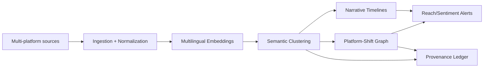

# Cross-Lingual & Cross-Platform Narrative Tracking

## Purpose

Summit requires first-class infrastructure to track narratives as they mutate across languages and
platforms. This document defines the semantic/translation layer and platform-shift graph model that
standardizes narrative clustering, temporal evolution, and reach/sentiment shift analysis.

## System Architecture

## Semantic/Translation Layer

The semantic layer resolves equivalent narratives across languages by embedding each narrative
instance (post, article, video transcript, or message) into a shared multilingual vector space.

### Core Workflow

1. **Normalize inputs**: canonicalize text, language tags, timestamps, and source metadata.
2. **Embed**: generate multilingual embeddings using a shared model family (e.g., LASER, mUSE,
   or multilingual transformer embeddings) and store vectors in the vector store.
3. **Cluster**: group narrative instances using semantic similarity thresholds, yielding
   `NarrativeCluster` identities and subclusters for drift/variant tracking.
4. **Evolve**: append time-bucketed summaries to the narrative timeline for change detection.

### Governing Rules

- All regulatory or policy-sensitive transformations are defined in policy-as-code.
- Legacy language-specific pipelines are retained as **Governed Exceptions** and must map to the
  same cluster identifiers.

## Platform-Shift Graphs

Platform-shift graphs represent narrative transitions between platforms (e.g., Telegram → TikTok →
mainstream press). Each node is a platform-specific narrative cluster; each edge is a temporal
transition with attribution to the source and sink platforms.

### Graph Semantics

- **Nodes**: `(platform, narrative_cluster_id, time_window)`
- **Edges**: directional transitions with `lag_hours`, `reach_delta`, `sentiment_delta`, and
  `amplification_factor` metrics.
- **Correlations**: transitions are scored by correlation to reach and sentiment shifts across the
  timeline to identify high-impact platform hops.

### Example Transitions

| Source → Target   | Typical Lag | Dominant Signal          |
| ----------------- | ----------- | ------------------------ |
| Telegram → TikTok | 6–24h       | Reach surge via remixing |
| TikTok → Press    | 12–48h      | Sentiment stabilization  |
| Discord → X       | 1–6h        | Rapid amplification      |

## Data Model (Logical)

### NarrativeCluster

- `id` (stable)
- `canonical_label`
- `language_distribution`
- `embedding_centroid`
- `created_at`, `updated_at`

### NarrativeInstance

- `id`
- `cluster_id`
- `platform`
- `language`
- `content_hash`
- `reach_metrics`
- `sentiment_score`
- `observed_at`

### PlatformShiftEdge

- `source_cluster_id`
- `target_cluster_id`
- `source_platform`
- `target_platform`
- `lag_hours`
- `reach_delta`
- `sentiment_delta`
- `confidence_score`

## Pipeline Stages

1. **Ingestion**: collect raw posts, articles, transcripts, and metadata.
2. **Normalization**: language detection, canonical metadata shaping, deduplication.
3. **Embedding & Clustering**: multilingual embedding and semantic grouping.
4. **Timeline Updates**: compute change deltas, drift detection, and summary snapshots.
5. **Platform-Shift Graph Update**: update edges and compute correlation impacts.
6. **Alerting**: flag high-impact transitions or rapid narrative shifts.

## Observability & Metrics

- **Cluster cohesion**: average intra-cluster similarity.
- **Cross-language coverage**: percent of clusters with ≥2 languages.
- **Platform hop impact**: average `reach_delta` and `sentiment_delta` per edge.
- **Time-to-hop**: distribution of lags between platforms.

All metrics emit to the standard observability pipeline for longitudinal monitoring.

## Governance & Compliance

- All policy-sensitive transformations (translation, redaction, bias mitigation) are executed
  through the policy engine.
- Decision records (cluster merge/split, platform-hop correlation) are logged into the provenance
  ledger for auditability.

## Verification Expectations

- Confirm embeddings populate the shared vector store and clusters resolve for at least two
  languages.
- Validate platform-shift edges for at least one cross-platform scenario with reach/sentiment
  deltas computed.
- Emit evidence artifacts (cluster cohesion metrics and platform hop impact summaries) in
  governance-aligned reporting.

## Operational Considerations

### Data Freshness Targets
- **Streaming platforms**: ≤5 minutes end-to-end for embedding + cluster updates.
- **News/press**: ≤30 minutes for ingestion to shift graph updates.

### Reliability Guardrails
- **Backfill safe mode**: bulk re-embedding routes through dedicated capacity pools.
- **Idempotent updates**: content hash + observed_at for upserts across sources.

## Risks & Mitigations
- **Language drift**: monitor semantic drift via centroid deviation thresholds.
- **Cross-platform bias**: apply platform-weight normalization before correlation scoring.
- **False merges**: enforce minimum mutual nearest-neighbor similarity for cluster merging.

## Forward-Leaning Enhancement

Introduce a **Narrative Drift Heatmap** that uses dynamic time warping on cluster timelines to
surface early inflection points before platform jumps, enabling proactive mitigation actions.
