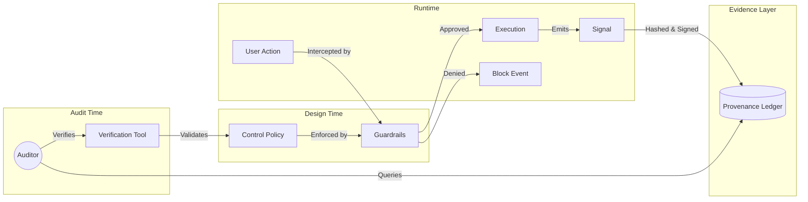

# Audit Without Theater

> **Thesis:** Summit does not "prepare" for audits. It is continuously audit-ready by design.

Traditional systems treat compliance as a fire drill—scrambling to collect screenshots, logs, and spreadsheets when an auditor arrives. Summit inverts this model. In Summit, **controls are code**, **evidence is a byproduct of execution**, and **audits are replayable verification events**.

## The Evidence Lifecycle

Summit treats audit evidence as a first-class data object, not a document.

1.  **Control Definition (Code)**
    - Controls are defined in policy files (OPA/Rego) or strict configuration schema.
    - _Example:_ "Production deployments must be signed by `release-captain`."

2.  **Signal Generation (Runtime)**
    - As the system operates, it emits structured events for every significant action.
    - _Example:_ Deployment pipeline emits `artifact_signed` and `signature_verified` events.

3.  **Evidence Crystallization (Ledger)**
    - Signals are captured, hashed, and appended to the **Provenance Ledger**.
    - This ledger is immutable. Once written, evidence cannot be altered, only appended to.

4.  **Verification (Audit)**
    - Auditors query the ledger. They do not ask engineers for screenshots.
    - They run a verification command to replay the chain of custody.

### Lifecycle Diagram



## Sample Audit Walkthrough

**Scenario:** An auditor asks, "Show me that no unauthorized code was deployed to production last quarter."

### The Old Way (Theater)

1.  CTO emails DevOps lead.
2.  DevOps lead scrapes CI/CD logs.
3.  Engineers take screenshots of GitHub branch protections.
4.  Data is pasted into a spreadsheet.
5.  Auditor samples 5% of rows and hopes for the best.

### The Summit Way (Proof)

The auditor is given read-only access to the Summit CLI and Provenance Ledger.

**Step 1: Auditor runs the verification command.**

```bash
summit verify deployments --range "2023-Q3" --environment "production"
```

**Step 2: System output.**

```text
Verifying 1,248 deployments...
✔ 1,248/1,248 artifacts have valid signatures.
✔ 1,248/1,248 artifacts trace back to a reviewed PR.
✔ 0 unauthorized deployments detected.

Report generated: docs/audit/2023-Q3-deploy-verification.json
Merkle Root: 0x9a8b...7f21 (Verified against public blockchain anchor)
```

**Step 3: Auditor drills down (if needed).**
If the auditor wants to see _one_ specific deployment:

```bash
summit inspect evidence --id dep-8821
```

_Output:_

- **Time:** 2023-08-14T10:00:00Z
- **Actor:** `alice@company.com` (MFA Verified)
- **Policy Check:** `policy/release-gates/gate.rego` (PASS)
- **Artifact Hash:** `sha256:e3b0c442...`
- **Approver:** `bob@company.com` (Review ID: PR-102)

## Why This Matters

- **Zero Anxiety:** Audits become non-events.
- **Continuous Compliance:** You know you are compliant every day, not just on audit day.
- **High Fidelity:** Verification covers 100% of events, not a random sample.
