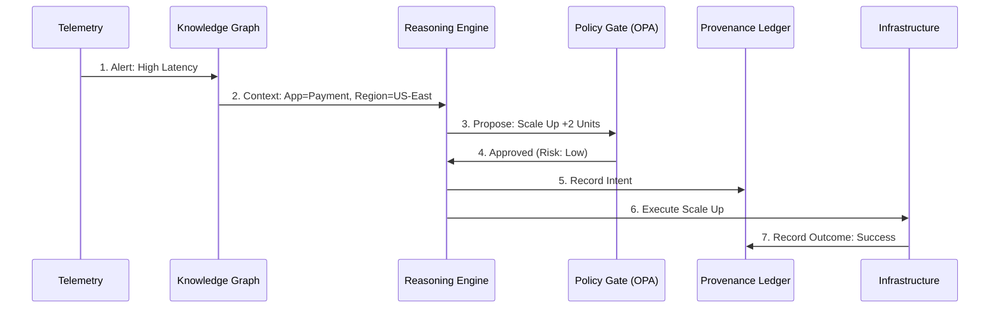
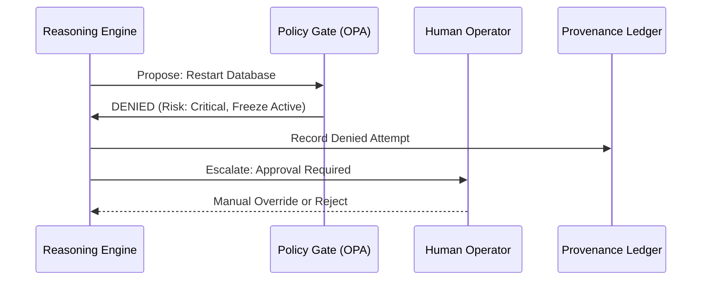

# The Summit Decision Lifecycle

**Thesis:** Decisions are not just executed; they are reasoned, gated, and permanently recorded.

Summit transforms the "black box" of AI agents into a **transparent, governable decision engine**. Unlike standard automation scripts (blind execution) or raw LLM agents (probabilistic guessing), Summit enforces a rigorous lifecycle for every action it proposes.

---

## The 7-Step Decision Loop

Every action taken by the Summit platform—whether scaling a cluster, flagging a user, or deploying a patch—follows an immutable sequence:

1.  **Signal Ingestion:** Telemetry, logs, and external intelligence are normalized into the Knowledge Graph.
2.  **Context Assembly:** The system queries the graph for provenance, history, and active policies related to the signal.
3.  **Decision Proposal:** The agent reasons over the context and proposes a specific Course of Action (CoA).
4.  **Policy Gating & Risk Scoring:** The CoA is simulated against OPA (Open Policy Agent) constraints. A risk score is assigned.
5.  **Human Veto Window:** For medium-to-high risk actions, the system pauses for a configurable window, allowing operator intervention.
6.  **Action Execution:** If approved (or auto-approved by policy), the action is executed via deterministic drivers.
7.  **Evidence Capture:** The result, including all inputs, reasoning, and policy checks, is cryptographically sealed in the Provenance Ledger.

### Visualizing the Flow

#### Happy Path: Automated Remediation

#### Blocked Path: Policy Violation (Safety Catch)

---

## Comparative Analysis

Why Summit is safer and more effective than the alternatives.

| Feature | Scripted Automation | LLM-Only Agent | Summit Governed Agent |
| :--- | :--- | :--- | :--- |
| **Trigger** | Hardcoded `if/then` | Natural Language Prompt | Context-aware Graph State |
| **Context** | None (Blind) | Limited Context Window | Full Historic & Relational Graph |
| **Safety** | Rigid (Brittle) | Unpredictable (Hallucination) | Policy-Gated & Deterministic |
| **Auditability** | Logs only | "Chat History" | Cryptographic Provenance Ledger |
| **Control** | Stop the script | Prompt Engineering | Architectural Kill Switches |

---

## Evidence & Reversibility

Every decision produces a **Decision Record** stored in the immutable ledger. This record answers:
*   **Why** was this done? (The reasoning trace)
*   **What** data was used? (The graph context snapshot)
*   **Who** allowed it? (The policy ID or human approver)

This structure allows for **Time-Travel Debugging**: operators can replay the exact state of the world at the moment the decision was made to understand the root cause of any outcome.
