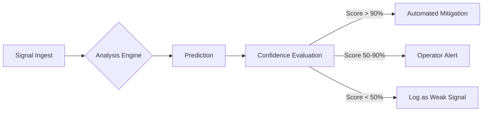

# From Detection to Prediction

**Thesis:** The best incident is the one that never happens. Summit moves operations "Left of Bang."

Traditional monitoring tells you when something is broken. Summit's **Predictive Intelligence** tells you when something is *about* to break, utilizing the temporal depth of the Knowledge Graph to extrapolate trends and detect weak signals.

---

## The Prediction Engine

Summit doesn't just look at current metrics; it analyzes **rates of change** and **graph topology**.

### Core Capabilities

1.  **Weak-Signal Detection:** correlating seemingly unrelated minor events (e.g., slight latency increase + new deployment + odd log entry) to identify emerging issues.
2.  **Trend Extrapolation:** projecting resource usage and performance metrics into the future to predict exhaustion or violation.
3.  **Policy-Aware Prediction:** predicting not just technical failures, but *compliance* failures (e.g., "At this rate, we will violate our error budget in 4 hours").

---

## Scenarios: Anticipatory Defense

### Scenario 1: The Drift Before the Outage

*   **Signal:** A configuration file is changed by a developer. It passes CI/CD but introduces a subtle memory leak.
*   **Prediction:** Summit detects a 0.5% hourly increase in memory usage across the fleet.
*   **Forecast:** "Memory exhaustion predicted in 36 hours."
*   **Action:** Opens a Jira ticket with the specific commit that started the trend, *before* any alert fires.

### Scenario 2: Insider Threat Detection

*   **Signal:** An authenticated user accesses 15 sensitive files in 10 minutes. Individually authorized, but collectively anomalous.
*   **Prediction:** Summit calculates a "Data Exfiltration Probability" score based on the user's historic baseline.
*   **Action:** Temporarily suspends the user's session and alerts Security Ops to verify intent.

### Scenario 3: Supply Chain Pre-Emption

*   **Signal:** A vulnerability is disclosed for a library used in a dependency of a dependency.
*   **Prediction:** "70% probability of exploit attempt within 7 days."
*   **Action:** Summit identifies all affected workloads via the Graph, creates a patch plan, and quarantines non-critical vulnerable services.

---

## Confidence Scoring

Summit never guesses blindly. Every prediction comes with a **Confidence Score** derived from:
*   **Data Density:** How much historical data supports this trend?
*   **Model Certainty:** How strong is the statistical correlation?
*   **Impact Severity:** What is the cost of being wrong?

This ensures operators are not flooded with noise. Only high-confidence, high-impact predictions interrupt a human.
