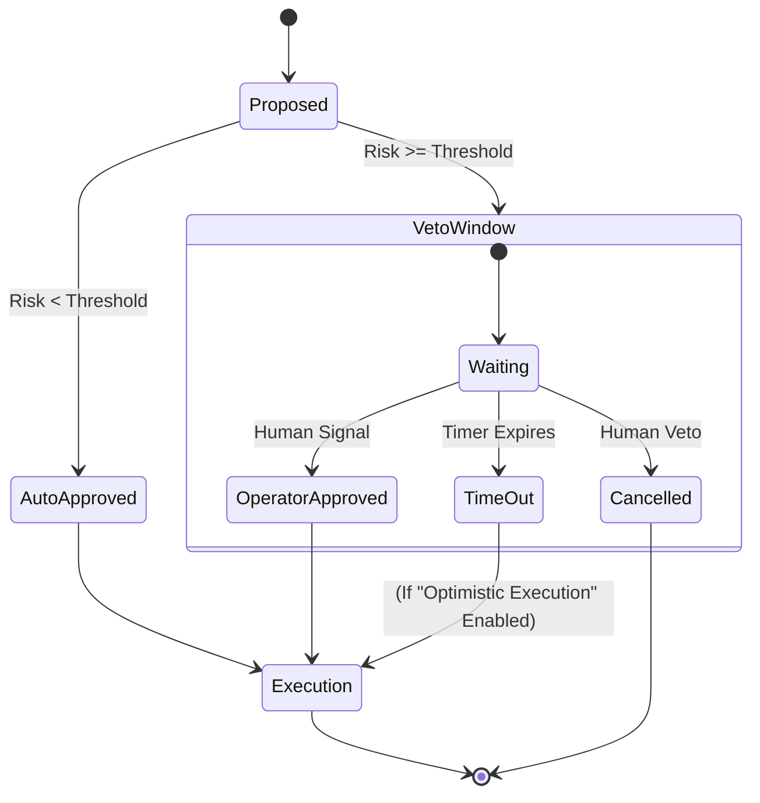

# Human-in-the-Loop Without Becoming the Bottleneck

**Thesis:** Summit provides *governable* autonomy. Humans retain absolute control without needing to click every button.

The #1 fear of deploying autonomous systems is the "runaway agent." Summit addresses this not with promises of "better alignment," but with **architectural guarantees**. We separate the *capability* to act from the *permission* to act.

---

## The Trust Model

Our trust model is based on **Progressive Autonomy**. Agents earn the right to act autonomously based on:
1.  **Confidence Score:** How certain is the model?
2.  **Risk Class:** What is the blast radius of the action?
3.  **Policy State:** Are we in normal ops, emergency, or freeze?

### Control Planes

Operators interact with Summit through three distinct control planes:

*   **Strategic Plane:** Defining policies (e.g., "Never restart DBs during business hours").
*   **Tactical Plane:** Reviewing and approving blocked actions in the queue.
*   **Emergency Plane:** Architectural kill switches that sever agent access instantly.

---

## Visualization: The Veto Window

For actions that exceed a risk threshold, Summit introduces a "Veto Window"—a time delay where the action is queued, visible, and can be cancelled before execution.

---

## Failure Scenarios & Safe Outcomes

We design for failure. What happens when the agent is wrong?

| Scenario | Traditional Agent Outcome | Summit Outcome |
| :--- | :--- | :--- |
| **Hallucination** (Agent invents a metric) | Acts on false data, potentially causing outage. | **Blocked by Policy:** Verification step fails against Graph truth. |
| **Looping** (Agent tries same fix repeatedly) | Infinite retry loop, resource exhaustion. | **Oscillation Guard:** Stability policy detects flutter and halts agent. |
| **Drift** (Agent changes config unexpectedly) | "Configuration Drift" leads to snowflake servers. | **Reverted:** Provenance Ledger detects unapproved state change. |

---

## Architectural Kill Switches

Summit includes hard-wired controls that override all agent reasoning:

1.  **Global Freeze:** Instantly downgrades all agents to "Read-Only" mode.
2.  **Scope Isolation:** Can sever an agent's access to specific sub-graphs (e.g., "Cut access to Payment System").
3.  **Budget Cap:** Hard stop on API costs or compute resources.

These are not "requests" to the agent; they are **infrastructure-level blocks**.
