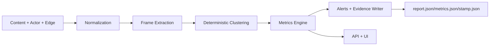

# Narrative Dynamics & Durability (NDD) Architecture

## Readiness Alignment
This module design inherits the **Summit Readiness Assertion** as the governing baseline. Any deviations are treated as **Governed Exceptions** and must be recorded in evidence artifacts and roadmap status updates.

## Module Layout (Proposed)
```
ndd/
  ingest/
    normalize.ts
    challenge-events.ts
    source-tier.ts
  frames/
    frame-extractor.ts
    clustering.ts
    determinism.ts
  metrics/
    origin-density.ts
    narrative-persistence.ts
    challenge-resistance.ts
    handoff-likelihood.ts
    comparative-framing.ts
    minimalism-shift.ts
    role-transition.ts
  alerts/
    rules.ts
    thresholds.ts
  evidence/
    evidence-writer.ts
    id-schema.ts
  api/
    routes.ts
    handlers.ts
  fixtures/
    fixtureA_seeded.json
    fixtureB_organic.json
    fixtureC_handoff.json
  out/
    report.json
    metrics.json
    stamp.json
```

## Data Schemas (Core Types)

### NarrativeCluster
```json
{
  "id": "string",
  "time_bucket": "YYYY-MM-DD",
  "frame_signature": "string",
  "seed_hash": "string",
  "members": ["content_id"],
  "source_tiers": ["fringe", "semi_legit", "mainstream"],
  "actor_roles": ["originator", "amplifier", "interpreter", "legitimizer"]
}
```

### ChallengeEvent
```json
{
  "id": "string",
  "content_id": "string",
  "event_type": "correction|rebuttal|fact_check",
  "timestamp": "ISO8601",
  "source_tier": "string",
  "link": "string"
}
```

### TierTransition
```json
{
  "id": "string",
  "cluster_id": "string",
  "from_tier": "fringe|semi_legit|mainstream",
  "to_tier": "fringe|semi_legit|mainstream",
  "timestamp": "ISO8601",
  "evidence_ids": ["string"]
}
```

### ComparativeFrame
```json
{
  "id": "string",
  "target_entity": "string",
  "comparison_phrase": "string",
  "topic": "string",
  "cluster_id": "string",
  "timestamp": "ISO8601"
}
```

### RoleState
```json
{
  "actor_id": "string",
  "cluster_id": "string",
  "role": "originator|amplifier|interpreter|legitimizer",
  "time_bucket": "YYYY-MM-DD",
  "confidence": 0.0
}
```

## Deterministic Pipeline (Pseudocode)
```
seed = ENV.SEED || "ndd-v1"
model_sha = pinned_model_hash
pipeline_version = "v0.1.0"

normalize(content):
  canonical_text = canonicalize(content.text)
  content_hash = sha256(canonical_text)
  return { ...content, canonical_text, content_hash }

cluster(frames):
  rng = seeded_rng(seed)
  embeddings = deterministic_embed(frames, model_sha)
  return seeded_cluster(embeddings, rng)

metrics(clusters, challenges):
  origin_density = unique_origins / connectivity_index
  persistence = post_challenge_volume / expected_decay
  handoff = tier_transition_score + register_shift_score
  return vector

write_evidence(run_id):
  evidence_id = `EVID-NDD-${date}-${dataset_id}-${pipeline_version}-${run_id}-${artifact}`
  write(report.json, metrics.json, stamp.json)

stamp.json:
  { code_sha, data_sha, model_sha, seed, pipeline_version, determinism_ok: true }
```

## PR-by-PR Plan (Acceptance Criteria)

### PR1 — Scaffold + Evidence + Baseline Metrics
- Scaffold `ndd/` and evidence writers.
- Implement canonical normalization and stable hashing.
- Metrics: `OriginDensityScore`, `NarrativePersistenceScore`.
- **CI Gate**: determinism run produces identical `report.json`, `metrics.json`, `stamp.json`.

### PR2 — Challenge Modeling + Robustness
- Challenge event ingestion and `ChallengeResistanceScore`.
- Regression tests for no/late/multiple challenges.
- **CI Gate**: fixture outputs stable + threshold assertions.

### PR3 — Handoff Detection (Tier + Register)
- Tier taxonomy, register shift features, `HandoffLikelihoodScore`.
- Add explainability payload.
- **CI Gate**: HLT benchmark emitted + pass threshold.

### PR4 — Comparative Framing
- Comparative extractor + cross-topic consistency scorer.
- False positive controls.
- **CI Gate**: comparative fixture precision threshold.

### PR5 — Co-evolution + Minimalism
- Role transitions and minimalism detection.
- Lifecycle timeline export.
- **CI Gate**: role transition entropy within expected range.

### PR6 — Stress-Testing Harness
- Deterministic perturbation templates + invariant extraction.
- **CI Gate**: invariants stable across perturbations.

## Evidence ID & Artifact Contract
- **Evidence ID pattern**: `EVID-NDD-{yyyyMMdd}-{datasetId}-{pipelineVersion}-{runId}-{artifact}`.
- **Artifacts per run**:
  - `out/ndd/report.json` (human-readable summary).
  - `out/ndd/metrics.json` (raw metric vectors).
  - `out/ndd/stamp.json` (determinism stamp).
- **Determinism fields (required)**: `code_sha`, `data_sha`, `model_sha`, `seed`, `pipeline_version`, `determinism_ok`.

## Determinism Controls
- Fixed seed for clustering and any sampling.
- Canonical text normalization (NFKC, lowercasing, whitespace collapse).
- Versioned embedding model with pinned hash.
- Fixed time-bucket boundaries and ordering.

## Architecture Diagram (Mermaid)


## Governance Hooks
- Policy-as-code gate for alert visibility and export.
- Audit logs for evidence ID access and privileged unmasking.
- Evidence bundle retention aligned to residency constraints.

## MAESTRO Alignment (Design Scope)
- **Layers**: Foundation, Data, Agents, Tools, Observability, Security.
- **Threats**: adversarial adaptation, prompt injection, analyst misuse, privacy leakage.
- **Mitigations**: policy gates, evidence bundles, hashing, rate limits, deterministic outputs.
