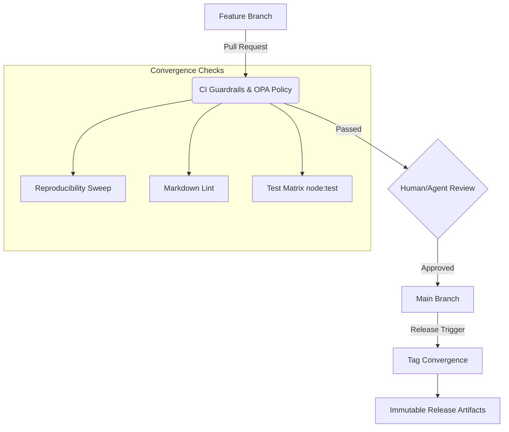
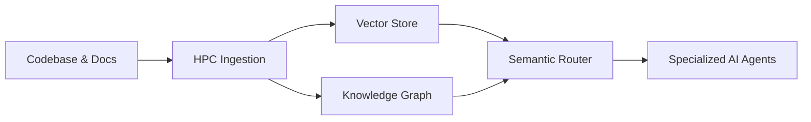
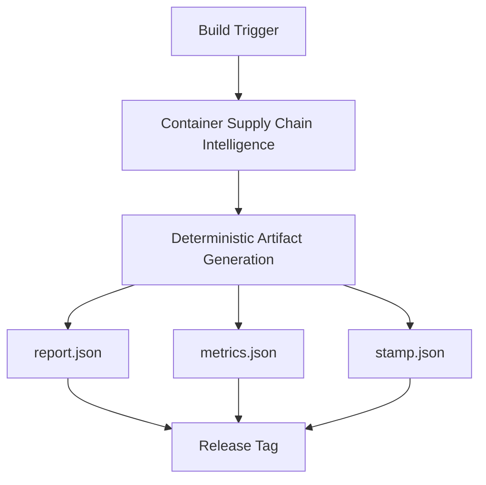

# Summit Repo at Scale: Operational Model & Ops Guide

## Overview

This living Ops Guide documents the Summit operational model for repository management at scale. As Summit evolves into an AI Investigation Infrastructure, our operational patterns focus on deterministic outputs, strong provenance, semantic-awareness, and strict governance controls.

This document covers:

- Branch and Tag Convergence
- Semantic Retrieval Architecture
- Provenance Deterministic Release Pipeline
- Governance Controls
- Runbooks for Common Failure Modes

---

## 1. Branch & Tag Convergence

Managing the Summit monorepo at scale requires a structured approach to branch and tag convergence. The flow prioritizes stability, deterministic CI gates, and safe agent execution.

### Key Principles

- **Protected Branches:** `main` is protected by `branch-protection-as-code.md` and requires passing CI/CD pipelines.
- **Dependency Pinning:** All `package.json` dependencies are pinned to exact versions (no `^` or `~`) to ensure reproducibility.
- **Convergence Checks:** PRs trigger the `summit_ga_sweep.yml` track to measure GA readiness metrics (merge health, reproducibility).

---

## 2. Semantic Retrieval Architecture

Summit leverages a semantic retrieval architecture to feed its specialized AI agents via GraphRAG, SAP (Summit Agent Protocol), and vector stores.

### Key Principles

- **GraphRAG Framework:** Progresses from basic RAG into an 'AI Investigation Infrastructure'.
- **Evidence Envelopes:** Queries retrieve context strictly mapped via Evidence Envelopes (SEP) ensuring traceability.
- **Drift Monitoring:** The Semantic Retrieval Architecture is monitored for embeddings drift and stale vectors to ensure agents have accurate context.

---

## 3. Provenance Deterministic Release Pipeline

The Summit release pipeline enforces deterministic generation of artifacts, guaranteeing strong supply-chain provenance.

### Key Principles

- **Strict Evidence IDs:** All findings use the `EVID:<source-type>:<stable-hash>` format (e.g., `EVID:attestation:4f2c9a1d`).
- **Deterministic Outputs:** Output files like `report.json` and `metrics.json` must be strictly deterministic, compliant with JSON Schema Draft 2020-12.
- **Timestamp Isolation:** All non-deterministic runtime information (e.g., timestamps) must be fully isolated to `stamp.json`.
- **Graph-based Provenance:** Provenance, attestations, and identities are modeled as first-class versioned graph entities and edges, not just scan-time metadata.

---

## 4. Governance Controls

All operations within the AI Stack are heavily gated by governance controls.

- **OPA Policies:** Execution is governed by a deny-by-default OPA policy at `.opa/policy/ai_stack.rego`, which gates actions like PR creation and benchmarking.
- **Agent Capability Graph (ACG):** Acts as the typed control plane map of agent roles, permissions, and CI gates. Evidence ID pattern: `EVID:agent-capability-graph:<version>:<node-or-edge-id>:<sequence>`.
- **Promotion Gates:** Agent configuration changes are gated by a human-in-the-loop promotion review queue (`summit/security/promotion_gate.ts`).
- **Data Handling Privacy:** Strict prohibition against logging API keys, GitHub tokens, webhook payloads, raw private prompts, or unredacted diffs.

---

## 5. Failure Modes & Runbooks

### Runbook 1: CI Break (GA Sweep or Strict Diff Failure)

**Symptoms:**

- PR fails during `summit_ga_sweep.yml` execution.
- Fast sanity check (`pnpm run test:quick`) fails.

**Diagnosis:**

1. Check the CI output for dependency drift (e.g., unpinned dependencies using `^` or `~`).
2. Verify if non-deterministic output was generated in `report.json` or `metrics.json`.
3. Check `markdownlint-cli` output for formatting errors.

**Resolution:**

1. Pin exact dependency versions in `package.json`.
2. Move any timestamp or unique runtime context into `stamp.json`.
3. Run `npx markdownlint-cli "**/*.md" --fix` to auto-resolve markdown issues.
4. Run `npm run test:quick` to verify the fix locally before pushing.

---

### Runbook 2: Verifier Mismatch (Evidence ID or Schema Error)

**Symptoms:**

- Artifacts fail schema validation (JSON Schema Draft 2020-12).
- Downstream tasks report missing or invalid Evidence IDs.

**Diagnosis:**

1. Inspect the failing artifact (e.g., in `artifacts/universal_arch/` or `reports/civilization/`).
2. Check the Evidence ID formatting. Does it match the expected pattern? (e.g., `EVID:<source-type>:<stable-hash>` or `EID:CIV:<module>:<scenario>:<nnnn>`).
3. Validate the payload against the corresponding schema in `summit/schemas/` or `adk/spec/`.

**Resolution:**

1. Ensure the code logic generating the Evidence ID conforms to the strict domain pattern.
2. Ensure the JSON payload completely aligns with Schema Draft 2020-12 requirements.
3. Rerun the deterministic evaluation suite.

---

### Runbook 3: Graph Outage (Agent Capability Graph / Docgraph)

**Symptoms:**

- Agents fail to route via the Mode Router.
- "Deny-by-default traversal policy" errors in logs.
- Queries to the Agent Capability Graph fail to retrieve nodes/edges.

**Diagnosis:**

1. Inspect `artifacts/agent-graph/graph.snapshot.json` for corruption or missing linkages.
2. Check `.opa/policy/ai_stack.rego` to see if a recent change accidentally restricted traversal.
3. Validate graph state using native `node:test` suite: `npx tsx --test tests/agent-graph/`.

**Resolution:**

1. Re-run the Agent Benchmark Spine (`scripts/bench/run-agent-spine.ts`) to regenerate the graph snapshot.
2. Rollback any erroneous changes to `.opa/policy/ai_stack.rego`.
3. Clear graph caches if applicable and restart the orchestration layer (`agentic/ai-stack/orchestrator.ts`).

---

### Runbook 4: Vector Store Drift (Semantic Retrieval Failure)

**Symptoms:**

- Agents consistently return outdated, hallucinatory, or low-trust answers.
- `drift_report.json` in `artifacts/universal_arch/` shows high drift metrics.

**Diagnosis:**

1. Compare the vector store index timestamp against the latest `main` branch commit.
2. Examine `drift_report.json` and `trend_metrics.json` for recent spikes in divergence.
3. Check if the HPC Ingestion layer successfully processed the latest repository archaeology events (Software Evolution Ledger).

**Resolution:**

1. Trigger a manual re-ingestion of the affected directories to the vector store.
2. Run the Cyber Resilience CI pipeline (`.github/workflows/crrt.yml`) to validate recovery and refresh global indices.
3. If drift is due to an underlying model change, update the expected baselines in `evaluation/benchmarks/graphrag/` and `GOLDEN/datasets/graphrag/`.
