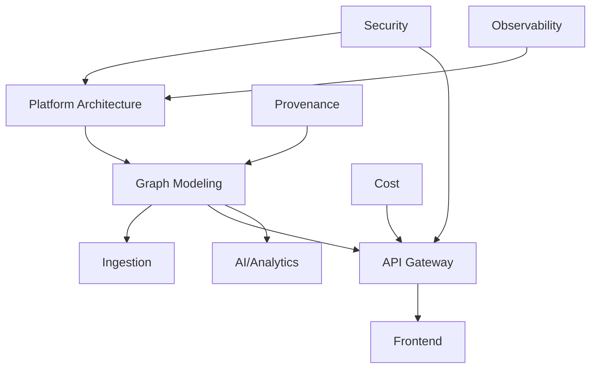
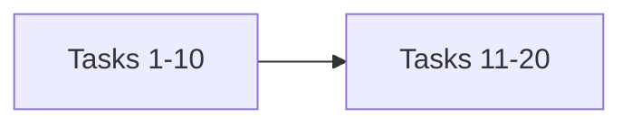

# IntelGraph Master Orchestration Plan v1.0

## Mermaid Architecture Overview

---

## EPIC 1 — Core Platform Architecture & Guardrails

### Epic Goal
Deploy the Core Platform Architecture & Guardrails layer with full SLO and governance compliance.

### Parallelization Map

### Task List

#### EP01-T01: ADR Baseline
- **Description:** Comprehensive implementation of ADR Baseline ensuring alignment with Org Default SLOs and cost guardrails.
- **Rationale:** Crucial for ADR Baseline to provide the necessary governance and performance required by the IntelGraph ecosystem.
- **Subtasks:**
  - [ ] ADR documentation for ADR Baseline.
  - [ ] Terraform apply for ADR Baseline.
  - [ ] Gate verification for ADR Baseline.
- **Assigned Agent:** Architecture Agent
- **Optional Subagents:** Infra Subagent
- **Dependencies:** ['EP01-T08']
- **Risk Tag:** Medium
- **Acceptance Criteria:**
  - [ ] ADR Baseline achieves p95 targets.
  - [ ] ADR Baseline passes all security and compliance gates.
  - [ ] ADR Baseline metadata is recorded in the provenance ledger.
- **Verification Steps:**
  - 1. Run `make test-adr-baseline`.
  - 2. Inspect OTel spans for `adr_baseline`.
  - 3. Verify ADR Baseline state in the administrative console.
- **Observability Hooks:** `intelgraph.adr_baseline.latency`, `intelgraph.adr_baseline.status`.
- **Policy Impact:** Enforces constitutional alignment for ADR Baseline.

#### EP01-T02: Topology Decisions
- **Description:** Comprehensive implementation of Topology Decisions ensuring alignment with Org Default SLOs and cost guardrails.
- **Rationale:** Crucial for Topology Decisions to provide the necessary governance and performance required by the IntelGraph ecosystem.
- **Subtasks:**
  - [ ] ADR documentation for Topology Decisions.
  - [ ] Terraform apply for Topology Decisions.
  - [ ] Gate verification for Topology Decisions.
- **Assigned Agent:** Architecture Agent
- **Optional Subagents:** Infra Subagent
- **Dependencies:** ['EP01-T08']
- **Risk Tag:** Medium
- **Acceptance Criteria:**
  - [ ] Topology Decisions achieves p95 targets.
  - [ ] Topology Decisions passes all security and compliance gates.
  - [ ] Topology Decisions metadata is recorded in the provenance ledger.
- **Verification Steps:**
  - 1. Run `make test-topology-decisions`.
  - 2. Inspect OTel spans for `topology_decisions`.
  - 3. Verify Topology Decisions state in the administrative console.
- **Observability Hooks:** `intelgraph.topology_decisions.latency`, `intelgraph.topology_decisions.status`.
- **Policy Impact:** Enforces constitutional alignment for Topology Decisions.

#### EP01-T03: SLO Enforcement Gates
- **Description:** Comprehensive implementation of SLO Enforcement Gates ensuring alignment with Org Default SLOs and cost guardrails.
- **Rationale:** Crucial for SLO Enforcement Gates to provide the necessary governance and performance required by the IntelGraph ecosystem.
- **Subtasks:**
  - [ ] ADR documentation for SLO Enforcement Gates.
  - [ ] Terraform apply for SLO Enforcement Gates.
  - [ ] Gate verification for SLO Enforcement Gates.
- **Assigned Agent:** Architecture Agent
- **Optional Subagents:** Infra Subagent
- **Dependencies:** ['EP01-T08']
- **Risk Tag:** Medium
- **Acceptance Criteria:**
  - [ ] SLO Enforcement Gates achieves p95 targets.
  - [ ] SLO Enforcement Gates passes all security and compliance gates.
  - [ ] SLO Enforcement Gates metadata is recorded in the provenance ledger.
- **Verification Steps:**
  - 1. Run `make test-slo-enforcement-gates`.
  - 2. Inspect OTel spans for `slo_enforcement_gates`.
  - 3. Verify SLO Enforcement Gates state in the administrative console.
- **Observability Hooks:** `intelgraph.slo_enforcement_gates.latency`, `intelgraph.slo_enforcement_gates.status`.
- **Policy Impact:** Enforces constitutional alignment for SLO Enforcement Gates.

#### EP01-T04: Error Budget Automation
- **Description:** Comprehensive implementation of Error Budget Automation ensuring alignment with Org Default SLOs and cost guardrails.
- **Rationale:** Crucial for Error Budget Automation to provide the necessary governance and performance required by the IntelGraph ecosystem.
- **Subtasks:**
  - [ ] ADR documentation for Error Budget Automation.
  - [ ] Terraform apply for Error Budget Automation.
  - [ ] Gate verification for Error Budget Automation.
- **Assigned Agent:** Architecture Agent
- **Optional Subagents:** Infra Subagent
- **Dependencies:** ['EP01-T08']
- **Risk Tag:** Medium
- **Acceptance Criteria:**
  - [ ] Error Budget Automation achieves p95 targets.
  - [ ] Error Budget Automation passes all security and compliance gates.
  - [ ] Error Budget Automation metadata is recorded in the provenance ledger.
- **Verification Steps:**
  - 1. Run `make test-error-budget-automation`.
  - 2. Inspect OTel spans for `error_budget_automation`.
  - 3. Verify Error Budget Automation state in the administrative console.
- **Observability Hooks:** `intelgraph.error_budget_automation.latency`, `intelgraph.error_budget_automation.status`.
- **Policy Impact:** Enforces constitutional alignment for Error Budget Automation.

#### EP01-T05: Cost Monitoring Automation
- **Description:** Comprehensive implementation of Cost Monitoring Automation ensuring alignment with Org Default SLOs and cost guardrails.
- **Rationale:** Crucial for Cost Monitoring Automation to provide the necessary governance and performance required by the IntelGraph ecosystem.
- **Subtasks:**
  - [ ] ADR documentation for Cost Monitoring Automation.
  - [ ] Terraform apply for Cost Monitoring Automation.
  - [ ] Gate verification for Cost Monitoring Automation.
- **Assigned Agent:** Architecture Agent
- **Optional Subagents:** Infra Subagent
- **Dependencies:** ['EP01-T08']
- **Risk Tag:** Medium
- **Acceptance Criteria:**
  - [ ] Cost Monitoring Automation achieves p95 targets.
  - [ ] Cost Monitoring Automation passes all security and compliance gates.
  - [ ] Cost Monitoring Automation metadata is recorded in the provenance ledger.
- **Verification Steps:**
  - 1. Run `make test-cost-monitoring-automation`.
  - 2. Inspect OTel spans for `cost_monitoring_automation`.
  - 3. Verify Cost Monitoring Automation state in the administrative console.
- **Observability Hooks:** `intelgraph.cost_monitoring_automation.latency`, `intelgraph.cost_monitoring_automation.status`.
- **Policy Impact:** Enforces constitutional alignment for Cost Monitoring Automation.

#### EP01-T06: Region Sharding Plan
- **Description:** Comprehensive implementation of Region Sharding Plan ensuring alignment with Org Default SLOs and cost guardrails.
- **Rationale:** Crucial for Region Sharding Plan to provide the necessary governance and performance required by the IntelGraph ecosystem.
- **Subtasks:**
  - [ ] ADR documentation for Region Sharding Plan.
  - [ ] Terraform apply for Region Sharding Plan.
  - [ ] Gate verification for Region Sharding Plan.
- **Assigned Agent:** Architecture Agent
- **Optional Subagents:** Infra Subagent
- **Dependencies:** ['EP01-T08']
- **Risk Tag:** Medium
- **Acceptance Criteria:**
  - [ ] Region Sharding Plan achieves p95 targets.
  - [ ] Region Sharding Plan passes all security and compliance gates.
  - [ ] Region Sharding Plan metadata is recorded in the provenance ledger.
- **Verification Steps:**
  - 1. Run `make test-region-sharding-plan`.
  - 2. Inspect OTel spans for `region_sharding_plan`.
  - 3. Verify Region Sharding Plan state in the administrative console.
- **Observability Hooks:** `intelgraph.region_sharding_plan.latency`, `intelgraph.region_sharding_plan.status`.
- **Policy Impact:** Enforces constitutional alignment for Region Sharding Plan.

#### EP01-T07: Deployment Patterns
- **Description:** Comprehensive implementation of Deployment Patterns ensuring alignment with Org Default SLOs and cost guardrails.
- **Rationale:** Crucial for Deployment Patterns to provide the necessary governance and performance required by the IntelGraph ecosystem.
- **Subtasks:**
  - [ ] ADR documentation for Deployment Patterns.
  - [ ] Terraform apply for Deployment Patterns.
  - [ ] Gate verification for Deployment Patterns.
- **Assigned Agent:** Architecture Agent
- **Optional Subagents:** Infra Subagent
- **Dependencies:** ['EP01-T08']
- **Risk Tag:** Medium
- **Acceptance Criteria:**
  - [ ] Deployment Patterns achieves p95 targets.
  - [ ] Deployment Patterns passes all security and compliance gates.
  - [ ] Deployment Patterns metadata is recorded in the provenance ledger.
- **Verification Steps:**
  - 1. Run `make test-deployment-patterns`.
  - 2. Inspect OTel spans for `deployment_patterns`.
  - 3. Verify Deployment Patterns state in the administrative console.
- **Observability Hooks:** `intelgraph.deployment_patterns.latency`, `intelgraph.deployment_patterns.status`.
- **Policy Impact:** Enforces constitutional alignment for Deployment Patterns.

#### EP01-T08: Infra Bootstrap
- **Description:** Comprehensive implementation of Infra Bootstrap ensuring alignment with Org Default SLOs and cost guardrails.
- **Rationale:** Crucial for Infra Bootstrap to provide the necessary governance and performance required by the IntelGraph ecosystem.
- **Subtasks:**
  - [ ] ADR documentation for Infra Bootstrap.
  - [ ] Terraform apply for Infra Bootstrap.
  - [ ] Gate verification for Infra Bootstrap.
- **Assigned Agent:** Architecture Agent
- **Optional Subagents:** Infra Subagent
- **Dependencies:** []
- **Risk Tag:** Medium
- **Acceptance Criteria:**
  - [ ] Infra Bootstrap achieves p95 targets.
  - [ ] Infra Bootstrap passes all security and compliance gates.
  - [ ] Infra Bootstrap metadata is recorded in the provenance ledger.
- **Verification Steps:**
  - 1. Run `make test-infra-bootstrap`.
  - 2. Inspect OTel spans for `infra_bootstrap`.
  - 3. Verify Infra Bootstrap state in the administrative console.
- **Observability Hooks:** `intelgraph.infra_bootstrap.latency`, `intelgraph.infra_bootstrap.status`.
- **Policy Impact:** Enforces constitutional alignment for Infra Bootstrap.

#### EP01-T09: Secrets Handling
- **Description:** Comprehensive implementation of Secrets Handling ensuring alignment with Org Default SLOs and cost guardrails.
- **Rationale:** Crucial for Secrets Handling to provide the necessary governance and performance required by the IntelGraph ecosystem.
- **Subtasks:**
  - [ ] ADR documentation for Secrets Handling.
  - [ ] Terraform apply for Secrets Handling.
  - [ ] Gate verification for Secrets Handling.
- **Assigned Agent:** Architecture Agent
- **Optional Subagents:** Infra Subagent
- **Dependencies:** ['EP01-T08']
- **Risk Tag:** Medium
- **Acceptance Criteria:**
  - [ ] Secrets Handling achieves p95 targets.
  - [ ] Secrets Handling passes all security and compliance gates.
  - [ ] Secrets Handling metadata is recorded in the provenance ledger.
- **Verification Steps:**
  - 1. Run `make test-secrets-handling`.
  - 2. Inspect OTel spans for `secrets_handling`.
  - 3. Verify Secrets Handling state in the administrative console.
- **Observability Hooks:** `intelgraph.secrets_handling.latency`, `intelgraph.secrets_handling.status`.
- **Policy Impact:** Enforces constitutional alignment for Secrets Handling.

#### EP01-T10: mTLS Enforcement
- **Description:** Comprehensive implementation of mTLS Enforcement ensuring alignment with Org Default SLOs and cost guardrails.
- **Rationale:** Crucial for mTLS Enforcement to provide the necessary governance and performance required by the IntelGraph ecosystem.
- **Subtasks:**
  - [ ] ADR documentation for mTLS Enforcement.
  - [ ] Terraform apply for mTLS Enforcement.
  - [ ] Gate verification for mTLS Enforcement.
- **Assigned Agent:** Architecture Agent
- **Optional Subagents:** Infra Subagent
- **Dependencies:** ['EP01-T08']
- **Risk Tag:** Medium
- **Acceptance Criteria:**
  - [ ] mTLS Enforcement achieves p95 targets.
  - [ ] mTLS Enforcement passes all security and compliance gates.
  - [ ] mTLS Enforcement metadata is recorded in the provenance ledger.
- **Verification Steps:**
  - 1. Run `make test-mtls-enforcement`.
  - 2. Inspect OTel spans for `mtls_enforcement`.
  - 3. Verify mTLS Enforcement state in the administrative console.
- **Observability Hooks:** `intelgraph.mtls_enforcement.latency`, `intelgraph.mtls_enforcement.status`.
- **Policy Impact:** Enforces constitutional alignment for mTLS Enforcement.

#### EP01-T11: OIDC/JWT Validation
- **Description:** Comprehensive implementation of OIDC/JWT Validation ensuring alignment with Org Default SLOs and cost guardrails.
- **Rationale:** Crucial for OIDC/JWT Validation to provide the necessary governance and performance required by the IntelGraph ecosystem.
- **Subtasks:**
  - [ ] ADR documentation for OIDC/JWT Validation.
  - [ ] Terraform apply for OIDC/JWT Validation.
  - [ ] Gate verification for OIDC/JWT Validation.
- **Assigned Agent:** Architecture Agent
- **Optional Subagents:** Infra Subagent
- **Dependencies:** ['EP01-T08']
- **Risk Tag:** Medium
- **Acceptance Criteria:**
  - [ ] OIDC/JWT Validation achieves p95 targets.
  - [ ] OIDC/JWT Validation passes all security and compliance gates.
  - [ ] OIDC/JWT Validation metadata is recorded in the provenance ledger.
- **Verification Steps:**
  - 1. Run `make test-oidc/jwt-validation`.
  - 2. Inspect OTel spans for `oidc/jwt_validation`.
  - 3. Verify OIDC/JWT Validation state in the administrative console.
- **Observability Hooks:** `intelgraph.oidc/jwt_validation.latency`, `intelgraph.oidc/jwt_validation.status`.
- **Policy Impact:** Enforces constitutional alignment for OIDC/JWT Validation.

#### EP01-T12: OPA Integration
- **Description:** Comprehensive implementation of OPA Integration ensuring alignment with Org Default SLOs and cost guardrails.
- **Rationale:** Crucial for OPA Integration to provide the necessary governance and performance required by the IntelGraph ecosystem.
- **Subtasks:**
  - [ ] ADR documentation for OPA Integration.
  - [ ] Terraform apply for OPA Integration.
  - [ ] Gate verification for OPA Integration.
- **Assigned Agent:** Architecture Agent
- **Optional Subagents:** Infra Subagent
- **Dependencies:** ['EP01-T08']
- **Risk Tag:** Medium
- **Acceptance Criteria:**
  - [ ] OPA Integration achieves p95 targets.
  - [ ] OPA Integration passes all security and compliance gates.
  - [ ] OPA Integration metadata is recorded in the provenance ledger.
- **Verification Steps:**
  - 1. Run `make test-opa-integration`.
  - 2. Inspect OTel spans for `opa_integration`.
  - 3. Verify OPA Integration state in the administrative console.
- **Observability Hooks:** `intelgraph.opa_integration.latency`, `intelgraph.opa_integration.status`.
- **Policy Impact:** Enforces constitutional alignment for OPA Integration.

#### EP01-T13: Multi-tenant Isolation Model
- **Description:** Comprehensive implementation of Multi-tenant Isolation Model ensuring alignment with Org Default SLOs and cost guardrails.
- **Rationale:** Crucial for Multi-tenant Isolation Model to provide the necessary governance and performance required by the IntelGraph ecosystem.
- **Subtasks:**
  - [ ] ADR documentation for Multi-tenant Isolation Model.
  - [ ] Terraform apply for Multi-tenant Isolation Model.
  - [ ] Gate verification for Multi-tenant Isolation Model.
- **Assigned Agent:** Architecture Agent
- **Optional Subagents:** Infra Subagent
- **Dependencies:** ['EP01-T08']
- **Risk Tag:** Medium
- **Acceptance Criteria:**
  - [ ] Multi-tenant Isolation Model achieves p95 targets.
  - [ ] Multi-tenant Isolation Model passes all security and compliance gates.
  - [ ] Multi-tenant Isolation Model metadata is recorded in the provenance ledger.
- **Verification Steps:**
  - 1. Run `make test-multi-tenant-isolation-model`.
  - 2. Inspect OTel spans for `multi-tenant_isolation_model`.
  - 3. Verify Multi-tenant Isolation Model state in the administrative console.
- **Observability Hooks:** `intelgraph.multi-tenant_isolation_model.latency`, `intelgraph.multi-tenant_isolation_model.status`.
- **Policy Impact:** Enforces constitutional alignment for Multi-tenant Isolation Model.

#### EP01-T14: Policy Seed Pre-load
- **Description:** Comprehensive implementation of Policy Seed Pre-load ensuring alignment with Org Default SLOs and cost guardrails.
- **Rationale:** Crucial for Policy Seed Pre-load to provide the necessary governance and performance required by the IntelGraph ecosystem.
- **Subtasks:**
  - [ ] ADR documentation for Policy Seed Pre-load.
  - [ ] Terraform apply for Policy Seed Pre-load.
  - [ ] Gate verification for Policy Seed Pre-load.
- **Assigned Agent:** Architecture Agent
- **Optional Subagents:** Infra Subagent
- **Dependencies:** ['EP01-T08']
- **Risk Tag:** Medium
- **Acceptance Criteria:**
  - [ ] Policy Seed Pre-load achieves p95 targets.
  - [ ] Policy Seed Pre-load passes all security and compliance gates.
  - [ ] Policy Seed Pre-load metadata is recorded in the provenance ledger.
- **Verification Steps:**
  - 1. Run `make test-policy-seed-pre-load`.
  - 2. Inspect OTel spans for `policy_seed_pre-load`.
  - 3. Verify Policy Seed Pre-load state in the administrative console.
- **Observability Hooks:** `intelgraph.policy_seed_pre-load.latency`, `intelgraph.policy_seed_pre-load.status`.
- **Policy Impact:** Enforces constitutional alignment for Policy Seed Pre-load.

#### EP01-T15: CI Quality Gates
- **Description:** Comprehensive implementation of CI Quality Gates ensuring alignment with Org Default SLOs and cost guardrails.
- **Rationale:** Crucial for CI Quality Gates to provide the necessary governance and performance required by the IntelGraph ecosystem.
- **Subtasks:**
  - [ ] ADR documentation for CI Quality Gates.
  - [ ] Terraform apply for CI Quality Gates.
  - [ ] Gate verification for CI Quality Gates.
- **Assigned Agent:** Architecture Agent
- **Optional Subagents:** Infra Subagent
- **Dependencies:** ['EP01-T08']
- **Risk Tag:** Medium
- **Acceptance Criteria:**
  - [ ] CI Quality Gates achieves p95 targets.
  - [ ] CI Quality Gates passes all security and compliance gates.
  - [ ] CI Quality Gates metadata is recorded in the provenance ledger.
- **Verification Steps:**
  - 1. Run `make test-ci-quality-gates`.
  - 2. Inspect OTel spans for `ci_quality_gates`.
  - 3. Verify CI Quality Gates state in the administrative console.
- **Observability Hooks:** `intelgraph.ci_quality_gates.latency`, `intelgraph.ci_quality_gates.status`.
- **Policy Impact:** Enforces constitutional alignment for CI Quality Gates.

#### EP01-T16: SBOM Generation
- **Description:** Comprehensive implementation of SBOM Generation ensuring alignment with Org Default SLOs and cost guardrails.
- **Rationale:** Crucial for SBOM Generation to provide the necessary governance and performance required by the IntelGraph ecosystem.
- **Subtasks:**
  - [ ] ADR documentation for SBOM Generation.
  - [ ] Terraform apply for SBOM Generation.
  - [ ] Gate verification for SBOM Generation.
- **Assigned Agent:** Architecture Agent
- **Optional Subagents:** Infra Subagent
- **Dependencies:** ['EP01-T08']
- **Risk Tag:** Medium
- **Acceptance Criteria:**
  - [ ] SBOM Generation achieves p95 targets.
  - [ ] SBOM Generation passes all security and compliance gates.
  - [ ] SBOM Generation metadata is recorded in the provenance ledger.
- **Verification Steps:**
  - 1. Run `make test-sbom-generation`.
  - 2. Inspect OTel spans for `sbom_generation`.
  - 3. Verify SBOM Generation state in the administrative console.
- **Observability Hooks:** `intelgraph.sbom_generation.latency`, `intelgraph.sbom_generation.status`.
- **Policy Impact:** Enforces constitutional alignment for SBOM Generation.

#### EP01-T17: Rollback Strategy
- **Description:** Comprehensive implementation of Rollback Strategy ensuring alignment with Org Default SLOs and cost guardrails.
- **Rationale:** Crucial for Rollback Strategy to provide the necessary governance and performance required by the IntelGraph ecosystem.
- **Subtasks:**
  - [ ] ADR documentation for Rollback Strategy.
  - [ ] Terraform apply for Rollback Strategy.
  - [ ] Gate verification for Rollback Strategy.
- **Assigned Agent:** Architecture Agent
- **Optional Subagents:** Infra Subagent
- **Dependencies:** ['EP01-T08']
- **Risk Tag:** Medium
- **Acceptance Criteria:**
  - [ ] Rollback Strategy achieves p95 targets.
  - [ ] Rollback Strategy passes all security and compliance gates.
  - [ ] Rollback Strategy metadata is recorded in the provenance ledger.
- **Verification Steps:**
  - 1. Run `make test-rollback-strategy`.
  - 2. Inspect OTel spans for `rollback_strategy`.
  - 3. Verify Rollback Strategy state in the administrative console.
- **Observability Hooks:** `intelgraph.rollback_strategy.latency`, `intelgraph.rollback_strategy.status`.
- **Policy Impact:** Enforces constitutional alignment for Rollback Strategy.

#### EP01-T18: Canary Deployment Pattern
- **Description:** Comprehensive implementation of Canary Deployment Pattern ensuring alignment with Org Default SLOs and cost guardrails.
- **Rationale:** Crucial for Canary Deployment Pattern to provide the necessary governance and performance required by the IntelGraph ecosystem.
- **Subtasks:**
  - [ ] ADR documentation for Canary Deployment Pattern.
  - [ ] Terraform apply for Canary Deployment Pattern.
  - [ ] Gate verification for Canary Deployment Pattern.
- **Assigned Agent:** Architecture Agent
- **Optional Subagents:** Infra Subagent
- **Dependencies:** ['EP01-T08']
- **Risk Tag:** Medium
- **Acceptance Criteria:**
  - [ ] Canary Deployment Pattern achieves p95 targets.
  - [ ] Canary Deployment Pattern passes all security and compliance gates.
  - [ ] Canary Deployment Pattern metadata is recorded in the provenance ledger.
- **Verification Steps:**
  - 1. Run `make test-canary-deployment-pattern`.
  - 2. Inspect OTel spans for `canary_deployment_pattern`.
  - 3. Verify Canary Deployment Pattern state in the administrative console.
- **Observability Hooks:** `intelgraph.canary_deployment_pattern.latency`, `intelgraph.canary_deployment_pattern.status`.
- **Policy Impact:** Enforces constitutional alignment for Canary Deployment Pattern.

#### EP01-T19: Budget Alert Hooks
- **Description:** Comprehensive implementation of Budget Alert Hooks ensuring alignment with Org Default SLOs and cost guardrails.
- **Rationale:** Crucial for Budget Alert Hooks to provide the necessary governance and performance required by the IntelGraph ecosystem.
- **Subtasks:**
  - [ ] ADR documentation for Budget Alert Hooks.
  - [ ] Terraform apply for Budget Alert Hooks.
  - [ ] Gate verification for Budget Alert Hooks.
- **Assigned Agent:** Architecture Agent
- **Optional Subagents:** Infra Subagent
- **Dependencies:** ['EP01-T08']
- **Risk Tag:** Medium
- **Acceptance Criteria:**
  - [ ] Budget Alert Hooks achieves p95 targets.
  - [ ] Budget Alert Hooks passes all security and compliance gates.
  - [ ] Budget Alert Hooks metadata is recorded in the provenance ledger.
- **Verification Steps:**
  - 1. Run `make test-budget-alert-hooks`.
  - 2. Inspect OTel spans for `budget_alert_hooks`.
  - 3. Verify Budget Alert Hooks state in the administrative console.
- **Observability Hooks:** `intelgraph.budget_alert_hooks.latency`, `intelgraph.budget_alert_hooks.status`.
- **Policy Impact:** Enforces constitutional alignment for Budget Alert Hooks.

#### EP01-T20: Governance Drift Detection
- **Description:** Comprehensive implementation of Governance Drift Detection ensuring alignment with Org Default SLOs and cost guardrails.
- **Rationale:** Crucial for Governance Drift Detection to provide the necessary governance and performance required by the IntelGraph ecosystem.
- **Subtasks:**
  - [ ] ADR documentation for Governance Drift Detection.
  - [ ] Terraform apply for Governance Drift Detection.
  - [ ] Gate verification for Governance Drift Detection.
- **Assigned Agent:** Architecture Agent
- **Optional Subagents:** Infra Subagent
- **Dependencies:** ['EP01-T08']
- **Risk Tag:** Medium
- **Acceptance Criteria:**
  - [ ] Governance Drift Detection achieves p95 targets.
  - [ ] Governance Drift Detection passes all security and compliance gates.
  - [ ] Governance Drift Detection metadata is recorded in the provenance ledger.
- **Verification Steps:**
  - 1. Run `make test-governance-drift-detection`.
  - 2. Inspect OTel spans for `governance_drift_detection`.
  - 3. Verify Governance Drift Detection state in the administrative console.
- **Observability Hooks:** `intelgraph.governance_drift_detection.latency`, `intelgraph.governance_drift_detection.status`.
- **Policy Impact:** Enforces constitutional alignment for Governance Drift Detection.

### Critical Path
EP01-T08 -> EP02-T01 -> EP04-T01 -> EP06-T01.

### Rollback Strategy
Revert to previous stable Git SHA and execute DB migration down-scripts.

---

## EPIC 2 — Graph & Data Modeling

### Epic Goal
Deploy the Graph & Data Modeling layer with full SLO and governance compliance.

### Parallelization Map

### Task List

#### EP02-T01: Canonical Ontology Definition
- **Description:** Comprehensive implementation of Canonical Ontology Definition ensuring alignment with Org Default SLOs and cost guardrails.
- **Rationale:** Crucial for Canonical Ontology Definition to provide the necessary governance and performance required by the IntelGraph ecosystem.
- **Subtasks:**
  - [ ] Graph schema update for Canonical Ontology Definition.
  - [ ] Index creation for Canonical Ontology Definition.
  - [ ] Data migration script for Canonical Ontology Definition.
- **Assigned Agent:** Data Agent
- **Optional Subagents:** Schema Subagent
- **Dependencies:** ['EP01-T08']
- **Risk Tag:** Medium
- **Acceptance Criteria:**
  - [ ] Canonical Ontology Definition achieves p95 targets.
  - [ ] Canonical Ontology Definition passes all security and compliance gates.
  - [ ] Canonical Ontology Definition metadata is recorded in the provenance ledger.
- **Verification Steps:**
  - 1. Run `cypher-shell 'MATCH (n) RETURN count(n)'`.
  - 2. Inspect OTel spans for `canonical_ontology_definition`.
  - 3. Verify Canonical Ontology Definition state in the administrative console.
- **Observability Hooks:** `intelgraph.canonical_ontology_definition.latency`, `intelgraph.canonical_ontology_definition.status`.
- **Policy Impact:** Enforces constitutional alignment for Canonical Ontology Definition.

#### EP02-T02: Neo4j Schema Design
- **Description:** Comprehensive implementation of Neo4j Schema Design ensuring alignment with Org Default SLOs and cost guardrails.
- **Rationale:** Crucial for Neo4j Schema Design to provide the necessary governance and performance required by the IntelGraph ecosystem.
- **Subtasks:**
  - [ ] Graph schema update for Neo4j Schema Design.
  - [ ] Index creation for Neo4j Schema Design.
  - [ ] Data migration script for Neo4j Schema Design.
- **Assigned Agent:** Data Agent
- **Optional Subagents:** Schema Subagent
- **Dependencies:** ['EP01-T08']
- **Risk Tag:** Medium
- **Acceptance Criteria:**
  - [ ] Neo4j Schema Design achieves p95 targets.
  - [ ] Neo4j Schema Design passes all security and compliance gates.
  - [ ] Neo4j Schema Design metadata is recorded in the provenance ledger.
- **Verification Steps:**
  - 1. Run `cypher-shell 'MATCH (n) RETURN count(n)'`.
  - 2. Inspect OTel spans for `neo4j_schema_design`.
  - 3. Verify Neo4j Schema Design state in the administrative console.
- **Observability Hooks:** `intelgraph.neo4j_schema_design.latency`, `intelgraph.neo4j_schema_design.status`.
- **Policy Impact:** Enforces constitutional alignment for Neo4j Schema Design.

#### EP02-T03: PostgreSQL Relational Anchors
- **Description:** Comprehensive implementation of PostgreSQL Relational Anchors ensuring alignment with Org Default SLOs and cost guardrails.
- **Rationale:** Crucial for PostgreSQL Relational Anchors to provide the necessary governance and performance required by the IntelGraph ecosystem.
- **Subtasks:**
  - [ ] Graph schema update for PostgreSQL Relational Anchors.
  - [ ] Index creation for PostgreSQL Relational Anchors.
  - [ ] Data migration script for PostgreSQL Relational Anchors.
- **Assigned Agent:** Data Agent
- **Optional Subagents:** Schema Subagent
- **Dependencies:** ['EP01-T08']
- **Risk Tag:** Medium
- **Acceptance Criteria:**
  - [ ] PostgreSQL Relational Anchors achieves p95 targets.
  - [ ] PostgreSQL Relational Anchors passes all security and compliance gates.
  - [ ] PostgreSQL Relational Anchors metadata is recorded in the provenance ledger.
- **Verification Steps:**
  - 1. Run `cypher-shell 'MATCH (n) RETURN count(n)'`.
  - 2. Inspect OTel spans for `postgresql_relational_anchors`.
  - 3. Verify PostgreSQL Relational Anchors state in the administrative console.
- **Observability Hooks:** `intelgraph.postgresql_relational_anchors.latency`, `intelgraph.postgresql_relational_anchors.status`.
- **Policy Impact:** Enforces constitutional alignment for PostgreSQL Relational Anchors.

#### EP02-T04: Field-level Encryption Schema
- **Description:** Comprehensive implementation of Field-level Encryption Schema ensuring alignment with Org Default SLOs and cost guardrails.
- **Rationale:** Crucial for Field-level Encryption Schema to provide the necessary governance and performance required by the IntelGraph ecosystem.
- **Subtasks:**
  - [ ] Graph schema update for Field-level Encryption Schema.
  - [ ] Index creation for Field-level Encryption Schema.
  - [ ] Data migration script for Field-level Encryption Schema.
- **Assigned Agent:** Data Agent
- **Optional Subagents:** Schema Subagent
- **Dependencies:** ['EP01-T08']
- **Risk Tag:** Medium
- **Acceptance Criteria:**
  - [ ] Field-level Encryption Schema achieves p95 targets.
  - [ ] Field-level Encryption Schema passes all security and compliance gates.
  - [ ] Field-level Encryption Schema metadata is recorded in the provenance ledger.
- **Verification Steps:**
  - 1. Run `cypher-shell 'MATCH (n) RETURN count(n)'`.
  - 2. Inspect OTel spans for `field-level_encryption_schema`.
  - 3. Verify Field-level Encryption Schema state in the administrative console.
- **Observability Hooks:** `intelgraph.field-level_encryption_schema.latency`, `intelgraph.field-level_encryption_schema.status`.
- **Policy Impact:** Enforces constitutional alignment for Field-level Encryption Schema.

#### EP02-T05: Residency Tagging
- **Description:** Comprehensive implementation of Residency Tagging ensuring alignment with Org Default SLOs and cost guardrails.
- **Rationale:** Crucial for Residency Tagging to provide the necessary governance and performance required by the IntelGraph ecosystem.
- **Subtasks:**
  - [ ] Graph schema update for Residency Tagging.
  - [ ] Index creation for Residency Tagging.
  - [ ] Data migration script for Residency Tagging.
- **Assigned Agent:** Data Agent
- **Optional Subagents:** Schema Subagent
- **Dependencies:** ['EP01-T08']
- **Risk Tag:** Medium
- **Acceptance Criteria:**
  - [ ] Residency Tagging achieves p95 targets.
  - [ ] Residency Tagging passes all security and compliance gates.
  - [ ] Residency Tagging metadata is recorded in the provenance ledger.
- **Verification Steps:**
  - 1. Run `cypher-shell 'MATCH (n) RETURN count(n)'`.
  - 2. Inspect OTel spans for `residency_tagging`.
  - 3. Verify Residency Tagging state in the administrative console.
- **Observability Hooks:** `intelgraph.residency_tagging.latency`, `intelgraph.residency_tagging.status`.
- **Policy Impact:** Enforces constitutional alignment for Residency Tagging.

#### EP02-T06: Retention Tiers Enforcement
- **Description:** Comprehensive implementation of Retention Tiers Enforcement ensuring alignment with Org Default SLOs and cost guardrails.
- **Rationale:** Crucial for Retention Tiers Enforcement to provide the necessary governance and performance required by the IntelGraph ecosystem.
- **Subtasks:**
  - [ ] Graph schema update for Retention Tiers Enforcement.
  - [ ] Index creation for Retention Tiers Enforcement.
  - [ ] Data migration script for Retention Tiers Enforcement.
- **Assigned Agent:** Data Agent
- **Optional Subagents:** Schema Subagent
- **Dependencies:** ['EP01-T08']
- **Risk Tag:** Medium
- **Acceptance Criteria:**
  - [ ] Retention Tiers Enforcement achieves p95 targets.
  - [ ] Retention Tiers Enforcement passes all security and compliance gates.
  - [ ] Retention Tiers Enforcement metadata is recorded in the provenance ledger.
- **Verification Steps:**
  - 1. Run `cypher-shell 'MATCH (n) RETURN count(n)'`.
  - 2. Inspect OTel spans for `retention_tiers_enforcement`.
  - 3. Verify Retention Tiers Enforcement state in the administrative console.
- **Observability Hooks:** `intelgraph.retention_tiers_enforcement.latency`, `intelgraph.retention_tiers_enforcement.status`.
- **Policy Impact:** Enforces constitutional alignment for Retention Tiers Enforcement.

#### EP02-T07: Purpose Tagging Model
- **Description:** Comprehensive implementation of Purpose Tagging Model ensuring alignment with Org Default SLOs and cost guardrails.
- **Rationale:** Crucial for Purpose Tagging Model to provide the necessary governance and performance required by the IntelGraph ecosystem.
- **Subtasks:**
  - [ ] Graph schema update for Purpose Tagging Model.
  - [ ] Index creation for Purpose Tagging Model.
  - [ ] Data migration script for Purpose Tagging Model.
- **Assigned Agent:** Data Agent
- **Optional Subagents:** Schema Subagent
- **Dependencies:** ['EP01-T08']
- **Risk Tag:** Medium
- **Acceptance Criteria:**
  - [ ] Purpose Tagging Model achieves p95 targets.
  - [ ] Purpose Tagging Model passes all security and compliance gates.
  - [ ] Purpose Tagging Model metadata is recorded in the provenance ledger.
- **Verification Steps:**
  - 1. Run `cypher-shell 'MATCH (n) RETURN count(n)'`.
  - 2. Inspect OTel spans for `purpose_tagging_model`.
  - 3. Verify Purpose Tagging Model state in the administrative console.
- **Observability Hooks:** `intelgraph.purpose_tagging_model.latency`, `intelgraph.purpose_tagging_model.status`.
- **Policy Impact:** Enforces constitutional alignment for Purpose Tagging Model.

#### EP02-T08: Claim/Evidence Graph Model
- **Description:** Comprehensive implementation of Claim/Evidence Graph Model ensuring alignment with Org Default SLOs and cost guardrails.
- **Rationale:** Crucial for Claim/Evidence Graph Model to provide the necessary governance and performance required by the IntelGraph ecosystem.
- **Subtasks:**
  - [ ] Graph schema update for Claim/Evidence Graph Model.
  - [ ] Index creation for Claim/Evidence Graph Model.
  - [ ] Data migration script for Claim/Evidence Graph Model.
- **Assigned Agent:** Data Agent
- **Optional Subagents:** Schema Subagent
- **Dependencies:** ['EP01-T08']
- **Risk Tag:** Medium
- **Acceptance Criteria:**
  - [ ] Claim/Evidence Graph Model achieves p95 targets.
  - [ ] Claim/Evidence Graph Model passes all security and compliance gates.
  - [ ] Claim/Evidence Graph Model metadata is recorded in the provenance ledger.
- **Verification Steps:**
  - 1. Run `cypher-shell 'MATCH (n) RETURN count(n)'`.
  - 2. Inspect OTel spans for `claim/evidence_graph_model`.
  - 3. Verify Claim/Evidence Graph Model state in the administrative console.
- **Observability Hooks:** `intelgraph.claim/evidence_graph_model.latency`, `intelgraph.claim/evidence_graph_model.status`.
- **Policy Impact:** Enforces constitutional alignment for Claim/Evidence Graph Model.

#### EP02-T09: Provenance Ledger Schema
- **Description:** Comprehensive implementation of Provenance Ledger Schema ensuring alignment with Org Default SLOs and cost guardrails.
- **Rationale:** Crucial for Provenance Ledger Schema to provide the necessary governance and performance required by the IntelGraph ecosystem.
- **Subtasks:**
  - [ ] Graph schema update for Provenance Ledger Schema.
  - [ ] Index creation for Provenance Ledger Schema.
  - [ ] Data migration script for Provenance Ledger Schema.
- **Assigned Agent:** Data Agent
- **Optional Subagents:** Schema Subagent
- **Dependencies:** ['EP01-T08']
- **Risk Tag:** Medium
- **Acceptance Criteria:**
  - [ ] Provenance Ledger Schema achieves p95 targets.
  - [ ] Provenance Ledger Schema passes all security and compliance gates.
  - [ ] Provenance Ledger Schema metadata is recorded in the provenance ledger.
- **Verification Steps:**
  - 1. Run `cypher-shell 'MATCH (n) RETURN count(n)'`.
  - 2. Inspect OTel spans for `provenance_ledger_schema`.
  - 3. Verify Provenance Ledger Schema state in the administrative console.
- **Observability Hooks:** `intelgraph.provenance_ledger_schema.latency`, `intelgraph.provenance_ledger_schema.status`.
- **Policy Impact:** Enforces constitutional alignment for Provenance Ledger Schema.

#### EP02-T10: Entity Resolution Strategy
- **Description:** Comprehensive implementation of Entity Resolution Strategy ensuring alignment with Org Default SLOs and cost guardrails.
- **Rationale:** Crucial for Entity Resolution Strategy to provide the necessary governance and performance required by the IntelGraph ecosystem.
- **Subtasks:**
  - [ ] Graph schema update for Entity Resolution Strategy.
  - [ ] Index creation for Entity Resolution Strategy.
  - [ ] Data migration script for Entity Resolution Strategy.
- **Assigned Agent:** Data Agent
- **Optional Subagents:** Schema Subagent
- **Dependencies:** ['EP01-T08']
- **Risk Tag:** Medium
- **Acceptance Criteria:**
  - [ ] Entity Resolution Strategy achieves p95 targets.
  - [ ] Entity Resolution Strategy passes all security and compliance gates.
  - [ ] Entity Resolution Strategy metadata is recorded in the provenance ledger.
- **Verification Steps:**
  - 1. Run `cypher-shell 'MATCH (n) RETURN count(n)'`.
  - 2. Inspect OTel spans for `entity_resolution_strategy`.
  - 3. Verify Entity Resolution Strategy state in the administrative console.
- **Observability Hooks:** `intelgraph.entity_resolution_strategy.latency`, `intelgraph.entity_resolution_strategy.status`.
- **Policy Impact:** Enforces constitutional alignment for Entity Resolution Strategy.

#### EP02-T11: Deduplication Approach
- **Description:** Comprehensive implementation of Deduplication Approach ensuring alignment with Org Default SLOs and cost guardrails.
- **Rationale:** Crucial for Deduplication Approach to provide the necessary governance and performance required by the IntelGraph ecosystem.
- **Subtasks:**
  - [ ] Graph schema update for Deduplication Approach.
  - [ ] Index creation for Deduplication Approach.
  - [ ] Data migration script for Deduplication Approach.
- **Assigned Agent:** Data Agent
- **Optional Subagents:** Schema Subagent
- **Dependencies:** ['EP01-T08']
- **Risk Tag:** Medium
- **Acceptance Criteria:**
  - [ ] Deduplication Approach achieves p95 targets.
  - [ ] Deduplication Approach passes all security and compliance gates.
  - [ ] Deduplication Approach metadata is recorded in the provenance ledger.
- **Verification Steps:**
  - 1. Run `cypher-shell 'MATCH (n) RETURN count(n)'`.
  - 2. Inspect OTel spans for `deduplication_approach`.
  - 3. Verify Deduplication Approach state in the administrative console.
- **Observability Hooks:** `intelgraph.deduplication_approach.latency`, `intelgraph.deduplication_approach.status`.
- **Policy Impact:** Enforces constitutional alignment for Deduplication Approach.

#### EP02-T12: Index Strategy
- **Description:** Comprehensive implementation of Index Strategy ensuring alignment with Org Default SLOs and cost guardrails.
- **Rationale:** Crucial for Index Strategy to provide the necessary governance and performance required by the IntelGraph ecosystem.
- **Subtasks:**
  - [ ] Graph schema update for Index Strategy.
  - [ ] Index creation for Index Strategy.
  - [ ] Data migration script for Index Strategy.
- **Assigned Agent:** Data Agent
- **Optional Subagents:** Schema Subagent
- **Dependencies:** ['EP01-T08']
- **Risk Tag:** Medium
- **Acceptance Criteria:**
  - [ ] Index Strategy achieves p95 targets.
  - [ ] Index Strategy passes all security and compliance gates.
  - [ ] Index Strategy metadata is recorded in the provenance ledger.
- **Verification Steps:**
  - 1. Run `cypher-shell 'MATCH (n) RETURN count(n)'`.
  - 2. Inspect OTel spans for `index_strategy`.
  - 3. Verify Index Strategy state in the administrative console.
- **Observability Hooks:** `intelgraph.index_strategy.latency`, `intelgraph.index_strategy.status`.
- **Policy Impact:** Enforces constitutional alignment for Index Strategy.

#### EP02-T13: Query Cost Hints
- **Description:** Comprehensive implementation of Query Cost Hints ensuring alignment with Org Default SLOs and cost guardrails.
- **Rationale:** Crucial for Query Cost Hints to provide the necessary governance and performance required by the IntelGraph ecosystem.
- **Subtasks:**
  - [ ] Graph schema update for Query Cost Hints.
  - [ ] Index creation for Query Cost Hints.
  - [ ] Data migration script for Query Cost Hints.
- **Assigned Agent:** Data Agent
- **Optional Subagents:** Schema Subagent
- **Dependencies:** ['EP01-T08']
- **Risk Tag:** Medium
- **Acceptance Criteria:**
  - [ ] Query Cost Hints achieves p95 targets.
  - [ ] Query Cost Hints passes all security and compliance gates.
  - [ ] Query Cost Hints metadata is recorded in the provenance ledger.
- **Verification Steps:**
  - 1. Run `cypher-shell 'MATCH (n) RETURN count(n)'`.
  - 2. Inspect OTel spans for `query_cost_hints`.
  - 3. Verify Query Cost Hints state in the administrative console.
- **Observability Hooks:** `intelgraph.query_cost_hints.latency`, `intelgraph.query_cost_hints.status`.
- **Policy Impact:** Enforces constitutional alignment for Query Cost Hints.

#### EP02-T14: Migration Framework
- **Description:** Comprehensive implementation of Migration Framework ensuring alignment with Org Default SLOs and cost guardrails.
- **Rationale:** Crucial for Migration Framework to provide the necessary governance and performance required by the IntelGraph ecosystem.
- **Subtasks:**
  - [ ] Graph schema update for Migration Framework.
  - [ ] Index creation for Migration Framework.
  - [ ] Data migration script for Migration Framework.
- **Assigned Agent:** Data Agent
- **Optional Subagents:** Schema Subagent
- **Dependencies:** ['EP01-T08']
- **Risk Tag:** Medium
- **Acceptance Criteria:**
  - [ ] Migration Framework achieves p95 targets.
  - [ ] Migration Framework passes all security and compliance gates.
  - [ ] Migration Framework metadata is recorded in the provenance ledger.
- **Verification Steps:**
  - 1. Run `cypher-shell 'MATCH (n) RETURN count(n)'`.
  - 2. Inspect OTel spans for `migration_framework`.
  - 3. Verify Migration Framework state in the administrative console.
- **Observability Hooks:** `intelgraph.migration_framework.latency`, `intelgraph.migration_framework.status`.
- **Policy Impact:** Enforces constitutional alignment for Migration Framework.

#### EP02-T15: Data Minimization Rules
- **Description:** Comprehensive implementation of Data Minimization Rules ensuring alignment with Org Default SLOs and cost guardrails.
- **Rationale:** Crucial for Data Minimization Rules to provide the necessary governance and performance required by the IntelGraph ecosystem.
- **Subtasks:**
  - [ ] Graph schema update for Data Minimization Rules.
  - [ ] Index creation for Data Minimization Rules.
  - [ ] Data migration script for Data Minimization Rules.
- **Assigned Agent:** Data Agent
- **Optional Subagents:** Schema Subagent
- **Dependencies:** ['EP01-T08']
- **Risk Tag:** Medium
- **Acceptance Criteria:**
  - [ ] Data Minimization Rules achieves p95 targets.
  - [ ] Data Minimization Rules passes all security and compliance gates.
  - [ ] Data Minimization Rules metadata is recorded in the provenance ledger.
- **Verification Steps:**
  - 1. Run `cypher-shell 'MATCH (n) RETURN count(n)'`.
  - 2. Inspect OTel spans for `data_minimization_rules`.
  - 3. Verify Data Minimization Rules state in the administrative console.
- **Observability Hooks:** `intelgraph.data_minimization_rules.latency`, `intelgraph.data_minimization_rules.status`.
- **Policy Impact:** Enforces constitutional alignment for Data Minimization Rules.

#### EP02-T16: License/TOS Classification
- **Description:** Comprehensive implementation of License/TOS Classification ensuring alignment with Org Default SLOs and cost guardrails.
- **Rationale:** Crucial for License/TOS Classification to provide the necessary governance and performance required by the IntelGraph ecosystem.
- **Subtasks:**
  - [ ] Graph schema update for License/TOS Classification.
  - [ ] Index creation for License/TOS Classification.
  - [ ] Data migration script for License/TOS Classification.
- **Assigned Agent:** Data Agent
- **Optional Subagents:** Schema Subagent
- **Dependencies:** ['EP01-T08']
- **Risk Tag:** Medium
- **Acceptance Criteria:**
  - [ ] License/TOS Classification achieves p95 targets.
  - [ ] License/TOS Classification passes all security and compliance gates.
  - [ ] License/TOS Classification metadata is recorded in the provenance ledger.
- **Verification Steps:**
  - 1. Run `cypher-shell 'MATCH (n) RETURN count(n)'`.
  - 2. Inspect OTel spans for `license/tos_classification`.
  - 3. Verify License/TOS Classification state in the administrative console.
- **Observability Hooks:** `intelgraph.license/tos_classification.latency`, `intelgraph.license/tos_classification.status`.
- **Policy Impact:** Enforces constitutional alignment for License/TOS Classification.

#### EP02-T17: Embargo Handling
- **Description:** Comprehensive implementation of Embargo Handling ensuring alignment with Org Default SLOs and cost guardrails.
- **Rationale:** Crucial for Embargo Handling to provide the necessary governance and performance required by the IntelGraph ecosystem.
- **Subtasks:**
  - [ ] Graph schema update for Embargo Handling.
  - [ ] Index creation for Embargo Handling.
  - [ ] Data migration script for Embargo Handling.
- **Assigned Agent:** Data Agent
- **Optional Subagents:** Schema Subagent
- **Dependencies:** ['EP01-T08']
- **Risk Tag:** Medium
- **Acceptance Criteria:**
  - [ ] Embargo Handling achieves p95 targets.
  - [ ] Embargo Handling passes all security and compliance gates.
  - [ ] Embargo Handling metadata is recorded in the provenance ledger.
- **Verification Steps:**
  - 1. Run `cypher-shell 'MATCH (n) RETURN count(n)'`.
  - 2. Inspect OTel spans for `embargo_handling`.
  - 3. Verify Embargo Handling state in the administrative console.
- **Observability Hooks:** `intelgraph.embargo_handling.latency`, `intelgraph.embargo_handling.status`.
- **Policy Impact:** Enforces constitutional alignment for Embargo Handling.

#### EP02-T18: Export Manifest Format
- **Description:** Comprehensive implementation of Export Manifest Format ensuring alignment with Org Default SLOs and cost guardrails.
- **Rationale:** Crucial for Export Manifest Format to provide the necessary governance and performance required by the IntelGraph ecosystem.
- **Subtasks:**
  - [ ] Graph schema update for Export Manifest Format.
  - [ ] Index creation for Export Manifest Format.
  - [ ] Data migration script for Export Manifest Format.
- **Assigned Agent:** Data Agent
- **Optional Subagents:** Schema Subagent
- **Dependencies:** ['EP01-T08']
- **Risk Tag:** Medium
- **Acceptance Criteria:**
  - [ ] Export Manifest Format achieves p95 targets.
  - [ ] Export Manifest Format passes all security and compliance gates.
  - [ ] Export Manifest Format metadata is recorded in the provenance ledger.
- **Verification Steps:**
  - 1. Run `cypher-shell 'MATCH (n) RETURN count(n)'`.
  - 2. Inspect OTel spans for `export_manifest_format`.
  - 3. Verify Export Manifest Format state in the administrative console.
- **Observability Hooks:** `intelgraph.export_manifest_format.latency`, `intelgraph.export_manifest_format.status`.
- **Policy Impact:** Enforces constitutional alignment for Export Manifest Format.

#### EP02-T19: Schema Versioning
- **Description:** Comprehensive implementation of Schema Versioning ensuring alignment with Org Default SLOs and cost guardrails.
- **Rationale:** Crucial for Schema Versioning to provide the necessary governance and performance required by the IntelGraph ecosystem.
- **Subtasks:**
  - [ ] Graph schema update for Schema Versioning.
  - [ ] Index creation for Schema Versioning.
  - [ ] Data migration script for Schema Versioning.
- **Assigned Agent:** Data Agent
- **Optional Subagents:** Schema Subagent
- **Dependencies:** ['EP01-T08']
- **Risk Tag:** Medium
- **Acceptance Criteria:**
  - [ ] Schema Versioning achieves p95 targets.
  - [ ] Schema Versioning passes all security and compliance gates.
  - [ ] Schema Versioning metadata is recorded in the provenance ledger.
- **Verification Steps:**
  - 1. Run `cypher-shell 'MATCH (n) RETURN count(n)'`.
  - 2. Inspect OTel spans for `schema_versioning`.
  - 3. Verify Schema Versioning state in the administrative console.
- **Observability Hooks:** `intelgraph.schema_versioning.latency`, `intelgraph.schema_versioning.status`.
- **Policy Impact:** Enforces constitutional alignment for Schema Versioning.

#### EP02-T20: Backfill Plan
- **Description:** Comprehensive implementation of Backfill Plan ensuring alignment with Org Default SLOs and cost guardrails.
- **Rationale:** Crucial for Backfill Plan to provide the necessary governance and performance required by the IntelGraph ecosystem.
- **Subtasks:**
  - [ ] Graph schema update for Backfill Plan.
  - [ ] Index creation for Backfill Plan.
  - [ ] Data migration script for Backfill Plan.
- **Assigned Agent:** Data Agent
- **Optional Subagents:** Schema Subagent
- **Dependencies:** ['EP01-T08']
- **Risk Tag:** Medium
- **Acceptance Criteria:**
  - [ ] Backfill Plan achieves p95 targets.
  - [ ] Backfill Plan passes all security and compliance gates.
  - [ ] Backfill Plan metadata is recorded in the provenance ledger.
- **Verification Steps:**
  - 1. Run `cypher-shell 'MATCH (n) RETURN count(n)'`.
  - 2. Inspect OTel spans for `backfill_plan`.
  - 3. Verify Backfill Plan state in the administrative console.
- **Observability Hooks:** `intelgraph.backfill_plan.latency`, `intelgraph.backfill_plan.status`.
- **Policy Impact:** Enforces constitutional alignment for Backfill Plan.

### Critical Path
EP01-T08 -> EP02-T01 -> EP04-T01 -> EP06-T01.

### Rollback Strategy
Revert to previous stable Git SHA and execute DB migration down-scripts.

---

## EPIC 3 — Ingestion & Connector Framework

### Epic Goal
Deploy the Ingestion & Connector Framework layer with full SLO and governance compliance.

### Parallelization Map

### Task List

#### EP03-T01: S3 Connector
- **Description:** Comprehensive implementation of S3 Connector ensuring alignment with Org Default SLOs and cost guardrails.
- **Rationale:** Crucial for S3 Connector to provide the necessary governance and performance required by the IntelGraph ecosystem.
- **Subtasks:**
  - [ ] Requirement analysis for S3 Connector.
  - [ ] Core implementation for S3 Connector.
  - [ ] Verification for S3 Connector.
- **Assigned Agent:** Backend Agent
- **Optional Subagents:** Migration Subagent
- **Dependencies:** ['EP01-T08']
- **Risk Tag:** Medium
- **Acceptance Criteria:**
  - [ ] S3 Connector achieves p95 targets.
  - [ ] S3 Connector passes all security and compliance gates.
  - [ ] S3 Connector metadata is recorded in the provenance ledger.
- **Verification Steps:**
  - 1. Run `make test-s3-connector`.
  - 2. Inspect OTel spans for `s3_connector`.
  - 3. Verify S3 Connector state in the administrative console.
- **Observability Hooks:** `intelgraph.s3_connector.latency`, `intelgraph.s3_connector.status`.
- **Policy Impact:** Enforces constitutional alignment for S3 Connector.

#### EP03-T02: HTTP Ingest
- **Description:** Comprehensive implementation of HTTP Ingest ensuring alignment with Org Default SLOs and cost guardrails.
- **Rationale:** Crucial for HTTP Ingest to provide the necessary governance and performance required by the IntelGraph ecosystem.
- **Subtasks:**
  - [ ] Requirement analysis for HTTP Ingest.
  - [ ] Core implementation for HTTP Ingest.
  - [ ] Verification for HTTP Ingest.
- **Assigned Agent:** Backend Agent
- **Optional Subagents:** Migration Subagent
- **Dependencies:** ['EP01-T08']
- **Risk Tag:** Medium
- **Acceptance Criteria:**
  - [ ] HTTP Ingest achieves p95 targets.
  - [ ] HTTP Ingest passes all security and compliance gates.
  - [ ] HTTP Ingest metadata is recorded in the provenance ledger.
- **Verification Steps:**
  - 1. Run `make test-http-ingest`.
  - 2. Inspect OTel spans for `http_ingest`.
  - 3. Verify HTTP Ingest state in the administrative console.
- **Observability Hooks:** `intelgraph.http_ingest.latency`, `intelgraph.http_ingest.status`.
- **Policy Impact:** Enforces constitutional alignment for HTTP Ingest.

#### EP03-T03: File Drop
- **Description:** Comprehensive implementation of File Drop ensuring alignment with Org Default SLOs and cost guardrails.
- **Rationale:** Crucial for File Drop to provide the necessary governance and performance required by the IntelGraph ecosystem.
- **Subtasks:**
  - [ ] Requirement analysis for File Drop.
  - [ ] Core implementation for File Drop.
  - [ ] Verification for File Drop.
- **Assigned Agent:** Backend Agent
- **Optional Subagents:** Migration Subagent
- **Dependencies:** ['EP01-T08']
- **Risk Tag:** Medium
- **Acceptance Criteria:**
  - [ ] File Drop achieves p95 targets.
  - [ ] File Drop passes all security and compliance gates.
  - [ ] File Drop metadata is recorded in the provenance ledger.
- **Verification Steps:**
  - 1. Run `make test-file-drop`.
  - 2. Inspect OTel spans for `file_drop`.
  - 3. Verify File Drop state in the administrative console.
- **Observability Hooks:** `intelgraph.file_drop.latency`, `intelgraph.file_drop.status`.
- **Policy Impact:** Enforces constitutional alignment for File Drop.

#### EP03-T04: Backpressure
- **Description:** Comprehensive implementation of Backpressure ensuring alignment with Org Default SLOs and cost guardrails.
- **Rationale:** Crucial for Backpressure to provide the necessary governance and performance required by the IntelGraph ecosystem.
- **Subtasks:**
  - [ ] Requirement analysis for Backpressure.
  - [ ] Core implementation for Backpressure.
  - [ ] Verification for Backpressure.
- **Assigned Agent:** Backend Agent
- **Optional Subagents:** Migration Subagent
- **Dependencies:** ['EP01-T08']
- **Risk Tag:** Medium
- **Acceptance Criteria:**
  - [ ] Backpressure achieves p95 targets.
  - [ ] Backpressure passes all security and compliance gates.
  - [ ] Backpressure metadata is recorded in the provenance ledger.
- **Verification Steps:**
  - 1. Run `make test-backpressure`.
  - 2. Inspect OTel spans for `backpressure`.
  - 3. Verify Backpressure state in the administrative console.
- **Observability Hooks:** `intelgraph.backpressure.latency`, `intelgraph.backpressure.status`.
- **Policy Impact:** Enforces constitutional alignment for Backpressure.

#### EP03-T05: Retry Logic
- **Description:** Comprehensive implementation of Retry Logic ensuring alignment with Org Default SLOs and cost guardrails.
- **Rationale:** Crucial for Retry Logic to provide the necessary governance and performance required by the IntelGraph ecosystem.
- **Subtasks:**
  - [ ] Requirement analysis for Retry Logic.
  - [ ] Core implementation for Retry Logic.
  - [ ] Verification for Retry Logic.
- **Assigned Agent:** Backend Agent
- **Optional Subagents:** Migration Subagent
- **Dependencies:** ['EP01-T08']
- **Risk Tag:** Medium
- **Acceptance Criteria:**
  - [ ] Retry Logic achieves p95 targets.
  - [ ] Retry Logic passes all security and compliance gates.
  - [ ] Retry Logic metadata is recorded in the provenance ledger.
- **Verification Steps:**
  - 1. Run `make test-retry-logic`.
  - 2. Inspect OTel spans for `retry_logic`.
  - 3. Verify Retry Logic state in the administrative console.
- **Observability Hooks:** `intelgraph.retry_logic.latency`, `intelgraph.retry_logic.status`.
- **Policy Impact:** Enforces constitutional alignment for Retry Logic.

#### EP03-T06: Dedupe Pipeline
- **Description:** Comprehensive implementation of Dedupe Pipeline ensuring alignment with Org Default SLOs and cost guardrails.
- **Rationale:** Crucial for Dedupe Pipeline to provide the necessary governance and performance required by the IntelGraph ecosystem.
- **Subtasks:**
  - [ ] Requirement analysis for Dedupe Pipeline.
  - [ ] Core implementation for Dedupe Pipeline.
  - [ ] Verification for Dedupe Pipeline.
- **Assigned Agent:** Backend Agent
- **Optional Subagents:** Migration Subagent
- **Dependencies:** ['EP01-T08']
- **Risk Tag:** Medium
- **Acceptance Criteria:**
  - [ ] Dedupe Pipeline achieves p95 targets.
  - [ ] Dedupe Pipeline passes all security and compliance gates.
  - [ ] Dedupe Pipeline metadata is recorded in the provenance ledger.
- **Verification Steps:**
  - 1. Run `make test-dedupe-pipeline`.
  - 2. Inspect OTel spans for `dedupe_pipeline`.
  - 3. Verify Dedupe Pipeline state in the administrative console.
- **Observability Hooks:** `intelgraph.dedupe_pipeline.latency`, `intelgraph.dedupe_pipeline.status`.
- **Policy Impact:** Enforces constitutional alignment for Dedupe Pipeline.

#### EP03-T07: Schema Validation
- **Description:** Comprehensive implementation of Schema Validation ensuring alignment with Org Default SLOs and cost guardrails.
- **Rationale:** Crucial for Schema Validation to provide the necessary governance and performance required by the IntelGraph ecosystem.
- **Subtasks:**
  - [ ] Requirement analysis for Schema Validation.
  - [ ] Core implementation for Schema Validation.
  - [ ] Verification for Schema Validation.
- **Assigned Agent:** Backend Agent
- **Optional Subagents:** Migration Subagent
- **Dependencies:** ['EP01-T08']
- **Risk Tag:** Medium
- **Acceptance Criteria:**
  - [ ] Schema Validation achieves p95 targets.
  - [ ] Schema Validation passes all security and compliance gates.
  - [ ] Schema Validation metadata is recorded in the provenance ledger.
- **Verification Steps:**
  - 1. Run `make test-schema-validation`.
  - 2. Inspect OTel spans for `schema_validation`.
  - 3. Verify Schema Validation state in the administrative console.
- **Observability Hooks:** `intelgraph.schema_validation.latency`, `intelgraph.schema_validation.status`.
- **Policy Impact:** Enforces constitutional alignment for Schema Validation.

#### EP03-T08: Prov Attachment
- **Description:** Comprehensive implementation of Prov Attachment ensuring alignment with Org Default SLOs and cost guardrails.
- **Rationale:** Crucial for Prov Attachment to provide the necessary governance and performance required by the IntelGraph ecosystem.
- **Subtasks:**
  - [ ] Requirement analysis for Prov Attachment.
  - [ ] Core implementation for Prov Attachment.
  - [ ] Verification for Prov Attachment.
- **Assigned Agent:** Backend Agent
- **Optional Subagents:** Migration Subagent
- **Dependencies:** ['EP01-T08']
- **Risk Tag:** Medium
- **Acceptance Criteria:**
  - [ ] Prov Attachment achieves p95 targets.
  - [ ] Prov Attachment passes all security and compliance gates.
  - [ ] Prov Attachment metadata is recorded in the provenance ledger.
- **Verification Steps:**
  - 1. Run `make test-prov-attachment`.
  - 2. Inspect OTel spans for `prov_attachment`.
  - 3. Verify Prov Attachment state in the administrative console.
- **Observability Hooks:** `intelgraph.prov_attachment.latency`, `intelgraph.prov_attachment.status`.
- **Policy Impact:** Enforces constitutional alignment for Prov Attachment.

#### EP03-T09: Streaming
- **Description:** Comprehensive implementation of Streaming ensuring alignment with Org Default SLOs and cost guardrails.
- **Rationale:** Crucial for Streaming to provide the necessary governance and performance required by the IntelGraph ecosystem.
- **Subtasks:**
  - [ ] Requirement analysis for Streaming.
  - [ ] Core implementation for Streaming.
  - [ ] Verification for Streaming.
- **Assigned Agent:** Backend Agent
- **Optional Subagents:** Migration Subagent
- **Dependencies:** ['EP01-T08']
- **Risk Tag:** Medium
- **Acceptance Criteria:**
  - [ ] Streaming achieves p95 targets.
  - [ ] Streaming passes all security and compliance gates.
  - [ ] Streaming metadata is recorded in the provenance ledger.
- **Verification Steps:**
  - 1. Run `make test-streaming`.
  - 2. Inspect OTel spans for `streaming`.
  - 3. Verify Streaming state in the administrative console.
- **Observability Hooks:** `intelgraph.streaming.latency`, `intelgraph.streaming.status`.
- **Policy Impact:** Enforces constitutional alignment for Streaming.

#### EP03-T10: Worker Scaling
- **Description:** Comprehensive implementation of Worker Scaling ensuring alignment with Org Default SLOs and cost guardrails.
- **Rationale:** Crucial for Worker Scaling to provide the necessary governance and performance required by the IntelGraph ecosystem.
- **Subtasks:**
  - [ ] Requirement analysis for Worker Scaling.
  - [ ] Core implementation for Worker Scaling.
  - [ ] Verification for Worker Scaling.
- **Assigned Agent:** Backend Agent
- **Optional Subagents:** Migration Subagent
- **Dependencies:** ['EP01-T08']
- **Risk Tag:** Medium
- **Acceptance Criteria:**
  - [ ] Worker Scaling achieves p95 targets.
  - [ ] Worker Scaling passes all security and compliance gates.
  - [ ] Worker Scaling metadata is recorded in the provenance ledger.
- **Verification Steps:**
  - 1. Run `make test-worker-scaling`.
  - 2. Inspect OTel spans for `worker_scaling`.
  - 3. Verify Worker Scaling state in the administrative console.
- **Observability Hooks:** `intelgraph.worker_scaling.latency`, `intelgraph.worker_scaling.status`.
- **Policy Impact:** Enforces constitutional alignment for Worker Scaling.

#### EP03-T11: Rate Limiting
- **Description:** Comprehensive implementation of Rate Limiting ensuring alignment with Org Default SLOs and cost guardrails.
- **Rationale:** Crucial for Rate Limiting to provide the necessary governance and performance required by the IntelGraph ecosystem.
- **Subtasks:**
  - [ ] Requirement analysis for Rate Limiting.
  - [ ] Core implementation for Rate Limiting.
  - [ ] Verification for Rate Limiting.
- **Assigned Agent:** Backend Agent
- **Optional Subagents:** Migration Subagent
- **Dependencies:** ['EP01-T08']
- **Risk Tag:** Medium
- **Acceptance Criteria:**
  - [ ] Rate Limiting achieves p95 targets.
  - [ ] Rate Limiting passes all security and compliance gates.
  - [ ] Rate Limiting metadata is recorded in the provenance ledger.
- **Verification Steps:**
  - 1. Run `make test-rate-limiting`.
  - 2. Inspect OTel spans for `rate_limiting`.
  - 3. Verify Rate Limiting state in the administrative console.
- **Observability Hooks:** `intelgraph.rate_limiting.latency`, `intelgraph.rate_limiting.status`.
- **Policy Impact:** Enforces constitutional alignment for Rate Limiting.

#### EP03-T12: PII Detection
- **Description:** Comprehensive implementation of PII Detection ensuring alignment with Org Default SLOs and cost guardrails.
- **Rationale:** Crucial for PII Detection to provide the necessary governance and performance required by the IntelGraph ecosystem.
- **Subtasks:**
  - [ ] Requirement analysis for PII Detection.
  - [ ] Core implementation for PII Detection.
  - [ ] Verification for PII Detection.
- **Assigned Agent:** Backend Agent
- **Optional Subagents:** Migration Subagent
- **Dependencies:** ['EP01-T08']
- **Risk Tag:** Medium
- **Acceptance Criteria:**
  - [ ] PII Detection achieves p95 targets.
  - [ ] PII Detection passes all security and compliance gates.
  - [ ] PII Detection metadata is recorded in the provenance ledger.
- **Verification Steps:**
  - 1. Run `make test-pii-detection`.
  - 2. Inspect OTel spans for `pii_detection`.
  - 3. Verify PII Detection state in the administrative console.
- **Observability Hooks:** `intelgraph.pii_detection.latency`, `intelgraph.pii_detection.status`.
- **Policy Impact:** Enforces constitutional alignment for PII Detection.

#### EP03-T13: License Classifier
- **Description:** Comprehensive implementation of License Classifier ensuring alignment with Org Default SLOs and cost guardrails.
- **Rationale:** Crucial for License Classifier to provide the necessary governance and performance required by the IntelGraph ecosystem.
- **Subtasks:**
  - [ ] Requirement analysis for License Classifier.
  - [ ] Core implementation for License Classifier.
  - [ ] Verification for License Classifier.
- **Assigned Agent:** Backend Agent
- **Optional Subagents:** Migration Subagent
- **Dependencies:** ['EP01-T08']
- **Risk Tag:** Medium
- **Acceptance Criteria:**
  - [ ] License Classifier achieves p95 targets.
  - [ ] License Classifier passes all security and compliance gates.
  - [ ] License Classifier metadata is recorded in the provenance ledger.
- **Verification Steps:**
  - 1. Run `make test-license-classifier`.
  - 2. Inspect OTel spans for `license_classifier`.
  - 3. Verify License Classifier state in the administrative console.
- **Observability Hooks:** `intelgraph.license_classifier.latency`, `intelgraph.license_classifier.status`.
- **Policy Impact:** Enforces constitutional alignment for License Classifier.

#### EP03-T14: Retention Assignment
- **Description:** Comprehensive implementation of Retention Assignment ensuring alignment with Org Default SLOs and cost guardrails.
- **Rationale:** Crucial for Retention Assignment to provide the necessary governance and performance required by the IntelGraph ecosystem.
- **Subtasks:**
  - [ ] Requirement analysis for Retention Assignment.
  - [ ] Core implementation for Retention Assignment.
  - [ ] Verification for Retention Assignment.
- **Assigned Agent:** Backend Agent
- **Optional Subagents:** Migration Subagent
- **Dependencies:** ['EP01-T08']
- **Risk Tag:** Medium
- **Acceptance Criteria:**
  - [ ] Retention Assignment achieves p95 targets.
  - [ ] Retention Assignment passes all security and compliance gates.
  - [ ] Retention Assignment metadata is recorded in the provenance ledger.
- **Verification Steps:**
  - 1. Run `make test-retention-assignment`.
  - 2. Inspect OTel spans for `retention_assignment`.
  - 3. Verify Retention Assignment state in the administrative console.
- **Observability Hooks:** `intelgraph.retention_assignment.latency`, `intelgraph.retention_assignment.status`.
- **Policy Impact:** Enforces constitutional alignment for Retention Assignment.

#### EP03-T15: Event Replay
- **Description:** Comprehensive implementation of Event Replay ensuring alignment with Org Default SLOs and cost guardrails.
- **Rationale:** Crucial for Event Replay to provide the necessary governance and performance required by the IntelGraph ecosystem.
- **Subtasks:**
  - [ ] Requirement analysis for Event Replay.
  - [ ] Core implementation for Event Replay.
  - [ ] Verification for Event Replay.
- **Assigned Agent:** Backend Agent
- **Optional Subagents:** Migration Subagent
- **Dependencies:** ['EP01-T08']
- **Risk Tag:** Medium
- **Acceptance Criteria:**
  - [ ] Event Replay achieves p95 targets.
  - [ ] Event Replay passes all security and compliance gates.
  - [ ] Event Replay metadata is recorded in the provenance ledger.
- **Verification Steps:**
  - 1. Run `make test-event-replay`.
  - 2. Inspect OTel spans for `event_replay`.
  - 3. Verify Event Replay state in the administrative console.
- **Observability Hooks:** `intelgraph.event_replay.latency`, `intelgraph.event_replay.status`.
- **Policy Impact:** Enforces constitutional alignment for Event Replay.

#### EP03-T16: Failure Recovery
- **Description:** Comprehensive implementation of Failure Recovery ensuring alignment with Org Default SLOs and cost guardrails.
- **Rationale:** Crucial for Failure Recovery to provide the necessary governance and performance required by the IntelGraph ecosystem.
- **Subtasks:**
  - [ ] Requirement analysis for Failure Recovery.
  - [ ] Core implementation for Failure Recovery.
  - [ ] Verification for Failure Recovery.
- **Assigned Agent:** Backend Agent
- **Optional Subagents:** Migration Subagent
- **Dependencies:** ['EP01-T08']
- **Risk Tag:** Medium
- **Acceptance Criteria:**
  - [ ] Failure Recovery achieves p95 targets.
  - [ ] Failure Recovery passes all security and compliance gates.
  - [ ] Failure Recovery metadata is recorded in the provenance ledger.
- **Verification Steps:**
  - 1. Run `make test-failure-recovery`.
  - 2. Inspect OTel spans for `failure_recovery`.
  - 3. Verify Failure Recovery state in the administrative console.
- **Observability Hooks:** `intelgraph.failure_recovery.latency`, `intelgraph.failure_recovery.status`.
- **Policy Impact:** Enforces constitutional alignment for Failure Recovery.

#### EP03-T17: Obs Metrics
- **Description:** Comprehensive implementation of Obs Metrics ensuring alignment with Org Default SLOs and cost guardrails.
- **Rationale:** Crucial for Obs Metrics to provide the necessary governance and performance required by the IntelGraph ecosystem.
- **Subtasks:**
  - [ ] Requirement analysis for Obs Metrics.
  - [ ] Core implementation for Obs Metrics.
  - [ ] Verification for Obs Metrics.
- **Assigned Agent:** Backend Agent
- **Optional Subagents:** Migration Subagent
- **Dependencies:** ['EP01-T08']
- **Risk Tag:** Medium
- **Acceptance Criteria:**
  - [ ] Obs Metrics achieves p95 targets.
  - [ ] Obs Metrics passes all security and compliance gates.
  - [ ] Obs Metrics metadata is recorded in the provenance ledger.
- **Verification Steps:**
  - 1. Run `make test-obs-metrics`.
  - 2. Inspect OTel spans for `obs_metrics`.
  - 3. Verify Obs Metrics state in the administrative console.
- **Observability Hooks:** `intelgraph.obs_metrics.latency`, `intelgraph.obs_metrics.status`.
- **Policy Impact:** Enforces constitutional alignment for Obs Metrics.

#### EP03-T18: Kafka Setup
- **Description:** Comprehensive implementation of Kafka Setup ensuring alignment with Org Default SLOs and cost guardrails.
- **Rationale:** Crucial for Kafka Setup to provide the necessary governance and performance required by the IntelGraph ecosystem.
- **Subtasks:**
  - [ ] Requirement analysis for Kafka Setup.
  - [ ] Core implementation for Kafka Setup.
  - [ ] Verification for Kafka Setup.
- **Assigned Agent:** Backend Agent
- **Optional Subagents:** Migration Subagent
- **Dependencies:** ['EP01-T08']
- **Risk Tag:** Medium
- **Acceptance Criteria:**
  - [ ] Kafka Setup achieves p95 targets.
  - [ ] Kafka Setup passes all security and compliance gates.
  - [ ] Kafka Setup metadata is recorded in the provenance ledger.
- **Verification Steps:**
  - 1. Run `make test-kafka-setup`.
  - 2. Inspect OTel spans for `kafka_setup`.
  - 3. Verify Kafka Setup state in the administrative console.
- **Observability Hooks:** `intelgraph.kafka_setup.latency`, `intelgraph.kafka_setup.status`.
- **Policy Impact:** Enforces constitutional alignment for Kafka Setup.

#### EP03-T19: DLQ Design
- **Description:** Comprehensive implementation of DLQ Design ensuring alignment with Org Default SLOs and cost guardrails.
- **Rationale:** Crucial for DLQ Design to provide the necessary governance and performance required by the IntelGraph ecosystem.
- **Subtasks:**
  - [ ] Requirement analysis for DLQ Design.
  - [ ] Core implementation for DLQ Design.
  - [ ] Verification for DLQ Design.
- **Assigned Agent:** Backend Agent
- **Optional Subagents:** Migration Subagent
- **Dependencies:** ['EP01-T08']
- **Risk Tag:** Medium
- **Acceptance Criteria:**
  - [ ] DLQ Design achieves p95 targets.
  - [ ] DLQ Design passes all security and compliance gates.
  - [ ] DLQ Design metadata is recorded in the provenance ledger.
- **Verification Steps:**
  - 1. Run `make test-dlq-design`.
  - 2. Inspect OTel spans for `dlq_design`.
  - 3. Verify DLQ Design state in the administrative console.
- **Observability Hooks:** `intelgraph.dlq_design.latency`, `intelgraph.dlq_design.status`.
- **Policy Impact:** Enforces constitutional alignment for DLQ Design.

#### EP03-T20: Perf Benchmark
- **Description:** Comprehensive implementation of Perf Benchmark ensuring alignment with Org Default SLOs and cost guardrails.
- **Rationale:** Crucial for Perf Benchmark to provide the necessary governance and performance required by the IntelGraph ecosystem.
- **Subtasks:**
  - [ ] Requirement analysis for Perf Benchmark.
  - [ ] Core implementation for Perf Benchmark.
  - [ ] Verification for Perf Benchmark.
- **Assigned Agent:** Backend Agent
- **Optional Subagents:** Migration Subagent
- **Dependencies:** ['EP01-T08']
- **Risk Tag:** Medium
- **Acceptance Criteria:**
  - [ ] Perf Benchmark achieves p95 targets.
  - [ ] Perf Benchmark passes all security and compliance gates.
  - [ ] Perf Benchmark metadata is recorded in the provenance ledger.
- **Verification Steps:**
  - 1. Run `make test-perf-benchmark`.
  - 2. Inspect OTel spans for `perf_benchmark`.
  - 3. Verify Perf Benchmark state in the administrative console.
- **Observability Hooks:** `intelgraph.perf_benchmark.latency`, `intelgraph.perf_benchmark.status`.
- **Policy Impact:** Enforces constitutional alignment for Perf Benchmark.

### Critical Path
EP01-T08 -> EP02-T01 -> EP04-T01 -> EP06-T01.

### Rollback Strategy
Revert to previous stable Git SHA and execute DB migration down-scripts.

---

## EPIC 4 — API & GraphQL Gateway

### Epic Goal
Deploy the API & GraphQL Gateway layer with full SLO and governance compliance.

### Parallelization Map

### Task List

#### EP04-T01: SDL Baseline
- **Description:** Comprehensive implementation of SDL Baseline ensuring alignment with Org Default SLOs and cost guardrails.
- **Rationale:** Crucial for SDL Baseline to provide the necessary governance and performance required by the IntelGraph ecosystem.
- **Subtasks:**
  - [ ] Requirement analysis for SDL Baseline.
  - [ ] Core implementation for SDL Baseline.
  - [ ] Verification for SDL Baseline.
- **Assigned Agent:** Backend Agent
- **Optional Subagents:** Observability Subagent
- **Dependencies:** ['EP01-T08', 'EP02-T01']
- **Risk Tag:** Medium
- **Acceptance Criteria:**
  - [ ] SDL Baseline achieves p95 targets.
  - [ ] SDL Baseline passes all security and compliance gates.
  - [ ] SDL Baseline metadata is recorded in the provenance ledger.
- **Verification Steps:**
  - 1. Run `make test-sdl-baseline`.
  - 2. Inspect OTel spans for `sdl_baseline`.
  - 3. Verify SDL Baseline state in the administrative console.
- **Observability Hooks:** `intelgraph.sdl_baseline.latency`, `intelgraph.sdl_baseline.status`.
- **Policy Impact:** Enforces constitutional alignment for SDL Baseline.

#### EP04-T02: Persisted Queries
- **Description:** Comprehensive implementation of Persisted Queries ensuring alignment with Org Default SLOs and cost guardrails.
- **Rationale:** Crucial for Persisted Queries to provide the necessary governance and performance required by the IntelGraph ecosystem.
- **Subtasks:**
  - [ ] Requirement analysis for Persisted Queries.
  - [ ] Core implementation for Persisted Queries.
  - [ ] Verification for Persisted Queries.
- **Assigned Agent:** Backend Agent
- **Optional Subagents:** Observability Subagent
- **Dependencies:** ['EP01-T08', 'EP02-T01']
- **Risk Tag:** Medium
- **Acceptance Criteria:**
  - [ ] Persisted Queries achieves p95 targets.
  - [ ] Persisted Queries passes all security and compliance gates.
  - [ ] Persisted Queries metadata is recorded in the provenance ledger.
- **Verification Steps:**
  - 1. Run `make test-persisted-queries`.
  - 2. Inspect OTel spans for `persisted_queries`.
  - 3. Verify Persisted Queries state in the administrative console.
- **Observability Hooks:** `intelgraph.persisted_queries.latency`, `intelgraph.persisted_queries.status`.
- **Policy Impact:** Enforces constitutional alignment for Persisted Queries.

#### EP04-T03: Depth Limiting
- **Description:** Comprehensive implementation of Depth Limiting ensuring alignment with Org Default SLOs and cost guardrails.
- **Rationale:** Crucial for Depth Limiting to provide the necessary governance and performance required by the IntelGraph ecosystem.
- **Subtasks:**
  - [ ] Requirement analysis for Depth Limiting.
  - [ ] Core implementation for Depth Limiting.
  - [ ] Verification for Depth Limiting.
- **Assigned Agent:** Backend Agent
- **Optional Subagents:** Observability Subagent
- **Dependencies:** ['EP01-T08', 'EP02-T01']
- **Risk Tag:** Medium
- **Acceptance Criteria:**
  - [ ] Depth Limiting achieves p95 targets.
  - [ ] Depth Limiting passes all security and compliance gates.
  - [ ] Depth Limiting metadata is recorded in the provenance ledger.
- **Verification Steps:**
  - 1. Run `make test-depth-limiting`.
  - 2. Inspect OTel spans for `depth_limiting`.
  - 3. Verify Depth Limiting state in the administrative console.
- **Observability Hooks:** `intelgraph.depth_limiting.latency`, `intelgraph.depth_limiting.status`.
- **Policy Impact:** Enforces constitutional alignment for Depth Limiting.

#### EP04-T04: Cost Middleware
- **Description:** Comprehensive implementation of Cost Middleware ensuring alignment with Org Default SLOs and cost guardrails.
- **Rationale:** Crucial for Cost Middleware to provide the necessary governance and performance required by the IntelGraph ecosystem.
- **Subtasks:**
  - [ ] Requirement analysis for Cost Middleware.
  - [ ] Core implementation for Cost Middleware.
  - [ ] Verification for Cost Middleware.
- **Assigned Agent:** Backend Agent
- **Optional Subagents:** Observability Subagent
- **Dependencies:** ['EP01-T08', 'EP02-T01']
- **Risk Tag:** Medium
- **Acceptance Criteria:**
  - [ ] Cost Middleware achieves p95 targets.
  - [ ] Cost Middleware passes all security and compliance gates.
  - [ ] Cost Middleware metadata is recorded in the provenance ledger.
- **Verification Steps:**
  - 1. Run `make test-cost-middleware`.
  - 2. Inspect OTel spans for `cost_middleware`.
  - 3. Verify Cost Middleware state in the administrative console.
- **Observability Hooks:** `intelgraph.cost_middleware.latency`, `intelgraph.cost_middleware.status`.
- **Policy Impact:** Enforces constitutional alignment for Cost Middleware.

#### EP04-T05: JWT Validation
- **Description:** Comprehensive implementation of JWT Validation ensuring alignment with Org Default SLOs and cost guardrails.
- **Rationale:** Crucial for JWT Validation to provide the necessary governance and performance required by the IntelGraph ecosystem.
- **Subtasks:**
  - [ ] Requirement analysis for JWT Validation.
  - [ ] Core implementation for JWT Validation.
  - [ ] Verification for JWT Validation.
- **Assigned Agent:** Backend Agent
- **Optional Subagents:** Observability Subagent
- **Dependencies:** ['EP01-T08', 'EP02-T01']
- **Risk Tag:** Medium
- **Acceptance Criteria:**
  - [ ] JWT Validation achieves p95 targets.
  - [ ] JWT Validation passes all security and compliance gates.
  - [ ] JWT Validation metadata is recorded in the provenance ledger.
- **Verification Steps:**
  - 1. Run `make test-jwt-validation`.
  - 2. Inspect OTel spans for `jwt_validation`.
  - 3. Verify JWT Validation state in the administrative console.
- **Observability Hooks:** `intelgraph.jwt_validation.latency`, `intelgraph.jwt_validation.status`.
- **Policy Impact:** Enforces constitutional alignment for JWT Validation.

#### EP04-T06: ABAC Enforcement
- **Description:** Comprehensive implementation of ABAC Enforcement ensuring alignment with Org Default SLOs and cost guardrails.
- **Rationale:** Crucial for ABAC Enforcement to provide the necessary governance and performance required by the IntelGraph ecosystem.
- **Subtasks:**
  - [ ] Requirement analysis for ABAC Enforcement.
  - [ ] Core implementation for ABAC Enforcement.
  - [ ] Verification for ABAC Enforcement.
- **Assigned Agent:** Backend Agent
- **Optional Subagents:** Observability Subagent
- **Dependencies:** ['EP01-T08', 'EP02-T01']
- **Risk Tag:** Medium
- **Acceptance Criteria:**
  - [ ] ABAC Enforcement achieves p95 targets.
  - [ ] ABAC Enforcement passes all security and compliance gates.
  - [ ] ABAC Enforcement metadata is recorded in the provenance ledger.
- **Verification Steps:**
  - 1. Run `make test-abac-enforcement`.
  - 2. Inspect OTel spans for `abac_enforcement`.
  - 3. Verify ABAC Enforcement state in the administrative console.
- **Observability Hooks:** `intelgraph.abac_enforcement.latency`, `intelgraph.abac_enforcement.status`.
- **Policy Impact:** Enforces constitutional alignment for ABAC Enforcement.

#### EP04-T07: Tenant Scoping
- **Description:** Comprehensive implementation of Tenant Scoping ensuring alignment with Org Default SLOs and cost guardrails.
- **Rationale:** Crucial for Tenant Scoping to provide the necessary governance and performance required by the IntelGraph ecosystem.
- **Subtasks:**
  - [ ] Requirement analysis for Tenant Scoping.
  - [ ] Core implementation for Tenant Scoping.
  - [ ] Verification for Tenant Scoping.
- **Assigned Agent:** Backend Agent
- **Optional Subagents:** Observability Subagent
- **Dependencies:** ['EP01-T08', 'EP02-T01']
- **Risk Tag:** Medium
- **Acceptance Criteria:**
  - [ ] Tenant Scoping achieves p95 targets.
  - [ ] Tenant Scoping passes all security and compliance gates.
  - [ ] Tenant Scoping metadata is recorded in the provenance ledger.
- **Verification Steps:**
  - 1. Run `make test-tenant-scoping`.
  - 2. Inspect OTel spans for `tenant_scoping`.
  - 3. Verify Tenant Scoping state in the administrative console.
- **Observability Hooks:** `intelgraph.tenant_scoping.latency`, `intelgraph.tenant_scoping.status`.
- **Policy Impact:** Enforces constitutional alignment for Tenant Scoping.

#### EP04-T08: Pagination
- **Description:** Comprehensive implementation of Pagination ensuring alignment with Org Default SLOs and cost guardrails.
- **Rationale:** Crucial for Pagination to provide the necessary governance and performance required by the IntelGraph ecosystem.
- **Subtasks:**
  - [ ] Requirement analysis for Pagination.
  - [ ] Core implementation for Pagination.
  - [ ] Verification for Pagination.
- **Assigned Agent:** Backend Agent
- **Optional Subagents:** Observability Subagent
- **Dependencies:** ['EP01-T08', 'EP02-T01']
- **Risk Tag:** Medium
- **Acceptance Criteria:**
  - [ ] Pagination achieves p95 targets.
  - [ ] Pagination passes all security and compliance gates.
  - [ ] Pagination metadata is recorded in the provenance ledger.
- **Verification Steps:**
  - 1. Run `make test-pagination`.
  - 2. Inspect OTel spans for `pagination`.
  - 3. Verify Pagination state in the administrative console.
- **Observability Hooks:** `intelgraph.pagination.latency`, `intelgraph.pagination.status`.
- **Policy Impact:** Enforces constitutional alignment for Pagination.

#### EP04-T09: Mutation Idempotency
- **Description:** Comprehensive implementation of Mutation Idempotency ensuring alignment with Org Default SLOs and cost guardrails.
- **Rationale:** Crucial for Mutation Idempotency to provide the necessary governance and performance required by the IntelGraph ecosystem.
- **Subtasks:**
  - [ ] Requirement analysis for Mutation Idempotency.
  - [ ] Core implementation for Mutation Idempotency.
  - [ ] Verification for Mutation Idempotency.
- **Assigned Agent:** Backend Agent
- **Optional Subagents:** Observability Subagent
- **Dependencies:** ['EP01-T08', 'EP02-T01']
- **Risk Tag:** Medium
- **Acceptance Criteria:**
  - [ ] Mutation Idempotency achieves p95 targets.
  - [ ] Mutation Idempotency passes all security and compliance gates.
  - [ ] Mutation Idempotency metadata is recorded in the provenance ledger.
- **Verification Steps:**
  - 1. Run `make test-mutation-idempotency`.
  - 2. Inspect OTel spans for `mutation_idempotency`.
  - 3. Verify Mutation Idempotency state in the administrative console.
- **Observability Hooks:** `intelgraph.mutation_idempotency.latency`, `intelgraph.mutation_idempotency.status`.
- **Policy Impact:** Enforces constitutional alignment for Mutation Idempotency.

#### EP04-T10: Sub Scaling
- **Description:** Comprehensive implementation of Sub Scaling ensuring alignment with Org Default SLOs and cost guardrails.
- **Rationale:** Crucial for Sub Scaling to provide the necessary governance and performance required by the IntelGraph ecosystem.
- **Subtasks:**
  - [ ] Requirement analysis for Sub Scaling.
  - [ ] Core implementation for Sub Scaling.
  - [ ] Verification for Sub Scaling.
- **Assigned Agent:** Backend Agent
- **Optional Subagents:** Observability Subagent
- **Dependencies:** ['EP01-T08', 'EP02-T01']
- **Risk Tag:** Medium
- **Acceptance Criteria:**
  - [ ] Sub Scaling achieves p95 targets.
  - [ ] Sub Scaling passes all security and compliance gates.
  - [ ] Sub Scaling metadata is recorded in the provenance ledger.
- **Verification Steps:**
  - 1. Run `make test-sub-scaling`.
  - 2. Inspect OTel spans for `sub_scaling`.
  - 3. Verify Sub Scaling state in the administrative console.
- **Observability Hooks:** `intelgraph.sub_scaling.latency`, `intelgraph.sub_scaling.status`.
- **Policy Impact:** Enforces constitutional alignment for Sub Scaling.

#### EP04-T11: Caching
- **Description:** Comprehensive implementation of Caching ensuring alignment with Org Default SLOs and cost guardrails.
- **Rationale:** Crucial for Caching to provide the necessary governance and performance required by the IntelGraph ecosystem.
- **Subtasks:**
  - [ ] Requirement analysis for Caching.
  - [ ] Core implementation for Caching.
  - [ ] Verification for Caching.
- **Assigned Agent:** Backend Agent
- **Optional Subagents:** Observability Subagent
- **Dependencies:** ['EP01-T08', 'EP02-T01']
- **Risk Tag:** Medium
- **Acceptance Criteria:**
  - [ ] Caching achieves p95 targets.
  - [ ] Caching passes all security and compliance gates.
  - [ ] Caching metadata is recorded in the provenance ledger.
- **Verification Steps:**
  - 1. Run `make test-caching`.
  - 2. Inspect OTel spans for `caching`.
  - 3. Verify Caching state in the administrative console.
- **Observability Hooks:** `intelgraph.caching.latency`, `intelgraph.caching.status`.
- **Policy Impact:** Enforces constitutional alignment for Caching.

#### EP04-T12: Redis Setup
- **Description:** Comprehensive implementation of Redis Setup ensuring alignment with Org Default SLOs and cost guardrails.
- **Rationale:** Crucial for Redis Setup to provide the necessary governance and performance required by the IntelGraph ecosystem.
- **Subtasks:**
  - [ ] Requirement analysis for Redis Setup.
  - [ ] Core implementation for Redis Setup.
  - [ ] Verification for Redis Setup.
- **Assigned Agent:** Backend Agent
- **Optional Subagents:** Observability Subagent
- **Dependencies:** ['EP01-T08', 'EP02-T01']
- **Risk Tag:** Medium
- **Acceptance Criteria:**
  - [ ] Redis Setup achieves p95 targets.
  - [ ] Redis Setup passes all security and compliance gates.
  - [ ] Redis Setup metadata is recorded in the provenance ledger.
- **Verification Steps:**
  - 1. Run `make test-redis-setup`.
  - 2. Inspect OTel spans for `redis_setup`.
  - 3. Verify Redis Setup state in the administrative console.
- **Observability Hooks:** `intelgraph.redis_setup.latency`, `intelgraph.redis_setup.status`.
- **Policy Impact:** Enforces constitutional alignment for Redis Setup.

#### EP04-T13: Circuit Breaker
- **Description:** Comprehensive implementation of Circuit Breaker ensuring alignment with Org Default SLOs and cost guardrails.
- **Rationale:** Crucial for Circuit Breaker to provide the necessary governance and performance required by the IntelGraph ecosystem.
- **Subtasks:**
  - [ ] Requirement analysis for Circuit Breaker.
  - [ ] Core implementation for Circuit Breaker.
  - [ ] Verification for Circuit Breaker.
- **Assigned Agent:** Backend Agent
- **Optional Subagents:** Observability Subagent
- **Dependencies:** ['EP01-T08', 'EP02-T01']
- **Risk Tag:** Medium
- **Acceptance Criteria:**
  - [ ] Circuit Breaker achieves p95 targets.
  - [ ] Circuit Breaker passes all security and compliance gates.
  - [ ] Circuit Breaker metadata is recorded in the provenance ledger.
- **Verification Steps:**
  - 1. Run `make test-circuit-breaker`.
  - 2. Inspect OTel spans for `circuit_breaker`.
  - 3. Verify Circuit Breaker state in the administrative console.
- **Observability Hooks:** `intelgraph.circuit_breaker.latency`, `intelgraph.circuit_breaker.status`.
- **Policy Impact:** Enforces constitutional alignment for Circuit Breaker.

#### EP04-T14: Rate Limiting
- **Description:** Comprehensive implementation of Rate Limiting ensuring alignment with Org Default SLOs and cost guardrails.
- **Rationale:** Crucial for Rate Limiting to provide the necessary governance and performance required by the IntelGraph ecosystem.
- **Subtasks:**
  - [ ] Requirement analysis for Rate Limiting.
  - [ ] Core implementation for Rate Limiting.
  - [ ] Verification for Rate Limiting.
- **Assigned Agent:** Backend Agent
- **Optional Subagents:** Observability Subagent
- **Dependencies:** ['EP01-T08', 'EP02-T01']
- **Risk Tag:** Medium
- **Acceptance Criteria:**
  - [ ] Rate Limiting achieves p95 targets.
  - [ ] Rate Limiting passes all security and compliance gates.
  - [ ] Rate Limiting metadata is recorded in the provenance ledger.
- **Verification Steps:**
  - 1. Run `make test-rate-limiting`.
  - 2. Inspect OTel spans for `rate_limiting`.
  - 3. Verify Rate Limiting state in the administrative console.
- **Observability Hooks:** `intelgraph.rate_limiting.latency`, `intelgraph.rate_limiting.status`.
- **Policy Impact:** Enforces constitutional alignment for Rate Limiting.

#### EP04-T15: Error Standard
- **Description:** Comprehensive implementation of Error Standard ensuring alignment with Org Default SLOs and cost guardrails.
- **Rationale:** Crucial for Error Standard to provide the necessary governance and performance required by the IntelGraph ecosystem.
- **Subtasks:**
  - [ ] Requirement analysis for Error Standard.
  - [ ] Core implementation for Error Standard.
  - [ ] Verification for Error Standard.
- **Assigned Agent:** Backend Agent
- **Optional Subagents:** Observability Subagent
- **Dependencies:** ['EP01-T08', 'EP02-T01']
- **Risk Tag:** Medium
- **Acceptance Criteria:**
  - [ ] Error Standard achieves p95 targets.
  - [ ] Error Standard passes all security and compliance gates.
  - [ ] Error Standard metadata is recorded in the provenance ledger.
- **Verification Steps:**
  - 1. Run `make test-error-standard`.
  - 2. Inspect OTel spans for `error_standard`.
  - 3. Verify Error Standard state in the administrative console.
- **Observability Hooks:** `intelgraph.error_standard.latency`, `intelgraph.error_standard.status`.
- **Policy Impact:** Enforces constitutional alignment for Error Standard.

#### EP04-T16: Schema Fed
- **Description:** Comprehensive implementation of Schema Fed ensuring alignment with Org Default SLOs and cost guardrails.
- **Rationale:** Crucial for Schema Fed to provide the necessary governance and performance required by the IntelGraph ecosystem.
- **Subtasks:**
  - [ ] Requirement analysis for Schema Fed.
  - [ ] Core implementation for Schema Fed.
  - [ ] Verification for Schema Fed.
- **Assigned Agent:** Backend Agent
- **Optional Subagents:** Observability Subagent
- **Dependencies:** ['EP01-T08', 'EP02-T01']
- **Risk Tag:** Medium
- **Acceptance Criteria:**
  - [ ] Schema Fed achieves p95 targets.
  - [ ] Schema Fed passes all security and compliance gates.
  - [ ] Schema Fed metadata is recorded in the provenance ledger.
- **Verification Steps:**
  - 1. Run `make test-schema-fed`.
  - 2. Inspect OTel spans for `schema_fed`.
  - 3. Verify Schema Fed state in the administrative console.
- **Observability Hooks:** `intelgraph.schema_fed.latency`, `intelgraph.schema_fed.status`.
- **Policy Impact:** Enforces constitutional alignment for Schema Fed.

#### EP04-T17: Versioning
- **Description:** Comprehensive implementation of Versioning ensuring alignment with Org Default SLOs and cost guardrails.
- **Rationale:** Crucial for Versioning to provide the necessary governance and performance required by the IntelGraph ecosystem.
- **Subtasks:**
  - [ ] Requirement analysis for Versioning.
  - [ ] Core implementation for Versioning.
  - [ ] Verification for Versioning.
- **Assigned Agent:** Backend Agent
- **Optional Subagents:** Observability Subagent
- **Dependencies:** ['EP01-T08', 'EP02-T01']
- **Risk Tag:** Medium
- **Acceptance Criteria:**
  - [ ] Versioning achieves p95 targets.
  - [ ] Versioning passes all security and compliance gates.
  - [ ] Versioning metadata is recorded in the provenance ledger.
- **Verification Steps:**
  - 1. Run `make test-versioning`.
  - 2. Inspect OTel spans for `versioning`.
  - 3. Verify Versioning state in the administrative console.
- **Observability Hooks:** `intelgraph.versioning.latency`, `intelgraph.versioning.status`.
- **Policy Impact:** Enforces constitutional alignment for Versioning.

#### EP04-T18: Load Test
- **Description:** Comprehensive implementation of Load Test ensuring alignment with Org Default SLOs and cost guardrails.
- **Rationale:** Crucial for Load Test to provide the necessary governance and performance required by the IntelGraph ecosystem.
- **Subtasks:**
  - [ ] Requirement analysis for Load Test.
  - [ ] Core implementation for Load Test.
  - [ ] Verification for Load Test.
- **Assigned Agent:** Backend Agent
- **Optional Subagents:** Observability Subagent
- **Dependencies:** ['EP01-T08', 'EP02-T01']
- **Risk Tag:** Medium
- **Acceptance Criteria:**
  - [ ] Load Test achieves p95 targets.
  - [ ] Load Test passes all security and compliance gates.
  - [ ] Load Test metadata is recorded in the provenance ledger.
- **Verification Steps:**
  - 1. Run `make test-load-test`.
  - 2. Inspect OTel spans for `load_test`.
  - 3. Verify Load Test state in the administrative console.
- **Observability Hooks:** `intelgraph.load_test.latency`, `intelgraph.load_test.status`.
- **Policy Impact:** Enforces constitutional alignment for Load Test.

#### EP04-T19: OTel Hooks
- **Description:** Comprehensive implementation of OTel Hooks ensuring alignment with Org Default SLOs and cost guardrails.
- **Rationale:** Crucial for OTel Hooks to provide the necessary governance and performance required by the IntelGraph ecosystem.
- **Subtasks:**
  - [ ] Requirement analysis for OTel Hooks.
  - [ ] Core implementation for OTel Hooks.
  - [ ] Verification for OTel Hooks.
- **Assigned Agent:** Backend Agent
- **Optional Subagents:** Observability Subagent
- **Dependencies:** ['EP01-T08', 'EP02-T01']
- **Risk Tag:** Medium
- **Acceptance Criteria:**
  - [ ] OTel Hooks achieves p95 targets.
  - [ ] OTel Hooks passes all security and compliance gates.
  - [ ] OTel Hooks metadata is recorded in the provenance ledger.
- **Verification Steps:**
  - 1. Run `make test-otel-hooks`.
  - 2. Inspect OTel spans for `otel_hooks`.
  - 3. Verify OTel Hooks state in the administrative console.
- **Observability Hooks:** `intelgraph.otel_hooks.latency`, `intelgraph.otel_hooks.status`.
- **Policy Impact:** Enforces constitutional alignment for OTel Hooks.

### Critical Path
EP01-T08 -> EP02-T01 -> EP04-T01 -> EP06-T01.

### Rollback Strategy
Revert to previous stable Git SHA and execute DB migration down-scripts.

---

## EPIC 5 — AI / Analytics / Graph Intelligence

### Epic Goal
Deploy the AI / Analytics / Graph Intelligence layer with full SLO and governance compliance.

### Parallelization Map

### Task List

#### EP05-T01: RAG Pipeline
- **Description:** Comprehensive implementation of RAG Pipeline ensuring alignment with Org Default SLOs and cost guardrails.
- **Rationale:** Crucial for RAG Pipeline to provide the necessary governance and performance required by the IntelGraph ecosystem.
- **Subtasks:**
  - [ ] Requirement analysis for RAG Pipeline.
  - [ ] Core implementation for RAG Pipeline.
  - [ ] Verification for RAG Pipeline.
- **Assigned Agent:** AI Agent
- **Optional Subagents:** Load Testing Subagent
- **Dependencies:** ['EP01-T08', 'EP02-T08']
- **Risk Tag:** Medium
- **Acceptance Criteria:**
  - [ ] RAG Pipeline achieves p95 targets.
  - [ ] RAG Pipeline passes all security and compliance gates.
  - [ ] RAG Pipeline metadata is recorded in the provenance ledger.
- **Verification Steps:**
  - 1. Run `pytest tests/ai/test_rag_pipeline.py`.
  - 2. Inspect OTel spans for `rag_pipeline`.
  - 3. Verify RAG Pipeline state in the administrative console.
- **Observability Hooks:** `intelgraph.rag_pipeline.latency`, `intelgraph.rag_pipeline.status`.
- **Policy Impact:** Enforces constitutional alignment for RAG Pipeline.

#### EP05-T02: Citation Enforcement
- **Description:** Comprehensive implementation of Citation Enforcement ensuring alignment with Org Default SLOs and cost guardrails.
- **Rationale:** Crucial for Citation Enforcement to provide the necessary governance and performance required by the IntelGraph ecosystem.
- **Subtasks:**
  - [ ] Requirement analysis for Citation Enforcement.
  - [ ] Core implementation for Citation Enforcement.
  - [ ] Verification for Citation Enforcement.
- **Assigned Agent:** AI Agent
- **Optional Subagents:** Load Testing Subagent
- **Dependencies:** ['EP01-T08', 'EP02-T08']
- **Risk Tag:** Medium
- **Acceptance Criteria:**
  - [ ] Citation Enforcement achieves p95 targets.
  - [ ] Citation Enforcement passes all security and compliance gates.
  - [ ] Citation Enforcement metadata is recorded in the provenance ledger.
- **Verification Steps:**
  - 1. Run `pytest tests/ai/test_citation_enforcement.py`.
  - 2. Inspect OTel spans for `citation_enforcement`.
  - 3. Verify Citation Enforcement state in the administrative console.
- **Observability Hooks:** `intelgraph.citation_enforcement.latency`, `intelgraph.citation_enforcement.status`.
- **Policy Impact:** Enforces constitutional alignment for Citation Enforcement.

#### EP05-T03: Explainability
- **Description:** Comprehensive implementation of Explainability ensuring alignment with Org Default SLOs and cost guardrails.
- **Rationale:** Crucial for Explainability to provide the necessary governance and performance required by the IntelGraph ecosystem.
- **Subtasks:**
  - [ ] Requirement analysis for Explainability.
  - [ ] Core implementation for Explainability.
  - [ ] Verification for Explainability.
- **Assigned Agent:** AI Agent
- **Optional Subagents:** Load Testing Subagent
- **Dependencies:** ['EP01-T08', 'EP02-T08']
- **Risk Tag:** Medium
- **Acceptance Criteria:**
  - [ ] Explainability achieves p95 targets.
  - [ ] Explainability passes all security and compliance gates.
  - [ ] Explainability metadata is recorded in the provenance ledger.
- **Verification Steps:**
  - 1. Run `pytest tests/ai/test_explainability.py`.
  - 2. Inspect OTel spans for `explainability`.
  - 3. Verify Explainability state in the administrative console.
- **Observability Hooks:** `intelgraph.explainability.latency`, `intelgraph.explainability.status`.
- **Policy Impact:** Enforces constitutional alignment for Explainability.

#### EP05-T04: Feature Extraction
- **Description:** Comprehensive implementation of Feature Extraction ensuring alignment with Org Default SLOs and cost guardrails.
- **Rationale:** Crucial for Feature Extraction to provide the necessary governance and performance required by the IntelGraph ecosystem.
- **Subtasks:**
  - [ ] Requirement analysis for Feature Extraction.
  - [ ] Core implementation for Feature Extraction.
  - [ ] Verification for Feature Extraction.
- **Assigned Agent:** AI Agent
- **Optional Subagents:** Load Testing Subagent
- **Dependencies:** ['EP01-T08', 'EP02-T08']
- **Risk Tag:** Medium
- **Acceptance Criteria:**
  - [ ] Feature Extraction achieves p95 targets.
  - [ ] Feature Extraction passes all security and compliance gates.
  - [ ] Feature Extraction metadata is recorded in the provenance ledger.
- **Verification Steps:**
  - 1. Run `pytest tests/ai/test_feature_extraction.py`.
  - 2. Inspect OTel spans for `feature_extraction`.
  - 3. Verify Feature Extraction state in the administrative console.
- **Observability Hooks:** `intelgraph.feature_extraction.latency`, `intelgraph.feature_extraction.status`.
- **Policy Impact:** Enforces constitutional alignment for Feature Extraction.

#### EP05-T05: Neo4j GDS
- **Description:** Comprehensive implementation of Neo4j GDS ensuring alignment with Org Default SLOs and cost guardrails.
- **Rationale:** Crucial for Neo4j GDS to provide the necessary governance and performance required by the IntelGraph ecosystem.
- **Subtasks:**
  - [ ] Requirement analysis for Neo4j GDS.
  - [ ] Core implementation for Neo4j GDS.
  - [ ] Verification for Neo4j GDS.
- **Assigned Agent:** AI Agent
- **Optional Subagents:** Load Testing Subagent
- **Dependencies:** ['EP01-T08', 'EP02-T08']
- **Risk Tag:** Medium
- **Acceptance Criteria:**
  - [ ] Neo4j GDS achieves p95 targets.
  - [ ] Neo4j GDS passes all security and compliance gates.
  - [ ] Neo4j GDS metadata is recorded in the provenance ledger.
- **Verification Steps:**
  - 1. Run `pytest tests/ai/test_neo4j_gds.py`.
  - 2. Inspect OTel spans for `neo4j_gds`.
  - 3. Verify Neo4j GDS state in the administrative console.
- **Observability Hooks:** `intelgraph.neo4j_gds.latency`, `intelgraph.neo4j_gds.status`.
- **Policy Impact:** Enforces constitutional alignment for Neo4j GDS.

#### EP05-T06: Centrality Scoring
- **Description:** Comprehensive implementation of Centrality Scoring ensuring alignment with Org Default SLOs and cost guardrails.
- **Rationale:** Crucial for Centrality Scoring to provide the necessary governance and performance required by the IntelGraph ecosystem.
- **Subtasks:**
  - [ ] Requirement analysis for Centrality Scoring.
  - [ ] Core implementation for Centrality Scoring.
  - [ ] Verification for Centrality Scoring.
- **Assigned Agent:** AI Agent
- **Optional Subagents:** Load Testing Subagent
- **Dependencies:** ['EP01-T08', 'EP02-T08']
- **Risk Tag:** Medium
- **Acceptance Criteria:**
  - [ ] Centrality Scoring achieves p95 targets.
  - [ ] Centrality Scoring passes all security and compliance gates.
  - [ ] Centrality Scoring metadata is recorded in the provenance ledger.
- **Verification Steps:**
  - 1. Run `pytest tests/ai/test_centrality_scoring.py`.
  - 2. Inspect OTel spans for `centrality_scoring`.
  - 3. Verify Centrality Scoring state in the administrative console.
- **Observability Hooks:** `intelgraph.centrality_scoring.latency`, `intelgraph.centrality_scoring.status`.
- **Policy Impact:** Enforces constitutional alignment for Centrality Scoring.

#### EP05-T07: Risk Model
- **Description:** Comprehensive implementation of Risk Model ensuring alignment with Org Default SLOs and cost guardrails.
- **Rationale:** Crucial for Risk Model to provide the necessary governance and performance required by the IntelGraph ecosystem.
- **Subtasks:**
  - [ ] Requirement analysis for Risk Model.
  - [ ] Core implementation for Risk Model.
  - [ ] Verification for Risk Model.
- **Assigned Agent:** AI Agent
- **Optional Subagents:** Load Testing Subagent
- **Dependencies:** ['EP01-T08', 'EP02-T08']
- **Risk Tag:** Medium
- **Acceptance Criteria:**
  - [ ] Risk Model achieves p95 targets.
  - [ ] Risk Model passes all security and compliance gates.
  - [ ] Risk Model metadata is recorded in the provenance ledger.
- **Verification Steps:**
  - 1. Run `pytest tests/ai/test_risk_model.py`.
  - 2. Inspect OTel spans for `risk_model`.
  - 3. Verify Risk Model state in the administrative console.
- **Observability Hooks:** `intelgraph.risk_model.latency`, `intelgraph.risk_model.status`.
- **Policy Impact:** Enforces constitutional alignment for Risk Model.

#### EP05-T08: Model Version Registry
- **Description:** Comprehensive implementation of Model Version Registry ensuring alignment with Org Default SLOs and cost guardrails.
- **Rationale:** Crucial for Model Version Registry to provide the necessary governance and performance required by the IntelGraph ecosystem.
- **Subtasks:**
  - [ ] Requirement analysis for Model Version Registry.
  - [ ] Core implementation for Model Version Registry.
  - [ ] Verification for Model Version Registry.
- **Assigned Agent:** AI Agent
- **Optional Subagents:** Load Testing Subagent
- **Dependencies:** ['EP01-T08', 'EP02-T08']
- **Risk Tag:** Medium
- **Acceptance Criteria:**
  - [ ] Model Version Registry achieves p95 targets.
  - [ ] Model Version Registry passes all security and compliance gates.
  - [ ] Model Version Registry metadata is recorded in the provenance ledger.
- **Verification Steps:**
  - 1. Run `pytest tests/ai/test_model_version_registry.py`.
  - 2. Inspect OTel spans for `model_version_registry`.
  - 3. Verify Model Version Registry state in the administrative console.
- **Observability Hooks:** `intelgraph.model_version_registry.latency`, `intelgraph.model_version_registry.status`.
- **Policy Impact:** Enforces constitutional alignment for Model Version Registry.

#### EP05-T09: Training Data Tagging
- **Description:** Comprehensive implementation of Training Data Tagging ensuring alignment with Org Default SLOs and cost guardrails.
- **Rationale:** Crucial for Training Data Tagging to provide the necessary governance and performance required by the IntelGraph ecosystem.
- **Subtasks:**
  - [ ] Requirement analysis for Training Data Tagging.
  - [ ] Core implementation for Training Data Tagging.
  - [ ] Verification for Training Data Tagging.
- **Assigned Agent:** AI Agent
- **Optional Subagents:** Load Testing Subagent
- **Dependencies:** ['EP01-T08', 'EP02-T08']
- **Risk Tag:** Medium
- **Acceptance Criteria:**
  - [ ] Training Data Tagging achieves p95 targets.
  - [ ] Training Data Tagging passes all security and compliance gates.
  - [ ] Training Data Tagging metadata is recorded in the provenance ledger.
- **Verification Steps:**
  - 1. Run `pytest tests/ai/test_training_data_tagging.py`.
  - 2. Inspect OTel spans for `training_data_tagging`.
  - 3. Verify Training Data Tagging state in the administrative console.
- **Observability Hooks:** `intelgraph.training_data_tagging.latency`, `intelgraph.training_data_tagging.status`.
- **Policy Impact:** Enforces constitutional alignment for Training Data Tagging.

#### EP05-T10: Bias Detection
- **Description:** Comprehensive implementation of Bias Detection ensuring alignment with Org Default SLOs and cost guardrails.
- **Rationale:** Crucial for Bias Detection to provide the necessary governance and performance required by the IntelGraph ecosystem.
- **Subtasks:**
  - [ ] Requirement analysis for Bias Detection.
  - [ ] Core implementation for Bias Detection.
  - [ ] Verification for Bias Detection.
- **Assigned Agent:** AI Agent
- **Optional Subagents:** Load Testing Subagent
- **Dependencies:** ['EP01-T08', 'EP02-T08']
- **Risk Tag:** Medium
- **Acceptance Criteria:**
  - [ ] Bias Detection achieves p95 targets.
  - [ ] Bias Detection passes all security and compliance gates.
  - [ ] Bias Detection metadata is recorded in the provenance ledger.
- **Verification Steps:**
  - 1. Run `pytest tests/ai/test_bias_detection.py`.
  - 2. Inspect OTel spans for `bias_detection`.
  - 3. Verify Bias Detection state in the administrative console.
- **Observability Hooks:** `intelgraph.bias_detection.latency`, `intelgraph.bias_detection.status`.
- **Policy Impact:** Enforces constitutional alignment for Bias Detection.

#### EP05-T11: Evaluation Harness
- **Description:** Comprehensive implementation of Evaluation Harness ensuring alignment with Org Default SLOs and cost guardrails.
- **Rationale:** Crucial for Evaluation Harness to provide the necessary governance and performance required by the IntelGraph ecosystem.
- **Subtasks:**
  - [ ] Requirement analysis for Evaluation Harness.
  - [ ] Core implementation for Evaluation Harness.
  - [ ] Verification for Evaluation Harness.
- **Assigned Agent:** AI Agent
- **Optional Subagents:** Load Testing Subagent
- **Dependencies:** ['EP01-T08', 'EP02-T08']
- **Risk Tag:** Medium
- **Acceptance Criteria:**
  - [ ] Evaluation Harness achieves p95 targets.
  - [ ] Evaluation Harness passes all security and compliance gates.
  - [ ] Evaluation Harness metadata is recorded in the provenance ledger.
- **Verification Steps:**
  - 1. Run `pytest tests/ai/test_evaluation_harness.py`.
  - 2. Inspect OTel spans for `evaluation_harness`.
  - 3. Verify Evaluation Harness state in the administrative console.
- **Observability Hooks:** `intelgraph.evaluation_harness.latency`, `intelgraph.evaluation_harness.status`.
- **Policy Impact:** Enforces constitutional alignment for Evaluation Harness.

#### EP05-T12: Embedding Pipeline
- **Description:** Comprehensive implementation of Embedding Pipeline ensuring alignment with Org Default SLOs and cost guardrails.
- **Rationale:** Crucial for Embedding Pipeline to provide the necessary governance and performance required by the IntelGraph ecosystem.
- **Subtasks:**
  - [ ] Requirement analysis for Embedding Pipeline.
  - [ ] Core implementation for Embedding Pipeline.
  - [ ] Verification for Embedding Pipeline.
- **Assigned Agent:** AI Agent
- **Optional Subagents:** Load Testing Subagent
- **Dependencies:** ['EP01-T08', 'EP02-T08']
- **Risk Tag:** Medium
- **Acceptance Criteria:**
  - [ ] Embedding Pipeline achieves p95 targets.
  - [ ] Embedding Pipeline passes all security and compliance gates.
  - [ ] Embedding Pipeline metadata is recorded in the provenance ledger.
- **Verification Steps:**
  - 1. Run `pytest tests/ai/test_embedding_pipeline.py`.
  - 2. Inspect OTel spans for `embedding_pipeline`.
  - 3. Verify Embedding Pipeline state in the administrative console.
- **Observability Hooks:** `intelgraph.embedding_pipeline.latency`, `intelgraph.embedding_pipeline.status`.
- **Policy Impact:** Enforces constitutional alignment for Embedding Pipeline.

#### EP05-T13: Model Fallback
- **Description:** Comprehensive implementation of Model Fallback ensuring alignment with Org Default SLOs and cost guardrails.
- **Rationale:** Crucial for Model Fallback to provide the necessary governance and performance required by the IntelGraph ecosystem.
- **Subtasks:**
  - [ ] Requirement analysis for Model Fallback.
  - [ ] Core implementation for Model Fallback.
  - [ ] Verification for Model Fallback.
- **Assigned Agent:** AI Agent
- **Optional Subagents:** Load Testing Subagent
- **Dependencies:** ['EP01-T08', 'EP02-T08']
- **Risk Tag:** Medium
- **Acceptance Criteria:**
  - [ ] Model Fallback achieves p95 targets.
  - [ ] Model Fallback passes all security and compliance gates.
  - [ ] Model Fallback metadata is recorded in the provenance ledger.
- **Verification Steps:**
  - 1. Run `pytest tests/ai/test_model_fallback.py`.
  - 2. Inspect OTel spans for `model_fallback`.
  - 3. Verify Model Fallback state in the administrative console.
- **Observability Hooks:** `intelgraph.model_fallback.latency`, `intelgraph.model_fallback.status`.
- **Policy Impact:** Enforces constitutional alignment for Model Fallback.

#### EP05-T14: Cost Monitoring for LLM
- **Description:** Comprehensive implementation of Cost Monitoring for LLM ensuring alignment with Org Default SLOs and cost guardrails.
- **Rationale:** Crucial for Cost Monitoring for LLM to provide the necessary governance and performance required by the IntelGraph ecosystem.
- **Subtasks:**
  - [ ] Requirement analysis for Cost Monitoring for LLM.
  - [ ] Core implementation for Cost Monitoring for LLM.
  - [ ] Verification for Cost Monitoring for LLM.
- **Assigned Agent:** AI Agent
- **Optional Subagents:** Load Testing Subagent
- **Dependencies:** ['EP01-T08', 'EP02-T08']
- **Risk Tag:** Medium
- **Acceptance Criteria:**
  - [ ] Cost Monitoring for LLM achieves p95 targets.
  - [ ] Cost Monitoring for LLM passes all security and compliance gates.
  - [ ] Cost Monitoring for LLM metadata is recorded in the provenance ledger.
- **Verification Steps:**
  - 1. Run `pytest tests/ai/test_cost_monitoring_for_llm.py`.
  - 2. Inspect OTel spans for `cost_monitoring_for_llm`.
  - 3. Verify Cost Monitoring for LLM state in the administrative console.
- **Observability Hooks:** `intelgraph.cost_monitoring_for_llm.latency`, `intelgraph.cost_monitoring_for_llm.status`.
- **Policy Impact:** Enforces constitutional alignment for Cost Monitoring for LLM.

#### EP05-T15: Prompt Template Governance
- **Description:** Comprehensive implementation of Prompt Template Governance ensuring alignment with Org Default SLOs and cost guardrails.
- **Rationale:** Crucial for Prompt Template Governance to provide the necessary governance and performance required by the IntelGraph ecosystem.
- **Subtasks:**
  - [ ] Requirement analysis for Prompt Template Governance.
  - [ ] Core implementation for Prompt Template Governance.
  - [ ] Verification for Prompt Template Governance.
- **Assigned Agent:** AI Agent
- **Optional Subagents:** Load Testing Subagent
- **Dependencies:** ['EP01-T08', 'EP02-T08']
- **Risk Tag:** Medium
- **Acceptance Criteria:**
  - [ ] Prompt Template Governance achieves p95 targets.
  - [ ] Prompt Template Governance passes all security and compliance gates.
  - [ ] Prompt Template Governance metadata is recorded in the provenance ledger.
- **Verification Steps:**
  - 1. Run `pytest tests/ai/test_prompt_template_governance.py`.
  - 2. Inspect OTel spans for `prompt_template_governance`.
  - 3. Verify Prompt Template Governance state in the administrative console.
- **Observability Hooks:** `intelgraph.prompt_template_governance.latency`, `intelgraph.prompt_template_governance.status`.
- **Policy Impact:** Enforces constitutional alignment for Prompt Template Governance.

#### EP05-T16: Audit Trail for AI Output
- **Description:** Comprehensive implementation of Audit Trail for AI Output ensuring alignment with Org Default SLOs and cost guardrails.
- **Rationale:** Crucial for Audit Trail for AI Output to provide the necessary governance and performance required by the IntelGraph ecosystem.
- **Subtasks:**
  - [ ] Requirement analysis for Audit Trail for AI Output.
  - [ ] Core implementation for Audit Trail for AI Output.
  - [ ] Verification for Audit Trail for AI Output.
- **Assigned Agent:** AI Agent
- **Optional Subagents:** Load Testing Subagent
- **Dependencies:** ['EP01-T08', 'EP02-T08']
- **Risk Tag:** Medium
- **Acceptance Criteria:**
  - [ ] Audit Trail for AI Output achieves p95 targets.
  - [ ] Audit Trail for AI Output passes all security and compliance gates.
  - [ ] Audit Trail for AI Output metadata is recorded in the provenance ledger.
- **Verification Steps:**
  - 1. Run `pytest tests/ai/test_audit_trail_for_ai_output.py`.
  - 2. Inspect OTel spans for `audit_trail_for_ai_output`.
  - 3. Verify Audit Trail for AI Output state in the administrative console.
- **Observability Hooks:** `intelgraph.audit_trail_for_ai_output.latency`, `intelgraph.audit_trail_for_ai_output.status`.
- **Policy Impact:** Enforces constitutional alignment for Audit Trail for AI Output.

#### EP05-T17: Guardrail Injection Layer
- **Description:** Comprehensive implementation of Guardrail Injection Layer ensuring alignment with Org Default SLOs and cost guardrails.
- **Rationale:** Crucial for Guardrail Injection Layer to provide the necessary governance and performance required by the IntelGraph ecosystem.
- **Subtasks:**
  - [ ] Requirement analysis for Guardrail Injection Layer.
  - [ ] Core implementation for Guardrail Injection Layer.
  - [ ] Verification for Guardrail Injection Layer.
- **Assigned Agent:** AI Agent
- **Optional Subagents:** Load Testing Subagent
- **Dependencies:** ['EP01-T08', 'EP02-T08']
- **Risk Tag:** Medium
- **Acceptance Criteria:**
  - [ ] Guardrail Injection Layer achieves p95 targets.
  - [ ] Guardrail Injection Layer passes all security and compliance gates.
  - [ ] Guardrail Injection Layer metadata is recorded in the provenance ledger.
- **Verification Steps:**
  - 1. Run `pytest tests/ai/test_guardrail_injection_layer.py`.
  - 2. Inspect OTel spans for `guardrail_injection_layer`.
  - 3. Verify Guardrail Injection Layer state in the administrative console.
- **Observability Hooks:** `intelgraph.guardrail_injection_layer.latency`, `intelgraph.guardrail_injection_layer.status`.
- **Policy Impact:** Enforces constitutional alignment for Guardrail Injection Layer.

#### EP05-T18: Offline Mode Support
- **Description:** Comprehensive implementation of Offline Mode Support ensuring alignment with Org Default SLOs and cost guardrails.
- **Rationale:** Crucial for Offline Mode Support to provide the necessary governance and performance required by the IntelGraph ecosystem.
- **Subtasks:**
  - [ ] Requirement analysis for Offline Mode Support.
  - [ ] Core implementation for Offline Mode Support.
  - [ ] Verification for Offline Mode Support.
- **Assigned Agent:** AI Agent
- **Optional Subagents:** Load Testing Subagent
- **Dependencies:** ['EP01-T08', 'EP02-T08']
- **Risk Tag:** Medium
- **Acceptance Criteria:**
  - [ ] Offline Mode Support achieves p95 targets.
  - [ ] Offline Mode Support passes all security and compliance gates.
  - [ ] Offline Mode Support metadata is recorded in the provenance ledger.
- **Verification Steps:**
  - 1. Run `pytest tests/ai/test_offline_mode_support.py`.
  - 2. Inspect OTel spans for `offline_mode_support`.
  - 3. Verify Offline Mode Support state in the administrative console.
- **Observability Hooks:** `intelgraph.offline_mode_support.latency`, `intelgraph.offline_mode_support.status`.
- **Policy Impact:** Enforces constitutional alignment for Offline Mode Support.

#### EP05-T19: Human-in-loop Review
- **Description:** Comprehensive implementation of Human-in-loop Review ensuring alignment with Org Default SLOs and cost guardrails.
- **Rationale:** Crucial for Human-in-loop Review to provide the necessary governance and performance required by the IntelGraph ecosystem.
- **Subtasks:**
  - [ ] Requirement analysis for Human-in-loop Review.
  - [ ] Core implementation for Human-in-loop Review.
  - [ ] Verification for Human-in-loop Review.
- **Assigned Agent:** AI Agent
- **Optional Subagents:** Load Testing Subagent
- **Dependencies:** ['EP01-T08', 'EP02-T08']
- **Risk Tag:** Medium
- **Acceptance Criteria:**
  - [ ] Human-in-loop Review achieves p95 targets.
  - [ ] Human-in-loop Review passes all security and compliance gates.
  - [ ] Human-in-loop Review metadata is recorded in the provenance ledger.
- **Verification Steps:**
  - 1. Run `pytest tests/ai/test_human-in-loop_review.py`.
  - 2. Inspect OTel spans for `human-in-loop_review`.
  - 3. Verify Human-in-loop Review state in the administrative console.
- **Observability Hooks:** `intelgraph.human-in-loop_review.latency`, `intelgraph.human-in-loop_review.status`.
- **Policy Impact:** Enforces constitutional alignment for Human-in-loop Review.

### Critical Path
EP01-T08 -> EP02-T01 -> EP04-T01 -> EP06-T01.

### Rollback Strategy
Revert to previous stable Git SHA and execute DB migration down-scripts.

---

## EPIC 6 — Frontend & Analyst Experience

### Epic Goal
Deploy the Frontend & Analyst Experience layer with full SLO and governance compliance.

### Parallelization Map

### Task List

#### EP06-T01: React Scaffold
- **Description:** Comprehensive implementation of React Scaffold ensuring alignment with Org Default SLOs and cost guardrails.
- **Rationale:** Crucial for React Scaffold to provide the necessary governance and performance required by the IntelGraph ecosystem.
- **Subtasks:**
  - [ ] Component design for React Scaffold.
  - [ ] State management wiring for React Scaffold.
  - [ ] A11y audit for React Scaffold.
- **Assigned Agent:** Frontend Agent
- **Optional Subagents:** UI Subagent
- **Dependencies:** ['EP01-T08']
- **Risk Tag:** Medium
- **Acceptance Criteria:**
  - [ ] React Scaffold achieves p95 targets.
  - [ ] React Scaffold passes all security and compliance gates.
  - [ ] React Scaffold metadata is recorded in the provenance ledger.
- **Verification Steps:**
  - 1. Run `playwright test tests/e2e/react_scaffold.spec.ts`.
  - 2. Inspect OTel spans for `react_scaffold`.
  - 3. Verify React Scaffold state in the administrative console.
- **Observability Hooks:** `intelgraph.react_scaffold.latency`, `intelgraph.react_scaffold.status`.
- **Policy Impact:** Enforces constitutional alignment for React Scaffold.

#### EP06-T02: MUI Design System
- **Description:** Comprehensive implementation of MUI Design System ensuring alignment with Org Default SLOs and cost guardrails.
- **Rationale:** Crucial for MUI Design System to provide the necessary governance and performance required by the IntelGraph ecosystem.
- **Subtasks:**
  - [ ] Component design for MUI Design System.
  - [ ] State management wiring for MUI Design System.
  - [ ] A11y audit for MUI Design System.
- **Assigned Agent:** Frontend Agent
- **Optional Subagents:** UI Subagent
- **Dependencies:** ['EP01-T08']
- **Risk Tag:** Medium
- **Acceptance Criteria:**
  - [ ] MUI Design System achieves p95 targets.
  - [ ] MUI Design System passes all security and compliance gates.
  - [ ] MUI Design System metadata is recorded in the provenance ledger.
- **Verification Steps:**
  - 1. Run `playwright test tests/e2e/mui_design_system.spec.ts`.
  - 2. Inspect OTel spans for `mui_design_system`.
  - 3. Verify MUI Design System state in the administrative console.
- **Observability Hooks:** `intelgraph.mui_design_system.latency`, `intelgraph.mui_design_system.status`.
- **Policy Impact:** Enforces constitutional alignment for MUI Design System.

#### EP06-T03: Cytoscape Graph Viewer
- **Description:** Comprehensive implementation of Cytoscape Graph Viewer ensuring alignment with Org Default SLOs and cost guardrails.
- **Rationale:** Crucial for Cytoscape Graph Viewer to provide the necessary governance and performance required by the IntelGraph ecosystem.
- **Subtasks:**
  - [ ] Component design for Cytoscape Graph Viewer.
  - [ ] State management wiring for Cytoscape Graph Viewer.
  - [ ] A11y audit for Cytoscape Graph Viewer.
- **Assigned Agent:** Frontend Agent
- **Optional Subagents:** UI Subagent
- **Dependencies:** ['EP01-T08']
- **Risk Tag:** Medium
- **Acceptance Criteria:**
  - [ ] Cytoscape Graph Viewer achieves p95 targets.
  - [ ] Cytoscape Graph Viewer passes all security and compliance gates.
  - [ ] Cytoscape Graph Viewer metadata is recorded in the provenance ledger.
- **Verification Steps:**
  - 1. Run `playwright test tests/e2e/cytoscape_graph_viewer.spec.ts`.
  - 2. Inspect OTel spans for `cytoscape_graph_viewer`.
  - 3. Verify Cytoscape Graph Viewer state in the administrative console.
- **Observability Hooks:** `intelgraph.cytoscape_graph_viewer.latency`, `intelgraph.cytoscape_graph_viewer.status`.
- **Policy Impact:** Enforces constitutional alignment for Cytoscape Graph Viewer.

#### EP06-T04: Incremental Graph Loading
- **Description:** Comprehensive implementation of Incremental Graph Loading ensuring alignment with Org Default SLOs and cost guardrails.
- **Rationale:** Crucial for Incremental Graph Loading to provide the necessary governance and performance required by the IntelGraph ecosystem.
- **Subtasks:**
  - [ ] Component design for Incremental Graph Loading.
  - [ ] State management wiring for Incremental Graph Loading.
  - [ ] A11y audit for Incremental Graph Loading.
- **Assigned Agent:** Frontend Agent
- **Optional Subagents:** UI Subagent
- **Dependencies:** ['EP01-T08']
- **Risk Tag:** Medium
- **Acceptance Criteria:**
  - [ ] Incremental Graph Loading achieves p95 targets.
  - [ ] Incremental Graph Loading passes all security and compliance gates.
  - [ ] Incremental Graph Loading metadata is recorded in the provenance ledger.
- **Verification Steps:**
  - 1. Run `playwright test tests/e2e/incremental_graph_loading.spec.ts`.
  - 2. Inspect OTel spans for `incremental_graph_loading`.
  - 3. Verify Incremental Graph Loading state in the administrative console.
- **Observability Hooks:** `intelgraph.incremental_graph_loading.latency`, `intelgraph.incremental_graph_loading.status`.
- **Policy Impact:** Enforces constitutional alignment for Incremental Graph Loading.

#### EP06-T05: Realtime via Socket.IO
- **Description:** Comprehensive implementation of Realtime via Socket.IO ensuring alignment with Org Default SLOs and cost guardrails.
- **Rationale:** Crucial for Realtime via Socket.IO to provide the necessary governance and performance required by the IntelGraph ecosystem.
- **Subtasks:**
  - [ ] Component design for Realtime via Socket.IO.
  - [ ] State management wiring for Realtime via Socket.IO.
  - [ ] A11y audit for Realtime via Socket.IO.
- **Assigned Agent:** Frontend Agent
- **Optional Subagents:** UI Subagent
- **Dependencies:** ['EP01-T08']
- **Risk Tag:** Medium
- **Acceptance Criteria:**
  - [ ] Realtime via Socket.IO achieves p95 targets.
  - [ ] Realtime via Socket.IO passes all security and compliance gates.
  - [ ] Realtime via Socket.IO metadata is recorded in the provenance ledger.
- **Verification Steps:**
  - 1. Run `playwright test tests/e2e/realtime_via_socket.io.spec.ts`.
  - 2. Inspect OTel spans for `realtime_via_socket.io`.
  - 3. Verify Realtime via Socket.IO state in the administrative console.
- **Observability Hooks:** `intelgraph.realtime_via_socket.io.latency`, `intelgraph.realtime_via_socket.io.status`.
- **Policy Impact:** Enforces constitutional alignment for Realtime via Socket.IO.

#### EP06-T06: Query Builder UI
- **Description:** Comprehensive implementation of Query Builder UI ensuring alignment with Org Default SLOs and cost guardrails.
- **Rationale:** Crucial for Query Builder UI to provide the necessary governance and performance required by the IntelGraph ecosystem.
- **Subtasks:**
  - [ ] Component design for Query Builder UI.
  - [ ] State management wiring for Query Builder UI.
  - [ ] A11y audit for Query Builder UI.
- **Assigned Agent:** Frontend Agent
- **Optional Subagents:** UI Subagent
- **Dependencies:** ['EP01-T08']
- **Risk Tag:** Medium
- **Acceptance Criteria:**
  - [ ] Query Builder UI achieves p95 targets.
  - [ ] Query Builder UI passes all security and compliance gates.
  - [ ] Query Builder UI metadata is recorded in the provenance ledger.
- **Verification Steps:**
  - 1. Run `playwright test tests/e2e/query_builder_ui.spec.ts`.
  - 2. Inspect OTel spans for `query_builder_ui`.
  - 3. Verify Query Builder UI state in the administrative console.
- **Observability Hooks:** `intelgraph.query_builder_ui.latency`, `intelgraph.query_builder_ui.status`.
- **Policy Impact:** Enforces constitutional alignment for Query Builder UI.

#### EP06-T07: Investigation Case View
- **Description:** Comprehensive implementation of Investigation Case View ensuring alignment with Org Default SLOs and cost guardrails.
- **Rationale:** Crucial for Investigation Case View to provide the necessary governance and performance required by the IntelGraph ecosystem.
- **Subtasks:**
  - [ ] Component design for Investigation Case View.
  - [ ] State management wiring for Investigation Case View.
  - [ ] A11y audit for Investigation Case View.
- **Assigned Agent:** Frontend Agent
- **Optional Subagents:** UI Subagent
- **Dependencies:** ['EP01-T08']
- **Risk Tag:** Medium
- **Acceptance Criteria:**
  - [ ] Investigation Case View achieves p95 targets.
  - [ ] Investigation Case View passes all security and compliance gates.
  - [ ] Investigation Case View metadata is recorded in the provenance ledger.
- **Verification Steps:**
  - 1. Run `playwright test tests/e2e/investigation_case_view.spec.ts`.
  - 2. Inspect OTel spans for `investigation_case_view`.
  - 3. Verify Investigation Case View state in the administrative console.
- **Observability Hooks:** `intelgraph.investigation_case_view.latency`, `intelgraph.investigation_case_view.status`.
- **Policy Impact:** Enforces constitutional alignment for Investigation Case View.

#### EP06-T08: Evidence Timeline
- **Description:** Comprehensive implementation of Evidence Timeline ensuring alignment with Org Default SLOs and cost guardrails.
- **Rationale:** Crucial for Evidence Timeline to provide the necessary governance and performance required by the IntelGraph ecosystem.
- **Subtasks:**
  - [ ] Component design for Evidence Timeline.
  - [ ] State management wiring for Evidence Timeline.
  - [ ] A11y audit for Evidence Timeline.
- **Assigned Agent:** Frontend Agent
- **Optional Subagents:** UI Subagent
- **Dependencies:** ['EP01-T08']
- **Risk Tag:** Medium
- **Acceptance Criteria:**
  - [ ] Evidence Timeline achieves p95 targets.
  - [ ] Evidence Timeline passes all security and compliance gates.
  - [ ] Evidence Timeline metadata is recorded in the provenance ledger.
- **Verification Steps:**
  - 1. Run `playwright test tests/e2e/evidence_timeline.spec.ts`.
  - 2. Inspect OTel spans for `evidence_timeline`.
  - 3. Verify Evidence Timeline state in the administrative console.
- **Observability Hooks:** `intelgraph.evidence_timeline.latency`, `intelgraph.evidence_timeline.status`.
- **Policy Impact:** Enforces constitutional alignment for Evidence Timeline.

#### EP06-T09: Export Interface
- **Description:** Comprehensive implementation of Export Interface ensuring alignment with Org Default SLOs and cost guardrails.
- **Rationale:** Crucial for Export Interface to provide the necessary governance and performance required by the IntelGraph ecosystem.
- **Subtasks:**
  - [ ] Component design for Export Interface.
  - [ ] State management wiring for Export Interface.
  - [ ] A11y audit for Export Interface.
- **Assigned Agent:** Frontend Agent
- **Optional Subagents:** UI Subagent
- **Dependencies:** ['EP01-T08']
- **Risk Tag:** Medium
- **Acceptance Criteria:**
  - [ ] Export Interface achieves p95 targets.
  - [ ] Export Interface passes all security and compliance gates.
  - [ ] Export Interface metadata is recorded in the provenance ledger.
- **Verification Steps:**
  - 1. Run `playwright test tests/e2e/export_interface.spec.ts`.
  - 2. Inspect OTel spans for `export_interface`.
  - 3. Verify Export Interface state in the administrative console.
- **Observability Hooks:** `intelgraph.export_interface.latency`, `intelgraph.export_interface.status`.
- **Policy Impact:** Enforces constitutional alignment for Export Interface.

#### EP06-T10: Access Control UI
- **Description:** Comprehensive implementation of Access Control UI ensuring alignment with Org Default SLOs and cost guardrails.
- **Rationale:** Crucial for Access Control UI to provide the necessary governance and performance required by the IntelGraph ecosystem.
- **Subtasks:**
  - [ ] Component design for Access Control UI.
  - [ ] State management wiring for Access Control UI.
  - [ ] A11y audit for Access Control UI.
- **Assigned Agent:** Frontend Agent
- **Optional Subagents:** UI Subagent
- **Dependencies:** ['EP01-T08']
- **Risk Tag:** Medium
- **Acceptance Criteria:**
  - [ ] Access Control UI achieves p95 targets.
  - [ ] Access Control UI passes all security and compliance gates.
  - [ ] Access Control UI metadata is recorded in the provenance ledger.
- **Verification Steps:**
  - 1. Run `playwright test tests/e2e/access_control_ui.spec.ts`.
  - 2. Inspect OTel spans for `access_control_ui`.
  - 3. Verify Access Control UI state in the administrative console.
- **Observability Hooks:** `intelgraph.access_control_ui.latency`, `intelgraph.access_control_ui.status`.
- **Policy Impact:** Enforces constitutional alignment for Access Control UI.

#### EP06-T11: Dark/Light Mode
- **Description:** Comprehensive implementation of Dark/Light Mode ensuring alignment with Org Default SLOs and cost guardrails.
- **Rationale:** Crucial for Dark/Light Mode to provide the necessary governance and performance required by the IntelGraph ecosystem.
- **Subtasks:**
  - [ ] Component design for Dark/Light Mode.
  - [ ] State management wiring for Dark/Light Mode.
  - [ ] A11y audit for Dark/Light Mode.
- **Assigned Agent:** Frontend Agent
- **Optional Subagents:** UI Subagent
- **Dependencies:** ['EP01-T08']
- **Risk Tag:** Medium
- **Acceptance Criteria:**
  - [ ] Dark/Light Mode achieves p95 targets.
  - [ ] Dark/Light Mode passes all security and compliance gates.
  - [ ] Dark/Light Mode metadata is recorded in the provenance ledger.
- **Verification Steps:**
  - 1. Run `playwright test tests/e2e/dark/light_mode.spec.ts`.
  - 2. Inspect OTel spans for `dark/light_mode`.
  - 3. Verify Dark/Light Mode state in the administrative console.
- **Observability Hooks:** `intelgraph.dark/light_mode.latency`, `intelgraph.dark/light_mode.status`.
- **Policy Impact:** Enforces constitutional alignment for Dark/Light Mode.

#### EP06-T12: Error State UX
- **Description:** Comprehensive implementation of Error State UX ensuring alignment with Org Default SLOs and cost guardrails.
- **Rationale:** Crucial for Error State UX to provide the necessary governance and performance required by the IntelGraph ecosystem.
- **Subtasks:**
  - [ ] Component design for Error State UX.
  - [ ] State management wiring for Error State UX.
  - [ ] A11y audit for Error State UX.
- **Assigned Agent:** Frontend Agent
- **Optional Subagents:** UI Subagent
- **Dependencies:** ['EP01-T08']
- **Risk Tag:** Medium
- **Acceptance Criteria:**
  - [ ] Error State UX achieves p95 targets.
  - [ ] Error State UX passes all security and compliance gates.
  - [ ] Error State UX metadata is recorded in the provenance ledger.
- **Verification Steps:**
  - 1. Run `playwright test tests/e2e/error_state_ux.spec.ts`.
  - 2. Inspect OTel spans for `error_state_ux`.
  - 3. Verify Error State UX state in the administrative console.
- **Observability Hooks:** `intelgraph.error_state_ux.latency`, `intelgraph.error_state_ux.status`.
- **Policy Impact:** Enforces constitutional alignment for Error State UX.

#### EP06-T13: Performance Instrumentation
- **Description:** Comprehensive implementation of Performance Instrumentation ensuring alignment with Org Default SLOs and cost guardrails.
- **Rationale:** Crucial for Performance Instrumentation to provide the necessary governance and performance required by the IntelGraph ecosystem.
- **Subtasks:**
  - [ ] Component design for Performance Instrumentation.
  - [ ] State management wiring for Performance Instrumentation.
  - [ ] A11y audit for Performance Instrumentation.
- **Assigned Agent:** Frontend Agent
- **Optional Subagents:** UI Subagent
- **Dependencies:** ['EP01-T08']
- **Risk Tag:** Medium
- **Acceptance Criteria:**
  - [ ] Performance Instrumentation achieves p95 targets.
  - [ ] Performance Instrumentation passes all security and compliance gates.
  - [ ] Performance Instrumentation metadata is recorded in the provenance ledger.
- **Verification Steps:**
  - 1. Run `playwright test tests/e2e/performance_instrumentation.spec.ts`.
  - 2. Inspect OTel spans for `performance_instrumentation`.
  - 3. Verify Performance Instrumentation state in the administrative console.
- **Observability Hooks:** `intelgraph.performance_instrumentation.latency`, `intelgraph.performance_instrumentation.status`.
- **Policy Impact:** Enforces constitutional alignment for Performance Instrumentation.

#### EP06-T14: WebAuthn Integration
- **Description:** Comprehensive implementation of WebAuthn Integration ensuring alignment with Org Default SLOs and cost guardrails.
- **Rationale:** Crucial for WebAuthn Integration to provide the necessary governance and performance required by the IntelGraph ecosystem.
- **Subtasks:**
  - [ ] Component design for WebAuthn Integration.
  - [ ] State management wiring for WebAuthn Integration.
  - [ ] A11y audit for WebAuthn Integration.
- **Assigned Agent:** Frontend Agent
- **Optional Subagents:** UI Subagent
- **Dependencies:** ['EP01-T08']
- **Risk Tag:** Medium
- **Acceptance Criteria:**
  - [ ] WebAuthn Integration achieves p95 targets.
  - [ ] WebAuthn Integration passes all security and compliance gates.
  - [ ] WebAuthn Integration metadata is recorded in the provenance ledger.
- **Verification Steps:**
  - 1. Run `playwright test tests/e2e/webauthn_integration.spec.ts`.
  - 2. Inspect OTel spans for `webauthn_integration`.
  - 3. Verify WebAuthn Integration state in the administrative console.
- **Observability Hooks:** `intelgraph.webauthn_integration.latency`, `intelgraph.webauthn_integration.status`.
- **Policy Impact:** Enforces constitutional alignment for WebAuthn Integration.

#### EP06-T15: Audit Log Viewer
- **Description:** Comprehensive implementation of Audit Log Viewer ensuring alignment with Org Default SLOs and cost guardrails.
- **Rationale:** Crucial for Audit Log Viewer to provide the necessary governance and performance required by the IntelGraph ecosystem.
- **Subtasks:**
  - [ ] Component design for Audit Log Viewer.
  - [ ] State management wiring for Audit Log Viewer.
  - [ ] A11y audit for Audit Log Viewer.
- **Assigned Agent:** Frontend Agent
- **Optional Subagents:** UI Subagent
- **Dependencies:** ['EP01-T08']
- **Risk Tag:** Medium
- **Acceptance Criteria:**
  - [ ] Audit Log Viewer achieves p95 targets.
  - [ ] Audit Log Viewer passes all security and compliance gates.
  - [ ] Audit Log Viewer metadata is recorded in the provenance ledger.
- **Verification Steps:**
  - 1. Run `playwright test tests/e2e/audit_log_viewer.spec.ts`.
  - 2. Inspect OTel spans for `audit_log_viewer`.
  - 3. Verify Audit Log Viewer state in the administrative console.
- **Observability Hooks:** `intelgraph.audit_log_viewer.latency`, `intelgraph.audit_log_viewer.status`.
- **Policy Impact:** Enforces constitutional alignment for Audit Log Viewer.

#### EP06-T16: Role Management UI
- **Description:** Comprehensive implementation of Role Management UI ensuring alignment with Org Default SLOs and cost guardrails.
- **Rationale:** Crucial for Role Management UI to provide the necessary governance and performance required by the IntelGraph ecosystem.
- **Subtasks:**
  - [ ] Component design for Role Management UI.
  - [ ] State management wiring for Role Management UI.
  - [ ] A11y audit for Role Management UI.
- **Assigned Agent:** Frontend Agent
- **Optional Subagents:** UI Subagent
- **Dependencies:** ['EP01-T08']
- **Risk Tag:** Medium
- **Acceptance Criteria:**
  - [ ] Role Management UI achieves p95 targets.
  - [ ] Role Management UI passes all security and compliance gates.
  - [ ] Role Management UI metadata is recorded in the provenance ledger.
- **Verification Steps:**
  - 1. Run `playwright test tests/e2e/role_management_ui.spec.ts`.
  - 2. Inspect OTel spans for `role_management_ui`.
  - 3. Verify Role Management UI state in the administrative console.
- **Observability Hooks:** `intelgraph.role_management_ui.latency`, `intelgraph.role_management_ui.status`.
- **Policy Impact:** Enforces constitutional alignment for Role Management UI.

#### EP06-T17: Notification system
- **Description:** Comprehensive implementation of Notification system ensuring alignment with Org Default SLOs and cost guardrails.
- **Rationale:** Crucial for Notification system to provide the necessary governance and performance required by the IntelGraph ecosystem.
- **Subtasks:**
  - [ ] Component design for Notification system.
  - [ ] State management wiring for Notification system.
  - [ ] A11y audit for Notification system.
- **Assigned Agent:** Frontend Agent
- **Optional Subagents:** UI Subagent
- **Dependencies:** ['EP01-T08']
- **Risk Tag:** Medium
- **Acceptance Criteria:**
  - [ ] Notification system achieves p95 targets.
  - [ ] Notification system passes all security and compliance gates.
  - [ ] Notification system metadata is recorded in the provenance ledger.
- **Verification Steps:**
  - 1. Run `playwright test tests/e2e/notification_system.spec.ts`.
  - 2. Inspect OTel spans for `notification_system`.
  - 3. Verify Notification system state in the administrative console.
- **Observability Hooks:** `intelgraph.notification_system.latency`, `intelgraph.notification_system.status`.
- **Policy Impact:** Enforces constitutional alignment for Notification system.

#### EP06-T18: Multi-tenant Switcher
- **Description:** Comprehensive implementation of Multi-tenant Switcher ensuring alignment with Org Default SLOs and cost guardrails.
- **Rationale:** Crucial for Multi-tenant Switcher to provide the necessary governance and performance required by the IntelGraph ecosystem.
- **Subtasks:**
  - [ ] Component design for Multi-tenant Switcher.
  - [ ] State management wiring for Multi-tenant Switcher.
  - [ ] A11y audit for Multi-tenant Switcher.
- **Assigned Agent:** Frontend Agent
- **Optional Subagents:** UI Subagent
- **Dependencies:** ['EP01-T08']
- **Risk Tag:** Medium
- **Acceptance Criteria:**
  - [ ] Multi-tenant Switcher achieves p95 targets.
  - [ ] Multi-tenant Switcher passes all security and compliance gates.
  - [ ] Multi-tenant Switcher metadata is recorded in the provenance ledger.
- **Verification Steps:**
  - 1. Run `playwright test tests/e2e/multi-tenant_switcher.spec.ts`.
  - 2. Inspect OTel spans for `multi-tenant_switcher`.
  - 3. Verify Multi-tenant Switcher state in the administrative console.
- **Observability Hooks:** `intelgraph.multi-tenant_switcher.latency`, `intelgraph.multi-tenant_switcher.status`.
- **Policy Impact:** Enforces constitutional alignment for Multi-tenant Switcher.

#### EP06-T19: Accessibility Compliance
- **Description:** Comprehensive implementation of Accessibility Compliance ensuring alignment with Org Default SLOs and cost guardrails.
- **Rationale:** Crucial for Accessibility Compliance to provide the necessary governance and performance required by the IntelGraph ecosystem.
- **Subtasks:**
  - [ ] Component design for Accessibility Compliance.
  - [ ] State management wiring for Accessibility Compliance.
  - [ ] A11y audit for Accessibility Compliance.
- **Assigned Agent:** Frontend Agent
- **Optional Subagents:** UI Subagent
- **Dependencies:** ['EP01-T08']
- **Risk Tag:** Medium
- **Acceptance Criteria:**
  - [ ] Accessibility Compliance achieves p95 targets.
  - [ ] Accessibility Compliance passes all security and compliance gates.
  - [ ] Accessibility Compliance metadata is recorded in the provenance ledger.
- **Verification Steps:**
  - 1. Run `playwright test tests/e2e/accessibility_compliance.spec.ts`.
  - 2. Inspect OTel spans for `accessibility_compliance`.
  - 3. Verify Accessibility Compliance state in the administrative console.
- **Observability Hooks:** `intelgraph.accessibility_compliance.latency`, `intelgraph.accessibility_compliance.status`.
- **Policy Impact:** Enforces constitutional alignment for Accessibility Compliance.

### Critical Path
EP01-T08 -> EP02-T01 -> EP04-T01 -> EP06-T01.

### Rollback Strategy
Revert to previous stable Git SHA and execute DB migration down-scripts.

---

## EPIC 7 — Security, Privacy & Compliance

### Epic Goal
Deploy the Security, Privacy & Compliance layer with full SLO and governance compliance.

### Parallelization Map

### Task List

#### EP07-T01: Threat Model (STRIDE)
- **Description:** Comprehensive implementation of Threat Model (STRIDE) ensuring alignment with Org Default SLOs and cost guardrails.
- **Rationale:** Crucial for Threat Model (STRIDE) to provide the necessary governance and performance required by the IntelGraph ecosystem.
- **Subtasks:**
  - [ ] Requirement analysis for Threat Model (STRIDE).
  - [ ] Core implementation for Threat Model (STRIDE).
  - [ ] Verification for Threat Model (STRIDE).
- **Assigned Agent:** Security Agent
- **Optional Subagents:** Policy Subagent
- **Dependencies:** ['EP01-T08']
- **Risk Tag:** Medium
- **Acceptance Criteria:**
  - [ ] Threat Model (STRIDE) achieves p95 targets.
  - [ ] Threat Model (STRIDE) passes all security and compliance gates.
  - [ ] Threat Model (STRIDE) metadata is recorded in the provenance ledger.
- **Verification Steps:**
  - 1. Run `opa test policies/threat_model_(stride).rego`.
  - 2. Inspect OTel spans for `threat_model_(stride)`.
  - 3. Verify Threat Model (STRIDE) state in the administrative console.
- **Observability Hooks:** `intelgraph.threat_model_(stride).latency`, `intelgraph.threat_model_(stride).status`.
- **Policy Impact:** Enforces constitutional alignment for Threat Model (STRIDE).

#### EP07-T02: Abuse Case Catalog
- **Description:** Comprehensive implementation of Abuse Case Catalog ensuring alignment with Org Default SLOs and cost guardrails.
- **Rationale:** Crucial for Abuse Case Catalog to provide the necessary governance and performance required by the IntelGraph ecosystem.
- **Subtasks:**
  - [ ] Requirement analysis for Abuse Case Catalog.
  - [ ] Core implementation for Abuse Case Catalog.
  - [ ] Verification for Abuse Case Catalog.
- **Assigned Agent:** Security Agent
- **Optional Subagents:** Policy Subagent
- **Dependencies:** ['EP01-T08']
- **Risk Tag:** Medium
- **Acceptance Criteria:**
  - [ ] Abuse Case Catalog achieves p95 targets.
  - [ ] Abuse Case Catalog passes all security and compliance gates.
  - [ ] Abuse Case Catalog metadata is recorded in the provenance ledger.
- **Verification Steps:**
  - 1. Run `opa test policies/abuse_case_catalog.rego`.
  - 2. Inspect OTel spans for `abuse_case_catalog`.
  - 3. Verify Abuse Case Catalog state in the administrative console.
- **Observability Hooks:** `intelgraph.abuse_case_catalog.latency`, `intelgraph.abuse_case_catalog.status`.
- **Policy Impact:** Enforces constitutional alignment for Abuse Case Catalog.

#### EP07-T03: OPA Policy Library
- **Description:** Comprehensive implementation of OPA Policy Library ensuring alignment with Org Default SLOs and cost guardrails.
- **Rationale:** Crucial for OPA Policy Library to provide the necessary governance and performance required by the IntelGraph ecosystem.
- **Subtasks:**
  - [ ] Requirement analysis for OPA Policy Library.
  - [ ] Core implementation for OPA Policy Library.
  - [ ] Verification for OPA Policy Library.
- **Assigned Agent:** Security Agent
- **Optional Subagents:** Policy Subagent
- **Dependencies:** ['EP01-T08']
- **Risk Tag:** Medium
- **Acceptance Criteria:**
  - [ ] OPA Policy Library achieves p95 targets.
  - [ ] OPA Policy Library passes all security and compliance gates.
  - [ ] OPA Policy Library metadata is recorded in the provenance ledger.
- **Verification Steps:**
  - 1. Run `opa test policies/opa_policy_library.rego`.
  - 2. Inspect OTel spans for `opa_policy_library`.
  - 3. Verify OPA Policy Library state in the administrative console.
- **Observability Hooks:** `intelgraph.opa_policy_library.latency`, `intelgraph.opa_policy_library.status`.
- **Policy Impact:** Enforces constitutional alignment for OPA Policy Library.

#### EP07-T04: Data Classification Mapping
- **Description:** Comprehensive implementation of Data Classification Mapping ensuring alignment with Org Default SLOs and cost guardrails.
- **Rationale:** Crucial for Data Classification Mapping to provide the necessary governance and performance required by the IntelGraph ecosystem.
- **Subtasks:**
  - [ ] Requirement analysis for Data Classification Mapping.
  - [ ] Core implementation for Data Classification Mapping.
  - [ ] Verification for Data Classification Mapping.
- **Assigned Agent:** Security Agent
- **Optional Subagents:** Policy Subagent
- **Dependencies:** ['EP01-T08']
- **Risk Tag:** Medium
- **Acceptance Criteria:**
  - [ ] Data Classification Mapping achieves p95 targets.
  - [ ] Data Classification Mapping passes all security and compliance gates.
  - [ ] Data Classification Mapping metadata is recorded in the provenance ledger.
- **Verification Steps:**
  - 1. Run `opa test policies/data_classification_mapping.rego`.
  - 2. Inspect OTel spans for `data_classification_mapping`.
  - 3. Verify Data Classification Mapping state in the administrative console.
- **Observability Hooks:** `intelgraph.data_classification_mapping.latency`, `intelgraph.data_classification_mapping.status`.
- **Policy Impact:** Enforces constitutional alignment for Data Classification Mapping.

#### EP07-T05: Encryption Standards Enforcement
- **Description:** Comprehensive implementation of Encryption Standards Enforcement ensuring alignment with Org Default SLOs and cost guardrails.
- **Rationale:** Crucial for Encryption Standards Enforcement to provide the necessary governance and performance required by the IntelGraph ecosystem.
- **Subtasks:**
  - [ ] Requirement analysis for Encryption Standards Enforcement.
  - [ ] Core implementation for Encryption Standards Enforcement.
  - [ ] Verification for Encryption Standards Enforcement.
- **Assigned Agent:** Security Agent
- **Optional Subagents:** Policy Subagent
- **Dependencies:** ['EP01-T08']
- **Risk Tag:** Medium
- **Acceptance Criteria:**
  - [ ] Encryption Standards Enforcement achieves p95 targets.
  - [ ] Encryption Standards Enforcement passes all security and compliance gates.
  - [ ] Encryption Standards Enforcement metadata is recorded in the provenance ledger.
- **Verification Steps:**
  - 1. Run `opa test policies/encryption_standards_enforcement.rego`.
  - 2. Inspect OTel spans for `encryption_standards_enforcement`.
  - 3. Verify Encryption Standards Enforcement state in the administrative console.
- **Observability Hooks:** `intelgraph.encryption_standards_enforcement.latency`, `intelgraph.encryption_standards_enforcement.status`.
- **Policy Impact:** Enforces constitutional alignment for Encryption Standards Enforcement.

#### EP07-T06: Field Redaction System
- **Description:** Comprehensive implementation of Field Redaction System ensuring alignment with Org Default SLOs and cost guardrails.
- **Rationale:** Crucial for Field Redaction System to provide the necessary governance and performance required by the IntelGraph ecosystem.
- **Subtasks:**
  - [ ] Requirement analysis for Field Redaction System.
  - [ ] Core implementation for Field Redaction System.
  - [ ] Verification for Field Redaction System.
- **Assigned Agent:** Security Agent
- **Optional Subagents:** Policy Subagent
- **Dependencies:** ['EP01-T08']
- **Risk Tag:** Medium
- **Acceptance Criteria:**
  - [ ] Field Redaction System achieves p95 targets.
  - [ ] Field Redaction System passes all security and compliance gates.
  - [ ] Field Redaction System metadata is recorded in the provenance ledger.
- **Verification Steps:**
  - 1. Run `opa test policies/field_redaction_system.rego`.
  - 2. Inspect OTel spans for `field_redaction_system`.
  - 3. Verify Field Redaction System state in the administrative console.
- **Observability Hooks:** `intelgraph.field_redaction_system.latency`, `intelgraph.field_redaction_system.status`.
- **Policy Impact:** Enforces constitutional alignment for Field Redaction System.

#### EP07-T07: k-anonymity Export Guard
- **Description:** Comprehensive implementation of k-anonymity Export Guard ensuring alignment with Org Default SLOs and cost guardrails.
- **Rationale:** Crucial for k-anonymity Export Guard to provide the necessary governance and performance required by the IntelGraph ecosystem.
- **Subtasks:**
  - [ ] Requirement analysis for k-anonymity Export Guard.
  - [ ] Core implementation for k-anonymity Export Guard.
  - [ ] Verification for k-anonymity Export Guard.
- **Assigned Agent:** Security Agent
- **Optional Subagents:** Policy Subagent
- **Dependencies:** ['EP01-T08']
- **Risk Tag:** Medium
- **Acceptance Criteria:**
  - [ ] k-anonymity Export Guard achieves p95 targets.
  - [ ] k-anonymity Export Guard passes all security and compliance gates.
  - [ ] k-anonymity Export Guard metadata is recorded in the provenance ledger.
- **Verification Steps:**
  - 1. Run `opa test policies/k-anonymity_export_guard.rego`.
  - 2. Inspect OTel spans for `k-anonymity_export_guard`.
  - 3. Verify k-anonymity Export Guard state in the administrative console.
- **Observability Hooks:** `intelgraph.k-anonymity_export_guard.latency`, `intelgraph.k-anonymity_export_guard.status`.
- **Policy Impact:** Enforces constitutional alignment for k-anonymity Export Guard.

#### EP07-T08: Legal Hold Mechanism
- **Description:** Comprehensive implementation of Legal Hold Mechanism ensuring alignment with Org Default SLOs and cost guardrails.
- **Rationale:** Crucial for Legal Hold Mechanism to provide the necessary governance and performance required by the IntelGraph ecosystem.
- **Subtasks:**
  - [ ] Requirement analysis for Legal Hold Mechanism.
  - [ ] Core implementation for Legal Hold Mechanism.
  - [ ] Verification for Legal Hold Mechanism.
- **Assigned Agent:** Security Agent
- **Optional Subagents:** Policy Subagent
- **Dependencies:** ['EP01-T08']
- **Risk Tag:** Medium
- **Acceptance Criteria:**
  - [ ] Legal Hold Mechanism achieves p95 targets.
  - [ ] Legal Hold Mechanism passes all security and compliance gates.
  - [ ] Legal Hold Mechanism metadata is recorded in the provenance ledger.
- **Verification Steps:**
  - 1. Run `opa test policies/legal_hold_mechanism.rego`.
  - 2. Inspect OTel spans for `legal_hold_mechanism`.
  - 3. Verify Legal Hold Mechanism state in the administrative console.
- **Observability Hooks:** `intelgraph.legal_hold_mechanism.latency`, `intelgraph.legal_hold_mechanism.status`.
- **Policy Impact:** Enforces constitutional alignment for Legal Hold Mechanism.

#### EP07-T09: RTBF Automation
- **Description:** Comprehensive implementation of RTBF Automation ensuring alignment with Org Default SLOs and cost guardrails.
- **Rationale:** Crucial for RTBF Automation to provide the necessary governance and performance required by the IntelGraph ecosystem.
- **Subtasks:**
  - [ ] Requirement analysis for RTBF Automation.
  - [ ] Core implementation for RTBF Automation.
  - [ ] Verification for RTBF Automation.
- **Assigned Agent:** Security Agent
- **Optional Subagents:** Policy Subagent
- **Dependencies:** ['EP01-T08']
- **Risk Tag:** Medium
- **Acceptance Criteria:**
  - [ ] RTBF Automation achieves p95 targets.
  - [ ] RTBF Automation passes all security and compliance gates.
  - [ ] RTBF Automation metadata is recorded in the provenance ledger.
- **Verification Steps:**
  - 1. Run `opa test policies/rtbf_automation.rego`.
  - 2. Inspect OTel spans for `rtbf_automation`.
  - 3. Verify RTBF Automation state in the administrative console.
- **Observability Hooks:** `intelgraph.rtbf_automation.latency`, `intelgraph.rtbf_automation.status`.
- **Policy Impact:** Enforces constitutional alignment for RTBF Automation.

#### EP07-T10: Warrant/Authority Binding
- **Description:** Comprehensive implementation of Warrant/Authority Binding ensuring alignment with Org Default SLOs and cost guardrails.
- **Rationale:** Crucial for Warrant/Authority Binding to provide the necessary governance and performance required by the IntelGraph ecosystem.
- **Subtasks:**
  - [ ] Requirement analysis for Warrant/Authority Binding.
  - [ ] Core implementation for Warrant/Authority Binding.
  - [ ] Verification for Warrant/Authority Binding.
- **Assigned Agent:** Security Agent
- **Optional Subagents:** Policy Subagent
- **Dependencies:** ['EP01-T08']
- **Risk Tag:** Medium
- **Acceptance Criteria:**
  - [ ] Warrant/Authority Binding achieves p95 targets.
  - [ ] Warrant/Authority Binding passes all security and compliance gates.
  - [ ] Warrant/Authority Binding metadata is recorded in the provenance ledger.
- **Verification Steps:**
  - 1. Run `opa test policies/warrant/authority_binding.rego`.
  - 2. Inspect OTel spans for `warrant/authority_binding`.
  - 3. Verify Warrant/Authority Binding state in the administrative console.
- **Observability Hooks:** `intelgraph.warrant/authority_binding.latency`, `intelgraph.warrant/authority_binding.status`.
- **Policy Impact:** Enforces constitutional alignment for Warrant/Authority Binding.

#### EP07-T11: SCIM Integration
- **Description:** Comprehensive implementation of SCIM Integration ensuring alignment with Org Default SLOs and cost guardrails.
- **Rationale:** Crucial for SCIM Integration to provide the necessary governance and performance required by the IntelGraph ecosystem.
- **Subtasks:**
  - [ ] Requirement analysis for SCIM Integration.
  - [ ] Core implementation for SCIM Integration.
  - [ ] Verification for SCIM Integration.
- **Assigned Agent:** Security Agent
- **Optional Subagents:** Policy Subagent
- **Dependencies:** ['EP01-T08']
- **Risk Tag:** Medium
- **Acceptance Criteria:**
  - [ ] SCIM Integration achieves p95 targets.
  - [ ] SCIM Integration passes all security and compliance gates.
  - [ ] SCIM Integration metadata is recorded in the provenance ledger.
- **Verification Steps:**
  - 1. Run `opa test policies/scim_integration.rego`.
  - 2. Inspect OTel spans for `scim_integration`.
  - 3. Verify SCIM Integration state in the administrative console.
- **Observability Hooks:** `intelgraph.scim_integration.latency`, `intelgraph.scim_integration.status`.
- **Policy Impact:** Enforces constitutional alignment for SCIM Integration.

#### EP07-T12: Session Management Controls
- **Description:** Comprehensive implementation of Session Management Controls ensuring alignment with Org Default SLOs and cost guardrails.
- **Rationale:** Crucial for Session Management Controls to provide the necessary governance and performance required by the IntelGraph ecosystem.
- **Subtasks:**
  - [ ] Requirement analysis for Session Management Controls.
  - [ ] Core implementation for Session Management Controls.
  - [ ] Verification for Session Management Controls.
- **Assigned Agent:** Security Agent
- **Optional Subagents:** Policy Subagent
- **Dependencies:** ['EP01-T08']
- **Risk Tag:** Medium
- **Acceptance Criteria:**
  - [ ] Session Management Controls achieves p95 targets.
  - [ ] Session Management Controls passes all security and compliance gates.
  - [ ] Session Management Controls metadata is recorded in the provenance ledger.
- **Verification Steps:**
  - 1. Run `opa test policies/session_management_controls.rego`.
  - 2. Inspect OTel spans for `session_management_controls`.
  - 3. Verify Session Management Controls state in the administrative console.
- **Observability Hooks:** `intelgraph.session_management_controls.latency`, `intelgraph.session_management_controls.status`.
- **Policy Impact:** Enforces constitutional alignment for Session Management Controls.

#### EP07-T13: mTLS cert rotation
- **Description:** Comprehensive implementation of mTLS cert rotation ensuring alignment with Org Default SLOs and cost guardrails.
- **Rationale:** Crucial for mTLS cert rotation to provide the necessary governance and performance required by the IntelGraph ecosystem.
- **Subtasks:**
  - [ ] Requirement analysis for mTLS cert rotation.
  - [ ] Core implementation for mTLS cert rotation.
  - [ ] Verification for mTLS cert rotation.
- **Assigned Agent:** Security Agent
- **Optional Subagents:** Policy Subagent
- **Dependencies:** ['EP01-T08']
- **Risk Tag:** Medium
- **Acceptance Criteria:**
  - [ ] mTLS cert rotation achieves p95 targets.
  - [ ] mTLS cert rotation passes all security and compliance gates.
  - [ ] mTLS cert rotation metadata is recorded in the provenance ledger.
- **Verification Steps:**
  - 1. Run `opa test policies/mtls_cert_rotation.rego`.
  - 2. Inspect OTel spans for `mtls_cert_rotation`.
  - 3. Verify mTLS cert rotation state in the administrative console.
- **Observability Hooks:** `intelgraph.mtls_cert_rotation.latency`, `intelgraph.mtls_cert_rotation.status`.
- **Policy Impact:** Enforces constitutional alignment for mTLS cert rotation.

#### EP07-T14: Secrets Rotation
- **Description:** Comprehensive implementation of Secrets Rotation ensuring alignment with Org Default SLOs and cost guardrails.
- **Rationale:** Crucial for Secrets Rotation to provide the necessary governance and performance required by the IntelGraph ecosystem.
- **Subtasks:**
  - [ ] Requirement analysis for Secrets Rotation.
  - [ ] Core implementation for Secrets Rotation.
  - [ ] Verification for Secrets Rotation.
- **Assigned Agent:** Security Agent
- **Optional Subagents:** Policy Subagent
- **Dependencies:** ['EP01-T08']
- **Risk Tag:** Medium
- **Acceptance Criteria:**
  - [ ] Secrets Rotation achieves p95 targets.
  - [ ] Secrets Rotation passes all security and compliance gates.
  - [ ] Secrets Rotation metadata is recorded in the provenance ledger.
- **Verification Steps:**
  - 1. Run `opa test policies/secrets_rotation.rego`.
  - 2. Inspect OTel spans for `secrets_rotation`.
  - 3. Verify Secrets Rotation state in the administrative console.
- **Observability Hooks:** `intelgraph.secrets_rotation.latency`, `intelgraph.secrets_rotation.status`.
- **Policy Impact:** Enforces constitutional alignment for Secrets Rotation.

#### EP07-T15: Audit Log Immutability
- **Description:** Comprehensive implementation of Audit Log Immutability ensuring alignment with Org Default SLOs and cost guardrails.
- **Rationale:** Crucial for Audit Log Immutability to provide the necessary governance and performance required by the IntelGraph ecosystem.
- **Subtasks:**
  - [ ] Requirement analysis for Audit Log Immutability.
  - [ ] Core implementation for Audit Log Immutability.
  - [ ] Verification for Audit Log Immutability.
- **Assigned Agent:** Security Agent
- **Optional Subagents:** Policy Subagent
- **Dependencies:** ['EP01-T08']
- **Risk Tag:** Medium
- **Acceptance Criteria:**
  - [ ] Audit Log Immutability achieves p95 targets.
  - [ ] Audit Log Immutability passes all security and compliance gates.
  - [ ] Audit Log Immutability metadata is recorded in the provenance ledger.
- **Verification Steps:**
  - 1. Run `opa test policies/audit_log_immutability.rego`.
  - 2. Inspect OTel spans for `audit_log_immutability`.
  - 3. Verify Audit Log Immutability state in the administrative console.
- **Observability Hooks:** `intelgraph.audit_log_immutability.latency`, `intelgraph.audit_log_immutability.status`.
- **Policy Impact:** Enforces constitutional alignment for Audit Log Immutability.

#### EP07-T16: Privacy Impact Assessment
- **Description:** Comprehensive implementation of Privacy Impact Assessment ensuring alignment with Org Default SLOs and cost guardrails.
- **Rationale:** Crucial for Privacy Impact Assessment to provide the necessary governance and performance required by the IntelGraph ecosystem.
- **Subtasks:**
  - [ ] Requirement analysis for Privacy Impact Assessment.
  - [ ] Core implementation for Privacy Impact Assessment.
  - [ ] Verification for Privacy Impact Assessment.
- **Assigned Agent:** Security Agent
- **Optional Subagents:** Policy Subagent
- **Dependencies:** ['EP01-T08']
- **Risk Tag:** Medium
- **Acceptance Criteria:**
  - [ ] Privacy Impact Assessment achieves p95 targets.
  - [ ] Privacy Impact Assessment passes all security and compliance gates.
  - [ ] Privacy Impact Assessment metadata is recorded in the provenance ledger.
- **Verification Steps:**
  - 1. Run `opa test policies/privacy_impact_assessment.rego`.
  - 2. Inspect OTel spans for `privacy_impact_assessment`.
  - 3. Verify Privacy Impact Assessment state in the administrative console.
- **Observability Hooks:** `intelgraph.privacy_impact_assessment.latency`, `intelgraph.privacy_impact_assessment.status`.
- **Policy Impact:** Enforces constitutional alignment for Privacy Impact Assessment.

#### EP07-T17: Residency Compliance Rules
- **Description:** Comprehensive implementation of Residency Compliance Rules ensuring alignment with Org Default SLOs and cost guardrails.
- **Rationale:** Crucial for Residency Compliance Rules to provide the necessary governance and performance required by the IntelGraph ecosystem.
- **Subtasks:**
  - [ ] Requirement analysis for Residency Compliance Rules.
  - [ ] Core implementation for Residency Compliance Rules.
  - [ ] Verification for Residency Compliance Rules.
- **Assigned Agent:** Security Agent
- **Optional Subagents:** Policy Subagent
- **Dependencies:** ['EP01-T08']
- **Risk Tag:** Medium
- **Acceptance Criteria:**
  - [ ] Residency Compliance Rules achieves p95 targets.
  - [ ] Residency Compliance Rules passes all security and compliance gates.
  - [ ] Residency Compliance Rules metadata is recorded in the provenance ledger.
- **Verification Steps:**
  - 1. Run `opa test policies/residency_compliance_rules.rego`.
  - 2. Inspect OTel spans for `residency_compliance_rules`.
  - 3. Verify Residency Compliance Rules state in the administrative console.
- **Observability Hooks:** `intelgraph.residency_compliance_rules.latency`, `intelgraph.residency_compliance_rules.status`.
- **Policy Impact:** Enforces constitutional alignment for Residency Compliance Rules.

#### EP07-T18: Breach Response Playbook
- **Description:** Comprehensive implementation of Breach Response Playbook ensuring alignment with Org Default SLOs and cost guardrails.
- **Rationale:** Crucial for Breach Response Playbook to provide the necessary governance and performance required by the IntelGraph ecosystem.
- **Subtasks:**
  - [ ] Requirement analysis for Breach Response Playbook.
  - [ ] Core implementation for Breach Response Playbook.
  - [ ] Verification for Breach Response Playbook.
- **Assigned Agent:** Security Agent
- **Optional Subagents:** Policy Subagent
- **Dependencies:** ['EP01-T08']
- **Risk Tag:** Medium
- **Acceptance Criteria:**
  - [ ] Breach Response Playbook achieves p95 targets.
  - [ ] Breach Response Playbook passes all security and compliance gates.
  - [ ] Breach Response Playbook metadata is recorded in the provenance ledger.
- **Verification Steps:**
  - 1. Run `opa test policies/breach_response_playbook.rego`.
  - 2. Inspect OTel spans for `breach_response_playbook`.
  - 3. Verify Breach Response Playbook state in the administrative console.
- **Observability Hooks:** `intelgraph.breach_response_playbook.latency`, `intelgraph.breach_response_playbook.status`.
- **Policy Impact:** Enforces constitutional alignment for Breach Response Playbook.

#### EP07-T19: Policy Simulation Harness
- **Description:** Comprehensive implementation of Policy Simulation Harness ensuring alignment with Org Default SLOs and cost guardrails.
- **Rationale:** Crucial for Policy Simulation Harness to provide the necessary governance and performance required by the IntelGraph ecosystem.
- **Subtasks:**
  - [ ] Requirement analysis for Policy Simulation Harness.
  - [ ] Core implementation for Policy Simulation Harness.
  - [ ] Verification for Policy Simulation Harness.
- **Assigned Agent:** Security Agent
- **Optional Subagents:** Policy Subagent
- **Dependencies:** ['EP01-T08']
- **Risk Tag:** Medium
- **Acceptance Criteria:**
  - [ ] Policy Simulation Harness achieves p95 targets.
  - [ ] Policy Simulation Harness passes all security and compliance gates.
  - [ ] Policy Simulation Harness metadata is recorded in the provenance ledger.
- **Verification Steps:**
  - 1. Run `opa test policies/policy_simulation_harness.rego`.
  - 2. Inspect OTel spans for `policy_simulation_harness`.
  - 3. Verify Policy Simulation Harness state in the administrative console.
- **Observability Hooks:** `intelgraph.policy_simulation_harness.latency`, `intelgraph.policy_simulation_harness.status`.
- **Policy Impact:** Enforces constitutional alignment for Policy Simulation Harness.

### Critical Path
EP01-T08 -> EP02-T01 -> EP04-T01 -> EP06-T01.

### Rollback Strategy
Revert to previous stable Git SHA and execute DB migration down-scripts.

---

## EPIC 8 — Observability, SLOs & SRE

### Epic Goal
Deploy the Observability, SLOs & SRE layer with full SLO and governance compliance.

### Parallelization Map

### Task List

#### EP08-T01: Metrics Taxonomy
- **Description:** Comprehensive implementation of Metrics Taxonomy ensuring alignment with Org Default SLOs and cost guardrails.
- **Rationale:** Crucial for Metrics Taxonomy to provide the necessary governance and performance required by the IntelGraph ecosystem.
- **Subtasks:**
  - [ ] Requirement analysis for Metrics Taxonomy.
  - [ ] Core implementation for Metrics Taxonomy.
  - [ ] Verification for Metrics Taxonomy.
- **Assigned Agent:** SRE Agent
- **Optional Subagents:** Observability Subagent
- **Dependencies:** ['EP01-T08']
- **Risk Tag:** Medium
- **Acceptance Criteria:**
  - [ ] Metrics Taxonomy achieves p95 targets.
  - [ ] Metrics Taxonomy passes all security and compliance gates.
  - [ ] Metrics Taxonomy metadata is recorded in the provenance ledger.
- **Verification Steps:**
  - 1. Run `make test-metrics-taxonomy`.
  - 2. Inspect OTel spans for `metrics_taxonomy`.
  - 3. Verify Metrics Taxonomy state in the administrative console.
- **Observability Hooks:** `intelgraph.metrics_taxonomy.latency`, `intelgraph.metrics_taxonomy.status`.
- **Policy Impact:** Enforces constitutional alignment for Metrics Taxonomy.

#### EP08-T02: Tracing Standard
- **Description:** Comprehensive implementation of Tracing Standard ensuring alignment with Org Default SLOs and cost guardrails.
- **Rationale:** Crucial for Tracing Standard to provide the necessary governance and performance required by the IntelGraph ecosystem.
- **Subtasks:**
  - [ ] Requirement analysis for Tracing Standard.
  - [ ] Core implementation for Tracing Standard.
  - [ ] Verification for Tracing Standard.
- **Assigned Agent:** SRE Agent
- **Optional Subagents:** Observability Subagent
- **Dependencies:** ['EP01-T08']
- **Risk Tag:** Medium
- **Acceptance Criteria:**
  - [ ] Tracing Standard achieves p95 targets.
  - [ ] Tracing Standard passes all security and compliance gates.
  - [ ] Tracing Standard metadata is recorded in the provenance ledger.
- **Verification Steps:**
  - 1. Run `make test-tracing-standard`.
  - 2. Inspect OTel spans for `tracing_standard`.
  - 3. Verify Tracing Standard state in the administrative console.
- **Observability Hooks:** `intelgraph.tracing_standard.latency`, `intelgraph.tracing_standard.status`.
- **Policy Impact:** Enforces constitutional alignment for Tracing Standard.

#### EP08-T03: Log Correlation
- **Description:** Comprehensive implementation of Log Correlation ensuring alignment with Org Default SLOs and cost guardrails.
- **Rationale:** Crucial for Log Correlation to provide the necessary governance and performance required by the IntelGraph ecosystem.
- **Subtasks:**
  - [ ] Requirement analysis for Log Correlation.
  - [ ] Core implementation for Log Correlation.
  - [ ] Verification for Log Correlation.
- **Assigned Agent:** SRE Agent
- **Optional Subagents:** Observability Subagent
- **Dependencies:** ['EP01-T08']
- **Risk Tag:** Medium
- **Acceptance Criteria:**
  - [ ] Log Correlation achieves p95 targets.
  - [ ] Log Correlation passes all security and compliance gates.
  - [ ] Log Correlation metadata is recorded in the provenance ledger.
- **Verification Steps:**
  - 1. Run `make test-log-correlation`.
  - 2. Inspect OTel spans for `log_correlation`.
  - 3. Verify Log Correlation state in the administrative console.
- **Observability Hooks:** `intelgraph.log_correlation.latency`, `intelgraph.log_correlation.status`.
- **Policy Impact:** Enforces constitutional alignment for Log Correlation.

#### EP08-T04: p95 enforcement alerts
- **Description:** Comprehensive implementation of p95 enforcement alerts ensuring alignment with Org Default SLOs and cost guardrails.
- **Rationale:** Crucial for p95 enforcement alerts to provide the necessary governance and performance required by the IntelGraph ecosystem.
- **Subtasks:**
  - [ ] Requirement analysis for p95 enforcement alerts.
  - [ ] Core implementation for p95 enforcement alerts.
  - [ ] Verification for p95 enforcement alerts.
- **Assigned Agent:** SRE Agent
- **Optional Subagents:** Observability Subagent
- **Dependencies:** ['EP01-T08']
- **Risk Tag:** Medium
- **Acceptance Criteria:**
  - [ ] p95 enforcement alerts achieves p95 targets.
  - [ ] p95 enforcement alerts passes all security and compliance gates.
  - [ ] p95 enforcement alerts metadata is recorded in the provenance ledger.
- **Verification Steps:**
  - 1. Run `make test-p95-enforcement-alerts`.
  - 2. Inspect OTel spans for `p95_enforcement_alerts`.
  - 3. Verify p95 enforcement alerts state in the administrative console.
- **Observability Hooks:** `intelgraph.p95_enforcement_alerts.latency`, `intelgraph.p95_enforcement_alerts.status`.
- **Policy Impact:** Enforces constitutional alignment for p95 enforcement alerts.

#### EP08-T05: Error Budget burn alerts
- **Description:** Comprehensive implementation of Error Budget burn alerts ensuring alignment with Org Default SLOs and cost guardrails.
- **Rationale:** Crucial for Error Budget burn alerts to provide the necessary governance and performance required by the IntelGraph ecosystem.
- **Subtasks:**
  - [ ] Requirement analysis for Error Budget burn alerts.
  - [ ] Core implementation for Error Budget burn alerts.
  - [ ] Verification for Error Budget burn alerts.
- **Assigned Agent:** SRE Agent
- **Optional Subagents:** Observability Subagent
- **Dependencies:** ['EP01-T08']
- **Risk Tag:** Medium
- **Acceptance Criteria:**
  - [ ] Error Budget burn alerts achieves p95 targets.
  - [ ] Error Budget burn alerts passes all security and compliance gates.
  - [ ] Error Budget burn alerts metadata is recorded in the provenance ledger.
- **Verification Steps:**
  - 1. Run `make test-error-budget-burn-alerts`.
  - 2. Inspect OTel spans for `error_budget_burn_alerts`.
  - 3. Verify Error Budget burn alerts state in the administrative console.
- **Observability Hooks:** `intelgraph.error_budget_burn_alerts.latency`, `intelgraph.error_budget_burn_alerts.status`.
- **Policy Impact:** Enforces constitutional alignment for Error Budget burn alerts.

#### EP08-T06: Dashboard Definitions
- **Description:** Comprehensive implementation of Dashboard Definitions ensuring alignment with Org Default SLOs and cost guardrails.
- **Rationale:** Crucial for Dashboard Definitions to provide the necessary governance and performance required by the IntelGraph ecosystem.
- **Subtasks:**
  - [ ] Requirement analysis for Dashboard Definitions.
  - [ ] Core implementation for Dashboard Definitions.
  - [ ] Verification for Dashboard Definitions.
- **Assigned Agent:** SRE Agent
- **Optional Subagents:** Observability Subagent
- **Dependencies:** ['EP01-T08']
- **Risk Tag:** Medium
- **Acceptance Criteria:**
  - [ ] Dashboard Definitions achieves p95 targets.
  - [ ] Dashboard Definitions passes all security and compliance gates.
  - [ ] Dashboard Definitions metadata is recorded in the provenance ledger.
- **Verification Steps:**
  - 1. Run `make test-dashboard-definitions`.
  - 2. Inspect OTel spans for `dashboard_definitions`.
  - 3. Verify Dashboard Definitions state in the administrative console.
- **Observability Hooks:** `intelgraph.dashboard_definitions.latency`, `intelgraph.dashboard_definitions.status`.
- **Policy Impact:** Enforces constitutional alignment for Dashboard Definitions.

#### EP08-T07: Synthetic Monitoring
- **Description:** Comprehensive implementation of Synthetic Monitoring ensuring alignment with Org Default SLOs and cost guardrails.
- **Rationale:** Crucial for Synthetic Monitoring to provide the necessary governance and performance required by the IntelGraph ecosystem.
- **Subtasks:**
  - [ ] Requirement analysis for Synthetic Monitoring.
  - [ ] Core implementation for Synthetic Monitoring.
  - [ ] Verification for Synthetic Monitoring.
- **Assigned Agent:** SRE Agent
- **Optional Subagents:** Observability Subagent
- **Dependencies:** ['EP01-T08']
- **Risk Tag:** Medium
- **Acceptance Criteria:**
  - [ ] Synthetic Monitoring achieves p95 targets.
  - [ ] Synthetic Monitoring passes all security and compliance gates.
  - [ ] Synthetic Monitoring metadata is recorded in the provenance ledger.
- **Verification Steps:**
  - 1. Run `make test-synthetic-monitoring`.
  - 2. Inspect OTel spans for `synthetic_monitoring`.
  - 3. Verify Synthetic Monitoring state in the administrative console.
- **Observability Hooks:** `intelgraph.synthetic_monitoring.latency`, `intelgraph.synthetic_monitoring.status`.
- **Policy Impact:** Enforces constitutional alignment for Synthetic Monitoring.

#### EP08-T08: Chaos testing framework
- **Description:** Comprehensive implementation of Chaos testing framework ensuring alignment with Org Default SLOs and cost guardrails.
- **Rationale:** Crucial for Chaos testing framework to provide the necessary governance and performance required by the IntelGraph ecosystem.
- **Subtasks:**
  - [ ] Requirement analysis for Chaos testing framework.
  - [ ] Core implementation for Chaos testing framework.
  - [ ] Verification for Chaos testing framework.
- **Assigned Agent:** SRE Agent
- **Optional Subagents:** Observability Subagent
- **Dependencies:** ['EP01-T08']
- **Risk Tag:** Medium
- **Acceptance Criteria:**
  - [ ] Chaos testing framework achieves p95 targets.
  - [ ] Chaos testing framework passes all security and compliance gates.
  - [ ] Chaos testing framework metadata is recorded in the provenance ledger.
- **Verification Steps:**
  - 1. Run `make test-chaos-testing-framework`.
  - 2. Inspect OTel spans for `chaos_testing_framework`.
  - 3. Verify Chaos testing framework state in the administrative console.
- **Observability Hooks:** `intelgraph.chaos_testing_framework.latency`, `intelgraph.chaos_testing_framework.status`.
- **Policy Impact:** Enforces constitutional alignment for Chaos testing framework.

#### EP08-T09: Memory/GC monitoring
- **Description:** Comprehensive implementation of Memory/GC monitoring ensuring alignment with Org Default SLOs and cost guardrails.
- **Rationale:** Crucial for Memory/GC monitoring to provide the necessary governance and performance required by the IntelGraph ecosystem.
- **Subtasks:**
  - [ ] Requirement analysis for Memory/GC monitoring.
  - [ ] Core implementation for Memory/GC monitoring.
  - [ ] Verification for Memory/GC monitoring.
- **Assigned Agent:** SRE Agent
- **Optional Subagents:** Observability Subagent
- **Dependencies:** ['EP01-T08']
- **Risk Tag:** Medium
- **Acceptance Criteria:**
  - [ ] Memory/GC monitoring achieves p95 targets.
  - [ ] Memory/GC monitoring passes all security and compliance gates.
  - [ ] Memory/GC monitoring metadata is recorded in the provenance ledger.
- **Verification Steps:**
  - 1. Run `make test-memory/gc-monitoring`.
  - 2. Inspect OTel spans for `memory/gc_monitoring`.
  - 3. Verify Memory/GC monitoring state in the administrative console.
- **Observability Hooks:** `intelgraph.memory/gc_monitoring.latency`, `intelgraph.memory/gc_monitoring.status`.
- **Policy Impact:** Enforces constitutional alignment for Memory/GC monitoring.

#### EP08-T10: Neo4j health checks
- **Description:** Comprehensive implementation of Neo4j health checks ensuring alignment with Org Default SLOs and cost guardrails.
- **Rationale:** Crucial for Neo4j health checks to provide the necessary governance and performance required by the IntelGraph ecosystem.
- **Subtasks:**
  - [ ] Requirement analysis for Neo4j health checks.
  - [ ] Core implementation for Neo4j health checks.
  - [ ] Verification for Neo4j health checks.
- **Assigned Agent:** SRE Agent
- **Optional Subagents:** Observability Subagent
- **Dependencies:** ['EP01-T08']
- **Risk Tag:** Medium
- **Acceptance Criteria:**
  - [ ] Neo4j health checks achieves p95 targets.
  - [ ] Neo4j health checks passes all security and compliance gates.
  - [ ] Neo4j health checks metadata is recorded in the provenance ledger.
- **Verification Steps:**
  - 1. Run `make test-neo4j-health-checks`.
  - 2. Inspect OTel spans for `neo4j_health_checks`.
  - 3. Verify Neo4j health checks state in the administrative console.
- **Observability Hooks:** `intelgraph.neo4j_health_checks.latency`, `intelgraph.neo4j_health_checks.status`.
- **Policy Impact:** Enforces constitutional alignment for Neo4j health checks.

#### EP08-T11: Postgres replica lag
- **Description:** Comprehensive implementation of Postgres replica lag ensuring alignment with Org Default SLOs and cost guardrails.
- **Rationale:** Crucial for Postgres replica lag to provide the necessary governance and performance required by the IntelGraph ecosystem.
- **Subtasks:**
  - [ ] Requirement analysis for Postgres replica lag.
  - [ ] Core implementation for Postgres replica lag.
  - [ ] Verification for Postgres replica lag.
- **Assigned Agent:** SRE Agent
- **Optional Subagents:** Observability Subagent
- **Dependencies:** ['EP01-T08']
- **Risk Tag:** Medium
- **Acceptance Criteria:**
  - [ ] Postgres replica lag achieves p95 targets.
  - [ ] Postgres replica lag passes all security and compliance gates.
  - [ ] Postgres replica lag metadata is recorded in the provenance ledger.
- **Verification Steps:**
  - 1. Run `make test-postgres-replica-lag`.
  - 2. Inspect OTel spans for `postgres_replica_lag`.
  - 3. Verify Postgres replica lag state in the administrative console.
- **Observability Hooks:** `intelgraph.postgres_replica_lag.latency`, `intelgraph.postgres_replica_lag.status`.
- **Policy Impact:** Enforces constitutional alignment for Postgres replica lag.

#### EP08-T12: LLM fallback detection
- **Description:** Comprehensive implementation of LLM fallback detection ensuring alignment with Org Default SLOs and cost guardrails.
- **Rationale:** Crucial for LLM fallback detection to provide the necessary governance and performance required by the IntelGraph ecosystem.
- **Subtasks:**
  - [ ] Requirement analysis for LLM fallback detection.
  - [ ] Core implementation for LLM fallback detection.
  - [ ] Verification for LLM fallback detection.
- **Assigned Agent:** SRE Agent
- **Optional Subagents:** Observability Subagent
- **Dependencies:** ['EP01-T08']
- **Risk Tag:** Medium
- **Acceptance Criteria:**
  - [ ] LLM fallback detection achieves p95 targets.
  - [ ] LLM fallback detection passes all security and compliance gates.
  - [ ] LLM fallback detection metadata is recorded in the provenance ledger.
- **Verification Steps:**
  - 1. Run `make test-llm-fallback-detection`.
  - 2. Inspect OTel spans for `llm_fallback_detection`.
  - 3. Verify LLM fallback detection state in the administrative console.
- **Observability Hooks:** `intelgraph.llm_fallback_detection.latency`, `intelgraph.llm_fallback_detection.status`.
- **Policy Impact:** Enforces constitutional alignment for LLM fallback detection.

#### EP08-T13: Cost anomaly detection
- **Description:** Comprehensive implementation of Cost anomaly detection ensuring alignment with Org Default SLOs and cost guardrails.
- **Rationale:** Crucial for Cost anomaly detection to provide the necessary governance and performance required by the IntelGraph ecosystem.
- **Subtasks:**
  - [ ] Requirement analysis for Cost anomaly detection.
  - [ ] Core implementation for Cost anomaly detection.
  - [ ] Verification for Cost anomaly detection.
- **Assigned Agent:** SRE Agent
- **Optional Subagents:** Observability Subagent
- **Dependencies:** ['EP01-T08']
- **Risk Tag:** Medium
- **Acceptance Criteria:**
  - [ ] Cost anomaly detection achieves p95 targets.
  - [ ] Cost anomaly detection passes all security and compliance gates.
  - [ ] Cost anomaly detection metadata is recorded in the provenance ledger.
- **Verification Steps:**
  - 1. Run `make test-cost-anomaly-detection`.
  - 2. Inspect OTel spans for `cost_anomaly_detection`.
  - 3. Verify Cost anomaly detection state in the administrative console.
- **Observability Hooks:** `intelgraph.cost_anomaly_detection.latency`, `intelgraph.cost_anomaly_detection.status`.
- **Policy Impact:** Enforces constitutional alignment for Cost anomaly detection.

#### EP08-T14: Capacity modeling
- **Description:** Comprehensive implementation of Capacity modeling ensuring alignment with Org Default SLOs and cost guardrails.
- **Rationale:** Crucial for Capacity modeling to provide the necessary governance and performance required by the IntelGraph ecosystem.
- **Subtasks:**
  - [ ] Requirement analysis for Capacity modeling.
  - [ ] Core implementation for Capacity modeling.
  - [ ] Verification for Capacity modeling.
- **Assigned Agent:** SRE Agent
- **Optional Subagents:** Observability Subagent
- **Dependencies:** ['EP01-T08']
- **Risk Tag:** Medium
- **Acceptance Criteria:**
  - [ ] Capacity modeling achieves p95 targets.
  - [ ] Capacity modeling passes all security and compliance gates.
  - [ ] Capacity modeling metadata is recorded in the provenance ledger.
- **Verification Steps:**
  - 1. Run `make test-capacity-modeling`.
  - 2. Inspect OTel spans for `capacity_modeling`.
  - 3. Verify Capacity modeling state in the administrative console.
- **Observability Hooks:** `intelgraph.capacity_modeling.latency`, `intelgraph.capacity_modeling.status`.
- **Policy Impact:** Enforces constitutional alignment for Capacity modeling.

#### EP08-T15: On-call runbooks
- **Description:** Comprehensive implementation of On-call runbooks ensuring alignment with Org Default SLOs and cost guardrails.
- **Rationale:** Crucial for On-call runbooks to provide the necessary governance and performance required by the IntelGraph ecosystem.
- **Subtasks:**
  - [ ] Requirement analysis for On-call runbooks.
  - [ ] Core implementation for On-call runbooks.
  - [ ] Verification for On-call runbooks.
- **Assigned Agent:** SRE Agent
- **Optional Subagents:** Observability Subagent
- **Dependencies:** ['EP01-T08']
- **Risk Tag:** Medium
- **Acceptance Criteria:**
  - [ ] On-call runbooks achieves p95 targets.
  - [ ] On-call runbooks passes all security and compliance gates.
  - [ ] On-call runbooks metadata is recorded in the provenance ledger.
- **Verification Steps:**
  - 1. Run `make test-on-call-runbooks`.
  - 2. Inspect OTel spans for `on-call_runbooks`.
  - 3. Verify On-call runbooks state in the administrative console.
- **Observability Hooks:** `intelgraph.on-call_runbooks.latency`, `intelgraph.on-call_runbooks.status`.
- **Policy Impact:** Enforces constitutional alignment for On-call runbooks.

#### EP08-T16: Incident response automation
- **Description:** Comprehensive implementation of Incident response automation ensuring alignment with Org Default SLOs and cost guardrails.
- **Rationale:** Crucial for Incident response automation to provide the necessary governance and performance required by the IntelGraph ecosystem.
- **Subtasks:**
  - [ ] Requirement analysis for Incident response automation.
  - [ ] Core implementation for Incident response automation.
  - [ ] Verification for Incident response automation.
- **Assigned Agent:** SRE Agent
- **Optional Subagents:** Observability Subagent
- **Dependencies:** ['EP01-T08']
- **Risk Tag:** Medium
- **Acceptance Criteria:**
  - [ ] Incident response automation achieves p95 targets.
  - [ ] Incident response automation passes all security and compliance gates.
  - [ ] Incident response automation metadata is recorded in the provenance ledger.
- **Verification Steps:**
  - 1. Run `make test-incident-response-automation`.
  - 2. Inspect OTel spans for `incident_response_automation`.
  - 3. Verify Incident response automation state in the administrative console.
- **Observability Hooks:** `intelgraph.incident_response_automation.latency`, `intelgraph.incident_response_automation.status`.
- **Policy Impact:** Enforces constitutional alignment for Incident response automation.

#### EP08-T17: Rollback verification
- **Description:** Comprehensive implementation of Rollback verification ensuring alignment with Org Default SLOs and cost guardrails.
- **Rationale:** Crucial for Rollback verification to provide the necessary governance and performance required by the IntelGraph ecosystem.
- **Subtasks:**
  - [ ] Requirement analysis for Rollback verification.
  - [ ] Core implementation for Rollback verification.
  - [ ] Verification for Rollback verification.
- **Assigned Agent:** SRE Agent
- **Optional Subagents:** Observability Subagent
- **Dependencies:** ['EP01-T08']
- **Risk Tag:** Medium
- **Acceptance Criteria:**
  - [ ] Rollback verification achieves p95 targets.
  - [ ] Rollback verification passes all security and compliance gates.
  - [ ] Rollback verification metadata is recorded in the provenance ledger.
- **Verification Steps:**
  - 1. Run `make test-rollback-verification`.
  - 2. Inspect OTel spans for `rollback_verification`.
  - 3. Verify Rollback verification state in the administrative console.
- **Observability Hooks:** `intelgraph.rollback_verification.latency`, `intelgraph.rollback_verification.status`.
- **Policy Impact:** Enforces constitutional alignment for Rollback verification.

#### EP08-T18: DR drill automation
- **Description:** Comprehensive implementation of DR drill automation ensuring alignment with Org Default SLOs and cost guardrails.
- **Rationale:** Crucial for DR drill automation to provide the necessary governance and performance required by the IntelGraph ecosystem.
- **Subtasks:**
  - [ ] Requirement analysis for DR drill automation.
  - [ ] Core implementation for DR drill automation.
  - [ ] Verification for DR drill automation.
- **Assigned Agent:** SRE Agent
- **Optional Subagents:** Observability Subagent
- **Dependencies:** ['EP01-T08']
- **Risk Tag:** Medium
- **Acceptance Criteria:**
  - [ ] DR drill automation achieves p95 targets.
  - [ ] DR drill automation passes all security and compliance gates.
  - [ ] DR drill automation metadata is recorded in the provenance ledger.
- **Verification Steps:**
  - 1. Run `make test-dr-drill-automation`.
  - 2. Inspect OTel spans for `dr_drill_automation`.
  - 3. Verify DR drill automation state in the administrative console.
- **Observability Hooks:** `intelgraph.dr_drill_automation.latency`, `intelgraph.dr_drill_automation.status`.
- **Policy Impact:** Enforces constitutional alignment for DR drill automation.

#### EP08-T19: Evidence bundle generation
- **Description:** Comprehensive implementation of Evidence bundle generation ensuring alignment with Org Default SLOs and cost guardrails.
- **Rationale:** Crucial for Evidence bundle generation to provide the necessary governance and performance required by the IntelGraph ecosystem.
- **Subtasks:**
  - [ ] Requirement analysis for Evidence bundle generation.
  - [ ] Core implementation for Evidence bundle generation.
  - [ ] Verification for Evidence bundle generation.
- **Assigned Agent:** SRE Agent
- **Optional Subagents:** Observability Subagent
- **Dependencies:** ['EP01-T08']
- **Risk Tag:** Medium
- **Acceptance Criteria:**
  - [ ] Evidence bundle generation achieves p95 targets.
  - [ ] Evidence bundle generation passes all security and compliance gates.
  - [ ] Evidence bundle generation metadata is recorded in the provenance ledger.
- **Verification Steps:**
  - 1. Run `make test-evidence-bundle-generation`.
  - 2. Inspect OTel spans for `evidence_bundle_generation`.
  - 3. Verify Evidence bundle generation state in the administrative console.
- **Observability Hooks:** `intelgraph.evidence_bundle_generation.latency`, `intelgraph.evidence_bundle_generation.status`.
- **Policy Impact:** Enforces constitutional alignment for Evidence bundle generation.

### Critical Path
EP01-T08 -> EP02-T01 -> EP04-T01 -> EP06-T01.

### Rollback Strategy
Revert to previous stable Git SHA and execute DB migration down-scripts.

---

## EPIC 9 — CI/CD & Infrastructure as Code

### Epic Goal
Deploy the CI/CD & Infrastructure as Code layer with full SLO and governance compliance.

### Parallelization Map

### Task List

#### EP09-T01: Trunk Strategy
- **Description:** Comprehensive implementation of Trunk Strategy ensuring alignment with Org Default SLOs and cost guardrails.
- **Rationale:** Crucial for Trunk Strategy to provide the necessary governance and performance required by the IntelGraph ecosystem.
- **Subtasks:**
  - [ ] Requirement analysis for Trunk Strategy.
  - [ ] Core implementation for Trunk Strategy.
  - [ ] Verification for Trunk Strategy.
- **Assigned Agent:** DevOps Agent
- **Optional Subagents:** Policy Subagent
- **Dependencies:** ['EP01-T08']
- **Risk Tag:** Medium
- **Acceptance Criteria:**
  - [ ] Trunk Strategy achieves p95 targets.
  - [ ] Trunk Strategy passes all security and compliance gates.
  - [ ] Trunk Strategy metadata is recorded in the provenance ledger.
- **Verification Steps:**
  - 1. Run `make test-trunk-strategy`.
  - 2. Inspect OTel spans for `trunk_strategy`.
  - 3. Verify Trunk Strategy state in the administrative console.
- **Observability Hooks:** `intelgraph.trunk_strategy.latency`, `intelgraph.trunk_strategy.status`.
- **Policy Impact:** Enforces constitutional alignment for Trunk Strategy.

#### EP09-T02: PR Gate Config
- **Description:** Comprehensive implementation of PR Gate Config ensuring alignment with Org Default SLOs and cost guardrails.
- **Rationale:** Crucial for PR Gate Config to provide the necessary governance and performance required by the IntelGraph ecosystem.
- **Subtasks:**
  - [ ] Requirement analysis for PR Gate Config.
  - [ ] Core implementation for PR Gate Config.
  - [ ] Verification for PR Gate Config.
- **Assigned Agent:** DevOps Agent
- **Optional Subagents:** Policy Subagent
- **Dependencies:** ['EP01-T08']
- **Risk Tag:** Medium
- **Acceptance Criteria:**
  - [ ] PR Gate Config achieves p95 targets.
  - [ ] PR Gate Config passes all security and compliance gates.
  - [ ] PR Gate Config metadata is recorded in the provenance ledger.
- **Verification Steps:**
  - 1. Run `make test-pr-gate-config`.
  - 2. Inspect OTel spans for `pr_gate_config`.
  - 3. Verify PR Gate Config state in the administrative console.
- **Observability Hooks:** `intelgraph.pr_gate_config.latency`, `intelgraph.pr_gate_config.status`.
- **Policy Impact:** Enforces constitutional alignment for PR Gate Config.

#### EP09-T03: Type/Lint enforcement
- **Description:** Comprehensive implementation of Type/Lint enforcement ensuring alignment with Org Default SLOs and cost guardrails.
- **Rationale:** Crucial for Type/Lint enforcement to provide the necessary governance and performance required by the IntelGraph ecosystem.
- **Subtasks:**
  - [ ] Requirement analysis for Type/Lint enforcement.
  - [ ] Core implementation for Type/Lint enforcement.
  - [ ] Verification for Type/Lint enforcement.
- **Assigned Agent:** DevOps Agent
- **Optional Subagents:** Policy Subagent
- **Dependencies:** ['EP01-T08']
- **Risk Tag:** Medium
- **Acceptance Criteria:**
  - [ ] Type/Lint enforcement achieves p95 targets.
  - [ ] Type/Lint enforcement passes all security and compliance gates.
  - [ ] Type/Lint enforcement metadata is recorded in the provenance ledger.
- **Verification Steps:**
  - 1. Run `make test-type/lint-enforcement`.
  - 2. Inspect OTel spans for `type/lint_enforcement`.
  - 3. Verify Type/Lint enforcement state in the administrative console.
- **Observability Hooks:** `intelgraph.type/lint_enforcement.latency`, `intelgraph.type/lint_enforcement.status`.
- **Policy Impact:** Enforces constitutional alignment for Type/Lint enforcement.

#### EP09-T04: Unit test coverage gate
- **Description:** Comprehensive implementation of Unit test coverage gate ensuring alignment with Org Default SLOs and cost guardrails.
- **Rationale:** Crucial for Unit test coverage gate to provide the necessary governance and performance required by the IntelGraph ecosystem.
- **Subtasks:**
  - [ ] Requirement analysis for Unit test coverage gate.
  - [ ] Core implementation for Unit test coverage gate.
  - [ ] Verification for Unit test coverage gate.
- **Assigned Agent:** DevOps Agent
- **Optional Subagents:** Policy Subagent
- **Dependencies:** ['EP01-T08']
- **Risk Tag:** Medium
- **Acceptance Criteria:**
  - [ ] Unit test coverage gate achieves p95 targets.
  - [ ] Unit test coverage gate passes all security and compliance gates.
  - [ ] Unit test coverage gate metadata is recorded in the provenance ledger.
- **Verification Steps:**
  - 1. Run `make test-unit-test-coverage-gate`.
  - 2. Inspect OTel spans for `unit_test_coverage_gate`.
  - 3. Verify Unit test coverage gate state in the administrative console.
- **Observability Hooks:** `intelgraph.unit_test_coverage_gate.latency`, `intelgraph.unit_test_coverage_gate.status`.
- **Policy Impact:** Enforces constitutional alignment for Unit test coverage gate.

#### EP09-T05: SBOM pipeline
- **Description:** Comprehensive implementation of SBOM pipeline ensuring alignment with Org Default SLOs and cost guardrails.
- **Rationale:** Crucial for SBOM pipeline to provide the necessary governance and performance required by the IntelGraph ecosystem.
- **Subtasks:**
  - [ ] Requirement analysis for SBOM pipeline.
  - [ ] Core implementation for SBOM pipeline.
  - [ ] Verification for SBOM pipeline.
- **Assigned Agent:** DevOps Agent
- **Optional Subagents:** Policy Subagent
- **Dependencies:** ['EP01-T08']
- **Risk Tag:** Medium
- **Acceptance Criteria:**
  - [ ] SBOM pipeline achieves p95 targets.
  - [ ] SBOM pipeline passes all security and compliance gates.
  - [ ] SBOM pipeline metadata is recorded in the provenance ledger.
- **Verification Steps:**
  - 1. Run `make test-sbom-pipeline`.
  - 2. Inspect OTel spans for `sbom_pipeline`.
  - 3. Verify SBOM pipeline state in the administrative console.
- **Observability Hooks:** `intelgraph.sbom_pipeline.latency`, `intelgraph.sbom_pipeline.status`.
- **Policy Impact:** Enforces constitutional alignment for SBOM pipeline.

#### EP09-T06: Policy simulation in CI
- **Description:** Comprehensive implementation of Policy simulation in CI ensuring alignment with Org Default SLOs and cost guardrails.
- **Rationale:** Crucial for Policy simulation in CI to provide the necessary governance and performance required by the IntelGraph ecosystem.
- **Subtasks:**
  - [ ] Requirement analysis for Policy simulation in CI.
  - [ ] Core implementation for Policy simulation in CI.
  - [ ] Verification for Policy simulation in CI.
- **Assigned Agent:** DevOps Agent
- **Optional Subagents:** Policy Subagent
- **Dependencies:** ['EP01-T08']
- **Risk Tag:** Medium
- **Acceptance Criteria:**
  - [ ] Policy simulation in CI achieves p95 targets.
  - [ ] Policy simulation in CI passes all security and compliance gates.
  - [ ] Policy simulation in CI metadata is recorded in the provenance ledger.
- **Verification Steps:**
  - 1. Run `make test-policy-simulation-in-ci`.
  - 2. Inspect OTel spans for `policy_simulation_in_ci`.
  - 3. Verify Policy simulation in CI state in the administrative console.
- **Observability Hooks:** `intelgraph.policy_simulation_in_ci.latency`, `intelgraph.policy_simulation_in_ci.status`.
- **Policy Impact:** Enforces constitutional alignment for Policy simulation in CI.

#### EP09-T07: Helm chart baseline
- **Description:** Comprehensive implementation of Helm chart baseline ensuring alignment with Org Default SLOs and cost guardrails.
- **Rationale:** Crucial for Helm chart baseline to provide the necessary governance and performance required by the IntelGraph ecosystem.
- **Subtasks:**
  - [ ] Requirement analysis for Helm chart baseline.
  - [ ] Core implementation for Helm chart baseline.
  - [ ] Verification for Helm chart baseline.
- **Assigned Agent:** DevOps Agent
- **Optional Subagents:** Policy Subagent
- **Dependencies:** ['EP01-T08']
- **Risk Tag:** Medium
- **Acceptance Criteria:**
  - [ ] Helm chart baseline achieves p95 targets.
  - [ ] Helm chart baseline passes all security and compliance gates.
  - [ ] Helm chart baseline metadata is recorded in the provenance ledger.
- **Verification Steps:**
  - 1. Run `make test-helm-chart-baseline`.
  - 2. Inspect OTel spans for `helm_chart_baseline`.
  - 3. Verify Helm chart baseline state in the administrative console.
- **Observability Hooks:** `intelgraph.helm_chart_baseline.latency`, `intelgraph.helm_chart_baseline.status`.
- **Policy Impact:** Enforces constitutional alignment for Helm chart baseline.

#### EP09-T08: Terraform modules
- **Description:** Comprehensive implementation of Terraform modules ensuring alignment with Org Default SLOs and cost guardrails.
- **Rationale:** Crucial for Terraform modules to provide the necessary governance and performance required by the IntelGraph ecosystem.
- **Subtasks:**
  - [ ] Requirement analysis for Terraform modules.
  - [ ] Core implementation for Terraform modules.
  - [ ] Verification for Terraform modules.
- **Assigned Agent:** DevOps Agent
- **Optional Subagents:** Policy Subagent
- **Dependencies:** ['EP01-T08']
- **Risk Tag:** Medium
- **Acceptance Criteria:**
  - [ ] Terraform modules achieves p95 targets.
  - [ ] Terraform modules passes all security and compliance gates.
  - [ ] Terraform modules metadata is recorded in the provenance ledger.
- **Verification Steps:**
  - 1. Run `make test-terraform-modules`.
  - 2. Inspect OTel spans for `terraform_modules`.
  - 3. Verify Terraform modules state in the administrative console.
- **Observability Hooks:** `intelgraph.terraform_modules.latency`, `intelgraph.terraform_modules.status`.
- **Policy Impact:** Enforces constitutional alignment for Terraform modules.

#### EP09-T09: Namespace isolation
- **Description:** Comprehensive implementation of Namespace isolation ensuring alignment with Org Default SLOs and cost guardrails.
- **Rationale:** Crucial for Namespace isolation to provide the necessary governance and performance required by the IntelGraph ecosystem.
- **Subtasks:**
  - [ ] Requirement analysis for Namespace isolation.
  - [ ] Core implementation for Namespace isolation.
  - [ ] Verification for Namespace isolation.
- **Assigned Agent:** DevOps Agent
- **Optional Subagents:** Policy Subagent
- **Dependencies:** ['EP01-T08']
- **Risk Tag:** Medium
- **Acceptance Criteria:**
  - [ ] Namespace isolation achieves p95 targets.
  - [ ] Namespace isolation passes all security and compliance gates.
  - [ ] Namespace isolation metadata is recorded in the provenance ledger.
- **Verification Steps:**
  - 1. Run `make test-namespace-isolation`.
  - 2. Inspect OTel spans for `namespace_isolation`.
  - 3. Verify Namespace isolation state in the administrative console.
- **Observability Hooks:** `intelgraph.namespace_isolation.latency`, `intelgraph.namespace_isolation.status`.
- **Policy Impact:** Enforces constitutional alignment for Namespace isolation.

#### EP09-T10: Canary deployment pipeline
- **Description:** Comprehensive implementation of Canary deployment pipeline ensuring alignment with Org Default SLOs and cost guardrails.
- **Rationale:** Crucial for Canary deployment pipeline to provide the necessary governance and performance required by the IntelGraph ecosystem.
- **Subtasks:**
  - [ ] Requirement analysis for Canary deployment pipeline.
  - [ ] Core implementation for Canary deployment pipeline.
  - [ ] Verification for Canary deployment pipeline.
- **Assigned Agent:** DevOps Agent
- **Optional Subagents:** Policy Subagent
- **Dependencies:** ['EP01-T08']
- **Risk Tag:** Medium
- **Acceptance Criteria:**
  - [ ] Canary deployment pipeline achieves p95 targets.
  - [ ] Canary deployment pipeline passes all security and compliance gates.
  - [ ] Canary deployment pipeline metadata is recorded in the provenance ledger.
- **Verification Steps:**
  - 1. Run `make test-canary-deployment-pipeline`.
  - 2. Inspect OTel spans for `canary_deployment_pipeline`.
  - 3. Verify Canary deployment pipeline state in the administrative console.
- **Observability Hooks:** `intelgraph.canary_deployment_pipeline.latency`, `intelgraph.canary_deployment_pipeline.status`.
- **Policy Impact:** Enforces constitutional alignment for Canary deployment pipeline.

#### EP09-T11: Rollback automation
- **Description:** Comprehensive implementation of Rollback automation ensuring alignment with Org Default SLOs and cost guardrails.
- **Rationale:** Crucial for Rollback automation to provide the necessary governance and performance required by the IntelGraph ecosystem.
- **Subtasks:**
  - [ ] Requirement analysis for Rollback automation.
  - [ ] Core implementation for Rollback automation.
  - [ ] Verification for Rollback automation.
- **Assigned Agent:** DevOps Agent
- **Optional Subagents:** Policy Subagent
- **Dependencies:** ['EP01-T08']
- **Risk Tag:** Medium
- **Acceptance Criteria:**
  - [ ] Rollback automation achieves p95 targets.
  - [ ] Rollback automation passes all security and compliance gates.
  - [ ] Rollback automation metadata is recorded in the provenance ledger.
- **Verification Steps:**
  - 1. Run `make test-rollback-automation`.
  - 2. Inspect OTel spans for `rollback_automation`.
  - 3. Verify Rollback automation state in the administrative console.
- **Observability Hooks:** `intelgraph.rollback_automation.latency`, `intelgraph.rollback_automation.status`.
- **Policy Impact:** Enforces constitutional alignment for Rollback automation.

#### EP09-T12: Release tagging automation
- **Description:** Comprehensive implementation of Release tagging automation ensuring alignment with Org Default SLOs and cost guardrails.
- **Rationale:** Crucial for Release tagging automation to provide the necessary governance and performance required by the IntelGraph ecosystem.
- **Subtasks:**
  - [ ] Requirement analysis for Release tagging automation.
  - [ ] Core implementation for Release tagging automation.
  - [ ] Verification for Release tagging automation.
- **Assigned Agent:** DevOps Agent
- **Optional Subagents:** Policy Subagent
- **Dependencies:** ['EP01-T08']
- **Risk Tag:** Medium
- **Acceptance Criteria:**
  - [ ] Release tagging automation achieves p95 targets.
  - [ ] Release tagging automation passes all security and compliance gates.
  - [ ] Release tagging automation metadata is recorded in the provenance ledger.
- **Verification Steps:**
  - 1. Run `make test-release-tagging-automation`.
  - 2. Inspect OTel spans for `release_tagging_automation`.
  - 3. Verify Release tagging automation state in the administrative console.
- **Observability Hooks:** `intelgraph.release_tagging_automation.latency`, `intelgraph.release_tagging_automation.status`.
- **Policy Impact:** Enforces constitutional alignment for Release tagging automation.

#### EP09-T13: Evidence bundle generator
- **Description:** Comprehensive implementation of Evidence bundle generator ensuring alignment with Org Default SLOs and cost guardrails.
- **Rationale:** Crucial for Evidence bundle generator to provide the necessary governance and performance required by the IntelGraph ecosystem.
- **Subtasks:**
  - [ ] Requirement analysis for Evidence bundle generator.
  - [ ] Core implementation for Evidence bundle generator.
  - [ ] Verification for Evidence bundle generator.
- **Assigned Agent:** DevOps Agent
- **Optional Subagents:** Policy Subagent
- **Dependencies:** ['EP01-T08']
- **Risk Tag:** Medium
- **Acceptance Criteria:**
  - [ ] Evidence bundle generator achieves p95 targets.
  - [ ] Evidence bundle generator passes all security and compliance gates.
  - [ ] Evidence bundle generator metadata is recorded in the provenance ledger.
- **Verification Steps:**
  - 1. Run `make test-evidence-bundle-generator`.
  - 2. Inspect OTel spans for `evidence_bundle_generator`.
  - 3. Verify Evidence bundle generator state in the administrative console.
- **Observability Hooks:** `intelgraph.evidence_bundle_generator.latency`, `intelgraph.evidence_bundle_generator.status`.
- **Policy Impact:** Enforces constitutional alignment for Evidence bundle generator.

#### EP09-T14: Artifact signing
- **Description:** Comprehensive implementation of Artifact signing ensuring alignment with Org Default SLOs and cost guardrails.
- **Rationale:** Crucial for Artifact signing to provide the necessary governance and performance required by the IntelGraph ecosystem.
- **Subtasks:**
  - [ ] Requirement analysis for Artifact signing.
  - [ ] Core implementation for Artifact signing.
  - [ ] Verification for Artifact signing.
- **Assigned Agent:** DevOps Agent
- **Optional Subagents:** Policy Subagent
- **Dependencies:** ['EP01-T08']
- **Risk Tag:** Medium
- **Acceptance Criteria:**
  - [ ] Artifact signing achieves p95 targets.
  - [ ] Artifact signing passes all security and compliance gates.
  - [ ] Artifact signing metadata is recorded in the provenance ledger.
- **Verification Steps:**
  - 1. Run `make test-artifact-signing`.
  - 2. Inspect OTel spans for `artifact_signing`.
  - 3. Verify Artifact signing state in the administrative console.
- **Observability Hooks:** `intelgraph.artifact_signing.latency`, `intelgraph.artifact_signing.status`.
- **Policy Impact:** Enforces constitutional alignment for Artifact signing.

#### EP09-T15: Secret scanning
- **Description:** Comprehensive implementation of Secret scanning ensuring alignment with Org Default SLOs and cost guardrails.
- **Rationale:** Crucial for Secret scanning to provide the necessary governance and performance required by the IntelGraph ecosystem.
- **Subtasks:**
  - [ ] Requirement analysis for Secret scanning.
  - [ ] Core implementation for Secret scanning.
  - [ ] Verification for Secret scanning.
- **Assigned Agent:** DevOps Agent
- **Optional Subagents:** Policy Subagent
- **Dependencies:** ['EP01-T08']
- **Risk Tag:** Medium
- **Acceptance Criteria:**
  - [ ] Secret scanning achieves p95 targets.
  - [ ] Secret scanning passes all security and compliance gates.
  - [ ] Secret scanning metadata is recorded in the provenance ledger.
- **Verification Steps:**
  - 1. Run `make test-secret-scanning`.
  - 2. Inspect OTel spans for `secret_scanning`.
  - 3. Verify Secret scanning state in the administrative console.
- **Observability Hooks:** `intelgraph.secret_scanning.latency`, `intelgraph.secret_scanning.status`.
- **Policy Impact:** Enforces constitutional alignment for Secret scanning.

#### EP09-T16: Dependency scanning
- **Description:** Comprehensive implementation of Dependency scanning ensuring alignment with Org Default SLOs and cost guardrails.
- **Rationale:** Crucial for Dependency scanning to provide the necessary governance and performance required by the IntelGraph ecosystem.
- **Subtasks:**
  - [ ] Requirement analysis for Dependency scanning.
  - [ ] Core implementation for Dependency scanning.
  - [ ] Verification for Dependency scanning.
- **Assigned Agent:** DevOps Agent
- **Optional Subagents:** Policy Subagent
- **Dependencies:** ['EP01-T08']
- **Risk Tag:** Medium
- **Acceptance Criteria:**
  - [ ] Dependency scanning achieves p95 targets.
  - [ ] Dependency scanning passes all security and compliance gates.
  - [ ] Dependency scanning metadata is recorded in the provenance ledger.
- **Verification Steps:**
  - 1. Run `make test-dependency-scanning`.
  - 2. Inspect OTel spans for `dependency_scanning`.
  - 3. Verify Dependency scanning state in the administrative console.
- **Observability Hooks:** `intelgraph.dependency_scanning.latency`, `intelgraph.dependency_scanning.status`.
- **Policy Impact:** Enforces constitutional alignment for Dependency scanning.

#### EP09-T17: Container hardening
- **Description:** Comprehensive implementation of Container hardening ensuring alignment with Org Default SLOs and cost guardrails.
- **Rationale:** Crucial for Container hardening to provide the necessary governance and performance required by the IntelGraph ecosystem.
- **Subtasks:**
  - [ ] Requirement analysis for Container hardening.
  - [ ] Core implementation for Container hardening.
  - [ ] Verification for Container hardening.
- **Assigned Agent:** DevOps Agent
- **Optional Subagents:** Policy Subagent
- **Dependencies:** ['EP01-T08']
- **Risk Tag:** Medium
- **Acceptance Criteria:**
  - [ ] Container hardening achieves p95 targets.
  - [ ] Container hardening passes all security and compliance gates.
  - [ ] Container hardening metadata is recorded in the provenance ledger.
- **Verification Steps:**
  - 1. Run `make test-container-hardening`.
  - 2. Inspect OTel spans for `container_hardening`.
  - 3. Verify Container hardening state in the administrative console.
- **Observability Hooks:** `intelgraph.container_hardening.latency`, `intelgraph.container_hardening.status`.
- **Policy Impact:** Enforces constitutional alignment for Container hardening.

#### EP09-T18: Drift detection
- **Description:** Comprehensive implementation of Drift detection ensuring alignment with Org Default SLOs and cost guardrails.
- **Rationale:** Crucial for Drift detection to provide the necessary governance and performance required by the IntelGraph ecosystem.
- **Subtasks:**
  - [ ] Requirement analysis for Drift detection.
  - [ ] Core implementation for Drift detection.
  - [ ] Verification for Drift detection.
- **Assigned Agent:** DevOps Agent
- **Optional Subagents:** Policy Subagent
- **Dependencies:** ['EP01-T08']
- **Risk Tag:** Medium
- **Acceptance Criteria:**
  - [ ] Drift detection achieves p95 targets.
  - [ ] Drift detection passes all security and compliance gates.
  - [ ] Drift detection metadata is recorded in the provenance ledger.
- **Verification Steps:**
  - 1. Run `make test-drift-detection`.
  - 2. Inspect OTel spans for `drift_detection`.
  - 3. Verify Drift detection state in the administrative console.
- **Observability Hooks:** `intelgraph.drift_detection.latency`, `intelgraph.drift_detection.status`.
- **Policy Impact:** Enforces constitutional alignment for Drift detection.

#### EP09-T19: Multi-region overlay
- **Description:** Comprehensive implementation of Multi-region overlay ensuring alignment with Org Default SLOs and cost guardrails.
- **Rationale:** Crucial for Multi-region overlay to provide the necessary governance and performance required by the IntelGraph ecosystem.
- **Subtasks:**
  - [ ] Requirement analysis for Multi-region overlay.
  - [ ] Core implementation for Multi-region overlay.
  - [ ] Verification for Multi-region overlay.
- **Assigned Agent:** DevOps Agent
- **Optional Subagents:** Policy Subagent
- **Dependencies:** ['EP01-T08']
- **Risk Tag:** Medium
- **Acceptance Criteria:**
  - [ ] Multi-region overlay achieves p95 targets.
  - [ ] Multi-region overlay passes all security and compliance gates.
  - [ ] Multi-region overlay metadata is recorded in the provenance ledger.
- **Verification Steps:**
  - 1. Run `make test-multi-region-overlay`.
  - 2. Inspect OTel spans for `multi-region_overlay`.
  - 3. Verify Multi-region overlay state in the administrative console.
- **Observability Hooks:** `intelgraph.multi-region_overlay.latency`, `intelgraph.multi-region_overlay.status`.
- **Policy Impact:** Enforces constitutional alignment for Multi-region overlay.

### Critical Path
EP01-T08 -> EP02-T01 -> EP04-T01 -> EP06-T01.

### Rollback Strategy
Revert to previous stable Git SHA and execute DB migration down-scripts.

---

## EPIC 10 — Provenance, Audit & Evidence Exports

### Epic Goal
Deploy the Provenance, Audit & Evidence Exports layer with full SLO and governance compliance.

### Parallelization Map

### Task List

#### EP10-T01: Provenance claim model
- **Description:** Comprehensive implementation of Provenance claim model ensuring alignment with Org Default SLOs and cost guardrails.
- **Rationale:** Crucial for Provenance claim model to provide the necessary governance and performance required by the IntelGraph ecosystem.
- **Subtasks:**
  - [ ] Requirement analysis for Provenance claim model.
  - [ ] Core implementation for Provenance claim model.
  - [ ] Verification for Provenance claim model.
- **Assigned Agent:** Compliance Agent
- **Optional Subagents:** Crypto Subagent
- **Dependencies:** ['EP01-T08']
- **Risk Tag:** Medium
- **Acceptance Criteria:**
  - [ ] Provenance claim model achieves p95 targets.
  - [ ] Provenance claim model passes all security and compliance gates.
  - [ ] Provenance claim model metadata is recorded in the provenance ledger.
- **Verification Steps:**
  - 1. Run `make test-provenance-claim-model`.
  - 2. Inspect OTel spans for `provenance_claim_model`.
  - 3. Verify Provenance claim model state in the administrative console.
- **Observability Hooks:** `intelgraph.provenance_claim_model.latency`, `intelgraph.provenance_claim_model.status`.
- **Policy Impact:** Enforces constitutional alignment for Provenance claim model.

#### EP10-T02: Evidence edge schema
- **Description:** Comprehensive implementation of Evidence edge schema ensuring alignment with Org Default SLOs and cost guardrails.
- **Rationale:** Crucial for Evidence edge schema to provide the necessary governance and performance required by the IntelGraph ecosystem.
- **Subtasks:**
  - [ ] Requirement analysis for Evidence edge schema.
  - [ ] Core implementation for Evidence edge schema.
  - [ ] Verification for Evidence edge schema.
- **Assigned Agent:** Compliance Agent
- **Optional Subagents:** Crypto Subagent
- **Dependencies:** ['EP01-T08']
- **Risk Tag:** Medium
- **Acceptance Criteria:**
  - [ ] Evidence edge schema achieves p95 targets.
  - [ ] Evidence edge schema passes all security and compliance gates.
  - [ ] Evidence edge schema metadata is recorded in the provenance ledger.
- **Verification Steps:**
  - 1. Run `make test-evidence-edge-schema`.
  - 2. Inspect OTel spans for `evidence_edge_schema`.
  - 3. Verify Evidence edge schema state in the administrative console.
- **Observability Hooks:** `intelgraph.evidence_edge_schema.latency`, `intelgraph.evidence_edge_schema.status`.
- **Policy Impact:** Enforces constitutional alignment for Evidence edge schema.

#### EP10-T03: Hash manifest format
- **Description:** Comprehensive implementation of Hash manifest format ensuring alignment with Org Default SLOs and cost guardrails.
- **Rationale:** Crucial for Hash manifest format to provide the necessary governance and performance required by the IntelGraph ecosystem.
- **Subtasks:**
  - [ ] Requirement analysis for Hash manifest format.
  - [ ] Core implementation for Hash manifest format.
  - [ ] Verification for Hash manifest format.
- **Assigned Agent:** Compliance Agent
- **Optional Subagents:** Crypto Subagent
- **Dependencies:** ['EP01-T08']
- **Risk Tag:** Medium
- **Acceptance Criteria:**
  - [ ] Hash manifest format achieves p95 targets.
  - [ ] Hash manifest format passes all security and compliance gates.
  - [ ] Hash manifest format metadata is recorded in the provenance ledger.
- **Verification Steps:**
  - 1. Run `make test-hash-manifest-format`.
  - 2. Inspect OTel spans for `hash_manifest_format`.
  - 3. Verify Hash manifest format state in the administrative console.
- **Observability Hooks:** `intelgraph.hash_manifest_format.latency`, `intelgraph.hash_manifest_format.status`.
- **Policy Impact:** Enforces constitutional alignment for Hash manifest format.

#### EP10-T04: Export signing mechanism
- **Description:** Comprehensive implementation of Export signing mechanism ensuring alignment with Org Default SLOs and cost guardrails.
- **Rationale:** Crucial for Export signing mechanism to provide the necessary governance and performance required by the IntelGraph ecosystem.
- **Subtasks:**
  - [ ] Requirement analysis for Export signing mechanism.
  - [ ] Core implementation for Export signing mechanism.
  - [ ] Verification for Export signing mechanism.
- **Assigned Agent:** Compliance Agent
- **Optional Subagents:** Crypto Subagent
- **Dependencies:** ['EP01-T08']
- **Risk Tag:** Medium
- **Acceptance Criteria:**
  - [ ] Export signing mechanism achieves p95 targets.
  - [ ] Export signing mechanism passes all security and compliance gates.
  - [ ] Export signing mechanism metadata is recorded in the provenance ledger.
- **Verification Steps:**
  - 1. Run `make test-export-signing-mechanism`.
  - 2. Inspect OTel spans for `export_signing_mechanism`.
  - 3. Verify Export signing mechanism state in the administrative console.
- **Observability Hooks:** `intelgraph.export_signing_mechanism.latency`, `intelgraph.export_signing_mechanism.status`.
- **Policy Impact:** Enforces constitutional alignment for Export signing mechanism.

#### EP10-T05: Immutable ledger storage
- **Description:** Comprehensive implementation of Immutable ledger storage ensuring alignment with Org Default SLOs and cost guardrails.
- **Rationale:** Crucial for Immutable ledger storage to provide the necessary governance and performance required by the IntelGraph ecosystem.
- **Subtasks:**
  - [ ] Requirement analysis for Immutable ledger storage.
  - [ ] Core implementation for Immutable ledger storage.
  - [ ] Verification for Immutable ledger storage.
- **Assigned Agent:** Compliance Agent
- **Optional Subagents:** Crypto Subagent
- **Dependencies:** ['EP01-T08']
- **Risk Tag:** Medium
- **Acceptance Criteria:**
  - [ ] Immutable ledger storage achieves p95 targets.
  - [ ] Immutable ledger storage passes all security and compliance gates.
  - [ ] Immutable ledger storage metadata is recorded in the provenance ledger.
- **Verification Steps:**
  - 1. Run `make test-immutable-ledger-storage`.
  - 2. Inspect OTel spans for `immutable_ledger_storage`.
  - 3. Verify Immutable ledger storage state in the administrative console.
- **Observability Hooks:** `intelgraph.immutable_ledger_storage.latency`, `intelgraph.immutable_ledger_storage.status`.
- **Policy Impact:** Enforces constitutional alignment for Immutable ledger storage.

#### EP10-T06: Audit query API
- **Description:** Comprehensive implementation of Audit query API ensuring alignment with Org Default SLOs and cost guardrails.
- **Rationale:** Crucial for Audit query API to provide the necessary governance and performance required by the IntelGraph ecosystem.
- **Subtasks:**
  - [ ] Requirement analysis for Audit query API.
  - [ ] Core implementation for Audit query API.
  - [ ] Verification for Audit query API.
- **Assigned Agent:** Compliance Agent
- **Optional Subagents:** Crypto Subagent
- **Dependencies:** ['EP01-T08']
- **Risk Tag:** Medium
- **Acceptance Criteria:**
  - [ ] Audit query API achieves p95 targets.
  - [ ] Audit query API passes all security and compliance gates.
  - [ ] Audit query API metadata is recorded in the provenance ledger.
- **Verification Steps:**
  - 1. Run `make test-audit-query-api`.
  - 2. Inspect OTel spans for `audit_query_api`.
  - 3. Verify Audit query API state in the administrative console.
- **Observability Hooks:** `intelgraph.audit_query_api.latency`, `intelgraph.audit_query_api.status`.
- **Policy Impact:** Enforces constitutional alignment for Audit query API.

#### EP10-T07: Tamper detection
- **Description:** Comprehensive implementation of Tamper detection ensuring alignment with Org Default SLOs and cost guardrails.
- **Rationale:** Crucial for Tamper detection to provide the necessary governance and performance required by the IntelGraph ecosystem.
- **Subtasks:**
  - [ ] Requirement analysis for Tamper detection.
  - [ ] Core implementation for Tamper detection.
  - [ ] Verification for Tamper detection.
- **Assigned Agent:** Compliance Agent
- **Optional Subagents:** Crypto Subagent
- **Dependencies:** ['EP01-T08']
- **Risk Tag:** Medium
- **Acceptance Criteria:**
  - [ ] Tamper detection achieves p95 targets.
  - [ ] Tamper detection passes all security and compliance gates.
  - [ ] Tamper detection metadata is recorded in the provenance ledger.
- **Verification Steps:**
  - 1. Run `make test-tamper-detection`.
  - 2. Inspect OTel spans for `tamper_detection`.
  - 3. Verify Tamper detection state in the administrative console.
- **Observability Hooks:** `intelgraph.tamper_detection.latency`, `intelgraph.tamper_detection.status`.
- **Policy Impact:** Enforces constitutional alignment for Tamper detection.

#### EP10-T08: Resync protocol
- **Description:** Comprehensive implementation of Resync protocol ensuring alignment with Org Default SLOs and cost guardrails.
- **Rationale:** Crucial for Resync protocol to provide the necessary governance and performance required by the IntelGraph ecosystem.
- **Subtasks:**
  - [ ] Requirement analysis for Resync protocol.
  - [ ] Core implementation for Resync protocol.
  - [ ] Verification for Resync protocol.
- **Assigned Agent:** Compliance Agent
- **Optional Subagents:** Crypto Subagent
- **Dependencies:** ['EP01-T08']
- **Risk Tag:** Medium
- **Acceptance Criteria:**
  - [ ] Resync protocol achieves p95 targets.
  - [ ] Resync protocol passes all security and compliance gates.
  - [ ] Resync protocol metadata is recorded in the provenance ledger.
- **Verification Steps:**
  - 1. Run `make test-resync-protocol`.
  - 2. Inspect OTel spans for `resync_protocol`.
  - 3. Verify Resync protocol state in the administrative console.
- **Observability Hooks:** `intelgraph.resync_protocol.latency`, `intelgraph.resync_protocol.status`.
- **Policy Impact:** Enforces constitutional alignment for Resync protocol.

#### EP10-T09: Chain-of-custody model
- **Description:** Comprehensive implementation of Chain-of-custody model ensuring alignment with Org Default SLOs and cost guardrails.
- **Rationale:** Crucial for Chain-of-custody model to provide the necessary governance and performance required by the IntelGraph ecosystem.
- **Subtasks:**
  - [ ] Requirement analysis for Chain-of-custody model.
  - [ ] Core implementation for Chain-of-custody model.
  - [ ] Verification for Chain-of-custody model.
- **Assigned Agent:** Compliance Agent
- **Optional Subagents:** Crypto Subagent
- **Dependencies:** ['EP01-T08']
- **Risk Tag:** Medium
- **Acceptance Criteria:**
  - [ ] Chain-of-custody model achieves p95 targets.
  - [ ] Chain-of-custody model passes all security and compliance gates.
  - [ ] Chain-of-custody model metadata is recorded in the provenance ledger.
- **Verification Steps:**
  - 1. Run `make test-chain-of-custody-model`.
  - 2. Inspect OTel spans for `chain-of-custody_model`.
  - 3. Verify Chain-of-custody model state in the administrative console.
- **Observability Hooks:** `intelgraph.chain-of-custody_model.latency`, `intelgraph.chain-of-custody_model.status`.
- **Policy Impact:** Enforces constitutional alignment for Chain-of-custody model.

#### EP10-T10: Evidence redaction control
- **Description:** Comprehensive implementation of Evidence redaction control ensuring alignment with Org Default SLOs and cost guardrails.
- **Rationale:** Crucial for Evidence redaction control to provide the necessary governance and performance required by the IntelGraph ecosystem.
- **Subtasks:**
  - [ ] Requirement analysis for Evidence redaction control.
  - [ ] Core implementation for Evidence redaction control.
  - [ ] Verification for Evidence redaction control.
- **Assigned Agent:** Compliance Agent
- **Optional Subagents:** Crypto Subagent
- **Dependencies:** ['EP01-T08']
- **Risk Tag:** Medium
- **Acceptance Criteria:**
  - [ ] Evidence redaction control achieves p95 targets.
  - [ ] Evidence redaction control passes all security and compliance gates.
  - [ ] Evidence redaction control metadata is recorded in the provenance ledger.
- **Verification Steps:**
  - 1. Run `make test-evidence-redaction-control`.
  - 2. Inspect OTel spans for `evidence_redaction_control`.
  - 3. Verify Evidence redaction control state in the administrative console.
- **Observability Hooks:** `intelgraph.evidence_redaction_control.latency`, `intelgraph.evidence_redaction_control.status`.
- **Policy Impact:** Enforces constitutional alignment for Evidence redaction control.

#### EP10-T11: Integrity verification CLI
- **Description:** Comprehensive implementation of Integrity verification CLI ensuring alignment with Org Default SLOs and cost guardrails.
- **Rationale:** Crucial for Integrity verification CLI to provide the necessary governance and performance required by the IntelGraph ecosystem.
- **Subtasks:**
  - [ ] Requirement analysis for Integrity verification CLI.
  - [ ] Core implementation for Integrity verification CLI.
  - [ ] Verification for Integrity verification CLI.
- **Assigned Agent:** Compliance Agent
- **Optional Subagents:** Crypto Subagent
- **Dependencies:** ['EP01-T08']
- **Risk Tag:** Medium
- **Acceptance Criteria:**
  - [ ] Integrity verification CLI achieves p95 targets.
  - [ ] Integrity verification CLI passes all security and compliance gates.
  - [ ] Integrity verification CLI metadata is recorded in the provenance ledger.
- **Verification Steps:**
  - 1. Run `make test-integrity-verification-cli`.
  - 2. Inspect OTel spans for `integrity_verification_cli`.
  - 3. Verify Integrity verification CLI state in the administrative console.
- **Observability Hooks:** `intelgraph.integrity_verification_cli.latency`, `intelgraph.integrity_verification_cli.status`.
- **Policy Impact:** Enforces constitutional alignment for Integrity verification CLI.

#### EP10-T12: Snapshotting strategy
- **Description:** Comprehensive implementation of Snapshotting strategy ensuring alignment with Org Default SLOs and cost guardrails.
- **Rationale:** Crucial for Snapshotting strategy to provide the necessary governance and performance required by the IntelGraph ecosystem.
- **Subtasks:**
  - [ ] Requirement analysis for Snapshotting strategy.
  - [ ] Core implementation for Snapshotting strategy.
  - [ ] Verification for Snapshotting strategy.
- **Assigned Agent:** Compliance Agent
- **Optional Subagents:** Crypto Subagent
- **Dependencies:** ['EP01-T08']
- **Risk Tag:** Medium
- **Acceptance Criteria:**
  - [ ] Snapshotting strategy achieves p95 targets.
  - [ ] Snapshotting strategy passes all security and compliance gates.
  - [ ] Snapshotting strategy metadata is recorded in the provenance ledger.
- **Verification Steps:**
  - 1. Run `make test-snapshotting-strategy`.
  - 2. Inspect OTel spans for `snapshotting_strategy`.
  - 3. Verify Snapshotting strategy state in the administrative console.
- **Observability Hooks:** `intelgraph.snapshotting_strategy.latency`, `intelgraph.snapshotting_strategy.status`.
- **Policy Impact:** Enforces constitutional alignment for Snapshotting strategy.

#### EP10-T13: WORM storage policy
- **Description:** Comprehensive implementation of WORM storage policy ensuring alignment with Org Default SLOs and cost guardrails.
- **Rationale:** Crucial for WORM storage policy to provide the necessary governance and performance required by the IntelGraph ecosystem.
- **Subtasks:**
  - [ ] Requirement analysis for WORM storage policy.
  - [ ] Core implementation for WORM storage policy.
  - [ ] Verification for WORM storage policy.
- **Assigned Agent:** Compliance Agent
- **Optional Subagents:** Crypto Subagent
- **Dependencies:** ['EP01-T08']
- **Risk Tag:** Medium
- **Acceptance Criteria:**
  - [ ] WORM storage policy achieves p95 targets.
  - [ ] WORM storage policy passes all security and compliance gates.
  - [ ] WORM storage policy metadata is recorded in the provenance ledger.
- **Verification Steps:**
  - 1. Run `make test-worm-storage-policy`.
  - 2. Inspect OTel spans for `worm_storage_policy`.
  - 3. Verify WORM storage policy state in the administrative console.
- **Observability Hooks:** `intelgraph.worm_storage_policy.latency`, `intelgraph.worm_storage_policy.status`.
- **Policy Impact:** Enforces constitutional alignment for WORM storage policy.

#### EP10-T14: Audit replay harness
- **Description:** Comprehensive implementation of Audit replay harness ensuring alignment with Org Default SLOs and cost guardrails.
- **Rationale:** Crucial for Audit replay harness to provide the necessary governance and performance required by the IntelGraph ecosystem.
- **Subtasks:**
  - [ ] Requirement analysis for Audit replay harness.
  - [ ] Core implementation for Audit replay harness.
  - [ ] Verification for Audit replay harness.
- **Assigned Agent:** Compliance Agent
- **Optional Subagents:** Crypto Subagent
- **Dependencies:** ['EP01-T08']
- **Risk Tag:** Medium
- **Acceptance Criteria:**
  - [ ] Audit replay harness achieves p95 targets.
  - [ ] Audit replay harness passes all security and compliance gates.
  - [ ] Audit replay harness metadata is recorded in the provenance ledger.
- **Verification Steps:**
  - 1. Run `make test-audit-replay-harness`.
  - 2. Inspect OTel spans for `audit_replay_harness`.
  - 3. Verify Audit replay harness state in the administrative console.
- **Observability Hooks:** `intelgraph.audit_replay_harness.latency`, `intelgraph.audit_replay_harness.status`.
- **Policy Impact:** Enforces constitutional alignment for Audit replay harness.

#### EP10-T15: Legal export packaging
- **Description:** Comprehensive implementation of Legal export packaging ensuring alignment with Org Default SLOs and cost guardrails.
- **Rationale:** Crucial for Legal export packaging to provide the necessary governance and performance required by the IntelGraph ecosystem.
- **Subtasks:**
  - [ ] Requirement analysis for Legal export packaging.
  - [ ] Core implementation for Legal export packaging.
  - [ ] Verification for Legal export packaging.
- **Assigned Agent:** Compliance Agent
- **Optional Subagents:** Crypto Subagent
- **Dependencies:** ['EP01-T08']
- **Risk Tag:** Medium
- **Acceptance Criteria:**
  - [ ] Legal export packaging achieves p95 targets.
  - [ ] Legal export packaging passes all security and compliance gates.
  - [ ] Legal export packaging metadata is recorded in the provenance ledger.
- **Verification Steps:**
  - 1. Run `make test-legal-export-packaging`.
  - 2. Inspect OTel spans for `legal_export_packaging`.
  - 3. Verify Legal export packaging state in the administrative console.
- **Observability Hooks:** `intelgraph.legal_export_packaging.latency`, `intelgraph.legal_export_packaging.status`.
- **Policy Impact:** Enforces constitutional alignment for Legal export packaging.

#### EP10-T16: Metadata retention alignment
- **Description:** Comprehensive implementation of Metadata retention alignment ensuring alignment with Org Default SLOs and cost guardrails.
- **Rationale:** Crucial for Metadata retention alignment to provide the necessary governance and performance required by the IntelGraph ecosystem.
- **Subtasks:**
  - [ ] Requirement analysis for Metadata retention alignment.
  - [ ] Core implementation for Metadata retention alignment.
  - [ ] Verification for Metadata retention alignment.
- **Assigned Agent:** Compliance Agent
- **Optional Subagents:** Crypto Subagent
- **Dependencies:** ['EP01-T08']
- **Risk Tag:** Medium
- **Acceptance Criteria:**
  - [ ] Metadata retention alignment achieves p95 targets.
  - [ ] Metadata retention alignment passes all security and compliance gates.
  - [ ] Metadata retention alignment metadata is recorded in the provenance ledger.
- **Verification Steps:**
  - 1. Run `make test-metadata-retention-alignment`.
  - 2. Inspect OTel spans for `metadata_retention_alignment`.
  - 3. Verify Metadata retention alignment state in the administrative console.
- **Observability Hooks:** `intelgraph.metadata_retention_alignment.latency`, `intelgraph.metadata_retention_alignment.status`.
- **Policy Impact:** Enforces constitutional alignment for Metadata retention alignment.

#### EP10-T17: Timestamp authority integration
- **Description:** Comprehensive implementation of Timestamp authority integration ensuring alignment with Org Default SLOs and cost guardrails.
- **Rationale:** Crucial for Timestamp authority integration to provide the necessary governance and performance required by the IntelGraph ecosystem.
- **Subtasks:**
  - [ ] Requirement analysis for Timestamp authority integration.
  - [ ] Core implementation for Timestamp authority integration.
  - [ ] Verification for Timestamp authority integration.
- **Assigned Agent:** Compliance Agent
- **Optional Subagents:** Crypto Subagent
- **Dependencies:** ['EP01-T08']
- **Risk Tag:** Medium
- **Acceptance Criteria:**
  - [ ] Timestamp authority integration achieves p95 targets.
  - [ ] Timestamp authority integration passes all security and compliance gates.
  - [ ] Timestamp authority integration metadata is recorded in the provenance ledger.
- **Verification Steps:**
  - 1. Run `make test-timestamp-authority-integration`.
  - 2. Inspect OTel spans for `timestamp_authority_integration`.
  - 3. Verify Timestamp authority integration state in the administrative console.
- **Observability Hooks:** `intelgraph.timestamp_authority_integration.latency`, `intelgraph.timestamp_authority_integration.status`.
- **Policy Impact:** Enforces constitutional alignment for Timestamp authority integration.

#### EP10-T18: Multi-party verification workflow
- **Description:** Comprehensive implementation of Multi-party verification workflow ensuring alignment with Org Default SLOs and cost guardrails.
- **Rationale:** Crucial for Multi-party verification workflow to provide the necessary governance and performance required by the IntelGraph ecosystem.
- **Subtasks:**
  - [ ] Requirement analysis for Multi-party verification workflow.
  - [ ] Core implementation for Multi-party verification workflow.
  - [ ] Verification for Multi-party verification workflow.
- **Assigned Agent:** Compliance Agent
- **Optional Subagents:** Crypto Subagent
- **Dependencies:** ['EP01-T08']
- **Risk Tag:** Medium
- **Acceptance Criteria:**
  - [ ] Multi-party verification workflow achieves p95 targets.
  - [ ] Multi-party verification workflow passes all security and compliance gates.
  - [ ] Multi-party verification workflow metadata is recorded in the provenance ledger.
- **Verification Steps:**
  - 1. Run `make test-multi-party-verification-workflow`.
  - 2. Inspect OTel spans for `multi-party_verification_workflow`.
  - 3. Verify Multi-party verification workflow state in the administrative console.
- **Observability Hooks:** `intelgraph.multi-party_verification_workflow.latency`, `intelgraph.multi-party_verification_workflow.status`.
- **Policy Impact:** Enforces constitutional alignment for Multi-party verification workflow.

### Critical Path
EP01-T08 -> EP02-T01 -> EP04-T01 -> EP06-T01.

### Rollback Strategy
Revert to previous stable Git SHA and execute DB migration down-scripts.

---

## EPIC 11 — Cost Governance & Unit Economics

### Epic Goal
Deploy the Cost Governance & Unit Economics layer with full SLO and governance compliance.

### Parallelization Map

### Task List

#### EP11-T01: Cost allocation tags
- **Description:** Comprehensive implementation of Cost allocation tags ensuring alignment with Org Default SLOs and cost guardrails.
- **Rationale:** Crucial for Cost allocation tags to provide the necessary governance and performance required by the IntelGraph ecosystem.
- **Subtasks:**
  - [ ] Requirement analysis for Cost allocation tags.
  - [ ] Core implementation for Cost allocation tags.
  - [ ] Verification for Cost allocation tags.
- **Assigned Agent:** FinOps Agent
- **Optional Subagents:** Documentation Subagent
- **Dependencies:** ['EP01-T08']
- **Risk Tag:** Medium
- **Acceptance Criteria:**
  - [ ] Cost allocation tags achieves p95 targets.
  - [ ] Cost allocation tags passes all security and compliance gates.
  - [ ] Cost allocation tags metadata is recorded in the provenance ledger.
- **Verification Steps:**
  - 1. Run `make test-cost-allocation-tags`.
  - 2. Inspect OTel spans for `cost_allocation_tags`.
  - 3. Verify Cost allocation tags state in the administrative console.
- **Observability Hooks:** `intelgraph.cost_allocation_tags.latency`, `intelgraph.cost_allocation_tags.status`.
- **Policy Impact:** Enforces constitutional alignment for Cost allocation tags.

#### EP11-T02: Per-tenant metering
- **Description:** Comprehensive implementation of Per-tenant metering ensuring alignment with Org Default SLOs and cost guardrails.
- **Rationale:** Crucial for Per-tenant metering to provide the necessary governance and performance required by the IntelGraph ecosystem.
- **Subtasks:**
  - [ ] Requirement analysis for Per-tenant metering.
  - [ ] Core implementation for Per-tenant metering.
  - [ ] Verification for Per-tenant metering.
- **Assigned Agent:** FinOps Agent
- **Optional Subagents:** Documentation Subagent
- **Dependencies:** ['EP01-T08']
- **Risk Tag:** Medium
- **Acceptance Criteria:**
  - [ ] Per-tenant metering achieves p95 targets.
  - [ ] Per-tenant metering passes all security and compliance gates.
  - [ ] Per-tenant metering metadata is recorded in the provenance ledger.
- **Verification Steps:**
  - 1. Run `make test-per-tenant-metering`.
  - 2. Inspect OTel spans for `per-tenant_metering`.
  - 3. Verify Per-tenant metering state in the administrative console.
- **Observability Hooks:** `intelgraph.per-tenant_metering.latency`, `intelgraph.per-tenant_metering.status`.
- **Policy Impact:** Enforces constitutional alignment for Per-tenant metering.

#### EP11-T03: LLM usage metering
- **Description:** Comprehensive implementation of LLM usage metering ensuring alignment with Org Default SLOs and cost guardrails.
- **Rationale:** Crucial for LLM usage metering to provide the necessary governance and performance required by the IntelGraph ecosystem.
- **Subtasks:**
  - [ ] Requirement analysis for LLM usage metering.
  - [ ] Core implementation for LLM usage metering.
  - [ ] Verification for LLM usage metering.
- **Assigned Agent:** FinOps Agent
- **Optional Subagents:** Documentation Subagent
- **Dependencies:** ['EP01-T08']
- **Risk Tag:** Medium
- **Acceptance Criteria:**
  - [ ] LLM usage metering achieves p95 targets.
  - [ ] LLM usage metering passes all security and compliance gates.
  - [ ] LLM usage metering metadata is recorded in the provenance ledger.
- **Verification Steps:**
  - 1. Run `make test-llm-usage-metering`.
  - 2. Inspect OTel spans for `llm_usage_metering`.
  - 3. Verify LLM usage metering state in the administrative console.
- **Observability Hooks:** `intelgraph.llm_usage_metering.latency`, `intelgraph.llm_usage_metering.status`.
- **Policy Impact:** Enforces constitutional alignment for LLM usage metering.

#### EP11-T04: GraphQL cost per million tracking
- **Description:** Comprehensive implementation of GraphQL cost per million tracking ensuring alignment with Org Default SLOs and cost guardrails.
- **Rationale:** Crucial for GraphQL cost per million tracking to provide the necessary governance and performance required by the IntelGraph ecosystem.
- **Subtasks:**
  - [ ] Requirement analysis for GraphQL cost per million tracking.
  - [ ] Core implementation for GraphQL cost per million tracking.
  - [ ] Verification for GraphQL cost per million tracking.
- **Assigned Agent:** FinOps Agent
- **Optional Subagents:** Documentation Subagent
- **Dependencies:** ['EP01-T08']
- **Risk Tag:** Medium
- **Acceptance Criteria:**
  - [ ] GraphQL cost per million tracking achieves p95 targets.
  - [ ] GraphQL cost per million tracking passes all security and compliance gates.
  - [ ] GraphQL cost per million tracking metadata is recorded in the provenance ledger.
- **Verification Steps:**
  - 1. Run `make test-graphql-cost-per-million-tracking`.
  - 2. Inspect OTel spans for `graphql_cost_per_million_tracking`.
  - 3. Verify GraphQL cost per million tracking state in the administrative console.
- **Observability Hooks:** `intelgraph.graphql_cost_per_million_tracking.latency`, `intelgraph.graphql_cost_per_million_tracking.status`.
- **Policy Impact:** Enforces constitutional alignment for GraphQL cost per million tracking.

#### EP11-T05: Ingest cost per 1k events tracking
- **Description:** Comprehensive implementation of Ingest cost per 1k events tracking ensuring alignment with Org Default SLOs and cost guardrails.
- **Rationale:** Crucial for Ingest cost per 1k events tracking to provide the necessary governance and performance required by the IntelGraph ecosystem.
- **Subtasks:**
  - [ ] Requirement analysis for Ingest cost per 1k events tracking.
  - [ ] Core implementation for Ingest cost per 1k events tracking.
  - [ ] Verification for Ingest cost per 1k events tracking.
- **Assigned Agent:** FinOps Agent
- **Optional Subagents:** Documentation Subagent
- **Dependencies:** ['EP01-T08']
- **Risk Tag:** Medium
- **Acceptance Criteria:**
  - [ ] Ingest cost per 1k events tracking achieves p95 targets.
  - [ ] Ingest cost per 1k events tracking passes all security and compliance gates.
  - [ ] Ingest cost per 1k events tracking metadata is recorded in the provenance ledger.
- **Verification Steps:**
  - 1. Run `make test-ingest-cost-per-1k-events-tracking`.
  - 2. Inspect OTel spans for `ingest_cost_per_1k_events_tracking`.
  - 3. Verify Ingest cost per 1k events tracking state in the administrative console.
- **Observability Hooks:** `intelgraph.ingest_cost_per_1k_events_tracking.latency`, `intelgraph.ingest_cost_per_1k_events_tracking.status`.
- **Policy Impact:** Enforces constitutional alignment for Ingest cost per 1k events tracking.

#### EP11-T06: Alert at 80% budget
- **Description:** Comprehensive implementation of Alert at 80% budget ensuring alignment with Org Default SLOs and cost guardrails.
- **Rationale:** Crucial for Alert at 80% budget to provide the necessary governance and performance required by the IntelGraph ecosystem.
- **Subtasks:**
  - [ ] Requirement analysis for Alert at 80% budget.
  - [ ] Core implementation for Alert at 80% budget.
  - [ ] Verification for Alert at 80% budget.
- **Assigned Agent:** FinOps Agent
- **Optional Subagents:** Documentation Subagent
- **Dependencies:** ['EP01-T08']
- **Risk Tag:** Medium
- **Acceptance Criteria:**
  - [ ] Alert at 80% budget achieves p95 targets.
  - [ ] Alert at 80% budget passes all security and compliance gates.
  - [ ] Alert at 80% budget metadata is recorded in the provenance ledger.
- **Verification Steps:**
  - 1. Run `make test-alert-at-80%-budget`.
  - 2. Inspect OTel spans for `alert_at_80%_budget`.
  - 3. Verify Alert at 80% budget state in the administrative console.
- **Observability Hooks:** `intelgraph.alert_at_80%_budget.latency`, `intelgraph.alert_at_80%_budget.status`.
- **Policy Impact:** Enforces constitutional alignment for Alert at 80% budget.

#### EP11-T07: Budget burn simulation
- **Description:** Comprehensive implementation of Budget burn simulation ensuring alignment with Org Default SLOs and cost guardrails.
- **Rationale:** Crucial for Budget burn simulation to provide the necessary governance and performance required by the IntelGraph ecosystem.
- **Subtasks:**
  - [ ] Requirement analysis for Budget burn simulation.
  - [ ] Core implementation for Budget burn simulation.
  - [ ] Verification for Budget burn simulation.
- **Assigned Agent:** FinOps Agent
- **Optional Subagents:** Documentation Subagent
- **Dependencies:** ['EP01-T08']
- **Risk Tag:** Medium
- **Acceptance Criteria:**
  - [ ] Budget burn simulation achieves p95 targets.
  - [ ] Budget burn simulation passes all security and compliance gates.
  - [ ] Budget burn simulation metadata is recorded in the provenance ledger.
- **Verification Steps:**
  - 1. Run `make test-budget-burn-simulation`.
  - 2. Inspect OTel spans for `budget_burn_simulation`.
  - 3. Verify Budget burn simulation state in the administrative console.
- **Observability Hooks:** `intelgraph.budget_burn_simulation.latency`, `intelgraph.budget_burn_simulation.status`.
- **Policy Impact:** Enforces constitutional alignment for Budget burn simulation.

#### EP11-T08: Autoscaling guardrails
- **Description:** Comprehensive implementation of Autoscaling guardrails ensuring alignment with Org Default SLOs and cost guardrails.
- **Rationale:** Crucial for Autoscaling guardrails to provide the necessary governance and performance required by the IntelGraph ecosystem.
- **Subtasks:**
  - [ ] Requirement analysis for Autoscaling guardrails.
  - [ ] Core implementation for Autoscaling guardrails.
  - [ ] Verification for Autoscaling guardrails.
- **Assigned Agent:** FinOps Agent
- **Optional Subagents:** Documentation Subagent
- **Dependencies:** ['EP01-T08']
- **Risk Tag:** Medium
- **Acceptance Criteria:**
  - [ ] Autoscaling guardrails achieves p95 targets.
  - [ ] Autoscaling guardrails passes all security and compliance gates.
  - [ ] Autoscaling guardrails metadata is recorded in the provenance ledger.
- **Verification Steps:**
  - 1. Run `make test-autoscaling-guardrails`.
  - 2. Inspect OTel spans for `autoscaling_guardrails`.
  - 3. Verify Autoscaling guardrails state in the administrative console.
- **Observability Hooks:** `intelgraph.autoscaling_guardrails.latency`, `intelgraph.autoscaling_guardrails.status`.
- **Policy Impact:** Enforces constitutional alignment for Autoscaling guardrails.

#### EP11-T09: Idle resource detection
- **Description:** Comprehensive implementation of Idle resource detection ensuring alignment with Org Default SLOs and cost guardrails.
- **Rationale:** Crucial for Idle resource detection to provide the necessary governance and performance required by the IntelGraph ecosystem.
- **Subtasks:**
  - [ ] Requirement analysis for Idle resource detection.
  - [ ] Core implementation for Idle resource detection.
  - [ ] Verification for Idle resource detection.
- **Assigned Agent:** FinOps Agent
- **Optional Subagents:** Documentation Subagent
- **Dependencies:** ['EP01-T08']
- **Risk Tag:** Medium
- **Acceptance Criteria:**
  - [ ] Idle resource detection achieves p95 targets.
  - [ ] Idle resource detection passes all security and compliance gates.
  - [ ] Idle resource detection metadata is recorded in the provenance ledger.
- **Verification Steps:**
  - 1. Run `make test-idle-resource-detection`.
  - 2. Inspect OTel spans for `idle_resource_detection`.
  - 3. Verify Idle resource detection state in the administrative console.
- **Observability Hooks:** `intelgraph.idle_resource_detection.latency`, `intelgraph.idle_resource_detection.status`.
- **Policy Impact:** Enforces constitutional alignment for Idle resource detection.

#### EP11-T10: Resource right-sizing
- **Description:** Comprehensive implementation of Resource right-sizing ensuring alignment with Org Default SLOs and cost guardrails.
- **Rationale:** Crucial for Resource right-sizing to provide the necessary governance and performance required by the IntelGraph ecosystem.
- **Subtasks:**
  - [ ] Requirement analysis for Resource right-sizing.
  - [ ] Core implementation for Resource right-sizing.
  - [ ] Verification for Resource right-sizing.
- **Assigned Agent:** FinOps Agent
- **Optional Subagents:** Documentation Subagent
- **Dependencies:** ['EP01-T08']
- **Risk Tag:** Medium
- **Acceptance Criteria:**
  - [ ] Resource right-sizing achieves p95 targets.
  - [ ] Resource right-sizing passes all security and compliance gates.
  - [ ] Resource right-sizing metadata is recorded in the provenance ledger.
- **Verification Steps:**
  - 1. Run `make test-resource-right-sizing`.
  - 2. Inspect OTel spans for `resource_right-sizing`.
  - 3. Verify Resource right-sizing state in the administrative console.
- **Observability Hooks:** `intelgraph.resource_right-sizing.latency`, `intelgraph.resource_right-sizing.status`.
- **Policy Impact:** Enforces constitutional alignment for Resource right-sizing.

#### EP11-T11: Storage tier optimization
- **Description:** Comprehensive implementation of Storage tier optimization ensuring alignment with Org Default SLOs and cost guardrails.
- **Rationale:** Crucial for Storage tier optimization to provide the necessary governance and performance required by the IntelGraph ecosystem.
- **Subtasks:**
  - [ ] Requirement analysis for Storage tier optimization.
  - [ ] Core implementation for Storage tier optimization.
  - [ ] Verification for Storage tier optimization.
- **Assigned Agent:** FinOps Agent
- **Optional Subagents:** Documentation Subagent
- **Dependencies:** ['EP01-T08']
- **Risk Tag:** Medium
- **Acceptance Criteria:**
  - [ ] Storage tier optimization achieves p95 targets.
  - [ ] Storage tier optimization passes all security and compliance gates.
  - [ ] Storage tier optimization metadata is recorded in the provenance ledger.
- **Verification Steps:**
  - 1. Run `make test-storage-tier-optimization`.
  - 2. Inspect OTel spans for `storage_tier_optimization`.
  - 3. Verify Storage tier optimization state in the administrative console.
- **Observability Hooks:** `intelgraph.storage_tier_optimization.latency`, `intelgraph.storage_tier_optimization.status`.
- **Policy Impact:** Enforces constitutional alignment for Storage tier optimization.

#### EP11-T12: Long-term archive strategy
- **Description:** Comprehensive implementation of Long-term archive strategy ensuring alignment with Org Default SLOs and cost guardrails.
- **Rationale:** Crucial for Long-term archive strategy to provide the necessary governance and performance required by the IntelGraph ecosystem.
- **Subtasks:**
  - [ ] Requirement analysis for Long-term archive strategy.
  - [ ] Core implementation for Long-term archive strategy.
  - [ ] Verification for Long-term archive strategy.
- **Assigned Agent:** FinOps Agent
- **Optional Subagents:** Documentation Subagent
- **Dependencies:** ['EP01-T08']
- **Risk Tag:** Medium
- **Acceptance Criteria:**
  - [ ] Long-term archive strategy achieves p95 targets.
  - [ ] Long-term archive strategy passes all security and compliance gates.
  - [ ] Long-term archive strategy metadata is recorded in the provenance ledger.
- **Verification Steps:**
  - 1. Run `make test-long-term-archive-strategy`.
  - 2. Inspect OTel spans for `long-term_archive_strategy`.
  - 3. Verify Long-term archive strategy state in the administrative console.
- **Observability Hooks:** `intelgraph.long-term_archive_strategy.latency`, `intelgraph.long-term_archive_strategy.status`.
- **Policy Impact:** Enforces constitutional alignment for Long-term archive strategy.

#### EP11-T13: Forecasting dashboard
- **Description:** Comprehensive implementation of Forecasting dashboard ensuring alignment with Org Default SLOs and cost guardrails.
- **Rationale:** Crucial for Forecasting dashboard to provide the necessary governance and performance required by the IntelGraph ecosystem.
- **Subtasks:**
  - [ ] Requirement analysis for Forecasting dashboard.
  - [ ] Core implementation for Forecasting dashboard.
  - [ ] Verification for Forecasting dashboard.
- **Assigned Agent:** FinOps Agent
- **Optional Subagents:** Documentation Subagent
- **Dependencies:** ['EP01-T08']
- **Risk Tag:** Medium
- **Acceptance Criteria:**
  - [ ] Forecasting dashboard achieves p95 targets.
  - [ ] Forecasting dashboard passes all security and compliance gates.
  - [ ] Forecasting dashboard metadata is recorded in the provenance ledger.
- **Verification Steps:**
  - 1. Run `make test-forecasting-dashboard`.
  - 2. Inspect OTel spans for `forecasting_dashboard`.
  - 3. Verify Forecasting dashboard state in the administrative console.
- **Observability Hooks:** `intelgraph.forecasting_dashboard.latency`, `intelgraph.forecasting_dashboard.status`.
- **Policy Impact:** Enforces constitutional alignment for Forecasting dashboard.

#### EP11-T14: Tenant quota system
- **Description:** Comprehensive implementation of Tenant quota system ensuring alignment with Org Default SLOs and cost guardrails.
- **Rationale:** Crucial for Tenant quota system to provide the necessary governance and performance required by the IntelGraph ecosystem.
- **Subtasks:**
  - [ ] Requirement analysis for Tenant quota system.
  - [ ] Core implementation for Tenant quota system.
  - [ ] Verification for Tenant quota system.
- **Assigned Agent:** FinOps Agent
- **Optional Subagents:** Documentation Subagent
- **Dependencies:** ['EP01-T08']
- **Risk Tag:** Medium
- **Acceptance Criteria:**
  - [ ] Tenant quota system achieves p95 targets.
  - [ ] Tenant quota system passes all security and compliance gates.
  - [ ] Tenant quota system metadata is recorded in the provenance ledger.
- **Verification Steps:**
  - 1. Run `make test-tenant-quota-system`.
  - 2. Inspect OTel spans for `tenant_quota_system`.
  - 3. Verify Tenant quota system state in the administrative console.
- **Observability Hooks:** `intelgraph.tenant_quota_system.latency`, `intelgraph.tenant_quota_system.status`.
- **Policy Impact:** Enforces constitutional alignment for Tenant quota system.

#### EP11-T15: Cost anomaly detection
- **Description:** Comprehensive implementation of Cost anomaly detection ensuring alignment with Org Default SLOs and cost guardrails.
- **Rationale:** Crucial for Cost anomaly detection to provide the necessary governance and performance required by the IntelGraph ecosystem.
- **Subtasks:**
  - [ ] Requirement analysis for Cost anomaly detection.
  - [ ] Core implementation for Cost anomaly detection.
  - [ ] Verification for Cost anomaly detection.
- **Assigned Agent:** FinOps Agent
- **Optional Subagents:** Documentation Subagent
- **Dependencies:** ['EP01-T08']
- **Risk Tag:** Medium
- **Acceptance Criteria:**
  - [ ] Cost anomaly detection achieves p95 targets.
  - [ ] Cost anomaly detection passes all security and compliance gates.
  - [ ] Cost anomaly detection metadata is recorded in the provenance ledger.
- **Verification Steps:**
  - 1. Run `make test-cost-anomaly-detection`.
  - 2. Inspect OTel spans for `cost_anomaly_detection`.
  - 3. Verify Cost anomaly detection state in the administrative console.
- **Observability Hooks:** `intelgraph.cost_anomaly_detection.latency`, `intelgraph.cost_anomaly_detection.status`.
- **Policy Impact:** Enforces constitutional alignment for Cost anomaly detection.

#### EP11-T16: Unit economics reporting
- **Description:** Comprehensive implementation of Unit economics reporting ensuring alignment with Org Default SLOs and cost guardrails.
- **Rationale:** Crucial for Unit economics reporting to provide the necessary governance and performance required by the IntelGraph ecosystem.
- **Subtasks:**
  - [ ] Requirement analysis for Unit economics reporting.
  - [ ] Core implementation for Unit economics reporting.
  - [ ] Verification for Unit economics reporting.
- **Assigned Agent:** FinOps Agent
- **Optional Subagents:** Documentation Subagent
- **Dependencies:** ['EP01-T08']
- **Risk Tag:** Medium
- **Acceptance Criteria:**
  - [ ] Unit economics reporting achieves p95 targets.
  - [ ] Unit economics reporting passes all security and compliance gates.
  - [ ] Unit economics reporting metadata is recorded in the provenance ledger.
- **Verification Steps:**
  - 1. Run `make test-unit-economics-reporting`.
  - 2. Inspect OTel spans for `unit_economics_reporting`.
  - 3. Verify Unit economics reporting state in the administrative console.
- **Observability Hooks:** `intelgraph.unit_economics_reporting.latency`, `intelgraph.unit_economics_reporting.status`.
- **Policy Impact:** Enforces constitutional alignment for Unit economics reporting.

#### EP11-T17: Infra waste audit
- **Description:** Comprehensive implementation of Infra waste audit ensuring alignment with Org Default SLOs and cost guardrails.
- **Rationale:** Crucial for Infra waste audit to provide the necessary governance and performance required by the IntelGraph ecosystem.
- **Subtasks:**
  - [ ] Requirement analysis for Infra waste audit.
  - [ ] Core implementation for Infra waste audit.
  - [ ] Verification for Infra waste audit.
- **Assigned Agent:** FinOps Agent
- **Optional Subagents:** Documentation Subagent
- **Dependencies:** ['EP01-T08']
- **Risk Tag:** Medium
- **Acceptance Criteria:**
  - [ ] Infra waste audit achieves p95 targets.
  - [ ] Infra waste audit passes all security and compliance gates.
  - [ ] Infra waste audit metadata is recorded in the provenance ledger.
- **Verification Steps:**
  - 1. Run `make test-infra-waste-audit`.
  - 2. Inspect OTel spans for `infra_waste_audit`.
  - 3. Verify Infra waste audit state in the administrative console.
- **Observability Hooks:** `intelgraph.infra_waste_audit.latency`, `intelgraph.infra_waste_audit.status`.
- **Policy Impact:** Enforces constitutional alignment for Infra waste audit.

#### EP11-T18: Vendor fallback strategy
- **Description:** Comprehensive implementation of Vendor fallback strategy ensuring alignment with Org Default SLOs and cost guardrails.
- **Rationale:** Crucial for Vendor fallback strategy to provide the necessary governance and performance required by the IntelGraph ecosystem.
- **Subtasks:**
  - [ ] Requirement analysis for Vendor fallback strategy.
  - [ ] Core implementation for Vendor fallback strategy.
  - [ ] Verification for Vendor fallback strategy.
- **Assigned Agent:** FinOps Agent
- **Optional Subagents:** Documentation Subagent
- **Dependencies:** ['EP01-T08']
- **Risk Tag:** Medium
- **Acceptance Criteria:**
  - [ ] Vendor fallback strategy achieves p95 targets.
  - [ ] Vendor fallback strategy passes all security and compliance gates.
  - [ ] Vendor fallback strategy metadata is recorded in the provenance ledger.
- **Verification Steps:**
  - 1. Run `make test-vendor-fallback-strategy`.
  - 2. Inspect OTel spans for `vendor_fallback_strategy`.
  - 3. Verify Vendor fallback strategy state in the administrative console.
- **Observability Hooks:** `intelgraph.vendor_fallback_strategy.latency`, `intelgraph.vendor_fallback_strategy.status`.
- **Policy Impact:** Enforces constitutional alignment for Vendor fallback strategy.

#### EP11-T19: SLA cost impact model
- **Description:** Comprehensive implementation of SLA cost impact model ensuring alignment with Org Default SLOs and cost guardrails.
- **Rationale:** Crucial for SLA cost impact model to provide the necessary governance and performance required by the IntelGraph ecosystem.
- **Subtasks:**
  - [ ] Requirement analysis for SLA cost impact model.
  - [ ] Core implementation for SLA cost impact model.
  - [ ] Verification for SLA cost impact model.
- **Assigned Agent:** FinOps Agent
- **Optional Subagents:** Documentation Subagent
- **Dependencies:** ['EP01-T08']
- **Risk Tag:** Medium
- **Acceptance Criteria:**
  - [ ] SLA cost impact model achieves p95 targets.
  - [ ] SLA cost impact model passes all security and compliance gates.
  - [ ] SLA cost impact model metadata is recorded in the provenance ledger.
- **Verification Steps:**
  - 1. Run `make test-sla-cost-impact-model`.
  - 2. Inspect OTel spans for `sla_cost_impact_model`.
  - 3. Verify SLA cost impact model state in the administrative console.
- **Observability Hooks:** `intelgraph.sla_cost_impact_model.latency`, `intelgraph.sla_cost_impact_model.status`.
- **Policy Impact:** Enforces constitutional alignment for SLA cost impact model.

### Critical Path
EP01-T08 -> EP02-T01 -> EP04-T01 -> EP06-T01.

### Rollback Strategy
Revert to previous stable Git SHA and execute DB migration down-scripts.

---

## DELIVERABLE PACK

### 1. Consolidated Cross-Epic Dependency Matrix
| Task ID | Depends On | Rationale |
|---|---|---|
| EP02-T01 | EP01-T08 | Ontology requires Infra. |
| EP04-T01 | EP02-T01 | API requires Schema. |
| EP07-T03 | EP01-T12 | Policies require OPA. |

### 2. Multi-Epic Risk Table
| Risk | Mitigation |
|---|---|
| Latency | SLO Gates |

### 3. Global AC
- p95 < 350ms.
- Citations present.
