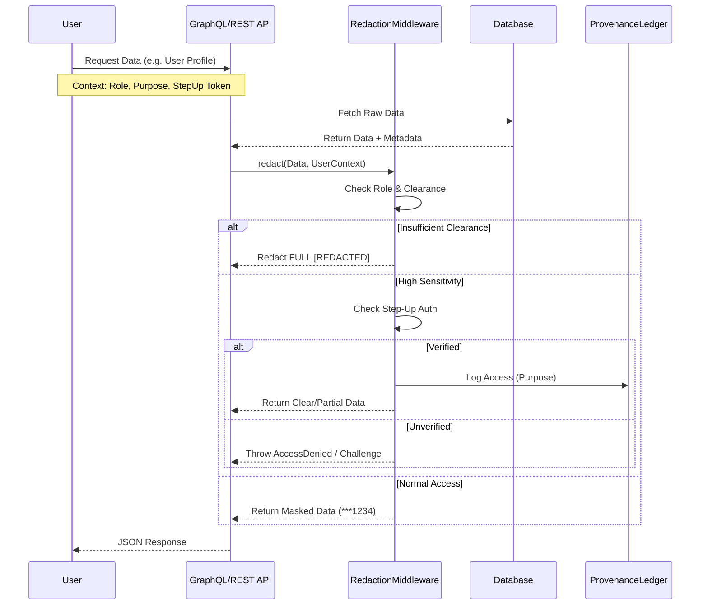
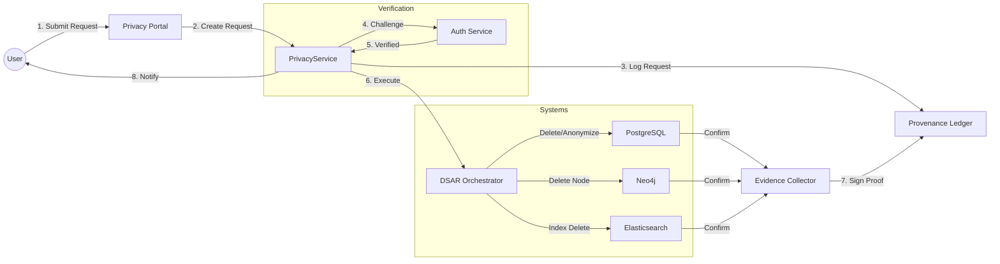

# Data Flow Diagrams - Privacy & PII Handling

## 1. Data Ingestion & Classification Flow

Data entering CompanyOS is immediately scanned and tagged.

```mermaid
graph TD
    Source[External Source] -->|Raw Data| Ingest[Ingestion Service]
    Ingest -->|Hook| PIIScan[PII Scanner (ingestionHooks.ts)]

    subgraph PII Detection
        PIIScan -->|Recognize| Recognizer[HybridEntityRecognizer]
        Recognizer -->|Entities| Taxonomy[TaxonomyManager]
        Taxonomy -->|Classify| Classifier[SensitivityClassifier]
    end

    Classifier -->|Sensitivity Metadata| TaggedData[Tagged Data Packet]

    TaggedData -->|Routing| Router{Sensitivity Check}

    Router -->|Low/Medium| DB[(Primary DB)]
    Router -->|High/Critical| Encrypt[Encryption Service]
    Encrypt -->|Encrypted| DB

    Router -->|Blocked Content| Quarantine[Quarantine Queue]

    subgraph Metadata Store
        Classifier -.->|Catalog Tags| DataCatalog[Data Catalog]
    end
```

## 2. Secure Access & Redaction Flow

Data access is mediated by the Redaction Middleware.



## 3. Data Subject Access Request (DSAR) - Deletion Flow

Orchestrating the Right to be Forgotten.


