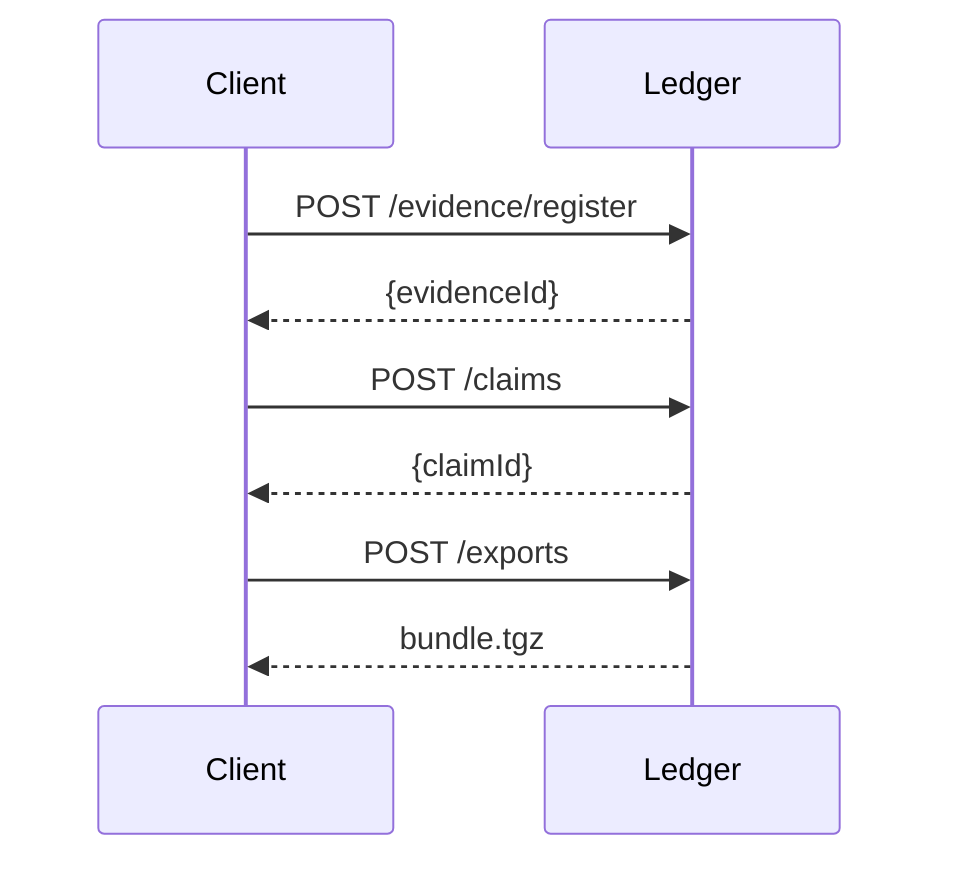

# Provenance Ledger

This service registers evidence and emits signed claims. Bundles are exported as tarballs with a `manifest.json` that records claim hashes and signatures. Exports are denied when any evidence license is incompatible, returning a human‑readable reason and appeal code.



The `prov-verify` CLI validates bundles offline by checking claim hashes, signatures and the Merkle root:

```bash
prov-verify bundle.tgz
```
