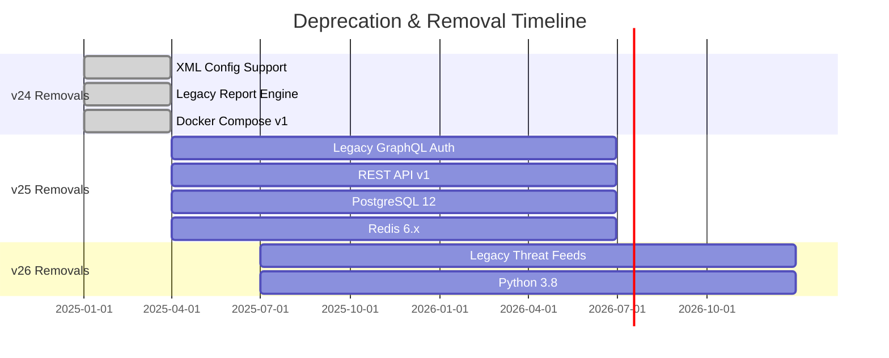

| Feature                    | Since Version | Remove In Version | Alternative           | Migration Link                                                        |
| -------------------------- | ------------- | ----------------- | --------------------- | --------------------------------------------------------------------- |
| Legacy GraphQL Auth API    | v23.0         | v25.0             | OAuth2 with PKCE      | [Auth Migration Guide](../how-to/auth-migration.md)                   |
| XML Configuration Format   | v22.0         | v24.0             | YAML Configuration    | [Config Migration](../how-to/upgrade-to-v24.md#configuration-updates) |
| REST API v1 Endpoints      | v21.0         | v25.0             | GraphQL API           | [API Migration Guide](../how-to/api-v2-migration.md)                  |
| Legacy Threat Feed Format  | v23.5         | v26.0             | STIX 2.1 Format       | [Feed Migration](../how-to/feed-format-migration.md)                  |
| PostgreSQL 12 Support      | v24.0         | v25.0             | PostgreSQL 14+        | [Database Upgrade](../how-to/postgres-upgrade.md)                     |
| Redis 6.x Support          | v24.0         | v25.0             | Redis 7.0+            | [Cache Upgrade](../how-to/redis-upgrade.md)                           |
| Docker Compose v1          | v23.0         | v24.0             | Docker Compose v2     | [Compose Migration](../how-to/docker-compose-v2.md)                   |
| SHA-1 Certificate Support  | v24.0         | v25.0             | SHA-256 Certificates  | [Certificate Update](../security/certificate-upgrade.md)              |
| Legacy Report Engine       | v22.0         | v24.0             | New Report Builder    | [Report Migration](../how-to/report-builder-migration.md)             |
| File-based User Management | v23.0         | v25.0             | LDAP/SAML Integration | [User Management Migration](../how-to/user-mgmt-migration.md)         |

## Removed in v24

The following features have been **permanently removed** in v24:

### XML Configuration Support

- **Removed**: v24.0
- **Alternative**: YAML configuration format
- **Impact**: Configuration files must be converted before upgrading
- **Migration**: See [upgrade guide](../how-to/upgrade-to-v24.md#configuration-updates)

### Legacy Report Engine

- **Removed**: v24.0
- **Alternative**: New Report Builder with improved templating
- **Impact**: Custom reports need to be recreated
- **Migration**: Export existing reports and recreate using new builder

### Docker Compose v1 Support

- **Removed**: v24.0
- **Alternative**: Docker Compose v2
- **Impact**: Deployment scripts need updating
- **Migration**: Update docker-compose.yml syntax and CLI commands

## Upcoming Removals

### v25.0 (Planned Q2 2026)

- Legacy GraphQL Auth API
- REST API v1 endpoints
- PostgreSQL 12 support
- Redis 6.x support
- SHA-1 certificate support
- File-based user management

### v26.0 (Planned Q4 2026)

- Legacy threat feed format
- Python 3.8 support
- Node.js 16 support

## Migration Timeline

## Support Policy

- **Deprecation Notice**: Features are marked deprecated for minimum 2 major versions
- **Removal Timeline**: Deprecated features are removed after 12+ months notice
- **Migration Support**: Migration guides provided for all deprecated features
- **Emergency Support**: Critical security patches may force earlier removal

## Getting Help

- **Migration Questions**: [Support Forum](../support/forum.md)
- **Professional Services**: [Migration Assistance](../support/professional-services.md)
- **Community**: [Discord Channel](https://discord.gg/intelgraph)
