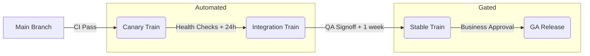

# Release Train Model

This document defines the canonical release train model for Summit. All releases must adhere to this flow to ensure stability, auditability, and provenance.

## 1. Release Types (Trains)

We utilize four distinct release trains, each with increasing stability guarantees and stricter promotion gates.

| Train           | Tag Pattern       | Frequency    | Target Environment         | Purpose                                      |
| --------------- | ----------------- | ------------ | -------------------------- | -------------------------------------------- |
| **Canary**      | `vX.Y.Z-canary.N` | Continuous   | `canary`                   | Immediate feedback, dogfooding.              |
| **Integration** | `vX.Y.Z-rc.N`     | Daily (Auto) | `staging`                  | Integration testing, performance baselining. |
| **Stable**      | `vX.Y.Z`          | Weekly       | `prod` (Internal/SaaS)     | General availability for standard users.     |
| **GA**          | `vX.Y.Z-ga`       | On-Demand    | `prod` (Enterprise/Airgap) | Hardened, long-term support releases.        |

## 2. Release Flow & Promotion

The promotion of code from development to production follows a strictly linear path. "Jumping" trains is prohibited except in declared emergencies.

### 2.1 Canary Train

- **Trigger**: Merge to `main`.
- **Gate**: CI Green (Lint, Unit, Build).
- **Agent**: Automated CI.
- **Artifacts**: Ephemeral Docker images, "Light" Evidence Bundle (SBOM + Commit SHA).

### 2.2 Integration Train

- **Trigger**: Scheduled (Daily @ 10:00 UTC) or Manual trigger by Release Captain.
- **Gate**:
  - Canary environment healthy for > 24 hours.
  - No blocking issues in `canary`.
  - Integration tests pass.
- **Agent**: Automated Scheduler (promotes verified Canary SHA).

### 2.3 Stable Train (Weekly)

- **Trigger**: Weekly (Tuesday @ 13:00 UTC).
- **Gate**:
  - Integration environment healthy.
  - Release Captain approval (Human).
  - Full Evidence Bundle generated and verified.
- **Agent**: Release Captain (Human) initiates promotion via ChatOps or GitHub.

### 2.4 GA / Enterprise Train

- **Trigger**: Business requirement (Quarterly or Feature-driven).
- **Gate**:
  - Stable release proven in production for > 2 weeks.
  - Security Audit sign-off.
  - Executive Approval.
- **Agent**: Engineering Manager / VP.

## 3. Versioning Strategy

We follow [SemVer 2.0.0](https://semver.org/).

- **Major**: Breaking changes (requires migration plan).
- **Minor**: New features (backward compatible).
- **Patch**: Bug fixes.
- **Pre-release labels**: Used for Canary and Integration (`-canary`, `-rc`).
