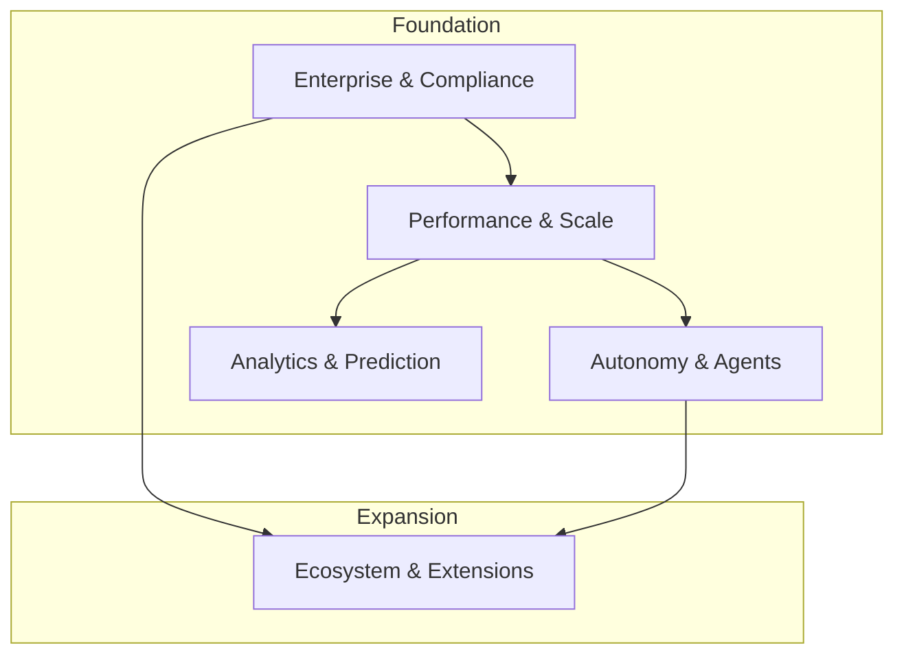

# Evolution Axes & Capability Streams

**Status:** APPROVED
**Last Updated:** October 2025
**Effective Date:** Immediate

---

## Overview

Summit evolves along five distinct **Capability Streams**. These streams represent long-term investment areas that run in parallel. Every feature or improvement must map to one of these streams to ensure coherent platform evolution.

---

## Stream 1: Autonomy & Agents
**Goal:** Move from "human-in-the-loop" to "human-on-the-loop" for routine intelligence tasks.

*   **Current State:**
    *   Simple "Copilot" assistants (RAG-based).
    *   Basic task execution (Maestro) with limited reasoning.
    *   Human must initiate and approve most actions.
*   **Next Milestone (6-12 Months):**
    *   **"Auto-Scientist" Beta:** Agents that can formulate and test simple hypotheses against the graph.
    *   **Proactive Alerts:** Agents monitoring data streams and notifying analysts of anomalies without prompt.
*   **Hard Constraints:**
    *   Must strictly adhere to **Bounded Autonomy** invariant.
    *   All agent actions must be recorded in the `ProvenanceLedger`.
    *   No recursive self-improvement without a "human break" loop.

## Stream 2: Analytics & Prediction
**Goal:** Shift from descriptive analytics ("what happened") to predictive and prescriptive analytics ("what might happen" / "what should we do").

*   **Current State:**
    *   Graph queries (Cypher) and full-text search.
    *   Basic timeline visualization.
    *   Manual link analysis.
*   **Next Milestone (6-12 Months):**
    *   **Temporal Graph Analytics:** Native support for "time-travel" queries and trend analysis.
    *   **Predictive Threat Modeling:** Monte Carlo simulations of potential threat scenarios.
*   **Hard Constraints:**
    *   Predictions must come with confidence intervals and "explainability" traces.
    *   No "black box" scores used for critical automated decisions.

## Stream 3: Enterprise & Compliance
**Goal:** Enable friction-free adoption by large, regulated organizations.

*   **Current State:**
    *   Basic RBAC and Tenant Isolation.
    *   SOC2 Readiness (Auditable logs).
    *   SAML/OIDC SSO.
*   **Next Milestone (6-12 Months):**
    *   **Bring Your Own Key (BYOK):** Customer-managed encryption keys.
    *   **Data Residency Controls:** Pinning data to specific geographic regions.
    *   **Granular ABAC:** Policy-based access control down to individual entity attributes.
*   **Hard Constraints:**
    *   Compliance features cannot compromise the core **Tenant Isolation** invariant.
    *   Audit logs for compliance actions must be immutable.

## Stream 4: Ecosystem & Extensions
**Goal:** Transform Summit from a "tool" into a "platform" that others build upon.

*   **Current State:**
    *   Internal APIs (REST/GraphQL).
    *   Fixed set of native connectors.
    *   No third-party app store.
*   **Next Milestone (6-12 Months):**
    *   **Plugin Architecture:** Stable SDK for building custom data connectors and UI widgets.
    *   **Marketplace Alpha:** Repository for verified community extensions.
*   **Hard Constraints:**
    *   Extensions run in a sandboxed environment (WebAssembly or isolated containers).
    *   Extensions cannot bypass core platform policies.

## Stream 5: Performance & Scale
**Goal:** Support nation-scale datasets and real-time ingestion without degradation.

*   **Current State:**
    *   Monolithic graph database (Neo4j).
    *   Vertical scaling strategy.
    *   Performance degradation at >10M nodes.
*   **Next Milestone (6-12 Months):**
    *   **Sharded Graph Architecture:** Horizontal partitioning of the graph data.
    *   **Streaming Ingestion:** Real-time event processing pipeline (Kafka/Redpanda) replacing batch jobs.
*   **Hard Constraints:**
    *   Consistency models must be explicitly defined (e.g., eventual consistency for analytics, strong consistency for permissions).
    *   No regression in query latency for p95 standard queries (<350ms).

---

## Dependency Graph

**Interpretation:**
*   We cannot build reliable **Autonomy** or **Analytics** without first solving **Performance & Scale**.
*   We cannot open the **Ecosystem** without robust **Enterprise & Compliance** controls (security, billing, isolation).

---

## explicit "Will Not Do"
*   We will not build a general-purpose CI/CD tool (use existing tools).
*   We will not build a generic "Data Lake" (focus on Knowledge Graph).
*   We will not build our own LLM foundation models (use best-in-class external providers).
