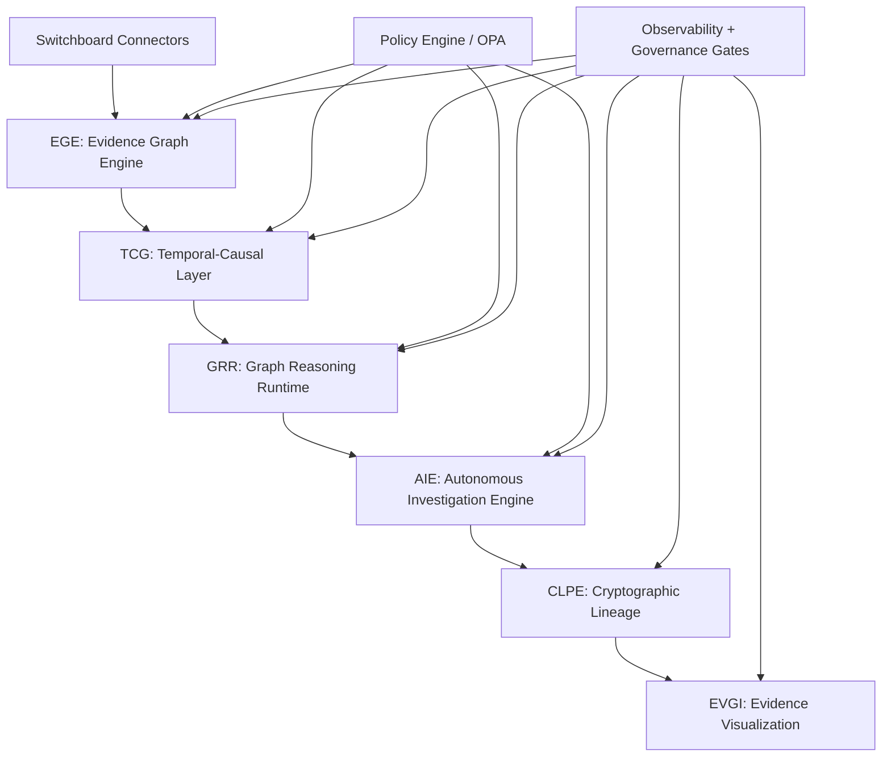
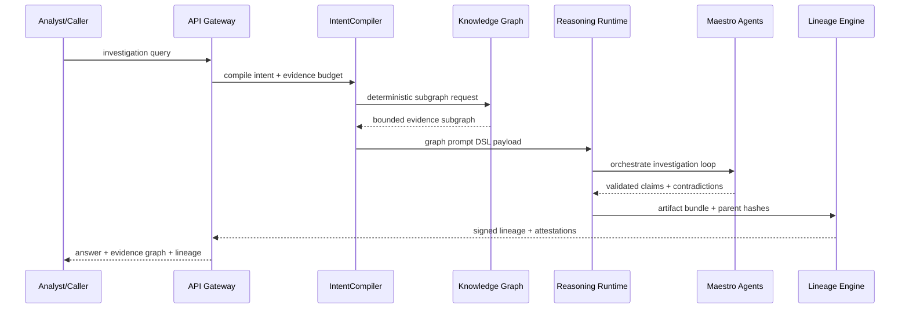

# Graph-Native AI System Design (Execution-Grade)

## Summit Readiness Assertion
Summit is now operating on an execution-grade architecture where evidence is the canonical unit of reasoning, lineage is cryptographically attestable, and all agentic traversal is policy-bounded.

## Design Intent
This specification converts the 90-day plan into merge-ready engineering contracts that can be implemented in thin, testable PR slices without violating GA governance gates.

## MAESTRO Security Alignment
- **MAESTRO Layers:** Foundation, Data, Agents, Tools, Infra, Observability, Security.
- **Threats Considered:** prompt injection, evidence poisoning, traversal amplification, contradiction suppression, artifact tampering, replay attacks, model drift.
- **Mitigations:** intent-compiled retrieval, evidence budgets, deterministic artifact hashing, contradiction quorum policy, signed attestations, bounded planner loops, runtime anomaly alerts.

## End-to-End Architecture



## Runtime Sequence



## Canonical Contracts

### Artifact Contract (v1)
```json
{
  "answer": "answer.json",
  "claim_graph": "claim_graph.json",
  "evidence_map": "evidence_map.json",
  "reasoning_trace": "reasoning_trace.json",
  "lineage": "lineage.json",
  "attestation": "attestation.json",
  "signature": "artifact.sig"
}
```

### Claim Node Contract
```json
{
  "cid": "sha256:<stable>",
  "subject": "entity_id",
  "predicate": "string",
  "object": "entity_or_literal",
  "confidence": 0.0,
  "evidence_ids": ["evid-1"],
  "provenance_hash": "sha256:<bundle>",
  "created_at": "RFC3339"
}
```

### Investigation State Contract
```json
{
  "investigation_id": "uuid",
  "query": "string",
  "seed": 42,
  "budget": {
    "max_nodes": 250,
    "max_hops": 4,
    "max_runtime_ms": 60000
  },
  "steps": [],
  "claims": [],
  "contradictions": [],
  "status": "completed"
}
```

## Determinism and Reproducibility Rules
1. Stable sort on every emitted node/edge list.
2. ID generation includes normalized source URI + span + predicate tuple.
3. No wall-clock timestamps inside core hashable payloads.
4. Model configuration hash pinned in reasoning trace.
5. CI blocks non-deterministic artifact drift.

## Performance SLO Baselines
- Subgraph retrieval P95: <150ms.
- Timeline reconstruction P95: <1s.
- Investigation completion P95: <60s.
- Graph rendering P95: <2s.
- Signature verification: 100% pass in gate.

## Observability Requirements
- Metrics:
  - `ege_claims_emitted_total`
  - `grr_prompt_tokens`
  - `aie_investigation_runtime_ms`
  - `clpe_signature_verify_failures_total`
- Traces:
  - `intent.compile`, `graph.retrieve`, `reasoning.synthesize`, `lineage.sign`
- Alerts:
  - Determinism regression
  - Signature verification failure
  - Evidence budget overrun

## Rollback Protocol
- Trigger on SLO breach, signature mismatch, or contradiction policy failure.
- Roll back by subsystem flag (`ege`, `tcg`, `grr`, `aie`, `clpe`, `evgi`).
- Preserve lineage continuity event for every rollback action.

## Governed Exceptions Policy
Legacy retrieval paths are classified as **Governed Exceptions** and must include:
- exception ID
- expiry timestamp
- compensating control
- owner and approval evidence

## Merge Readiness Gate Checklist
- Prompt integrity validation.
- PR metadata schema validation.
- Boundary check pass (`scripts/check-boundaries.cjs`).
- Determinism verification for query logic.
- Required artifact bundle completeness.
