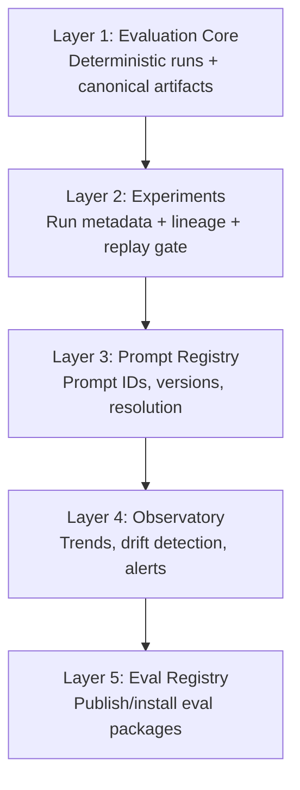
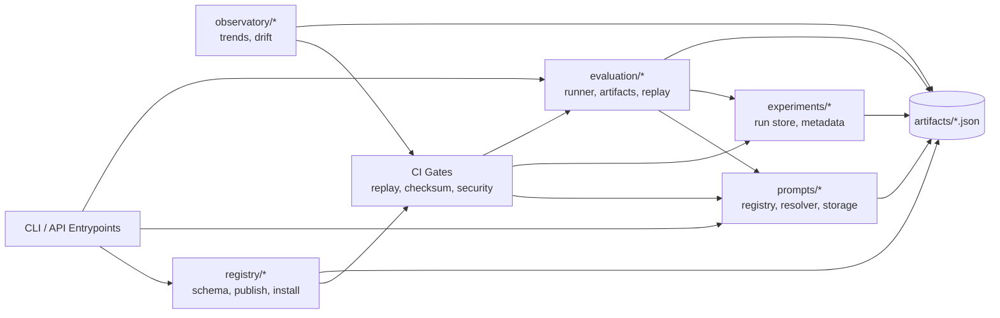
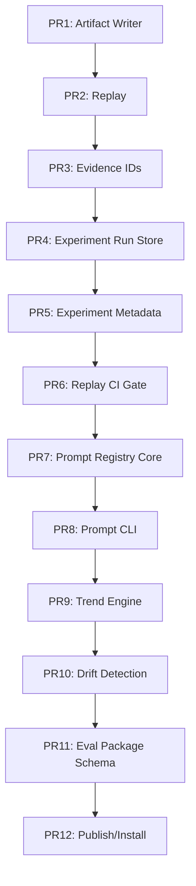

# Summit Evaluation Platform — Master Subsumption Roadmap

## 1) Purpose
This roadmap consolidates four strategic tracks into one execution plan:

1. Experiment tracking (MLflow-style lifecycle).
2. Prompt registry (LLMOps prompt/version governance).
3. AI evaluation observatory (trend + drift monitoring).
4. Evaluation registry (publish/install reproducible eval packages).

The operating objective is to move Summit from a benchmark runner to a governance-grade AI evaluation platform with deterministic artifacts, replay guarantees, and ecosystem distribution.

## 2) Layered Architecture (Dependency Order)


## 3) Runtime Module Interaction Diagram


## 4) Artifact Contract
Every benchmark-capable run must be able to emit:

- `artifacts/run.json`
- `artifacts/metrics.json`
- `artifacts/stamp.json`
- `artifacts/prompt.json` (when prompt-indirected)
- `artifacts/trends.json` (observatory jobs)
- `artifacts/drift_report.json` (observatory jobs)
- `artifacts/reproducibility_stamp.json` (registry-integrated publish/install)

Deterministic files must use canonical serialization and stable field ordering.

## 5) 12-PR Delivery Plan

### Phase 1 — Deterministic Evaluation Core
1. **PR1 — `feat(core): deterministic artifact writer`**  
   Add canonical writers for `run.json`, `metrics.json`, `stamp.json`.
2. **PR2 — `feat(core): deterministic replay command`**  
   Add `summit runs replay --run-id <id>`.
3. **PR3 — `feat(core): evidence ID embedding`**  
   Add `EVID-<benchmark>-<run>` IDs to all core artifacts.

### Phase 2 — Experiment Tracking
4. **PR4 — `feat(experiments): run store`**  
   Add experiment metadata persistence and run indexing.
5. **PR5 — `feat(experiments): metadata schema + adapters`**  
   Add structured config/param/metric schema.
6. **PR6 — `feat(experiments): replay verification CI gate`**  
   Fail CI on non-deterministic replay mismatches.

### Phase 3 — Prompt Registry
7. **PR7 — `feat(prompts): prompt registry core`**  
   Add prompt schema, storage, and resolver.
8. **PR8 — `feat(prompts): CLI commands`**  
   Add `summit prompts register|get|list`.

### Phase 4 — Evaluation Observatory
9. **PR9 — `feat(observatory): trend engine`**  
   Add trend snapshot generation (`trends.json`).
10. **PR10 — `feat(observatory): drift detection + scheduled job`**  
    Add drift analyzer and monitor script.

### Phase 5 — Evaluation Registry (Marketplace)
11. **PR11 — `feat(registry): evaluation package schema`**  
    Define package manifest + reproducibility requirements.
12. **PR12 — `feat(registry): publish/install/list workflow`**  
    Add package lifecycle commands and reproducibility stamps.

## 6) Timeline (6 Weeks)
- **Week 1:** PR1–PR2
- **Week 2:** PR3–PR4
- **Week 3:** PR5–PR6
- **Week 4:** PR7–PR8
- **Week 5:** PR9–PR10
- **Week 6:** PR11–PR12

## 7) Acceptance Gates

### Functional
- A benchmark run produces deterministic artifacts.
- Replay reproduces identical metrics for fixed seed/config.
- Prompt references resolve by ID+version.
- Observatory reports trend and drift from run history.
- Eval packages can be published, installed, and executed.

### Integrity and Security
- Artifact checksum validation blocks tampering.
- Replay mismatch is build-blocking.
- Prompt inputs are validated and redacted according to policy.
- Package manifests are hash-verified before install.

## 8) Threat-Informed Controls
| Threat | Control | Enforcement |
|---|---|---|
| Metric tampering | Artifact hash + checksum verification | CI checksum gate |
| Non-deterministic runs | Seed lock + canonical serialization | Replay gate |
| Prompt injection in evals | Prompt validation + deny-by-default parser | Security tests |
| Registry spoofing | Manifest hash verification | Install gate |
| Benchmark gaming | Held-out/randomized slices | Integrity suite |

## 9) Module Skeleton (Patch-First)
```text
summit/
  evaluation/
    artifacts.py
    replay.py
    evidence.py
  experiments/
    run_store.py
    metadata.py
    replay_gate.py
  prompts/
    schema.py
    registry.py
    storage.py
    resolver.py
  observatory/
    trends.py
    drift.py
    run_reader.py
  registry/
    schema.py
    package.py
    publish.py
    install.py
scripts/
  monitoring/
    eval_drift.py
```

## 10) Master Dependency Graph (Execution-Critical)


## 11) Definition of Done Rubric (Per PR)
A PR is merge-ready at **≥20/25**:

- Determinism: **5**
- Machine verifiability (CI-enforced): **5**
- Mergeability (isolated + reversible): **5**
- Security posture (tests + controls): **5**
- Measured advantage (artifact or metric value): **5**

## 12) Strategic Outcome
Once complete, Summit supports lifecycle-grade evaluation governance across:

- Models
- Prompts
- Agents
- Benchmarks
- Drift and trend observability
- Reproducible evaluation package exchange

This sequence preserves delivery velocity while minimizing rework by enforcing deterministic foundations before higher-order governance and marketplace layers.
