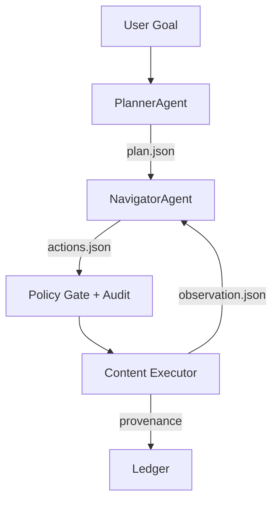

# Browser Ops Extension Blueprint (Summit-Native)

**Purpose:** Define the Summit-native Browser Ops driver contract, policy gates, and provenance-ready
runbook for implementing an on-device browser agent extension with a two-agent loop and strict
JSON action interface. This runbook is authoritative for MVP delivery and auditability.

## Readiness Alignment (Escalation)

This blueprint is explicitly aligned with the Summit Readiness Assertion to preempt governance
scrutiny and ensure deterministic policy enforcement across Browser Ops artifacts. See
`docs/SUMMIT_READINESS_ASSERTION.md` for the authoritative readiness contract.

## Governance Posture (Governed Exceptions)

Any deviation from policy gates, action budgets, or evidence capture must be recorded as a
**Governed Exception**. Governed Exceptions are temporary, named, and policy-scoped with an
explicit expiration. No action executes outside policy-as-code, and all exceptions must link to
an approved decision log entry.

## 1) Summit-Native Architecture Pattern (Two-Agent Loop)

**PlannerAgent** and **NavigatorAgent** execute an explicit loop with policy-gated actions. The
Navigator never touches the page directly; it emits JSON actions that the content executor
validates and runs.



**Operational rules:**

- JSON output from both agents is **schema-validated**.
- Every action is **OPA-reviewed** before execution.
- Every observation and action is **hash-anchored** for replay.
- All compliance decisions are **logged** with a decision record ID.

## 2) TypeScript Contract (BrowserState, Observation, Actions)

> **Authoritative contract** for the Summit Browser Ops driver. All drivers must implement these
> interfaces.

```ts
// packages/browser-ops-contract/src/types.ts

export type BrowserDriverMode = "extension" | "playwright" | "sandbox";

export interface BrowserState {
  sessionId: string;
  mode: BrowserDriverMode;
  activeUrl: string;
  title: string;
  viewport: {
    width: number;
    height: number;
    deviceScaleFactor: number;
  };
  tabId?: number;
  timestamp: string; // ISO-8601
  domHash: string; // sha256 of canonical DOM snapshot
  policyContext: {
    classification: "public" | "restricted" | "sensitive";
    allowVisionEscalation: boolean;
    maxStepBudget: number;
    decisionLogId: string; // links actions to compliance decision log
  };
}

export interface BrowserObservation {
  state: BrowserState;
  domText: string; // normalized visible text
  domSnapshot: string; // serialized DOM
  affordances: Array<{
    selector: string;
    role?: string;
    text?: string;
    actionHint?: "click" | "type" | "select" | "scroll";
  }>;
  extractedArtifacts?: Array<{
    id: string;
    type: "table" | "text" | "link" | "screenshot";
    value: string;
    sourceSelector?: string;
    sourceUrl: string;
    hash: string;
  }>;
}

export type BrowserActionType =
  | "navigate"
  | "click"
  | "type"
  | "select"
  | "scroll"
  | "wait"
  | "extract";

export interface BrowserActionBase {
  id: string;
  type: BrowserActionType;
  reason: string;
  policyTags: string[];
}

export interface NavigateAction extends BrowserActionBase {
  type: "navigate";
  url: string;
}

export interface ClickAction extends BrowserActionBase {
  type: "click";
  selector: string;
  timeoutMs?: number;
}

export interface TypeAction extends BrowserActionBase {
  type: "type";
  selector: string;
  text: string;
  redact: boolean; // true => mask in logs
}

export interface SelectAction extends BrowserActionBase {
  type: "select";
  selector: string;
  value: string;
}

export interface ScrollAction extends BrowserActionBase {
  type: "scroll";
  direction: "up" | "down";
  amountPx?: number;
}

export interface WaitAction extends BrowserActionBase {
  type: "wait";
  durationMs: number;
}

export interface ExtractAction extends BrowserActionBase {
  type: "extract";
  selector?: string;
  extract: "text" | "table" | "link" | "screenshot";
}

export type BrowserAction =
  | NavigateAction
  | ClickAction
  | TypeAction
  | SelectAction
  | ScrollAction
  | WaitAction
  | ExtractAction;

export interface BrowserPlan {
  goal: string;
  steps: Array<{
    id: string;
    description: string;
    successCriteria: string;
  }>;
}
```

## 3) OPA Policy Skeleton (Policy-Gated Browser Actions)

This policy module enforces allow/deny gates, step budgets, and sensitive form protections. It is
intentionally constrained and must be extended by the Summit policy engine.

```rego
# server/src/policies/browser_ops/actions.rego
package summit.browser_ops

import future.keywords.in

# Default deny
default allow := false

allow {
  not denied
  within_step_budget
  action_allowed
  log_decision
}

denied {
  input.action.type == "type"
  input.action.redact == false
  is_sensitive_selector
}

within_step_budget {
  input.step_index <= input.state.policyContext.maxStepBudget
}

action_allowed {
  input.action.type in {"navigate", "click", "type", "select", "scroll", "wait", "extract"}
  not blocked_domain
}

log_decision {
  input.state.policyContext.decisionLogId != ""
}

governed_exception {
  input.policy.governed_exception.id != ""
  input.policy.governed_exception.expires_at != ""
  input.policy.governed_exception.reason != ""
}

blocked_domain {
  some domain
  domain := input.policy.blocked_domains[_]
  endswith(input.state.activeUrl, domain)
}

is_sensitive_selector {
  some selector
  selector := input.policy.sensitive_selectors[_]
  contains(input.action.selector, selector)
}
```

**Required policy inputs:**

```json
{
  "state": {
    "activeUrl": "https://example.com",
    "policyContext": { "maxStepBudget": 25, "decisionLogId": "dec-2026-01-23-001" }
  },
  "action": { "type": "click", "selector": "#submit", "redact": true },
  "step_index": 3,
  "policy": {
    "blocked_domains": ["payments.example"],
    "sensitive_selectors": ["input[type=password]", "input[name=ssn]"],
    "governed_exception": {
      "id": "ge-2026-01-23-ops-001",
      "expires_at": "2026-02-15T00:00:00Z",
      "reason": "Emergency remediation workflow"
    }
  }
}
```

## 4) Provenance & Replayability Contract

Every action must produce a deterministic evidence bundle for replay.

- **Action stream**: `actions.jsonl` (one JSON per action)
- **DOM snapshots**: `dom/{step}.json` with `domHash` anchors
- **Artifacts**: `artifacts/{id}.json` with source selectors and hashes
- **Ledger**: `provenance/ledger.json` (hash chain of action → observation → artifacts)

**Non-negotiable:** The evidence bundle must validate against Summit provenance schema and be
linked to a session `sessionId` for audit replay.

## 5) Decision Logging (Policy-as-Code)

Every action evaluation must emit a decision record that is referenced by
`policyContext.decisionLogId`. Decision records include:

- action ID and hash
- policy bundle version
- allow/deny result and rationale
- governed exception references (if any)

## 6) Privacy-First On-Device Mode

- **Runtime**: WebLLM + WebGPU for on-device inference after model download.
- **Browser requirement**: Chrome 124+ for WebGPU in extension service workers.
- **Model registry**: Enumerate default + alternate local models with explicit hashes and cache
  size budgets.

## 7) Extension Package Layout (MVP)

```text
extensions/browser-ops/
├── background/
│   ├── llm-engine.ts         # WebLLM adapter + model registry
│   ├── planner-agent.ts      # PlannerAgent orchestrator
│   ├── navigator-agent.ts    # NavigatorAgent loop
│   └── policy-gate.ts        # OPA client + local fallback
├── content/
│   ├── dom-observer.ts       # DOM snapshot + affordance extraction
│   ├── action-executor.ts    # click/type/scroll/extract
│   └── content-bridge.ts     # message bridge to background
├── popup/
│   ├── App.tsx               # Operator controls
│   └── state.ts              # Session UI state
├── shared/
│   ├── contracts.ts          # BrowserState/Action/Observation types
│   ├── constants.ts
│   └── schema.ts             # JSON schema validators
└── manifest.json
```

## 8) Summit Upgrade Hooks (Moat)

- **Policy-gated actions** with allow/deny and step budgets.
- **Provenance ledger** for deterministic evidence bundles.
- **Vision-lite** hooks (DOM + accessibility tree + text regions) and optional escalation.
- **Driver router**: Extension vs. Playwright vs. Sandbox — a single contract.

## 9) Implementation Checklist

1. Implement the TypeScript contract in `packages/browser-ops-contract/`.
2. Stand up the extension scaffold under `extensions/browser-ops/`.
3. Integrate OPA policy evaluation with strict allow/deny gates.
4. Emit evidence bundles to `artifacts/browser-ops/`.
5. Validate with deterministic task harness and golden-path smoke checks.

**Completion Definition:** Browser Ops MVP delivers policy-gated actions, provenance capture, and
replayable evidence bundles with a validated JSON contract and decision log linkage.
