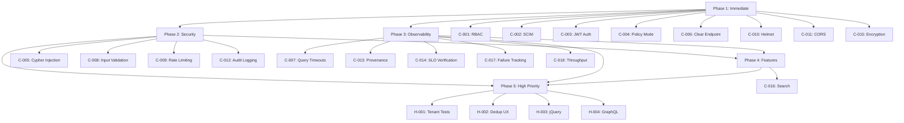

# TODO REMEDIATION PLAN — SUMMIT GA READINESS

**Plan Date:** 2025-12-30
**Target GA Date:** TBD (depends on remediation completion)
**Total Effort:** 396 engineering hours (49.5 engineering days)
**Estimated Calendar Time:** 9 weeks (with parallel execution)
**Status:** 🔴 **BLOCKING - Cannot GA without completion**

---

## EXECUTIVE SUMMARY

This plan provides a **phased, dependency-aware remediation roadmap** for all 18 Critical and 5 High-priority TODOs discovered in the comprehensive audit.

### Critical Path to GA

**Minimum requirement:** All 18 Critical (P0) TODOs must be resolved.
**Recommended:** Critical + High TODOs for robust GA launch.

### Resource Requirements

| Phase                      | Duration    | Engineers              | Parallel Tracks    |
| -------------------------- | ----------- | ---------------------- | ------------------ |
| **Phase 1: Immediate**     | 1 week      | 4 engineers            | 4                  |
| **Phase 2: Security**      | 2 weeks     | 5 engineers            | 3                  |
| **Phase 3: Observability** | 2 weeks     | 3 engineers            | 2                  |
| **Phase 4: Features**      | 1 week      | 2 engineers            | 1                  |
| **Phase 5: High Priority** | 3 weeks     | 4 engineers            | 2                  |
| **Total**                  | **9 weeks** | **Peak: 5 concurrent** | **Parallelizable** |

---

## PHASE 1: IMMEDIATE (WEEK 1) — GA BLOCKERS

**Objective:** Address most critical security gaps that can be resolved quickly
**Duration:** 1 week (5 business days)
**Effort:** 78 engineering hours
**Team:** 4 engineers (Backend Lead, Security Eng, Mobile Eng, DevOps Eng)

### Tasks

#### Track 1: Access Control Hardening (Backend Lead — 20 hours)

**C-001: Missing RBAC on Admin Reindex Endpoint**

- Effort: 8 hours
- Steps:
  1. Define admin role requirements (1h)
  2. Implement RBAC middleware for `/v1/search/admin/*` routes (4h)
  3. Add role check to reindex endpoint (1h)
  4. Write tests for authorization (2h)
- Dependencies: Existing RBAC framework
- Deliverable: Admin endpoints require `admin` or `reindex_operator` role

**C-006: Dangerous Clear Endpoint**

- Effort: 2 hours
- Steps:
  1. Identify clear/delete endpoints in Graph DB (0.5h)
  2. Disable or restrict to dev environment only (0.5h)
  3. Add MFA requirement if keeping for production (1h)
- Dependencies: None
- Deliverable: Clear endpoint disabled in production OR requires MFA + audit log

**C-010: Missing Security Headers (Helmet)**

- Effort: 4 hours
- Steps:
  1. Install Helmet middleware in all services (1h)
  2. Configure CSP, HSTS, X-Frame-Options (2h)
  3. Test in staging (1h)
- Dependencies: None
- Deliverable: All services return security headers

**C-011: CORS Misconfiguration**

- Effort: 8 hours
- Steps:
  1. Audit current CORS configuration (2h)
  2. Define allowed origins whitelist (1h)
  3. Implement strict CORS middleware (3h)
  4. Test cross-origin scenarios (2h)
- Dependencies: None
- Deliverable: CORS allows only whitelisted origins, no wildcard

---

#### Track 2: Authentication (Security Eng — 20 hours)

**C-003: Missing JWT Authentication on Services**

- Effort: 16 hours
- Steps:
  1. Implement JWT verification middleware (4h)
  2. Add to Graph DB service (4h)
  3. Add to Agent Executor service (4h)
  4. Configure service-to-service JWT issuance (2h)
  5. Test authenticated access (2h)
- Dependencies: JWT library, key management
- Deliverable: Graph DB and Agent Executor require valid JWT

**C-004: Policy Engine Dry-Run Mode**

- Effort: 4 hours
- Steps:
  1. Audit all deployment configurations (2h)
  2. Verify policy engine is in enforce mode (1h)
  3. Add monitoring for policy mode changes (1h)
- Dependencies: Access to production configs
- Deliverable: Policy engine verified in enforce mode, monitoring active

---

#### Track 3: Mobile Security (Mobile Eng — 8 hours)

**C-015: Hardcoded Encryption Key**

- Effort: 8 hours
- Steps:
  1. Implement platform keychain integration (iOS Keychain, Android Keystore) (4h)
  2. Generate per-device encryption key on first launch (2h)
  3. Migrate existing data (if any) (1h)
  4. Test encryption/decryption (1h)
- Dependencies: Platform APIs (Keychain/Keystore)
- Deliverable: Mobile app uses platform keychain for encryption key

---

#### Track 4: Identity Management (Backend Lead — 24 hours)

**C-002: SCIM Synchronization**

- Effort: 24 hours
- Steps:
  1. Review IdP SCIM API documentation (2h)
  2. Implement SCIM client (8h)
  3. Map IdP users/groups to Summit roles (4h)
  4. Implement sync scheduler (daily + manual trigger) (4h)
  5. Add error handling and retry logic (3h)
  6. Test with production IdP (staging) (3h)
- Dependencies: IdP API access, credentials
- Deliverable: SCIM sync functional, users/groups synchronized daily

---

### Phase 1 Acceptance Criteria

- [ ] All admin endpoints require explicit role authorization
- [ ] Graph DB clear endpoint disabled or requires MFA
- [ ] All services return security headers (Helmet)
- [ ] CORS allows only whitelisted origins
- [ ] Graph DB and Agent Executor require JWT authentication
- [ ] Policy engine verified in enforce mode (not dry-run)
- [ ] Mobile app uses platform keychain for encryption
- [ ] SCIM sync functional and tested

### Phase 1 Risks

| Risk                                 | Likelihood | Mitigation                                            |
| ------------------------------------ | ---------- | ----------------------------------------------------- |
| IdP API access delayed               | Medium     | Start SCIM work immediately, escalate for credentials |
| Breaking existing integrations       | High       | Thorough testing in staging before production         |
| JWT rollout breaks internal services | Medium     | Phased rollout, feature flag                          |

---

## PHASE 2: SECURITY (WEEKS 2-3) — INJECTION & VALIDATION

**Objective:** Eliminate OWASP Top 10 vulnerabilities
**Duration:** 2 weeks
**Effort:** 104 engineering hours
**Team:** 5 engineers (Graph DB Team: 2, Backend Leads: 2, Security Eng: 1)

### Tasks

#### Track 1: Cypher Injection Remediation (Graph DB Team — 40 hours)

**C-005: Cypher Injection Vulnerability**

- Effort: 40 hours (critical, complex)
- Steps:
  1. **Audit Phase (16h — 2 engineers, 1 day):**
     - Grep all Cypher query construction patterns (2h)
     - Manually review each query for string concatenation (8h)
     - Document vulnerable queries (2h)
     - Prioritize by exposure (external API vs. internal) (2h)
     - Create test cases for each injection point (2h)

  2. **Remediation Phase (20h — 2 engineers, 2.5 days):**
     - Implement parameterized query builder utility (4h)
     - Refactor top 10 highest-risk queries (10h)
     - Refactor remaining queries (6h)

  3. **Verification Phase (4h — 1 engineer, 0.5 day):**
     - Run injection test suite (2h)
     - Security review (2h)

- Dependencies: Neo4j driver parameterization API
- Deliverable: All Cypher queries use parameterization, injection tests pass

---

#### Track 2: Input Validation Framework (Backend Leads — 32 hours)

**C-008: Missing Input Validation**

- Effort: 32 hours
- Steps:
  1. **Framework Selection (4h):**
     - Evaluate validation libraries (Joi, Zod, class-validator) (2h)
     - Choose and document standard (1h)
     - Create validation templates (1h)

  2. **Critical Path Validation (20h — 2 engineers, 2.5 days):**
     - Identify critical API endpoints (2h)
     - Implement validation for authentication endpoints (4h)
     - Implement validation for data write endpoints (6h)
     - Implement validation for search/query endpoints (4h)
     - Implement validation for admin endpoints (4h)

  3. **Testing (8h):**
     - Create validation test suite (4h)
     - Run fuzzing tests (2h)
     - Security review (2h)

- Dependencies: Validation library choice
- Deliverable: All critical endpoints have input validation, validation tests pass

---

#### Track 3: Rate Limiting (Backend Lead + DevOps — 16 hours)

**C-009: Zero Rate Limiting**

- Effort: 16 hours
- Steps:
  1. **Infrastructure (8h — DevOps):**
     - Deploy Redis for rate limit state (2h)
     - Configure Redis persistence and replication (2h)
     - Test Redis failover (2h)
     - Document Redis ops runbook (2h)

  2. **Implementation (8h — Backend Lead):**
     - Implement rate limiting middleware (4h)
     - Configure limits per endpoint tier (2h)
     - Add rate limit headers (X-RateLimit-\*) (1h)
     - Test rate limiting (1h)

- Dependencies: Redis deployment
- Deliverable: All API endpoints have rate limiting, Redis deployed

**Rate Limit Thresholds:**

```yaml
tiers:
  authentication:
    per_ip: 5 req/min
    per_user: 10 req/min
  read_api:
    per_tenant: 1000 req/min
    per_user: 100 req/min
  write_api:
    per_tenant: 500 req/min
    per_user: 50 req/min
  admin_api:
    per_user: 20 req/min
```

---

#### Track 4: Audit Logging (Security Eng + Backend Lead — 24 hours)

**C-012: No Audit Logging**

- Effort: 24 hours
- Steps:
  1. **Design (4h):**
     - Define audit event schema (2h)
     - Choose audit log destination (CloudWatch, Splunk, etc.) (1h)
     - Design retention policy (1h)

  2. **Implementation (16h — 2 engineers, 2 days):**
     - Implement audit logging middleware (4h)
     - Add audit events for authentication (3h)
     - Add audit events for authorization (3h)
     - Add audit events for data access (3h)
     - Add audit events for admin actions (3h)

  3. **Verification (4h):**
     - Test audit event generation (2h)
     - Verify log ingestion (1h)
     - Security review (1h)

- Dependencies: Logging infrastructure
- Deliverable: All sensitive operations logged, audit logs ingested

**Audit Events Required:**

- AuthN: login success/failure, logout, token refresh, MFA events
- AuthZ: policy decisions (allow/deny), role assignments
- Data: create/read/update/delete operations (with tenant context)
- Admin: user creation, role changes, config updates, policy changes

---

### Phase 2 Acceptance Criteria

- [ ] All Cypher queries use parameterization (injection tests pass)
- [ ] All critical API endpoints have input validation
- [ ] All API endpoints have rate limiting (Redis deployed)
- [ ] All sensitive operations generate audit logs
- [ ] Security review completed for all changes
- [ ] Penetration testing shows no injection vulnerabilities

### Phase 2 Risks

| Risk                                  | Likelihood | Mitigation                                          |
| ------------------------------------- | ---------- | --------------------------------------------------- |
| Cypher refactor breaks queries        | High       | Comprehensive test suite, staging verification      |
| Rate limiting breaks legitimate users | Medium     | Generous initial limits, monitoring, quick rollback |
| Audit logging performance impact      | Low        | Async logging, buffering, performance testing       |
| Redis deployment delay                | Low        | Start infrastructure work in Phase 1                |

---

## PHASE 3: OBSERVABILITY (WEEKS 4-5) — MONITORING & VERIFICATION

**Objective:** Eliminate operational blind spots, enable SLO enforcement
**Duration:** 2 weeks
**Effort:** 60 engineering hours
**Team:** 3 engineers (SRE: 2, Backend: 1)

### Tasks

#### Track 1: Ingest Metrics (Backend Eng — 20 hours)

**C-017: Ingest Pipeline Failure Tracking**

- Effort: 12 hours
- Steps:
  1. Add failure counter to ingest metrics (2h)
  2. Implement error categorization (validation, network, database) (3h)
  3. Create dead letter queue for failed records (4h)
  4. Add replay mechanism for DLQ (2h)
  5. Test failure scenarios (1h)
- Dependencies: DLQ infrastructure (Kafka topic or S3)
- Deliverable: Failed records tracked, categorized, and recoverable

**C-018: Ingest Pipeline Throughput Tracking**

- Effort: 8 hours
- Steps:
  1. Add byte counter to ingest metrics (2h)
  2. Emit throughput metrics (bytes/sec, records/sec) (2h)
  3. Add latency metrics (p50, p95, p99) (2h)
  4. Create monitoring dashboard (2h)
- Dependencies: Metrics infrastructure (Prometheus/Grafana)
- Deliverable: Throughput and latency metrics available, dashboard created

---

#### Track 2: CI/CD Verification (SRE Lead — 16 hours)

**C-013: Provenance Verification**

- Effort: 16 hours
- Steps:
  1. Design provenance checks (SLSA requirements) (2h)
  2. Implement artifact signature verification (4h)
  3. Implement build reproducibility check (4h)
  4. Integrate with metrics endpoint (2h)
  5. Add failure handling (fail build if checks fail) (2h)
  6. Test with real builds (2h)
- Dependencies: Signing infrastructure, metrics endpoint
- Deliverable: Provenance verification functional, enforced in CI

**C-014: Golden Path SLO Verification**

- Effort: 16 hours
- Steps:
  1. Define SLO thresholds in `.ci/config/slo.yml` (2h)
  2. Implement metrics fetching from monitoring (4h)
  3. Implement threshold enforcement (4h)
  4. Add detailed failure reporting (2h)
  5. Integrate with CI pipeline (2h)
  6. Test with synthetic degradation (2h)
- Dependencies: Metrics endpoint, SLO definitions
- Deliverable: SLO verification functional, enforced in CI

---

#### Track 3: Query Timeout (Backend Eng — 8 hours)

**C-007: Missing Query Timeouts**

- Effort: 8 hours
- Steps:
  1. Configure Neo4j query timeout (1h)
  2. Add application-level timeout wrapper (2h)
  3. Implement timeout error handling (2h)
  4. Add timeout metrics (1h)
  5. Test with expensive queries (2h)
- Dependencies: None
- Deliverable: All queries have timeout (default 30s, configurable)

---

### Phase 3 Acceptance Criteria

- [ ] Ingest pipeline tracks failed records (DLQ operational)
- [ ] Ingest pipeline emits throughput and latency metrics
- [ ] Monitoring dashboard shows ingest health
- [ ] CI/CD provenance verification enforced (builds fail if violated)
- [ ] CI/CD SLO verification enforced (builds fail if SLOs violated)
- [ ] All Graph DB queries have timeout
- [ ] Timeout metrics available for alerting

### Phase 3 Risks

| Risk                                         | Likelihood | Mitigation                                                                 |
| -------------------------------------------- | ---------- | -------------------------------------------------------------------------- |
| DLQ replay mechanism complexity              | Medium     | Start with manual replay, automate later                                   |
| SLO verification too strict (false failures) | High       | Conservative initial thresholds, tuning period                             |
| Query timeouts break long-running operations | Medium     | Identify legitimate long queries, increase timeout for specific operations |

---

## PHASE 4: FEATURES (WEEK 6) — FUNCTIONAL COMPLETENESS

**Objective:** Restore non-functional features
**Duration:** 1 week
**Effort:** 16 engineering hours
**Team:** 2 engineers (Backend: 1, Frontend: 1)

### Tasks

#### Track 1: Search Integration (Backend + Frontend — 16 hours)

**C-016: Search API Non-Functional**

- Effort: 16 hours
- Steps:
  1. **Backend Integration (10h — Backend Eng):**
     - Review Typesense API documentation (1h)
     - Implement Typesense client (3h)
     - Wire search.js to Typesense (2h)
     - Add tenant filtering to searches (2h)
     - Add security filtering (user clearance) (2h)

  2. **Frontend Integration (4h — Frontend Eng):**
     - Test search UI with real results (2h)
     - Add error handling for search failures (1h)
     - Add loading states (1h)

  3. **Testing (2h):**
     - Test search across tenants (verify isolation) (1h)
     - Test search with different clearance levels (1h)

- Dependencies: Typesense deployment, search index
- Deliverable: Search returns real results, tenant isolation enforced

---

### Phase 4 Acceptance Criteria

- [ ] Search API returns real results from Typesense
- [ ] Search respects tenant boundaries (no cross-tenant results)
- [ ] Search respects user clearance level
- [ ] Search UI displays results correctly
- [ ] Search error handling works (graceful degradation)

### Phase 4 Risks

| Risk                                  | Likelihood | Mitigation                             |
| ------------------------------------- | ---------- | -------------------------------------- |
| Typesense not deployed                | High       | Verify deployment in Phase 1, escalate |
| Search index missing or stale         | Medium     | Document indexing process, automate    |
| Performance issues with large indexes | Low        | Performance testing, pagination        |

---

## PHASE 5: HIGH PRIORITY (WEEKS 7-9) — ROBUSTNESS

**Objective:** Address high-priority TODOs for production robustness
**Duration:** 3 weeks
**Effort:** 120 engineering hours
**Team:** 4 engineers (QA Lead: 1, Backend: 2, Frontend: 1)

### Tasks

#### Track 1: Tenant Isolation Testing (QA Lead + Backend — 24 hours)

**H-001: Tenant Isolation Tests**

- Effort: 24 hours
- Steps:
  1. **Test Design (8h):**
     - Define tenant isolation test scenarios (4h)
     - Create tenant test fixtures (2h)
     - Design boundary violation detection (2h)

  2. **Implementation (12h):**
     - Implement API-level isolation tests (4h)
     - Implement database-level isolation tests (4h)
     - Implement search isolation tests (2h)
     - Implement graph traversal isolation tests (2h)

  3. **Execution (4h):**
     - Run tests, identify violations (2h)
     - Fix violations, retest (2h)

- Dependencies: Test framework, multi-tenant fixtures
- Deliverable: Comprehensive tenant isolation test suite, all tests pass

---

#### Track 2: Deduplication UX (Backend + Frontend — 40 hours)

**H-002: Deduplication UX Features**

- Effort: 40 hours
- Steps:
  1. **WebAuthn Step-Up (8h — Backend):**
     - Implement WebAuthn authentication (6h)
     - Add step-up requirement for entity merge (2h)

  2. **Performance Optimization (12h — Backend):**
     - Profile `findDuplicateCandidates` (2h)
     - Implement indexing optimizations (4h)
     - Implement query optimizations (4h)
     - Benchmark improvements (2h)

  3. **UX Improvements (20h — Frontend):**
     - Add merge failure notifications (4h)
     - Add loading states during merge (4h)
     - Add entity detail comparison view (8h)
     - Add similarity threshold adjuster (4h)

- Dependencies: WebAuthn library
- Deliverable: Deduplication feature is performant and user-friendly

---

#### Track 3: GraphQL Stabilization (Backend — 32 hours)

**H-004: GraphQL Schema Stability**

- Effort: 32 hours
- Steps:
  1. **Schema Audit (8h):**
     - Review all disabled GraphQL code (4h)
     - Document schema gaps (2h)
     - Prioritize schema additions (2h)

  2. **Schema Implementation (16h):**
     - Implement missing types (6h)
     - Implement missing queries (4h)
     - Implement missing subscriptions (4h)
     - Update schema documentation (2h)

  3. **Frontend Re-enablement (8h):**
     - Re-enable `usePrefetch` hooks (2h)
     - Re-enable `StatsOverview` query (2h)
     - Re-enable `LiveActivityFeed` subscription (2h)
     - Test all re-enabled features (2h)

- Dependencies: GraphQL server
- Deliverable: GraphQL schema stable, all features re-enabled

---

#### Track 4: Dependency Cleanup (Frontend — 16 hours)

**H-003: jQuery Removal**

- Effort: 16 hours
- Steps:
  1. Audit jQuery usage (2h)
  2. Implement React event system replacement (8h)
  3. Remove jQuery dependency (2h)
  4. Test event handling (4h)
- Dependencies: None
- Deliverable: jQuery removed, React event system functional

---

#### Track 5: Planning Completion (PM — 8 hours)

**H-005: Planning TODOs**

- Effort: 8 hours
- Steps:
  1. Review all planning documents (2h)
  2. Convert TODOs to Linear/GitHub issues (4h)
  3. Update roadmap documentation (2h)
- Dependencies: Issue tracking system
- Deliverable: All planning TODOs tracked in issue system

---

### Phase 5 Acceptance Criteria

- [ ] Tenant isolation test suite passes (100% coverage of boundaries)
- [ ] Deduplication UX features complete (WebAuthn, performance, notifications, etc.)
- [ ] GraphQL schema stable (no disabled code)
- [ ] jQuery removed from codebase
- [ ] All planning TODOs converted to tracked issues

### Phase 5 Risks

| Risk                                   | Likelihood | Mitigation                                       |
| -------------------------------------- | ---------- | ------------------------------------------------ |
| Tenant isolation violations found late | Medium     | Start testing in Phase 1, continuous testing     |
| GraphQL schema changes break clients   | High       | Phased rollout, versioning, deprecation warnings |
| jQuery removal breaks functionality    | Medium     | Comprehensive testing, feature flags             |

---

## DEPENDENCY GRAPH



---

## RESOURCE ALLOCATION

### Week-by-Week Breakdown

| Week  | Phase            | Engineers | Focus                                              |
| ----- | ---------------- | --------- | -------------------------------------------------- |
| **1** | Phase 1          | 4         | Access control, auth, mobile security, SCIM        |
| **2** | Phase 2 (Part 1) | 5         | Cypher injection audit, input validation framework |
| **3** | Phase 2 (Part 2) | 5         | Cypher remediation, rate limiting, audit logging   |
| **4** | Phase 3 (Part 1) | 3         | Ingest metrics, query timeouts                     |
| **5** | Phase 3 (Part 2) | 3         | CI/CD verification (provenance, SLO)               |
| **6** | Phase 4          | 2         | Search integration                                 |
| **7** | Phase 5 (Part 1) | 4         | Tenant tests, dedup UX (WebAuthn, perf)            |
| **8** | Phase 5 (Part 2) | 4         | Dedup UX (frontend), GraphQL                       |
| **9** | Phase 5 (Part 3) | 4         | jQuery removal, planning cleanup, final testing    |

---

## TESTING & VALIDATION STRATEGY

### Testing Requirements Per Phase

| Phase   | Testing Type                                  | Coverage       | Duration |
| ------- | --------------------------------------------- | -------------- | -------- |
| Phase 1 | Integration tests, security review            | All changes    | 2 days   |
| Phase 2 | Security testing, injection tests, pentesting | All changes    | 3 days   |
| Phase 3 | E2E tests, SLO verification, chaos testing    | All changes    | 2 days   |
| Phase 4 | Feature tests, tenant isolation               | Search feature | 1 day    |
| Phase 5 | Regression tests, full system test            | All features   | 3 days   |

### Security Testing Checklist

- [ ] OWASP ZAP automated scan
- [ ] Burp Suite manual testing
- [ ] SQL/Cypher injection tests (automated)
- [ ] Authentication bypass attempts
- [ ] Authorization boundary testing
- [ ] Rate limit verification
- [ ] CORS policy testing
- [ ] Security header validation

---

## ROLLOUT STRATEGY

### Phased Production Rollout

**Week 10: Canary Deployment**

- Deploy to 5% of traffic
- Monitor for 48 hours
- Key metrics: error rate, latency, auth failures, policy denials

**Week 11: Gradual Rollout**

- 20% traffic (day 1-2)
- 50% traffic (day 3-4)
- 100% traffic (day 5)

**Week 12: GA Launch**

- Full production deployment
- SOC 2 audit readiness
- Customer communications

---

## RISK MITIGATION

### Top Risks & Mitigations

| Risk                                         | Impact   | Probability | Mitigation                                      | Owner               |
| -------------------------------------------- | -------- | ----------- | ----------------------------------------------- | ------------------- |
| Cypher refactor breaks queries               | Critical | High        | Comprehensive test suite, phased rollout        | Graph DB Team       |
| SCIM integration delayed (IdP access)        | High     | Medium      | Start immediately, escalate for credentials     | Security Eng        |
| Rate limiting breaks legitimate users        | High     | Medium      | Conservative limits, monitoring, quick rollback | Backend Lead        |
| Testing finds new tenant isolation bugs      | Critical | Medium      | Start tenant tests early, continuous testing    | QA Lead             |
| Resource constraints (engineers unavailable) | High     | Medium      | Cross-train, prioritize critical path           | Engineering Manager |

---

## SUCCESS CRITERIA

### Phase Completion Gates

**Phase 1 Complete When:**

- All 8 Phase 1 TODOs resolved
- Security review passed
- Integration tests pass
- Staging deployment successful

**Phase 2 Complete When:**

- All 4 Phase 2 TODOs resolved
- Penetration testing shows no injection vulnerabilities
- OWASP Top 10 compliance verified
- Audit logging functional

**Phase 3 Complete When:**

- All 5 Phase 3 TODOs resolved
- Metrics dashboards operational
- CI/CD verification enforced
- SLO gates functional

**Phase 4 Complete When:**

- Search feature functional
- Tenant isolation verified
- Performance acceptable

**Phase 5 Complete When:**

- All 5 High Priority TODOs resolved
- Regression tests pass
- Full system test passed

### GA Readiness Criteria

- [ ] All 18 Critical TODOs resolved
- [ ] All 5 High Priority TODOs resolved (or risk-accepted)
- [ ] SOC 2 audit readiness verified
- [ ] Security pentesting passed
- [ ] Performance benchmarks met
- [ ] Customer pilot successful (optional)
- [ ] Incident response runbook updated
- [ ] Monitoring and alerting operational
- [ ] Rollback plan documented and tested

---

## BUDGET ESTIMATE

### Engineering Costs

| Role                   | Rate    | Hours    | Cost        |
| ---------------------- | ------- | -------- | ----------- |
| Backend Lead           | $150/hr | 120h     | $18,000     |
| Security Engineer      | $180/hr | 80h      | $14,400     |
| Graph DB Engineer (x2) | $140/hr | 80h      | $11,200     |
| SRE Lead               | $160/hr | 40h      | $6,400      |
| Frontend Engineer      | $130/hr | 60h      | $7,800      |
| QA Lead                | $120/hr | 24h      | $2,880      |
| **Total Engineering**  |         | **396h** | **$60,680** |

### Infrastructure Costs (Estimated)

| Item                       | Monthly Cost   | Notes                           |
| -------------------------- | -------------- | ------------------------------- |
| Redis (rate limiting)      | $200           | Managed Redis (AWS ElastiCache) |
| Audit log storage          | $300           | CloudWatch Logs or equivalent   |
| Monitoring (Grafana Cloud) | $150           | Metrics + dashboards            |
| **Total Infrastructure**   | **$650/month** | **Ongoing**                     |

### One-Time Costs

| Item                        | Cost        | Notes                              |
| --------------------------- | ----------- | ---------------------------------- |
| Security pentesting         | $15,000     | External firm, 1 week engagement   |
| SCIM integration consulting | $5,000      | IdP-specific expertise (if needed) |
| **Total One-Time**          | **$20,000** | **Optional**                       |

### Grand Total

- **Engineering:** $60,680
- **Infrastructure (first 3 months):** $1,950
- **One-Time (optional):** $20,000
- **Total (with optional):** **$82,630**

---

## CONTINGENCY PLANNING

### If Behind Schedule

**Priority 1 (Cannot Ship Without):**

- C-001, C-002, C-003, C-005, C-006, C-012, C-015

**Priority 2 (High Risk to Ship Without):**

- C-004, C-007, C-008, C-009, C-010, C-011

**Priority 3 (Can Ship with Compensating Controls):**

- C-013, C-014, C-016, C-017, C-018

**Priority 4 (Post-GA Acceptable):**

- All High Priority TODOs

### Compensating Controls for Delayed Items

| TODO                     | Compensating Control                         |
| ------------------------ | -------------------------------------------- |
| C-013 (Provenance)       | Manual verification, increased audit         |
| C-014 (SLO Verification) | Manual SLO checks before release             |
| C-016 (Search)           | Disable search feature, communicate to users |
| C-017, C-018 (Metrics)   | Manual monitoring, increased alerting        |

---

## COMMUNICATION PLAN

### Stakeholder Updates

| Stakeholder            | Frequency | Content                                 |
| ---------------------- | --------- | --------------------------------------- |
| Engineering Leadership | Weekly    | Progress, blockers, risks               |
| Security Team          | Weekly    | Security findings, remediation status   |
| Compliance Team        | Bi-weekly | SOC 2 readiness, audit preparation      |
| Product Team           | Weekly    | Feature status, GA timeline impact      |
| Customers (GA pilot)   | Bi-weekly | Upcoming changes, expected improvements |

### Status Dashboard

Create live dashboard tracking:

- TODOs resolved vs. remaining
- Phase completion %
- Days to GA (estimated)
- Critical blockers
- Test coverage %

---

## APPENDIX: QUICK REFERENCE

### Critical Path Summary

```
Week 1: Phase 1 (Immediate) → 8 TODOs resolved
Week 2-3: Phase 2 (Security) → 4 TODOs resolved
Week 4-5: Phase 3 (Observability) → 5 TODOs resolved
Week 6: Phase 4 (Features) → 1 TODO resolved
Week 7-9: Phase 5 (High Priority) → 5 TODOs resolved
Week 10-12: Rollout → GA Launch
```

### Total Effort by Category

| Category                         | Effort (hours) | % of Total |
| -------------------------------- | -------------- | ---------- |
| Security (AuthN/AuthZ)           | 72h            | 18%        |
| Security (Injection/Validation)  | 104h           | 26%        |
| Security (Rate Limiting/Headers) | 28h            | 7%         |
| Compliance (Audit/Logging)       | 24h            | 6%         |
| Encryption/Secrets               | 8h             | 2%         |
| Observability                    | 60h            | 15%        |
| Features                         | 16h            | 4%         |
| Testing                          | 84h            | 21%        |
| **Total**                        | **396h**       | **100%**   |

---

**Plan Owner:** Engineering Leadership
**Plan Reviewers:** Security Team, Compliance Team, Product Team
**Next Review:** Weekly (every Monday during execution)
**Plan Status:** 🔴 **Ready for Approval & Execution**
