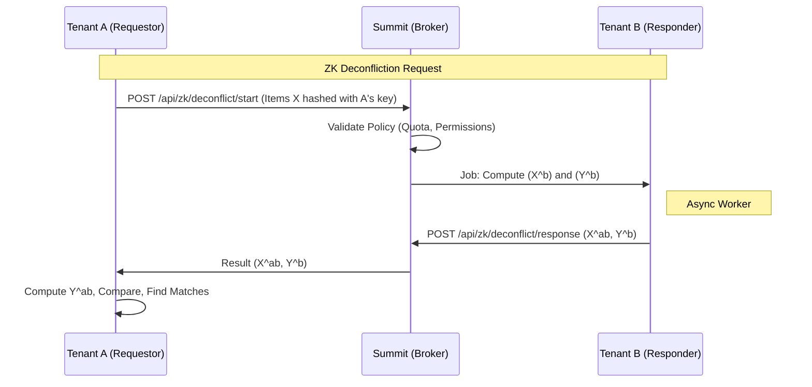

# Zero-Knowledge Deconfliction Specification

**Version:** 1.0
**Status:** DRAFT
**Author:** Staff Engineer, ZK Systems

---

## 1. Executive Summary

This specification defines the architecture for **Zero-Knowledge Deconfliction** within Summit. It enables multiple tenants (or coalition partners) to identify overlapping entities (e.g., "Do we both know Person X?") without sharing their non-overlapping datasets or revealing the raw data of the overlapping entities to the platform itself in plaintext during the process.

**Strategic Goal:** Provable non-exfiltrating overlap detection across Tenants, Coalitions, and Compartments.

---

## 2. Threat Model Summary

_Full detail in [ZK Threat Model](./zk-threat-model.md)._

**Core Risks:**

- **Intersection Size Leakage:** Inferring dataset size from match counts.
- **Dictionary Attacks:** Brute-forcing the hash space with low-entropy inputs (e.g., phone numbers).
- **Timing Side-Channels:** Inferring set composition from processing time.

**Trust Boundaries:**

- **Tenant:** Untrusted.
- **Summit Host:** Semi-Honest (Follows protocol, but curious).
- **Enclave:** None (Software-only assumption).

---

## 3. Protocol Selection & Rationale

### Primary Pattern: ECDH-PSI

**Selected Protocol:** **ECDH-PSI** (Elliptic Curve Diffie-Hellman Private Set Intersection).

**Rationale:**

- **Security:** Provides information-theoretic security against semi-honest adversaries. Relies on the Discrete Logarithm Problem (DLP).
- **Software-Only:** Implementable using standard cryptographic libraries (TweetNaCl / Node `crypto` / `elliptic`) without specialized hardware (SGX/Enclaves).
- **Performance:** $O(n)$ complexity. Efficient enough for typical "Watchlist vs. Database" operations (thousands of items).

**Mechanism:**

1.  Alice computes $H(x)^a$.
2.  Bob computes $(H(x)^a)^b = H(x)^{ab}$ and $H(y)^b$.
3.  Alice computes $(H(y)^b)^a = H(y)^{ab}$.
4.  Intersection is found on matching $H(z)^{ab}$.

### Fallback Pattern: Bloom Filters with DP

**Selected For:** High-volume, low-sensitivity "existence checks".
**Mechanism:** Alice sends a Bloom Filter of her set. Bob queries it.
**Privacy:** Differential Privacy (Randomized Response) is applied to bit indices to provide plausible deniability.

---

## 4. Integration Specification

### 4.1 Architecture Diagram

### 4.2 Component Integration

#### A. Ingestion Pipeline

- **Normalization:** The `NormalizationStage` in the ingestion pipeline must produce **Canonical Strings** (e.g., `person:email:john.doe@example.com` normalized to lowercase/trimmed).
- **Salting:** Deconfliction operations use **per-session** ephemeral keys. No persistent "rainbow tables" of hashes are stored to prevent leaks if the DB is dumped.

#### B. Knowledge Graph & Storage

- The ZK service operates on **Natural Keys** extracted from the Graph schema (`server/src/graph/schema.ts`).
- It does **not** query the graph directly during the ZK exchange. It queries a specialized, access-controlled view or index that maps `TenantID -> EntityHashes`.

#### C. Multi-Tenant Isolation

- **Enforcement:** The Broker uses `server/src/tenancy/tenantScope.ts` to enforce boundaries.
- **Cross-Tenant Access:** Only permitted via explicit **Coalition Policy** documents (OPA rules). "Open" deconfliction is disabled by default.

---

## 5. Audit & CI Hooks

### 5.1 Governance

- **Tier-4 Approval:** Required for changes to `src/security/zk/**` and `server/src/tenancy/tenantScope.ts`.
- **Evidence:** Every execution generates a `zk_proof_bundle.json` (See [Audit Evidence](./zk-audit-evidence.md)).

### 5.2 CI Gates

- **Crypto Lint:** CI fails if `Math.random()` is used in ZK modules.
- **Dependency Lock:** Changes to `elliptic` or `sodium-native` trigger a security alert.

### 5.3 Operational Safeguards

- **Misuse Detection:** Alert on "High Cardinality Intersection" (> 50% matches).
- **Kill-Switch:** `ZK_DECONFLICTION_ENABLED=false` immediately halts all ZK endpoints.

---

## 6. Appendices

- [Appendix A: Threat Model](./zk-threat-model.md) - detailed risk analysis.
- [Appendix B: Audit Evidence Spec](./zk-audit-evidence.md) - schema for proof bundles.
- [Appendix C: Explainable Denials](./zk-explainable-denials.md) - templates for user responses.
