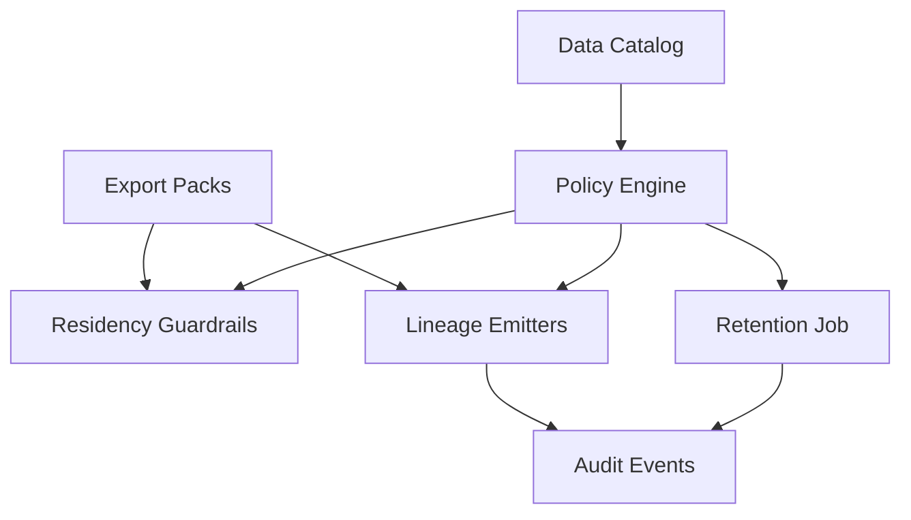

# CompanyOS Sprint 28 — Data Spine: Lineage, Residency, Retention

**Dates:** Mon Feb 2, 2026 → Fri Feb 13, 2026 (2 weeks)  
**Theme:** Governed-by-default data movement with lineage, residency, and retention enforcement.

## Sprint Goal

Ensure every dataset we store or move is cataloged with classification, enforced retention, enforced residency, and recorded lineage for any write/export.

## Objectives & Epics

### Epic A — Data Classification + Policy Annotations (Foundation)

- **Objective:** Every table/topic/blob has metadata that policy and audits can consume.
- **Key Deliverables:**
  - Repository data catalog (YAML/JSON) declaring dataset ID, owner, classification, PII flags, residency constraints, retention TTL, encryption requirements.
  - CI validator that blocks uncataloged datasets or invalid metadata and exposes runtime lookup by dataset ID.
- **Acceptance:** CI blocks uncataloged datasets; runtime returns catalog metadata on query.
- **Evidence Path:** `.evidence/sprint-28/data-catalog/`

### Epic B — Residency Guardrails (Runtime Enforcement)

- **Objective:** Prevent cross-region writes/exports when policy denies them.
- **Key Deliverables:**
  - Tenant residency configuration with allowed regions.
  - Enforcement hooks on export generation and cross-boundary replication/job dispatch.
  - Customer-readable policy-deny reasons plus audit events capturing tenant, requested region, allowed regions, and decision.
- **Acceptance:** Disallowed cross-region operations hard-block with deterministic errors; audit events emitted.
- **Evidence Path:** `.evidence/sprint-28/residency/`

### Epic C — Retention & Deletion Pipeline (Actual TTL)

- **Objective:** Retention is enforced via automated deletion/archive respecting legal holds.
- **Key Deliverables:**
  - Maestro/cron retention job deleting or archiving by dataset TTL with legal-hold exemptions.
  - Audit events with dataset IDs and deletion/archive counts; report artifact for each run.
- **Acceptance:** Two high-value datasets (hot + object/doc store) processed end-to-end; run produces report and audit trail.
- **Evidence Path:** `.evidence/sprint-28/retention/`

### Epic D — Lineage MVP (Provenance for Data Ops)

- **Objective:** Track how outputs are produced from inputs with queryable provenance.
- **Key Deliverables:**
  - Lineage event schema with output dataset, input datasets, job_id, code_version, policy_version, actor, trace_id.
  - Emission for export pack creation and 1–2 background jobs; read-only lineage query endpoint.
- **Acceptance:** For an export ID, we can identify contributing inputs, code version, and policy version.
- **Evidence Path:** `.evidence/sprint-28/lineage/`

## Stories → GitHub Issue Templates

| Epic | Issue Title                                           | Labels                            | Definition of Ready                                                                              | Definition of Done                                                                                                                               |
| ---- | ----------------------------------------------------- | --------------------------------- | ------------------------------------------------------------------------------------------------ | ------------------------------------------------------------------------------------------------------------------------------------------------ |
| A    | `data-catalog: bootstrap catalog + schema`            | `epic-a`, `data-gov`, `backend`   | Scope/owner set; catalog format approved; CI hook path documented.                               | Catalog schema committed; sample catalog populated; CI validator blocks uncataloged datasets and invalid metadata; runtime lookup demo recorded. |
| A    | `ci-validator: block uncataloged datasets`            | `epic-a`, `ci`, `blocker`         | Dataset diff strategy defined; failure messaging drafted.                                        | Validator runs in CI; failing/ passing cases stored in `.evidence/sprint-28/data-catalog/ci-validation-sample.txt`.                              |
| B    | `residency: tenant policy config + export guardrails` | `epic-b`, `platform`, `policy`    | Tenant list + allowed regions captured; denial UX approved.                                      | Residency checks enforced for exports with deterministic errors; audit events persisted with requested/allowed regions.                          |
| B    | `residency: replication/job dispatch enforcement`     | `epic-b`, `runtime`, `policy`     | Target job types enumerated; boundary matrix baselined.                                          | Cross-boundary dispatch blocked when disallowed; allow/deny matrix logged in `.evidence/sprint-28/residency/allow-deny-cases.md`.                |
| C    | `retention: maestro job + legal hold`                 | `epic-c`, `sre`, `data`           | Target datasets selected; deletion/archive strategy approved; legal-hold flag semantics defined. | Job runs against two datasets; run report + audit NDJSON emitted; legal-hold skips recorded.                                                     |
| D    | `lineage: event schema + emitters`                    | `epic-d`, `data`, `observability` | Schema reviewed; emitting services identified; endpoint auth decided.                            | Schema published; events emitted for exports and background jobs; lineage query endpoint documented with sample responses.                       |
| D    | `lineage: query endpoint & graph samples`             | `epic-d`, `api`, `security`       | Access policy approved; query shapes finalized.                                                  | Endpoint exposes lineage by dataset/export ID with policy checks; sample graphs stored in `.evidence/sprint-28/lineage/`.                        |

## Architecture & Data Flow (MVP)

## Evidence Artifacts (Deterministic Samples)

### Epic A — Data Catalog

- `.evidence/sprint-28/data-catalog/schema.json`
- `.evidence/sprint-28/data-catalog/catalog.sample.json`
- `.evidence/sprint-28/data-catalog/ci-validation-sample.txt`
- `.evidence/sprint-28/data-catalog/runtime-query.json`

### Epic B — Residency Guardrails

- `.evidence/sprint-28/residency/allow-deny-cases.md`
- `.evidence/sprint-28/residency/audit-events.ndjson`
- `.evidence/sprint-28/residency/policy-deny-response.json`

### Epic C — Retention

- `.evidence/sprint-28/retention/retention-job-config.yaml`
- `.evidence/sprint-28/retention/retention-run-summary.json`
- `.evidence/sprint-28/retention/audit-events.ndjson`
- `.evidence/sprint-28/retention/legal-hold-exemptions.json`

### Epic D — Lineage

- `.evidence/sprint-28/lineage/lineage-event.schema.json`
- `.evidence/sprint-28/lineage/lineage-events.ndjson`
- `.evidence/sprint-28/lineage/lineage-query-response.json`
- `.evidence/sprint-28/lineage/lineage-graph.mmd`

## Risks & Mitigations

- **Policy drift across services:** Pin policy version in lineage events and enforce config checksum alerts.
- **False-positive residency blocks:** Maintain allowlist fixtures per tenant and deterministic error payloads to triage quickly.
- **Retention safety:** Legal-hold flag double-checked in dry-run mode before first deletion window; audit-first run required.
- **Evidence gaps:** Each epic includes explicit artifact paths; CI steps must copy logs into `.evidence/sprint-28/`.

## Metrics & Observability

- **Residency:** Block/allow counts per tenant and region; alert on deny spikes.
- **Retention:** Deleted vs. archived object counts; legal-hold skip counts; job duration and error rate.
- **Lineage:** Event emission rate, coverage (% exports with lineage), endpoint latency and cache hit ratio.
- **Data Catalog:** Validator failure categories; catalog drift detection alerts.

## Team Allocation (Suggested)

- **Data/Platform (2):** Catalog + lineage schemas, retention job.
- **Backend (1):** Residency enforcement hooks in export/jobs.
- **Security/Governance (1):** Policy wiring + legal hold controls.
- **SRE (0.5):** Job reliability, alerts, runbook validation.

## Exit Gates (Hard)

- ✅ CI blocks uncataloged datasets.
- ✅ Residency enforcement blocks at least two critical paths with auditable denial reasons.
- ✅ Retention job deletes/archives at least two datasets and produces evidence artifacts.
- ✅ Lineage emitted for exports + ≥1 job, queryable under policy.

## Runbook Pointers

- Evidence folders live under `.evidence/sprint-28/` per epic.
- CI validator should be wired into `npm test` or `npm run lint` equivalents so PRs fail fast.
- Retention and residency hooks must emit structured audit events suitable for ingestion into the provenance ledger.

## Verification Plan (Tier C)

- Schema validation: Catalog and lineage schemas validate against their sample payloads.
- Policy enforcement: Residency allow/deny cases match audit events and deny payloads.
- Retention coverage: Report includes delete + archive actions with legal-hold exemptions recorded.
- Lineage query: Sample response aligns with emitted NDJSON events and graph.
