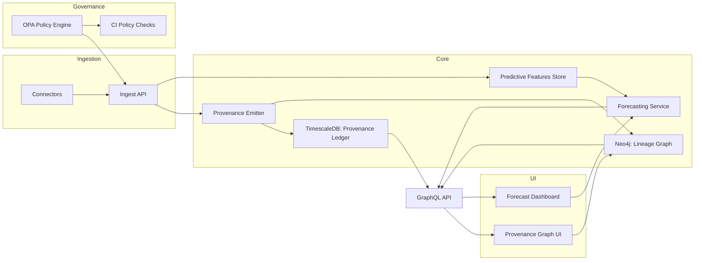

# Sprint 25+ Provenance, Predictive Analytics, and Governance Plan

## Design Decisions (Architecture, Data Flow, Governance Alignment)

- **Provenance-first data plane:** Introduce an append-only provenance ledger in TimescaleDB (immutable events) mirrored to Neo4j for graph traversal; all ingest/AI/analytics writes emit provenance events before state mutation to preserve auditability.
- **Dual-store lineage views:** Operational lineage (Timescale) for ordered events and compliance evidence; analytical lineage (Neo4j) for lifecycle graph visualization and impact analysis.
- **Predictive analytics service mesh:** Deploy a modular forecasting service exposing GraphQL resolvers; models are versioned artifacts with metadata (schema version, training window, provenance pointer) and can be swapped without API churn.
- **Policy-as-code enforcement:** All access, CI, AI validation, and provenance integrity checks encoded in OPA policies; policy bundles are versioned and validated in CI before deployment.
- **Golden Path alignment:** Every deliverable ships schema migrations, policy checks, and smoke-path coverage; CI gates validate dependency security, provenance completeness, and ML evaluation health before merge.

### Architecture Diagram (Conceptual)



### Data Flow & Trust Boundaries

- **Ingress boundary:** All ingested data flows through API middleware with policy evaluation and provenance emission before persistence.
- **Provenance ledger:** Append-only TimescaleDB ledger is the system of record; Neo4j mirrors the lineage view for traversal and UI.
- **Model execution:** Forecasting service emits provenance events per inference, including model version and training window metadata.
- **Policy checks:** OPA evaluates access, inference validity, and CI quality gates; decisions are logged to the ledger for audit trails.

### Operational Readiness Requirements

- **Observability:** Emit metrics for provenance event throughput, forecast latency, policy denial rates, and CI gate outcomes; trace ingest-to-forecast flow via OpenTelemetry.
- **Security:** Enforce signed provenance events, schema validation on telemetry, and immutable ledger constraints; reject writes missing signatures.
- **Compliance:** Record all governance decisions and policy checks to the ledger; surface audit evidence in CI artifacts.

### Migration & Rollback Strategy

- **Migrations:** Introduce Timescale/Neo4j schema changes behind feature flags; apply in forward-only migrations with validation scripts.
- **Rollback:** Provide reversible migrations where possible; maintain compatibility by writing both legacy and new provenance rows during transition.
- **Backfill:** Use generator to produce synthetic historical provenance to validate query performance and retention policies.

## Deliverable 1: Provenance & Lineage System

### Task List (Atomic Work Units)

1. Define TimescaleDB hypertable migrations for `provenance_events` with append-only constraints and retention policies.
2. Add Neo4j schema/index definitions for provenance relationships (ENTITY_CREATED, TRANSFORMED_BY, EMITS_ANALYTIC).
3. Implement backend event emitter middleware to capture ingest/AI/analytics actions and persist to Timescale + Neo4j.
4. Create GraphQL schema/resolvers for provenance queries (by entity, by correlation id, by time window).
5. Build React lineage graph component with center-on-entity and time-range filters.
6. Add background compaction job to archive cold provenance partitions while preserving immutability.

### Proposed APIs / Schemas / UI Designs

- **Timescale Hypertable (SQL excerpt):**
  ```sql
  CREATE TABLE provenance_events (
    event_id UUID PRIMARY KEY,
    occurred_at TIMESTAMPTZ NOT NULL,
    entity_id TEXT NOT NULL,
    entity_type TEXT NOT NULL,
    actor TEXT NOT NULL,
    action TEXT NOT NULL,
    metadata JSONB NOT NULL,
    source_system TEXT NOT NULL,
    correlation_id TEXT,
    signature BYTEA,
    model_version TEXT,
    ingest_window TSTZRANGE NOT NULL,
    CHECK (metadata ? 'hash'),
    CHECK (signature IS NOT NULL)
  );
  SELECT create_hypertable('provenance_events', 'occurred_at');
  SELECT add_retention_policy('provenance_events', INTERVAL '730 days');
  ```
- **Neo4j Nodes/Relationships:**
  ```cypher
  CREATE CONSTRAINT entity_id_unique IF NOT EXISTS FOR (e:Entity) REQUIRE e.id IS UNIQUE;
  MERGE (e:Entity {id:$entityId, type:$entityType})
  MERGE (p:ProvenanceEvent {id:$eventId})
    SET p.occurred_at=$occurredAt, p.action=$action, p.actor=$actor, p.model_version=$modelVersion
  MERGE (e)-[:HAS_EVENT]->(p)
  FOREACH (_ IN CASE WHEN $parentId IS NOT NULL THEN [1] ELSE [] END |
    MERGE (parent:ProvenanceEvent {id:$parentId})
    MERGE (parent)-[:TRANSFORMED_TO]->(p)
  );
  ```
- **GraphQL (excerpt):**

  ```graphql
  type ProvenanceEvent {
    eventId: ID!
    occurredAt: DateTime!
    entityId: ID!
    entityType: String!
    actor: String!
    action: String!
    metadata: JSON!
    sourceSystem: String!
    correlationId: String
    modelVersion: String
  }

  type ProvenancePath {
    anchorEntityId: ID!
    events: [ProvenanceEvent!]!
    graph: JSON! # serialized Neo4j subgraph
  }

  extend type Query {
    provenanceByEntity(entityId: ID!, limit: Int = 200): ProvenancePath!
    provenanceByCorrelation(correlationId: String!): [ProvenanceEvent!]!
    provenanceWindow(from: DateTime!, to: DateTime!, action: String): [ProvenanceEvent!]!
  }
  ```

- **UI:** React lineage panel with dagre layout, filter chips (entity/action/time), and modal showing metadata/hash/signature.

### Testing Blueprint

- Unit tests for provenance emitter ensuring append-only enforcement and signature presence.
- Integration tests: create ingest + AI inference + analytic pipeline, assert Timescale rows, Neo4j relationships, and GraphQL responses match.
- UI tests: render graph with mocked data, verify filters and node focus behavior.
- Negative tests: blocked mutation when signature missing; ensure retention policy does not delete within retention window.

### CI / Migration Notes

- Add migration scripts to `server/db/migrations/timescale` with up/down and integrity checks.
- CI job to run `pnpm --filter intelgraph-server test:provenance` plus schema drift detection against Timescale/Neo4j containers.
- Smoke test hook to validate provenance completeness for sample ingestion.

## Deliverable 2: Predictive Analytics Module

### Task List

1. Define Timescale schema for `predictive_features` and `forecast_results` with model/version references.
2. Implement ingestion pipeline for predictive telemetry (anomaly scores, forecasts) with validation against schema registry.
3. Build forecasting service interface with pluggable model adapters (e.g., Prophet, LSTM) and metadata registry.
4. Expose GraphQL queries/mutations for forecasting requests and model catalog.
5. Add React dashboard widgets for risk score trends and forecast confidence intervals.
6. Document model deployment/rollback workflow and sample payloads.

### Proposed APIs / Schemas / UI Designs

- **Timescale Tables:**

  ```sql
  CREATE TABLE predictive_features (
    feature_id UUID PRIMARY KEY,
    entity_id TEXT NOT NULL,
    feature_name TEXT NOT NULL,
    feature_value DOUBLE PRECISION NOT NULL,
    observed_at TIMESTAMPTZ NOT NULL,
    model_version TEXT,
    tags JSONB DEFAULT '{}'::jsonb
  );
  SELECT create_hypertable('predictive_features', 'observed_at');

  CREATE TABLE forecast_results (
    forecast_id UUID PRIMARY KEY,
    entity_id TEXT NOT NULL,
    outcome TEXT NOT NULL,
    predicted_at TIMESTAMPTZ NOT NULL,
    horizon INTERVAL NOT NULL,
    prediction JSONB NOT NULL,
    model_version TEXT NOT NULL,
    provenance_event UUID NOT NULL,
    quality JSONB,
    CHECK (prediction ? 'mean'),
    CHECK (prediction ? 'upper'),
    CHECK (prediction ? 'lower')
  );
  SELECT create_hypertable('forecast_results', 'predicted_at');
  ```

- **GraphQL:**

  ```graphql
  type ForecastResult {
    forecastId: ID!
    entityId: ID!
    outcome: String!
    predictedAt: DateTime!
    horizon: String!
    prediction: JSON!
    modelVersion: String!
    provenanceEvent: ID!
    quality: JSON
  }

  type ModelVersion {
    name: String!
    version: String!
    schema: JSON!
    trainingWindow: String!
    metrics: JSON!
  }

  extend type Query {
    forecast(entityId: ID!, outcome: String!, horizon: String!): ForecastResult!
    modelCatalog: [ModelVersion!]!
    featureWindow(
      entityId: ID!
      from: DateTime!
      to: DateTime!
      feature: String
    ): [PredictiveFeature!]!
  }

  extend type Mutation {
    submitForecastRequest(
      entityId: ID!
      outcome: String!
      horizon: String!
      modelVersion: String
      features: [JSON!]
    ): ForecastResult!
  }
  ```

- **UI:** Dashboard cards for risk score trend, confidence band chart, and model selector dropdown with metadata tooltip.

### Testing Blueprint

- Unit: model adapter contract tests with fixture models; schema validation for telemetry ingestion.
- Integration: end-to-end forecast request through GraphQL invoking mock model returning deterministic prediction; ensure provenance linkage to `provenance_events`.
- Performance: benchmark ingestion at target QPS with hypertable indexes; ensure forecast latency SLA met.

### CI / Migration Notes

- Migration scripts in Timescale for new tables; add seed scripts for sample model metadata.
- CI: add ML evaluation job running small benchmark dataset; fail on regression from baseline metrics.
- Smoke: run forecast request against seeded model to confirm GraphQL path works.

## Deliverable 3: Agent-Driven Test Data Generator

### Task List

1. Define generator configuration (YAML) covering entities, events, metrics, edge cases.
2. Implement generator service with plugin interface for domains (entities/events/metrics) and provenance hooks.
3. Add CLI to produce synthetic bundles for CI and local dev; integrate with Make/Just targets.
4. Wire generator outputs into API/analytics tests to ensure coverage for edge cases.
5. Add documentation and sample configs in `test-data/`.

### Proposed APIs / Schemas / UI Designs

- **Config (YAML excerpt):**
  ```yaml
  domains:
    entities:
      count: 200
      types: [user, device, organization]
      edge_cases:
        - missing_optional_fields
        - duplicate_external_ids
    events:
      count: 1000
      kinds: [ingest, ai_inference, analytic_output]
      anomaly_rate: 0.05
    metrics:
      count: 500
      distributions:
        latency_ms: lognormal
        risk_score: bimodal
  provenance:
    signed: true
    correlation_strategy: chained
  ```
- **CLI:** `pnpm --filter intelgraph-server run generate:testdata --config test-data/sprint25.yaml --out artifacts/sprint25.json`

### Testing Blueprint

- Unit: generator plugins validate required fields and provenance signatures.
- Integration: run generator -> ingest via API -> assert provenance events created and analytics dashboards render sample.
- Property-based/fuzz: inject high anomaly rates and truncated payloads to ensure validators hold.

### CI / Migration Notes

- Add CI job to run generator in dry-run to ensure configs valid; publish sample artifact as evidence.
- Hook smoke tests to consume generated data for provenance completeness.

## Deliverable 4: Governance & Policy Automation

### Task List

1. Author OPA/Rego policies for data access, CI enforcement, AI output validation, provenance integrity.
2. Add policy bundle versioning and distribution via CI artifact.
3. Implement policy evaluation middleware in API and CI pre-flight steps.
4. Add reporting hooks to expose policy decisions to audit logs and dashboards.
5. Document policy testing strategy and escalation paths.

### Proposed APIs / Schemas / UI Designs

- **OPA Bundle Structure (manifest):**
  ```yaml
  bundle_version: 25.1
  policies:
    - path: data/access.rego
    - path: ci/enforcement.rego
    - path: ai/outputs.rego
    - path: provenance/integrity.rego
  metadata:
    ownership: security-council
    promotion_gate: golden-path
  ```
- **Policy Input (example):**
  ```json
  {
    "actor": "svc-backend",
    "action": "write",
    "entity": { "id": "e-123", "type": "intel-report" },
    "provenance": { "event_id": "...", "signature_valid": true },
    "ci": { "workflow": "make smoke", "commit": "abc123" }
  }
  ```
- **UI:** Admin policy report page showing latest bundle version, failing decisions, and remediation links.

### Testing Blueprint

- Unit: Rego tests for each policy rule; golden files for expected allow/deny decisions.
- Integration: API middleware exercises allow/deny paths; CI hook rejects build on policy violation.
- Security: signature validation tests ensure provenance integrity policy triggers on tampering.

### CI / Migration Notes

- Add OPA test runner to CI; publish bundle checksum as artifact.
- Gate deployments on policy bundle promotion; rollback trigger if checksum mismatch.

## Deliverable 5: Golden Path CI Enhancements

### Task List

1. Extend CI workflow to include dependency security scanning and SBOM diff alerts.
2. Add ML model evaluation step with baseline metrics and thresholds.
3. Insert provenance completeness validator into smoke tests.
4. Add automatic rollback trigger when policy or evaluation checks fail.
5. Publish CI evidence artifacts (policy bundle checksum, evaluation report, provenance coverage).

### Proposed APIs / Schemas / UI Designs

- **CI Artifacts (JSON):**
  ```json
  {
    "sbom_diff": "clean",
    "model_eval": { "auc": 0.92, "drift": 0.01 },
    "provenance_coverage": 0.98,
    "policy_bundle_checksum": "sha256:...",
    "rollback": false
  }
  ```
- **UI:** CI dashboard panel summarizing security scan, model eval, and provenance coverage with links to logs.

### Testing Blueprint

- CI pipeline dry-run to verify new jobs; unit tests for provenance validator; integration test ensuring rollback flag set on failure.
- Performance: ensure added jobs keep CI under agreed SLA; parallelize where possible.

### CI / Migration Notes

- Modify `.github/workflows/pr-quality-gate.yml` to add new jobs/stages; ensure cache keys updated.
- Update `Makefile`/`Justfile` targets to include provenance validator and model evaluation smoke step.

## Next Steps

- Sequence work in the order above to unblock data model foundations first.
- Raise design review for provenance schemas and policy bundle promotion; finalize before implementing UI surfaces.
- Keep docs, migrations, and CI updates in the same PR per feature to preserve auditability.

## PR Package (Per Deliverable)

- **Commit scope:** One deliverable per PR; tag changes as `patch`, `minor`, or `major` per governance.
- **PR body:** Summary, rationale, risks, rollout/rollback, and evidence artifacts; link to relevant roadmap epic.
- **Reviewer checklist:** schema migration reviewed; policy tests passing; UI and GraphQL changes documented; CI gates green.
- **Evidence artifacts:** provenance coverage report, policy bundle checksum, model evaluation report, synthetic data manifest.

## Post-Merge Validation Plan

- Run `make smoke` in staging with seeded synthetic data.
- Verify provenance graph UI renders for a known entity and matches ledger/Neo4j counts.
- Validate forecasting endpoint latency and accuracy baseline; confirm no policy denials for allowed actors.
- Confirm CI evidence artifacts are attached to release build and stored in evidence index.

## Future Roadmap (Beyond Sprint 25+)

- Add streaming lineage diff viewer with time-travel queries.
- Introduce adaptive model routing based on confidence calibration.
- Implement policy anomaly detection (policy drift alerts) with evidence replay.
