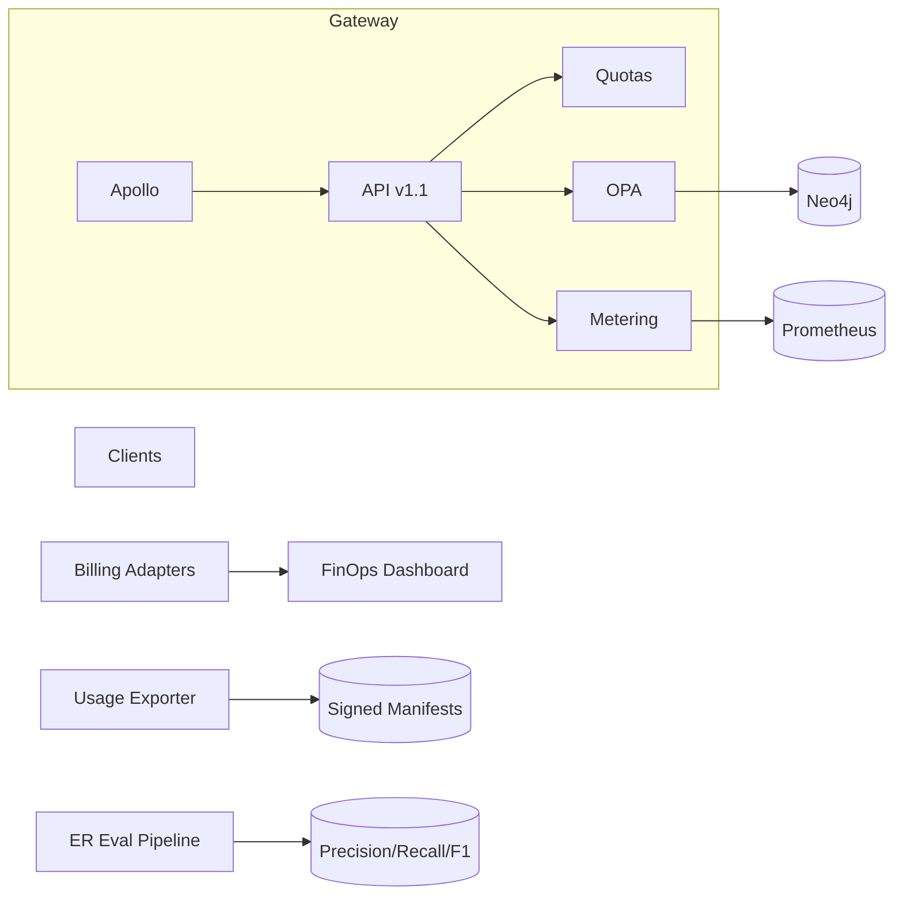

# Sprint 31 Plan — IntelGraph (Mar 16–27, 2026)

**Cadence:** 2 weeks • **Timezone:** America/Denver • **Release cut:** Mar 27, 2026 → staging; **Prod target:** Apr 1 (pending gates & error‑budget)

---

## Conductor Summary (one‑screen)

**Goal.** Turn on **usage‑based billing (limited tenants)** end‑to‑end, elevate **ER v1.2** with continuous evaluation + drift alerts, ship **API v1.1 non‑breaking additions**, and finalize **onboarding & quota presets** for Standard/Premium tiers. Tighten security posture with **SBOM attestation** and **secrets hygiene**.

**Non‑Goals.** Active‑active write quorum; ML‑based ER; public pricing pages.

**Assumptions.** S30 delivered metering+adapters (mocked), API versioning v1 baseline, ER v1.1 feedback, DR drill outcomes ticketed.

**Constraints.** Org SLOs & cost guardrails; ABAC/OPA across services; provenance immutable; feature flags & backout paths required.

**Risks.** (R1) Billing mismatches vs. quotas; (R2) ER drift after feedback; (R3) API v1.1 client regressions; (R4) Secrets exposure in legacy jobs.

**Definition of Done.** All ACs pass; error‑budget burn < 20%; CI green; evidence bundle attached; Finance sign‑off on usage exports; Privacy sign‑off on ER eval.

---

## Scope & Deliverables

1. **Billing E2E (limited tenants)**: enable adapters in staging + 2 pilot tenants in prod; signed usage exports; reconciliation dashboards.
2. **ER v1.2**: continuous eval pipeline on golden set + drift metrics; threshold auto‑suggest; rollback safety.
3. **API v1.1 (additive)**: new fields + persisted‑query rewrite hints; deprecation headers for pre‑v1 fields (no removals).
4. **Onboarding & Quota Presets**: one‑click tenant bootstrap, Standard/Premium presets, admin overrides with audit.
5. **Security Hardening**: SBOM attestation in CI; secrets scanning/enforcement; rotated keys roll‑forward test.
6. **Observability & Cost**: billing reconciliation, ER drift, API adoption, spend/egress caps.

---

## Sprint Backlog (Epics → Stories → Tasks)

> **MoSCoW** priority • **Pts** = story points

### E1 — Billing E2E (Limited Tenants) (Must) — 16 pts

* **S1. Adapter live toggle + retries** (5 pts, *Bob*)
* **S2. Reconciliation dashboard** (5 pts, *Grace*)
* **S3. Signed export schedule + runbook** (6 pts, *Elena*)

**AC**: Two pilot tenants export **daily** signed usage CSV/Parquet; adapter pushes succeed with ≥ 99% success; recon delta ≤ 1% vs. Prom counters; runbook covers backfill & resend.

---

### E2 — ER v1.2 (Drift & Eval) (Must) — 14 pts

* **S1. Eval pipeline (precision/recall/F1)** (6 pts, *Elena*)
* **S2. Drift metrics + alerts** (4 pts, *Grace*)
* **S3. Threshold auto‑suggest + guardrails** (4 pts, *Ivy*)

**AC**: Nightly eval produces metrics; drift alert when F1 drops > 2 pts; auto‑suggest proposes thresholds but gated by approval; rollback restores prior thresholds in < 5 min.

---

### E3 — API v1.1 Additive Release (Must) — 12 pts

* **S1. v1.1 schema & docs** (5 pts, *Alice*)
* **S2. Persisted‑query rewrite hints** (4 pts, *Alice*)
* **S3. Client sample updates** (3 pts, *Jay*)

**AC**: v1.1 opt‑in via header; no server‑side breaking changes; 95% of known queries auto‑rewrite; sample clients pass e2e.

---

### E4 — Onboarding & Quota Presets (Should) — 10 pts

* **S1. Tenant bootstrap wizard** (5 pts, *Jay*)
* **S2. Standard/Premium presets + overrides** (3 pts, *Bob*)
* **S3. Audit log entries** (2 pts, *Jay*)

**AC**: New tenant fully provisioned in ≤ 10 min; presets applied (API rpm, ingest eps, egress/day); overrides logged with actor & reason.

---

### E5 — Security Hardening (Must) — 10 pts

* **S1. SBOM attestation in CI** (4 pts, *Ivy*)
* **S2. Secrets scanning + pre‑commit hook** (4 pts, *Ivy*)
* **S3. Key rotation roll‑forward test** (2 pts, *Elena*)

**AC**: Build fails on missing attestation or high CVEs; secret leaks blocked in PR; key rotation exercised with zero downtime.

---

### E6 — Observability & Cost (Must) — 6 pts

* **S1. Billing recon + spend dashboards** (3 pts, *Grace*)
* **S2. ER drift panel** (2 pts, *Grace*)
* **S3. API v1.1 adoption chart** (1 pt, *Grace*)

**AC**: Dashboards live with sample data; alerts at 80% budget & drift threshold; links to runbooks.

---

### E7 — CI/CD & Policy Gates (Must) — 6 pts

* **S1. Perf profiles (billing overhead)** (2 pts, *Henry*)
* **S2. Policy sim (billing exports & retention)** (2 pts, *Ivy*)
* **S3. SBOM/CVE sweep** (2 pts, *Ivy*)

**AC**: Perf gate enforces SLOs with billing on; policy sim passes; zero High CVEs.

---

## Capacity & Forecast

* Team capacity ≈ **64 pts**; committed **~64 pts** (scope valve: E4 can slip).

---

## Architecture & Contracts (Delta)



**API Version Header**

```http
X-IG-Api-Version: 1.1
```

**Usage Export Columns (v1.1)**

```
tenant_id, period_start, period_end, api_calls, ingest_events, egress_gb, plan, quota_overrides, signature
```

---

## Security, Privacy & Policy

* ABAC/OPA; mTLS; field‑level encryption; SBOM attestation; secrets scanning; signed usage exports.
* ER eval outputs retained under **standard‑365d** (non‑PII), PII short‑30d; purpose tags enforced.

---

## Observability & SLOs

* Metrics: API p50/95/99, quota rejections, billing adapter success, recon deltas, ER F1/drift, spend, error‑budget.
* Targets per org defaults; budget alerts @80%.

---

## CI/CD & Release

* Gates: lint/type/tests, e2e, perf (billing on), SBOM/CVE, policy sim.
* Canary: 10%/15 min; backout disables adapters and reverts API default to v1.
* Evidence bundle: SLO report, k6 artifacts, SBOM attestation, policy logs, signed usage exports, ER eval report.

---

## RACI

* **R**: Story owners • **A**: Tech Lead (Alice) • **C**: Security (Ivy), SRE (Grace), Privacy, Finance • **I**: PM.

---

## Checklists

**Acceptance Pack**

* [ ] All story ACs green
* [ ] SLO dashboards 24h green
* [ ] Perf & e2e gates green
* [ ] SBOM/CVE clear + attested
* [ ] Policy sim passes
* [ ] Finance & Privacy sign‑offs recorded
* [ ] Evidence bundle attached

**Backout Plan**

* Disable billing adapters; revert API default; turn off ER threshold auto‑suggest; invalidate caches; pause eval job.
