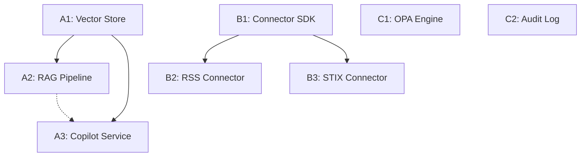

# Sprint N+7 Roadmap: Execution Plan

**Sprint Objective:** Transform Summit’s medium-term roadmap into a stack of independently executable epics that can be run in parallel by agents without coordination debt.

## 1. Epic Decomposition & Dependency Graph

We have decomposed 3 major initiatives into atomic, executable epics.

### Initiative A: Secure LLM Copilot & Retrieval (Priority: XL)

_Goal: Air-gapped capable, RAG-enhanced copilot._

- **Epic A1: Local Vector Store & Embeddings Service**
  - **Scope:** Deploy Weaviate/Qdrant (dockerized), implement `EmbeddingService` interface, add offline-capable embedding model (e.g., all-MiniLM-L6-v2) to docker image.
  - **Dependencies:** None.
  - **Output:** Functional vector store accessible via internal API.

- **Epic A2: RAG Ingestion Pipeline**
  - **Scope:** Create `IngestionPipeline` that subscribes to `ProvenanceLedger`, chunks text content, generates embeddings (using A1), and stores in Vector DB.
  - **Dependencies:** A1 (Soft - can mock interface).
  - **Output:** New data added to graph/ledger automatically appears in vector store.

- **Epic A3: Copilot Query Service**
  - **Scope:** Implement `CopilotService` with RAG retrieval. Support "mock" LLM, "local" LLM (Ollama), and "external" LLM (OpenAI) via config.
  - **Dependencies:** A1. A2 (for meaningful results, but can be built in parallel).
  - **Output:** API endpoint `/api/copilot/query` returning RAG-grounded answers.

### Initiative B: Federation + Ingestion Mesh (Priority: L)

_Goal: Multi-source OSINT fusion._

- **Epic B1: Connector SDK & Registry**
  - **Scope:** Define `Connector` interface (fetch, normalize, emit). Create a `ConnectorRegistry` to load plugins.
  - **Dependencies:** None.
  - **Output:** TypeScript SDK for connector authors.

- **Epic B2: RSS/Atom Feed Connector**
  - **Scope:** Implement the first reference connector using the SDK.
  - **Dependencies:** B1.
  - **Output:** Working connector that pulls RSS feeds into the `IngestionPipeline`.

- **Epic B3: STIX/TAXII Connector**
  - **Scope:** Implement threat intel connector.
  - **Dependencies:** B1.
  - **Output:** Connector consuming STIX bundles.

### Initiative C: Platform Governance & Paved Road (Priority: M)

_Goal: Trust & Reproducibility._

- **Epic C1: Policy-as-Code Engine (OPA)**
  - **Scope:** Centralize OPA policy definitions. Implement `PolicyService` to evaluate decisions. Enforce on key mutations.
  - **Dependencies:** None.
  - **Output:** Application rejects non-compliant actions based on Rego rules.

- **Epic C2: Immutable Audit Log (Provenance v2)**
  - **Scope:** Harden `ProvenanceLedger` to ensure cryptographic chaining (Merkle tree or simple hash chain) of events.
  - **Dependencies:** None.
  - **Output:** Tamper-evident log of all system mutations.

### Dependency Graph



---

## 2. Execution Contracts

Each epic must satisfy the following contract before being marked "Done".

### Contract Template

**Invariant:**

1.  **No Broken Build:** `make smoke` must pass.
2.  **No New Secrets:** No credentials committed.
3.  **Documentation:** `README.md` updated or created for the component.
4.  **Tests:** Unit tests > 80% coverage for new code. Integration test for the primary flow.

### Specific Contracts

- **Epic A1 (Vector Store):**
  - `docker-compose.yml` includes vector db.
  - `make up` starts it successfully.
  - Test: Script inserts a vector and retrieves it.

- **Epic A2 (RAG Pipeline):**
  - Test: Ingest a text file -> Verify it exists in Vector DB.
  - Performance: Process 1MB text < 5s.

- **Epic A3 (Copilot):**
  - Config flag `LLM_PROVIDER` switches between `mock`, `local`, `openai`.
  - Test: Query returns result with citations (source document IDs).

- **Epic B1 (Connector SDK):**
  - NPM package (local or workspace) created.
  - Type definitions exported.
  - Example "Hello World" connector included.

- **Epic C1 (OPA):**
  - `policies/` directory contains `.rego` files.
  - Test: "Deny" policy actually blocks a request in `PolicyService`.

---

## 3. Roadmap Telemetry

Progress is tracked in `docs/roadmap/STATUS.json`.

**Schema:**

```json
{
  "last_updated": "ISO8601",
  "initiatives": [
    {
      "id": "A",
      "name": "Secure LLM Copilot",
      "epics": [{ "id": "A1", "status": "pending|in-progress|done", "owner": "Agent-X" }]
    }
  ]
}
```

**Rule:** Every PR must update this file if it completes an epic or significantly advances it.
