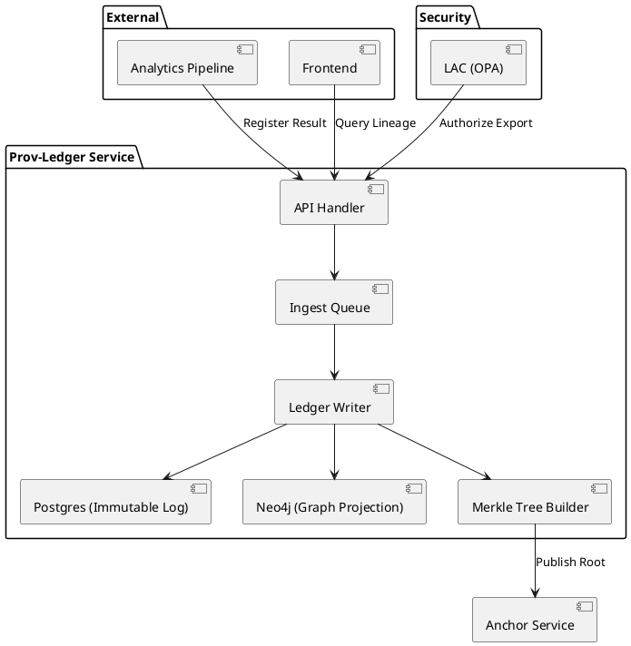

# Codex Prompt — IntelGraph Next Sprint (Prov-Ledger Beta)

**Status:** APPROVED
**Sprint:** 18
**Dates:** 2025-12-08 to 2025-12-19
**Team Capacity:** 80 SP
**Focus:** Prov-Ledger Beta, Proof-Carrying Analytics (PCA), Selective Disclosure Wallets

## Executive Summary

**Goal:** Deliver the "Provable Value Slice" by shipping the **Prov-Ledger Beta**. This sprint enables the registration of immutable evidence, the generation of verifiable export bundles (Selective Disclosure Wallets), and the enforcement of "blocker-only" export rules via the License/Authority Compiler (LAC).

**Value Proposition:**

- **For Analysts:** "Explain this view" and secure exports that travel with their proof.
- **For Compliance:** Automated audit trails (Proof-of-Non-Collection) and fail-closed export controls.
- **For Executive:** A demo-ready flow showing "Truth in -> Proof out" to win trust-sensitive deals.

**KPIs:**

- **Time-to-Verification:** < 500ms for offline wallet verification.
- **Export Latency:** < 2s for 100-node graph bundle with license binding.
- **Compliance:** 100% of exports have attached license/authority proofs.

---

## 1. Jira/Tracker Backlog (Import-Ready)

**Epic:** `PROV-BETA-01` **Prov-Ledger Beta + PCA + Wallets**
_Description:_ Implement the core provenance ledger with selective disclosure capabilities and export guardrails.

### User Stories

| ID        | Summary                            | Description                                                                       | AC (Acceptance Criteria)                                                                                                                                                           | Est (SP) | Tags                  |
| :-------- | :--------------------------------- | :-------------------------------------------------------------------------------- | :--------------------------------------------------------------------------------------------------------------------------------------------------------------------------------- | :------- | :-------------------- |
| **ST-01** | **Prov-Ledger Service API**        | Scaffold `prov-ledger` service with REST API for Claim and Evidence registration. | 1. `POST /api/v1/evidence` accepts JSON/Blob + Hash.<br>2. Returns `evidenceId` and Merkle proof.<br>3. Stores in Postgres (ledger) & Neo4j (graph).<br>4. OpenAPI spec published. | 8        | `backend`, `blocker`  |
| **ST-02** | **Claim/Lineage Graph Model**      | Implement Neo4j schema for Claims, Evidence, and `DERIVED_FROM` edges.            | 1. Cypher migration applied.<br>2. Can traverse `Evidence -> Transformation -> Claim`.<br>3. Bitemporal properties (`validFrom`, `validTo`) on edges.                              | 5        | `database`            |
| **ST-03** | **LAC Policy Engine (Blocker)**    | Integrate OPA to block exports if License/Authority is missing.                   | 1. OPA policy `export.rego` implemented.<br>2. Denies export if `license_id` is missing.<br>3. Denies if `authority_level` < required.<br>4. Returns actionable error reason.      | 5        | `security`, `lac`     |
| **ST-04** | **Selective Disclosure Packager**  | Build service to bundle sub-graph + proofs into a portable "Wallet".              | 1. Accepts graph query + audience tag.<br>2. Generates JSON-LD bundle.<br>3. Filters node properties based on audience.<br>4. Signs bundle with service key.                       | 8        | `backend`, `wallet`   |
| **ST-05** | **Proof-Carrying Analytics Hook**  | Inject lineage hash into analytics results.                                       | 1. Analytics pipeline output includes `_provenance` metadata.<br>2. Includes hash of input dataset & model version.<br>3. Verify hash matches ledger record.                       | 5        | `analytics`, `pca`    |
| **ST-06** | **Wallet Verification CLI**        | CLI tool to verify a Wallet bundle offline.                                       | 1. `summit-verify bundle.json` command.<br>2. Checks signature.<br>3. Validates Merkle path against public root (simulated).<br>4. Outputs pass/fail with reason.                  | 3        | `cli`, `tools`        |
| **ST-07** | **Frontend: "Explain This" Panel** | UI hook in Tri-Pane to show provenance of selected node.                          | 1. Clicking node shows "Provenance" tab.<br>2. Fetches lineage from Prov-Ledger.<br>3. Displays source, method, and confidence.<br>4. Link to "Right-to-Reply" form.               | 5        | `frontend`, `ux`      |
| **ST-08** | **Frontend: Export to Wallet**     | UI action to trigger Selective Disclosure export.                                 | 1. "Export" button in Command Palette.<br>2. Modal to select "Audience" (e.g., Court, Press).<br>3. Download `.json` bundle.<br>4. Shows "Blocked" toast if LAC fails.             | 5        | `frontend`, `ux`      |
| **ST-09** | **DPIA & Compliance Stubs**        | Implement Proof-of-Non-Collection and Right-to-Reply stubs.                       | 1. `POST /api/v1/compliance/pnc` logs "data not collected" assertion.<br>2. Right-to-Reply URL in metadata templates.<br>3. DPIA document created.                                 | 3        | `compliance`, `docs`  |
| **ST-10** | **Chaos Drill: Broker Loss**       | Verify system behavior when Message Broker is down.                               | 1. Chaos test script kills NATS/Redis.<br>2. Ledger queues writes locally (WAL).<br>3. Recovers when broker returns.<br>4. No data loss.                                           | 5        | `test`, `reliability` |
| **ST-11** | **Red-Team: Export Bypass**        | Attempt to bypass LAC export controls.                                            | 1. Red-team script attempts direct API export.<br>2. Attempts to forge license claims.<br>3. Report showing all attempts blocked.                                                  | 3        | `security`, `test`    |
| **ST-12** | **Offline Kit Sync**               | Basic CRDT log sync for offline collectors.                                       | 1. `POST /api/v1/sync` accepts append-only log.<br>2. Merges distinct claims.<br>3. Detects conflicts (last-write-wins for now).                                                   | 5        | `backend`, `offline`  |

### Jira Import CSV Content

```csv
Summary,Description,Story Points,Issue Type,Labels
"Prov-Ledger Service API","Implement REST API for evidence registration. Endpoint: POST /api/v1/evidence. Storage: Postgres + Neo4j. Spec: OpenAPI 3.0.",8,Story,"backend,blocker"
"Claim/Lineage Graph Model","Implement Neo4j schema for Claims, Evidence, DERIVED_FROM. Support bitemporal edges.",5,Story,"database"
"LAC Policy Engine (Blocker)","Integrate OPA to block exports without license. Policy: export.rego. Fail-closed.",5,Story,"security,lac"
"Selective Disclosure Packager","Service to bundle sub-graph + proofs. Output: JSON-LD signed bundle. Input: Graph query + Audience.",8,Story,"backend,wallet"
"Proof-Carrying Analytics Hook","Inject lineage hash into analytics output. Metadata: _provenance object with input/model hashes.",5,Story,"analytics,pca"
"Wallet Verification CLI","CLI to verify bundle signature and Merkle path. Command: summit-verify.",3,Story,"cli,tools"
"Frontend: Explain This Panel","UI component in Tri-Pane. Show lineage, source, confidence for selected node.",5,Story,"frontend,ux"
"Frontend: Export to Wallet","UI Action for export. Select Audience. Handle LAC rejection gracefully.",5,Story,"frontend,ux"
"DPIA & Compliance Stubs","Implement Proof-of-Non-Collection stub and Right-to-Reply metadata templates.",3,Story,"compliance,docs"
"Chaos Drill: Broker Loss","Test resilience to NATS/Redis outage. Ensure local queuing/WAL.",5,Story,"test,reliability"
"Red-Team: Export Bypass","Security test to attempt bypassing LAC export restrictions.",3,Story,"security,test"
"Offline Kit Sync","Endpoint to sync append-only logs from offline collectors. Basic CRDT merge.",5,Story,"backend,offline"
```

---

## 2. Runbooks & Checklists

### Runbook: Rapid Evidence Registration

**Goal:** Manually register high-value evidence when automated ingest is stalled.

1. **Prepare Data:** ensure JSON/PDF is ready.
2. **Hash Generation:** Run `sha256sum data.pdf`.
3. **API Call:**
   ```bash
   curl -X POST https://api.intelgraph.internal/v1/evidence \
     -H "Authorization: Bearer $TOKEN" \
     -d '{"hash": "...", "type": "document", "metadata": {"source": "manual"}}'
   ```
4. **Verification:** Query `/v1/evidence/{id}` and check `proof_status: "anchored"`.

### Runbook: Selective Disclosure Packager

**Goal:** Generate a secure bundle for an external partner.

1. **Identify Scope:** Select Node IDs to export.
2. **Select Audience:** "Court" (Full detail) or "Press" (Redacted).
3. **Execute:**
   ```bash
   # Use the CLI wrapper
   ./summit-cli export --ids "n1,n2" --audience "press" --out "bundle.json"
   ```
4. **Verify:** Run `./summit-verify bundle.json`.
5. **Transmit:** Send via secure channel.

### Checklist: Chaos Drill - Broker Loss

- [ ] Notify DevOps channel.
- [ ] Start background load (evidence generation).
- [ ] **Action:** Kill NATS pod (`kubectl delete pod nats-0`).
- [ ] **Observe:** API should not 500; should accept and queue (or return 202 Accepted).
- [ ] **Action:** Restore NATS pod.
- [ ] **Verify:** Queued items are processed and appear in Neo4j.
- [ ] **Report:** Log recovery time and error rate.

---

## 3. Design & Architecture Artifacts

### PlantUML: Prov-Ledger Service Boundary



### Data Model: Cypher Schema (Claims & Provenance)

```cypher
// Constraint: Claims must have unique IDs
CREATE CONSTRAINT claim_id_unique IF NOT EXISTS FOR (c:Claim) REQUIRE c.id IS UNIQUE;

// Constraint: Evidence must have unique Hash
CREATE CONSTRAINT evidence_hash_unique IF NOT EXISTS FOR (e:Evidence) REQUIRE e.hash IS UNIQUE;

// Relationships
// (:Claim)-[:DERIVED_FROM {method: "...", confidence: 0.9}]->(:Evidence)
// (:Evidence)-[:SOURCE_OF]->(:Claim)
// (:Claim)-[:SUPPORTED_BY]->(:Claim)

// Migration 001: Create Indexes
CREATE INDEX claim_topic_index IF NOT EXISTS FOR (c:Claim) ON (c.topic);
```

### ADR: Proof-Carrying Analytics + Wallets

**Context:** Analytics results are currently opaque. We need to attach provenance to exported insights.
**Decision:** Implement "Proof-Carrying Analytics" where every result includes a cryptographic reference to its inputs and processing model.
**Consequences:**

- **Pros:** verifiable trust, auditability, enables "Selective Disclosure".
- **Cons:** Increased payload size, processing overhead for hashing.
  **Rollback:** Feature flag `ENABLE_PCA`. If latency > 2s, disable and revert to unsigned exports.

---

## 4. Security, Privacy & Ethics

### OPA Policy: LAC Blocker (export.rego)

```rego
package intelgraph.export

default allow = false

# Allow if user has license and authority
allow {
    input.user.license_id != null
    has_sufficient_authority(input.user.authority, input.data.classification)
    not is_blocked_jurisdiction(input.audience)
}

has_sufficient_authority(user_auth, data_class) {
    user_auth >= data_class
}

is_blocked_jurisdiction(audience) {
    blocked_audiences := {"adversary", "banned_state"}
    audience == blocked_audiences[_]
}
```

### DPIA Highlights

- **Risk:** Over-collection of OSINT data.
- **Mitigation:** "Proof-of-Non-Collection" - explicitly logging what we _didn't_ collect (e.g., PII stripped at ingest).
- **Right-to-Reply:** All person entities in the graph must have a metadata field linking to the dispute resolution form.

---

## 5. Implementation Stubs & Tests

### Prov-Ledger API Spec (OpenAPI Fragment)

```yaml
paths:
  /evidence:
    post:
      summary: Register Evidence
      requestBody:
        content:
          application/json:
            schema:
              type: object
              properties:
                hash: { type: string }
                content: { type: string }
                metadata: { type: object }
      responses:
        200:
          description: Registered
          content:
            application/json:
              schema:
                type: object
                properties:
                  id: { type: string }
                  proof: { type: string }
```

### Wallet Export Format (JSON-LD Stub)

```json
{
  "@context": ["https://w3id.org/security/v2", "https://intelgraph.io/ns/v1"],
  "type": "VerifiableGraphBundle",
  "audience": "court",
  "issuer": "did:web:intelgraph.io",
  "issuanceDate": "2025-12-19T12:00:00Z",
  "credentialSubject": {
    "nodes": [ ... ],
    "edges": [ ... ]
  },
  "proof": {
    "type": "Ed25519Signature2018",
    "jws": "eyJ..."
  }
}
```

---

## 6. CI/CD & Ops

### GitHub Actions: Provenance Build

```yaml
name: Build & Sign
on: [push]
jobs:
  build:
    runs-on: ubuntu-latest
    steps:
      - uses: actions/checkout@v3
      - name: Build
        run: make build
      - name: Generate SBOM
        run: syft . -o cyclonedx-json > sbom.json
      - name: Sign Artifacts
        run: cosign sign-blob --key env://COSIGN_KEY dist/app
```

### Grafana Dashboard JSON (Snippet)

```json
{
  "title": "Prov-Ledger KPIs",
  "panels": [
    {
      "title": "Time-to-Verification",
      "type": "gauge",
      "targets": [
        { "expr": "histogram_quantile(0.95, rate(verification_duration_seconds_bucket[5m]))" }
      ]
    },
    {
      "title": "Blocked Exports (LAC)",
      "type": "stat",
      "targets": [{ "expr": "increase(lac_export_blocked_total[1h])" }]
    }
  ]
}
```

---

## 7. Product Collateral

### OKRs

- **Objective:** Establish Trust Fabric foundations.
  - **KR1:** 100% of new evidence registered in Prov-Ledger.
  - **KR2:** Zero successful exports without License binding (Red Team verified).
  - **KR3:** < 500ms latency for offline wallet verification.

### Release Notes Template

**Version:** v0.18.0-beta
**Highlights:**

- **Prov-Ledger Beta:** Immutable evidence registration is now live.
- **Selective Disclosure:** Export specific graph slices for Courts/Press safely.
- **Guardrails:** LAC now enforces license checks on all exports.

**Known Issues:**

- Offline sync conflict resolution is currently "Last-Write-Wins".
- Wallet viewer is CLI-only for this beta.

---

## 8. Verification Checklist (Definition of Done)

- [ ] All stories passed acceptance tests.
- [ ] OPA policies active and blocking unauthorized exports.
- [ ] Red Team report confirms no bypass found.
- [ ] "Explain this" panel visible in UI.
- [ ] Runbooks validated via Chaos Drill.
- [ ] Release notes published.
