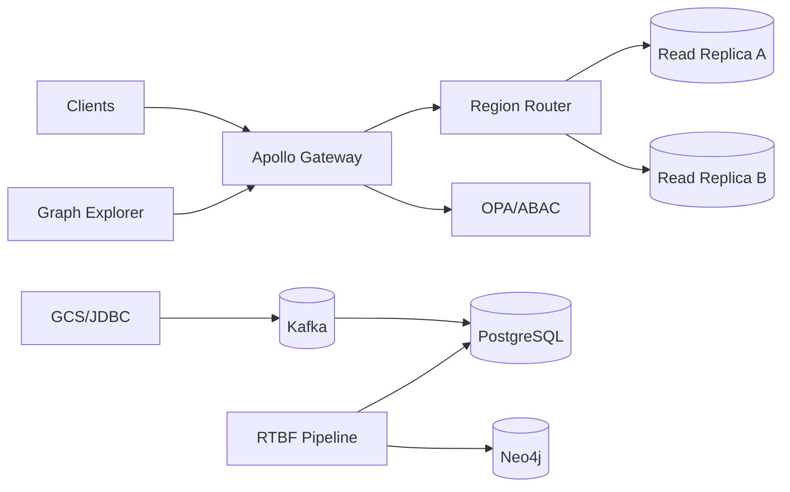

# Sprint 27 Plan — IntelGraph (Jan 19–30, 2026)

**Cadence:** 2 weeks • **Timezone:** America/Denver • **Release cut:** Jan 30, 2026 → staging; **Prod target:** Feb 3 (pending gates & error‑budget)

---

## Conductor Summary (one‑screen)

**Goal.** Stabilize and productionize the region‑sharded read path, take **GCS/JDBC connectors to GA**, land **RTBF end‑to‑end with Privacy sign‑off**, and ship **Explorer Path‑Filters v1**. Tighten SLOs with rate‑limiting and autoscale policies; reduce cost via cache and egress controls.

**Non‑Goals.** Active‑active writes, cross‑region write quorum, advanced GDS pipelines beyond path‑finding and degree metrics.

**Assumptions.** Sprint 26 closed with no P0 carry‑over; replicas healthy; Golden datasets refreshed; budget unchanged.

**Constraints.** Org defaults (SLOs & cost) enforced as CI gates. ABAC/OPA everywhere; mTLS; immutable provenance.

**Risks.** (R1) Replica lag spikes under burst; (R2) RTBF/ledger tension on derived entities; (R3) JDBC driver edge types; (R4) Alert fatigue if thresholds too tight.

**Definition of Done.** All ACs pass; burn < 20%; CI green; Privacy approves RTBF runbook; GA docs published; evidence bundle attached.

---

## Scope & Deliverables

1. **Region Sharding GA**: routing stability, lag guards, autoscale policies, failover drill.
2. **Connectors GA (GCS/JDBC)**: performance hardening, error handling/DLQ maturity, docs & examples.
3. **RTBF E2E**: audit bundle, DPIA notes, negative tests, export proofs.
4. **Graph Explorer Path‑Filters v1**: 2–3 hop with label/attr filters, saved views (persisted queries).
5. **SLO/Cost Controls**: rate‑limit per tenant, cache tuning, egress caps & dashboards.
6. **CI/CD**: perf profiles for sharded reads; SBOM/CVE sweep; policy sim for residency/purpose.

---

## Sprint Backlog (Epics → Stories → Tasks)

> **MoSCoW** priority • **Pts** = story points

### E1 — Region Sharding GA (Must) — 16 pts

* **S1. Routing health & sticky reads** (5 pts, *Alice*)

  * Health‑aware router; sticky reads per session; fallback to primary on lag.
* **S2. Lag guardrails & autoscale** (6 pts, *Grace*)

  * HPA on lag/exporter metrics; alert @ 2s/5s; shed load by tenant if needed.
* **S3. Failover drill (runbook)** (5 pts, *Kay*)

  * 15‑min drill; metrics + postmortem; gaps ticketed.

**AC**: p95 for read queries within 10% baseline; lag alerting functional; drill ≤ 15 min; zero data mix across tenants.

---

### E2 — Connectors GA (GCS/JDBC) (Must) — 14 pts

* **S1. Throughput tuning & backpressure** (6 pts, *Chen*)
* **S2. DLQ & retry semantics** (4 pts, *Dana*)
* **S3. GA docs + samples** (4 pts, *Chen*)

**AC**: GCS ≥ 50 MB/s/worker; JDBC ≥ 60k rows/min/worker; DLQ with replay tooling; GA docs published with schema mapping examples.

---

### E3 — RTBF E2E + Privacy Sign‑off (Must) — 10 pts

* **S1. Audit bundle & proofs** (4 pts, *Elena*)
* **S2. DPIA notes + runbook review** (3 pts, *Ivy*)
* **S3. Negative tests (tamper/partial)** (3 pts, *Elena*)

**AC**: Bundle includes proof hash, decision log, redaction map; DPIA signed by Privacy; tamper tests fail with actionable errors.

---

### E4 — Explorer Path‑Filters v1 (Should) — 9 pts

* **S1. Filter UI + persisted queries** (5 pts, *Jay*)
* **S2. Perf budget & a11y** (4 pts, *Jay*)

**AC**: 2–3 hop filtered paths p95 ≤ 1,200 ms; saved views; keyboard navigation; Playwright green.

---

### E5 — SLO & Cost Controls (Must) — 9 pts

* **S1. Per‑tenant rate‑limiting** (4 pts, *Bob*)
* **S2. Cache hit‑rate ≥ 85% hot set** (3 pts, *Bob*)
* **S3. Egress caps + dashboards** (2 pts, *Grace*)

**AC**: Burst does not breach API p95/99; cache metrics show target; spend alerts @ 80% budget with links to runbooks.

---

### E6 — CI/CD & Security Gates (Must) — 6 pts

* **S1. k6 sharded‑read profile** (2 pts, *Henry*)
* **S2. SBOM/CVE sweep** (3 pts, *Ivy*)
* **S3. Policy sim (residency/purpose)** (1 pt, *Ivy*)

**AC**: Perf gate enforces SLOs; zero High CVEs; policy sim passes.

---

## Capacity & Forecast

* Team capacity ≈ **64 pts**; committed **~64 pts** (scope valve: E4 can slip if risk materializes).

---

## Architecture & Contracts (Delta)



**Rate‑limit contract (example)**

```yaml
limits:
  tenant_default:
    rpm: 6000
    burst: 1200
    window: 60s
  tenant_overrides:
    TENANT_ALPHA:
      rpm: 12000
      burst: 2400
```

**Persisted query (Explorer view)**

```graphql
query FilteredPaths($id: ID!, $filters: PathFilters!, $purpose: Purpose!) {
  paths(entityId: $id, filters: $filters, purpose: $purpose) {
    nodes { id labels }
    edges { type weight }
  }
}
```

---

## Security, Privacy & Policy

* OIDC+JWT; mTLS; ABAC via OPA; residency & purpose checks; field‑level encryption.
* RTBF: redaction map + tombstones; non‑PII lineage preserved; audit proof exported.

---

## Observability & SLOs

* Metrics: API p50/95/99, cache hit‑rate, rate‑limit rejects, replica lag, connector throughput, egress spend, error‑budget.
* Alerts: lag >2s/5s; cache miss spike; rate‑limit saturation; spend @80%.

---

## CI/CD & Release

* Gates: lint/type/tests, e2e, perf (sharded read), SBOM/CVE, policy sim.
* Canary: 10%/15 min; rollback on SLO breach.
* Evidence bundle: SLO report, k6 artifacts, SBOM, policy logs, RTBF proofs, GA docs hashes.

---

## RACI

* **R**: Story owners • **A**: Tech Lead (Alice) • **C**: Security (Ivy), SRE (Grace), Privacy • **I**: PM.

---

## Checklists

**Acceptance Pack**

* [ ] All story ACs green
* [ ] SLO dashboards 24h green
* [ ] Perf & e2e gates green
* [ ] SBOM/CVE clear
* [ ] Policy sim passes
* [ ] Privacy sign‑off recorded
* [ ] Evidence bundle attached

**Backout Plan**

* Disable region routing; rollback rate‑limit config; revert connector images; restore pre‑change policies; invalidate caches.
