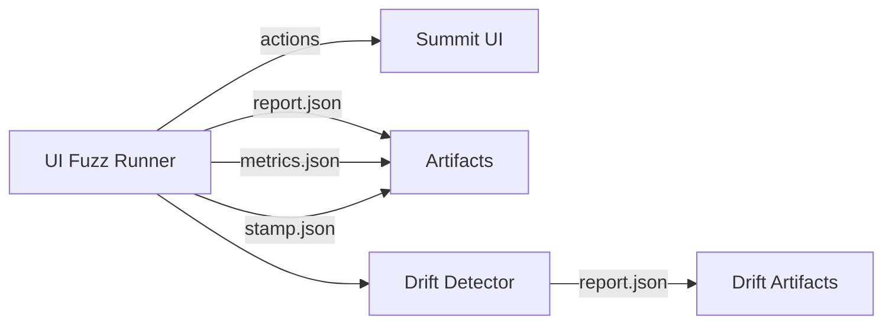

# Bombadil-Inspired UI Fuzz Probe Standard

## Summit Readiness Assertion
This standard aligns with the Summit Readiness Assertion to ensure deterministic, CI-safe UI probing with auditable artifacts. See `docs/SUMMIT_READINESS_ASSERTION.md` for readiness framing and evidence expectations.

## Purpose
Define the inputs, outputs, limits, and non-goals for the Summit UI fuzz probe inspired by Bombadil. This standard governs deterministic UI exploration, reproducible artifacts, and CI-safe execution.

## Authority & Alignment
- **Authority**: `docs/governance/CONSTITUTION.md`, `docs/governance/META_GOVERNANCE.md`.
- **Law of Consistency**: artifacts must be deterministic, hash-stamped, and reproducible.
- **MAESTRO Threat Modeling Framework**: required for all probe design updates.

## Scope
This standard applies to any UI fuzz probe runner, CI workflow, or artifact uploader intended to exercise Summit web surfaces.

## Architecture (High-Level)

## Import/Export Matrix
### Inputs
- Base URL(s) (local dev by default)
- Allowlist (required in CI)
- Seed (required)
- Time budget (required)
- Auth mode (none initially)
- Browser (chromium)
- Max actions / max navigation depth
- Console allowlist (optional, regex)

### Outputs
- `artifacts/ui_fuzz/report.json`
- `artifacts/ui_fuzz/metrics.json`
- `artifacts/ui_fuzz/stamp.json`
- Optional: `artifacts/ui_fuzz/trace.ndjson`

## Determinism Requirements
- Seeds **must** produce identical traces and hashes across re-runs.
- `stamp.json` **must not** include wall-clock timestamps; it should contain content hashes only.
- Trace ordering must be stable and canonicalized.
- `--exit-on-violation` (or equivalent) must return non-zero on confirmed violations.

## Non-Goals (Explicit)
- No credential stuffing or auth crawling.
- No production targets.
- No screenshot/video artifacts in deterministic mode (unless hashed-only).
- No open-ended traversal without time/action caps.

## Security & Privacy Requirements
- Enforce allowlist (deny-by-default).
- Never log cookies, Authorization headers, or storage values.
- Avoid dumping full DOM text by default.

## Evidence & Artifacts
- All runs must emit a report, metrics, and stamp file.
- Any violations must be reproducible with the same seed and build.

## Performance Budgets
- PR CI smoke: ≤ 5 minutes wall time, ≤ 1 GB RAM.
- Max actions: 200.
- Navigation cap: 20.
- Trace size cap: 2 MB.

## MAESTRO Threat Modeling (Required)
- **MAESTRO Layers**: Foundation, Data, Tools, Infra, Observability, Security.
- **Threats Considered**: goal manipulation, prompt injection via DOM, tool abuse (navigation to external targets), data leakage in logs.
- **Mitigations**: allowlist enforcement, redaction and never-log list, deterministic seeds and timeboxing, artifact hashing.

## Change Control
Any changes to this standard must preserve deterministic outputs and align with `docs/SUMMIT_READINESS_ASSERTION.md`.
