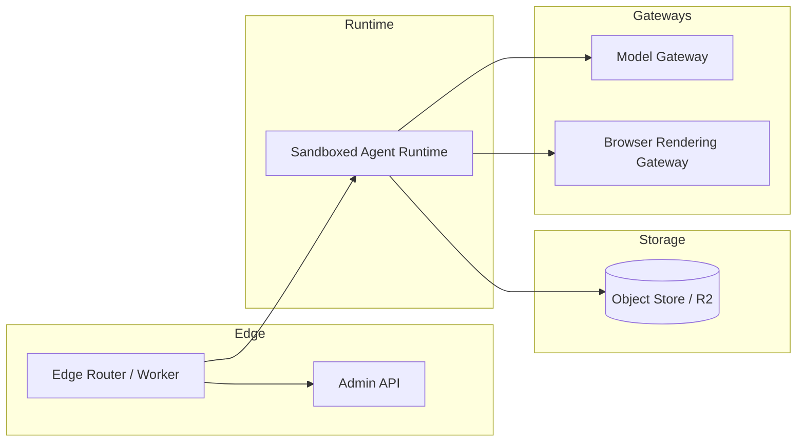

# Cloudflare Moltworker Pattern (Sandboxed Agent Runtime + Edge Router)

**Status:** Experimental Adapter Pattern (Feature Flag Default: OFF)

## Purpose (Final)

Define the **Sandboxed Agent Runtime + Edge Router** reference architecture for Summit, modeled on Moltworker’s proof-of-concept approach. The pattern enables isolated agent execution, object-store persistence, and policy-controlled gateways without binding Summit core to any single edge provider.

## Scope

**In-Scope**
- Edge router that fronts API/admin traffic and enforces authn/authz gates.
- Isolated sandbox runtime for agent execution.
- Persistent state stored in object storage.
- Model gateway and browser automation routed through policy-controlled adapters.

**Out-of-Scope (Non-Goals)**
- Re-implementing OpenClaw/Moltbot.
- Shipping a production Cloudflare deployment as a default path.
- Declaring hosted runs “private” beyond the explicit controls and threat model.

## Pattern Summary

Moltworker demonstrates a split-plane design:
- **Edge Router (Worker):** API + admin control plane.
- **Sandbox Runtime (Containers):** Agent execution in isolated sandboxes.
- **Persistence (R2):** Durable object-store state due to ephemeral runtime containers.
- **Gateways:** AI Gateway for model routing/observability and Browser Rendering for headless automation.
- **Zero-Trust Access:** Authn/authz around admin/runtime APIs.

Summit adopts the pattern as a **provider-agnostic adapter** with Cloudflare as an optional adapter, not a core dependency.

## Architecture (Reference)

## Import/Export Matrix

| Direction | Artifact | Description |
| --- | --- | --- |
| Summit → Runtime | `RunSpec` | Policy gates, tool allowlist, model routing policy, browser tasks. |
| Runtime → Summit | `StepEvents` | Step lifecycle events with policy decisions. |
| Runtime → Summit | `EvidenceBundle` | Deterministic report + metrics + stamp. |
| Runtime → Summit | `AuditEvents` | Authz results, tool usage, gateway routing decisions. |

## Persistence Contract

- **Rule:** Runtime state persists to object storage each step and resumes on restart.
- **Constraint:** No unstable timestamps in evidence; use stable input hashing.
- **Retention:** Default 7 days for experimental adapter unless overridden.

## Gateway Contracts

- **Model Gateway:** All model calls route through a broker for observability and policy enforcement.
- **Browser Automation:** Headless browser tasks must be routed through a broker with explicit policy allowlist.
- **Deny-by-Default:** Tool access and egress require explicit allowlist approval.

## Authn/Authz Gates

- Admin and runtime endpoints require **zero-trust** authentication.
- Authorization decisions are logged as auditable events.

## Node Compatibility Guidance

- The sandbox runtime assumes improved Node.js compatibility for broader npm package reuse.
- Runtime extensions must declare allowed modules and avoid native binaries unless validated.

## Experimental Guardrails (Governed Exception)

- Feature flag `FEATURE_SANDBOX_RUNTIME=0` by default.
- Adapter is **proof-of-concept** and may break; governed exceptions are required for production paths.
- Evidence bundles are mandatory for any sandboxed run.

## MAESTRO Threat Model Alignment

**MAESTRO Layers:** Foundation, Data, Agents, Tools, Infra, Observability, Security.

**Threats Considered**
- Tool exfiltration via unrestricted egress.
- Cross-tenant state bleed in object storage.
- Credential leakage in logs or evidence.
- Prompt injection via tool responses.

**Mitigations**
- Deny-by-default tool access + allowlists.
- Per-run namespaces with strong IDs.
- Never-log list + redaction for secrets.
- Evidence bundles with deterministic stamps and audit events.

## Governing Claims (Grounded)

- Self-hosted agent on Cloudflare developer platform without dedicated hardware. (ITEM:CLAIM-01)
- Worker + sandbox split-plane architecture. (ITEM:CLAIM-02)
- Persistent state in object storage due to ephemeral runtimes. (ITEM:CLAIM-03)
- Model routing via AI Gateway + observability. (ITEM:CLAIM-04)
- Browser automation via Browser Rendering. (ITEM:CLAIM-05)
- Zero-Trust Access for authn/authz. (ITEM:CLAIM-06)
- Improved Node.js compatibility enables wider npm reuse. (ITEM:CLAIM-07)
- Open-source proof-of-concept, not supported product. (ITEM:CLAIM-08)

## Compliance Notes

- This pattern does not claim privacy beyond explicit controls.
- All regulatory logic remains policy-as-code in Summit governance engines.
