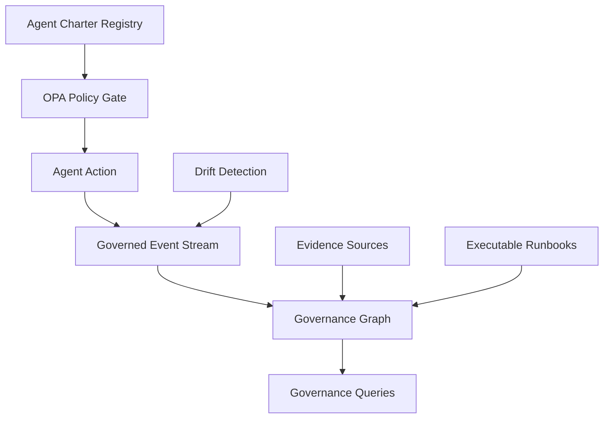

# First-Mover Advantage Spec: Governed Agentic Operating Model

**Status:** Active
**Authority:** Summit Governance Graph
**Readiness Anchor:** `docs/SUMMIT_READINESS_ASSERTION.md`

## 0. Present Assertion

Summit is already certified for deployment in controlled environments under the Summit Readiness Assertion. This spec operationalizes that readiness into a first-mover demo: a governed agentic operating model with a governance graph as the primary data asset and executable institutional memory. Deviations are treated as **Governed Exceptions**, not defects.

## 0.1 23rd-Order Implications (Condensed)

1. **Authority Cascade:** Every artifact must align to the governance chain or it is invalid.  
2. **Causality as Product:** The governance graph becomes the system of record for change truth.  
3. **Agent Accountability:** Agents are provable actors with enforceable constraints, not automations.  
4. **Evidence-Locked Claims:** Claims without live evidence are automatically deprecated.  
5. **Policy-First Execution:** Policies are gatekeepers, not post-hoc documentation.  
6. **Auditability by Default:** All execution pathways emit immutable provenance.  
7. **Temporal Consistency:** Every decision is time-versioned, enabling replay.  
8. **Bounded Autonomy:** Agents operate only within chartered mandates.  
9. **Risk Pricing:** Risk-adjusted budgets define execution feasibility.  
10. **Drift Immunity:** Governance drift triggers remediation events.  
11. **Cross-Org Readiness:** Trust fabric expansion is gated, not assumed.  
12. **Operational Memory:** Runbooks become executable and self-correcting.  
13. **Epistemic Controls:** Actions require verified, independent evidence.  
14. **Surface Reduction:** Policy-as-code consolidates and simplifies compliance logic.  
15. **Data Lineage Supremacy:** Lineage is a prerequisite for action validity.  
16. **Immutable Records:** WORM governance ledger becomes the canonical archive.  
17. **Replayable Decisions:** Forensics rely on event replay, not testimony.  
18. **Defensible Automation:** Automated outcomes are defensible via linked evidence.  
19. **Explicit Exceptions:** Deviations are cataloged as governed exceptions.  
20. **Minimal First-Mover Spec:** Scope is intentionally constrained for speed.  
21. **Verification Economy:** Evidence artifacts become first-class deliverables.  
22. **Governed Expansion:** New capabilities require policy and evidence gates.  
23. **Strategic Differentiation:** Governance becomes the market-defining feature.  

## 1. First-Mover Focus (2–3 fundamentals)

### 1.1 Agent-Governed Operating Model

**Claim:** Agents are first-class org actors with explicit mandates, constraints, and audit hooks.

**Minimal Spec (v1):**

- **Agent Charter Registry:** each agent has a charter with mandate, constraints, authority files, escalation path, and stop conditions.
- **Policy-as-Code Enforcement:** charters are validated by policy rules before actions execute.
- **Accountability Hooks:** every agent action emits a governed event into the governance graph.

**Core Artifacts:**

- `agent-contract.json` aligned with charter definitions.
- OPA policy rules for mandate and constraint enforcement.
- Immutable audit event schema for agent actions.

### 1.2 Governance Graph as Primary Data Asset

**Claim:** Policies, people, agents, systems, and changes are unified in a time-versioned graph that answers governance queries directly.

**Minimal Spec (v1):**

- **Typed Event Stream:** every change emits a typed, hash-linked event with causality references.
- **Graph Nodes:** Agent, Human, Policy, System, Change, Evidence, Decision.
- **Policy Evaluation Attachments:** each event references policy evaluations with allow/deny and required evidence.

**Core Queries (Demo-Ready):**

- “Show all agents and humans who could have caused this change class.”
- “Which policies would have blocked this incident signature?”

### 1.3 Content as Executable Institutional Memory

**Claim:** Claims, evidence, and playbooks are executable assets continuously revalidated.

**Minimal Spec (v1):**

- **Claim–Evidence–Action Model:** every runbook claim links to evidence and actions that auto-validate.
- **Drift Detection:** discrepancies between claims and evidence raise governed events.
- **Auto-Update Proposals:** agents propose updated claims when evidence shifts.

**Core Artifacts:**

- Runbook schema with claim/evidence/action links.
- Evidence ingestion hooks into the governance graph.
- Policy rule: do not assert claims without active evidence links.

## 2. Demo Blueprint (4–6 weeks)

### Week 1–2: Charter + Governance Graph Spine

- Implement charter registry entries and publish a minimal OPA policy suite.
- Emit governed events for agent actions into the governance graph.
- **Evidence Artifacts:** policy test outputs, example event stream, charter registry snapshot.

### Week 3–4: Executable Institutional Memory

- Define claim–evidence–action schema and bind to runbook examples.
- Create drift detection rule that raises a governance event.
- **Evidence Artifacts:** runbook schema, sample drift event, validation logs.

### Week 5–6: Unified Demo Storyboard

- Scenario: “Agent proposes a policy change, governance graph traces causality, runbook claim is revalidated.”
- Capture a deterministic replay showing evidence-backed acceptance or rejection.
- **Evidence Artifacts:** replay log, governance graph query outputs, decision trace.

## 3. Governed Exceptions (Deferred Pending Readiness Gate)

- **Cross-Org Agent Mesh:** Deferred pending cryptographic trust fabric and liability primitives.
- **Internal Work Markets:** Deferred pending risk-adjusted bidding policies and budget controls.
- **Agent Forensics Reconstruction:** Deferred pending graph-scale replay optimization.

## 4. Non-Negotiable Controls

- **Policy-as-Code Only:** regulatory requirements must be expressible as policy rules.
- **Immutable Provenance:** every action must have a hash-linked event in the governance graph.
- **Evidence-Backed Claims:** no claim is valid without live evidence references.

## 5. Success Criteria (Demo Exit)

- Agents execute under charters with enforced policies and audit events.
- Governance graph queries answer causality and policy impact for the demo scenario.
- Runbook claims auto-validate and emit drift events when evidence changes.

## 6. Authority Alignment

This spec is bound to the Summit Readiness Assertion and governance law hierarchy.
It is intentionally constrained to the above scope and will expand only through governed change control.

## 7. Full Architecture (Demo-Ready, Opinionated)

### 7.1 Core Services
- **Charter Service:** manages agent mandates and constraints.  
- **Policy Engine (OPA):** evaluates actions against charter + governance rules.  
- **Governance Graph:** canonical store for agents, humans, systems, policies, changes.  
- **Evidence Ingestion:** attaches telemetry and test results to claims.  
- **Drift Detector:** raises governed events when claims diverge from evidence.  

### 7.2 Data Model (Minimal)
- **Agent** (id, charter_ref, owner, scope)  
- **Policy** (id, rule, authority, version)  
- **Change** (id, type, actor_ref, policy_eval_ref, hash)  
- **Evidence** (id, source, timestamp, hash, claim_ref)  
- **Claim** (id, statement, evidence_refs, status)  
- **Decision** (id, action, policy_eval, outcome)  

## 8. Implementation (Documentation-Only, Execution-Ready)

### 8.1 Work Packages
- **WP1:** Charter registry + policy gate wiring.  
- **WP2:** Event stream → governance graph ingestion.  
- **WP3:** Claim–evidence–action schema + drift detection rule.  
- **WP4:** Demo storyboard + deterministic replay output.  

### 8.2 Evidence Artifacts
- Charter registry snapshot (JSON).  
- Policy evaluation logs (OPA).  
- Governance graph query outputs (JSON).  
- Drift detection event log.  
- Deterministic replay trace.  

## 9. Verification & Tests (Tier C)

- **Policy Tests:** verify charter constraint enforcement.  
- **Event Integrity:** validate hash-chain integrity for actions.  
- **Claim Validation:** ensure claims are rejected without evidence links.  
- **Demo Replay:** deterministic replay of the canonical scenario.  

## 10. Documentation Deliverables

- **Spec:** this document.  
- **Runbook Schema:** claim–evidence–action model definition.  
- **Governance Queries:** example query catalog for causality analysis.  
- **Exception Register:** governed exceptions list with authority links.  

## 11. CI/CD Alignment (Minimal)

- Validate prompt integrity against registry.  
- Validate PR metadata against task spec.  
- Ensure documentation drift checks pass.  

## 12. PR Package (Required)

- **What:** introduce the first-mover governed agentic spec and demo plan.  
- **Why:** establish market differentiation and execution alignment.  
- **How:** doc-only change with governance-anchored scope and evidence artifacts.  
- **Risks:** documentation-only; no runtime risk.  
- **Rollback:** revert spec and status update.  
- **Reviewer Checklist:** verify governance alignment, evidence artifacts, and readiness references.  

## 13. Future Roadmap (Governed Expansion)

- **Cross-Org Trust Fabric:** deferred pending cryptographic attestation and liability model.  
- **Agent Work Market:** deferred pending risk-adjusted bidding policy suite.  
- **Forensics Acceleration:** deferred pending graph replay optimization.  
