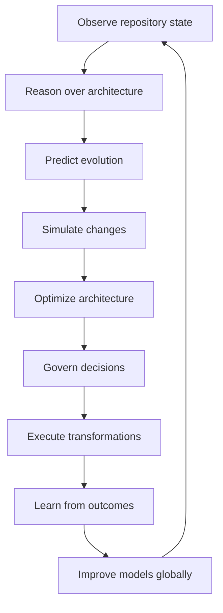
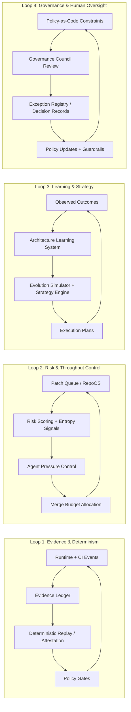

# Summit Final Platform Architecture

This document codifies the end-state conceptual architecture for Summit as an evidence-first,
graph-centric autonomous architecture intelligence system.

## System Map

```text
                ┌───────────────────────────────────────┐
                │        Engineering Intelligence       │
                │             Network (EIN)             │
                │  Cross-repo pattern discovery & ML   │
                └───────────────────────────────────────┘
                                   │
                                   ▼
        ┌─────────────────────────────────────────────────────┐
        │            Global Architecture Intelligence         │
        │  Pattern detection • ecosystem trends • innovation  │
        └─────────────────────────────────────────────────────┘
                                   │
                                   ▼
┌─────────────────────────────────────────────────────────────────────────┐
│                         Summit Intelligence Core                         │
│                                                                         │
│  ┌──────────────────────────┐     ┌──────────────────────────────────┐  │
│  │  Architecture Reasoning  │     │   Architecture Learning System   │  │
│  │  Graph queries & causal  │     │  Feedback loop + model tuning    │  │
│  │  explanations            │     │  simulation vs outcome learning  │  │
│  └──────────────────────────┘     └──────────────────────────────────┘  │
│                                                                         │
│  ┌──────────────────────────┐     ┌──────────────────────────────────┐  │
│  │  Evolution Simulator     │     │  Architecture Optimization       │  │
│  │  Monte-Carlo repo future │     │  Refactor & structure planning   │  │
│  │  prediction models       │     │  entropy reduction strategies    │  │
│  └──────────────────────────┘     └──────────────────────────────────┘  │
└─────────────────────────────────────────────────────────────────────────┘
                                   │
                                   ▼
┌─────────────────────────────────────────────────────────────────────────┐
│                      Repository Intelligence Layer                       │
│                                                                         │
│  ┌──────────────────────────┐     ┌──────────────────────────────────┐  │
│  │ Repository State Graph   │     │ Repository Knowledge Graph       │  │
│  │ structural state model   │     │ IntelGraph reasoning substrate   │  │
│  │ modules, subsystems      │     │ commits, PRs, dependencies       │  │
│  └──────────────────────────┘     └──────────────────────────────────┘  │
│                                                                         │
│  ┌──────────────────────────┐     ┌──────────────────────────────────┐  │
│  │ Stability Predictor      │     │ Patch Market / RepoOS Engine     │  │
│  │ CI failure forecasting   │     │ PR prioritization optimization   │  │
│  │ architecture entropy     │     │ economic merge ordering          │  │
│  └──────────────────────────┘     └──────────────────────────────────┘  │
└─────────────────────────────────────────────────────────────────────────┘
                                   │
                                   ▼
┌─────────────────────────────────────────────────────────────────────────┐
│                     Architecture Governance Layer                        │
│                                                                         │
│  ┌──────────────────────────┐     ┌──────────────────────────────────┐  │
│  │ Evolution Constitution   │     │ Architecture Policy Engine       │  │
│  │ protects core control    │     │ structural rules & constraints   │  │
│  │ loops & governance       │     │ dependency depth, coupling       │  │
│  └──────────────────────────┘     └──────────────────────────────────┘  │
│                                                                         │
│  ┌──────────────────────────┐     ┌──────────────────────────────────┐  │
│  │ Governance Council       │     │ Agent Pressure Control           │  │
│  │ human + AI review layer  │     │ prevents patch storms            │  │
│  │ architecture approvals   │     │ controls AI patch throughput     │  │
│  └──────────────────────────┘     └──────────────────────────────────┘  │
└─────────────────────────────────────────────────────────────────────────┘
                                   │
                                   ▼
┌─────────────────────────────────────────────────────────────────────────┐
│                      Architecture Execution Layer                        │
│                                                                         │
│  ┌──────────────────────────┐     ┌──────────────────────────────────┐  │
│  │ Strategy Engine          │     │ Execution Engine                 │  │
│  │ multi-stage architecture │     │ coordinated refactor execution   │  │
│  │ evolution roadmaps       │     │ patch cluster orchestration      │  │
│  └──────────────────────────┘     └──────────────────────────────────┘  │
│                                                                         │
│  ┌──────────────────────────┐     ┌──────────────────────────────────┐  │
│  │ Refactor Engine          │     │ Architecture Simulation Engine   │  │
│  │ structural change plans  │     │ safe architecture experimentation│  │
│  │ module extraction etc    │     │ sandbox evolution modeling       │  │
│  └──────────────────────────┘     └──────────────────────────────────┘  │
└─────────────────────────────────────────────────────────────────────────┘
                                   │
                                   ▼
┌─────────────────────────────────────────────────────────────────────────┐
│                        Engineering Workflow Layer                        │
│                                                                         │
│  ┌──────────────────────────┐     ┌──────────────────────────────────┐  │
│  │ PR Decision Influence    │     │ CI / Evidence Ledger Integration │  │
│  │ architecture analysis    │     │ deterministic artifact system    │  │
│  │ inline pull-request intel│     │ governance traceability          │  │
│  └──────────────────────────┘     └──────────────────────────────────┘  │
│                                                                         │
│  ┌──────────────────────────┐     ┌──────────────────────────────────┐  │
│  │ Summit Intelligence UI   │     │ API / GraphRAG Interface         │  │
│  │ architecture console     │     │ agent reasoning & queries        │  │
│  │ architecture exploration │     │ architecture knowledge access     │  │
│  └──────────────────────────┘     └──────────────────────────────────┘  │
└─────────────────────────────────────────────────────────────────────────┘
                                   │
                                   ▼
                        Engineering Systems
                   (GitHub • CI • Cloud • Repos)
```

## Major Subsystem Groups

### Repository Intelligence

1. Repository State Graph
2. Repository Knowledge Graph (IntelGraph layer)
3. Stability Predictor
4. Patch Market / RepoOS engine

### Architecture Intelligence

5. Evolution Simulator
6. Architecture Reasoning Engine
7. Architecture Optimization Engine
8. Architecture Innovation Engine

### Governance

9. Evolution Constitution
10. Architecture Policy Engine
11. Governance Council
12. Agent Pressure Control

### Execution

13. Strategy Engine
14. Refactor Engine
15. Execution Engine
16. Architecture Simulation Engine

### Ecosystem Intelligence

17. Global Architecture Intelligence
18. Engineering Intelligence Network
19. Architecture Learning System

### Interface + Integration

20. Summit Intelligence Console
21. PR Decision Influence Layer
22. Evidence Ledger / CI integration

## Core Closed-Loop Evolution Model



## Four Internal Stability Control Loops

These loops allow high-throughput autonomous change while preserving deterministic governance.



## Summit Readiness Assertion

This architecture extends, rather than replaces, Summit's current trajectory:

- RepoOS / Patch Market remains the optimization plane for merge ordering.
- IntelGraph remains the reasoning substrate for architecture-level inference.
- Evidence Ledger remains the chain-of-custody mechanism for deterministic artifacts.
- Multi-agent orchestration remains execution infrastructure constrained by governance gates.
- CI/CD quality and supply-chain controls remain mandatory enforcement layers.
