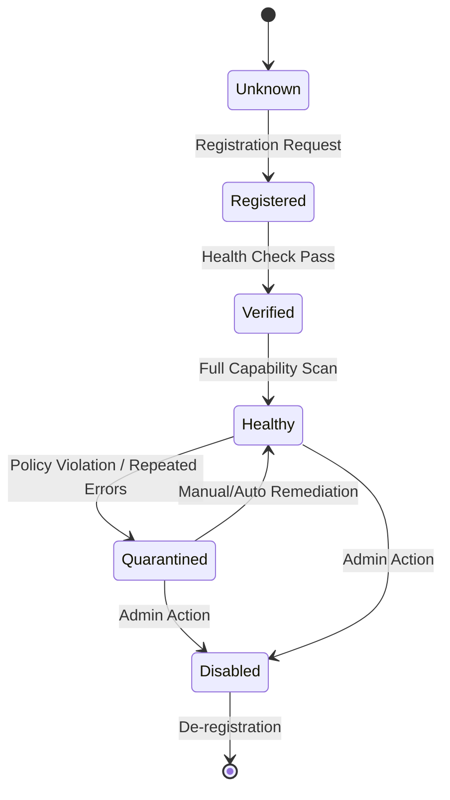
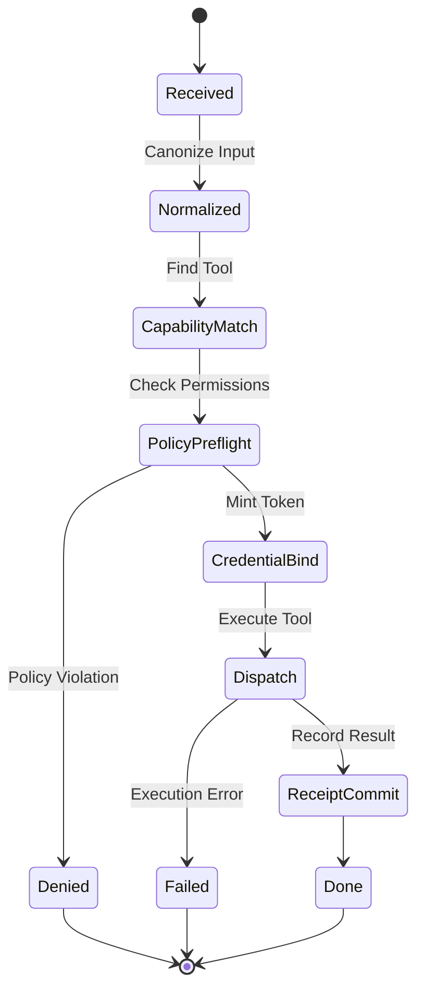

# Switchboard State Machines

## 1. MCP Server Lifecycle

The lifecycle of an MCP server registered with the Switchboard.

**States:**

*   **Unknown:** Server not known to the registry.
*   **Registered:** Metadata recorded, waiting for verification.
*   **Verified:** Basic connectivity established.
*   **Healthy:** Capabilities indexed, ready for routing.
*   **Quarantined:** Temporarily removed from rotation due to errors or policy flags.
*   **Disabled:** Permanently removed from rotation.

**Transitions & Invariants:**

| From | To | Trigger | Invariant Check | Receipt |
| :--- | :--- | :--- | :--- | :--- |
| Unknown | Registered | API Call | Valid Manifest | `REG-001` |
| Registered | Verified | Health Probe | TCP/HTTP OK | Log |
| Verified | Healthy | Cap Scan | MCP ListTools OK | `CAP-001` |
| Healthy | Quarantined | Error Threshold | > 5% 5xx errors | `LIF-001` |
| Quarantined | Healthy | Admin/Probe | Probe Success | `LIF-002` |

---

## 2. Routing Request Lifecycle

The lifecycle of a single tool execution request through the Switchboard.

**States:**

*   **Received:** Raw request ingestion.
*   **Normalized:** Input validation and canonicalization.
*   **CapabilityMatch:** Identifying target server and tool.
*   **PolicyPreflight:** OPA/Rego checks against request context.
*   **CredentialBind:** Retrieving/Minting ephemeral credentials for the target.
*   **Dispatch:** Sending request to MCP server.
*   **ReceiptCommit:** Persisting the signed receipt.
*   **Done:** Successful completion.
*   **Denied:** Blocked by policy.
*   **Failed:** Runtime error.

**Transitions & Invariants:**

| From | To | Trigger | Idempotency Key | Receipt |
| :--- | :--- | :--- | :--- | :--- |
| Received | Normalized | internal | N/A | Trace |
| Normalized | CapabilityMatch | internal | N/A | Trace |
| CapabilityMatch | PolicyPreflight | Match Found | N/A | Trace |
| PolicyPreflight | CredentialBind | Policy Allow | **Check** (Req ID) | Trace |
| PolicyPreflight | Denied | Policy Deny | **Check** (Req ID) | **Full (Deny)** |
| CredentialBind | Dispatch | Token Issued | **Set** (Req ID) | Trace |
| Dispatch | ReceiptCommit | Tool Success | **Update** | **Full (Success)** |
| Dispatch | Failed | Tool Error | **Update** | **Full (Fail)** |

**Idempotency:**
Idempotency keys are checked at `PolicyPreflight` (to prevent re-running costly policy checks) and enforced at `CredentialBind` to prevent double-execution of side effects.
