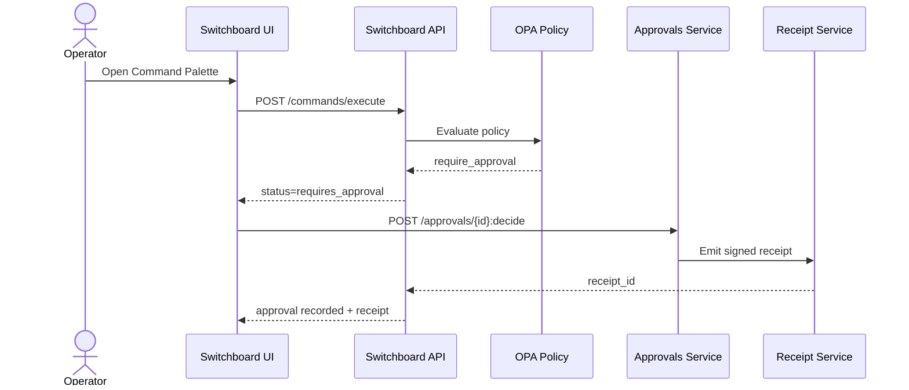

# Switchboard Approvals + Command Palette Architecture

## Summary
This architecture defines the policy-gated command execution flow from Command Palette to Approval to Receipt. It aligns with the Summit Readiness Assertion and the decision-policy versioned bundle.

## MAESTRO Alignment
- **Layers**: Foundation, Data, Agents, Tools, Observability, Security.
- **Threats Considered**: policy bypass, approval spoofing, receipt tampering, tool abuse, replay attempts.
- **Mitigations**: default-deny policy, dual-control approver set, idempotency keys, signed receipts, timeline visibility, receipt verification endpoint.

## System Diagram
```mermaid
flowchart LR
  subgraph UI[Switchboard UI]
    CP[Command Palette]
    AC[Approvals Center]
    RV[Receipt Viewer]
  end

  subgraph API[Switchboard API]
    CE[POST /commands/execute]
    PD[Policy Simulation]
    AP[POST /approvals/{id}:decide]
    TL[GET /timeline]
    RC[GET /receipts/{id}]
    RVF[POST /receipts:verify]
  end

  subgraph Policy[OPA / Decision Policy]
    OPABundle[OPA Bundle]
    PolicyConfig[packages/decision-policy]
  end

  subgraph Provenance[Provenance + Notary]
    ReceiptSvc[Receipt Service]
    Notary[Notary Adapter]
  end

  CP --> CE
  CE --> OPABundle
  PD --> OPABundle
  OPABundle --> CE
  CE --> AC
  AC --> AP
  AP --> ReceiptSvc
  ReceiptSvc --> Notary
  ReceiptSvc --> TL
  RV --> RC
  RV --> RVF
  TL --> RV
```

## Sequence


## Data Contracts
- **Command**: name, parameters, role scope, privileged flag.
- **Policy Decision**: outcome, required approver roles, evaluated_at.
- **Receipt**: hashes of inputs/outputs, approvals, signatures, evidence links.

## Operational SLO Targets
- Policy eval p95 < 100ms.
- Command execute p95 < 1.5s (preflight + enqueue).
- Receipt visible in timeline p95 < 2s.
