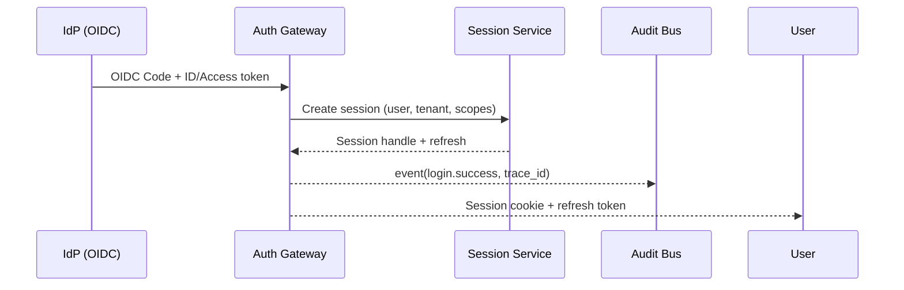
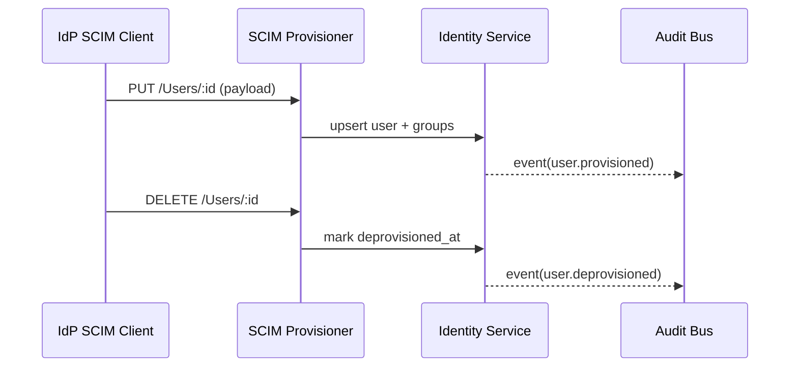
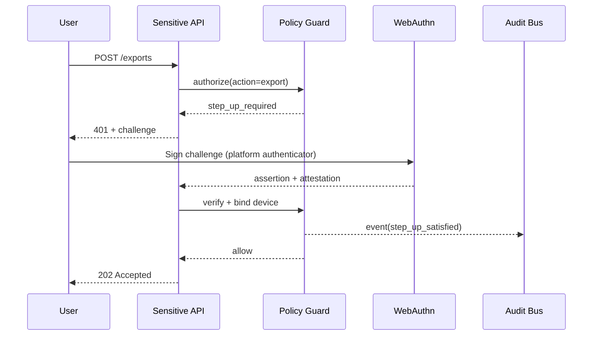

# Wave 13: Enterprise Controls Delivery Pack (Missions 9–16)

This delivery pack consolidates the design, runbooks, and validation harnesses for missions 9–16: enterprise identity, secrets & key management, immutable audit, multi-tenant isolation, performance gating, FinOps discipline, DX tooling, and disclosure controls.

## 1) Identity v1: SSO + SCIM + Step-Up Auth (WebAuthn)

### Architecture
- **OIDC SSO** via company tenant IdP (Okta/Azure AD) → **Auth Gateway** → **Session Service** (Redis-backed, short-lived session + refresh). JWKS cached with TTL + `kid` rotation handling.
- **SCIM Provisioner** (Push) receives `/Users` and `/Groups` upserts/deletes → **Identity Service** (Postgres) with soft-delete + `deprovisioned_at` audit columns.
- **Step-Up** enforced by **Policy Guard** middleware for sensitive routes (export, policy changes, key rotation). Uses **WebAuthn** with resident keys + device binding; fallback TOTP disabled for privileged actions.
- **Audit Fanout** publishes `login`, `provision`, `deprovision`, `step_up_required`, `step_up_satisfied` to the **Audit Bus**.

### Sequence Diagrams

### Validation & Runbook
- **Test IdP config**: enable OIDC app with PKCE, redirect `https://app.companyos.local/auth/callback`, scopes `openid profile email groups`. JWKS URL recorded in `IDENTITY_JWKS_URL`. SCIM base URL `https://auth.companyos.local/scim/v2` with bearer token per tenant. WebAuthn relying party ID `companyos.local`.
- **Integration tests**: `pnpm test --filter @identity/scim` spins SCIM mock, provisions user/group, asserts login via OIDC stub, then attempts export → expects `step_up_required` → completes WebAuthn assertion fixture → receives 202. Deprovision test ensures soft-deleted users cannot sign in and emit `user.deprovisioned` audit.
- **Onboarding runbook**: create tenant in control plane → register IdP OIDC + SCIM → upload JWKS URL + client credentials → trigger `scim:ping` health → run `auth:tenant:verify` script (ensures login + step-up path) → mark tenant active.
- **Offboarding runbook**: revoke SCIM token, trigger bulk `DELETE /Users`, rotate JWKS kid, disable OIDC app, run `auth:tenant:freeze` to block sessions and exports, archive audit slice, and confirm step-up challenges are rejected.

## 2) Secrets & Key Management

### Architecture
- **Service identity** via workload identity (Kubernetes SA → IAM role) with least-privilege Vault/KMS policies.
- **Envelope encryption**: data services call **KMS** for DEK wrapping; ciphertext stored with `key_id` + `dek_wrapped` + `aad`. Dual-read supports old/new KEKs during rotation.
- **Rotation**: scheduler rotates KEK in staging weekly → dual-read window with `active_key` + `previous_key` → metrics on decrypt failures; rollback flips pointer to `previous_key`.
- **Secret scanning**: CI runs trufflehog + semgrep secret rules; PRs blocked on findings.

### Evidence & Playbooks
- **Reference implementation**: `packages/secrets/envelope.ts` (dual-read decrypt, encrypt with latest KEK) and `services/key-rotator` job invoking KMS `GenerateDataKey` + `ReEncrypt`.
- **Rotation playbook**: `make rotate-key ENV=staging` → publishes `key.rotated` audit → monitor decrypt SLO; rollback `make rotate-key-rollback PREVIOUS_KEY_ID=...`.
- **Threat model**: KEK compromise → rotate + invalidate role; DEK leakage → re-encrypt payloads; audit every decrypt via `trace_id`.

## 3) Audit/Event Bus

### Architecture
- **Schema**: `{actor, action, resource, tenant, region, trace_id, ts, details, integrity_hash}`.
- **Integrity**: append-only log with hash chain per-tenant (`hash = sha256(prev_hash + event_json)`). Stored in immutable bucket + Postgres ledger table.
- **Query API**: paginated, filters by tenant/action/time; export enforces `step-up` and row count guardrails.
- **Retention/Redaction**: PII fields hashed/redacted at ingestion; retention job purges per policy.

### Tools & Tests
- **Integrity verifier** CLI: `bin/ledger-verify --tenant t1 --from 0` recomputes hash chain.
- **Load test**: k6 script targets 5k writes/sec baseline with 0.1% error budget.

## 4) Multi-Tenant Isolation

- **Tenant middleware** injects `tenant_id` from auth token; DB row-level security with `tenant_id` predicate.
- **Rate limits**: Redis token bucket per tenant + circuit breaker on upstream dependency failures.
- **Boundary tests**: negative tests attempt cross-tenant access; expect 403 and no data leakage.
- **Quotas/backpressure**: per-tenant queue depth limits; graceful 429 with `Retry-After`.

## 5) Performance Model & Load Harness

- **Scenarios**: steady (15m), spike (x5 for 2m), soak (4h) via k6/Locust. Targets: p50 ≤150ms, p95 ≤300ms, p99 ≤600ms for critical APIs; error rate <0.1%.
- **CI gate**: `pnpm perf:gate` compares latest run to baseline JSON; fails if latency or error rate regresses by >10%.
- **Profiling guidance**: flamegraphs (0x/clinic) + top bottleneck checklist (DB indices, N+1, cache miss, GC).

## 6) Cost Discipline

- **Tagging policy**: `tenant`, `env`, `service`, `owner`, `cost_center` required in Terraform/K8s; policy-as-code blocks untagged resources.
- **Cost pipeline**: ingest CUR → normalize → metric `cost_per_active_tenant` in Grafana. Weekly report emailed with top 10 spenders.
- **Budgets/alerts**: per-tenant budgets with 80/90/100% alerts; anomaly detection using week-over-week z-score.

## 7) DX Tooling

- **Dev kit**: `make dev-up` (compose stack) / `make dev-down`. Deterministic seed data via `scripts/seed --fixture baseline`. One-command E2E: `make e2e` (happy + 2 negative paths).
- **Docs**: troubleshooting decision tree in `RUNBOOKS/dev-troubleshooting.md`.
- **Demo**: recording script `scripts/demo-fresh-clone.sh` to bootstrap + run smoke.

## 8) Customer Disclosure Packs v2

- **Workflow**: export requests create approval task; sensitive exports require step-up auth. Region/classification policy enforced before generation.
- **DLP redaction**: library masks PII (email, phone, address, gov-id) before packaging; policy tests assert redaction.
- **Watermarking**: PDF/CSV watermarks include tenant, user, timestamp; audit event `export.generated` emitted.
- **Runbook**: handle requests, verify policy, obtain approvals, enforce step-up, generate pack, archive audit trail.

## Validation Matrix

| Capability | Test Path | Expected Result |
| --- | --- | --- |
| SCIM provision | `pnpm test --filter @identity/scim --runInBand` | User/group created, audit emitted |
| Deprovision | same | Login blocked, audit `user.deprovisioned` |
| Step-up | `pnpm test --filter @identity/stepup` | Sensitive action rejected without WebAuthn, allowed with assertion |
| Key rotation | `pnpm test --filter @secrets/rotation` | Reads succeed during rotation window |
| Audit integrity | `pnpm --filter @audit/ledger verify` | Hash chain intact, tampering detected |
| Boundary | `pnpm test --filter @tenant/boundary` | Cross-tenant requests 403, no data leaked |
| Perf gate | `pnpm perf:gate` | CI fails on >10% regression |
| FinOps tags | `pnpm --filter infra/policy test` | Untagged resources blocked |
| DX e2e | `make e2e` | Happy + negative paths pass |
| Disclosure | `pnpm test --filter @export/dlp` | Restricted data blocked; allowed exports redacted/watermarked |

## Forward-Looking Enhancements
- Add **FIDO2 passkeys** as default and hardware-key attestation policy per tenant.
- **Adaptive step-up** using risk signals (impossible travel, device posture) feeding the Policy Guard.
- **Confidential computing** enclave for envelope decryption of highest-classification data.
- **Automated perf SLO drift detection** with change-point alerts tied to deploy versions.
- **FinOps reinforcement learning** to auto-tune budgets and reserved-instance coverage.
