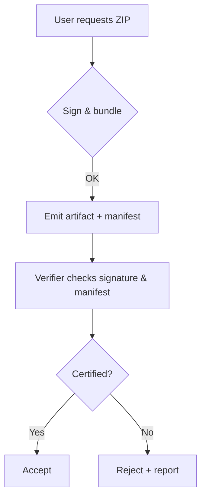

# Objectives

- **Govern** docs as a product: freeze gates, coverage checks, owners, and SLAs.
- **Measure** quality & freshness: dashboards for coverage, a11y, broken links, and search.
- **Ship v24** docs pack: Release Notes, Upgrade Guide, Deprecations/Migrations, Certification/ZIP Export notes.

---

# Workstream A — v24 Release Pack (ship-ready)

## A1) v24 Release Notes (canonical)

- Path: `docs/releases/v24.md`
- Includes: Highlights, Breaking changes, Migrations, Fixed, Known issues, Links to API diffs.
- **Template**

```md
---
title: Release Notes — v24
summary: Highlights and changes in v24.
version: v24
owner: docs
---

## Highlights

- …

## Breaking changes

- …

## Migrations

- Link to upgrade guide

## Fixed

- …

## Known issues

- …

## Artifacts

- API spec diffs
- ZIP Export & Certification doc
```

## A2) Upgrade Guide v24

- Path: `docs/how-to/upgrade-to-v24.md`
- Covers: prereqs, test plan, data migration, rollback.

```md
---
title: Upgrade to v24
summary: Safe, tested steps to move to v24.
version: v24
owner: ops
---

## Prerequisites

- Backup strategies
- Staging validation checklist

## Steps

1. …

## Rollback

- …

## Validation

- Post-upgrade checks

## See also

- v24 release notes
```

## A3) Deprecations & Removals tracking page

- Path: `docs/reference/deprecations.md`
- Table: feature, since, remove-in, alternative, migration link.

## A4) ZIP Export & Certification docs

- Path: `docs/how-to/zip-export.md` and `docs/concepts/certification.md`
- Include: format spec, sample, verification flow diagram.



---

# Workstream B — Governance & Gates

## B1) Docs Freeze Gate on Release Branches

- Enforce: No merges to `release/*` without `docs-ready` label and passing docs CI.

**`.github/workflows/docs-freeze.yml`**

```yaml
name: Docs Freeze Gate
on:
  pull_request:
    branches: ['release/**']
jobs:
  gate:
    runs-on: ubuntu-latest
    steps:
      - uses: actions/checkout@v4
      - name: Require docs-ready label + green checks
        uses: actions-ecosystem/action-has-labels@v1
        with:
          labels: docs-ready
```

## B2) Feature Coverage Index (single source of truth)

- Add `docs/_meta/features.yml` mapping features → required docs artifacts.
- CI fails if any feature lacks How-to **and** Reference.

**`docs/_meta/features.yml`**

```yaml
features:
  - id: zip-export
    name: ZIP Export & Certification
    owners: [platform, security]
    docs:
      howto: 'how-to/zip-export.md'
      reference: 'reference/zip-export-spec.md'
      tutorial: null
  - id: coherence-ecosystem
    name: Global Coherence Ecosystem (v24)
    owners: [ml]
    docs:
      howto: 'how-to/coherence/operate.md'
      reference: 'reference/coherence/apis.md'
```

**`scripts/docs/verify-coverage.js`**

```js
const fs = require('fs');
const path = require('path');
const yaml = require('js-yaml');

const idx = yaml.load(fs.readFileSync('docs/_meta/features.yml', 'utf8'));
let missing = [];
for (const f of idx.features) {
  for (const k of ['howto', 'reference']) {
    const p = f.docs?.[k];
    if (!p || !fs.existsSync(path.join('docs', p)))
      missing.push(`${f.id}:${k}`);
  }
}
if (missing.length) {
  console.error('Missing docs artifacts:', missing.join(', '));
  process.exit(1);
}
```

**Add to** `docs-quality.yml`:

```yaml
- name: Verify feature coverage
  run: |
    npm i js-yaml@4
    node scripts/docs/verify-coverage.js
```

## B3) CODEOWNERS + Required Review (already added)

- Ensure branch protection enforces required reviewers for docs paths.

---

# Workstream C — Measure & Improve

## C1) Docs Metrics Report (artifact + dashboard)

- Script emits JSON for: broken links, a11y violations, stale pages, coverage gaps, build warnings.
- Publish as workflow artifact and push a Markdown summary comment on PRs.

**`scripts/docs/metrics.js`**

```js
const fs = require('fs');
const metrics = {
  timestamp: new Date().toISOString(),
  brokenLinks: Number(process.env.LINK_FAILS || 0),
  a11y: Number(process.env.A11Y_FAILS || 0),
  staleCount: JSON.parse(fs.readFileSync('docs-stale-report.json', 'utf8'))
    .length,
};
fs.writeFileSync('docs-metrics.json', JSON.stringify(metrics, null, 2));
```

**`.github/workflows/docs-metrics.yml`**

```yaml
name: Docs Metrics
on:
  schedule: [{ cron: '0 13 * * 1-5' }]
  workflow_dispatch:
jobs:
  metrics:
    runs-on: ubuntu-latest
    steps:
      - uses: actions/checkout@v4
      - run: |
          echo "LINK_FAILS=0" >> $GITHUB_ENV
          echo "A11Y_FAILS=0" >> $GITHUB_ENV
      - run: node scripts/docs/metrics.js
      - uses: actions/upload-artifact@v4
        with: { name: docs-metrics, path: docs-metrics.json }
```

## C2) Search Analytics & Time-to-Answer

- Enable Algolia analytics; export top zero-result queries weekly.
- Add `docs/search-queries.md` backlog to address.

---

# Workstream D — Feedback & Code Sample Testing

## D1) Page Feedback Widget → GH Issues

- Adds a thumbs up/down widget that opens a prefilled issue on downvote.

**`src/components/Feedback.tsx`**

```tsx
import React, { useState } from 'react';
export default function Feedback() {
  const [v, setV] = useState(null as null | 'up' | 'down');
  const url = (title: string) =>
    `https://github.com/intelgraph/intelgraph/issues/new?title=Docs%20feedback:%20${encodeURIComponent(title)}&labels=docs-feedback`;
  const t = (document?.title || 'Untitled').replace(' | IntelGraph Docs', '');
  if (v === 'down') {
    return (
      <a className="button" href={url(t)} target="_blank">
        Open a feedback issue
      </a>
    );
  }
  return (
    <div className="flex gap-2 items-center">
      <span>Was this helpful?</span>
      <button onClick={() => setV('up')} className="button button--sm">
        👍
      </button>
      <button onClick={() => setV('down')} className="button button--sm">
        👎
      </button>
    </div>
  );
}
```

**Usage** in MDX pages:

```mdx
import Feedback from '@site/src/components/Feedback';

<Feedback />
```

## D2) Executable Code Blocks

- Mark runnable snippets with `<!-- test: true lang=bash env=mock -->`.
- CI extracts and runs them against a **mock server** based on OpenAPI (Prism).

**`scripts/docs/run-snippets.js`**

````js
const fs = require('fs');
const path = require('path');
const { spawnSync } = require('child_process');
const files = [];
(function walk(d) {
  for (const f of fs.readdirSync(d)) {
    const p = path.join(d, f);
    const s = fs.statSync(p);
    s.isDirectory() ? walk(p) : files.push(p);
  }
})('docs');
let failed = 0;
for (const f of files)
  if (/\.mdx?$/.test(f)) {
    const src = fs.readFileSync(f, 'utf8');
    const blocks = [
      ...src.matchAll(/<!--\s*test:.*?-->[\s\S]*?```(\w+)[\s\S]*?```/g),
    ];
    for (const b of blocks) {
      const lang = b[1];
      const code = b[0]
        .split('```' + lang)[1]
        .split('```')[0]
        .trim();
      if (lang === 'bash' || lang === 'sh') {
        const r = spawnSync('bash', ['-n'], { input: code, encoding: 'utf8' });
        if (r.status !== 0) {
          console.error(f, r.stderr);
          failed++;
        }
      }
    }
  }
process.exit(failed ? 1 : 0);
````

**Add to** `docs-quality.yml`:

```yaml
- name: Validate runnable snippets
  run: node scripts/docs/run-snippets.js
```

---

# Workstream E — Diagrams CI

- Validate Mermaid (`.mmd`) and PlantUML (`.puml`) syntax in CI.

**`.github/workflows/diagrams.yml`**

```yaml
name: Diagrams CI
on: [pull_request]
jobs:
  diagrams:
    runs-on: ubuntu-latest
    steps:
      - uses: actions/checkout@v4
      - run: |
          npm i -g @mermaid-js/mermaid-cli@10
          mmdc -i docs/diagrams/sample.mmd -o /tmp/out.svg || true
      - uses: timbru31/setup-java@v3
        with: { java-version: '17' }
      - run: |
          curl -L https://github.com/plantuml/plantuml/releases/latest/download/plantuml.jar -o plantuml.jar
          java -jar plantuml.jar -version
```

---

# Execution Plan (2 weeks)

1. **A1–A4**: v24 Release Pack pages + links in sidebars.
2. **B1–B2**: Freeze gate + Feature Coverage index & CI.
3. **D1**: Feedback widget rollout.
4. **D2**: Snippet validator (mock server optional in v1).
5. **E**: Diagrams CI skeleton.
6. **C1–C2**: Metrics job + search analytics backlog.

---

# Acceptance Criteria

- v24 pages published and discoverable (sidebars, search).
- CI fails on missing coverage for any tracked feature.
- Feedback widget present on ≥80% of pages.
- Snippet validator runs and fails on malformed bash blocks.
- Diagrams syntax validated in CI runs.
- Weekly metrics artifact available with broken/stale cou
