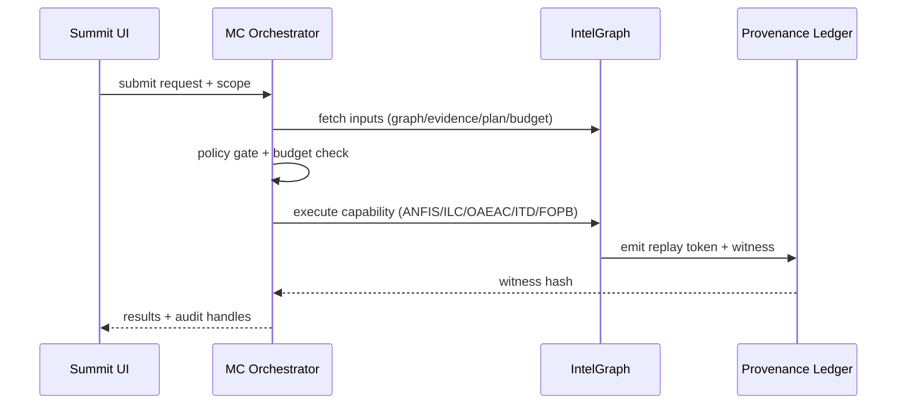

# Integration Blueprint: IP-First Competitive Set

This blueprint maps the five competitive "sidestep-to-surpass" methods to the Summit/IntelGraph/MC stack with clear module boundaries, data flows, observability anchors, and rollout steps.

## Cross-cutting integration themes

- **IntelGraph** holds canonical graphs, lifecycle registries, provenance hashes, and budget state.
- **MC (Maestro Conductor)** orchestrates tools/pipelines: fingerprint → intervention → simulation; lifecycle updates; ABI contract enforcement; plan distillation; federated scans.
- **Summit UI** surfaces audit UX: coordination fingerprint panels, lifecycle proof drawers, action contract witnesses, macro library, privacy budget and scan ledgers.
- **Provenance & replay**: every service emits replay tokens bound to IntelGraph provenance, enabling deterministic re-run and auditor review.

## Service bindings

### ANFIS (Narrative Fingerprinting + Simulation)

- **Data ingress**: ingest posts/accounts/media into IntelGraph temporal store; maintain text hashes and media hashes for LSH.
- **Compute**: deploy fingerprint engine as `server/src/services/narrative-fingerprints` (new) with cacheable window slices.
- **Interventions**: MC playbook to propose and apply interventions; budgets stored in IntelGraph policy registry.
- **Observability**: metrics on window build time, LSH collision rate, hub-removal impact; traces tagged with `replay_token`.
- **UI**: Summit panel with sliders for hub removal %, URL blacklist, and simulated spread deltas.

### ILC-PWD (IOC Lifecycle)

- **Data ingress**: evidence connectors feed entity evidence to IntelGraph evidence registry.
- **Compute**: lifecycle service (`server/src/services/lifecycle-compiler`) calculates provenance-weighted score and transitions.
- **State**: lifecycle registry stored in IntelGraph with proof hashes; MC triggers containment playbooks on ACTIVE.
- **Observability**: metrics for transition latency, conflict rate, decay outcomes; audit drawer in Summit showing minimal proof.

### OAEAC (Ontology ABI)

- **Compilation**: ABI compiler service generates typed stubs and contracts; artifacts versioned in IntelGraph ABI registry.
- **Execution**: contract executor runs within MC governed mode; emits witnesses to provenance ledger.
- **UI**: Summit shows action contracts, effect typing, and witness verification.
- **Security**: policy checks mapped to OPA or in-repo policy engine; multisig witness optional.

### ITD-OIP (Investigation Plan Distillation)

- **Capture**: instrument analyst sessions (Summit or client) to emit traces to MC.
- **Optimization**: distiller service performs IR normalization, batching, cache detection, and policy validation; stores plans in IntelGraph plan registry.
- **Execution**: MC runs plan deterministically; results/witnesses streamed back to IntelGraph and Summit.
- **Observability**: metrics for savings vs. baseline, cache hit rates, and policy blocks.

### FOPB-LG (Federated OSINT)

- **Authorization**: MC enforces active-mode tokens and purpose bindings before module dispatch.
- **Budgets**: IntelGraph holds per-subject budgets (lookups, bytes, TTL) with enforcement hooks.
- **Execution**: orchestrator fans out to federated workers; redaction pipeline before ledger writes.
- **Ledger**: append-only scan ledger committed to provenance store; capsule IDs used for ingestion.
- **UI**: Summit compliance view showing budget consumption, module allowlist, and ledger entries.

## Rollout plan (phased)

1. **Foundations**: create registries (fingerprints, lifecycle, ABI, plan, ledger) and provenance schemas; enable replay token format.
2. **Service enablement**: deploy services per section; integrate with MC orchestrations and policy engine.
3. **UI surfaces**: add Summit panels/drawers for each capability with audit/replay affordances.
4. **Guardrails**: configure budgets, allowlists, rate limits, and policy enforcement; add alerts on budget exhaustion or policy violations.
5. **Validation**: run synthetic end-to-end scenarios for each capability; store evidence artifacts for compliance.

## Observability & compliance hooks

- **Metrics**: standardize `duration_ms`, `cache_hit`, `policy_block`, `budget_remaining`, `replay_token` labels across services.
- **Traces**: propagate `replay_token` and `policy_decision_id` through MC spans.
- **Logs**: structured JSON with `tenant`, `capability`, `effect_type`, `budget_cost`, `witness_id`.
- **Alerts**: budgets below thresholds, policy check failures, witness verification failures, and non-deterministic replay detection.

## State-of-the-art enhancement

Introduce a **policy-aware cache coordination layer** shared across ANFIS, lifecycle, plan distillation, and federated scans. Cache entries are keyed by `(effect_type, policy_version, window_hash|plan_hash|entity_id|target_id)`, invalidating automatically on policy updates to ensure safe reuse across tenants.

## Integration architecture (data flow)

## Configuration surface (minimum viable settings)

| Setting                          | Purpose                  | Example           |
| -------------------------------- | ------------------------ | ----------------- |
| `POLICY_ENGINE_URL`              | Policy decision endpoint | `http://opa:8181` |
| `REPLAY_TOKEN_VERSION`           | Replay token schema      | `v1`              |
| `BUDGET_DEFAULT_LOOKUPS`         | OSINT budget cap         | `200`             |
| `BUDGET_DEFAULT_BYTES`           | OSINT byte cap           | `5_000_000`       |
| `LIFECYCLE_DECAY_HALF_LIFE_DAYS` | Evidence decay           | `14`              |
| `ANFIS_MAX_WINDOW_HOURS`         | Narrative window         | `72`              |
| `PLAN_MAX_BATCH_SIZE`            | Investigation batching   | `50`              |

## Test evidence targets

- **Golden path**: one end-to-end scenario per capability with replay token verification.
- **Policy gates**: deny/allow tests for intervention budgets, active OSINT tokens, and ABI effect types.
- **Ledger integrity**: verify append-only semantics and hash consistency.
- **Determinism**: rerun an execution and compare witness outputs and fingerprints.

## Operational guardrails

- **Fail-closed**: if policy engine is unavailable, block active OSINT and ABI writes.
- **Budget safety**: when budgets are near exhaustion, degrade to passive mode.
- **Replay token retention**: store replay tokens for compliance retention window and rotate encryption keys.
- **Upgrade safety**: pin hashing/serialization versions used in replay tokens and witnesses.

## UI integration checklist

- Coordination fingerprint panel with delta sliders and replay link.
- Lifecycle proof drawer with minimal support evidence and policy decision IDs.
- Action contract viewer with requires/ensures and witness validation.
- Macro library that shows trace provenance and savings estimate.
- OSINT compliance view showing module allowlist, budget burn-down, and ledger export.
