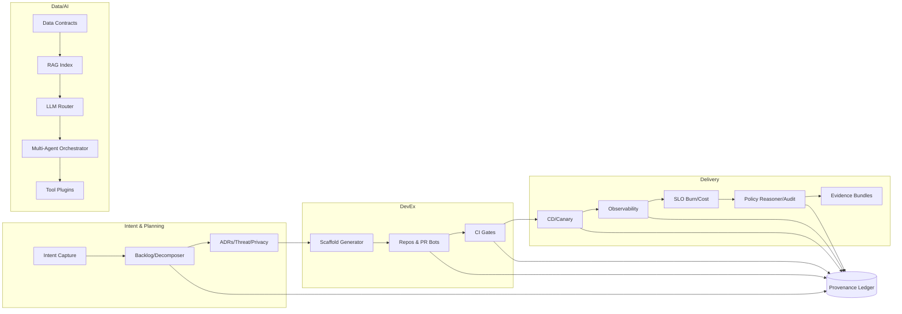

# IntelGraph Maestro Conductor (MC)

## Generations‑Beyond Best‑in‑Breed Build Platform — Integrated Plan

> Mission: Convert intent into shippable, compliant, observable product increments by unifying the most valuable capabilities from AI IDEs, low/no‑code builders, SDLC analytics, AIOps/MLOps, agent frameworks, and governance stacks into one orchestrated, evidence‑backed platform.

---

## 0) Conductor Summary (For Stakeholder Buy‑In)

**Goal**: Fold every useful capability across surveyed tools into MC, delivering a single orchestrated SDLC and data/AI build surface that is provably compliant, cost‑aware, and SLO‑driven.

**Non‑Goals**: Become a monolith; replace best‑of‑breed engines; lock‑in runtimes; compromise tenant isolation or provenance.

**Constraints**: Org Defaults (SLOs, cost guardrails, privacy, multi‑region), regulated topologies (SaaS MT, ST‑DED, Black‑Cell), evidence‑first operations, and deterministic rollout gates.

**Risks**: Scope creep; model/runtimes drift; agentic autonomy without guardrails; cost overruns; multi‑region data gravity.

**Definition of Done**: End‑to‑end slice from idea→prod with:

- Intent capture → backlog → design/ADR → code/tests → infra → release → observability, all traced in a provenance ledger.
- ABAC/OPA enforced, SLOs green, cost within guardrails, exportable evidence bundle.

---

## 1) Capability Ambition Map (Synthesized from the Landscape)

We integrate the most useful capabilities across AI IDEs (Copilot/Cursor/JetBrains), visual app builders (Bubble/Webflow/Quickbase/AppSheet), workflow/ETL (Airtable Omni/Parabola/Budibase), SDLC analytics/VSM (LinearB/Sleuth/Haystack/Plandek), LLMops/RAG (LangChain/LlamaIndex/DSPy/Haystack), inference (vLLM/SGLang/TGI/Ollama), eval/guardrails (LangSmith/Giskard/Ragas/Guardrails.ai/Evidently), agents & orchestration (Dify/Chainlit/AutoRAG, multi‑agent), and GPU/runtime mgmt (GPUStack). MC fuses these into coherent domains:

### 1.1 Intent→Backlog (Product OS)

- Natural‑language intent capture; auto‑epic/story/task decomposition using policy‑aware templates.
- MoSCoW prioritization, dependencies, RACI; acceptance criteria and verification steps generated and linked.
- Traceability matrix auto‑maintained (requirements ↔ tests ↔ code ↔ deploy ↔ SLOs).

### 1.2 Design & Architecture

- Mermaid/PlantUML diagrams; ADR library with compare/contrast and rollback notes.
- Threat model (STRIDE), abuse/misuse catalog, privacy design (minimization, purpose, retention tiers).
- Cost/design simulators (stateful LLM‑assisted what‑if with price/perf envelopes).

### 1.3 Implementation (DevEx)

- AI pair dev (multi‑model), refactors, test generation, PR review with policy checks.
- Repo hygiene: scaffolds (Node/Apollo, React/MUI/Cytoscape, Python AI, Ops/IaC), secrets scanning, SBOM.
- Multi‑agent “workcell” that coordinates codegen, testgen, docs, and migrations under guardrails.

### 1.4 Data & Graph

- Canonical entity/edge models, labeling, retention/residency; Cypher/SQL templates with cost hints.
- RAG‑ready data contracts; provenance ledger linking source→transform→use.

### 1.5 Ingest & Pipelines

- Day‑0 connectors (S3/CSV, HTTP pull/push, File Drop). Phase‑Next: GCS/Azure, JDBC, webhooks, bus adapters.
- Streaming/batch with backpressure, dedupe, schema mapping, field‑level encryption, hash manifests.

### 1.6 AI/LLM Platform

- Multi‑model (open/closed), routing, caching; cost/latency policies; eval‑before‑prod.
- Tool‑use & function‑calling, code‑exec sandboxes, retrieval APIs, multi‑agent orchestration with authority binding.
- Red‑team, toxicity/PII filters, jailbreak heuristics, reproducible prompts, versioned memories.

### 1.7 Testing & Evals

- Unit/integration/e2e/load/chaos; golden datasets.
- LLM evals: factuality, grounding, prompt regression; RAG diagnostics; guardrail tests.

### 1.8 CI/CD & Releases

- Trunk‑based, gates: lint/type/tests/SBOM/policy simulation; staged canary; auto‑rollback.
- Evidence bundle: SLO and eval reports, hashes, change manifests.

### 1.9 Observability & SRE

- OpenTelemetry by default; metrics/logs/traces + model/agent telemetry.
- Error budgets, burn alerts; cost dashboards; provenance integrity monitors.

### 1.10 Governance, Privacy, Compliance

- OIDC/JWT; ABAC via OPA; SCIM; WebAuthn; field‑level encryption.
- Policy reasoner with license/TOS classes, retention tiers, purpose tags.
- Audit exports (signed), region sharding, black‑cell packages.

### 1.11 Extensibility & Marketplace

- Stable plugin contracts (connectors, agents, UIs, policies, evaluators, dashboards, blueprints).
- Tenant‑scoped app store with signing, SBOM, runtime quotas, and contract tests.

---

## 2) Architecture (Clean Contracts Over Monolith)

**Key Internal Services**

- **Policy Reasoner**: compiles policies (license/TOS, retention, ABAC, cost) into runtime checks and CI simulations.
- **LLM Router**: policy‑aware model selection (latency/cost/region/privacy), with adapters for vLLM/SGLang/TGI/Bedrock/Ollama.
- **Multi‑Agent Orchestrator**: DAG‑driven workcells with authority binding and toolcaps.
- **Provenance Ledger**: append‑only, hash‑chained facts for claims, code paths, evals, and exports.
- **Marketplace**: signed artifacts, sandboxed plugins, contract tests, and usage metering.

---

## 3) Data & Policy Model (Seed)

**License/TOS Classes**: MIT‑OK, Open‑Data‑OK, Restricted‑TOS, Proprietary‑Client, Embargoed.

**Retention Tiers**: ephemeral‑7d, short‑30d, standard‑365d, long‑1825d, legal‑hold. Defaults: standard‑365d; PII → short‑30d unless legal‑hold.

**Purpose Tags**: investigation, threat‑intel, fraud‑risk, t&s, benchmarking, training, demo.

**Privacy/Security Defaults**: OIDC/JWT, ABAC/OPA, mTLS, field‑level encryption, immutable audit ledger.

---

## 4) APIs & Contracts (First‑Class)

- **GraphQL Gateway** (Apollo): queries/mutations/subscriptions with rate limits and authz.
- **RAG API**: `POST /retrieve` (k, filters, policy context), `POST /grounded-generate` (source URIs → citations).
- **Agent API**: declare roles, tools, memory scopes, and authority levels; emits evidence.
- **Policy API**: simulate on artifacts (PRs, datasets, prompts) → pass/fail with reasons.
- **Provenance API**: append/verify; export signed manifests.
- **Plugin API**: connector/agent/tool/guardrail/evaluator dashboards with contract tests.

**SLOs (Org Defaults)**

- GraphQL Gateway reads p95 ≤ 350 ms, writes p95 ≤ 700 ms; 99.9% monthly availability.
- Graph ops: 1‑hop p95 ≤ 300 ms; 2–3 hop filtered p95 ≤ 1,200 ms.
- Ingest: S3/CSV ≥ 50 MB/s per worker; streaming ≥ 1,000 events/s per pod; processing p95 ≤ 100 ms.
- Subscriptions: server→client p95 ≤ 250 ms.

---

## 5) Security, Privacy, and Compliance (Operate by Proof)

- **ABAC** with OPA; tenant/case scoped; least privilege; warrant/authority binding for sensitive tools.
- **Provenance everywhere**: link prompt→context→answer; code changes→tests→deploy; evals→policy decisions.
- **PII handling**: field‑level encryption; k‑anonymity/redaction; residency shards; RTBF workflow.
- **Supply chain**: SLSA/SBOM; signature verification for plugins and deployments.
- **Audit**: immutable ledger; export signed bundles for regulators/clients.

---

## 6) Observability & SLO Operations

- **Metrics**: latency/throughput/error ratios, queue depths, cost per call, token usage, cache hit rates.
- **Traces**: end‑to‑end including model calls and retrieval spans with grounding scores.
- **Logs**: structured; privacy tags; sampling tuned via budgets.
- **Dashboards**: SLO burn, cost guardrails, model drift, agent success rates, ingestion lag.
- **Alerts**: budget burn, tail latencies, eval regressions, provenance divergence.

---

## 7) CI/CD & IaC Blueprints

- Trunk‑based; PR gates: lint, type, unit/integration/e2e, SBOM, secret hygiene, policy simulation, eval pack.
- Canary/rollback; region overlays via Helm; Terraform for base infra; feature flags per tenant.
- Release cadence: weekly cut→staging, biweekly→prod, pause if error‑budget < 50%.

---

## 8) Extensibility Model & Marketplace

**Plugin Types**: connectors, agents/tools, evaluators/guardrails, dashboards/widgets, data contracts, blueprints.

**Contracts**:

- Manifest (id, version, license class, capabilities, required scopes, residency).
- SBOM + signature; contract tests; runtime quotas; sandbox policies.

**Marketplace**: tenant‑scoped catalogs, private listings, cost controls, auto‑updates with policy simulation.

---

## 9) Implementation Plan (Epics → Stories → Tasks)

### EPIC A — Intent to Evidence‑Backed Backlog (P0)

- Story A1: Intent capture UI + policy‑aware templates.
- Story A2: Decomposer (epic/story/task) with MoSCoW, dependencies, RACI.
- Story A3: Acceptance Criteria generator; verification steps library.
- Story A4: Traceability matrix service.

### EPIC B — DevEx Workcell & Scaffolds (P0)

- Story B1: Repo scaffolds (server, frontend, AI, ops) with guardrails.
- Story B2: PR bot (tests, refactors, SBOM, policy suggest).
- Story B3: Multi‑agent workcell (codegen/testgen/docs/migrations) with authority binding.
- Story B4: Golden datasets & fixtures pack.

### EPIC C — Data, RAG & Evals (P0)

- Story C1: Data contracts + ingestion (S3/CSV, HTTP, File Drop) with dedupe and provenance.
- Story C2: Retrieval service (BM25/vector hybrid) + grounding API.
- Story C3: LLM router (vLLM/Ollama/external) with policy and caching.
- Story C4: Eval/guardrail suite (LangSmith‑like + Giskard/Ragas‑like checks).

### EPIC D — CI/CD, Observability, SLO/Cost (P0)

- Story D1: CI gates + policy simulation & eval pack.
- Story D2: CD canary/rollback + evidence bundles.
- Story D3: OTel plumbing; SLO burn + cost dashboards.

### EPIC E — Governance & Marketplace (P1)

- Story E1: Policy reasoner (license, retention, ABAC, cost).
- Story E2: Plugin contracts + signing + contract tests.
- Story E3: Tenant app store, quotas, usage metering.

### EPIC F — Regulated Topologies (P1)

- Story F1: ST‑DED namespace + data plane.
- Story F2: Black‑Cell (air‑gapped) offline bundle + resync.
- Story F3: Region sharding, routing by tenant tag.

---

## 10) Acceptance Criteria & Verification

- End‑to‑end slice completes with green SLOs, policy pass, and signed evidence bundle.
- Traceability from intent→prod; PR shows tests, SBOM, policy sim, eval report.
- RAG requests include citations; evals ≥ target thresholds; guardrails block unsafe outputs.
- Ingest throughput and graph/query SLOs meet Org Defaults; alerts wired to budgets.

---

## 11) Rollback/Backout & Migrations

- Blue/green for services; versioned data contracts; reversible migrations with shadow writes.
- Policy changes staged via simulation; feature flags by tenant; emergency kill‑switches for agents/tools.

---

## 12) Cost Guardrails & FinOps

- Per‑unit targets: ≤ $0.10 / 1k ingested events, ≤ $2 / 1M GraphQL calls.
- Model cost routing; caching; batch inference; early‑exit evaluators.
- 80% budget alerts with auto‑issue creation and mitigation playbooks.

---

## 13) Evidence & Export Manifests

- JSON manifest: artifact hashes, lineage, policies applied, eval scores, SLO snapshots.
- Signed (KMS), immutable in ledger; export channels per topology.

---

## 14) Near‑Term Roadmap (90 days)

- **T+30**: P0 epics A–D MVP; single‑region SaaS MT; baseline evals; marketplace preview.
- **T+60**: P1 partial (E1–E2), region overlays, cost routing, retriever diagnostics.
- **T+90**: Black‑Cell pack, app store GA, advanced multi‑agent workcells, DR drill.

---

## 15) RACI (Seed)

- **Product/Program**: Conductor (A\*), backlog, roadmap, acceptance.
- **Architecture**: ADRs, contracts, threat/privacy.
- **Platform Eng**: CI/CD, orchestrator, router, ledger.
- **Data/AI**: RAG, evals, guardrails, datasets.
- **App/UX**: UI, builder, marketplace surfaces.
- **SRE/FinOps**: SLOs, cost, on‑call.
- **Security/Compliance**: ABAC/OPA, audits, supply chain.

---

## 16) Deliverable Pack (What You’ll Get)

- Conductor Summary; Backlog & RACI; Architecture & ADRs; Data/Policy; APIs & Schemas; Security/Privacy; Provenance & Audit; Testing Strategy; Observability & SLOs; CI/CD & IaC; Code & Scaffolds; Release notes & Evidence bundle.

---

## 17) Appendix — Feature Delta (How We Leapfrog)

- **AI IDEs**: Move from suggestion → _policy‑constrained autonomous workcells_ with measurable evals and provenance.
- **VSM/SDLC Analytics**: Integrate analytics into gates; optimize to budgets/SLOs, not just DORA.
- **RAG/Agents**: Make retrieval and authority first‑class with per‑tenant purpose limits and explainability surfaces.
- **Governance**: Treat policy as code across _everything_ (code, data, prompts, releases) with simulation and evidence by default.
- **Marketplace**: Signed, quota‑aware, contract‑tested plugins to scale without sacrificing assurance.
