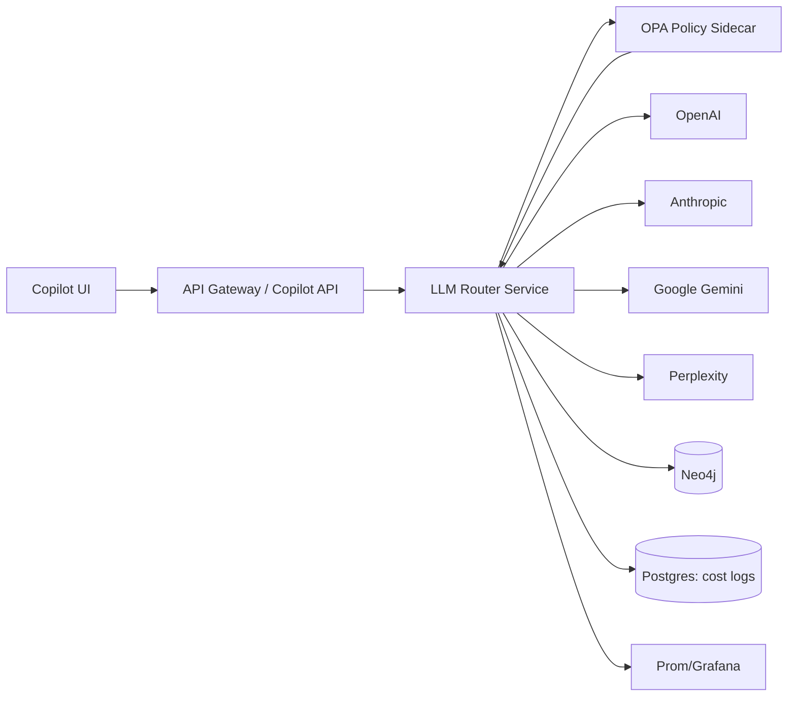

# IntelGraph Multi‑LLM Orchestration Pack v1

**Goal:** Build *native* multi‑LLM routing inside IntelGraph’s Copilot with OPA policy gates, Neo4j provenance, transparent UI telemetry, and cost/SLO guardrails — no external orchestrator required.

---

## 0) High‑level Architecture



**Principles:**
- **Policy‑first:** Pre/post OPA checks for classification, residency, citations, budgets.
- **Provenance‑by‑default:** Every call writes a `:Provenance` node linked to `:Investigation` and `:Model`.
- **Transparent UX:** Show provider/model, tokens, cost, latency + provenance link in Copilot.
- **Guardrails:** Budgets, SLOs, retries, DLQ, and caching.

---

## 1) Repo Layout & Feature Flags

```
server/
  src/
    services/
      llm-router.service.ts          # core route + execute
      providers/
        openai.adapter.ts
        anthropic.adapter.ts
        google.adapter.ts
        perplexity.adapter.ts
    utils/
      opa-client.ts
      provenance.ts
      cost-logger.ts
      tokens.ts
      timeout.ts
  policies/
    llm-routing.rego
  graphql/
    resolvers/
      copilot.ts                     # wires router into Copilot
infra/
  neo4j/
    2025-10-06_provenance.cql
  postgres/
    2025-10-06_llm_calls.sql
  grafana/
    copilot_dashboard.json           # optional panel seed
Makefile
```

**Flags/Env**
```
COPILOT_MULTI_LLM=true
OPA_URL=http://opa:8181
NEO4J_URI=bolt://neo4j:7687
NEO4J_USER=neo4j
NEO4J_PASSWORD=...
DATABASE_URL=postgres://...
OPENAI_API_KEY=...
ANTHROPIC_API_KEY=...
GOOGLE_API_KEY=...
PERPLEXITY_API_KEY=...
OPENAI_BUDGET_USD=200
ANTHROPIC_BUDGET_USD=120
GOOGLE_BUDGET_USD=50
PERPLEXITY_BUDGET_USD=50
```

---

## 2) LLM Router (TypeScript)

> **server/src/services/llm-router.service.ts**

```ts
// SPDX-License-Identifier: Apache-2.0
import crypto from "node:crypto";
import { opaEvaluate } from "../utils/opa-client";
import { writeProvenance } from "../utils/provenance";
import { CostLogger } from "../utils/cost-logger";
import { tokenEstimate } from "../utils/tokens";
import { withTimeout } from "../utils/timeout";
import * as OpenAI from "./providers/openai.adapter";
import * as Anthropic from "./providers/anthropic.adapter";
import * as Google from "./providers/google.adapter";
import * as Perplexity from "./providers/perplexity.adapter";

export type Provider = "openai" | "anthropic" | "google" | "perplexity";
export type Purpose = "search" | "synthesis" | "long_context" | "multimodal" | "default";

export interface LLMRequest {
  investigationId: string;
  userId: string;
  text: string;
  attachments?: Array<{ mime: string; bytesB64: string }>;
  requireCitations?: boolean;
  classification?: "U" | "C" | "S" | "TS";
}

export interface Route { provider: Provider; model: string; purpose: Purpose; reason: string; }

const BUDGET = {
  openai: Number(process.env.OPENAI_BUDGET_USD || 200),
  anthropic: Number(process.env.ANTHROPIC_BUDGET_USD || 120),
  google: Number(process.env.GOOGLE_BUDGET_USD || 50),
  perplexity: Number(process.env.PERPLEXITY_BUDGET_USD || 50)
};

function analyze(req: LLMRequest) {
  const tokens = tokenEstimate(req.text);
  const hasImages = (req.attachments?.length ?? 0) > 0;
  const needsCitations = !!req.requireCitations || /\b(cite|source|references|links?)\b/i.test(req.text);
  return { tokens, hasImages, needsCitations };
}

export function decide(req: LLMRequest): Route {
  const a = analyze(req);
  if (a.needsCitations) return { provider: "perplexity", model: "sonar-pro", purpose: "search", reason: "Grounded answer" };
  if (a.tokens > 80_000) return { provider: "anthropic", model: "claude-3-5-sonnet", purpose: "long_context", reason: "Ultra-long context" };
  if (a.hasImages) return { provider: "google", model: "gemini-1.5-pro", purpose: "multimodal", reason: "Image-aware" };
  const defaultModel = process.env.OPENAI_MODEL || "gpt-4o";
  return { provider: "openai", model: defaultModel, purpose: "synthesis", reason: "Default brain" };
}

async function budgetOk(provider: Provider) {
  // TODO: read MTD spend from Postgres; placeholder allows all
  return true;
}

export async function execute(req: LLMRequest) {
  const route = decide(req);

  // Pre‑call policy gate
  const pre = await opaEvaluate("intelgraph/llm/route", {
    classification: req.classification ?? "U",
    provider: route.provider,
    model: route.model,
    requiresCitations: !!req.requireCitations
  });
  if (!pre.allow) throw new Error(`OPA denied: ${pre.reason || "policy"}`);

  if (!(await budgetOk(route.provider))) throw new Error("Budget exceeded");

  const start = Date.now();
  const promptHash = crypto.createHash("sha256").update(req.text).digest("hex");

  let out: { text: string; tokensIn: number; tokensOut: number; costUsd: number; vendorMeta?: any };
  if (route.provider === "perplexity") out = await withTimeout(Perplexity.search(route.model, req.text), 60_000);
  else if (route.provider === "anthropic") out = await withTimeout(Anthropic.complete(route.model, req.text, req.attachments), 60_000);
  else if (route.provider === "google") out = await withTimeout(Google.generate(route.model, req.text, req.attachments), 60_000);
  else out = await withTimeout(OpenAI.complete(route.model, req.text, req.attachments), 60_000);

  const latencyMs = Date.now() - start;
  const provId = await writeProvenance({
    investigationId: req.investigationId,
    provider: route.provider,
    model: route.model,
    tokensIn: out.tokensIn,
    tokensOut: out.tokensOut,
    costUsd: out.costUsd,
    latencyMs,
    promptHash,
    routeReason: route.reason,
  });

  // Post‑call policy (e.g., require citations when purpose is search)
  const post = await opaEvaluate("intelgraph/llm/output", { purpose: route.purpose, citations: /https?:\/\//.test(out.text) });
  const text = post.allow ? out.text : "[REDACTED BY POLICY]";

  return { text, route, provId, tokensIn: out.tokensIn, tokensOut: out.tokensOut, costUsd: out.costUsd, latencyMs };
}
```

### Provider adapters (minimal)

> **server/src/services/providers/openai.adapter.ts**
```ts
import OpenAI from "openai";
const client = new OpenAI({ apiKey: process.env.OPENAI_API_KEY! });
export async function complete(model: string, prompt: string, _att?: any) {
  const r = await client.chat.completions.create({ model, messages: [{ role: "user", content: prompt }], temperature: 0.2 });
  const usage = r.usage ?? { prompt_tokens: 0, completion_tokens: 0 };
  const costUsd = (usage.prompt_tokens * 0.000005) + (usage.completion_tokens * 0.000015); // tune via env
  return { text: r.choices[0]?.message?.content ?? "", tokensIn: usage.prompt_tokens, tokensOut: usage.completion_tokens, costUsd, vendorMeta: { id: r.id } };
}
```

> **server/src/services/providers/anthropic.adapter.ts**
```ts
import Anthropic from "@anthropic-ai/sdk";
const client = new Anthropic({ apiKey: process.env.ANTHROPIC_API_KEY! });
export async function complete(model: string, prompt: string, _att?: any) {
  const r = await client.messages.create({ model, max_tokens: 2048, messages: [{ role: "user", content: prompt }] });
  // Token usage may require estimation; update when available
  return { text: (r.content[0] as any)?.text ?? "", tokensIn: 0, tokensOut: 0, costUsd: 0, vendorMeta: { id: (r as any).id } };
}
```

> **server/src/services/providers/google.adapter.ts**
```ts
import { GoogleGenerativeAI } from "@google/generative-ai";
const genai = new GoogleGenerativeAI(process.env.GOOGLE_API_KEY!);
export async function generate(model: string, prompt: string, _att?: any) {
  const m = genai.getGenerativeModel({ model });
  const r = await m.generateContent(prompt);
  return { text: r.response.text(), tokensIn: 0, tokensOut: 0, costUsd: 0, vendorMeta: {} };
}
```

> **server/src/services/providers/perplexity.adapter.ts**
```ts
export async function search(model: string, query: string) {
  const r = await fetch("https://api.perplexity.ai/chat/completions", {
    method: "POST",
    headers: { "Content-Type": "application/json", Authorization: `Bearer ${process.env.PERPLEXITY_API_KEY}` },
    body: JSON.stringify({ model, messages: [{ role: "user", content: query }] })
  });
  const j = await r.json();
  const usage = j.usage ?? { prompt_tokens: 0, completion_tokens: 0 };
  return { text: j.choices?.[0]?.message?.content ?? "", tokensIn: usage.prompt_tokens, tokensOut: usage.completion_tokens, costUsd: 0, vendorMeta: { id: j.id } };
}
```

---

## 3) OPA Policies (Rego)

> **server/policies/llm-routing.rego**
```rego
package intelgraph.llm.route

default allow = false
reason := ""

# TS must stay with US-resident providers (adjust per due diligence)
us_only["openai"]
us_only["anthropic"]

violation[msg] {
  input.classification == "TS"
  not us_only[input.provider]
  msg := "TS requires US-resident provider"
}

violation[msg] {
  input.requiresCitations == true
  input.provider != "perplexity"
  msg := "Citations requested; use grounded provider"
}

allow { count(violation) == 0 }
reason := concat(", ", violation) { count(violation) > 0 }
```

> **server/policies/llm-output.rego**
```rego
package intelgraph.llm.output

default allow = true

# For search purpose, require URLs present (very simple check — adapt)
allow = false {
  input.purpose == "search"
  input.citations == false
}
```

> **server/src/utils/opa-client.ts**
```ts
export async function opaEvaluate(path: string, input: unknown): Promise<{ allow: boolean; reason?: string }> {
  const url = `${process.env.OPA_URL ?? "http://opa:8181"}/v1/data/${path}`;
  const r = await fetch(url, { method: "POST", headers: { "Content-Type": "application/json" }, body: JSON.stringify({ input }) });
  const j = await r.json();
  return j.result ?? { allow: false, reason: "OPA unavailable" };
}
```

---

## 4) Provenance in Neo4j (Cypher)

> **infra/neo4j/2025-10-06_provenance.cql**
```cypher
CREATE CONSTRAINT prov_id IF NOT EXISTS FOR (p:Provenance) REQUIRE p.id IS UNIQUE;
CREATE CONSTRAINT model_key IF NOT EXISTS FOR (m:Model) REQUIRE (m.provider, m.name) IS NODE KEY;
CREATE CONSTRAINT inv_id IF NOT EXISTS FOR (i:Investigation) REQUIRE i.id IS UNIQUE;

// Seed common models
UNWIND [
  {provider:'openai', name:'gpt-4o'},
  {provider:'openai', name:'gpt-4o-mini'},
  {provider:'anthropic', name:'claude-3-5-sonnet'},
  {provider:'google', name:'gemini-1.5-pro'},
  {provider:'perplexity', name:'sonar-pro'}
] AS m
MERGE (:Model {provider:m.provider, name:m.name});
```

> **server/src/utils/provenance.ts**
```ts
import neo4j, { Driver } from "neo4j-driver";
let driver: Driver | null = null;
function n4j() {
  if (!driver) driver = neo4j.driver(process.env.NEO4J_URI!, neo4j.auth.basic(process.env.NEO4J_USER!, process.env.NEO4J_PASSWORD!));
  return driver;
}
export async function writeProvenance(p: { investigationId: string; provider: string; model: string; tokensIn: number; tokensOut: number; costUsd: number; latencyMs: number; promptHash: string; routeReason: string; }) {
  const s = n4j().session();
  try {
    const res = await s.executeWrite(tx => tx.run(`
      MATCH (i:Investigation {id:$investigationId})
      MERGE (m:Model {provider:$provider, name:$model})
      CREATE (p:Provenance {
        id: randomUUID(), at: datetime(), provider:$provider, model:$model,
        tokensIn:$tokensIn, tokensOut:$tokensOut, costUsd:$costUsd, latencyMs:$latencyMs,
        promptHash:$promptHash, routeReason:$routeReason
      })
      MERGE (i)-[:GENERATED_BY]->(p)
      MERGE (p)-[:USED_MODEL]->(m)
      RETURN p.id AS id
    `, p));
    return res.records[0].get("id") as string;
  } finally { await s.close(); }
}
```

**Dashboards (sample queries)**
```cypher
// Cost per investigation (30d)
MATCH (i:Investigation)-[:GENERATED_BY]->(p:Provenance)
WHERE p.at >= datetime() - duration('P30D')
RETURN i.id AS investigation, round(sum(p.costUsd),2) AS costUSD, count(*) AS calls
ORDER BY costUSD DESC;

// p95 latency by provider (7d)
MATCH (p:Provenance)
WHERE p.at >= datetime() - duration('P7D')
WITH p.provider AS provider, collect(p.latencyMs) AS l
RETURN provider, percentileCont(l,0.95) AS p95
ORDER BY p95 DESC;
```

---

## 5) Cost Logging (Postgres)

> **infra/postgres/2025-10-06_llm_calls.sql**
```sql
CREATE EXTENSION IF NOT EXISTS pgcrypto;
CREATE TABLE IF NOT EXISTS llm_calls (
  id UUID PRIMARY KEY DEFAULT gen_random_uuid(),
  investigation_id UUID NOT NULL,
  provider TEXT NOT NULL,
  model TEXT NOT NULL,
  tokens_in INT NOT NULL DEFAULT 0,
  tokens_out INT NOT NULL DEFAULT 0,
  cost_usd NUMERIC(12,6) NOT NULL DEFAULT 0,
  latency_ms INT NOT NULL DEFAULT 0,
  prompt_hash TEXT NOT NULL,
  created_at TIMESTAMPTZ NOT NULL DEFAULT now()
);
CREATE INDEX IF NOT EXISTS idx_llm_calls_inv ON llm_calls(investigation_id);
CREATE INDEX IF NOT EXISTS idx_llm_calls_created ON llm_calls(created_at);
```

> **server/src/utils/cost-logger.ts**
```ts
import { Pool } from "pg";
const pool = new Pool({ connectionString: process.env.DATABASE_URL });
export class CostLogger {
  estimate(_prov: string, _model: string, inTok: number, outTok: number) {
    const k = 1000; return +(((inTok+outTok)/k) * 0.002).toFixed(6); // tune per provider
  }
  async log(e: { investigationId: string; provider: string; model: string; tokensIn: number; tokensOut: number; costUsd: number; latencyMs: number; promptHash: string; }) {
    await pool.query(
      `INSERT INTO llm_calls (investigation_id, provider, model, tokens_in, tokens_out, cost_usd, latency_ms, prompt_hash)
       VALUES ($1,$2,$3,$4,$5,$6,$7,$8)`,
      [e.investigationId, e.provider, e.model, e.tokensIn, e.tokensOut, e.costUsd, e.latencyMs, e.promptHash]
    );
  }
}
```

---

## 6) Copilot Integration (GraphQL resolver)

> **server/graphql/resolvers/copilot.ts**
```ts
import { execute as llmExecute } from "../../src/services/llm-router.service";
export const CopilotResolvers = {
  Mutation: {
    async copilotExecute(_: any, { input }: any, ctx: any) {
      const res = await llmExecute({
        investigationId: input.investigationId,
        userId: ctx.user.id,
        text: input.prompt,
        requireCitations: !!input.requireCitations,
        classification: input.classification ?? "U",
      });
      return {
        text: res.text,
        meta: {
          provider: res.route.provider,
          model: res.route.model,
          costUsd: res.costUsd,
          tokensIn: res.tokensIn,
          tokensOut: res.tokensOut,
          latencyMs: res.latencyMs,
          provenanceId: res.provId,
        }
      };
    }
  }
};
```

---

## 7) UI Badge (pattern)

> Show a chip under each Copilot reply:

```
Answered by openai/gpt‑4o · 1.3K tok · $0.032 · 2100 ms  [View provenance]
```

Click opens a provenance drawer anchored on the `Provenance` node.

---

## 8) Makefile targets

```Makefile
router-test: ## unit tests for router
	npm run test -- llm-router

migrate-db: ## postgres migration
	psql $$DATABASE_URL -f infra/postgres/2025-10-06_llm_calls.sql

seed-neo4j: ## seed model catalog / constraints
	cypher-shell -f infra/neo4j/2025-10-06_provenance.cql
```

---

## 9) SLOs, Budgets, and Alerts

- **SLO:** Copilot end‑to‑end p95 < **8s**; error rate < **1%** (excl. policy denials).
- **Budgets (env):** provider MTD caps; warn at 80%, hard stop at 100% (429 with friendly message & fallback).
- **Retries:** 429/5xx backoff (250ms → 500ms → 1s; max 3). DLQ topic for hard failures.
- **Caching:** Redis 10‑minute cache for identical search prompts to reduce Perplexity spend.

---

## 10) Two‑Week Sprint Backlog (DoD‑friendly)

**Goal:** Ship to *staging* with feature flag, provenance receipts, and dashboards; pilot with 3 analysts.

**Week 1**
1. Router + adapters (OpenAI/Anthropic/Google/Perplexity); unit tests for `decide()`.
2. OPA route/output policies + CI conftest (deny matrix tests).
3. Provenance writes to Neo4j + constraints; seed model catalog.
4. Cost logger + Postgres migration; simple rollup query.

**Week 2**
5. GraphQL resolver wiring + feature flag toggle.
6. UI chip + provenance drawer; Storybook + e2e happy path.
7. Prom/Grafana panels: latency, cost, denials; alerts at SLO breach.
8. Canary rollout 10% → 50% → 100% with rollback (`COPILOT_MULTI_LLM=false`).

**Exit Criteria:**
- ≥95% of Copilot calls have a provenance node.
- p95 < 8s in staging synthetic.
- Median cost per daily brief ≤ **$2.50**.
- 3 analysts confirm usefulness (≥4/5).

---

## 11) Acceptance Tests

- **Citations path:** Prompt with “cite sources” → routes to Perplexity; output contains URLs; policy allows.
- **Long‑context path:** 100k‑token paste → routes to Claude Sonnet; provenance shows tokens & latency.
- **TS policy:** classification `TS` routed to US‑resident providers; non‑compliant route denied.
- **Fallback:** Provider 5xx → fallback to `gpt‑4o‑mini`; provenance notes fallback.

---

## 12) Rollback & Safety

- Flip `COPILOT_MULTI_LLM=false` to disable routing; single‑provider path resumes.
- `OPA_ENFORCE=false` to fail‑open for *U* classification only; *TS* remains fail‑closed.
- Keys rotated monthly; adapters read from secret store; zero keys in logs.

---

## 13) Next Steps (pick one)

- **FASTEST:** Wire resolver + router, enable in staging today; gather analyst feedback.
- **BEST:** Keep this plan; ship full 2‑week sprint with dashboards & provenance drawer.
- **CHEAPEST:** Default to `gpt‑4o‑mini` with Perplexity only for citations; enable budgets & caching first.

