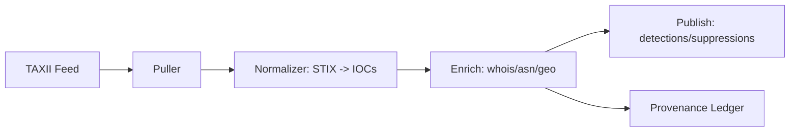

[MODE: WHITE+BLUE]

# DIRK IG — Counter‑Threat & Intelligence Director (Next Sprint)
**Workstream:** Counter‑Threat, Intel, Provable Compliance, Detections  • **Cadence:** Q4‑2025 (Oct–Dec)  
**Sprint Window:** **2025‑10‑30 → 2025‑11‑13**  • **Owner:** Directorate K++ (DIRK IG)  • **Ordinal:** **03**

---

## A) Executive Summary (Decisions & Next Steps)
- **Productionize & Scale:** graduate strict release‑gate and Detection Pack v2 from canary to **full production** with **blast‑radius controls** and **auto‑rollback**.
- **Intel Ingestion → Action:** stand up a minimal **Threat Intel Ingestion & Enrichment** path (STIX/TAXII → normalized indicators → policy/detection updates) with proof‑carrying provenance.
- **Privacy‑by‑Design controls:** add **Retention/Lawful Basis** OPA policies and audit fields to the Logging Contract; ship **Privacy Incident** playbook.
- **Reliability of Security (Sec‑SRE):** add SLO burn alerts for gate availability and alert pipeline latency; drill **tabletop + chaos** for alert storm and evidence store outage.

---

## B) Findings & Rationale (carry‑forward → scale)
- Strict gate works in canary; need **global rollout guardrails** and override analytics.  
- Detections expanded, but **intel‑driven updates** and **suppression expiry hygiene** are manual.  
- Logging Contract lacks **retention, lawful basis, and PII hinting** fields required for audit and minimization.  
- Dashboards exist; SLOs require **burn‑rate alerts** and **error‑budget** tracking.  
- No codified **tabletop/chaos** to verify durability.

**So‑What:** We reduce residual risk by making security features reliable at scale, legally auditable, and responsive to external intel with minimal operator toil.

---

## C) Goals & Deliverables
- **G1. Prod Rollout Guardrails**: staged expansion (25%→50%→100%), automated rollback, override analytics.
- **G2. Intel Ingestion (v0)**: TAXII pull, indicator normalization, enrichment (whois/asn/geo), push to detections/suppressions with provenance.
- **G3. Privacy Controls**: OPA **Retention & Lawful Basis** policies + enforcement hooks; Logging Contract v1.1.
- **G4. Sec‑SRE SLOs**: burn alerts for gate availability and alert latency; on‑call runbook updates.
- **G5. Resilience Drills**: tabletop kit + chaos scripts for alert storm and evidence store outage.

---

## D) Sprint Plan (2025‑10‑30 → 2025‑11‑13)
**Milestones**
- **11‑01:** Rollout controller + auto‑rollback merged; gate at 25% of services.
- **11‑04:** Intel pipeline v0 (pull → normalize → enrich → publish) in staging; provenance logged.
- **11‑07:** Logging Contract v1.1 + Privacy policies wired; SLO burn alerts in staging.
- **11‑10:** Tabletop + chaos drills executed; action items logged; gate at 100% with fallback.
- **11‑13:** Prod sign‑off (DoD‑V3) + evidence bundles archived.

**Backlog → Ready**: rollout controller; intel normalizer; enrichment adapters; OPA privacy policies; SLO rules; chaos scripts; tabletop pack.

---

## E) Artifacts (ready to commit)
### 1) Rollout Controller (pseudo‑config)
```yaml
rollout:
  policy: release-gate
  stages:
    - percent: 25
      halt_on: [deny_rate>1%, gate_latency_p95>2s]
    - percent: 50
      halt_on: [deny_rate>1%, evidence_missing>0.5%]
    - percent: 100
  rollback:
    trigger: any(halt_on)
    action: set_policy_mode: "advisory"
    notify: secops_channel
```

### 2) Intel Ingestion v0
**Pipeline sketch**


**Normalizer (YAML mapping) — STIX → IOC**
```yaml
map:
  ipv4-addr: ip
  domain-name: domain
  url: url
  file: { hash: sha256 }
metadata:
  source: ${FEED_NAME}
  first_seen: ${NOW}
  tlp: AMBER
```

**Enrichment output (example)**
```json
{
  "indicator": {"type":"ip","value":"198.51.100.42"},
  "asn": 64512,
  "org": "ExampleNet",
  "geo": {"country":"US"},
  "risk_score": 78,
  "source":"feed-x",
  "evidence_uri":"s3://intel/evidence/198.51.100.42.json"
}
```

**Publication rules (pseudo)**
```yaml
publish:
  to:
    - detections:add_ioc_list: intel.bad_ips
    - suppressions:add_false_positive_list: intel.fp_domains
  provenance: required
```

### 3) Privacy OPA Policies
**Retention (dataset‑level)**
```rego
package policy.privacy.retention

default allow_access = false

# input: { dataset:{name, category, retention_days}, request:{purpose, actor, now} }

valid_purpose {
  input.request.purpose == "contract" or input.request.purpose == "security"
}

within_retention {
  now := time.parse_rfc3339_ns(input.request.now)
  cutoff := now - input.dataset.retention_days * 24 * 60 * 60 * 1e9
  # assume dataset has field last_updated_ns
  input.dataset.last_updated_ns >= cutoff
}

allow_access {
  valid_purpose
  within_retention
}
```

**Lawful Basis (request‑time)**
```rego
package policy.privacy.basis

default allow = false

# input: { basis: "contract|consent|legitimate_interest|legal_obligation", actor:{role}, purpose }

allow {
  input.basis == "legal_obligation"
}
allow {
  input.basis == "contract"; input.purpose == "service_delivery"
}
allow {
  input.basis == "legitimate_interest"; input.purpose == "security"; input.actor.role != "marketing"
}
```

### 4) Logging Contract v1.1 (delta)
```json
{
  "properties": {
    "retention_days": {"type":"integer","minimum":0},
    "lawful_basis": {"type":"string","enum":["contract","consent","legitimate_interest","legal_obligation"],"nullable":true},
    "pii_hint": {"type":"string","enum":["none","low","medium","high"],"default":"none"}
  },
  "required_delta": ["retention_days"]
}
```

### 5) SLO Burn Alerts (PromQL examples)
```promql
# Release gate availability (error budget 99.9%)
1 - (sum(rate(gate_errors_total[5m])) / sum(rate(gate_requests_total[5m])))

# Burn rate (multi‑window, multi‑burn)
max(
  (sum(rate(gate_errors_total[5m])) / sum(rate(gate_requests_total[5m]))) / (1 - 0.999),
  (sum(rate(gate_errors_total[1h])) / sum(rate(gate_requests_total[1h]))) / (1 - 0.999)
) > 1
```

### 6) Chaos & Tabletop
**Chaos (scripts outline)**
```bash
# Simulate evidence store outage
aws s3 put-bucket-policy --bucket $EVIDENCE --policy file://deny-policy.json
# Generate alert storm
for i in {1..500}; do curl -sS $ALERT_ENDPOINT -d '{"level":"high","event":"test"}'& done
```

**Tabletop Pack (checklist)**
- Scenario injects; roles (IM, SecDuty, Release); decision logs; timing; comms templates; success criteria; after‑action template.

### 7) Detections (additions)
**J. Intel‑Matched Traffic (IntelGraph)**
```yaml
title: Outbound to Known Malicious IP
id: j7b6c5d4-e3f2-4a1b-9c8d-7e6f5a4b3c2d
logsource: { product: net, service: intelgraph }
detection:
  sel1: event: "egress"
  sel2: dest_ip: ${list:intel.bad_ips}
  condition: sel1 and sel2
level: high
tags: [threat_intel, attack.command_and_control]
```

**K. Privacy Basis Missing**
```yaml
title: Access Without Lawful Basis
id: k1l2m3n4-o5p6-q7r8-s9t0-u1v2w3x4y5z
logsource: { product: app, service: switchboard }
detection:
  sel1: event: "render_widget"
  sel2: lawful_basis: null
  condition: sel1 and sel2
level: medium
tags: [privacy, governance]
```

### 8) Runbooks (delta)
- **RB‑06: Evidence Store Outage** — switch gate to advisory; cache evidence locally; open Sev‑1; restore bucket policy; backfill bundles; post‑mortem.
- **RB‑07: Privacy Incident** — contain (token revoke), identify data class & lawful basis, notify DPO, preserve evidence, regulatory timer start, customer comms template.

### 9) Governance & Compliance (delta)
- **NIST 800‑53:** AU‑11 (retention), AC‑6, SI‑4, IR‑4, CP‑10.  
- **ISO 27001:** A.5.14, A.5.34, A.8.2, A.12.1.  
- **SOC 2:** CC3.2, CC6.7, CC7.2, CC7.3, CC8.1.

---

## F) SLAs, SLOs & Metrics
- **Gate availability:** ≥ 99.9%; **Alert pipeline p95 latency:** ≤ 30s; **Intel ingestion to publish:** ≤ 15m.  
- **FP rate (post‑suppression):** ≤ 4% by 11‑10; **Break‑glass uses:** zero normal weeks; 100% with ticket + retrospective.  
- **Privacy logging coverage:** 100% events with `retention_days` and `lawful_basis` fields.

---

## G) Proof‑Carrying Analysis (PCA)
**Assumptions:** TAXII feed access approved; Prometheus/Grafana available; S3 or equivalent evidence store; IAM to simulate outages.  
**Evidence:** rollout metrics, OPA test outputs, intel provenance logs, SLO alert firings, tabletop minutes, chaos experiment results.  
**Caveats:** Intel quality varies; use scoring + TLP handling. Chaos must respect change windows.  
**Verification:** canary → staged → full; two‑window burn‑rate alerting; post‑drill action items committed.

---

## H) Definition of Done — V3
- Gate fully rolled out with guardrails + automated rollback.
- Intel ingestion v0 live; indicators feeding detections with provenance.
- Privacy OPA + logging v1.1 enforced; privacy runbook live.
- SLO burn alerts active; chaos/tabletop executed; actions tracked.

---

## I) Delivery Checklist
- [ ] Rollout controller merged; auto‑rollback verified
- [ ] Intel pipeline v0 running; provenance recorded
- [ ] Logging Contract v1.1 fields emitted in services
- [ ] Privacy OPA policies enforced + tests
- [ ] SLO alerts deployed; paging validated
- [ ] Chaos + tabletop completed; lessons captured
- [ ] DoD‑V3 sign‑off; evidence archived & hashed

---

*Prepared by DIRK IG (Directorate K++). Auditable, production‑ready scale‑up for Q4 cadence.*

