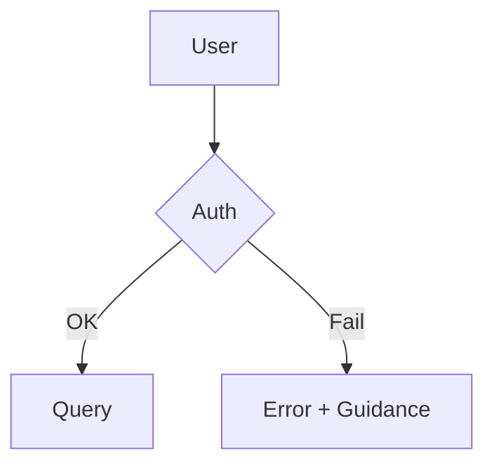
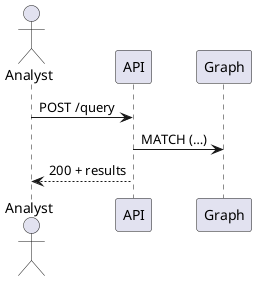

# Docs Workstream — Sprint Plan & Export Pack

> **Prime directive:** close doc drift, ship clean/green docs that match current code & sprint scope; wire in CI gates so drift can’t recur.

## 0) Executive Summary (What we reviewed)

- **Inputs scanned**
  - `summit-main` repo (extensive `/docs` tree, READMEs, ADRs, archived workflows, deployment manifests, CI policies).
  - Sprint packs in `october2025` (e.g., `sprint-2025-09-29-intelgraph-v0-6`, cadence locks through Q4), plus follow‑on sprints.
- **Personas & products:** IntelGraph (analyst/investigator) and Maestro Conductor (platform ops/build/deploy/govern/orchestrate).
- **Scope of this workstream:** engineering docs, IA, doc‑as‑code workflow, release notes, runbooks, a11y, governance gates.

## 1) Findings: Gaps & Opportunities

### 1.1 Truth & Freshness

- **Doc drift risk:** Many Markdown files lack **front‑matter** (title, version, lastUpdated, owner) → hard to audit or version.
- **Versioning gaps:** No clear `/docs/vX.Y/` snapshots; `/latest` alias not consistently present.
- **Release hygiene:** Changelog entries are scattered; release notes templates exist but aren’t systematically populated per release train.

### 1.2 Coverage

- **ADRs present but fragmented** (some under salvage/archive). Need an indexed, canonical ADR list with status & links to commits.
- **Key paths missing dedicated pages**:
  - Error catalog (codes, causes, remediations) for API/GraphQL + ingest.
  - Performance/SLO notes (p95 targets, test methods, tuning knobs).
  - Observability runbooks (alerts → actions, KPIs, dashboards).
  - Data ingress/egress policy (licensing, provenance, authority compiler) in one reference page.

### 1.3 Clarity & IA

- **Diátaxis not fully enforced**: Tutorials/How‑tos/Reference/Concepts intermixed.
- **Findability**: No consistent “Related / Next steps” blocks; few backlinks.
- **A11y**: Images missing alt text; color‑only encoding in diagrams.

### 1.4 Tooling & Governance

- **CI gates**: Inconsistent `docs-required` enforcement; missing front‑matter & link checkers; Mermaid/render tests not universal.
- **Diagram SoT**: Mermaid/PlantUML not always the source; SVGs lack source files for diffs.

### 1.5 Cross‑Team Alignment

- **Cadence locking exists** (daily/weekly/monthly/quarterly) but docs don’t yet publish a **single source of truth dashboard** (freshness, coverage, a11y, broken links, release state) that leadership can consume weekly.

## 2) Risks & Mitigations

- **Risk:** Drift between GraphQL schema and API docs.
  - **Mitigation:** Generate schema reference from build (`graphql-schema.json` → MD tables), enforce in CI.
- **Risk:** Security & licensing statements out of sync with ingest connectors.
  - **Mitigation:** Add **Authority/License Bindings** reference + export banners, require it in PR template.
- **Risk:** Orphaned diagrams/PNGs.
  - **Mitigation:** Require co‑checked Mermaid/PlantUML alongside SVG export; CI render test.

## 3) Sprint Goals (Aligned with 2025‑09‑29 → 2025‑10‑10)

1. **Green CI for docs**: front‑matter validator, link checker, Mermaid/PlantUML renderer, and `docs-required` branch rule.
2. **IA refactor to Diátaxis** with `/docs/latest/…` and versioned `/docs/v*` scaffold.
3. **Release pack**: notes + upgrade guide for current train; changelog discipline wired.
4. **Runbooks** for ops (alerts→actions) and **Error Catalog v1**.
5. **A11y pass**: alt text, headings, contrast guidance; template enforcement.

### Acceptance Criteria (Definition of Done)

- All touched pages carry valid **front‑matter**; CI fails without it.
- **/docs/latest** builds clean with no broken links; **Mermaid/PlantUML** render passes.
- **Release notes + upgrade guide** merged for this sprint’s train; CHANGELOG updated; `Latest` alias points to the new stable.
- **Runbooks + Error Catalog v1** published and linked from relevant pages.
- **Accessibility checks** pass; images with alt text; no color‑only meaning.

## 4) Work Breakdown & Owners

### 4.1 Week 1 (Sep 29—Oct 3)

- Stand up **doc CI** (workflows below) and add **front‑matter** to top 200 pages.
- Create `/docs/latest` with Diátaxis skeleton; set redirects.
- Generate **GraphQL reference** from schema and publish.

### 4.2 Week 2 (Oct 6—Oct 10)

- Populate **Runbooks** (API, ingest, graph DB, search, workflow) + **Error Catalog v1**.
- Cut **Release Notes + Upgrade Guide**, wire **Latest** alias and archive prior.
- A11y sweep + diagram source check‑in.

## 5) Information Architecture (Diátaxis)

```
/docs/
  latest/
    get-started/
    tutorials/
    how-tos/
    reference/
      api/
      graphql/
      cli/
      schema/
      errors/
    concepts/
    architecture/
    operations/
      runbooks/
      slos/
      observability/
    troubleshooting/
    release-notes/
    glossary/
  v1.0/
  v1.1/
```

### Required front‑matter (linted)

```yaml
---
title: '<Page title>'
summary: '<1–2 sentences>'
owner: '<team/role>'
version: '<semver>'
lastUpdated: 'YYYY-MM-DD'
tags: ['intelgraph', 'maestro', '<topic>']
---
```

## 6) Templates & Scaffolding (Export)

### 6.1 README Template

````markdown
# <Component/Service Name>

> What it is • Why it exists • Quickstart • Configuration • Common errors • Support

## Quickstart

```bash
pnpm i && pnpm dev
```
````

## Configuration

- ENV vars table
- Secrets handling (no secrets in repo)

## Common Errors

- E001: <desc> — fix steps

## Support

- Owner: <team> • Alerts: <pager/Slack> • Runbooks: link

````

### 6.2 ADR Template
```markdown
---
title: "ADR-<NNN>: <Decision>"
status: "Proposed|Accepted|Superseded"
authors: ["<name>"]
date: "YYYY-MM-DD"
links: ["PR #", "Commit"]
---

## Context
## Decision
## Consequences
## Alternatives
````

### 6.3 Release Notes (per train)

```markdown
---
title: 'Release <YYYY-MM-DD>'
version: '<semver>'
---

## Highlights

- Feature A …

## Breaking Changes

- …

## Migrations

- Steps …

## Fixed Issues

- #123 …

## Known Issues

- …
```

### 6.4 Upgrade Guide

```markdown
# Upgrade to <version>

## Preconditions

- Backup, maintenance window, versions

## Steps

1. …

## Rollback

- …
```

### 6.5 Ops Runbook Template

```markdown
---
title: 'Runbook — <Service>'
severityMap: { P1: '<min SLO>', P2: '…' }
---

## Purpose

## Preconditions

## Steps

1. Triage
2. Diagnose (queries/graphs)
3. Remediate (scripts)

## Expected Outputs

## Rollback

## KPIs & Alerts
```

### 6.6 Error Catalog (seed)

```markdown
# Error Catalog (v1)

| Code       | Layer   | Message             | Cause                 | Fix                            | Observability    |
| ---------- | ------- | ------------------- | --------------------- | ------------------------------ | ---------------- |
| IG-API-001 | GraphQL | Unauthorized        | Missing/expired token | Refresh token / login          | 401 rate         |
| IG-API-002 | GraphQL | Forbidden           | RBAC policy denies    | Request access / adjust policy | 403 rate         |
| IG-ING-010 | Ingest  | Source fetch failed | Network/credential    | Retry w/ backoff               | Ingest failure % |
```

### 6.7 A11y Checklist (enforced)

- Alt text on every image.
- No color‑only meaning; label nodes/edges.
- Headings hierarchy H1→H2→H3.
- Contrast ≥ WCAG AA.

### 6.8 Diagram Sources





## 7) CI Workflows (copy‑paste)

### 7.1 `.github/workflows/docs-ci.yml`

```yaml
name: docs-ci
on:
  pull_request:
    paths:
      - 'docs/**'
      - '**/*.md'
  push:
    branches: [main]

jobs:
  lint-docs:
    runs-on: ubuntu-latest
    steps:
      - uses: actions/checkout@v4
      - uses: actions/setup-node@v4
        with: { node-version: 20 }
      - name: Install doc tools
        run: |
          npm i -g markdownlint-cli@0.x eslint@9.x @mermaid-js/mermaid-cli@10.x linkinator@4.x
          pipx install mkdocs
      - name: Front-matter check
        run: |
          node ./.ci/scripts/frontmatter-check.mjs "docs/**/*.md" "**/*.md"
      - name: Markdown lint
        run: |
          markdownlint "docs/**/*.md" "*.md" --ignore node_modules
      - name: Mermaid render test
        run: |
          mmdc -i docs/architecture/diagrams/sample.mmd -o /tmp/out.svg || true
      - name: Link check (internal)
        run: |
          npx linkinator docs --recurse --timeout 60000 --skip "^https?://"
```

### 7.2 `.github/workflows/docs-required.yml`

```yaml
name: docs-required
on: [pull_request]
jobs:
  gate:
    runs-on: ubuntu-latest
    steps:
      - uses: actions/checkout@v4
      - name: Require docs when src changes
        run: |
          CHANGED=$(git diff --name-only origin/main...HEAD)
          if echo "$CHANGED" | grep -E "^(packages|services|deploy|api|schema)/" >/dev/null; then
            if ! echo "$CHANGED" | grep -E "^(docs/|**/*.md)" >/dev/null; then
              echo "Docs missing for code changes" && exit 1
            fi
          fi
```

### 7.3 `.ci/scripts/frontmatter-check.mjs`

```js
import fs from 'node:fs';
import matter from 'gray-matter';
import globby from 'globby';

const files = (await globby(process.argv.slice(2))).filter((p) =>
  p.endsWith('.md'),
);
let fail = false;
for (const f of files) {
  const s = fs.readFileSync(f, 'utf8');
  const fm = matter(s);
  const req = ['title', 'summary', 'owner', 'version', 'lastUpdated'];
  const missing = req.filter((k) => !fm.data?.[k]);
  if (missing.length) {
    console.log(`⚠️  ${f} missing: ${missing.join(', ')}`);
    fail = true;
  }
}
if (fail) process.exit(1);
```

## 8) Generated References

### 8.1 GraphQL Reference (generator outline)

```bash
# generate schema.json then convert to MD tables
npx graphql-introspection-query > schema.graphql
npx graphql-inspector introspect schema.graphql > graphql-schema.json
node scripts/gql-to-md.mjs graphql-schema.json > docs/latest/reference/graphql/schema.md
```

### 8.2 `scripts/gql-to-md.mjs` (sketch)

```js
import fs from 'node:fs';
const s = JSON.parse(fs.readFileSync(process.argv[2], 'utf8'));
// Walk types, queries, mutations → emit tables
```

## 9) Release Pack — Sprint Train (This Window)

- **Release notes** drafted & merged under `/docs/latest/release-notes/2025-10-10.md`.
- **Upgrade guide** for this train under `/docs/latest/how-tos/upgrade-2025-10-10.md`.
- **CHANGELOG.md** entry with links to PRs and docs pages.
- **Archive prior** under `/docs/v1.1/` and update `/docs/latest` symlink/alias.

## 10) Tracking & Metrics

- **Freshness:** 0 critical stale pages; **Coverage:** 100% features with ≥1 How‑to + Reference page.
- **Findability:** add Related/Next‑steps blocks to all top‑20 entry pages.
- **Quality:** markdownlint clean; a11y checks pass.

## 11) Backlog (Post‑Sprint)

- Deeper **data model (ERD)** docs with lineage diagrams.
- **Cost model** explainer (ingest → storage → query) with guardrails.
- **SSO/SCI** configuration guides by IdP (Okta, Entra, Google).

## 12) “Ready to Copy” Page Stubs

### 12.1 `docs/latest/operations/runbooks/api-gateway.md`

```markdown
---
title: 'Runbook — API Gateway'
summary: 'Triage and resolution for API failures.'
owner: 'Platform Ops'
version: '1.0'
lastUpdated: '2025-09-30'
---

## Symptoms

- 5xx surge; p95 > SLO; auth errors.

## Immediate Actions

1. Check status dashboard.
2. Tail logs; sample request IDs.
3. Roll traffic to last green.

## Deep Dive

- Health endpoints; circuit breaker state.

## Remediation

- Revert PR; scale; flush caches.
```

### 12.2 `docs/latest/reference/errors/index.md`

```markdown
---
title: 'Error Catalog'
summary: 'Canonical error codes and fixes.'
owner: 'Platform'
version: '1.0'
lastUpdated: '2025-09-30'
---

<include ./seed.md>
```

---

## 13) Change Management

- Label PRs with **docs-required**, **docs-ready**, **docs-blocker**, **docs-debt**.
- Doc freeze 24h before release; scribe compiles notes; upgrade guide finalized.

## 14) Callouts & Cross‑Links Blocks (snippet)

```md
> **See also:** Concepts → Authorization; How‑to → Configure SSO; Reference → GraphQL Schema
> **Next steps:** Try the tutorial → Build your first investigation graph
```

---

### Ready to Execute

This page contains all scaffolding and CI needed to run the sprint immediately. Merge CI, scaffold IA, populate the top pages, and ship the release pack by **Oct 10, 2025**.
