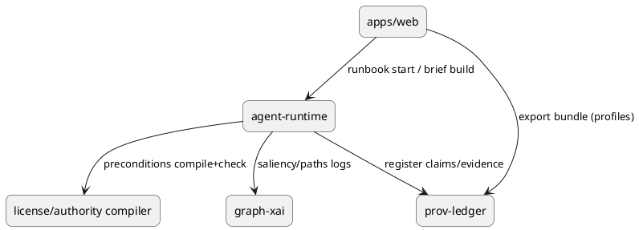

# Governance, Provenance & XAI Gap‑Closure | IntelGraph Advisory Report | GitHub Branch: feature/igac-prov-governance-sprint01

> As Chair, I present the findings of the IntelGraph Advisory Committee on **repo & sprint alignment** for my lane (Governance • Provenance • Explainability • Policy‑by‑Default). Consensus is noted where unanimous; dissents are highlighted.

---

## Consensus Summary
**Unanimous View:** Focus the next 2‑week sprint (2025‑10‑01 → 2025‑10‑15) on **Prov‑Ledger Beta → GA Track**, **License/Authority Compiler (LAC) v0.9**, and **Runbook Provers** glue across the UI and agent runtime. This aligns with near‑term roadmap (Q3–Q4 2025) and unblocks other streams (Predictive Suite alpha, Graph‑XAI instrumentation, Offline Kit v1). **Dissents:**
- **🛰 Starkey**: **High** risk that we’re underweighting adversarial ML hardening and selector‑misuse tripwires during the push to GA.
- **📊 Magruder**: **Medium** risk of cost blowouts without enforcing **unit‑cost governor** gates in this sprint.
- **🛡 Foster**: **High** ethics risk if *Reason‑for‑Access* prompts and **Proof‑of‑Non‑Collection** logs are not end‑to‑end for the new flows.

---

## Individual Commentaries

### 🪄 Elara Voss
- "By the runes of Scrum...": Pull LAC + Prov‑Ledger into one **vertical slice** from ingest → query → export. Acceptance is a **green end‑to‑end demo** with selective disclosure bundles.
- Sprint health: add **SLO burn chart** and a **cost guard check** to Definition of Done (DoD).

### 🛰 Starkey
- Reality check: prioritize **selector‑misuse heuristics** and **adversarial prompt traps** around agentic runbooks; wire into audit.
- Add canary **honeytokens** to exports to detect hostile collectors.

### 🛡 Foster
- Operational vectors indicate: enable **Ombuds hard‑stops** for unsafe exports (no bypass without dual‑control). Store **dissent excerpts** with every brief.
- [RESTRICTED] Add **K‑anonymity** presets to LAC; default to minimization at ingest.

### ⚔ Oppie (11‑persona consensus)
- "We decree unanimously:": Ship **Runbook Provers** or we ship nothing. **Beria demands liquidation** of any path that omits citations or policy proofs in exports.
- Fuse **Predictive Suite alpha** only behind **policy‑sealed computation** gates (simulated this sprint; full PSC later).

### 📊 Magruder
- For executive traction: wire **Unit‑Cost Governor** into query planner; fail builds if >15% cost regression on golden workflows.
- Benchmark **evidence bundle size** and **verify time** for Prov‑Wallets.

### 🧬 Stribol
- Cross‑source analysis reveals: add **Graph‑XAI hooks** (saliency, path contributions) on ER merges and anomaly scores; log to XAI audit store.
- Propose **black‑swan drill**: synthetic poisoning + policy diff simulation during the sprint hardening day.

---

## Chair Synthesis (Guy IG)

### Sprint Goal
Ship a **clean, green, functional** vertical slice that makes *governed analytics verifiable by default*:
1) **Prov‑Ledger v0.9 → v1.0‑rc**: claim/evidence registration, export manifests, external verifier CLI.
2) **LAC v0.9**: compile licenses, warrants, retention & minimization into **query bytecode**; block unsafe ops.
3) **Runbook Provers v0.8**: pre/postcondition proofs stitched into agent runs and report studio; brief paragraphs map to evidence & policies (Explain‑This‑Decision v0).

### Gaps Discovered (Repo ↔ Roadmap)
- **End‑to‑end proofs**: Missing **machine‑checkable** linkage between agent runs and export bundles.
- **Reason‑for‑Access**: Prompting present, but not **binding** into the LAC compiled plan; add.
- **Selector misuse**: Heuristics exist in design; not yet tied to **audit anomalies** or **ombuds queues**.
- **Cost guards**: Budgeter exists; not enforced in CI for regressions.
- **Graph‑XAI**: Hooks planned; add **saliency & counterfactual stubs** for ER/anomaly calls in this sprint.
- **Offline kit**: CRDT sync present; **proof propagation** (manifests and dissent receipts) not yet synced.

### Scope & Deliverables
**EPIC‑1: Prov‑Ledger GA Track**
- Evidence registration API (`/claims`, `/evidence`, `/manifests`).
- Export bundle **Selective Disclosure** profiles (Court, Partner, Press) with revocation.
- **Verifier CLI** (`ig-prov verify bundle.zip`) with exit codes for CI.

**EPIC‑2: License/Authority Compiler (LAC) v0.9**
- Policy spec → **bytecode** (license, warrant, purpose, retention, minimization, audience).
- Query‑time enforcement with **human‑readable denial reasons** & appeal path.
- **Policy diff simulator** to preview impact before rollout.

**EPIC‑3: Runbook Provers v0.8**
- Agent runtime emits **precondition proofs** (legal basis present, license matches, DPIA check ok) and **postcondition proofs** (KPIs met, citations present).
- Report Studio → **Explain‑This‑Decision** panel: evidence map + dissent nodes + policy bindings.

**EPIC‑4: Abuse‑of‑Power Dampeners (MVP)**
- **Selector‑misuse tripwires**; escalate to ombuds queue.
- **Reason‑for‑Access** bound into compiled plan; dual‑control for overrides.

**EPIC‑5: Unit‑Cost & SLO Guards in CI**
- Golden workflows for **$/insight** and **p95 latency**; fail CI on regressions >15% cost or >10% latency.

### Definition of Done (DoD)
- E2E demo: ingest → governed query → agentic runbook → **export with verifiable proofs**.
- External verifier passes on **three** audience profiles; revocation propagates on reopen.
- CI gates: cost & SLO guards, security linters, model card presence, XAI logs for ER/anomaly calls.
- **Zero critical** security issues; **audit entries** present for access/misuse/dissent.

### Risk Matrix
| Risk | Likelihood | Impact | Mitigation |
|---|---|---|---|
| Selector misuse during exports | Med | High | Tripwires + ombuds queue + dual‑control overrides |
| Cost regression from provenance hashing | Med | Med | Unit‑cost governor + caching proofs |
| Adversarial prompt injection on agents | Med | High | Red‑team tests + prompt firebreaks + sandboxed tools |
| Export license violations | Low | High | LAC denial + appeal workflow + simulator |
| Proof bundle bloat | Med | Med | Audience‑scoped disclosure + delta proofs |

### Code/Artifacts (Ready to Paste)

#### 1) Policy Spec → Bytecode (LAC) – Minimal Example
```yaml
# policy.case.yaml
case_id: C-2025-10-IG
legal_basis:
  - type: license
    id: OFAC-2025-09
  - type: warrant
    id: W-CO-2025-112
purpose: [cti, defensive_security]
retention_days: 365
minimization:
  pii: true
  k_anonymity: k3
audience: [internal, partner]
exports:
  press:
    redact: [selectors, raw_content]
    allowed_claim_types: [indicator, claim_summary]
```
```ts
// lac/compile.ts
export function compilePolicy(spec: PolicySpec): Uint8Array {
  const bytecode = new BytecodeWriter()
    .emit("LOAD_LICENSE", spec.legal_basis)
    .emit("SET_PURPOSE", spec.purpose)
    .emit("SET_RETENTION", spec.retention_days)
    .emit("SET_MINIMIZATION", spec.minimization)
    .emit("SET_AUDIENCE", spec.audience)
    .emit("BIND_REASON_FOR_ACCESS")
    .finalize()
  return bytecode.buffer()
}
```

#### 2) Query Enforcement Hook
```ts
// server/middleware/lacEnforcer.ts
app.use(async (req, res, next) => {
  const plan = await planner(req.query)
  const bc = await loadCaseBytecode(req.caseId)
  const verdict = vm.execute(bc, plan)
  if (!verdict.allowed) {
    return res.status(403).json({
      blocked: true,
      reason: verdict.reason,
      appeal: "/ombuds/appeal/" + req.caseId
    })
  }
  next()
})
```

#### 3) Provenance Manifest (Bundle Index)
```json
{
  "bundle": "IG-BND-2025-10-01-001",
  "hash": "sha3-256:…",
  "claims": ["CLM-001", "CLM-002"],
  "evidence": [
    {"id": "EVD-101", "sha256": "…", "source": "stix://…", "license": "OFAC-2025-09"}
  ],
  "transform_chain": [
    {"tool": "ocr@1.2.0", "params": {"lang": "en"}},
    {"tool": "ner@0.9.1", "params": {"schema": "intelgraph.v1"}}
  ],
  "audiences": {"court": {"scope": "all"}, "press": {"scope": "claims_only"}}
}
```

#### 4) External Verifier (CLI)
```bash
# verify provenance bundle in CI
ig-prov verify dist/bundles/IG-BND-2025-10-01-001.zip --audience press
```

#### 5) Runbook Prover Contract
```json
{
  "run_id": "RB-CTI-rapid-attr-2025-10-03-001",
  "pre": {
    "legal_basis": true,
    "license_match": true,
    "dpiA_passed": true
  },
  "post": {
    "kpis": {"tth_minutes": 26, "precision": 0.74},
    "citations_present": true,
    "xai_logs": ["er.merge.saliency", "anomaly.score.paths"]
  }
}
```

#### 6) CI Guard – Cost & SLO
```yaml
# .github/workflows/guards.yml
jobs:
  cost_slo_guard:
    runs-on: ubuntu-latest
    steps:
      - run: npm run bench:golden
      - run: node scripts/check-cost.js --max-regression 0.15
      - run: node scripts/check-latency.js --max-regression 0.10
```

#### 7) PlantUML – Service Boundaries


---

## Sprint Backlog (User Stories, AC)

### EPIC‑1: Prov‑Ledger GA Track
- **US‑PL‑101**: As an analyst, I can register a claim with hashed evidence.
  - **AC**: `201 Created`; manifest updated; external verify passes.
- **US‑PL‑102**: As counsel, I can export **press** profile with selective disclosure.
  - **AC**: sensitive fields redacted; revocation invalidates prior opens.

### EPIC‑2: LAC v0.9
- **US‑LAC‑201**: As a policy admin, I compile a policy spec and attach it to a case.
  - **AC**: unsafe queries 403 with human‑readable reason + appeal link.
- **US‑LAC‑202**: As a reviewer, I run a **policy diff simulator**.
  - **AC**: impact report lists blocked/allowed deltas on golden queries.

### EPIC‑3: Runbook Provers
- **US‑RB‑301**: As a lead, I see **Explain‑This‑Decision** on every paragraph of a brief.
  - **AC**: clicking reveals evidence map + dissent + policy bindings; zero uncited assertions.

### EPIC‑4: Abuse‑of‑Power Dampeners
- **US‑AP‑401**: As an ombuds, I receive alerts for selector‑misuse.
  - **AC**: alert includes query snippet, policy context, user justification.

### EPIC‑5: Cost & SLO Guards
- **US‑OPS‑501**: As SRE, I gate merges on cost/latency regression.
  - **AC**: CI fails >15% $/insight or >10% p95 increase.

---

## Test Plan
- **Unit/Contract**: Prov‑Ledger API, LAC compiler, agent prover contracts.
- **E2E**: Ingest → governed query → runbook → brief → export → verify.
- **Chaos Drill**: broker kill during export; ensure manifest integrity & rollback.
- **Red‑Team**: prompt‑injection suite; selector‑misuse heuristics; honeytoken leak test.

---

## OKRs (Sprint‑Scoped)
- **KR1**: 100% of exports include **verifier‑passing** manifests (3 profiles).
- **KR2**: **0** uncited assertions in briefs; 100% paragraphs wired to **Explain‑This‑Decision**.
- **KR3**: Cost per golden workflow **≤ +10%**; p95 latency **≤ +5%** vs. baseline.
- **KR4**: **100%** Runbook runs emit **pre/post proofs** with XAI logs.

---

## Attachments
- **OKR Table** (above), **PlantUML** diagram, **CI guards**, **bytecode example**, **verifier CLI** call.
- Future sprints: **Graph‑XAI full coverage**, **Proof‑of‑Non‑Collection reports**, **Selective‑Disclosure Wallet UX**.

---

## Closing
The Committee stands ready to advise further. End transmission.

