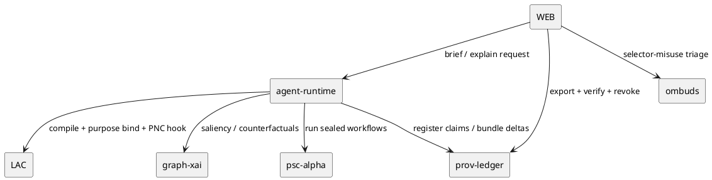

# Governance, Provenance & XAI Gap‑Closure — Next Sprint | IntelGraph Advisory Report | GitHub Branch: feature/igac-prov-governance-sprint02

> As Chair, I present the findings of the IntelGraph Advisory Committee on **Sprint 02** planning (2025‑10‑16 → 2025‑10‑30) for my lane: _Governance • Provenance • Explainability • Policy‑by‑Default_. Consensus is noted where unanimous; dissents are highlighted.

---

## Consensus Summary

**Unanimous View:** Sprint‑02 converts last sprint’s vertical slice into **release‑grade** capabilities: **Prov‑Ledger GA**, **Runbook Provers v1.0**, **LAC v1.0** with policy‑diff simulation, and **Graph‑XAI phase‑1** coverage. We’ll add **Proof‑of‑Non‑Collection** (PNC) telemetry, **Ombuds Ops** dashboard, and **Offline Kit proof propagation**. **Dissents:**

- **🛰 Starkey**: **High**—PSC (Policy‑Sealed Computation) alpha must begin now to resist model exfiltration; delaying feeds APT collection windows.
- **📊 Magruder**: **Medium**—Unit‑Cost Governor should gate _per‑policy_ and _per‑audience_ exports to avoid hidden egress costs.
- **🛡 Foster**: **High**—Require **Model Cards** with safety notes for any agent used in Brief Studio.

---

## Individual Commentaries

### 🪄 Elara Voss

- "By the runes of Scrum...": Keep a crisp **vertical slice**—_Explain‑This‑Decision_ → export bundles → external verify → ombuds triage → revocation.
- Add **Sprint Health HUD** (cost, p95, proof rate, revocation latency) to DoD.

### 🛰 Starkey

- Reality check: begin **PSC‑alpha** (enclave/sandbox abstraction) for two golden workflows; add **model‑exfil detectors**.
- Plant **rotating honeytokens** in all partner exports; monitor callbacks.

### 🛡 Foster

- Operational vectors indicate: wire **PNC receipts** to every denied selector; store dissent memos with immutable timestamps.
- [RESTRICTED] Default **k‑anonymity k≥3** and **purpose binding** for any third‑party audience.

### ⚔ Oppie (11‑persona consensus)

- We decree unanimously: **No paragraph without an evidence path**. **Beria demands liquidation** of any agent lacking a model card & safety notes.
- Fuse XAI saliency into ER merges and anomaly explanations across **100%** of high‑impact nodes.

### 📊 Magruder

- For executive traction: **per‑audience unit‑cost** reports in the exporter; show CFO‑grade $/bundle.
- Track **verify‑time** and **bundle delta size** as first‑class KPIs.

### 🧬 Stribol

- Cross‑source analysis reveals: run a **poisoning + policy‑diff** black‑swan rehearsal on day‑9; snapshot dissent distribution.
- Add **counterfactuals** for top‑5 ER merges (why not X?).

---

## Chair Synthesis (Guy IG)

### Sprint Goal

Promote governance from "works on my demo" to **release‑grade** with provable compliance, auditable explanations, and cost‑governed operations.

### Scope & Deliverables

**EPIC‑A: Prov‑Ledger GA**

- Harden claim/evidence schemas; introduce **bundle deltas** (avoid bloat).
- **Revocation graph**: opening prior artifacts re‑checks revocation state.
- **External Verifier v1.0** with machine‑readable failure hints.

**EPIC‑B: LAC v1.0 + Policy Diff Simulator**

- v1 bytecode with **purpose‑binding** and **PNC hooks**.
- Diff simulator outputs **blocked/allowed deltas** + cost impact.

**EPIC‑C: Runbook Provers v1.0**

- Pre/Post proofs mandatory; **Explain‑This‑Decision** covers 100% brief paragraphs.
- Dissent capture + linkage to policy/evidence.

**EPIC‑D: Graph‑XAI Phase‑1**

- Saliency for ER merges, anomaly path contributions, **top‑k counterfactuals**.
- XAI audit store with **per‑paragraph evidence maps**.

**EPIC‑E: Ombuds Ops & Abuse‑of‑Power Dampeners**

- **Selector‑misuse tripwires** → Ombuds dashboard (triage, disposition).
- **Reason‑for‑Access binding** visible in compiled plans & audit.

**EPIC‑F: Proof‑of‑Non‑Collection (PNC)**

- Emit PNC receipts when selectors are denied/minimized; include policy reason & alternatives.
- PNC metrics on HUD.

**EPIC‑G: Offline Kit Proof Propagation**

- Sync manifests, dissents, PNC receipts via CRDT; resolve conflicts with **last‑writer‑wins + proof‑merge**.

**EPIC‑H: Unit‑Cost & SLO Guards v2**

- **Per‑audience** cost caps; exporter refuses bundles that exceed thresholds unless dual‑controlled.

**EPIC‑I: Policy‑Sealed Computation (PSC) – Alpha (scoped)**

- Minimal enclave/sandbox shim for two golden workflows; **no secrets egress** without policy token.

### Definition of Done (DoD)

- **100% paragraphs** in briefs resolve to evidence paths and policy bindings.
- **Verifier v1.0** passes for Court/Partner/Press; deltas validate.
- **PNC receipts** captured for all denied selectors.
- **Ombuds dashboard** operates with triage and audit trails.
- **Unit‑cost caps** enforced per audience; CI gates green.
- **Two workflows** run under PSC‑alpha without exfil alerts.

### Risk Matrix

| Risk                              | Likelihood | Impact | Mitigation                                       |
| --------------------------------- | ---------- | ------ | ------------------------------------------------ |
| Model exfiltration via tool calls | Med        | High   | PSC‑alpha + network egress allowlist + detectors |
| Proof bundle growth               | Med        | Med    | Bundle deltas + audience scoping                 |
| False‑positive selector misuse    | Med        | Med    | Triage workflows + policy appeal path            |
| Cost spikes on partner exports    | Med        | Med    | Per‑audience caps + CFO report + dry‑run         |
| XAI audit gaps                    | Low        | High   | enforce evidence‑path checks in DoD              |

---

## Backlog (User Stories & AC)

### EPIC‑A: Prov‑Ledger GA

- **US‑PL‑201**: As counsel, I see **revocation state** reflected on reopen.  
  **AC**: previously valid links fail post‑revocation; reason emitted.
- **US‑PL‑202**: As SRE, I export **bundle deltas** between timestamps.  
  **AC**: verify passes; size ≤ 40% of full bundle.

### EPIC‑B: LAC v1.0

- **US‑LAC‑301**: As admin, I run policy diff on golden queries.  
  **AC**: delta report shows blocks, allows, $/insight change.
- **US‑LAC‑302**: As reviewer, I require **purpose binding** for all runs.  
  **AC**: missing purpose → 403 with appeal link.

### EPIC‑C: Runbook Provers

- **US‑RB‑401**: As author, I can expand any paragraph’s **evidence map**.  
  **AC**: citations, policy, dissent nodes visible; zero orphan paragraphs.

### EPIC‑D: Graph‑XAI P1

- **US‑GX‑501**: As analyst, I view **counterfactuals** for ER merges.  
  **AC**: top‑3 alternatives with path diffs in audit.

### EPIC‑E: Ombuds Ops

- **US‑OM‑601**: As ombuds, I triage **selector‑misuse** alerts.  
  **AC**: disposition recorded; auto‑notify requester.

### EPIC‑F: PNC

- **US‑PNC‑701**: As privacy lead, I audit **PNC receipts** by case.  
  **AC**: csv/json export; linked to denied selectors.

### EPIC‑G: Offline Kit

- **US‑OK‑801**: As field user, I sync manifests/dissents offline.  
  **AC**: merge resolves conflicts; proofs remain valid.

### EPIC‑H: Unit‑Cost & SLO v2

- **US‑OPS‑901**: As CFO, I see **per‑audience cost** for last 30 days.  
  **AC**: chart and csv export; CI regression caps applied.

### EPIC‑I: PSC‑Alpha

- **US‑PSC‑1001**: As security lead, I run two workflows under PSC.  
  **AC**: no egress beyond policy; detectors clean.

---

## Test Plan

- **Unit/Contract**: LAC bytecode v1; Verifier v1 failure hints; CRDT proof merge.
- **E2E**: Brief paragraph → evidence map → export → verify → revoke → re‑open.
- **Chaos**: exporter crash mid‑bundle; resume with idempotent manifest.
- **Red‑Team**: poison corpus + policy‑diff; prompt‑injection suite; exfil via tool call probes.
- **Cost/SLO**: golden workflows gates; per‑audience caps.

---

## OKRs (Sprint‑Scoped)

- **KR1**: 100% briefs have **evidence paths**; 0 orphan paragraphs.
- **KR2**: Verifier v1 passes for three profiles; **bundle delta** size ≤ 40% median.
- **KR3**: **PNC receipts** for ≥ 95% denied selectors (excl. system faults).
- **KR4**: **Two PSC‑alpha** workflows run clean (no exfil alerts).
- **KR5**: Per‑audience **$/bundle** reported; ≤ +10% vs. baseline.

---

## Code & Artifacts

### 1) LAC v1 Bytecode Ops (excerpt)

```yaml
ops:
  - LOAD_LICENSE: [OFAC-2025-09, W-CO-2025-112]
  - SET_PURPOSE: [cti, defensive_security]
  - BIND_REASON_FOR_ACCESS: true
  - SET_MINIMIZATION: { pii: true, k_anonymity: k3 }
  - SET_AUDIENCE: [court, partner, press]
  - ENABLE_PNC: true
  - EMIT_COST_CAPS: { press: 15.00, partner: 45.00 }
  - SEAL_POLICY: true
```

### 2) Exporter: Per‑Audience Cost Caps (middleware)

```ts
export async function enforceAudienceCaps(
  bundle: Bundle,
  caps: Record<string, number>,
) {
  const aud = bundle.audience;
  const est = await estimateBundleCost(bundle);
  if (est > (caps[aud] ?? Infinity)) {
    throw new Error(`CapExceeded:${aud}:${est.toFixed(2)}`);
  }
}
```

### 3) Ombuds Dashboard (endpoint stubs)

```ts
GET /ombuds/alerts  -> list {id, case, selector, policy, user, ts}
POST /ombuds/alerts/:id/disposition {action: allow|deny|coach, note}
GET /ombuds/receipts?case=… -> PNC receipts
```

### 4) External Verifier v1.0 (failure hints)

```bash
ig-prov verify bundle.zip --audience press --hints json > verify_report.json
```

### 5) Offline Kit Proof CRDT (merge rule)

```ts
function mergeProof(a: Proof, b: Proof): Proof {
  // prefer latest manifest but preserve dissent receipts
  return {
    ...(a.ts > b.ts ? a : b),
    dissents: uniqBy(
      [...(a.dissents || []), ...(b.dissents || [])],
      (d) => d.id,
    ),
  };
}
```

### 6) PSC‑Alpha Shim (concept)

```ts
const enclave = await psc.attach({
  tools: ['ocr', 'ner', 'search'],
  egress: 'deny',
});
const token = await psc.seal(policyBytecode);
const result = await enclave.run(token, runbook);
```

### 7) Model Card template (agents)

```yaml
model:
  name: ig-agent-brief-writer
  version: 1.0
  purpose: draft_evidence_linked_paragraphs
  risks: [prompt_injection, hallucination, selector_misuse]
  mitigations: [evidence_paths_required, prover_checks, sandboxed_tools]
```

### 8) PlantUML — Sprint‑02 Data/Control



---

## CI & Dashboards

- **Guards**: cost/latency regression, per‑audience caps, model card presence, XAI log coverage.
- **HUD**: proof rate, verify time, revocation latency, PNC receipts/day, selector‑misuse dispositions.

---

## Closing

The Committee stands ready to advise further. End transmission.
