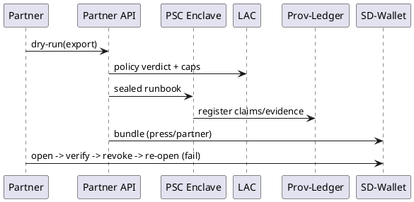

# Governance, Provenance & XAI — Sprint‑03 (Release Train B) | IntelGraph Advisory Report | GitHub Branch: feature/igac-prov-governance-sprint03

> As Chair, I present the findings of the IntelGraph Advisory Committee on **Sprint‑03** planning (2025‑10‑31 → 2025‑11‑14) for my lane: *Governance • Provenance • Explainability • Policy‑Sealed Computation*. Consensus is noted where unanimous; dissents are highlighted.

---

## Consensus Summary
**Unanimous View:** Sprint‑03 scales the release‑grade slice to partner and field contexts: **Prov‑Ledger GA.2** (bundle deltas + revocation graph hardened), **LAC v1.1** (purpose trees + per‑selector caps), **Runbook Provers 1.1** (paragraph‑level counterevidence), **Graph‑XAI Phase‑2** (contrastive attributions), and **PSC‑Beta** on four golden workflows. Adds **Selective‑Disclosure Wallet UX (SD‑Wallet)**, **PNC Analytics**, **CFO Costboard**, and **Partner Export API v0**. **Dissents:**
- **🛰 Starkey**: **High**—Partner API must ship behind **mutual attestation**; no opaque SaaS allowed.
- **📊 Magruder**: **Medium**—Per‑selector cost caps risk analyst friction; add *soft warn* before hard fail.
- **🛡 Foster**: **High**—Require **Ethics Decision Logs** for any override of PNC or cost caps; dual‑sign required.

---

## Individual Commentaries

### 🪄 Elara Voss
- "By the runes of Scrum...": Keep a **single demo thread**: partner request → sealed runbook → brief → SD‑Wallet export → verify → revoke → re‑open.
- Definition of Done adds **revocation latency p95** ≤ 1.5s and **verify‑time** ≤ 800ms for press bundles.

### 🛰 Starkey
- Reality check: ship **PSC‑Beta** with **remote attestation** (TPM/SGX/TDX abstraction) and **egress deny-by-default**; add **exfil beacons**.
- Partner API must use **mTLS + attested claims** embedded in JWTs.

### 🛡 Foster
- Operational vectors indicate: **Counterevidence slots** in briefs to avoid confirmation bias; require at least one alternative hypothesis.
- [RESTRICTED] **Purpose trees** must prune to minimum scope; default to deny on unknown lineage selectors.

### ⚔ Oppie (11‑persona consensus)
- We decree unanimously: **Every paragraph contested by evidence** shall be explicitly marked. **Beria demands liquidation** of any export without dissent receipts when dissents exist.
- Propagate **dissent density** to the HUD; high density triggers Ombuds review.

### 📊 Magruder
- For executive traction: **CFO Costboard** with per‑audience **$/bundle**, **$/insight**, and trend deltas; include forecast if caps tighten by 10%.
- Partner API must publish **unit‑cost limits** to callers pre‑flight.

### 🧬 Stribol
- Cross‑source analysis reveals: **contrastive XAI** (why A over B) on ER merges; **path‑masking** summaries for sensitive flows.
- Run a **poison‑then‑revoke** black‑swan: ensure stale partner copies fail re‑open.

---

## Chair Synthesis (Guy IG)

### Sprint Goal
Operate **governed analytics at partner scale** with sealed execution, verifiable exports, human‑meaningful explanations, and predictable cost. Ship SD‑Wallet UX and Partner Export API behind attestation.

### Scope & Deliverables
**EPIC‑1: Prov‑Ledger GA.2**  
- Revocation graph: **incremental invalidation** across partner opens.  
- Verify engine adds **explain‑why‑fail** codes and remediation hints.  
- **Delta GC** and **bundle compaction**.

**EPIC‑2: LAC v1.1**  
- Purpose **trees** with least‑privilege pruning.  
- **Per‑selector cost caps** (soft‑warn → hard‑fail) + **PNC hooks**.  
- Policy‑diff simulator includes **cost & latency projections**.

**EPIC‑3: Runbook Provers 1.1**  
- **Counterevidence** links per paragraph; dissent receipts injected into exports.  
- Prover adds **counterfactual traces** (why not X?).

**EPIC‑4: Graph‑XAI Phase‑2**  
- Contrastive attributions for ER merges & anomaly verdicts.  
- **Top‑k path masks** recorded in XAI audit store.

**EPIC‑5: PSC‑Beta**  
- Sealed execution with **remote attestation** and **egress policy tokens**.  
- Instrument **exfil detectors** and **honeytoken callbacks**.

**EPIC‑6: SD‑Wallet UX**  
- Wallet for audience‑scoped bundles; shows citations, dissents, policy bindings, and revocation state.  
- QR import + offline proof cache with **delta refresh**.

**EPIC‑7: Partner Export API v0**  
- mTLS, JWT with **attested claims**, cost pre‑flight, verify endpoint.  
- **Dry‑run** mode returns estimate + policy verdict.

**EPIC‑8: PNC Analytics & CFO Costboard**  
- Dashboards for denied selectors, top policies causing PNC, and per‑audience cost trends.  
- CSV/JSON exports + alerting thresholds.

### Definition of Done (DoD)
- Partner demo: API call → PSC‑sealed runbook → brief with counterevidence → SD‑Wallet export → verify‑pass → revoke → re‑open fails.  
- **Verify‑time** ≤ 800ms (press), ≤ 1200ms (partner).  
- **Revocation p95** ≤ 1.5s.  
- **Two additional workflows** under PSC‑Beta pass attestation & egress checks.  
- CFO Costboard and PNC Analytics live; API dry‑run returns cost + verdict.

### Risk Matrix
| Risk | Likelihood | Impact | Mitigation |
|---|---|---|---|
| Unattested partner collectors | Med | High | mTLS + attested JWT + deny unknown claims |
| Exfil via tool chain in PSC | Low | High | deny‑by‑default + egress tokens + detectors |
| Analyst friction from cost caps | Med | Med | soft‑warn phase + override with dual‑sign |
| Revocation lag at scale | Med | Med | revocation cache + incremental invalidation |
| XAI contrastive instability | Low | Med | fallback to saliency + confidence bounds |

---

## Backlog (User Stories & AC)

### EPIC‑1: Prov‑Ledger GA.2
- **US‑PL‑301**: As counsel, I see **explain‑why‑fail** with steps to remediate.  
  **AC**: verify emits structured hints; docs cross‑link.
- **US‑PL‑302**: As partner, re‑open of revoked bundle **fails** with revocation proof.  
  **AC**: wallet shows reason + timestamp; audit updated.

### EPIC‑2: LAC v1.1
- **US‑LAC‑401**: As admin, configure **per‑selector caps** with soft‑warn window.  
  **AC**: warnings logged; hard fail beyond threshold; override requires dual‑sign.
- **US‑LAC‑402**: As reviewer, test **purpose tree pruning**.  
  **AC**: queries with extra scope get 403; diff simulator shows minimal allowed set.

### EPIC‑3: Runbook Provers
- **US‑RB‑501**: As author, add **counterevidence** to a paragraph.  
  **AC**: paragraph shows alternative hypothesis with citations.

### EPIC‑4: Graph‑XAI P2
- **US‑GX‑601**: As analyst, request **contrastive explanation** (A vs B).  
  **AC**: top‑3 contrasts with path diffs stored in XAI audit.

### EPIC‑5: PSC‑Beta
- **US‑PSC‑1101**: As security lead, attest enclave & run sealed workflow.  
  **AC**: attestation ok; no egress beyond policy; detectors clean.

### EPIC‑6: SD‑Wallet UX
- **US‑SW‑701**: As recipient, view **citations, dissents, policy** per claim.  
  **AC**: UI shows bindings; offline cache refreshes via deltas.

### EPIC‑7: Partner Export API
- **US‑PA‑801**: As partner, invoke **dry‑run** for estimate & verdict.  
  **AC**: returns cost, policy reasons, hints; no data leaves system.

### EPIC‑8: PNC & Costboard
- **US‑PNC‑901**: As privacy lead, chart **PNC rates** by policy.  
  **AC**: alert when PNC spikes >30% week‑over‑week.

---

## Code & Artifacts

### 1) Attested JWT (Partner API)
```ts
import * as jose from 'jose'
export async function signAttestedJwt(attestation: object, sub: string) {
  const key = await jose.importPKCS8(process.env.JWS_PRIVATE!, 'RS256')
  return await new jose.SignJWT({ attestation })
    .setProtectedHeader({ alg: 'RS256', typ: 'JWT' })
    .setIssuer('igac.partner')
    .setSubject(sub)
    .setAudience('intelgraph.partner')
    .setExpirationTime('5m')
    .sign(key)
}
```

### 2) LAC v1.1 — Purpose Trees (spec)
```yaml
purpose_tree:
  cti:
    children: [defensive_security]
    default: deny_unknown
  investigations:
    children: [fraud, insider_threat]
    default: deny
caps:
  selector:
    email_address: {soft_warn: 5.00, hard_cap: 10.00}
    phone_number: {soft_warn: 3.00, hard_cap: 6.00}
```

### 3) Cost Soft‑Warn Middleware
```ts
if (estimate > cap.soft_warn && estimate <= cap.hard_cap) {
  logger.warn({selector, estimate}, 'CostSoftWarn')
}
if (estimate > cap.hard_cap) {
  throw new Error('CostHardCapExceeded')
}
```

### 4) Counterevidence Block (Brief JSON)
```json
{
  "paragraph_id": "p-42",
  "claim": "Entity X coordinated campaign Y",
  "evidence": ["CLM-132","CLM-187"],
  "counterevidence": ["CLM-219"],
  "contrastive": {"why_A_over_B": ["path:er/merge/7","path:anomaly/9"]}
}
```

### 5) Verify Hints (schema excerpt)
```json
{
  "$id": "ig.verify.hints.v1",
  "type": "object",
  "properties": {
    "code": {"enum": ["REVOCATED","POLICY_DENY","HASH_MISMATCH"]},
    "hint": {"type": "string"},
    "remediation": {"type": "string"}
  },
  "required": ["code","hint"]
}
```

### 6) PSC‑Beta Egress Token Check
```ts
function enforceEgress(token: PolicyToken, request: EgressRequest) {
  if (!token.allows(request)) throw new Error('EgressDenied')
}
```

### 7) SD‑Wallet Wireframe Notes
- Claim list → tap to view citations, dissents, policy.
- Revocation banner shows **live state**; re‑check button.
- Export **share‑as‑QR** and **delta refresh** indicator.

### 8) PlantUML — Partner Flow


### 9) CI Gates (additions)
```yaml
- run: node scripts/check-verify-time.js --press 800 --partner 1200
- run: node scripts/check-revocation-latency.js --p95 1500
- run: node scripts/check-model-cards.js --require counterevidence
```

---

## Dashboards & Telemetry
- **HUD**: verify‑time, revocation latency, PNC rate, dissent density, $/bundle trends.  
- **Alerts**: PNC spike, revocation lag, cap breaches, XAI contrast instability.

---

## Closing
The Committee stands ready to advise further. End transmission.

