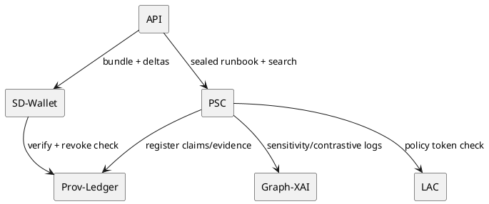

# Governance, Provenance, XAI & PSC — Sprint‑04 (Release Train B) | IntelGraph Advisory Report | GitHub Branch: feature/igac-prov-governance-sprint04

> As Chair, I present the findings of the IntelGraph Advisory Committee on **Sprint‑04** planning (2025‑11‑15 → 2025‑11‑29) for my lane: _Governance • Provenance • Explainability • Policy‑Sealed Computation_. Consensus is noted where unanimous; dissents are highlighted.

---

## Consensus Summary

**Unanimous View:** Sprint‑04 turns partner‑scale features into **compliance‑grade operations**: **PSC‑RC** (remote attestation + egress policy tokens hardened), **Prov‑Ledger GA.3** (delta GC + cross‑tenant revocation), **LAC v1.2** (jurisdictional policy packs + lineage guards), **Runbook Provers 1.2** (counterevidence scoring), **Graph‑XAI Phase‑3** (contrastive + sensitivity analysis), **SD‑Wallet 1.0** (offline first), and **Partner Export API v1** (mutual attestation + dry‑run verdicts + caps). Adds **Data Residency Controls**, **Audit Analytics**, **DR/BC runbooks**, and **FedRAMP/FIPS alignment** checklist. **Dissents:**

- **🛰 Starkey**: **High**—Without **policy‑sealed search** on vector/RAG tools, exfil windows persist.
- **📊 Magruder**: **Medium**—Per‑tenant revocation may spike storage & CPU; add cost breakers and shared‑index reuse.
- **🛡 Foster**: **High**—Shadow‑copy detection for partner re‑hosting must ship before calling SD‑Wallet 1.0 GA.

---

## Individual Commentaries

### 🪄 Elara Voss

- "By the runes of Scrum...": Keep a **single golden demo**: Partner API → PSC sealed run → Brief with counterevidence → SD‑Wallet open → revoke → re‑open (fails) → audit analytics panel confirms propagation.
- DoD adds **evidence lifecycle chart** and **residency unit tests**.

### 🛰 Starkey

- Reality check: extend PSC to **policy‑sealed search** (vector/RAG) with **embedding egress tokens**. Instrument **beacons** for model pull attempts.
- Require attestation for **partner sidecars** (no opaque collectors).

### 🛡 Foster

- Operational vectors indicate: **Shadow‑copy detection** via honeytoken drift + access cadence anomaly. Ethics Decision Log required to override PNC or caps.
- [RESTRICTED] Add **data residency pack** (US‑only, EU‑only) with deny‑unknown on lineage.

### ⚔ Oppie (11‑persona consensus)

- We decree unanimously: publish **Dissent Density** and **Counterevidence Coverage** weekly. **Beria demands liquidation** of any export lacking dissent receipts where dissent nodes exist.
- Move to **policy‑sealed search** or accept risk.

### 📊 Magruder

- For executive traction: **Revocation Costboard** (CPU/s, IOPS, $/tenant) and **Shared‑Index Savings** KPI. Soft‑warn on revocation storms.
- Envelope a **cost breaker**: autoscale deny beyond 85% budget burn.

### 🧬 Stribol

- Cross‑source analysis reveals: add **sensitivity analysis** (minimal evidence change that flips verdict) to XAI; log thresholds to audit.
- Run **black‑swan** drill: poisoned embeddings + revoke cascades across tenants.

---

## Chair Synthesis (Guy IG)

### Sprint Goal

Operate governed analytics as a **compliance‑grade system**: sealed compute, verifiable provenance, contestable explanations, residency guarantees, and bounded cost at partner scale.

### Scope & Deliverables

**EPIC‑1: PSC‑RC (Release Candidate)**

- Remote attestation abstraction (TDX/SEV/SGX) unified; **egress policy tokens** at tool boundary.
- **Policy‑sealed search** for vector/RAG pipelines; embedding export only with token.

**EPIC‑2: Prov‑Ledger GA.3**

- **Cross‑tenant revocation graph**; incremental invalidation with tenant scopes.
- Delta GC, **bundle compaction**, and **verify‑hint codes** extended.

**EPIC‑3: LAC v1.2**

- **Jurisdiction packs** (US‑only, EU‑only, Five Eyes) and **lineage guards** (deny unknown source).
- **Per‑tenant caps** and **policy diff** with residency simulation.

**EPIC‑4: Runbook Provers 1.2**

- **Counterevidence scoring**; dissent density per brief; paragraph risk badges.
- Prover exposes **sensitivity nudge**: show what would change verdict.

**EPIC‑5: Graph‑XAI Phase‑3**

- Contrastive + **sensitivity analysis** persisted to audit; **confidence bounds** on explanations.
- "Why not X" counterfactual traces for top‑k merges.

**EPIC‑6: SD‑Wallet 1.0**

- Offline‑first cache with **delta refresh**; **shadow‑copy detection** signals; QR import/export hardened.
- Wallet shows citations, dissents, policies, revocation, and residency flags.

**EPIC‑7: Partner Export API v1**

- **mTLS**, **attested JWT**, cost pre‑flight, verify endpoint, **residency region selection**.
- **Dry‑run** returns cost, policy verdict, residency fit.

**EPIC‑8: Audit Analytics & Costboards**

- Dashboards: **PNC rate**, **dissent density**, **verify‑time**, **revocation latency**, **$/bundle**, **$/tenant**, **shared‑index savings**.
- Alerting for **revocation storms** and **budget burn >85%**.

**EPIC‑9: DR/BC & Compliance**

- DR runbooks (RPO 5m / RTO 30m) for Prov‑Ledger, LAC, PSC enclaves, SD‑Wallet.
- **FedRAMP Moderate alignment** checklist; **FIPS‑validated crypto** check.

### Definition of Done (DoD)

- **Two vector/RAG workflows** run under policy‑sealed search; no embedding egress without token.
- Cross‑tenant revoke invalidates prior partner opens; wallet shows fail with proof.
- SD‑Wallet 1.0 ships with **shadow‑copy detection**.
- LAC jurisdiction packs enforced; **residency tests** pass.
- Costboards live; cost breaker triggers in simulated storm.
- DR runbooks executed in drill; meet RPO/RTO.

### Risk Matrix

| Risk                           | Likelihood | Impact | Mitigation                                                |
| ------------------------------ | ---------- | ------ | --------------------------------------------------------- |
| Embedding exfiltration via RAG | Med        | High   | policy‑sealed search + egress tokens + detectors          |
| Revocation storm cost spike    | Med        | Med    | cost breaker, shared‑index reuse, backoff                 |
| Shadow‑copy partner re‑hosting | Med        | High   | honeytoken drift + access cadence monitor + legal notices |
| Residency mis‑tag              | Low        | High   | jurisdiction packs + lineage guards + tests               |
| XAI sensitivity instability    | Low        | Med    | confidence bounds + fallback traces                       |

---

## Backlog (User Stories & AC)

### EPIC‑1: PSC‑RC

- **US‑PSC‑1201**: As security lead, attest enclave and run **policy‑sealed search**.  
  **AC**: embeddings cannot egress without token; detectors log attempts.

### EPIC‑2: Prov‑Ledger GA.3

- **US‑PL‑401**: As partner, re‑open of revoked bundle fails across tenants.  
  **AC**: wallet shows cross‑tenant revocation proof; audit updated.

### EPIC‑3: LAC v1.2

- **US‑LAC‑501**: As admin, apply **EU‑only** residency pack.  
  **AC**: non‑EU lineage → 403; simulator shows deltas and cost.

### EPIC‑4: Runbook Provers 1.2

- **US‑RB‑601**: As author, see **counterevidence score** per paragraph.  
  **AC**: score rendered; export includes dissent receipts.

### EPIC‑5: Graph‑XAI P3

- **US‑GX‑701**: As analyst, request **sensitivity** for a verdict.  
  **AC**: minimal evidence change displayed; stored in audit.

### EPIC‑6: SD‑Wallet 1.0

- **US‑SW‑801**: As recipient, get **shadow‑copy alert** if re‑host detected.  
  **AC**: alert includes drift signal & remediation.

### EPIC‑7: Partner Export API v1

- **US‑PA‑901**: As partner, choose **residency region** in pre‑flight.  
  **AC**: dry‑run reports fit; deny if pack mismatch.

### EPIC‑8: Audit Analytics & Costboards

- **US‑AA‑1001**: As CFO, view **shared‑index savings** by tenant.  
  **AC**: KPI and CSV export available.

### EPIC‑9: DR/BC & Compliance

- **US‑DR‑1101**: As SRE, execute **revocation storm drill**.  
  **AC**: breaker triggers; RPO/RTO met.

---

## Code & Artifacts

### 1) Policy‑Sealed Search (RAG) – Token Check

```ts
// tools/vectorStore.ts
export async function exportEmbeddings(q: Query, token?: PolicyToken) {
  if (!token || !token.allows({ type: 'embedding_export', case: q.caseId })) {
    throw new Error('EgressDenied:EmbeddingExport');
  }
  return underlying.export(q);
}
```

### 2) Jurisdiction Packs (LAC v1.2)

```yaml
jurisdiction:
  eu_only:
    residency: EU
    lineage: require_eu_sources
    deny_unknown: true
  us_only:
    residency: US
    lineage: require_us_sources
```

### 3) Shadow‑Copy Detection (signal sketch)

```ts
function detectShadowCopy(events: AccessEvent[]): boolean {
  const drift = honeytokenDrift(events);
  const cadence = accessCadence(events);
  return drift.score > 0.8 && cadence.periodicity > THRESH;
}
```

### 4) Revocation Cost Breaker

```ts
if (revocationCPU > budget.cpu * 0.85 || revocationIOPS > budget.iops * 0.85) {
  breaker.open('RevocationStorm');
}
```

### 5) Sensitivity Analysis Log (XAI)

```json
{
  "verdict_id": "er-merge-994",
  "sensitivity": {
    "delta_evidence": ["EVD-22"],
    "flip_probability": 0.31,
    "confidence": 0.82
  }
}
```

### 6) Residency Tests (example)

```ts
it('denies non‑EU lineage under EU‑only pack', async () => {
  const res = await request(app).get('/query').set('jurisdiction', 'EU');
  expect(res.status).toBe(403);
  expect(res.body.reason).toMatch(/EU-only/);
});
```

### 7) PlantUML — Sprint‑04 Control/Data



### 8) CI Gates (additions)

```yaml
- run: node scripts/check-residency.js --eu-only
- run: node scripts/check-psc-egress.js --deny-embedding
- run: node scripts/check-revocation-cost.js --cpu 0.85 --iops 0.85
- run: node scripts/check-shadow-copy.js --threshold 0.8
```

---

## Dashboards & Telemetry

- **HUD**: verify‑time, revocation latency, PNC rate, dissent density, sensitivity flips, $/bundle, $/tenant, shared‑index savings, breaker state.
- **Alerts**: revocation storm, budget >85%, shadow‑copy detected, residency mismatch, embedding egress attempts.

---

## Closing

The Committee stands ready to advise further. End transmission.
