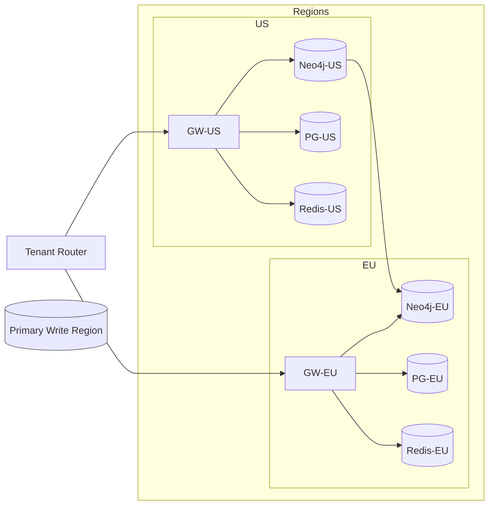

````markdown
---
slug: intelgraph-mc-sprint-2025-10-15
version: v1.0
created: 2025-09-29
sprint_window: 2025-10-15 → 2025-10-28 (2 weeks)
release_cadence: weekly cut → staging; biweekly → prod
owners:
  - product: PM (R), MC (A)
  - delivery: Tech Lead (A), Eng (R), QA (R), SRE (R), Sec (R)
status: planned
---

# IntelGraph Maestro Conductor — Sprint Plan (2025‑10‑15 → 2025‑10‑28)

> **Mission (Sprint N+1)**: Extend Day‑0 GA to multi‑region readiness, expand connector coverage, ship initial entity‑resolution (ER) slice, and operationalize privacy workflows (RTBF, residency), while keeping SLOs & cost guardrails green.

## Conductor Summary (Commit)

**Assumptions & Provenance**

- Builds on prior sprint (2025‑10‑01) where gateway hardening, ingest GA, policy seed, and evidence bundle v1 were delivered.
- Summit bundles still pending ingest into repo; placeholders marked _[ATTACH FROM SUMMIT BUNDLE]_ remain until synced.

**Goals**

1. **Region Sharding Enablement**: Helm overlays for single‑primary write, read replicas; tenant routing by region tag.
2. **Connector Expansion**: GCS/Azure Blob adapters parity with S3/CSV SDK.
3. **Entity Resolution v0.1**: deterministic blocking, scoring, and merge policy with provenance.
4. **Privacy Ops**: RTBF queue + residency enforcement; export redaction presets.
5. **Resilience & DR**: failover drill runbook; chaos tests against Neo4j and Redis.

**Non‑Goals**

- Advanced probabilistic ER (v0.2) and GDS pipelines beyond smoke.
- JDBC connectors (defer one sprint unless capacity > 110%).

**Constraints**

- SLOs unchanged (API/GraphQL, Ingest, Graph ops) and must be maintained across regions.
- Cost guardrails unchanged; alert at 80% burn.

**Risks**

- R1 Multi‑region latency spike. _Mitigation_: read‑local, write‑primary; cache TTLs per region.
- R2 Cloud egress costs. _Mitigation_: locality‑aware processing, compression; budget alerts by tag.
- R3 ER merges causing data quality regressions. _Mitigation_: shadow mode + manual approval thresholds.

**Definition of Done**

- Region sharding serving traffic in staging with canary; ER v0.1 in shadow/approve mode; RTBF/residency e2e verified; evidence bundle v2 issued.

---

## Swimlanes

- **Lane A — Multi‑Region & Routing** (Platform TL, 2 Eng)
- **Lane B — Connectors (GCS/Azure)** (Data Eng TL, 2 Eng)
- **Lane C — Entity Resolution** (Data Science Eng, 1 Backend)
- **Lane D — Privacy Ops** (Security Eng, Backend)
- **Lane E — SRE & DR** (SRE TL)
- **Lane F — QA & Release** (QA Lead, PM)

---

## Backlog (Epics → Stories → Tasks) + RACI

Estimates in SP.

### EPIC A: Region Sharding (34 SP)

- **A‑1** Helm overlays for regions (8 SP) — _Platform (R), TL (A), SRE (C)_
  - AC: `values-us.yaml`, `values-eu.yaml` with region tags; primary flag.
- **A‑2** Tenant router (8 SP) — _Backend (R), Platform (A)_
  - Tasks: route by `tenant.region`; sticky writes to primary; read replicas local.
  - AC: p95 deltas ≤ +10% vs single region for reads.
- **A‑3** Read‑only mode + lag metrics (10 SP) — _Backend (R), SRE (A)_
  - AC: replica lag exported; gateway blocks writes when in read‑only.
- **A‑4** Data residency guard (8 SP) — _Sec (A), Backend (R)_
  - AC: policies block cross‑region PII export unless `legal-hold`.

### EPIC B: GCS/Azure Blob Connectors (28 SP)

- **B‑1** GCS adapter parity (12 SP) — _Data Eng (R), TL (A)_
  - AC: throughput ≥ 40 MB/s/worker; schema mapping DSL reused; provenance attach.
- **B‑2** Azure Blob adapter parity (12 SP) — _Data Eng (R), TL (A)_
- **B‑3** Connector conformance tests (4 SP) — _QA (R)_

### EPIC C: Entity Resolution v0.1 (24 SP)

- **C‑1** Blocking & keys (8 SP) — _DS Eng (R), Backend (C)_
  - AC: deterministic blocks (email_norm, phone_e164, name+dob+zip).
- **C‑2** Pair scoring & thresholds (8 SP)
  - AC: rule‑based scoring; merge threshold configurable; shadow mode emit decisions.
- **C‑3** Merge policy & provenance (8 SP)
  - AC: field‑level survivorship; audit `MERGE` events with source weights.

### EPIC D: Privacy Ops (20 SP)

- **D‑1** RTBF queue + verifier (10 SP) — _Sec (A), Backend (R)_
  - AC: request intake, authZ, effectuation across PG/NEO/Redis; proof log signed.
- **D‑2** Export redaction presets (6 SP) — _Backend (R), MC (C)_
  - AC: k‑anon k≥5 where applicable; PII masked by purpose policy.
- **D‑3** Residency simulation in CI (4 SP) — _Sec (R)_

### EPIC E: SRE & DR (16 SP)

- **E‑1** Neo4j failover drill (8 SP) — _SRE (R)_
- **E‑2** Redis eviction/partition chaos (8 SP) — _SRE (R)_

### EPIC F: QA & Release (14 SP)

- **F‑1** ER shadow acceptance pack (8 SP) — _QA (R), DS (C)_
- **F‑2** Evidence bundle v2 (6 SP) — \_MC (R)

_Total_: **136 SP** (descope candidates: B‑2, E‑2 if capacity < 120 SP).

---

## Architecture Updates


````

**ADR‑005**: Region sharding with single primary; read replicas local. _Trade‑off_: replication lag vs consistency; mitigated by read‑your‑writes where needed.

**ADR‑006**: ER v0.1 uses deterministic rules; no ML model in this sprint. _Trade‑off_: lower recall but predictable.

---

## Data & Policy Additions

**ER Structures (PG)**

```sql
CREATE TABLE er_clusters (
  cluster_id UUID PRIMARY KEY,
  tenant_id UUID NOT NULL,
  created_at TIMESTAMPTZ DEFAULT now(),
  status TEXT NOT NULL CHECK (status IN ('shadow','approved','rejected'))
);
CREATE TABLE er_links (
  cluster_id UUID REFERENCES er_clusters(cluster_id),
  entity_id UUID NOT NULL,
  score NUMERIC NOT NULL,
  decision TEXT NOT NULL CHECK (decision IN ('keep','drop')),
  PRIMARY KEY (cluster_id, entity_id)
);
```

**OPA Residency Policy (snippet)**

```rego
package intelgraph.residency

allow_export {
  input.resource.pii == false
} else {
  input.user.exempt == true
} else {
  input.resource.region == input.user.region
}
```

---

## APIs & Schemas (Delta)

**GraphQL — ER APIs**

```graphql
type ERCluster {
  id: ID!
  status: String!
  entities: [EntityScore!]!
}

type EntityScore {
  entityId: ID!
  score: Float!
  decision: String!
}

type Query {
  erCluster(id: ID!): ERCluster
}

type Mutation {
  erShadowDecide(clusterId: ID!, approve: Boolean!): ERCluster
  requestRTBF(entityId: ID!): Boolean
}
```

---

## Observability & SLOs

- New metrics: replica lag, router hit‑rate, ER decisions/min, RTBF SLA (target ≤ 7 days, p95 ≤ 48 h to effectuate).
- Alerts: replica lag > 5s for 10 min; router errors > 0.1%; ER shadow disagreement rate > 10% vs ground truth sample.

---

## Testing Strategy (Delta)

- **Contract**: residency policy simulation per dataset tag.
- **E2E**: ER shadow → approve workflow; RTBF from intake to signed proof.
- **Load**: cross‑region reads @ 2× baseline; ensure p95 ≤ +10%.
- **Chaos**: induced failover; verify read‑only gates writes.

**Acceptance Packs**

- Given tenant in EU, exporting dataset with PII to US without exemption → **deny** with audit.
- Given ER cluster (shadow) with score ≥ threshold → requires manual approve to merge; provenance recorded.

---

## CI/CD & IaC (Delta)

```yaml
# Router service build & deploy
name: router-ci
on: [push]
jobs:
  build:
    runs-on: ubuntu-latest
    steps:
      - uses: actions/checkout@v4
      - uses: actions/setup-node@v4
        with: { node-version: 20 }
      - run: npm ci && npm test --workspaces router
  deploy-staging:
    needs: build
    steps:
      - run: helm upgrade --install router charts/router -f overlays/us.yaml
      - run: helm upgrade --install gw-eu charts/gateway -f overlays/eu.yaml
```

**Terraform (snippet)**

```hcl
variable "region" {}
module "neo4j" {
  source = "./modules/neo4j"
  region = var.region
  read_replicas = 2
}
```

---

## Code & Scaffolds (New/Delta)

```
repo/
  router/
    src/
      index.ts
      tenant-map.ts
    helm/
      values-us.yaml
      values-eu.yaml
  services/
    privacy/
      src/rtbf.ts
      src/residency.ts
  ds/
    er/
      blocking.ts
      scoring.ts
      merge.ts
```

**Router bootstrap (TypeScript)**

```ts
import fastify from 'fastify';
import proxy from '@fastify/http-proxy';
import { regionForTenant } from './tenant-map';

const app = fastify({ trustProxy: true });
app.addHook('onRequest', async (req) => {
  const tenant = req.headers['x-tenant-id'] as string;
  const region = await regionForTenant(tenant);
  req.headers['x-target-region'] = region;
});
app.register(proxy, {
  upstream: (req: any) =>
    `https://gw-${req.headers['x-target-region']}.svc.cluster.local` as any,
  prefix: '/graphql',
});
app.listen({ port: 8080 });
```

**ER blocking (TypeScript)**

```ts
export function blocks(e: any) {
  return {
    email: e.email?.trim().toLowerCase(),
    phone: e.phone_e164,
    name_dob_zip: `${e.name_norm}|${e.dob}|${e.zip}`,
  };
}
```

**RTBF worker (TypeScript)**

```ts
export async function rtbf(entityId: string, tenant: string) {
  await redactPG(entityId, tenant);
  await redactNeo(entityId, tenant);
  await purgeRedis(entityId, tenant);
  return await signProof({ entityId, tenant, ts: new Date().toISOString() });
}
```

**k6 cross‑region read test (JS)**

```js
import http from 'k6/http';
import { Trend } from 'k6/metrics';
const p95 = new Trend('gw_p95');
export default function () {
  const res = http.post(
    'https://router.stg/graphql',
    JSON.stringify({ id: 'getEntityById:v1', vars: { id: '1' } }),
  );
  p95.add(res.timings.duration);
}
```

---

## Release Plan & Runbooks

- **Staging cuts**: 2025‑10‑18, 2025‑10‑25.
- **Prod**: 2025‑10‑28 (canary 10% → 50% → 100%).

**DR Drill**

1. Trigger primary failover; verify read‑only gates; router flips writes.
2. Confirm SLOs remain within +15% p95 during failover window.

**Backout**

- Disable router regionalization (force all → primary); rollback ER merges by reversing cluster decisions.

---

## RACI

| Workstream      | R            | A           | C        | I   |
| --------------- | ------------ | ----------- | -------- | --- |
| Region Sharding | Platform Eng | Platform TL | SRE, Sec | PM  |
| Connectors      | Data Eng     | Data TL     | MC       | PM  |
| ER              | DS Eng       | MC          | Backend  | QA  |
| Privacy Ops     | Backend      | Sec Eng     | MC       | PM  |
| SRE & DR        | SRE          | SRE TL      | Platform | All |
| QA & Release    | QA           | PM          | MC       | All |

---

## Acceptance Criteria (per Epic)

- **A**: Router enforces locality; replica lag metrics live; read p95 ≤ +10% vs baseline.
- **B**: GCS/Azure adapters pass conformance; throughput targets met; provenance intact.
- **C**: ER shadow mode on; ≥ 95% precision on labeled sample; manual approval flow merges with provenance.
- **D**: RTBF end‑to‑end within p95 ≤ 48 h; residency denies cross‑region PII export unless exempt.
- **E**: DR drill executed; evidence recorded; no error‑budget breach.
- **F**: Evidence bundle v2 generated with new policies, tests, and DR artifacts.

---

## Open Items

1. Import labeled match/non‑match dataset _[ATTACH FROM SUMMIT BUNDLE]_.
2. Finalize tenant→region mapping with Legal & Sales.
3. Validate cloud SKU choices for replica counts vs budget.

```

```
