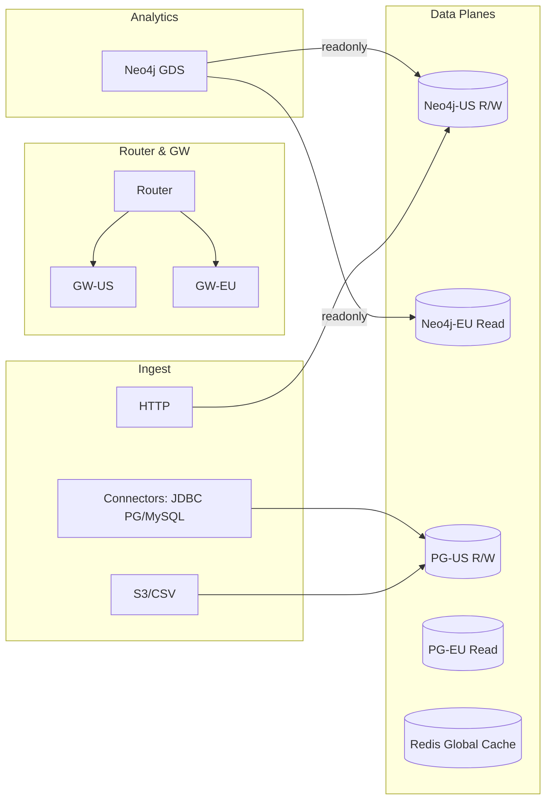

```markdown
---
slug: intelgraph-mc-sprint-2025-10-29
version: v1.0
created: 2025-09-29
sprint_window: 2025-10-29 → 2025-11-11 (2 weeks)
release_cadence: weekly cut → staging; biweekly → prod
owners:
  - product: PM (R), MC (A)
  - delivery: Platform TL (A), Backend (R), Data Eng (R), DS (R), SRE (R), Sec (R), QA (R)
status: planned
---

# IntelGraph Maestro Conductor — Sprint Plan (2025‑10‑29 → 2025‑11‑11)

> **Mission (Sprint N+2)**: Mature multi‑region posture to DR‑ready, introduce JDBC connectors, ship **ER v0.2 (probabilistic)** with explainability, and add first **GDS analytics** slices—all while enforcing SLOs/cost guardrails and expanding the evidence bundle.

## Conductor Summary (Commit)
**Assumptions & Provenance**
- Builds on 2025‑10‑15 sprint (router, residency, ER v0.1 shadow, RTBF, DR drills) and 2025‑10‑01 sprint (gateway hardening, ingest GA, policy seed).
- Summit bundles still pending repo ingest; placeholders _[ATTACH FROM SUMMIT BUNDLE]_ remain where noted.

**Goals**
1. **DR Readiness**: promote DR runbook from rehearsal → validated procedure with RTO/RPO targets.
2. **Connector Family**: JDBC (Postgres/MySQL) adapters with the same mapping/dedupe/provenance contract.
3. **Entity Resolution v0.2**: add probabilistic scoring (logistic/gradient), explainability surfaces, and online A/B shadow.
4. **Analytics v0.1**: Neo4j GDS slices (PageRank/Community) exposed through safe persisted queries.
5. **FinOps Guardrails**: per‑tenant budgets, feature‑flagged LLM usage caps, and cost dashboards.

**Non‑Goals**
- Full‑text search service; advanced ER (graph embeddings); multi‑cloud portability.

**Constraints**
- SLOs unchanged. DR targets: **RTO ≤ 30 min**, **RPO ≤ 5 min** for core data.
- Cost guardrails: unchanged with alerts at 80% burn; add tenant‑level caps.

**Risks**
- R1: ER v0.2 model drift → data quality risk. _Mitigation_: canary + approval thresholds, weekly ground‑truth audit.
- R2: JDBC high variance across sources. _Mitigation_: conformance suite, retry/backoff, schema introspection cache.
- R3: GDS jobs starving OLTP. _Mitigation_: run in off‑peak window, rate‑limit, separate read replica.

**Definition of Done**
- DR validated with evidence (timed drills, signed logs) meeting RTO/RPO; JDBC connectors pass conformance; ER v0.2 in shadow with ≥ 97% precision @ chosen threshold on labeled sample; GDS analytics endpoints live behind safelist; cost dashboards and caps enforced.

---

## Swimlanes
- **Lane A — DR & Multi‑Region** (Platform TL, SRE)
- **Lane B — JDBC Connectors** (Data Eng TL, Backend)
- **Lane C — ER v0.2 + XAI** (DS Eng, Backend)
- **Lane D — GDS Analytics** (Graph Eng, Backend)
- **Lane E — FinOps & Cost Guardrails** (SRE FinOps, PM)
- **Lane F — QA & Release** (QA Lead)

---

## Backlog (Epics → Stories → Tasks) + RACI
Estimates in SP.

### EPIC A: DR Readiness (30 SP)
- **A‑1** Timed failover with RTO/RPO measurement (10 SP) — _SRE (R), Platform (A)_
  - AC: RTO ≤ 30 min, RPO ≤ 5 min; signed drill report.
- **A‑2** Read‑only posture & queued writes (8 SP) — _Backend (R), SRE (A)_
  - AC: gateway queues writes ≤ 15 min; clients receive 202 + status endpoint.
- **A‑3** Provenance continuity on failover (6 SP) — _Data Eng (R), MC (C)_
  - AC: ledger hash chain continuous; export verifies.
- **A‑4** DR Runbook v1 (6 SP) — _SRE (R), PM (I)_

### EPIC B: JDBC Connectors (32 SP)
- **B‑1** Postgres ingest adapter (12 SP) — _Data Eng (R), TL (A)_
  - AC: snapshot + incremental (LSN); ≥ 25 MB/s/worker; provenance attach.
- **B‑2** MySQL ingest adapter (12 SP) — _Data Eng (R)_
- **B‑3** Conformance & chaos tests (8 SP) — _QA (R)_

### EPIC C: ER v0.2 Probabilistic (34 SP)
- **C‑1** Feature extraction & training (10 SP) — _DS (R)_
  - Features: Jaro‑Winkler, exact keys, TF‑IDF blocks _[ATTACH FROM SUMMIT BUNDLE]_.
- **C‑2** Online scorer + thresholds (12 SP) — _Backend (R), DS (C)_
  - AC: latency p95 ≤ 25 ms per pair; A/B shadow.
- **C‑3** Explainability (XAI) surfaces (12 SP) — _Frontend (R), Backend (C)_
  - AC: per‑pair feature attributions and decision cards in UI; exportable as JSON.

### EPIC D: GDS Analytics v0.1 (24 SP)
- **D‑1** PageRank job (10 SP) — _Graph Eng (R)_
- **D‑2** Community detection (8 SP) — _Graph Eng (R)_
- **D‑3** Safe exposure via persisted queries (6 SP) — _Backend (R)_

### EPIC E: FinOps & Cost Guardrails (18 SP)
- **E‑1** Per‑tenant budgets & caps (8 SP) — _SRE (R)_
- **E‑2** Cost dashboards (5 SP) — _SRE (R), PM (C)_
- **E‑3** LLM usage limiter & fallback (5 SP) — _Backend (R)_

### EPIC F: QA & Evidence (16 SP)
- **F‑1** Acceptance packs (8 SP) — _QA (R)_
- **F‑2** Evidence bundle v3 (8 SP) — _MC (R)_

_Total_: **154 SP** (descope: D‑2 or C‑3 if capacity < 135 SP).

---

## Architecture Updates


**ADR‑007**: JDBC adapters reuse connector SDK contracts (mapping/dedupe/provenance). _Trade‑off_: added complexity in change‑data capture.

**ADR‑008**: ER v0.2 uses a simple logistic/GBM scorer with feature logging for XAI. _Trade‑off_: higher latency vs rule‑based; bounded by 25 ms p95.

**ADR‑009**: GDS runs against read replicas during off‑peak windows; results materialized into PG for API reads. _Trade‑off_: staleness up to 24h.

---

## Data & Policy
**JDBC Source Registry (PG)**
```sql
CREATE TABLE jdbc_sources (
  source_id UUID PRIMARY KEY,
  tenant_id UUID NOT NULL,
  kind TEXT CHECK (kind IN ('postgres','mysql')),
  dsn TEXT NOT NULL,
  table_names TEXT[] NOT NULL,
  cdc_mode TEXT CHECK (cdc_mode IN ('snapshot','incremental')),
  created_at TIMESTAMPTZ DEFAULT now()
);
```

**GDS Materialization (PG)**
```sql
CREATE TABLE gds_pagerank (
  tenant_id UUID,
  entity_id UUID,
  score DOUBLE PRECISION,
  computed_at TIMESTAMPTZ,
  PRIMARY KEY (tenant_id, entity_id)
);
```

**Policy Delta**
- Analytics results treated as **Open-Data-OK** unless attributes imply PII; retention `standard-365d`.
- ER decisions require purpose `investigation` or `fraud-risk` to materialize merges.

---

## APIs & Schemas
**GraphQL — Analytics & Cost**
```graphql
type AnalyticsScore { entityId: ID!, score: Float!, computedAt: DateTime! }

type Query {
  pagerankTop(limit: Int = 20): [AnalyticsScore!]! @auth(abac: "analytics.read")
  costByTenant(tenantId: ID!): CostSummary! @auth(abac: "cost.read")
}

type CostSummary { month: String!, infraUSD: Float!, llmUSD: Float!, calls: Int! }
```

**Persisted Query Examples**
```json
{ "id":"pagerankTop:v1", "hash":"sha256-...", "roles":["analyst"], "abac":["analytics.read"] }
```

---

## Security & Privacy
- **ABAC**: new `analytics.read`, `cost.read` scopes.
- **Crypto**: sign DR drill artifacts; XAI exports redact PII features by default.
- **Privacy**: ER materialization gated by purpose tags and thresholds; rollbacks tracked.

---

## Observability & SLOs
- New metrics: DR RTO/RPO gauges; ER scorer latency; JDBC throughput; GDS job durations; tenant cost burn.
- Alerts: scorer p95 > 25 ms 10m; GDS > 2h; JDBC throughput < 15 MB/s for 15m; tenant cost burn > 80% mid‑cycle.

---

## Testing Strategy
- **Unit**: feature featurizers, JDBC mappers; coverage ≥ 85%.
- **Contract**: analytics endpoints; cost summaries.
- **E2E**: DR drill; ER A/B shadow → approve; JDBC snapshot→incremental handoff.
- **Load**: scorer @ 2× match rate; analytics reads @ 5 RPS baseline.
- **Chaos**: simulate replica lag; queue writes during DR.

**Acceptance Packs**
- Given labeled pairs, ER v0.2 precision ≥ 97% @ threshold; recall documented.
- Given Postgres table with 100M rows, snapshot completes with throughput ≥ 25 MB/s/worker and matches row counts.
- Given DR event, RTO/RPO targets met; evidence signed.

---

## CI/CD & IaC
```yaml
name: er-v0_2-ci
on: [push]
jobs:
  train:
    runs-on: ubuntu-latest
    steps:
      - uses: actions/checkout@v4
      - uses: actions/setup-python@v5
        with: { python-version: '3.12' }
      - run: pip install -r ds/er/requirements.txt && python ds/er/train.py --out models/er_v0_2
      - run: echo "::set-output name=model_sha::$(sha256sum models/er_v0_2.bin | cut -d' ' -f1)"
  deploy:
    needs: train
    steps:
      - run: npm run deploy:scorer -- --model models/er_v0_2.bin
```

**Terraform**
```hcl
module "gds_job_runner" {
  source = "./modules/gds"
  window = "02:00-04:00"
  read_replica = true
}
```

---

## Code & Scaffolds
```
repo/
  connectors/jdbc/
    postgres.ts
    mysql.ts
    conformance.test.ts
  ds/er/
    featurize.ts
    scorer.ts
    explain.ts
    train.py
  analytics/
    pagerank.cypher
    community.cypher
    api.ts
  sre/dr/
    runbook.md
    drill.sh
  finops/
    budgets.ts
    dashboards.json
```

**ER Online Scorer (TypeScript)**
```ts
export async function scorePair(a:any,b:any):Promise<{score:number, feats:any}>{
  const feats = featurize(a,b);
  const score = await model.predict(feats); // WASM or native addon
  return { score, feats };
}
```

**PageRank Job (Cypher)**
```cypher
CALL gds.graph.project('ig', 'Entity', 'RELATED');
CALL gds.pageRank.stream('ig')
YIELD nodeId, score
RETURN gds.util.asNode(nodeId).entity_id AS entityId, score
ORDER BY score DESC LIMIT $limit;
```

**DR Drill Script (bash excerpt)**
```bash
start_ts=$(date +%s)
# trigger failover
kubectl -n db exec neo4j-0 -- neo4j-admin unbind && kubectl rollout restart statefulset neo4j
# measure RPO
lag=$(curl -s $REPLICA_METRICS | jq .replica_lag_seconds)
end_ts=$(date +%s)
RTO=$((end_ts-start_ts))
echo "RTO=$RTO, RPO=$lag" | tee drill.out
```

**Budgets (TypeScript)**
```ts
export function enforceBudget(tenant:string, usage:Usage){
  const cap = getCap(tenant);
  if(usage.monthToDate > cap*0.8) alert(tenant);
  if(usage.monthToDate > cap) throw new Error('BudgetExceeded');
}
```

---

## Release Plan & Runbooks
- **Staging cuts**: 2025‑11‑01, 2025‑11‑08.
- **Prod**: 2025‑11‑11 (canary 10→50→100%).

**Backout**
- Disable ER v0.2 (fall back to v0.1 rules); pause GDS jobs; switch connectors to snapshot‑only.

**Evidence Bundle v3**
- Includes DR drill outputs (timings, logs), ER training metrics & SHA, JDBC conformance, analytics job reports, cost dashboards; signed manifest.

---

## RACI (Consolidated)
| Workstream | R | A | C | I |
|---|---|---|---|---|
| DR | SRE | Platform TL | MC | PM |
| JDBC | Data Eng | Data TL | Backend | QA |
| ER v0.2 | DS Eng | MC | Backend, QA | PM |
| GDS | Graph Eng | Tech Lead | SRE | PM |
| FinOps | SRE | PM | MC | All |
| QA & Evidence | QA | PM | MC | All |

---

## Open Items
1. Attach labeled ER datasets & feature specs _[ATTACH FROM SUMMIT BUNDLE]_.
2. Confirm off‑peak windows per region for GDS jobs.
3. Calibrate tenant budget caps with Finance.

```

