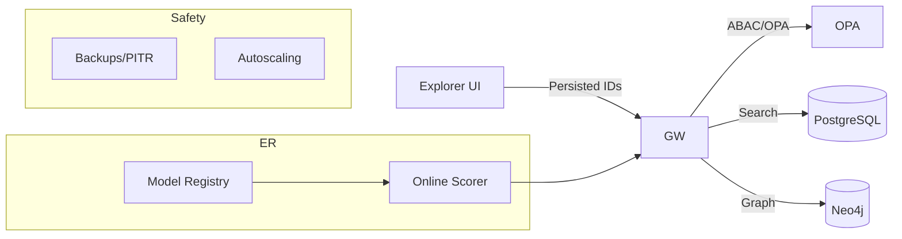

```markdown
---
slug: intelgraph-mc-sprint-2025-11-12
version: v1.0
created: 2025-09-29
sprint_window: 2025-11-12 → 2025-11-25 (2 weeks)
release_cadence: weekly cut → staging; biweekly → prod
owners:
  - product: PM (R), MC (A)
  - delivery: Tech Lead (A), Platform (R), Backend (R), Data Eng (R), DS (R), SRE (R), Sec (R), QA (R)
status: planned
---

# IntelGraph Maestro Conductor — Sprint Plan (2025‑11‑12 → 2025‑11‑25)

> **Mission (Sprint N+3)**: Productize ER for GA, ship end‑user search & graph UX, introduce API versioning/deprecations, SOC 2 readiness pack, and harden backups/restore + autoscaling. Keep SLOs/cost guardrails green and deliver evidence bundle v4.

## Conductor Summary (Commit)
**Assumptions & Provenance**
- Builds on prior sprints through 2025‑11‑11 prod release: DR validated, JDBC adapters, ER v0.2 shadow, GDS analytics v0.1.
- Summit bundles still pending import; placeholders marked _[ATTACH FROM SUMMIT BUNDLE]_.

**Goals**
1. **ER GA (v1.0)**: approve flow, rollbacks, model registry, thresholds per tenant.
2. **Search & Explore**: Graph search API (hybrid keyword + attribute filters) and React explorer slice (Cytoscape).
3. **API Versioning**: GraphQL schema versioning policy, deprecations, and compatibility tests.
4. **SOC 2 Readiness Pack**: controls mapping, audit log coverage, access reviews, evidence export.
5. **Data Safety**: backups/restore runbooks (PG/Neo4j), PITR tests, autoscaling policies.
6. **FinOps polish**: tenant budgets enforcement in UI + alerts; LLM spend caps visible to admins.

**Non‑Goals**
- Advanced text search (vector/embedding) beyond keyword + filters.
- Cross‑cloud DR.

**Constraints**
- SLOs unchanged and enforced as gates. DR/RTO/RPO from last sprint maintained.
- Cost guardrails unchanged; alert at 80% burn.

**Risks**
- R1: ER rollouts cause merge regressions. _Mitigation_: staged rollout per tenant, rollback tooling.
- R2: Schema deprecations break clients. _Mitigation_: contract tests + safelist validation.
- R3: Backup/restore window impacts SLOs. _Mitigation_: throttle + maintenance windows.

**Definition of Done**
- ER v1.0 enabled for at least 2 pilot tenants with rollback tested; Search/Explorer shipped behind feature flag; API v1 deprecations published with tests; SOC 2 evidence pack v1 exported; backup/restore drills pass with signed timings; autoscaling policies deployed.

---

## Swimlanes
- **Lane A — ER GA** (DS + Backend)
- **Lane B — Search & Explorer** (Frontend + Backend)
- **Lane C — API Versioning** (Backend + QA)
- **Lane D — SOC 2 Pack** (Security + SRE + MC)
- **Lane E — Data Safety & Scaling** (Platform + SRE)
- **Lane F — FinOps & Admin UX** (SRE + Frontend)

---

## Backlog (Epics → Stories → Tasks) + RACI
Estimates in SP.

### EPIC A: ER GA v1.0 (32 SP)
- **A‑1** Model registry & pinning (8 SP) — _Backend (R), DS (C), MC (A)_
  - AC: model artifacts have SHA, metadata, provenance; rollout per tenant.
- **A‑2** Tenant thresholds & policies (8 SP) — _Backend (R), Sec (C)_
  - AC: thresholds in policy; purpose tags enforced to materialize.
- **A‑3** Rollback & audit (8 SP) — _Backend (R)_
  - AC: reverse merges by cluster; signed audit events.
- **A‑4** UI decision center (8 SP) — _Frontend (R)_
  - AC: approve/reject, diffs, provenance panel.

### EPIC B: Search & Explorer v0.9 (28 SP)
- **B‑1** Search API (keyword + filters) (10 SP) — _Backend (R)_
  - AC: cursor pagination, p95 ≤ 350 ms, persisted query.
- **B‑2** Explorer React slice (Cytoscape) (10 SP) — _Frontend (R)_
  - AC: node/edge styling, hop controls, selection panel.
- **B‑3** Access controls (8 SP) — _Sec (A), Backend (R)_
  - AC: ABAC per field/edge; redaction in UI.

### EPIC C: API Versioning & Compat (22 SP)
- **C‑1** Versioning policy & headers (6 SP) — _Backend (R), MC (A)_
- **C‑2** Deprecation markers (6 SP) — _Backend (R)_
- **C‑3** Contract tests & safelist verifier (10 SP) — _QA (R), Backend (C)_

### EPIC D: SOC 2 Readiness Pack (24 SP)
- **D‑1** Control mapping (CC1–CC9, CC6.3 etc.) (8 SP) — _Sec (R)_
- **D‑2** Audit log coverage & retention (8 SP) — _Backend (R)_
- **D‑3** Access review workflow + evidence export (8 SP) — _Sec (R), SRE (C)_

### EPIC E: Data Safety & Scaling (26 SP)
- **E‑1** PG/Neo4j PITR & restore drills (10 SP) — _Platform (R), SRE (A)_
  - AC: recovery ≤ 30 min; data checksums verified.
- **E‑2** HPA/VPA autoscaling policies (8 SP) — _SRE (R)_
  - AC: scale on RPS/CPU/queue depth; no thrash.
- **E‑3** Backup policy codified (8 SP) — _SRE (R), Sec (C)_
  - AC: schedules, encryption, retention tiers.

### EPIC F: FinOps & Admin UX (18 SP)
- **F‑1** Budget alerts to Slack/Email (6 SP) — _SRE (R)_
- **F‑2** Admin UI caps (6 SP) — _Frontend (R)_
- **F‑3** Cost drill‑downs (6 SP) — _Backend (R), PM (C)_

_Total_: **150 SP** (descope: C‑2 or F‑3 if capacity < 135 SP).

---

## Architecture (Deltas)


**ADR‑010**: Introduce API versioning via schema docs + deprecation windows; clients negotiate via safelisted op IDs. _Trade‑off_: management overhead vs stability.

**ADR‑011**: Search indexes hosted in PG (GIN) with keyword + attribute filters; avoid vector search until phase‑next. _Trade‑off_: lower recall for fuzzy text.

**ADR‑012**: Model registry with content‑addressed storage; rollout by tenant. _Trade‑off_: complexity vs reproducibility.

---

## Data & Policy
**Search Index (PG)**
```sql
ALTER TABLE entity_text ADD COLUMN tsv tsvector;
CREATE INDEX entity_text_tsv_idx ON entity_text USING GIN(tsv);
CREATE FUNCTION entity_text_update() RETURNS trigger LANGUAGE plpgsql AS $$
BEGIN NEW.tsv := to_tsvector('simple', coalesce(NEW.text,'')); RETURN NEW; END; $$;
CREATE TRIGGER entity_text_tsv_trg BEFORE INSERT OR UPDATE ON entity_text
FOR EACH ROW EXECUTE FUNCTION entity_text_update();
```

**Model Registry (PG)**
```sql
CREATE TABLE model_artifacts (
  model_id TEXT PRIMARY KEY,
  sha256 TEXT NOT NULL,
  created_at TIMESTAMPTZ DEFAULT now(),
  uri TEXT NOT NULL,
  metadata JSONB
);
```

**Policy Delta**
- ER materialization requires `purpose ∈ {investigation, fraud-risk}` and tenant threshold satisfied.
- Audit logs retained `standard-365d`; access reviews `long-1825d` or `legal-hold` when applicable.

---

## APIs & Schemas
**GraphQL — Search & Versioning**
```graphql
"""API version advertised via schema and response headers"""
scalar DateTime

type SearchHit { id: ID!, kind: String!, score: Float, snippet: String }

type Query {
  search(q: String!, filters: JSON, after: String): SearchResult! @auth(abac: "entity.search")
  apiVersion: String!
}

type SearchResult { hits: [SearchHit!]!, nextCursor: String }
```

**Response Headers**
- `x-ig-api-version: v1`
- `x-ig-deprecations: entity.attributes.value (EOL 2026‑03‑31)`

**Persisted Query Example**
```json
{ "id":"search:v1", "hash":"sha256-...", "abac":["entity.search"], "roles":["reader"] }
```

---

## Security & Privacy
- **Access Reviews**: quarterly; export CSV + signed manifest.
- **Audit Coverage**: login, policy decision, ER approve/reject, search queries (hash only), admin cap changes.
- **Crypto**: backup encryption at rest + in transit; signed restore proof.

**OPA (deprecation access guard)**
```rego
package intelgraph.schema

allow_field(field) {
  not deprecated(field)
}

deprecated(field) {
  field == "Attribute.value"
}
```

---

## Observability & SLOs
- New metrics: search latency p95/p99; index bloat; ER materialization rate; backup duration; restore RTO; autoscaler actions/min.
- Alerts: search p95 > 350 ms 10m; restore > 30 min; autoscaler thrash (>5 scale ops/10m); access review overdue.

---

## Testing Strategy
- **Unit**: search ranking, pagination; model registry; rollback logic.
- **Contract**: deprecation headers, version negotiation; search persisted queries.
- **E2E**: ER approve→merge→rollback; backup/restore drill; admin caps.
- **Load**: search 10 RPS sustained; ensure SLOs.
- **Chaos**: index bloat and vacuum; scorer unavailability fallback → rules.

**Acceptance Packs**
- Given tenant threshold and purpose tag, ER materializes with signed provenance; rollback restores prior state.
- Given search term with filters, results paginated and p95 ≤ 350 ms; ABAC enforced.
- Given restore drill, RTO ≤ 30 min, checksum OK.
- Given admin budget cap > usage, alerts at 80%; overage blocked.

---

## CI/CD & IaC
```yaml
name: api-versioning
on: [push]
jobs:
  compat:
    runs-on: ubuntu-latest
    steps:
      - uses: actions/checkout@v4
      - run: npm ci
      - run: npm run schema:check && npm run safelist:verify
```

**Helm Values (autoscaling)**
```yaml
resources:
  requests: { cpu: "250m", memory: "512Mi" }
  limits: { cpu: "2", memory: "2Gi" }
autoscaling:
  enabled: true
  minReplicas: 3
  maxReplicas: 12
  targetCPUUtilizationPercentage: 65
  behavior:
    scaleDown:
      stabilizationWindowSeconds: 300
```

---

## Code & Scaffolds
```
repo/
  services/er/
    registry.ts
    rollout.ts
    rollback.ts
  services/search/
    api.ts
    sql.ts
    persisted.json
  frontend/explorer/
    Explorer.tsx
    components/DecisionCenter.tsx
  ops/backup/
    runbook.md
    pitr.sh
  ops/autoscale/
    values.yaml
```

**Search SQL (excerpt)**
```sql
SELECT id, kind, ts_rank(tsv, plainto_tsquery($1)) AS score
FROM entity_text
WHERE tenant_id = $tenant
  AND tsv @@ plainto_tsquery($1)
ORDER BY score DESC
LIMIT $limit OFFSET $offset;
```

**Explorer React (excerpt)**
```tsx
import CytoscapeComponent from 'react-cytoscapejs';
export default function Explorer(){
  return (
    <div className="p-4">
      <CytoscapeComponent elements={[]} stylesheet={[]} style={{ height: 600 }} />
    </div>
  );
}
```

**PITR script (bash excerpt)**
```bash
# assume WAL archiving enabled
ts=$(date -u +%Y%m%dT%H%M%SZ)
pg_basebackup -D /backup/$ts -X stream -C -S ig_slot
# restore test
pg_ctl -D /restore/$ts start
psql -c 'SELECT 1';
```

---

## Release Plan & Runbooks
- **Staging cuts**: 2025‑11‑15, 2025‑11‑22.
- **Prod**: 2025‑11‑25 (canary 10% → 50% → 100%).

**Backout**
- Disable ER GA (revert to v0.2 shadow), hide Search/Explorer behind flag, pause deprecations.

**Evidence Bundle v4**
- Model registry manifest + SHA; ER approval logs; search perf reports; deprecation compat results; backup/restore timings; autoscaling policy and events; signed manifest.

---

## RACI (Consolidated)
| Workstream | R | A | C | I |
|---|---|---|---|---|
| ER GA | Backend | MC | DS, Sec | PM |
| Search & Explorer | Frontend | Tech Lead | Backend, Sec | PM |
| API Versioning | Backend | MC | QA | PM |
| SOC 2 Pack | Security | MC | SRE | PM |
| Safety & Scaling | Platform | SRE TL | Sec | PM |
| FinOps UX | SRE | PM | Frontend | All |

---

## Open Items
1. Attach UI wireframes for Explorer & Decision Center _[ATTACH FROM SUMMIT BUNDLE]_.
2. Confirm deprecation timeline with top clients.
3. Verify backup storage costs vs budget.

```

