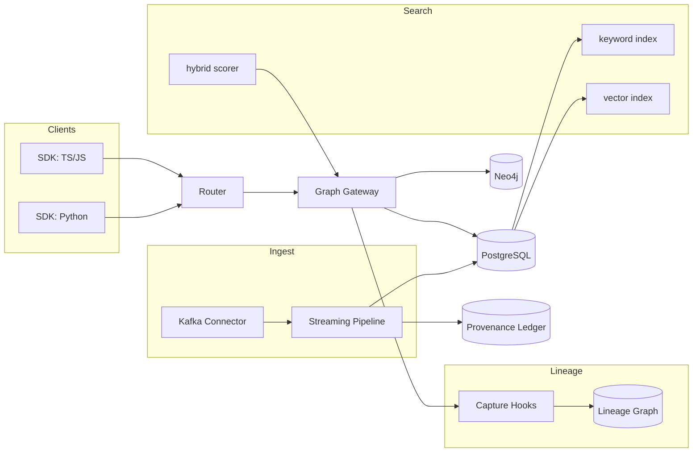

```markdown
---
slug: intelgraph-mc-sprint-2025-11-26
version: v1.0
created: 2025-09-29
sprint_window: 2025-11-26 → 2025-12-09 (2 weeks)
release_cadence: weekly cut → staging; biweekly → prod
owners:
  - product: PM (R), MC (A)
  - delivery: Tech Lead (A), Platform (R), Backend (R), Data Eng (R), DS (R), SRE (R), Sec (R), QA (R), Frontend (R)
status: planned
---

# IntelGraph Maestro Conductor — Sprint Plan (2025‑11‑26 → 2025‑12‑09)

> **Mission (Sprint N+4)**: Level‑up productization: SDKs & samples, vector‑ready search preview, streaming ingest (Kafka) slice, lineage/impact views, automated compliance evidence, and blue/green deployments—maintaining SLOs/cost guardrails and issuing evidence bundle v5.

## Conductor Summary (Commit)
**Assumptions & Provenance**
- Builds on 2025‑11‑12 sprint (ER GA, Search/Explorer, API versioning, SOC 2 pack, backups/autoscaling).
- Summit bundles still pending import; placeholders _[ATTACH FROM SUMMIT BUNDLE]_ retained.

**Goals**
1. **Client SDKs v1**: TS/JS & Python SDKs with persisted‑query transport, retries, and auth helpers + sample apps.
2. **Search v1 Preview (Hybrid)**: optional vector scoring (faiss/pgvector) behind flag, with fallbacks to keyword.
3. **Streaming Ingest (Kafka) v0.9**: connector and pipeline contracts; exactly‑once semantics per partition; provenance.
4. **Lineage & Impact v0.1**: graph lineage model + UI pane; change impact checks in CI for schemas/policies.
5. **Compliance Automation**: policy simulation auto‑attach to PRs; SOC 2 evidence exporter v1.1.
6. **Blue/Green Deploys**: gateway + router blue/green with traffic weights; automated smoke & rollback.

**Non‑Goals**
- Cross‑tenant joins; cross‑cloud portability; advanced vector rerank models.

**Constraints**
- SLOs unchanged; Search vector mode must keep p95 ≤ 450 ms read (pilot tenants only).
- Cost guardrails unchanged; vector index build limited to off‑peak windows.

**Risks**
- R1: Vector preview impacts latency. _Mitigation_: small index per tenant, ANN recall tuning, hard timeouts → fallback.
- R2: Kafka EO/EO semantics complexity. _Mitigation_: idempotent producers, transactional consumers, compaction.
- R3: Blue/green drift. _Mitigation_: env parity checks + schema diff gate.

**Definition of Done**
- SDKs published (npm/pypi private) with samples; vector preview gated & measurable; Kafka connector processes ≥ 1,000 events/s/pod with p95 processing ≤ 100 ms; lineage panel live; compliance exporter embedded in CI; blue/green flow executed in staging with signed evidence.

---

## Swimlanes
- **Lane A — SDKs & Samples** (Frontend + Backend)
- **Lane B — Search Vector Preview** (Backend + DS)
- **Lane C — Streaming Ingest (Kafka)** (Data Eng + Platform)
- **Lane D — Lineage & Impact** (Backend + Frontend)
- **Lane E — Compliance Automation** (Security + MC + QA)
- **Lane F — Blue/Green & Release Ops** (SRE + Platform)

---

## Backlog (Epics → Stories → Tasks) + RACI
Estimates in SP.

### EPIC A: Client SDKs v1 (30 SP)
- **A‑1** TS/JS SDK (12 SP) — _Frontend (R), TL (A)_
  - AC: persisted‑query client, retries/jitter, auth helpers (OIDC/JWT), TS types from SDL.
- **A‑2** Python SDK (10 SP) — _Backend (R)_
- **A‑3** Sample Apps (8 SP) — _Frontend (R), PM (C)_ — _[ATTACH FROM SUMMIT BUNDLE]_

### EPIC B: Search v1 Preview (Hybrid) (28 SP)
- **B‑1** pgvector/FAISS indexer (10 SP) — _Backend (R), DS (C)_
  - AC: off‑peak build; tenant‑scoped; fallback on timeout > 150 ms vector stage.
- **B‑2** Hybrid scorer (8 SP)
  - AC: `score = α*keyword + (1-α)*vector`; α configurable; p95 ≤ 450 ms.
- **B‑3** Feature flag & metrics (10 SP) — _SRE (R)_

### EPIC C: Streaming Ingest (Kafka) v0.9 (34 SP)
- **C‑1** Kafka connector (idempotent) (12 SP) — _Data Eng (R)_
- **C‑2** Exactly‑once pipeline (12 SP) — _Platform (R)_
  - AC: transactional consumption, outbox pattern; duplicates ≤ 1e‑6.
- **C‑3** Conformance & soak (10 SP) — _QA (R)_

### EPIC D: Lineage & Impact v0.1 (24 SP)
- **D‑1** Lineage schema + capture hooks (10 SP) — _Backend (R), MC (C)_
- **D‑2** Impact checks in CI (6 SP) — _QA (R)_
- **D‑3** UI panel in Explorer (8 SP) — _Frontend (R)_

### EPIC E: Compliance Automation (20 SP)
- **E‑1** Policy sim on PRs (8 SP) — _Sec (R), QA (C)_
- **E‑2** SOC 2 exporter v1.1 (8 SP) — _Sec (R), MC (A)_
- **E‑3** Access review reminders (4 SP) — _SRE (R)_

### EPIC F: Blue/Green Deploys (18 SP)
- **F‑1** Traffic weights + probes (10 SP) — _SRE (R)_
- **F‑2** Auto‑rollback on guard breach (8 SP) — _SRE (R)_

_Total_: **154 SP** (descope candidates: B‑2 or D‑3 if capacity < 135 SP).

---

## Architecture (Deltas)


**ADR‑013**: Hybrid search introduces vector stage with strict time budget and fallback. _Trade‑off_: better relevance vs complexity.

**ADR‑014**: Kafka EO/EO via outbox + transactions. _Trade‑off_: throughput overhead for consistency.

**ADR‑015**: Lineage captured as first‑class graph; CI checks block breaking changes. _Trade‑off_: slower PRs vs safety.

---

## Data & Policy
**Lineage (Neo4j)**
- `(:Dataset {id, tenant_id, purpose[], retention})`
- `(:Process {id, name, version})`
- `(:Run {id, started_at, ended_at, status})`
- Relationships: `(:Dataset)-[:INPUT_OF]->(:Process)`, `(:Process)-[:OUTPUT_OF]->(:Dataset)`, `(:Process)-[:HAS_RUN]->(:Run)`

**PG: Vector Support (pgvector)**
```sql
CREATE EXTENSION IF NOT EXISTS vector;
ALTER TABLE entity_text ADD COLUMN embedding vector(768);
CREATE INDEX entity_text_embedding_idx ON entity_text USING ivfflat (embedding vector_cosine_ops) WITH (lists = 100);
```

**Kafka Offsets (PG)**
```sql
CREATE TABLE kafka_offsets (
  tenant_id UUID,
  topic TEXT,
  partition INT,
  offset BIGINT,
  PRIMARY KEY (tenant_id, topic, partition)
);
```

**Policy Delta**
- Vector embeddings treated as **Restricted‑TOS** unless source license is **Open‑Data‑OK**.
- Lineage retained `standard-365d`; runs `short-30d` unless legal‑hold.

---

## APIs & Schemas
**GraphQL — SDK Support & Lineage**
```graphql
type LineageEdge { from: ID!, to: ID!, kind: String! }

type LineageResult { nodes: [ID!]!, edges: [LineageEdge!]! }

extend type Query {
  lineage(datasetId: ID!, maxDepth: Int = 3): LineageResult! @auth(abac: "lineage.read")
}
```

**Hybrid Search Persisted Spec**
```json
{
  "id":"searchHybrid:v1",
  "hash":"sha256-...",
  "abac":["entity.search"],
  "flags":["vector-preview"],
  "timeoutMs": 450
}
```

---

## Security & Privacy
- **Auth**: SDKs read tokens from env/keystore; rotate via OIDC refresh.
- **Privacy**: embeddings redacted from logs; lineage shows IDs only unless user has clearance.
- **Crypto**: Kafka credentials in secrets; TLS for brokers.

---

## Observability & SLOs
- Metrics: vector stage latency, fallback rate, Kafka lag/throughput, EO/EO duplicates, lineage capture rate, blue/green health, SDK error rate.
- Alerts: vector stage p95 > 150 ms 10m; Kafka consumer lag > 60s; EO/EO duplicates > 1e‑5; blue/green rollback trigger; SDK error > 2%.

---

## Testing Strategy
- **Unit**: SDK transports, retry logic; lineage capture; vector indexers.
- **Contract**: lineage API; hybrid search.
- **E2E**: Kafka → pipeline → ledger → query; blue/green cutover with rollback.
- **Load**: vector preview @ 10 RPS; Kafka @ 2,000 msgs/s; ensure SLOs.
- **Chaos**: broker partition; vector index corruption (rebuild path).

**Acceptance Packs**
- Given vector flag on, search latency p95 ≤ 450 ms and fallback < 20%; ABAC enforced.
- Given Kafka topic with 1M events, pipeline processes ≥ 1,000 events/s/pod, p95 processing ≤ 100 ms, duplicates ≤ 1e‑6.
- Given schema change PR breaking downstream, lineage impact gate blocks merge.
- Given blue/green deploy, automatic rollback occurs on SLO breach; evidence saved.

---

## CI/CD & IaC
```yaml
name: blue-green
on: [workflow_dispatch]
jobs:
  deploy:
    runs-on: ubuntu-latest
    steps:
      - uses: actions/checkout@v4
      - run: helm upgrade --install gw-blue charts/gw -f overlays/blue.yaml
      - run: helm upgrade --install gw-green charts/gw -f overlays/green.yaml
      - run: kubectl -n edge apply -f traffic-split.yaml
      - run: npm run smoke:gw && npm run slo:check || ./ops/rollback.sh
```

**Terraform (Kafka)**
```hcl
module "kafka" {
  source = "./modules/kafka"
  brokers = 3
  tls     = true
  auth    = "scram"
}
```

---

## Code & Scaffolds
```
repo/
  sdks/
    js/
      src/index.ts
      package.json
    python/
      intelgraph/__init__.py
      setup.py
  search/
    vector/
      indexer.ts
      hybrid.ts
  ingest/
    kafka/
      connector.ts
      pipeline.ts
  lineage/
    capture.ts
    api.ts
  ops/deploy/
    traffic-split.yaml
    rollback.sh
  compliance/
    exporter.ts
    github-action.yml
```

**JS SDK (excerpt)**
```ts
export class IGClient {
  constructor(private opts:{endpoint:string, token:string}){}
  async exec(id:string, vars:any){
    const res = await fetch(this.opts.endpoint, { method:'POST', headers:{'authorization':`Bearer ${this.opts.token}`,'content-type':'application/json'}, body: JSON.stringify({ id, vars })});
    if(!res.ok) throw new Error(`HTTP ${res.status}`);
    return res.json();
  }
}
```

**Hybrid scorer (TS)**
```ts
export function hybridScore(kw:number, vec:number, alpha=0.7){ return alpha*kw + (1-alpha)*vec; }
```

**Kafka pipeline (TS excerpt)**
```ts
const consumer = createTransactionalConsumer({ groupId:'ingest', isolationLevel:'read_committed' });
for await (const msg of consumer) {
  await withTransaction(async (tx)=>{
    await upsertEvent(tx, msg);
    await ledger(tx, msg);
  });
}
```

**Lineage capture (TS)**
```ts
export function capture(run:{processId:string, inputs:string[], outputs:string[]}){ /* write nodes/edges */ }
```

---

## Release Plan & Runbooks
- **Staging cuts**: 2025‑11‑29, 2025‑12‑06.
- **Prod**: 2025‑12‑09 (canary 10→50→100%).

**Backout**
- Disable vector preview; pause Kafka consumers; revert traffic split to stable; remove lineage CI gate.

**Evidence Bundle v5**
- SDK publish logs & SHAs; hybrid search perf; Kafka EO/EO proof; lineage impact reports; blue/green logs; signed manifest.

---

## RACI (Consolidated)
| Workstream | R | A | C | I |
|---|---|---|---|---|
| SDKs | Frontend | Tech Lead | Backend | PM |
| Search Vector | Backend | MC | DS, SRE | PM |
| Kafka Ingest | Data Eng | Platform TL | SRE | QA |
| Lineage | Backend | MC | Frontend | PM |
| Compliance Auto | Security | MC | QA | PM |
| Blue/Green | SRE | Platform TL | Backend | All |

---

## Open Items
1. Confirm vector dimensions & model sources _[ATTACH FROM SUMMIT BUNDLE]_.
2. Tenant pilot list for vector preview.
3. Kafka topic retention/compaction policy with FinOps.

```

