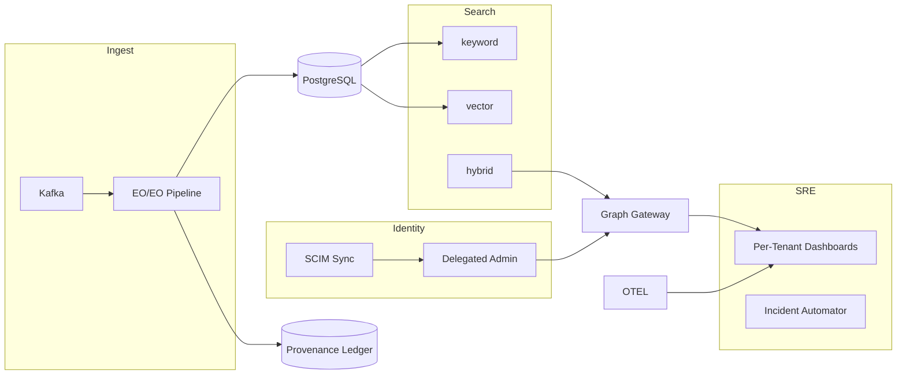

````markdown
---
slug: intelgraph-mc-sprint-2025-12-10
version: v1.0
created: 2025-09-29
sprint_window: 2025-12-10 → 2025-12-23 (2 weeks)
release_cadence: weekly cut → staging; biweekly → prod
owners:
  - product: PM (R), MC (A)
  - delivery: Tech Lead (A), Platform (R), Backend (R), Data Eng (R), DS (R), SRE (R), Sec (R), QA (R), Frontend (R)
status: planned
---

# IntelGraph Maestro Conductor — Sprint Plan (2025‑12‑10 → 2025‑12‑23)

> **Mission (Sprint N+5)**: Graduate **Kafka ingest** and **Hybrid Search** from preview to **GA** for pilot tenants; roll out **Delegated Admin & SCIM**; ship **Tenant‑Scoped Dashboards**, **Access Reviews v2**, and **Post‑Incident Automation**; tighten **cost controls** before year‑end. Evidence bundle v6 included.

## Conductor Summary (Commit)

**Assumptions & Provenance**

- Builds on 2025‑11‑26 sprint (SDKs, vector preview, Kafka v0.9, lineage, compliance, blue/green).
- Summit bundles still pending import; placeholders marked _[ATTACH FROM SUMMIT BUNDLE]_.

**Goals**

1. **Kafka Ingest GA**: EO/EO validated, multi‑tenant quotas, lag auto‑scale.
2. **Hybrid Search GA**: production flags, warm indexes, search analytics, fallback SLAs.
3. **Delegated Admin & SCIM v1**: tenant admin roles, SCIM user/group sync, access review v2.
4. **Tenant Dashboards**: SLO/cost/usage dashboards with budget alerts; shareable to admins.
5. **Post‑Incident Automation**: incident template pack, timeline extractor, evidence auto‑attach.
6. **Year‑End Cost Hardening**: enforce per‑tenant LLM caps; idle down non‑prod; storage lifecycle rules.

**Non‑Goals**

- Cross‑cloud DR, advanced vector rerankers, ML‑based anomaly detection.

**Constraints**

- SLOs unchanged and must hold under GA traffic.
- Cost guardrails unchanged; tenant caps visible/enforced.

**Risks**

- R1: GA traffic reveals Kafka partition hotspots. _Mitigation_: rebalancing + partitioning keys guidance.
- R2: Search index bloat. _Mitigation_: scheduled VACUUM/REINDEX; retention aware.
- R3: SCIM mis‑mapping. _Mitigation_: dry‑run mode + mapping tests + rollback.

**Definition of Done**

- Kafka GA: ≥ 1,000 events/s/pod sustained, duplicates ≤ 1e‑6, lag < 60s p95; Search GA: p95 ≤ 450 ms with fallback < 20%; Delegated Admin live for 2 tenants; dashboards delivered; post‑incident pack used in at least 1 drill; cost caps enforced.

---

## Swimlanes

- **Lane A — Kafka GA** (Data Eng + Platform)
- **Lane B — Search GA** (Backend + DS + SRE)
- **Lane C — Identity & Admin** (Security + Backend)
- **Lane D — Dashboards & FinOps** (SRE + PM)
- **Lane E — Incidents & Evidence** (SRE + MC + QA)
- **Lane F — QA & Release** (QA + PM)

---

## Backlog (Epics → Stories → Tasks) + RACI

Estimates in SP.

### EPIC A: Kafka Ingest GA (34 SP)

- **A‑1** Partitioning strategy & rebalancing (10 SP) — _Data Eng (R), Platform (A)_
  - AC: docs + helper; hot partition alerting.
- **A‑2** Lag‑aware autoscaling (10 SP) — _SRE (R)_
  - AC: HPA signals on lag/CPU; no thrash.
- **A‑3** Quotas & rate limits per tenant (8 SP) — _Backend (R)_
  - AC: 429 with Retry‑After; metrics exported.
- **A‑4** GA runbook & chaos (6 SP) — _SRE (R), QA (C)_

### EPIC B: Hybrid Search GA (30 SP)

- **B‑1** Warm indexer + rotation (10 SP) — _Backend (R)_
  - AC: off‑peak builds; stale index rotation < 24h.
- **B‑2** Analytics & quality (10 SP) — _DS (R)_
  - AC: CTR, zero‑result rate, fallback rate tracked; search AB test harness.
- **B‑3** Feature flag graduation (10 SP) — _SRE (R)_
  - AC: per‑tenant toggles → global.

### EPIC C: Delegated Admin & SCIM v1 (32 SP)

- **C‑1** Roles: tenant‑admin, auditor, analyst (8 SP) — _Sec (R), Backend (C)_
- **C‑2** SCIM user/group sync (12 SP) — _Backend (R), Sec (A)_
  - AC: dry‑run + apply; mapping tests; rollback.
- **C‑3** Access Review v2 (12 SP) — _Sec (R), SRE (C)_
  - AC: quarterly schedule; attestations; evidence export.

### EPIC D: Tenant Dashboards & Budgets (22 SP)

- **D‑1** SLO/usage dashboard per tenant (10 SP) — _SRE (R)_
- **D‑2** Cost burn & LLM caps UI (6 SP) — _Frontend (R)_
- **D‑3** Alerts/notifications (6 SP) — _SRE (R)_

### EPIC E: Post‑Incident Automation (18 SP)

- **E‑1** Incident templates & runbooks (8 SP) — _SRE (R), MC (C)_
- **E‑2** Timeline extractor + evidence (10 SP) — _Backend (R), QA (C)_

### EPIC F: QA & Release (16 SP)

- **F‑1** Conformance & soak (8 SP) — _QA (R)_
- **F‑2** Evidence bundle v6 (8 SP) — _MC (R)_

_Total_: **152 SP** (descope: B‑2 or D‑3 if capacity < 135 SP).

---

## Architecture (Deltas)


````

**ADR‑016**: GA graduation for search requires guardrails (timeouts, fallbacks, analytics). _Trade‑off_: complexity vs UX.

**ADR‑017**: SCIM as source of truth for users/groups, with dry‑run to prevent destructive syncs. _Trade‑off_: slower rollouts vs safety.

---

## Data & Policy

**SCIM Mapping (PG)**

```sql
CREATE TABLE scim_mappings (
  tenant_id UUID,
  scim_attr TEXT,
  local_attr TEXT,
  transform TEXT,
  PRIMARY KEY (tenant_id, scim_attr)
);
```

**Budgets & Caps (PG)**

```sql
CREATE TABLE tenant_budgets (
  tenant_id UUID PRIMARY KEY,
  monthly_cap_usd NUMERIC NOT NULL,
  llm_cap_usd NUMERIC NOT NULL,
  updated_at TIMESTAMPTZ DEFAULT now()
);
```

**Policy Delta**

- Only tenant‑admin may change budgets/caps; changes audited and signed.
- Search logs keep hashes only; no raw queries in logs.

---

## APIs & Schemas

**GraphQL — Admin & Dashboards**

```graphql
type Budget {
  monthlyCapUSD: Float!
  llmCapUSD: Float!
}

type TenantMetrics {
  apiP95: Float!
  ingestThroughput: Float!
  searchP95: Float!
  costMTD: Float!
}

type Query {
  tenantMetrics(tenantId: ID!): TenantMetrics! @auth(abac: "metrics.read")
}

type Mutation {
  setTenantBudget(tenantId: ID!, budget: Budget!): Boolean
    @auth(abac: "admin.write")
}
```

**SCIM Endpoint (REST)**

```
POST /scim/v2/Users
POST /scim/v2/Groups
```

---

## Security & Privacy

- **AuthZ**: new scopes `admin.write`, `metrics.read`.
- **SCIM**: signature verification; mapping tests; rollback on anomaly.
- **Privacy**: search telemetry sampled, PII scrubbed; budgets visible only to admins.

---

## Observability & SLOs

- Metrics: Kafka lag, duplicates, autoscale events; search fallback %, zero‑result rate; SCIM changes; budget burn.
- Alerts: lag > 60s; fallback > 20%; SCIM error > 1%; cost burn > 80% mid‑cycle.

---

## Testing Strategy

- **Unit**: SCIM transforms; budget mutations; index rotation.
- **Contract**: SCIM, admin APIs; search GA manifest.
- **E2E**: partition rebalancing; lag autoscale; admin dashboards; incident timeline export.
- **Load**: Kafka 2,000 msgs/s; search 10 RPS; admin mutations under contention.
- **Chaos**: broker outage; SCIM bad payloads; budget cap breach simulation.

**Acceptance Packs**

- Kafka GA: throughput, duplicates, lag ACs pass with signed evidence.
- Search GA: p95 ≤ 450 ms, fallback < 20%, analytics populated.
- Admin & SCIM: dry‑run shows diffs; apply executes; rollback restores.
- Budgets: alerts at 80%; hard cap blocks overage with clear error.

---

## CI/CD & IaC

```yaml
name: ga-grad
on: [push]
jobs:
  checks:
    runs-on: ubuntu-latest
    steps:
      - uses: actions/checkout@v4
      - run: npm ci && npm test
      - run: npm run policy:sim
      - run: npm run slo:check
  deploy-staging:
    needs: checks
    steps:
      - run: helm upgrade --install search charts/search -f overlays/staging.yaml
      - run: helm upgrade --install ingest charts/ingest -f overlays/staging.yaml
```

**Helm Values — Kafka Autoscale (excerpt)**

```yaml
autoscaling:
  enabled: true
  minReplicas: 2
  maxReplicas: 12
metrics:
  lagThreshold: 60
```

---

## Code & Scaffolds

```
repo/
  identity/scim/
    server.ts
    mapping.test.ts
  admin/
    budgets.ts
    metrics.ts
  search/ga/
    rotate.ts
    analytics.ts
  ingest/kafka/
    autoscale.ts
    quotas.ts
  sre/incidents/
    template.md
    extractor.ts
```

**SCIM Server (excerpt)**

```ts
app.post('/scim/v2/Users', verifySig, dryRunGuard, handleUser);
app.post('/scim/v2/Groups', verifySig, dryRunGuard, handleGroup);
```

**Quota middleware (TS)**

```ts
export function enforceQuota(tenant: string, cost: number) {
  const b = getBudget(tenant);
  if (b.costMonthToDate + cost > b.monthlyCapUSD)
    throw new Error('BudgetExceeded');
}
```

---

## Release Plan & Runbooks

- **Staging cuts**: 2025‑12‑13, 2025‑12‑20.
- **Prod**: 2025‑12‑23 (canary 10→50→100%).

**Backout**

- Re‑enable search preview mode; pause Kafka consumers; disable SCIM apply (dry‑run only); freeze admin APIs.

**Evidence Bundle v6**

- Kafka GA soak reports; search GA analytics; SCIM diffs & applies; dashboard screenshots; incident drill artifacts; cost cap enforcement logs; signed manifest.

---

## RACI (Consolidated)

| Workstream           | R        | A           | C        | I   |
| -------------------- | -------- | ----------- | -------- | --- |
| Kafka GA             | Data Eng | Platform TL | SRE      | QA  |
| Search GA            | Backend  | MC          | DS, SRE  | PM  |
| Identity & Admin     | Security | MC          | Backend  | PM  |
| Dashboards & FinOps  | SRE      | PM          | Frontend | All |
| Incidents & Evidence | SRE      | MC          | QA       | PM  |
| QA & Release         | QA       | PM          | MC       | All |

---

## Open Items

1. Partitioning key guidance doc _[ATTACH FROM SUMMIT BUNDLE]_.
2. Tenant list & rollout plan for GA toggles.
3. Validate year‑end budget caps with Finance.

```

```
